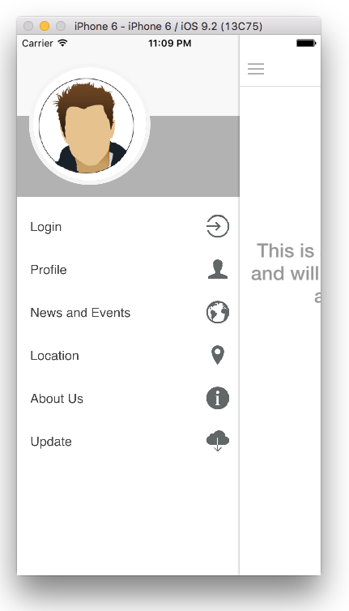
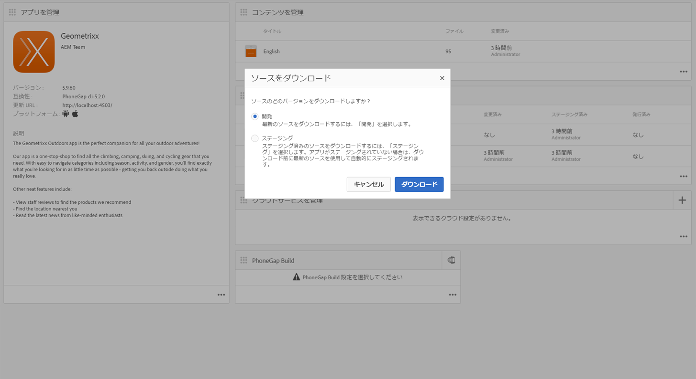

# ハイブリッドアプリの AEM Mobile 対応{#is-your-hybrid-app-ready-for-aem-mobile}

>[!NOTE]
>
>単一ページアプリケーションフレームワークを基にしたクライアント側レンダリング（React など）が必要なプロジェクトでは、SPA エディターを使用することをお勧めします。[詳細情報](/help/sites-developing/spa-overview.md)

ハイブリッド PhoneGap または Cordova アプリを AEM に読み込んだら、次の手順として、オーサリング可能なコンテンツをアプリに追加することができます。このタスクを実行するには、AEM アプリの構造を全般的に理解する必要があります。AEM のアプリは一般に 2 つの部分に分かれています。つまり、「シェル」と「コンテンツ」です。「シェル」は、PhoneGap 設定ファイル、アプリフレームワーク、ナビゲーションコントロールなど、アプリの静的な部分で構成されます。読み込んだアーカイブの内容は、シェルの一部として保存されています。このドキュメントのコンテキストでは、シェルは、アプリ開発者によってビルドされたハイブリッド PhoneGap アプリのコンテンツのうち、AEM 以外で作成されたものすべてです。

コンテンツは、AEM 開発者によってビルドされ、AEM で作成されたコンポーネント、テンプレートおよび作成済みのページを表します。コンテンツは、開発者コンテンツと作成者コンテンツに分類されます。コンポーネント、デザインおよびページテンプレートは開発者によってビルドされるので、開発者コンテンツとみなされます。作成者コンテンツは、コンポーネントやテンプレートを使用して作成されたページです。これらは通常、デザイナーまたはマーケティング担当者によって作成されます。

作成済みの AEM ページをハイブリッドアプリに追加するには、アプリ開発者と AEM 開発者間の連携が必要です。作成済みのコンテンツをアプリ内のどこに追加するにしても、アプリ開発者は、AEM でオーバーレイできる構造にこれらのページをまとめる必要があります。アプリ開発者は、AEM で作成されたコンテンツが追加される場所へのパスを AEM 開発者に提供して、AEM 開発者がページコンテンツを作成した後で置換されるプレースホルダーページをハイブリッドアプリで提供できる必要があります。

この後の説明を容易にするために、AEM Marketing Cloud：AEM Mobile Hybrid Reference を使用して、この概念について説明します。Hybrid Reference App には、サイドメニュー付きのようこそページがあります。

この例では、アプリケーションのようこそページを作成します。Taking a look at the source [https://github.com/Adobe-Marketing-Cloud-Apps/aem-mobile-hybrid-reference/blob/master/hybrid-app/www/js/app.js#L75](https://github.com/Adobe-Marketing-Cloud-Apps/aem-mobile-hybrid-reference/blob/master/hybrid-app/www/js/app.js#L75). アプリ開発者がようこそページを定義し、アプリでレンダリングされるページのテンプレートを提供していることがわかります。ここで、アプリ開発者と AEM 開発者が連携して作業する必要があります。Hybrid Reference App のようこそページのテンプレートへのパスは、「content/mobileapps/hybrid-reference-app/en/welcome.template.html」として定義されています。AEM 開発者は同じパスを使用して AEM リポジトリ内にようこそページを作成するので、このパスは非常に重要です。

コンテンツ同期を使用してコンテンツをオーバーレイすることにより、新しいページをハイブリッドアプリに追加できる必要があるので、ハイブリッドアプリと AEM で作成されたコンテンツに同じパスを使用することが重要です。読み込みプロセスの一環としてハイブリッドアプリを AEM に読み込む際に、コンテンツ同期設定をセットアップしています。

アプリダッシュボードで「ソースをダウンロード」を選択すると、それらの ContentSync スクリプトが実行されて、ハイブリッドアプリのアーカイブがアセンブルされます。

ContentSync はまず、アプリで開発されたハイブリッドアプリのすべての内容が保存されているアプリの「シェル」を取り込んだ後、アプリの「コンテンツ」を取り込みます。次に、「コンテンツ」内と同じパスを持つページが「シェル」にある場合、「シェル」下のページが「コンテンツ」下のページに置き換えられます。つまり、Hybrid Reference App のサンプルでは、「content/mobileapps/hybrid-reference-app/en/welcome.template.html」と同じパスを持つページを AEM で作成した場合、ContentSync を実行すると、Hybrid Reference App に含まれていたページが AEM 内のその場所にあるページでオーバーレイされます。オーバーレイは ContentSync によって処理されるので、アプリを使用しているユーザーには、AEM で作成されたコンテンツによるアプリの更新がシームレスに行われ、アプリを再ビルドする必要はありません。この結果、アプリを実行すると、ようこそページは次のように表示されます。

