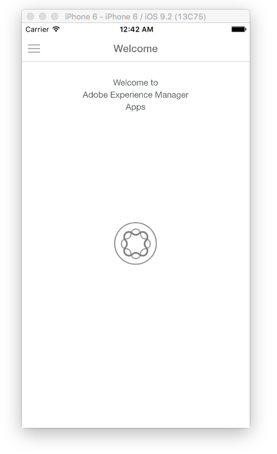

# ハイブリッドアプリのAdobe Experience Manager Mobile対応{#is-your-hybrid-app-ready-for-aem-mobile}

>[!NOTE]
>
>単一ページアプリケーションフレームワークを基にしたクライアントサイドレンダリング（React など）が必要なプロジェクトでは、SPA エディターを使用することをお勧めします。[詳細情報](/help/sites-developing/spa-overview.md)。

Hybrid PhoneGap または Cordova アプリをAEMに読み込んだということですね。 オーサリング可能なコンテンツをアプリに追加する場合があります。 このタスクを実行するには、AEM アプリの構造に関する一般的な知識が必要です。 AEMのアプリは通常、2 つの部分に分かれています。 「シェル」と「コンテンツ」。 「シェル」は、PhoneGap 設定ファイル、アプリフレームワーク、ナビゲーションコントロールなど、アプリの静的部分で構成されます。 インポートしたアーカイブの内容は、シェルの一部として保存されます。 このドキュメントのコンテキストでは、シェルは、アプリ開発者が作成したハイブリッド PhoneGap アプリの、AEMが作成していないすべてのコンテンツです。

コンテンツとは、AEM Developer によって構築されたAEMで作成される、コンポーネント、テンプレートおよび作成されたページを指します。 コンテンツは、開発者向けコンテンツまたは作成したコンテンツとして分類されます。 コンポーネント、デザインおよびページテンプレートは、開発者によって作成されるので、開発コンテンツと見なされます。 オーサーコンテンツは、コンポーネントとテンプレートを使用して作成されたページです。 これらのページは通常、デザイナーまたはマーケターが作成します。

作成したAEM ページをハイブリッドアプリに追加するには、アプリ開発者とAEM開発者の間で調整する必要があります。 作成済みコンテンツを追加するアプリ内の任意の場所で、アプリ開発者は、Experience Managerーでオーバーレイできる構造でこれらのページを整理する必要があります。 アプリ開発者は、Experience Managerが作成したコンテンツが追加されるパスをExperience Manager開発者に提供できる必要があります。 次に、ハイブリッドアプリでプレースホルダーページを提供します。このページは、Experience Manager開発者がページコンテンツをオーサリングした後で置き換えられます。

説明をわかりやすくするために、AEM Experience Cloudが使用されています。概念を説明するためのAEM Mobile ハイブリッドリファレンス。 ハイブリッド参照アプリは、サイドメニューを含むようこそページで構成されています。

この例では、アプリケーションのようこそページを作成します。 ソースの確認 [https://github.com/Adobe-Marketing-Cloud-Apps/aem-mobile-hybrid-reference/blob/master/hybrid-app/www/js/app.js#L75](https://github.com/Adobe-Marketing-Cloud-Apps/aem-mobile-hybrid-reference/blob/master/hybrid-app/www/js/app.js#L75). アプリ開発者は、ようこそページを定義し、アプリによってレンダリングされるページのテンプレートを提供しています。 このページでは、アプリ開発者とAEM開発者が調整する必要があります。 ハイブリッド参照アプリのようこそページテンプレートへのパスは、「content/mobileapps/hybrid-reference-app/en/welcome.template.html」として定義されています。 AEM開発者はAEM リポジトリで同じパスを使用してようこそページを作成するので、このパスは重要です。

ハイブリッドアプリとAEMで作成したコンテンツが同じパスを使用することは重要です。なぜなら、ハイブリッドアプリには、コンテンツ同期を使用してコンテンツをオーバーレイし、新しいページを追加する機能が必要だからです。 ハイブリッドアプリがAEMに読み込まれる際、読み込みプロセスの一環として、コンテンツ同期設定が設定されます。

アプリダッシュボードから「ソースをダウンロード」すると、これらのコンテンツ同期スクリプトが実行されて、ハイブリッドアプリのアーカイブが作成されます。

ContentSync はまず、ハイブリッドアプリのすべてのアプリ開発コンテンツが保存されているアプリの「シェル」を取り込みます。 次に、アプリの「コンテンツ」を取り込みます。 ここで、「shell」内に、「content」内と同じパスを持つページがある場合、「shell」内のページは「content」内のページに（置き換えて）置き換えられます。 そのため、ハイブリッド参照アプリのサンプルでは、パスが「content/mobileapps/hybrid-reference-app/en/welcome.template.html」と同じAEMでページが作成されている場合、ContentSync の実行時に、ハイブリッド参照アプリの一部であったページがオーバーレイされます。 その場所にあるAEM内の内容でオーバーレイされます。 オーバーレイは ContentSync によって処理されるので、アプリを使用しているユーザーにとっては、AEMで作成したコンテンツを含んだアプリのアップデートはシームレスに見え、アプリを再構築する必要はありません。 その結果、アプリケーションを実行すると、ようこそページは次のように表示されます。

