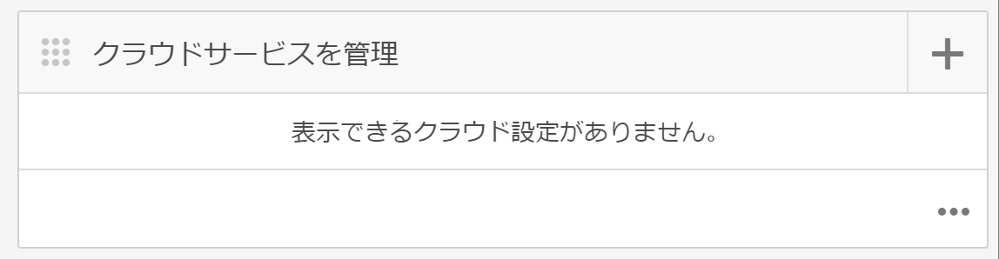
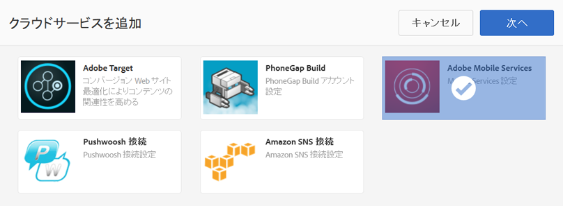
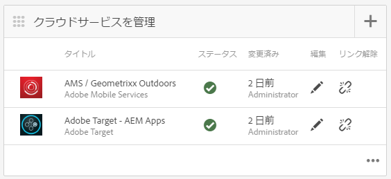

# AEM Mobile のコンテンツパーソナライゼーション{#aem-mobile-content-personalization}

>[!NOTE]
>
>単一ページアプリケーションフレームワークを基にしたクライアント側レンダリング（React など）が必要なプロジェクトでは、SPA エディターを使用することをお勧めします。[詳細情報](/help/sites-developing/spa-overview.md)を参照してください。

>[!NOTE]
>
>This document is part of the [Getting Started with AEM Mobile](/help/mobile/getting-started-aem-mobile.md) Guide, a recommended starting point for AEM Mobile reference.

AEM Mobile のコンテンツパーソナライゼーション機能を使用すると、[AEM 作成者](#author)は、[Adobe Target](https://www.adobe.com/ca/marketing-cloud/testing-targeting.html) を使用してモバイルアプリコンテンツをパーソナライズできます。これにより、ターゲットオファーをモバイルアプリケーションのユーザーに配信できます。Adobe Experience Manager Mobile には、個々の好みに合ったコンテンツをユーザーに提供する、コンテンツの作成、ターゲティングおよび配信機能が用意されています。

AEM ではよくあることですが、作成者がこれらのコンテンツの作成を開始するには、まず、管理者と開発者が環境を準備する必要があります。

[AEM 管理者](#administrator)は、AEM Mobile と Adobe Target クラウドサービス間の接続を確立する必要があります。

一方、AEM Mobile [開発者](#developer)は、ターゲットコンテンツのオーサリングを容易にするために、既存のスクリプトを変更する必要があります。

## 管理者向け {#for-administrators}

コンテンツ作成者がモバイルアプリ用のターゲットコンテンツの生成を開始するには、次の手順を実行する必要があります。ユーザーとグループに適した権限のセットを取得し、クラウドサービスを作成し、アクティビティのアプリケーションを設定し、最後にコンテンツを生成します。

This article will guide you through the process used to configure the [AEM Mobile Hybrid Reference Application](https://github.com/Adobe-Marketing-Cloud-Apps/aem-mobile-hybrid-reference) for targeting.

ここでは、AEM Mobile Hybrid Reference App が正常にデプロイされており、AEM Mobile ダッシュボードからアクセス可能であることを前提としています。

作成者がアプリケーション内でターゲットコンテンツを生成できるようにするには、AEM インスタンスに [Adobe Target クラウドサービスを設定](/help/mobile/aem-mobile-configuring-cloud-service.md)する必要があります。

### 権限 {#permissions}

Users that need access to the personalization console need to be part of the `target-activity-authors` group.

ユーザーおよびグループのセットアップの一環として、target-activity-authors グループを apps-admins グループに追加することをお勧めします。target-activity-authorsグループを追加すると、ユーザーはパーソナライゼーションナビゲーションメニューエントリを表示できます。

>[!NOTE]
>
>パーソナライゼーション管理コンソールへのアクセス権を付与するユーザーまたはグループを target-activity-authors グループに追加し忘れると、パーソナライゼーションコンソールがユーザーに表示されません。

### クラウドサービス {#cloud-services}

モバイルアプリケーションでターゲットコンテンツを機能させるには、次の2つのサービスを設定する必要があります。Adobe targetサービスとAdobe Mobile Servicesサービス。 Adobe targetサービスは、クライアントの要求を処理し、パーソナライズされたコンテンツを返すためのエンジンを提供します。 Adobe Mobile Servicesサービスは、AMS Cordovaプラグインで使用されるADBMobileConfig.jsonファイルを介して、アドビのサービスとモバイルアプリケーションとの接続を提供します。 AEM mobileダッシュボードから、2つのサービスを追加することで、アプリを設定できます。

AEM Mobile ダッシュボードで、「クラウドサービスを管理」を探し、+ ボタンをクリックします。



クラウドサービスを追加ウィザードで、「Adobe Target」クラウドサービスカードを選択し、「次へ」をクリックします。


「設定を選択」ドロップダウンでは、新しい設定を作成することも、既存の設定を選択することもできます。新しい設定を作成するには、ドロップダウンから[設定の作成]を選択します。 Target設定のタイトルを入力します。 Targetアカウントに関連付けられているクライアントコード、電子メール、パスワードを入力します。 これらのフィールドの値が不明な場合は、Adobe targetサポートにお問い合わせください。 「検証」ボタンをクリックして、資格情報を検証します。検証が完了したら、「送信」ボタンをクリックして、クラウドサービスを作成します。

>[!NOTE]
>
>作成されたクラウドサービスは、ウィザードによって自動的にモバイルアプリケーションと関連付けられます。cq:cloudserviceconfigsプロパティの値は、appsグループノードのjcr:contentノードに設定されます。 ハイブリッドアプリのサンプルでは、/etc/cloudservices/testandtarget/adobe-target—aem-apps/frameworkに配置された自動生成フレームワークノードを指す値を使用して、/content/mobileapps/hybrid-reference-app/jcr:contentに設定されます。 フレームワークノードには、デフォルトで設定される 2 つのプロパティ（gender および age）があります。フレームワークは AEM のプレビューのみで使用され、デバイスには影響しません。

ウィザードを完了すると、クラウドサービスを管理タイルに Target クラウドサービスが表示されますが、Adobe Mobile Services アカウントがないという警告が示されています。


### Adobe Mobile Services {#adobe-mobile-services}

Adobe Mobile Services（AMS）アカウントもアプリケーションにリンクする必要があります。AMS サービスは、Target クライアントコード情報を格納する必須の ADBMobileConfig.json ファイルを提供します。AMSアカウントとの関連付けを作成する前に、AMSアカウントに対する権限を持つユーザーがAMSアカウントを変更する必要があります。

### クライアントコード {#client-code}

To login to the AMS services visit [https://mobilemarketing.adobe.com](https://mobilemarketing.adobe.com/), select the mobile application and click the settings. 「SDK targetオプション」フィールドを探し、フィールドにクライアントコードを配置して、「保存」をクリックします。


クライアントコードをモバイルアプリケーションと関連付けると、Adobe Mobile ダッシュボードで AMS クラウドサービスを設定する際に、サービスの設定が ADBMobileConfig.json ファイルから提供されます。

### Adobe Mobile Services クラウドサービス {#adobe-mobile-service-cloud-service}

AMS を設定したら、次は Adobe Mobile ダッシュボードでモバイルアプリケーションを関連付けます。AEM Mobile ダッシュボードで、「クラウドサービスを管理」を探し、+ ボタンをクリックします。


「Adobe Mobile Services」カードを選択し、「次へ」をクリックします。



「作成または選択」ウィザードステップで、「Mobile Service」ドロップダウンを選択し、「設定を作成」項目を選択します。タイトル、会社名、ユーザー名、パスワードを入力し、適切なデータセンターを選択します。 これらの値が不明な場合は、Adobe Mobile Service管理者に問い合わせて取得してください。 すべてのフィールドに入力したら、「検証」ボタンをクリックします。 検証プロセスはAMSに進み、アカウントの資格情報を検証し、検証に成功すると、関連するモバイルアプリケーションのリストが入力され、ドロップダウンから関連するモバイルアプリケーションを選択します。 「送信」ボタンをクリックして、ウィザードを完了します。 設定データと、アプリケーションに関連付けられた解析を取得するには、このプロセスに少し時間がかかる場合があります。 プロセスが完了したら、モーダルから「完了」ボタンをクリックして、Adobe Mobile Dashboardに戻ります。

Mobile ダッシュボードに戻ると、クラウドサービスを管理タイルに AMS クラウドサービスが表示されます。また、[指標の分析]タイルにはライフサイクルレポートが表示されます。



## 作成者向け {#for-authors}

**** 前提条件：上述のとおり、管理者は、作成者が新しいターゲットコンテンツを生成する前に、Adobe targetサービスへの接続を設定する必要があります。

管理者が 2 つのクラウドサービスを設定し、開発者が mobileappoffers ハンドラーを設定したら、コンテンツ作成者はターゲットエクスペリエンスを生成できます。

AEM Mobile アプリ内でターゲットコンテンツをオーサリングする手順は、AEM Sites をオーサリングする手順に似ています。

See here for a complete overview on [Authoring targeted content in AEM](/help/sites-authoring/personalization.md)

## 開発者向け {#for-developers}

モバイルアプリケーションをビルドする AEM 開発者は、コンポーネントの開発時に AEM 全体でよく使用されるパターンに常に従う必要があります。ここでは、コンテンツの作成者がターゲットコンテンツを作成できるようにするための手順について説明します。

### Adobe Target コンテンツ同期ハンドラー {#adobe-target-contentsync-handlers}

ユーザーのデバイスにコンテンツを配信するには、AEM コンテンツ作成者が作成したオファーをレンダリングすることにより、コンテンツを生成します。ターゲットオファーのレンダリングを処理するために、オファーを処理する新しいコンテンツ同期ハンドラーが用意されています。 Using the Hybrid Reference Application as our sample, the en (english) content package contains the ContentSyncConfig with a [mobileappoffers](https://github.com/Adobe-Marketing-Cloud-Apps/aem-mobile-hybrid-reference/blob/master/aem-package/content-author/src/main/content/jcr_root/content/mobileapps/hybrid-reference-app/en/_jcr_content/pge-app/app-config-dev/targetOffers/.content.xml) handler. オファーをデバイスにレンダリングするには、次の手順が非常に重要です。mobileappofersハンドラーには、アプリケーションに使用するパーソナライゼーションアクティビティへのパスを識別するpathプロパティがあります。

For example if there is an activity that is located at */content/campaigns/hybridref* copy this path and paste it as the value to the *path* property of the mobileappoffers handler.

>[!NOTE]
>
>Hybrid Reference App の場合、2 つの mobileappoffers ハンドラーがあり、1 つは開発用、もう 1 つは実稼動用です。

mobileappoffers ハンドラーの path プロパティでアクティビティのパスを設定したら、ハンドラーを保存します。ハンドラーは、モバイルデバイス用のオファーのレンダリングを開始する準備が整いました。

### レンダリングモード {#render-mode}

パブリッシュセットアップと開発セットアップでは、mobileappoffers ハンドラーの設定が異なります。For publish setups there is a property called *renderMode* with a value of *publish* set on the cq:ContentSyncConfig node. mobileappofersハンドラーはrenderModeを参照し、publishに設定した場合は、作成されるmbox IDを変更します。 デフォルトでは、AEMによって作成されるmboxには —author値がmbox IDに付加されます。 これは、アクティビティが公開されていないこと、およびオファーの解決に未公開のキャンペーンを使用する必要があることを示します。

Adobe Mobile ダッシュボードでコンテンツがステージングされると、ステージングされたコンテンツは、実稼動の準備ができたコンテンツとみなされ、開発用でないコンテンツ同期設定を使用してレンダリングされます。この方法でレンダリングすると、—authorがすべてのmbox IDから削除され、Targetサーバーで公開済みのアクティビティが使用可能になることが期待されます。 ステージングされたコンテンツをテストする前に、アクティビティが公開されていることを確認します。

### パーソナライゼーションアプリの開発 {#personalization-app-development}

#### コンポーネント {#components}

コンテンツの基盤となるのは通常、HTL と JSP のどちらを使用するかに応じて、wcm/foundation/components/page または foundation/components/page のいずれかの基本 AEM ページコンポーネントを拡張するページコンポーネントです。これらの手順の長さは、wcm/foundation/components/pageコンポーネントの使用に焦点を当てます。 ページコンポーネントの基本構造は複数のスクリプトに分類され、各スクリプトは開発者が必要に応じてコードを編成し、上書きできるようにするための特定の目的を提供します。 Personalizationに関心のある2つのスクリプトは、head.htmlとbody.htmlです。 これら2つのスクリプトは、Context Hub、クラウドサービスおよびモバイルオーサリングをサポートするコードを挿入できる領域を提供します。

次に、コンテンツターゲットを有効にするために使用される 2 つの主要なスクリプトの概要を示します。

#### head.html {#head-html}

作成者がコンテンツターゲット機能を使用するには、ターゲットメニューをページに追加して、作成者が編集モードからターゲティングモードにコンテキストを変更できるようにする必要があります。この機能を有効にするには、head.htmlスクリプトを変更して、head.htmlの上部付近または&lt;title>&lt;/title>要素の近くに次のコードスニペットを含めるようにする必要があります。

```xml
<meta data-sly-test="${!wcmmode.disabled}">
    <div data-sly-call="${clientLib.all @ categories='personalization.kernel'}" data-sly-unwrap></div>
    <div data-sly-resource="${'config' @ resourceType='cq/personalization/components/clientcontext_optimized/config'}" data-sly-unwrap></div>
    <div data-sly-resource="${'contexthub' @ resourceType='granite/contexthub/components/contexthub'}" data-sly-unwrap></div>
</meta>
```

>[!NOTE]
>
>WCM モードが無効になっている場合は（詳しくは、「コンテンツ同期ハンドラー」の節を参照）、最終的なアプリケーションコードにこのスクリプトが含まれないように、WCM モードが無効になっていない場合にのみ、スクリプトを挿入する必要がある点に注意してください。

作成者がターゲットコンテンツをプレビューする機能を使用するには、エディターで Adobe Target クラウドサービスの設定を検索できるようにする必要があります。以下のコードブロックには、2つの重要なスクリプトが追加されています。 最初に、ページに関連するTargetクラウドサービスを検索する機能を追加し、Adobe targetに対して呼び出しを行います。 2つ目は、cq.apps.targetingカテゴリの追加です。

The **cq.apps.targeting** category overrides the default cq/personalization/component/target component and uses the mobileapps/components/target component that renders offers specifically for mobile application consumption. 詳しくは、「ターゲットコンポーネント」の節で説明します。

コードは、head.htmlに追加し、&lt;/head>要素の最後の直前に配置する必要があります。

```xml
<div data-sly-test="${!wcmmode.disabled}">
    <div data-sly-include="/libs/cq/cloudserviceconfigs/components/servicelibs/servicelibs.jsp" data-sly-unwrap></div>
    <meta data-sly-call="${clientLib.all @ categories='cq.apps.targeting'}" data-sly-unwrap></meta>
</div>
```

>[!NOTE]
>
>このコードブロックは、無効になっていない WCM モード内にラップされ、コンテンツ作成者がコンテンツを作成している間のみ機能する点に注意してください。クラウドサービスのスクリプトは、生成されたモバイルランタイムコードに追加されません。

#### body.html {#body-html}

コンテンツ作成者がさまざまなペルソナをテストできるようにするには、次のコードブロックを body 要素の最初の子として body.html スクリプトに挿入する必要があります。

```xml
<div data-sly-test="${!wcmmode.disabled}">
    <div data-sly-resource="${'clientcontext' @ resourceType='cq/personalization/components/clientcontext_optimized'}" data-sly-unwrap></div>
</div>
```

必要な最後のコードは、body.html の一番下に配置します。このコードのビットは、関連するクラウドサービスを探し、適切なターゲット設定エンジンコードを挿入します。

```xml
<div data-sly-test="${!wcmmode.disabled}">
    <div data-sly-resource="${'cloudservices' @ resourceType='cq/cloudserviceconfigs/components/servicecomponents'}" data-sly-unwrap></div>
</div>
```

### 参照アプリケーション {#reference-application}

Examples of head.html and body.html can be found in the [AEM Mobile Hybrid Reference Application](https://github.com/Adobe-Marketing-Cloud-Apps/aem-mobile-hybrid-reference) showing the developer where to place the script blocks within the two scripts.

### コンテンツ同期ハンドラー {#content-sync-handlers}

コンテンツ作成者がモバイルアプリケーション向けのコンテンツの作成を完了したら、次の手順では、ソースをダウンロードしてアプリケーションをビルドします。つまり、コンテンツを公開するためにステージングします。開発者は、このための多くの手順に関与しています。コンテンツをレンダリングできるように、AEM Mobile では、コンテンツ同期ハンドラーを使用して、コンテンツのレンダリングとパッケージ化が行われます。パーソナライゼーションの使用例でターゲットコンテンツをレンダリングするために、新しいコンテンツ同期ハンドラーが導入されています。「mobileappoffers」ハンドラーは、コンテンツ作成者が作成した関連するターゲットオファーをレンダリングする方法を知っています。 mobileappofersハンドラーは抽象ページの更新ハンドラーを拡張するので、多くのプロパティは似ています。 mobileappoffersハンドラーの詳細には、次のプロパティがあります。

<table>
 <tbody>
  <tr>
   <td><strong>プロパティ</strong></td>
   <td><strong>値</strong></td>
   <td><strong>説明</strong></td>
  </tr>
  <tr>
   <td>rewrite</td>
   <td>+ relativeParentPath<p> - "/"</p> </td>
   <td>rewrite プロパティは、コンテンツ内のパスを書き換える方法を指定します。</td>
  </tr>
  <tr>
   <td>includedPageTypes</td>
   <td><p>「cq/personalization/components/teaserpage」、</p> <p>「cq/personalization/components/offerproxy」</p> </td>
   <td>includePageTypes プロパティはオプションであり、デフォルトは、リソースタイプが cq/personalization/components/teaserpage および cq/personalization/components/offerproxy のページです。これらの2つのリソースタイプは、コンテンツをターゲットにする場合に使用されるデフォルトのリソースタイプです。 追加のリソースタイプをサポートする必要がある場合は、includePageTypesのリストに追加する必要があります。</td>
  </tr>
  <tr>
   <td>locationRoot</td>
   <td>/content/mobileapps/&lt;アプリ&gt;</td>
   <td>アプリの場所です。</td>
  </tr>
  <tr>
   <td>type</td>
   <td>mobileappoffers</td>
   <td>mobileappoffers であるハンドラーの名前です。</td>
  </tr>
  <tr>
   <td>selector</td>
   <td>tandt</td>
   <td>tandt セレクターを使用して、ターゲットコンテンツがレンダリングされます。 </td>
  </tr>
  <tr>
   <td>targetRootDirectory</td>
   <td>www</td>
   <td>レンダリングされるコンテンツが格納されているルートディレクトリです。</td>
  </tr>
  <tr>
   <td>includeImages</td>
   <td>true | false</td>
   <td>true の場合、オファーに含まれるすべての画像がレンダリングされます。falseの場合、画像はスキップされます。</td>
  </tr>
  <tr>
   <td>includeVideos</td>
   <td>true | false</td>
   <td>true の場合、オファーに含まれるすべてのビデオがレンダリングされます。falseの場合、ビデオはスキップされます。</td>
  </tr>
  <tr>
   <td>path</td>
   <td>/content/campaigns/&lt;ブランド&gt;</td>
   <td>オファーが属するキャンペーンのブランドを指します。現在、すべてのオファーは同じキャンペーンからのものである必要があります。</td>
  </tr>
  <tr>
   <td>deep</td>
   <td>true | false</td>
   <td>trueの場合、すべての子ページを再帰的にレンダリングし、falseの場合は再帰的にレンダリングしません。 </td>
  </tr>
  <tr>
   <td>extension</td>
   <td>html</td>
   <td>レンダリングされるリソースの拡張子を設定します。ページの拡張子が.htmlになるようにhtmlに設定します。</td>
  </tr>
 </tbody>
</table>

>[!NOTE]
>
>The [AEM Mobile Hybrid Reference App](https://github.com/Adobe-Marketing-Cloud-Apps/aem-mobile-hybrid-reference) has the default mobileappoffer handler&#39;s configuration. サンプル内のパスプロパティは、キャンペーンの場所に依存するので空です。 キャンペーン作成者がキャンペーンを作成した後、アプリ管理者は、キャンペーンを指すパスプロパティを指定してキャンペーンをハンドラーに関連付ける必要があります。

### ターゲットコンポーネント {#target-component}

モバイルアプリケーション専用のコンテンツをレンダリングするために、AEM Mobile では mobileapps/components/target コンポーネントが使用されます。モバイルターゲットコンポーネントは、cq/personalization/components/targetコンポーネントを拡張し、engine_tnt.jspスクリプトをオーバーライドします。 engine_tnt.jspを上書きすることで、AEM mobileでモバイルアプリの使用例用に生成されたHTMLを制御できます。 コンテンツ作成者がターゲットとするすべてのコンポーネントに対して、engine_tnt.jspによって関連するmboxが作成されます。

For each mbox an attribute of **cq-targeting** is added allowing application developers to write custom code to consume and use however they please. The [AEM Mobile Hybrid Reference App](https://github.com/Adobe-Marketing-Cloud-Apps/aem-mobile-hybrid-reference) has an example of a Angular directive that uses the cq-targeting attribute. コンテンツの置き換えが行われるタイミングと方法の概念は、モバイルアプリケーションの開発者次第です。 AEM /etc/clientlibs/mobileapps/js/mobileapps.js経由で配信されるMobile SDKが、Adobe Targetingサービスを呼び出すAPIを提供します。 アプリケーションのデザインに従って呼び出しを行うタイミングを指定するのは、アプリケーション開発者に任せます。

## What&#39;s Next? {#what-s-next}

1. [AEM Mobile アプリを使ってみる](/help/mobile/starting-aem-phonegap-app.md)
1. [アプリのコンテンツを管理する](/help/mobile/phonegap-manage-app-content.md)
1. [アプリケーションをビルドする](/help/mobile/building-app-mobile-phonegap.md)
1. [Adobe Mobile Analytics でアプリケーションのパフォーマンスをトラッキングする](/help/mobile/phonegap-intro-to-app-analytics.md)
1. [Adobe Target でパーソナライズされたアプリケーションエクスペリエンスを提供する](/help/mobile/phonegap-aem-mobile-content-personalization.md)
1. [重要なメッセージをユーザーに送信する](/help/mobile/phonegap-push-notifications.md)
