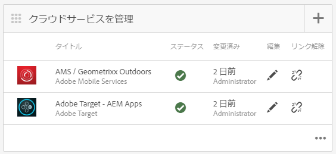

# AEM Mobile のコンテンツパーソナライゼーション{#aem-mobile-content-personalization}

{{ue-over-mobile}}

>[!NOTE]
>
>このドキュメントは、[AEM Mobile入門ガイド &#x200B;](/help/mobile/getting-started-aem-mobile.md) ガイドの一部です。このガイドは、AEM Mobile リファレンスの出発点として推奨されます。

AEM Mobile コンテンツパーソナライゼーション機能を使用すると、[AEM作成者](#author)は[Adobe Target](https://business.adobe.com/jp/products/target/adobe-target.html?lang=ja)を使用してモバイルアプリコンテンツをパーソナライズできます。 これにより、モバイルアプリケーションユーザーにターゲットを絞ったオファーを配信できます。 Adobe Experience Manager Mobileでは、個々のユーザーの好みに合わせたコンテンツを提供するコンテンツを作成、ターゲティング、配信する機能を提供します。

AEMでは、作成者がこのコンテンツの作成を開始するには、まず管理者と開発者が環境を準備する必要があります。

[AEM管理者](#administrator)は、AEM MobileとAdobe Target Cloud Service間の接続を確立するために必要です。

一方、AEM Mobile [開発者](#developer)は、ターゲットを絞ったコンテンツのオーサリングを容易にするために、既存のスクリプトを編集する必要があります。

## 管理者向け {#for-administrators}

コンテンツオーサーがモバイルアプリのターゲットコンテンツを生成するには、いくつかのステップを実施する必要があります。ユーザーとグループに対する適切な権限セット、クラウドサービスの作成、アクティビティ用のアプリケーションの設定、コンテンツの生成です。

この記事では、ターゲティング用に[AEM Mobile ハイブリッド参照アプリケーション &#x200B;](https://github.com/Adobe-Marketing-Cloud-Apps/aem-mobile-hybrid-reference)を設定するために使用されるプロセスについて説明します。

今後の前提は、AEM Mobile ハイブリッド参照アプリケーションが正常にデプロイされ、AEM Mobile ダッシュボードからアクセスできるようになったことです。

作成者がアプリケーション内でターゲットコンテンツを生成する前に、AEM インスタンスをAdobe Target Cloud Serviceで[設定する必要があります。](/help/mobile/aem-mobile-configuring-cloud-service.md)

### 権限 {#permissions}

パーソナライゼーションコンソールにアクセスする必要があるユーザーは、`target-activity-authors` グループに属している必要があります。

ユーザーおよびグループ設定の一部として、target-activity-groupをapps-admins グループに追加することをお勧めします。 target-activity-authors グループを追加すると、Personalization ナビゲーションメニューエントリを表示できるようになります。

>[!NOTE]
>
>personalization Admin Consoleにアクセスするユーザーまたはグループをtarget-activity-authors グループに追加し忘れると、ユーザーはpersonalization consoleを表示できなくなります。

### クラウドサービス {#cloud-services}

モバイルアプリケーションでターゲットコンテンツを機能させるには、Adobe Target サービスとAdobe Mobile Services サービスの2つのサービスを設定する必要があります。 Adobe Target サービスは、クライアントリクエストを処理し、パーソナライズされたコンテンツを返すためのエンジンを提供します。 Adobe Mobile Services サービスは、AMS Cordova プラグインによって使用されるADBMobileConfig.json ファイルを介して、Adobe サービスとモバイルアプリケーション間の接続を提供します。 AEM Mobile ダッシュボードから、2つのサービスを追加してアプリケーションを設定できます。

AEM Mobile ダッシュボードから、「クラウドサービスを管理」を探し、「+」ボタンをクリックします。


Cloud Serviceを追加ウィザードで、「Adobe Target」クラウドサービスカードを選択し、「次へ」をクリックします。


「設定を選択」ドロップダウンから、設定を作成するか、既存の設定から選択できます。 設定を作成するには、ドロップダウンから「設定を作成」を選択します。 Target設定のタイトルを入力します。 Target アカウントに関連付けられているクライアントコード、電子メール、パスワードを入力します。 これらのフィールドの値がわからない場合は、Adobe Target サポートにお問い合わせください。 「検証」ボタンをクリックして、資格情報を検証します。 確認が完了したら、「送信」ボタンをクリックしてクラウドサービスを作成します。

>[!NOTE]
>
>作成されたクラウドサービスは、ウィザードを介してモバイルアプリケーションに自動的に関連付けられます。 cq:cloudserviceconfigs プロパティ値は、apps グループノードのjcr:content ノードで設定されます。 ハイブリッドアプリサンプルの場合は、値が/content/mobileapps/hybrid-reference-app/jcr:contentに設定され、/etc/cloudservices/testandtarget/adobe-target—aem-apps/frameworkで自動生成されるフレームワークノードを指します。 フレームワークノードには、デフォルトで性別と年齢の2つのプロパティが設定されています。 このフレームワークはAEMのプレビューでのみ使用され、デバイスには影響しません。

ウィザードが完了すると、「Cloud Serviceを管理」タイルにTarget クラウドサービスが含まれます。 ただし、Adobe Mobile Service アカウントが見つからない場合は、警告が表示されます。


### Adobe Mobile Services {#adobe-mobile-services}

Adobe Mobile Services （AMS）アカウントをアプリケーションにリンクする必要もあります。AMS サービスは、Target クライアントコード情報を含む必要なADBMobileConfig.json ファイルを提供します。 AMS アカウントとの関連付けを作成する前に、AMS アカウントは、AMSに対する権限を持つユーザーによって変更される必要があります。

### クライアントコード {#client-code}

AMS サービスにログインするには、[https://mobilemarketing.adobe.com](https://mobilemarketing.adobe.com/)にアクセスし、モバイルアプリケーションを選択して設定をクリックします。 「SDK Target オプション」フィールドを探し、クライアントコードをフィールドに配置して「保存」をクリックします。


クライアントコードがモバイルアプリケーションに関連付けられたため、AMS クラウドサービスがAdobe モバイルダッシュボードを介して設定されると、サービス設定の設定がADBMobileConfig.json ファイルを介して配信されます。

### Adobe Mobile Service Cloud Service {#adobe-mobile-service-cloud-service}

AMSが設定されたので、次はAdobe Mobile Dashboardでモバイルアプリケーションを関連付けます。 AEM Mobile ダッシュボードから、「クラウドサービスを管理」を探し、「+」ボタンをクリックします。


Adobe Mobile Services カードを選択し、「次へ」をクリックします。


作成または選択ウィザードの手順で、「モバイルサービス」ドロップダウンを選択し、「設定を作成」エントリを選択します。 タイトル、会社、ユーザー名、パスワードを入力し、適切なデータセンターを選択します。 これらの値がわからない場合は、Adobe Mobile Service管理者に問い合わせて値を取得してください。 すべてのフィールドに入力したら、**確認**&#x200B;をクリックします。 検証プロセスはAMSに送信され、アカウントの資格情報を検証します。検証が成功すると、関連するモバイルアプリケーションをドロップダウンから選択する場所にモバイルアプリケーションのリストが入力されます。 「**送信**」をクリックして、ウィザードを完了します。 設定データおよびアプリケーションに関連する分析を取得するには、少し時間がかかる場合があります。 プロセスが完了したら、**完了**&#x200B;をクリックして、Adobe Mobile Dashboardに戻ります。

モバイルダッシュボードに戻ると、クラウドサービスの管理タイルにAMS クラウドサービスが含まれています。 また、「指標を分析」タイルにはライフサイクルレポートが入力されます。



## 作成者の場合 {#for-authors}

**前提条件：**&#x200B;前述のとおり、作成者が新しいターゲットコンテンツを生成するには、管理者がAdobe Target サービスへの接続を設定する必要があります。

管理者が2つのクラウドサービスを設定し、開発者がmobile appoffers ハンドラーを設定すると、コンテンツオーサーはターゲットを絞ったエクスペリエンスの生成を開始できるようになります。

AEM Mobile アプリ内のターゲットコンテンツのオーサリングは、AEM Sitesのオーサリングと同様の手順に従います。

AEMでの[&#x200B; ターゲットコンテンツのオーサリング &#x200B;](/help/sites-authoring/personalization.md)の概要については、こちらを参照してください

## 開発者向け {#for-developers}

モバイルアプリケーションを作成するAEM開発者は、コンポーネントを開発する際に、AEM全体で一般的に使用されるパターンに従い続ける必要があります。 ここでは、Adobeでコンテンツ作成者がターゲットを絞ったコンテンツを作成できるようにするために必要な手順を説明します。

### Adobe Target ContentSync ハンドラー {#adobe-target-contentsync-handlers}

ユーザーのデバイスにコンテンツを配信するには、AEM コンテンツ作成者が作成したオファーをレンダリングしてコンテンツを生成します。 ターゲットオファーのレンダリングを処理するために、オファーを処理する新しいコンテンツ同期ハンドラーがあります。 ハイブリッド参照アプリケーションをサンプルとして使用すると、en （英語）コンテンツパッケージには、[mobileappoffers](https://github.com/Adobe-Marketing-Cloud-Apps/aem-mobile-hybrid-reference/blob/master/aem-package/content-author/src/main/content/jcr_root/content/mobileapps/hybrid-reference-app/en/_jcr_content/pge-app/app-config-dev/targetOffers/.content.xml) ハンドラーを持つContentSyncConfigが含まれます。 次のステップは、オファーをデバイスにレンダリングする際に重要です。 mobileappoffers ハンドラーには、アプリケーションに使用するパーソナライゼーションアクティビティへのパスを識別するパスプロパティがあります。

例えば、*/content/campaigns/hybridref*&#x200B;にアクティビティがある場合、このパスをコピーし、値としてmobileappoffers ハンドラーの&#x200B;*path* プロパティに貼り付けます。

>[!NOTE]
>
>ハイブリッドリファレンスアプリケーションの場合、開発用と実稼動用に2つのmobileappoffers ハンドラーがあります。

アクティビティのパスをmobileappoffers ハンドラーのpath プロパティで設定したら、ハンドラーを保存します。 ハンドラーは、モバイルデバイスのオファーのレンダリングを開始する準備ができました。

### レンダーモード {#render-mode}

mobileappoffers ハンドラーは、公開設定と開発設定で異なる設定をします。 パブリッシュ設定の場合、*renderMode*&#x200B;というプロパティがあり、値は&#x200B;*publish*&#x200B;で、cq:ContentSyncConfig ノードに設定されています。 mobileappoffers ハンドラーはrenderModeを参照し、パブリッシュに設定されている場合は、作成されるmbox IDを編集します。 デフォルトでは、AEMで作成されたmboxには、mbox idに – author値が追加されます。 これは、アクティビティが公開されていないことを識別し、オファーの解決に非公開キャンペーンを使用する必要があります。

コンテンツがAdobe Mobile Dashboardを介してステージングされる場合、ステージングされたコンテンツは実稼動対応コンテンツと見なされ、非開発コンテンツ同期設定を介してレンダリングされます。 この方法でレンダリングすると、—authorがすべてのmbox IDから削除され、公開されたアクティビティがTarget サーバーで利用できるようになることを期待します。 ステージング済みコンテンツをテストする前に、アクティビティが既に公開されていることを確認します。

### Personalization アプリ開発 {#personalization-app-development}

#### コンポーネント {#components}

あらゆるコンテンツの基盤は、通常、HTLまたはJSPを使用している場合に応じて、ベースとなるAEM ページコンポーネント wcm/foundation/components/pageまたはfoundation/components/pageのいずれかを拡張するページコンポーネントです。 これらの手順の所要時間は、wcm/foundation/components/page コンポーネントの使用に集中します。 ページコンポーネントの基本構造は複数のスクリプトに分割され、各スクリプトは、開発者が必要に応じてコードを整理して上書きできるようにするための特定の目的を提供します。 Personalizationで関心のある2つのスクリプトは、head.htmlとbody.htmlです。 これらの2つのスクリプトは、Context Hub、クラウドサービス、およびモバイルオーサリングをサポートするためにコードを挿入できる領域を提供します。

ここでは、コンテンツのターゲティングを有効にするために使用される2つの主なスクリプトの概要を示します。

#### head.html {#head-html}

コンテンツのターゲティング機能を作成者に提供するには、作成者が編集モードからターゲティングモードにコンテキストを変更できるように、ターゲットメニューをページに追加する必要があります。 この機能を有効にするには、開発者はhead.html スクリプトを変更して、head.htmlの上部または&lt;title>&lt;/title>要素にできるだけ近い次のコードのスニペットを含める必要があります。

```xml
<meta data-sly-test="${!wcmmode.disabled}">
    <div data-sly-call="${clientLib.all @ categories='personalization.kernel'}" data-sly-unwrap></div>
    <div data-sly-resource="${'config' @ resourceType='cq/personalization/components/clientcontext_optimized/config'}" data-sly-unwrap></div>
    <div data-sly-resource="${'contexthub' @ resourceType='granite/contexthub/components/contexthub'}" data-sly-unwrap></div>
</meta>
```

>[!NOTE]
>
>WCM モードが無効になっている場合にのみスクリプトを含めます（詳しくはContentSync ハンドラーの節を参照）。スクリプトは最終的なアプリケーションコードに含まれません。

作成者にターゲットコンテンツをプレビューする機能を提供するには、エディターがAdobe Target クラウドサービスの設定を見つけられる必要があります。 以下のコードブロックは、2つの重要なスクリプトを追加します。 最初に、ページが関連するTarget クラウドサービスを見つけて、Adobe Targetに呼び出しを行う機能を追加しました。 2つ目は、cq.apps.targeting カテゴリの追加です。

**cq.apps.targeting** カテゴリは、デフォルトのcq/personalization/component/target コンポーネントを上書きし、モバイルアプリケーションの使用に特化してオファーをレンダリングするmobileapps/components/target コンポーネントを使用します。 詳しくは、ターゲットコンポーネントの節を参照してください。

コードはhead.htmlに追加し、&lt;/head>要素の直前に配置する必要があります。

```xml
<div data-sly-test="${!wcmmode.disabled}">
    <div data-sly-include="/libs/cq/cloudserviceconfigs/components/servicelibs/servicelibs.jsp" data-sly-unwrap></div>
    <meta data-sly-call="${clientLib.all @ categories='cq.apps.targeting'}" data-sly-unwrap></meta>
</div>
```

>[!NOTE]
>
>コードのブロックはWCM モード内でラップされ、無効になっていないため、コンテンツ作成者がコンテンツの作成中にのみ再生されます。 生成されたモバイルランタイムコードには、クラウドサービススクリプトは追加されません。

#### body.html {#body-html}

コンテンツ作成者に異なるペルソナをテストする機能を提供するには、body.html スクリプトに、body要素の最初の子として次のコードブロックを含める必要があります。

```xml
<div data-sly-test="${!wcmmode.disabled}">
    <div data-sly-resource="${'clientcontext' @ resourceType='cq/personalization/components/clientcontext_optimized'}" data-sly-unwrap></div>
</div>
```

必要なコードの最後のビットは、body.htmlの下部にあります。 このコードは、関連するクラウドサービスを検索し、適切なターゲティングエンジンコードを挿入します。

```xml
<div data-sly-test="${!wcmmode.disabled}">
    <div data-sly-resource="${'cloudservices' @ resourceType='cq/cloudserviceconfigs/components/servicecomponents'}" data-sly-unwrap></div>
</div>
```

### リファレンスアプリケーション {#reference-application}

head.htmlとbody.htmlの例は、[AEM Mobile ハイブリッド参照アプリケーション &#x200B;](https://github.com/Adobe-Marketing-Cloud-Apps/aem-mobile-hybrid-reference)に記載されており、2つのスクリプト内のスクリプトブロックを配置する場所を開発者が示しています。

### コンテンツ同期ハンドラー {#content-sync-handlers}

コンテンツ作成者がモバイルアプリケーション用のコンテンツの作成を完了したら、次のステップは、ソースをダウンロードしてアプリケーションを構築するか、コンテンツを公開するステージングを行うことです。 これを実現するために開発者が関与するいくつかのステップがあります。 AEM Mobileでは、コンテンツのレンダリングに役立つように、コンテンツ同期ハンドラーを使用してコンテンツをレンダリングし、パッケージ化します。 Personalizationのユースケースに、ターゲットコンテンツをレンダリングするための新しいコンテンツ同期ハンドラーが導入されました。 「mobileappoffers」ハンドラーは、コンテンツ作成者が作成した関連するターゲットオファーのレンダリング方法を認識します。 mobileappoffers ハンドラーは抽象ページ更新ハンドラーを拡張します。したがって、多くのプロパティは類似しています。 mobileappoffers ハンドラーの詳細には、次のプロパティがあります。

<table>
 <tbody>
  <tr>
   <td><strong>プロパティ</strong></td>
   <td><strong>値</strong></td>
   <td><strong>説明</strong></td>
  </tr>
  <tr>
   <td>書き換え</td>
   <td>+ relativeParentPath<p> - "/"</p> </td>
   <td>rewrite プロパティは、コンテンツ内のパスの書き換え方法を指定します。</td>
  </tr>
  <tr>
   <td>includedPageTypes</td>
   <td><p>"cq/personalization/components/teaserpage",</p> <p>"cq/personalization/components/offerproxy"</p> </td>
   <td>includePageTypes プロパティはオプションで、cq/personalization/components/teaserpageおよびcq/personalization/components/offerproxyのリソースタイプを持つページにデフォルト設定されます。 これらの2つのリソースタイプは、コンテンツがターゲットされる際に使用されるデフォルトのリソースタイプです。 追加のリソースタイプをサポートする必要がある場合は、それらをincludePageTypesのリストに追加します。</td>
  </tr>
  <tr>
   <td>locationRoot</td>
   <td>/content/mobileapps/&lt;app&gt;</td>
   <td>アプリの場所。</td>
  </tr>
  <tr>
   <td>タイプ</td>
   <td>mobile appoffers</td>
   <td>ハンドラーの名前はmobileappoffersです。</td>
  </tr>
  <tr>
   <td>セレクター</td>
   <td>タント</td>
   <td>タンドセレクターは、ターゲットコンテンツのレンダリングに使用されます。 </td>
  </tr>
  <tr>
   <td>targetRootDirectory</td>
   <td>www</td>
   <td>レンダリングされたコンテンツを保持するルートディレクトリ。</td>
  </tr>
  <tr>
   <td>includeImages</td>
   <td>true | false</td>
   <td>trueの場合、オファーに含まれるすべての画像がレンダリングされます。 falseの場合、画像はスキップされます。</td>
  </tr>
  <tr>
   <td>includeVideos</td>
   <td>true | false</td>
   <td>trueの場合、オファーに含まれるビデオはレンダリングされます。 falseの場合、ビデオはスキップされます。</td>
  </tr>
  <tr>
   <td>path</td>
   <td>/content/campaigns/&lt;brand&gt;</td>
   <td>オファーが参加するキャンペーンのブランドを指します。 現在、すべてのオファーは同じキャンペーンから取得する必要があります。</td>
  </tr>
  <tr>
   <td>深い</td>
   <td>true | false</td>
   <td>trueの場合、すべての子ページを再帰的にレンダリングし、falseの場合は再帰的にレンダリングしません。 </td>
  </tr>
  <tr>
   <td>拡張子</td>
   <td>html</td>
   <td>レンダリングするリソースの拡張機能を設定します。 ページが.html拡張子を持つようにhtmlに設定します。</td>
  </tr>
 </tbody>
</table>

>[!NOTE]
>
>[AEM Mobile ハイブリッド参照アプリ &#x200B;](https://github.com/Adobe-Marketing-Cloud-Apps/aem-mobile-hybrid-reference)には、デフォルトのmobileappoffer ハンドラー設定があります。 キャンペーンの場所によって異なるため、サンプルのパスプロパティは空です。 Campaign オーサーがCampaignを作成した後、アプリ管理者は、Campaignを指すパスプロパティを指定して、Campaignをハンドラーに関連付ける必要があります。

### ターゲットコンポーネント {#target-component}

AEM Mobileでは、モバイルアプリケーション専用のコンテンツをレンダリングするために、mobile apps/components/target コンポーネントを使用します。 モバイルターゲットコンポーネントは、cq/personalization/components/target コンポーネントを拡張し、engine_tnt.jsp スクリプトをオーバーライドします。 これにより、AEM Mobileはengine_tnt.jspを上書きして、モバイルアプリのユースケース用に生成されたHTMLを制御できます。 コンテンツ作成者がターゲットとするすべてのコンポーネントに対して、関連するmboxがengine_tnt.jspによって作成されます。

各mboxに&#x200B;**cq-targeting**&#x200B;の属性が追加され、アプリケーション開発者がカスタムコードを記述して、好きなように使用できるようになります。 [AEM Mobile ハイブリッド参照アプリ &#x200B;](https://github.com/Adobe-Marketing-Cloud-Apps/aem-mobile-hybrid-reference)には、cq-targeting属性を使用するAngular ディレクティブの例があります。 コンテンツの置き換えは、いつ、どのように行われるかは、モバイルアプリケーション開発者の責任です。 AEM /etc/clientlibs/mobileapps/js/mobileapps.jsを介して配信されるモバイル SDKは、Adobe ターゲティングサービスを呼び出すためのAPIを提供します。 アプリケーションの設計に従って、呼び出しを行うタイミングを指定するのは、アプリケーション開発者の責任です。

## 次のステップ？ {#what-s-next}

1. [AEM Mobile アプリ体験を開始する](/help/mobile/starting-aem-phonegap-app.md)
1. [アプリのコンテンツを管理](/help/mobile/phonegap-manage-app-content.md)
1. [アプリケーションを作成](/help/mobile/building-app-mobile-phonegap.md)
1. [Adobe Mobile Analyticsでアプリのパフォーマンスを追跡する](/help/mobile/phonegap-intro-to-app-analytics.md)
1. [Adobe Targetでパーソナライズされたアプリ体験を提供する](/help/mobile/phonegap-aem-mobile-content-personalization.md)
1. [ユーザーに重要なメッセージを送信する](/help/mobile/phonegap-push-notifications.md)
