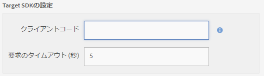
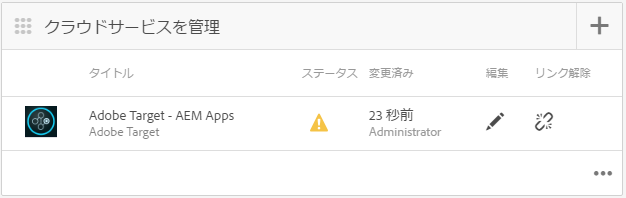

# AEM Mobile のコンテンツパーソナライゼーション{#aem-mobile-content-personalization}

>[!NOTE]
>
>Adobeは、単一ページアプリケーションのフレームワークベースのクライアントサイドレンダリング（React など）を必要とするプロジェクトでは、SPA Editor を使用することをお勧めします。 [詳細情報](/help/sites-developing/spa-overview.md)。

>[!NOTE]
>
>このドキュメントは、 [AEM Mobileの概要](/help/mobile/getting-started-aem-mobile.md) ガイド (AEM Mobileリファレンスの出発点として推奨 )。

AEM Mobileのコンテンツパーソナライゼーション機能を使用すると、 [AEM Authors](#author) を使用してモバイルアプリのコンテンツをパーソナライズするには [Adobe Target](https://business.adobe.com/products/target/adobe-target.html?lang=ja). これにより、ターゲットを絞ったオファーをモバイルアプリケーションユーザーに配信できます。 Adobe Experience Manager Mobileは、個人の好みに合ったコンテンツをユーザーに提供するコンテンツを作成、ターゲット化および配信する機能を提供します。

AEMでは、作成者がこのコンテンツの作成を開始できるように、管理者と開発者はまず環境を準備する必要があります。

[AEM管理者](#administrator) は、AEM MobileとAdobe TargetCloud Serviceの間の接続を確立するために必要です。

その間、AEM Mobile [開発者](#developer) ターゲットコンテンツのオーサリングを容易にするために、既存のスクリプトを編集する必要があります。

## 管理者向け {#for-administrators}

コンテンツ作成者がモバイルアプリ用のターゲットコンテンツの生成を開始する前に、いくつかの手順を組み合わせる必要があります。ユーザーとグループに対する適切な権限のセットの取得、クラウドサービスの作成、アクティビティ用のアプリケーションの設定、最後にコンテンツの生成です。

この記事では、 [AEM Mobile Hybrid Reference Application](https://github.com/Adobe-Marketing-Cloud-Apps/aem-mobile-hybrid-reference) （ターゲティング用）

今後は、AEM Mobile Hybrid Reference Application が正常にデプロイされ、AEM Mobile Dashboard 経由でアクセスできると仮定します。

作成者がアプリケーション内でターゲットコンテンツを生成できるようにするには、AEMインスタンスが [はAdobe TargetCloud Serviceで設定されます。](/help/mobile/aem-mobile-configuring-cloud-service.md)

### 権限 {#permissions}

パーソナライゼーションコンソールへのアクセスを必要とするユーザーは、 `target-activity-authors` グループ化します。

ユーザーとグループの設定の一環として、 target-activity-group を apps-admins グループに追加することをお勧めします。 target-activity-authors グループを追加すると、パーソナライゼーションのナビゲーションメニューエントリを表示できます。

>[!NOTE]
>
>パーソナライゼーションAdmin Consoleにアクセスするユーザーまたはグループを target-activity-authors グループに追加し忘れると、ユーザーはパーソナライゼーションコンソールを表示できなくなります。

### Cloud Services {#cloud-services}

モバイルアプリケーションでターゲットコンテンツを機能させるには、Adobe TargetサービスとAdobeMobile Services サービスの 2 つのサービスを設定する必要があります。 Adobe Targetサービスは、クライアントリクエストを処理し、パーソナライズされたコンテンツを返すためのエンジンを提供します。 AdobeMobile Services サービスは、AMS Cordova プラグインで使用される ADBMobileConfig.json ファイルを介して、Adobe サービスとモバイルアプリケーション間の接続を提供します。 AEM Mobile Dashboard から、2 つのサービスを追加してアプリケーションを設定できます。

AEM Mobileダッシュボードで「Cloud Serviceを管理」を探し、「+」ボタンをクリックします。


Cloud Serviceの追加ウィザードで、「Adobe Target」クラウドサービスカードを選択し、「次へ」をクリックします。


「 Select a Configuration 」ドロップダウンで、設定を作成するか、既存の設定から選択できます。 設定を作成するには、ドロップダウンから「設定を作成」を選択します。 Target 設定のタイトルを入力します。 Target アカウントに関連付けられているクライアントコード、電子メール、およびパスワードを入力します。 これらのフィールドの値が不明な場合は、Adobe Targetサポートにお問い合わせください。 「検証」ボタンをクリックして、認証情報を検証します。 検証が完了したら、「送信」ボタンをクリックしてクラウドサービスを作成します。

>[!NOTE]
>
>作成されたクラウドサービスは、ウィザードによってモバイルアプリケーションに自動的に関連付けられます。 cq:cloudserviceconfigs プロパティ値は、 apps group ノードの jcr:content ノードに対して設定されます。 ハイブリッドアプリのサンプルでは、 /content/mobileapps/hybrid-reference-app/jcr:content に設定され、自動生成されたフレームワークノード ( /etc/cloudservices/testandtarget/adobe-target—aem-apps/framework ) を指す値が設定されます。 フレームワークノードには、デフォルトで設定される性別と年齢の 2 つのプロパティがあります。 フレームワークはAEMのプレビューでのみ使用され、デバイスには影響しません。

ウィザードが完了すると、Cloud Serviceを管理タイルに Target Cloud Service が表示されます。 ただし、Mobile Service アカウントが見つからないことに関するAdobeが含まれています。


### Adobe Mobile Services {#adobe-mobile-services}

Adobeの Mobile Services(AMS) アカウントをアプリケーションにリンクする必要があります。AMS サービスは、Target のクライアントコード情報を含む必要な ADBMobileConfig.json ファイルを提供します。 AMS アカウントとの関連付けを作成する前に、AMS に対する権限を持つユーザーが AMS アカウントを変更する必要があります。

### クライアントコード {#client-code}

AMS サービスへのログインには、以下の手順に従ってください。 [https://mobilemarketing.adobe.com](https://mobilemarketing.adobe.com/)、モバイルアプリケーションを選択し、「設定」をクリックします。 「 SDK Target オプション」フィールドを探し、フィールドにクライアントコードを配置して、「保存」をクリックします。



これで、クライアントコードがモバイルAdobeに関連付けられました。AMS クラウドサービスが Mobile Dashboard で設定されると、サービス設定の設定が ADBMobileConfig.json ファイルを介して配信されます。

### AdobeモバイルサービスCloud Service {#adobe-mobile-service-cloud-service}

AMS が設定されたら、「モバイルダッシュボード」でモバイルアプリケーションをAdobeに関連付けます。 AEM Mobileダッシュボードで「Cloud Serviceを管理」を探し、「+」ボタンをクリックします。



「AdobeMobile Services 」カードを選択し、「次へ」をクリックします。


作成または選択ウィザードの手順で、「 Mobile Service 」ドロップダウンを選択し、「設定を作成」エントリを選択します。 役職、会社、ユーザー名、パスワードを入力し、適切なデータセンターを選択します。 これらの値が不明な場合は、AdobeMobile Service 管理者に問い合わせて取得してください。 すべてのフィールドに入力したら、 **検証**. 検証プロセスが AMS に移動し、アカウントの資格情報が検証されます。検証が成功すると、モバイルアプリケーションのリストが表示され、ドロップダウンから関連するモバイルアプリケーションを選択します。 クリック **送信** をクリックして、ウィザードを完了します。 このプロセスでは、設定データと、アプリケーションに関連する分析を取得するのに少し時間がかかる場合があります。 処理が完了したら、「 **完了** をクリックして、「モバイルAdobe」に戻ります。

モバイルダッシュボードに戻ると、Cloud Serviceを管理タイルに AMS クラウドサービスが含まれます。 また、指標を分析タイルには、ライフサイクルレポートが表示されます。


## 作成者向け {#for-authors}

**前提条件：** 作成者が新しいターゲットコンテンツを生成できるようにするには、前述のように、管理者はAdobe Target Service への接続を設定する必要があります。

管理者が 2 つのクラウドサービスを設定し、開発者が mobileappoffers ハンドラーを設定すると、コンテンツ作成者はターゲット設定されたエクスペリエンスの生成を開始できるようになります。

AEM Mobileアプリ内でのターゲットコンテンツのオーサリングは、AEM Sitesのオーサリングと同様の手順に従います。

以下に関する完全な概要については、こちらを参照してください： [AEMでのターゲットコンテンツのオーサリング](/help/sites-authoring/personalization.md)

## 開発者向け {#for-developers}

モバイルアプリケーションを構築するAEM開発者は、コンポーネントを開発する際に、AEM全体でよく使用されるパターンに従い続ける必要があります。 ここでは、Adobeでは、コンテンツ作成者がターゲットコンテンツを作成できるようにするために必要な手順について説明します。

### Adobe Target ContentSync ハンドラー {#adobe-target-contentsync-handlers}

ユーザーのデバイスにコンテンツを配信するために、AEMコンテンツ作成者が作成したオファーをレンダリングすることで、コンテンツが生成されます。 ターゲットオファーのレンダリングを処理するために、オファーを処理する新しいコンテンツ同期ハンドラーが追加されました。 Hybrid Reference Application をサンプルとして使用すると、en（英語）コンテンツパッケージには ContentSyncConfig が含まれ、 [mobileappoffers](https://github.com/Adobe-Marketing-Cloud-Apps/aem-mobile-hybrid-reference/blob/master/aem-package/content-author/src/main/content/jcr_root/content/mobileapps/hybrid-reference-app/en/_jcr_content/pge-app/app-config-dev/targetOffers/.content.xml) ハンドラー 次の手順は、オファーをデバイスにレンダリングする際に非常に重要です。 mobileappoffers ハンドラーには、アプリケーションに使用されるパーソナライゼーションアクティビティへのパスを識別する path プロパティがあります。

例えば、 */content/campaigns/hybridref*、このパスをコピーし、値として *パス* mobileappoffers ハンドラーのプロパティ。

>[!NOTE]
>
>ハイブリッド参照アプリケーションの場合、開発用と生産用の 2 つの mobileappoffers ハンドラーがあります。

mobileappoffers ハンドラーの path プロパティにアクティビティのパスを設定したら、ハンドラーを保存します。 これで、ハンドラーは、モバイルデバイス用のオファーのレンダリングを開始する準備が整いました。

### レンダリングモード {#render-mode}

mobileappoffers ハンドラーの設定は、公開設定と開発設定で異なります。 パブリッシュ設定の場合、という名前のプロパティがあります。 *renderMode* 値を持つ *公開* cq:ContentSyncConfig ノードで設定します。 mobileappoffers ハンドラーは renderMode を参照し、publish に設定されている場合は、作成される mbox ID を編集します。 デフォルトでは、AEMで作成された mbox には、mbox ID に —author 値が追加されます。 これは、アクティビティが公開されておらず、オファーの解決に未公開のキャンペーンを使用する必要があることを示します。

コンテンツがAdobeのモバイルダッシュボードでステージングされる場合、ステージング済みコンテンツは、実稼動準備済みコンテンツと見なされ、開発用以外のコンテンツ同期設定でレンダリングされます。 この方法でレンダリングすると、—author がすべての mbox ID から削除され、公開済みのアクティビティが Target サーバーで使用できるようになります。 ステージングされたコンテンツをテストする前に、アクティビティが既に公開されていることを確認してください。

### パーソナライズアプリの開発 {#personalization-app-development}

#### コンポーネント {#components}

あらゆるコンテンツの基盤は、通常、HTL または JSP を使用しているかどうかに応じて、基本AEMページコンポーネント wcm/foundation/components/page または foundation/components/page のいずれかを拡張するページコンポーネントです。 これらの手順の期間は、 wcm/foundation/components/page コンポーネントの使用に焦点を当てます。 ページコンポーネントの基本的な構造は複数のスクリプトに分類され、各スクリプトは、開発者が必要に応じてコードを整理および上書きできるようにする具体的な目的を提供します。 パーソナライゼーションに関心のある 2 つのスクリプトは、head.html と body.html です。 この 2 つのスクリプトには、Context Hub、Cloud Serviceおよびモバイルオーサリングをサポートするためにコードを挿入できる領域が用意されています。

次に、コンテンツのターゲティングを有効にするために使用する 2 つの主なスクリプトの概要を示します。

#### head.html {#head-html}

作成者がコンテンツをターゲットにする機能を提供するには、作成者がコンテキストを編集モードからターゲットモードに変更できるように、ターゲットメニューをページに追加する必要があります。 この機能を有効にするには、開発者は head.html スクリプトを変更して、次のコードスニペットを head.html の上部または &lt;title>&lt;/title> 要素をできるだけ短くします。

```xml
<meta data-sly-test="${!wcmmode.disabled}">
    <div data-sly-call="${clientLib.all @ categories='personalization.kernel'}" data-sly-unwrap></div>
    <div data-sly-resource="${'config' @ resourceType='cq/personalization/components/clientcontext_optimized/config'}" data-sly-unwrap></div>
    <div data-sly-resource="${'contexthub' @ resourceType='granite/contexthub/components/contexthub'}" data-sly-unwrap></div>
</meta>
```

>[!NOTE]
>
>WCM モードが無効な場合（WCM モードが無効な場合）にのみスクリプトを含め、WCM モードが無効な場合（詳しくは、コンテンツ同期ハンドラーの節を参照）は最終的なアプリケーションコードにスクリプトを含めません。

作成者がターゲットコンテンツをプレビューできるようにするには、エディターがAdobe Target Cloud Service の設定を見つけられる必要があります。 以下のコードブロックに、2 つの重要なスクリプトを追加します。 最初に、ページが関連する Target クラウドサービスを検索し、Adobe Targetへの呼び出しをおこなう機能を追加します。 2 つ目は、 cq.apps.targeting カテゴリの追加です。

The **cq.apps.targeting** カテゴリは、デフォルトの cq/personalization/component/target コンポーネントをオーバーライドし、モバイルアプリケーションの使用に特化したオファーをレンダリングする mobileapps/components/target コンポーネントを使用します。 この詳細については、ターゲットコンポーネントの節で説明します。

コードは、head.html に追加し、 &lt;/head> 要素を選択します。

```xml
<div data-sly-test="${!wcmmode.disabled}">
    <div data-sly-include="/libs/cq/cloudserviceconfigs/components/servicelibs/servicelibs.jsp" data-sly-unwrap></div>
    <meta data-sly-call="${clientLib.all @ categories='cq.apps.targeting'}" data-sly-unwrap></meta>
</div>
```

>[!NOTE]
>
>コードのブロックは、無効になっていない WCM モードでラップされるので、コンテンツ作成者がコンテンツの作成作業をしている間にのみ再生されます。 クラウドサービスのスクリプトは、生成されるモバイルランタイムコードには追加されません。

#### body.html {#body-html}

コンテンツ作成者が様々なペルソナをテストできるようにするには、body.html スクリプトに次のコードブロックを body 要素の最初の子として含める必要があります。

```xml
<div data-sly-test="${!wcmmode.disabled}">
    <div data-sly-resource="${'clientcontext' @ resourceType='cq/personalization/components/clientcontext_optimized'}" data-sly-unwrap></div>
</div>
```

最後に必要なコードのビットは、body.html の末尾にあります。 このコードビットは、関連するクラウドサービスを探し、適切なターゲティングエンジンコードを挿入します。

```xml
<div data-sly-test="${!wcmmode.disabled}">
    <div data-sly-resource="${'cloudservices' @ resourceType='cq/cloudserviceconfigs/components/servicecomponents'}" data-sly-unwrap></div>
</div>
```

### 参照アプリケーション {#reference-application}

head.html と body.html の例については、 [AEM Mobile Hybrid Reference Application](https://github.com/Adobe-Marketing-Cloud-Apps/aem-mobile-hybrid-reference) 2 つのスクリプト内のどこにスクリプトブロックを配置するかを開発者に示す

### コンテンツ同期ハンドラー {#content-sync-handlers}

コンテンツ作成者がモバイルアプリケーション用のコンテンツの作成を完了したら、次の手順は、ソースをダウンロードしてアプリを構築するか、公開するコンテンツをステージングすることです。 開発者がこの実現に関わる手順はいくつかあります。 AEM Mobileでは、コンテンツのレンダリングを支援するために、コンテンツ同期ハンドラーを使用して、コンテンツのレンダリングとパッケージ化をおこないます。 ターゲットコンテンツをレンダリングするための、パーソナライゼーションの使用例に新しいコンテンツ同期ハンドラーが導入されました。 「mobileappoffers」ハンドラーは、コンテンツ作成者が作成した関連するターゲットオファーをレンダリングする方法を認識しています。 mobileappoffers ハンドラーは抽象ページ更新ハンドラーを拡張したので、多くのプロパティは類似しています。 mobileappoffers ハンドラーの詳細には、次のプロパティがあります。

<table>
 <tbody>
  <tr>
   <td><strong>プロパティ</strong></td>
   <td><strong>値</strong></td>
   <td><strong>説明</strong></td>
  </tr>
  <tr>
   <td>書き換え</td>
   <td>+ relativeParentPath<p> - "/"</p> </td>
   <td>rewrite プロパティは、コンテンツ内のパスを書き換える方法を指定します。</td>
  </tr>
  <tr>
   <td>includedPageTypes</td>
   <td><p>"cq/personalization/components/teaserpage",</p> <p>"cq/personalization/components/offerproxy"</p> </td>
   <td>includePageTypes プロパティはオプションです。デフォルトでは、リソースタイプが cq/personalization/components/teaserpage および cq/personalization/components/offerproxy のページに設定されます。 これら 2 つのリソースタイプは、コンテンツのターゲット設定時に使用されるデフォルトのリソースタイプです。 追加のリソースタイプをサポートする必要がある場合は、includePageTypes のリストに追加します。</td>
  </tr>
  <tr>
   <td>locationRoot</td>
   <td>/content/mobileapps/&lt;app&gt;</td>
   <td>アプリの場所。</td>
  </tr>
  <tr>
   <td>タイプ</td>
   <td>mobileappoffers</td>
   <td>mobileappoffers であるハンドラーの名前。</td>
  </tr>
  <tr>
   <td>セレクター</td>
   <td>tandt</td>
   <td>tandt セレクターは、ターゲットコンテンツをレンダリングするために使用されます。 </td>
  </tr>
  <tr>
   <td>targetRootDirectory</td>
   <td>www</td>
   <td>レンダリングされたコンテンツを保持するルートディレクトリ。</td>
  </tr>
  <tr>
   <td>includeImages</td>
   <td>true | false</td>
   <td>true の場合、オファーに含まれる画像がレンダリングされます。 false の場合、画像はスキップされます。</td>
  </tr>
  <tr>
   <td>includeVideos</td>
   <td>true | false</td>
   <td>true の場合、オファーに含まれるビデオがレンダリングされます。 false の場合、ビデオはスキップされます。</td>
  </tr>
  <tr>
   <td>path</td>
   <td>/content/campaigns/&lt;brand&gt;</td>
   <td>オファーが参加するキャンペーンのブランドを指します。 現在、すべてのオファーは同じキャンペーンから取得される必要があります。</td>
  </tr>
  <tr>
   <td>深い</td>
   <td>true | false</td>
   <td>true の場合、すべての子ページが再帰的にレンダリングされます。false の場合は、再帰的にレンダリングされません。 </td>
  </tr>
  <tr>
   <td>拡張子</td>
   <td>html</td>
   <td>レンダリングするリソースの拡張を設定します。 ページの拡張子が.html になるように html に設定します。</td>
  </tr>
 </tbody>
</table>

>[!NOTE]
>
>The [AEM Mobile Hybrid Reference App](https://github.com/Adobe-Marketing-Cloud-Apps/aem-mobile-hybrid-reference) には、デフォルトの mobileappoffer ハンドラーの設定があります。 サンプル内のパスプロパティは、キャンペーンの場所に依存するので空です。 キャンペーン作成者がキャンペーンを作成したら、アプリ管理者は、キャンペーンを指すパスプロパティを指定して、キャンペーンをハンドラーに関連付ける必要があります。

### ターゲットコンポーネント {#target-component}

モバイルアプリケーション向けに特別にコンテンツをレンダリングするのに役立つように、AEM Mobileは mobileapps/components/target コンポーネントを使用します。 モバイルターゲットコンポーネントは、cq/personalization/components/target コンポーネントを拡張し、 engine_tnt.jsp スクリプトをオーバーライドします。 engine_tnt.jsp を上書きすると、AEM Mobileはモバイルアプリのユースケース用に生成されたHTMLを制御できます。 コンテンツ作成者がターゲットとするすべてのコンポーネントに対して、関連する mbox が engine_tnt.jsp によって作成されます。

mbox ごとに、 **cq-targeting** が追加され、アプリケーション開発者は、必要に応じて使用するカスタムコードを作成できます。 The [AEM Mobile Hybrid Reference App](https://github.com/Adobe-Marketing-Cloud-Apps/aem-mobile-hybrid-reference) には、cq-targeting 属性を使用するAngularディレクティブの例があります。 コンテンツの置き換えの概念は、いつ、どのように実行されるかは、モバイルアプリケーション開発者次第です。 AEM /etc/clientlibs/mobileapps/js/mobileapps.js経由で配信される Mobile SDK で、Adobeターゲティングサービスを呼び出す API を提供します。 アプリケーションのデザインに従って呼び出しをおこなうタイミングを指定するのは、アプリケーション開発者次第です。

## 次の手順? {#what-s-next}

1. [AEM Mobileアプリのエクスペリエンスを開始する](/help/mobile/starting-aem-phonegap-app.md)
1. [アプリのコンテンツを管理](/help/mobile/phonegap-manage-app-content.md)
1. [アプリケーションのビルド](/help/mobile/building-app-mobile-phonegap.md)
1. [アプリのモバイル分析を使用してAdobeのパフォーマンスを追跡する](/help/mobile/phonegap-intro-to-app-analytics.md)
1. [Adobe Targetでパーソナライズされたアプリエクスペリエンスを配信](/help/mobile/phonegap-aem-mobile-content-personalization.md)
1. [ユーザーに重要なメッセージを送信する](/help/mobile/phonegap-push-notifications.md)
