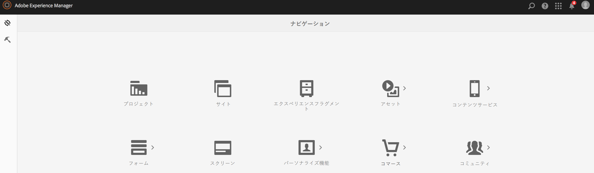
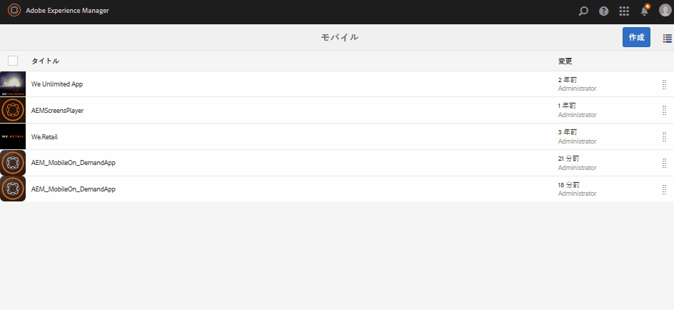

# アプリの定義{#app-definitions}

>[!NOTE]
>
>単一ページアプリケーションフレームワークを基にしたクライアント側レンダリング（React など）が必要なプロジェクトでは、SPA エディターを使用することをお勧めします。[詳細情報](/help/sites-developing/spa-overview.md)

アプリの定義では、アプリに適したスペースやその他の設定を指定できます。アプリの定義により、アプリを再コンパイルすることなくスペースを追加することが可能になります。アプリの定義が更新され、新しいスペースの情報が含まれます。

>[!NOTE]
>
>アプリの定義はアプリに関連付けられるので、AEM Mobile アプリコンソールでアプリを作成する必要があります。

## 新しいアプリの定義の作成 {#creating-a-new-app-definition}

1. AEM ナビゲーションコンソールで「**モバイル**」を選択します。

   

1. Choose **Apps** from **Mobile** and click **Create.**

   「**アプリ**」を選択し、詳細を入力して、新しいアプリを作成します。

   

### 次の手順 {#the-next-steps}

アプリの定義について理解したら、以下のオーサリングについてのリソースを参照してください。

* [既存のハイブリッドアプリのインポート](/help/mobile/phonegap-adding-content-to-imported-app.md)
* [アプリを作成ウィザードを使用した新規アプリの作成](/help/mobile/phonegap-create-new-app.md)
* [コンテンツサービス](/help/mobile/develop-content-as-a-service.md)

## その他のリソース {#additional-resources}

管理者および開発者の役割と責任について詳しくは、以下のリソースを参照してください。

* [AEM と Adobe PhoneGap Enterprise での開発](/help/mobile/developing-in-phonegap.md)
* [AEM での Adobe PhoneGap Enterprise のコンテンツの管理](/help/mobile/administer-phonegap.md)

