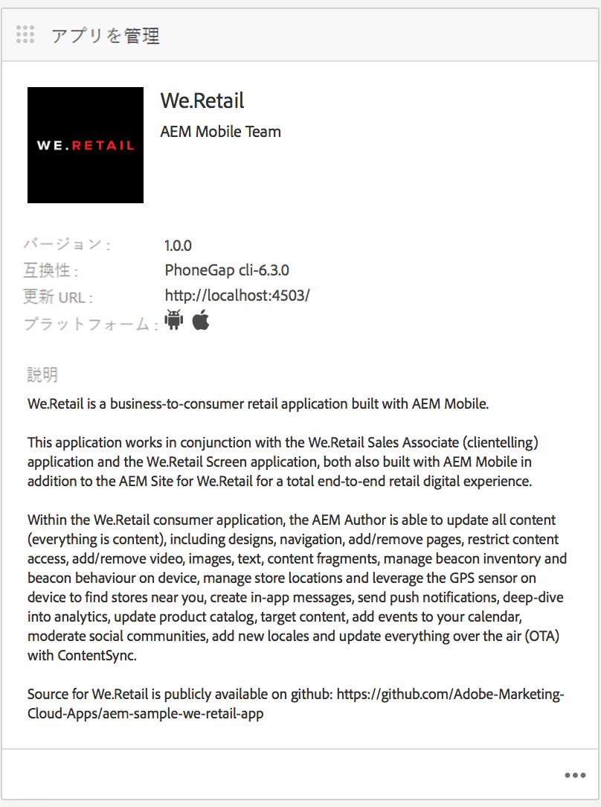
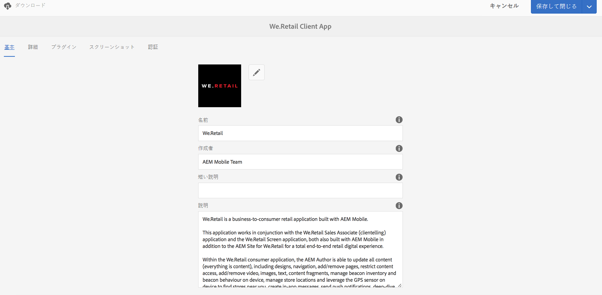
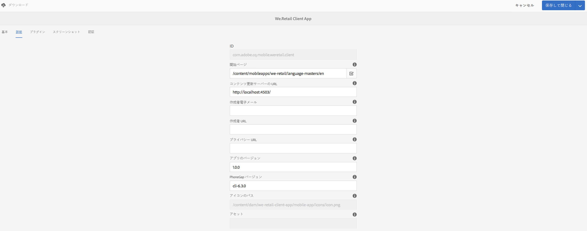
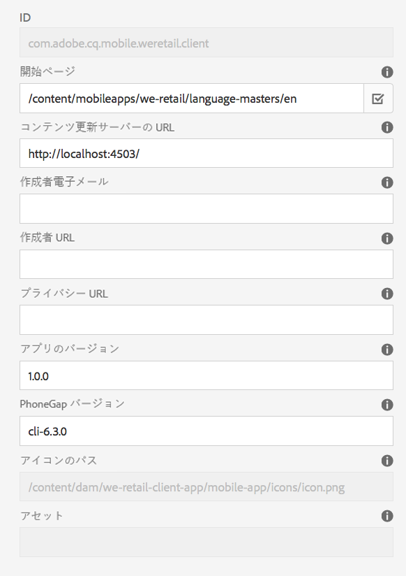
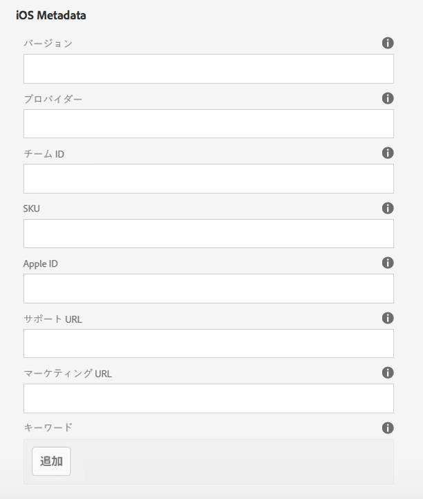
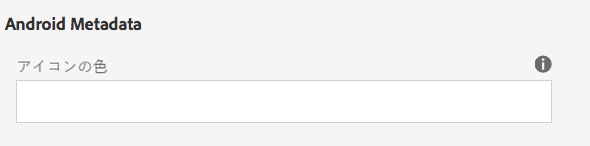
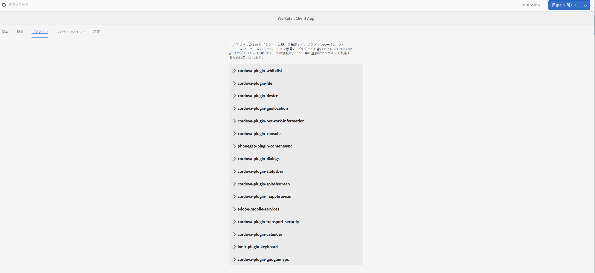
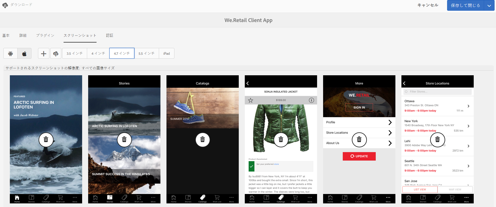
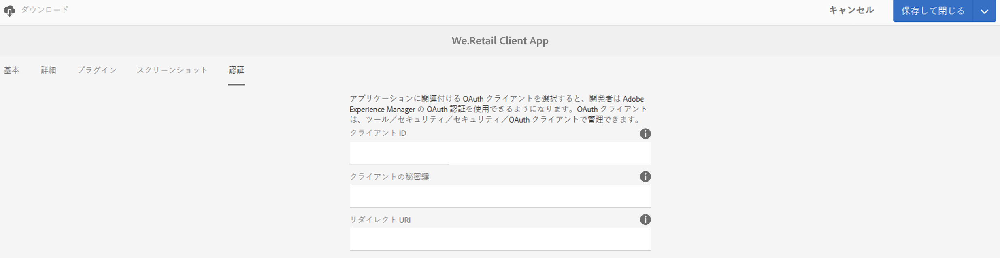

# アプリを管理タイル{#manage-app-tile}

>[!NOTE]
>
>単一ページアプリケーションフレームワークを基にしたクライアント側レンダリング（React など）が必要なプロジェクトでは、SPA エディターを使用することをお勧めします。[詳細情報](/help/sites-developing/spa-overview.md)

アプリダッシュボードの&#x200B;**アプリを管理**&#x200B;タイルでは、アプリケーションに関する詳細を変更できます。詳細ページを開くには、アプリを管理タイルの詳細リンクをクリックします。アプリを管理ページから、PhoneGapアプリ設定(config.xml)の設定を編集し、様々なアプリストアに送信できるようにアプリを準備できます。



## アプリを管理タイルについて {#understanding-the-manage-app-tile}

**アプリを管理**&#x200B;タイルの各タイルの右下隅にある「...」をクリックして、詳細を表示または編集できます。

### 「基本」タブ {#the-basic-tab}

このタブでは、アプリの「**名前**」、「**作成者**」、「**短い説明**」および「**説明**」を編集できます。



### 「詳細」タブ{#the-advanced-tab}

各モバイルアプリケーションプラットフォームでは、各アプリケーションストアに固有のターゲット設定をおこない、どのデータが収集されるかが指定されます。

表示されるプラットフォームは、次のように、PhoneGap の config.xml の内容から決定されます。

```xml
<widget>
<gap:platform name="ios"/>
<gap:platform name="android"/>
</widget>
```

Apple App Store や Google Play ストアなどの各ベンダーのアプリケーションストアでは、アプリケーション詳細を利用者に表示するために、モバイルアプリケーションのスクリーンショットを 1 つ以上提出するよう求められます。これらのスクリーンショットは、ディメンションとコンテンツに関して厳密な要件を持つことがあります（基本的には、実際にはアプリケーションを表す必要があります）。 AEM Appsは、各ベンダーのアプリケーションストアに必要なサポート対象プラットフォームおよび表示ポートのサイズに対して、これらのスクリーンショットを選択して管理するためのサポートを提供します。

>[!NOTE]
>
>AEM Verify アプリでは、AEM のアプリ詳細に直接スクリーンショットを送信できます。
>
>See [Mobile Quickstart for AEM Verify](/help/mobile/phonegap-mobile-quickstart.md) for more details.



### メタデータ {#metadata}

>[!NOTE]
>
>**アプリを管理**&#x200B;タイルについて理解したら、メタデータの表示と編集について[アプリのメタデータの編集](/help/mobile/phonegap-editmetadata.md)を参照してください。

#### 共通メタデータ {#common-metadata}

すべてのアプリケーションには、さまざまな要素の設定を支援するメタデータが関連付けられています。アプリを管理ページは、メタデータの収集に関連する2つの異なる領域に分かれています。 プラットフォーム固有のメタデータと共通のメタデータ。

すべてのプラットフォームに共通の設定とメタデータがあります。

このセクション内で、コンテンツ更新サーバーの URL、モバイルアプリケーションのランディングページ、コンパイル用の PhoneGap バージョン、アプリケーションのバージョン、名前、説明などを定義します。

**「アプリのバージョン** 」は、アプリの動作バージョンです。 一般的なベストプラクティスは、3 桁の表記法を使用し、最初のリリース前は 1.0.0 以下の番号から開始することです。

**PhoneGap Version** は、PhoneGapを使用してアプリケーションをコンパイルするバージョンです。 最新かつ最良の機能とバグ修正を利用できるように、常に最新バージョンを使用することを推奨します。

**Content Update Server URL** ：アプリケーションがContentSyncの更新を呼び出すために使用するURLです。 この URL は、ディスパッチャーの URL に設定するか、ディスパッチャーを使用しない場合は、ContentSync 更新をアプリケーションに提供するために使用するパブリッシュインスタンスのいずれかに設定する必要があります。



>[!NOTE]
>
>フィールドに設定されるデータがない場合、このセクションは空で表示されることがあります。
>
>詳細表示の上部にアプリケーションバージョン、PhoneGap バージョンおよび更新 URL が表示されます。それぞれの値は、「共通メタデータ」セクション内で設定できます。ただし、アプリケーション IDを編集することはできません。

#### プラットフォームのメタデータ {#platform-metadata}

PhoneGap の config.xml で定義されているすべてのプラットフォームに、カスタムプラットフォームプロパティを含めることができます。AEM 開発者は、これらのプロパティをキャプチャするようにコンテンツ構造を作成する必要があります。iOSでは、プラットフォーム固有のプロパティの例を示します。

設定されているすべてのプラットフォームのメタデータが、アプリを管理タイルの「詳細」タブに同時に表示されます。

>[!NOTE]
>
>PhoneGap CLI またはリモートでのビルド時には、プラットフォームのメタデータセクションは使用されません。その代わりに AEM は、後でターゲットベンダーのアプリケーションストアに提出するときのために、プラットフォームのメタデータをキャプチャしようとします。

AEM で認識されていないプラットフォームの場合も、AEM 開発者が UI を拡張して、後での書き出しやアプリケーション提出プロセスに備えてメタデータをキャプチャできます。

#### iOS メタデータ {#ios-metadata}

Apple AppStore では、アプリケーションを配信用に提出するには、追加のメタデータが必要です。iOS メタデータセクションは、Apple の iTMSTransporter ツールで Apple 開発者のアカウントにメタデータを公開するために使用される情報を収集しようとします。

To obtain the Apple specific metadata you first need to create your application on [https://itunesconnect.apple.com](https://itunesconnect.apple.com/). AppleのiTMSTransporterツールを使用してメタデータを検証し、itunesconnect.apple.comにアップロードする場合は、アプリケーションを作成すると、AppleによってiOSメタデータセクションで必要なメタデータが生成されます。 メタデータを取得して収集するだけの場合は、iOS固有のメタデータを入力する必要はありません。 iOSと共通のメタデータを統合するメタデータを書き出したり、すべてのスクリーンショットをzipファイルに収集して、いつでもダウンロードできます。

ダウンロードされる zip ファイルには、metadata.xml を調べるための itmsp ファイルが含まれます。itmspファイルには、（metadata.xmlファイル内の）書き出されたメタデータと、関連するすべてのスクリーンショットが含まれています。

この書き出し機能を使用すると、容易にスクリーンショットとメタデータを収集し、ベンダー固有のアプリストアへの入力としてアプリケーション公開者に引き渡すことができます。



#### Android メタデータ {#android-metadata}

Android プラットフォームを選択した場合、現時点では設定できるカスタムメタデータはありません。「ダウンロード」ボタンをクリックすると、zipファイルとしてダウンロードされると、すべてのメタデータと関連するスクリーンショットを含むプロパティファイルが生成されます。

この書き出し機能を使用すると、容易にスクリーンショットとメタデータを収集し、ベンダー固有のアプリストアへの入力としてアプリケーション公開者に引き渡すことができます。



### コンテンツ更新サーバーの URL {#content-update-server-url}

AEM アプリの重要な機能の 1 つは、モバイルアプリケーションが ContentSync を使用して新しいコンテンツを要求できることです。コンテンツには、HTML リソース、ページ、ビデオ、画像、テキストなどを指定できます。コンテンツ作成者がコンテンツを更新してサーバーに公開すると、モバイルアプリケーションがそのコンテンツ更新をダウンロードできるようになります。

コンテンツ更新サーバーの URL プロパティは、パブリッシュインスタンスを直接（またはディスパッチャーや CDN を通じて）指す必要がある URL です。この URL は次のような形式になります。

`https://[hostname]:[port]`

>[!NOTE]
>
>オーサーサーバーインスタンスを複数のパブリッシュサーバーインスタンス（AEM の共通アーキテクチャ）に複製している場合、更新はオーサーインスタンス上でビルドされ、すべてのパブリッシュインスタンスに複製されるので、各公開サーバーが同じ更新コンテンツを持つようになります。基本的に、ロードバランシングとフェイルオーバーは完全にサポートされます。

### 「プラグイン」タブ{#the-plugins-tab}

「**プラグイン**」タブには、アプリに関連付けられているプラグインが表示されます。この情報は、ビルド中に適切なプラグインを取得するために使用されます。



### 「スクリーンショット」タブ{#the-screenshots-tab}

「**スクリーンショット**」タブには、様々なプラットフォームでサポートされているスクリーンショットの解像度が表示されます。



>[!NOTE]
>
>スクリーンショットを追加および削除するには、[アプリのメタデータの編集](/help/mobile/phonegap-editmetadata.md)を参照してください。

### 「認証」タブ {#the-authentication-tab}

The **Authentication** tab allows you to select an OAuth client to be assoicated with your application and enables a developer to utilize Adobe Experience Manager&#39;s OAuth authentication.



### 次の手順 {#the-next-steps}

アプリケーションダッシュボードでのアプリタイルの管理について学習したら、他のオーサリングロールに関する次のリソースを参照してください。

* [アプリのメタデータの編集](/help/mobile/phonegap-editmetadata.md)
* [アプリの定義](/help/mobile/phonegap-app-definitions.md)
* [アプリを作成ウィザードを使用した新規アプリの作成](/help/mobile/phonegap-create-new-app.md)
* [既存のハイブリッドアプリのインポート](/help/mobile/phonegap-adding-content-to-imported-app.md)
* [コンテンツサービス](/help/mobile/develop-content-as-a-service.md)

### その他のリソース {#additional-resources}

管理者および開発者の役割と責任について詳しくは、以下のリソースを参照してください。

* [AEM と Adobe PhoneGap Enterprise での開発](/help/mobile/developing-in-phonegap.md)
* [AEM での Adobe PhoneGap Enterprise のコンテンツの管理](/help/mobile/administer-phonegap.md)

