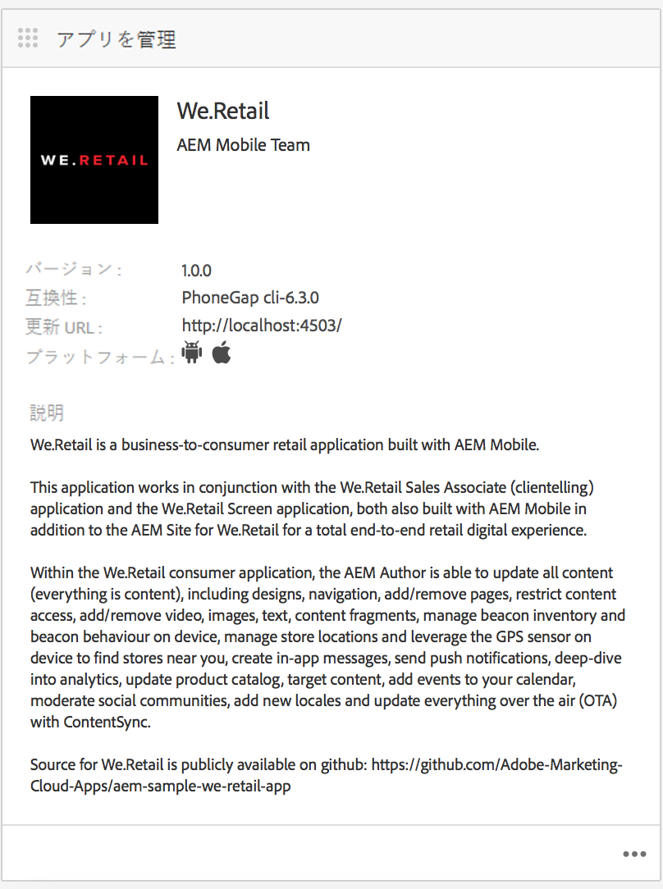
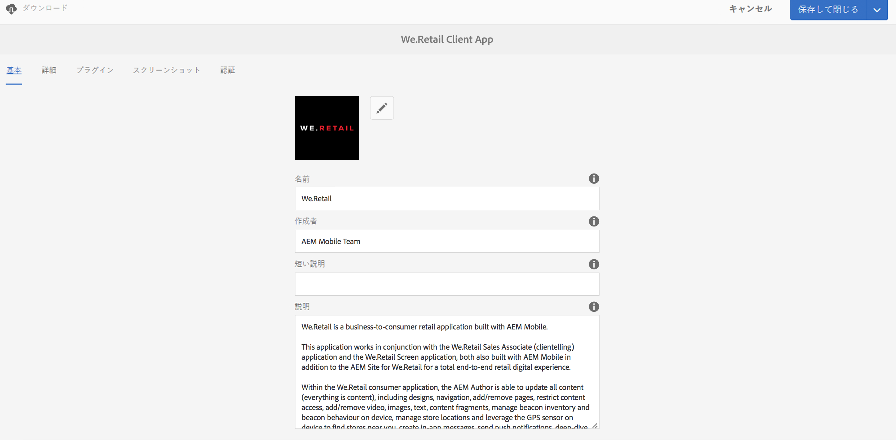
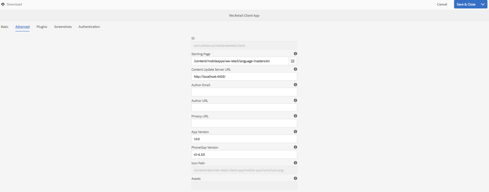
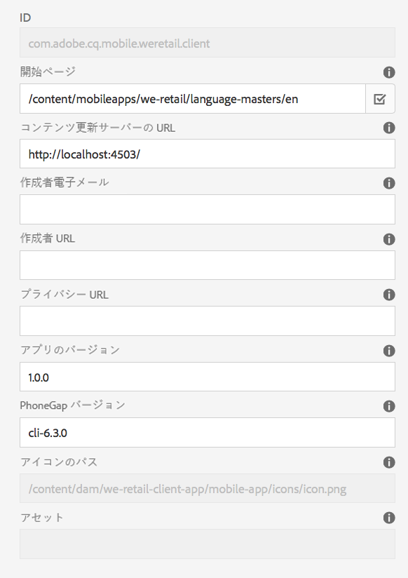
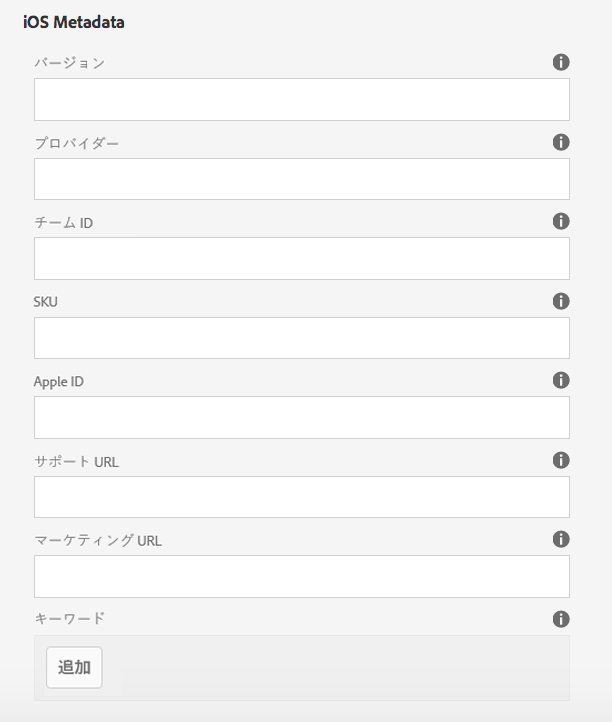
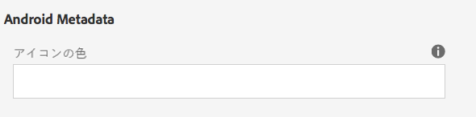
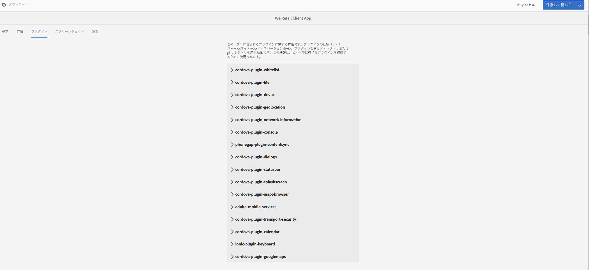
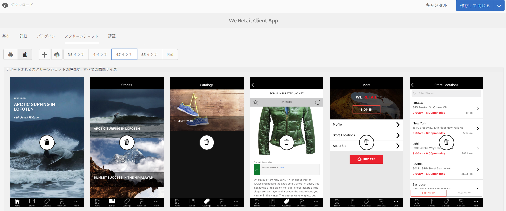
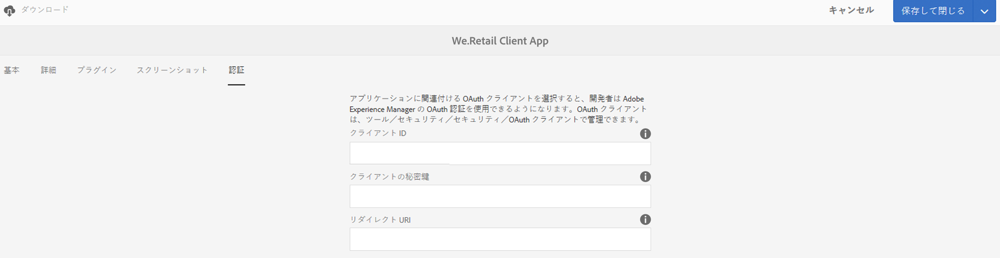

# アプリを管理タイル{#manage-app-tile}

{{ue-over-mobile}}

アプリダッシュボードの&#x200B;**`Manage App`** タイルでは、アプリケーションに関する詳細を編集できます。 詳細ページを開くには、**`Manage App`** タイルの詳細リンクをクリックします。 **`Manage App`** ページ内から、PhoneGap アプリケーション設定（config.xml）設定を編集し、様々なアプリケーションストアに送信するアプリケーションを準備できます。



## `Manage App` タイルについて {#understanding-the-manage-app-tile}

**`Manage App`** タイルの各タイルをドリルダウンして、右下隅にある「。..」をクリックすることで、詳細を表示または編集できます。

### 「基本」タブ {#the-basic-tab}

アプリの&#x200B;**Name**、**Author**、**Short Description**&#x200B;および&#x200B;**Description**&#x200B;をこのタブから編集できます。



### 「詳細」タブ {#the-advanced-tab}

各モバイルアプリケーションプラットフォームは、収集されるデータを説明し、各アプリケーションストアをターゲットにしています。

表示されるプラットフォームは、PhoneGap config.xml コンテンツによって駆動されます。

```xml
<widget>
<gap:platform name="ios"/>
<gap:platform name="android"/>
</widget>
```

Apple App StoreやGoogle Play Storeなどの各ベンダーアプリケーションストアでは、お客様にアプリケーションの詳細を表示するために、モバイルアプリケーションの1つまたは複数のスクリーンショットが必要です。 これらのスクリーンショットには、ディメンションとコンテンツに関する厳格な要件が適用される場合があります（基本的には、アプリケーションを真に表現する必要があります）。 AEM Appsでは、サポートされているプラットフォームでこれらのスクリーンショットを選択および管理し、各ベンダーのアプリケーションストアで必要に応じてポートディメンションを表示できます。

>[!NOTE]
>
>AEM Verify アプリを使用すると、AEMのアプリの詳細にスクリーンショットを直接送信できます。
>
>詳しくは、[AEM Verify](/help/mobile/phonegap-mobile-quickstart.md)のモバイルクイックスタートを参照してください。



### メタデータ {#metadata}

>[!NOTE]
>
>**`Manage App`** タイルについて理解できたら、[&#x200B; アプリのメタデータの編集](/help/mobile/phonegap-editmetadata.md)を参照して、メタデータを表示および編集します。

#### 共通メタデータ {#common-metadata}

各アプリケーションには、アプリケーションのさまざまな側面を設定するのに役立つメタデータが関連付けられている必要があります。 アプリの管理ページは、メタデータ収集に関連する2つの異なる領域に分かれています。 プラットフォーム固有のメタデータと共通メタデータ：

すべてのプラットフォームに共通の設定とメタデータがあります。

このセクションでは、コンテンツアップデートサーバーのURL、モバイルアプリケーションのランディングページ、コンパイル用のPhoneGap バージョン、アプリケーションのバージョン、名前、説明などを定義します。

**アプリ バージョン**&#x200B;は、アプリケーションの動作版です。 一般的なベストプラクティスは、最初のリリースの前に、30進表記を使用して1.0.0未満で開始することです。

**PhoneGap バージョン**&#x200B;は、アプリケーションをPhoneGapとコンパイルするバージョンです。 ベストプラクティスは、最新のバージョンに対応し、最新かつ最高の機能とバグ修正を確実に入手することです。

**Content Update Server URL**&#x200B;は、アプリケーションがContentSyncの更新を呼び出すために使用するURLです。 Dispatcher URLに設定する必要があります。また、Dispatcherを使用していない場合は、アプリケーションにContentSyncの更新を配信するために使用するパブリッシュインスタンスのいずれかに設定する必要があります。



>[!NOTE]
>
>フィールドにデータが入力されない限り、このセクションは空になります。
>
>詳細ビューの上部に「アプリケーションバージョン」、「PhoneGap バージョン」、「更新URL」が表示され、これらの各値は「共通メタデータ」セクション内で設定できます。 ただし、アプリケーション IDは編集できません。

#### Platform Metadata {#platform-metadata}

PhoneGap config.xmlで定義されているすべてのプラットフォームには、カスタムプラットフォームプロパティを含めることができます。 これらのプロパティをキャプチャするには、AEM開発者がコンテンツ構造を提供する必要があります。 IOSのプラットフォーム固有のプロパティの例を紹介します。

すべての設定済みプラットフォームのメタデータが、`Manage App` タイルの「詳細」タブに同時に表示されるようになりました。

>[!NOTE]
>
>プラットフォームのメタデータ セクションは、リモート PhoneGapのCLIまたはビルド中にPhoneGapで使用されません。 代わりに、AEMは、プラットフォームのメタデータをキャプチャしようとします。これにより、後でターゲットベンダーのアプリケーションストアに送信するときに使用できます。

AEMで理解されていないプラットフォームでは、AEM開発者がUIを拡張して、後でアプリケーションの提出プロセス中に書き出して使用できるメタデータをキャプチャすることは可能です。

#### iOS メタデータ {#ios-metadata}

Apple AppStoreでは、配布用にアプリケーションを送信するために追加のメタデータが必要です。 IOS メタデータセクションは、AppleのTMSTransporter ツールでメタデータを関連するApple デベロッパーのアカウントに公開するために使用できる必要な情報を収集しようとします。

Apple固有のメタデータを取得するには、[https://itunesconnect.apple.com](https://itunesconnect.apple.com/)にアプリケーションを作成します。 アプリケーションの作成時に、Appleはメタデータを生成します。これは、iOS メタデータセクションで必要なメタデータです。AppleのTMSTransporter ツールを使用してメタデータを検証し、itunesconnect.apple.comにアップロードする場合に必要です。 収集するメタデータを取得する場合は、iOS固有のメタデータに入力する必要はありません。 IOSと一般的なメタデータを結合するメタデータを書き出し、すべてのスクリーンショットをいつでもダウンロードできるzip ファイルに集めることができます。

ダウンロードされたzip ファイルには、metadata.xmlの検査が可能なitmsp ファイルが含まれています。 itmsp ファイルには、書き出されたメタデータ（metadata.xml ファイル内）と、関連するすべてのスクリーンショットが含まれます。

書き出し機能は、スクリーンショットとメタデータを収集する便利な方法を提供するために使用されます。この機能は、ベンダー固有のアプリケーションストアに入力するためにアプリケーションパブリッシャーに渡すことができます。



#### Android™ Metadata {#android-metadata}

Android™ プラットフォームを選択する場合、設定可能なカスタムメタデータは現時点で存在しません。 ダウンロードボタンをクリックすると、すべてのメタデータと関連するスクリーンショットを含むプロパティファイルを含むzip ファイルが生成されます。

書き出し機能は、スクリーンショットとメタデータを収集する便利な方法を提供するために使用されます。この機能は、ベンダー固有のアプリケーションストアに入力するためにアプリケーションパブリッシャーに渡すことができます。



### コンテンツ更新サーバーの URL {#content-update-server-url}

AEM Appsの主な機能のひとつは、コンテンツシンクを通じて、モバイルアプリケーションが新しいコンテンツをリクエストできることです。コンテンツシンクでは、HTML リソース、ページ、動画、画像、テキストなどをコンテンツに含めることができます。 コンテンツ作成者がコンテンツを更新し、そのコンテンツを公開すると、サーバーはモバイルアプリケーションがダウンロードできるコンテンツの更新を有効にします。

Content Update Server URL プロパティは、直接またはDispatcherまたはCDNを介して、パブリッシュインスタンスを指す必要があるURLです。 URLの形式は次のとおりです。

`https://[hostname]:[port]`

>[!NOTE]
>
>オーサーサーサーバーインスタンスが多くのパブリッシュサーバーインスタンス（AEMの一般的なアーキテクチャ）にレプリケートされている場合、各パブリッシュサーバーには同じ更新コンテンツが含まれます。 その理由は、更新がオーサー上に構築され、すべてのパブリッシュインスタンスにレプリケートされるためです。 基本的に、ロードバランシングとフェイルオーバーは完全にサポートされています。

### 「プラグイン」タブ {#the-plugins-tab}

「**プラグイン**」タブには、アプリに関連付けられているプラグインが表示されます。 この情報は、ビルド中に適切なプラグインを取得するために使用されます。



### 「Screenshots」タブ {#the-screenshots-tab}

「**スクリーンショット**」タブには、サポートされているスクリーンショット解像度が様々なプラットフォームに表示されます。



>[!NOTE]
>
>スクリーンショットを追加および削除するには、[&#x200B; アプリメタデータの編集](/help/mobile/phonegap-editmetadata.md)を参照してください。

### 「認証」タブ {#the-authentication-tab}

「**認証**」タブでは、アプリケーションに関連付けるOAuth クライアントを選択し、開発者がAdobe Experience ManagerのOAuth認証を使用できるようにします。



### 次の手順 {#the-next-steps}

アプリケーションダッシュボードでのアプリタイルの管理について理解したら、他のオーサリング役割に関する次のリソースを参照してください。

* [アプリのメタデータの編集](/help/mobile/phonegap-editmetadata.md)
* [アプリ定義](/help/mobile/phonegap-app-definitions.md)
* [アプリ作成ウィザードを使用した新しいアプリの作成](/help/mobile/phonegap-create-new-app.md)
* [既存のハイブリッドアプリの読み込み](/help/mobile/phonegap-adding-content-to-imported-app.md)
* [コンテンツサービス](/help/mobile/develop-content-as-a-service.md)

### その他のリソース {#additional-resources}

管理者と開発者の役割と責任について詳しくは、以下のリソースを参照してください。

* [AEMを使用したAdobe PhoneGap Enterpriseの開発](/help/mobile/developing-in-phonegap.md)
* [AEM を使用した Adobe PhoneGap Enterprise のコンテンツの管理](/help/mobile/administer-phonegap.md)
