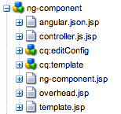

# モバイルアプリのページテンプレート {#page-templates-for-mobile-apps}

{{ue-over-mobile}}

## モバイルアプリのページテンプレート {#page-templates-for-mobile-apps-1}

angular アプリ用に作成するページコンポーネントは、/libs/mobileapps/components/server/ng-page コンポーネント（[ ローカルサーバーのCRXDE Liteーで開く ](http://localhost:4502/crx/de/index.jsp#/libs/mobileapps/components/angular/ng-page)）に基づいています。 このコンポーネントには、コンポーネントが継承またはオーバーライドする次の JSP スクリプトが含まれています。

* ng-page.jsp
* head.jsp
* body.jsp
* angular-app-module.js.jsp
* angular-route-fragment.js.jsp
* angular-app-controllers.js.jsp
* controller.js.jsp
* template.jsp
* angular-module-list.js.jsp
* header.jsp
* footer.jsp
* js_clientlibs.jsp
* css_clientlibs.jsp

### ng-page.jsp {#ng-page-jsp}

`applicationName` プロパティを使用してアプリケーションの名前を決定し、pageContext を使用して公開します。

head.jsp と body.jsp が含まれます。

### head.jsp {#head-jsp}

アプリページの `<head>` 要素を書き出します。

アプリの viewport meta プロパティを上書きする場合は、上書きするファイルです。

ベストプラクティスに従い、アプリの場合は、クライアントライブラリの css 部分が head に含まれ、JS の場合は、closing &lt; `body>` 要素に含まれます。

### body.jsp {#body-jsp}

angularページの本文のレンダリングは、wcmMode が検出されるかどうかによって異なります（!= WCMMode.DISABLED）を使用して、ページをオーサリング用に開くか、公開済みページとして開くかを指定します。

**オーサーモード**

オーサーモードでは、個々のページが別々にレンダリングされます。 Angularは、ページ間のルーティングを処理しません。また、ページのコンポーネントを含む部分的なテンプレートの読み込みに使用される ng ビューでもありません。 代わりに、ページテンプレート（template.jsp）のコンテンツが、`cq:include` タグを介してサーバー側で含まれます。

この方法を使用すると、作成者の機能（段落システムでのコンポーネントの追加や編集、Sidekick、デザインモードなど）を変更せずに機能させることができます。 アプリ用のページなど、クライアントサイドのレンダリングに依存するページは、AEM オーサーモードでは適切に実行されません。

template.jsp インクルードは、`ng-controller` ディレクティブを含む `div` 要素にラップされます。 この構造により、DOM コンテンツとコントローラをリンクすることが可能になります。 そのため、クライアントサイドでページをレンダリングするページは失敗しますが、個々のコンポーネントは正常に機能します（以下のコンポーネントの節を参照）。

```xml
<div ng-controller="<c:out value="${controllerNameStripped}"/>">
      <cq:include script="template.jsp"/>
</div>
```

**Publish モード**

公開モードでは（コンテンツ同期を使用してアプリを書き出す場合など）、すべてのページがシングルページアプリ（SPA）になります。 （SPAについて詳しくは、Angularのチュートリアル（[https://docs.angularjs.org/tutorial/step_07](https://docs.angularjs.org/tutorial/step_07)）を参照してください。）

SPA（`<html>` 要素を含むページ）には 1 つのHTMLページしかありません。 このページは、「レイアウトテンプレート」と呼ばれます。 angularの用語では、「。..これは、アプリケーション内のすべてのビューに共通のテンプレートです。」という意味です。 このページを「トップレベルのアプリページ」と見なします。 慣例により、最上位のアプリページは、ルートに最も近い（リダイレクトではない）アプリケーションの `cq:Page` ノードです。

アプリの実際の URI は公開モードで変更されないので、このページから外部アセットへの参照には相対パスを使用する必要があります。 したがって、書き出し用に画像をレンダリングする際にこの最上位ページを考慮に入れる特別な画像コンポーネントが提供されます。

SPAの場合、このレイアウトテンプレートページでは、ng-view ディレクティブを使用して div 要素を生成するだけです。

```xml
 <div ng-view ng-class="transition"></div>
```

angularルートサービスは、この要素を使用して、現在のページ（template.jsp に含まれる）のオーサリング可能なコンテンツを含む、アプリ内のすべてのページのコンテンツを表示します。

body.jsp ファイルには、空の header.jsp と footer.jsp が含まれます。 すべてのページに静的コンテンツを提供する場合は、アプリでこれらのスクリプトを上書きできます。

最後に、JavaScript clientlibs が &lt;body> 要素の下部に含まれ、サーバー上で生成される 2 つの特別な JS ファイル（*&lt;page name>*.angularー app-module.js および *&lt;page name>*.angularー app-controllers.js）が含まれます。

### angular-app-module.js.jsp {#angular-app-module-js-jsp}

このスクリプトは、アプリケーションのAngularモジュールを定義します。 このスクリプトの出力は、テンプレートのコンポーネントの残りの部分が生成するマークアップにリンクされています。マークアップは、ng-page.jsp の `html` 要素を介して生成され、次の属性が含まれます。

```xml
ng-app="<c:out value='${applicationName}'/>"
```

この属性は、この DOM 要素のコンテンツを次のモジュールにリンクする必要があることをAngularに示します。 このモジュールは、ビュー（AEMでは cq:Page resources）を対応するコントローラーにリンクします。

また、このモジュールは、`wcmMode` 変数をスコープに公開し、コンテンツ同期の更新ペイロードを取得する URI を設定する、`AppController` という名前の最上位コントローラも定義します。

最後に、このモジュールは各 descendant page （それ自体を含む）を反復処理し、各 page のルートフラグメントのコンテンツを（angular-route-fragment.js セレクターおよび拡張子を介して）レンダリングします。これには、Angularの$routeProvider への config エントリとして含まれます。 つまり、$routeProvider は、特定のパスがリクエストされたときにレンダリングするコンテンツをアプリに指示します。

### angular-route-fragment.js.jsp {#angular-route-fragment-js-jsp}

このスクリプトは、次の形式を取る必要があるJavaScript フラグメントを生成します。

```
.when('/<path>', {
    templateUrl: '<path to template>',
    controller: '<controller name>'
})
```

このコードは、$routeProvider （angular-app-module.js.jsp で定義）に対して、&#39;/&lt;path>&#39;が `templateUrl` のリソースによって処理され、`controller` によってワイヤリングされることを示しています（次に進みます）。

必要に応じて、このスクリプトを上書きして、変数を含むより複雑なパスを処理できます。 この例は、AEMと共にインストールされる/apps/weretail-app/components/angular/ng-template-page/angular-route-fragment.js.jsp スクリプトに表示されます。

```xml
// note the :id suffix on the path
.when('<c:out value="${resource.path}"/>/:id', {
    templateUrl: '<c:out value="${relativeResourcePath}"/>.template.html',
    controller: '<c:out value="${controllerNameStripped}"/>'
})
```

### angular-app-controllers.js.jsp {#angular-app-controllers-js-jsp}

angular、コントローラは$scope 内の変数をワイヤアップし、ビューに公開します。 angular-app-controllers.js.jsp スクリプトは、angular-app-module.js.jsp で示されるパターンに従います。つまり、このスクリプトは下位の各ページ（それ自体を含む）を反復処理し、各ページが定義するコントローラフラグメント（controller.js.jsp 経由）を出力します。 このモジュールが定義するモジュールは `cqAppControllers` と呼ばれ、ページコントローラーが使用可能になるように、最上位のアプリモジュールの依存関係としてリストされる必要があります。

### controller.js.jsp {#controller-js-jsp}

controller.js.jsp スクリプトは、各ページのコントローラフラグメントを生成します。 このコントローラフラグメントの形式は次のとおりです。

```
.controller('<c:out value="${controllerNameStripped}"/>', ['$scope', '$http',
    function($scope, $http) {
        var data = $http.get('<c:out value="${relativeResourcePath}"/>.angular.json' + cacheKiller);

        // component fragments which consume the contents of `data` go here
    }
])
```

`data` 変数には、Angular`$http.get` メソッドから返される promise が割り当てられます。 このページに含まれる各コンポーネントでは、必要に応じて.json コンテンツを（angular.json.jsp スクリプト経由で）使用できるようにし、リクエストの解決時にこのリクエストのコンテンツに基づいて処理を行うことができます。 モバイルデバイスでは、ファイルシステムにアクセスするだけなので、リクエストは非常に高速です。

この方法でコンポーネントをコントローラーの一部にするには、/libs/mobileapps/components/extend/ng-component コンポーネントをangularし、`frameworkType: angular` プロパティを含める必要があります。

### template.jsp {#template-jsp}

最初に body.jsp セクションで紹介されるように、template.jsp にはページの parsys が含まれます。 公開モードでは、このコンテンツは（&lt;page-path>.template.html で）直接参照され、$routeProvider に設定された templateUrl を介してSPAに読み込まれます。

このスクリプトの parsys は、任意のタイプのコンポーネントを受け入れるように設定できます。 ただし、（SPAではなく）従来の web サイト用に構築されたコンポーネントを扱う場合は注意が必要です。 例えば、基盤画像コンポーネントは、アプリ内のアセットを参照するように設計されていないので、最上位のアプリページでのみ正しく機能します。

### angular-module-list.js.jsp {#angular-module-list-js-jsp}

このスクリプトは、トップレベルのAngularアプリモジュールのAngularの依存関係を出力するだけです。 angular-app-module.js.jsp によって参照されます。

### header.jsp {#header-jsp}

静的コンテンツをアプリの上部に配置するスクリプト。 このコンテンツは、ng-view の範囲外で、トップレベルページに含まれています。

### footer.jsp {#footer-jsp}

アプリの下部に静的コンテンツを配置するスクリプト。 このコンテンツは、ng-view の範囲外で、トップレベルページに含まれています。

### js_clientlibs.jsp {#js-clientlibs-jsp}

このスクリプトを上書きしてJavaScript clientlibs を含めます。

### css_clientlibs.jsp {#css-clientlibs-jsp}

このスクリプトを上書きして CSS clientlibs を含めます。

## アプリのコンポーネント {#app-components}

アプリコンポーネントは、AEM インスタンス（パブリッシュまたはオーサー）で動作するだけでなく、コンテンツ同期によってアプリケーションコンテンツがファイルシステムに書き出される場合にも動作する必要があります。 したがって、コンポーネントには次の特性を含める必要があります。

* PhoneGap アプリケーション内のすべてのアセット、テンプレート、スクリプトは、相対的に参照する必要があります。
* AEM インスタンスがオーサーモードまたはパブリッシュモードで動作している場合は、リンクの処理が異なります。

### 相対Assets {#relative-assets}

PhoneGap アプリケーションの特定のアセットの URI は、プラットフォームごとに異なるだけでなく、アプリのインストールごとに一意になります。 例えば、iOS シミュレーターで動作しているアプリの次の URI に注意してください。

`file:///Users/userId/Library/Application%20Support/iPhone%20Simulator/7.0.3/Applications/24BA22ED-7D06-4330-B7EB-F6FC73251CA3/Library/files/www/content/phonegap/weretail/apps/ng-we-retail/en/home.html`

パス内の GUID 「24BA22ED-7D06-4330-B7EB-F6FC73251CA3」を確認します。

PhoneGap デベロッパーの場合、関係するコンテンツは www ディレクトリの下にあります。 アプリアセットにアクセスするには、相対パスを使用します。

この問題を複雑にするために、PhoneGap アプリケーションでは、ベース URI （ハッシュを除く）が変更されないように、シングルページアプリ（SPA）のパターンを使用します。 したがって、参照するすべてのアセット、テンプレートまたはスクリプト **は、最上位ページに対する相対パスである必要があります。 **トップレベルのページでは、`<name>.angular-app-module.js` と `<name>.angular-app-controllers.js` を使用して、Angularのルーティングとコントローラを初期化しています。 このページは、sling:redirect を拡張しないリポジトリのルートに最も近いページである必要があります。

相対パスを処理するために、次のヘルパーメソッドを使用できます。

* FrameworkContentExporterUtils.getTopLevelAppResource
* FrameworkContentExporterUtils.getRelativePathToRootLevel
* FrameworkContentExporterUtils.getPathToAsset

使用例を確認するには、/libs/mobileapps/components/location にある mobileapps ソースをangularします。

### リンク {#links}

リンクは、すべての WCM モードをサポートする `ng-click="go('/path')"` 関数を使用する必要があります。 この関数は、スコープ変数の値に依存して、リンクアクションを正しく判断します。

```xml
<c:choose><c:when test="${wcmMode}">
    <%-- WCMMode is enabled - page is being rendered in AEM --%>
    $scope.wcmMode = true;
</c:when><c:otherwise>
    <%-- WCMMode is disabled --%>
    $scope.wcmMode = false;
</c:otherwise></c:choose>
```

`$scope.wcmMode == true` の場合、結果が URL のパスやページ部分に対する変更であるなど、各ナビゲーションイベントを通常の方法で処理します。

または、`$scope.wcmMode == false` の場合、各ナビゲーションイベントは、URL のハッシュ部分に対する変更を伴い、Angularの ngRoute モジュールによって内部で解決されます。

### コンポーネントスクリプトの詳細 {#component-script-details}



### ng-component.jsp {#ng-component-jsp}

このスクリプトは、編集モードが検出されると、コンポーネントのコンテンツまたは適切なプレースホルダーを表示します。

### template.jsp {#template-jsp-1}

template.jsp スクリプトは、コンポーネントのマークアップをレンダリングします。 問題のコンポーネントがAEMから抽出された JSON データ（「ng-text」など：/libs/mobileapps/components/angular/ng-text/template.jsp）によって駆動される場合、このスクリプトは、ページのコントローラースコープによって公開されたデータを使用してマークアップをワイヤリングします。

ただし、パフォーマンス要件により、クライアント側のテンプレート（データバインディングとも呼ばれます）を実行しないことが求められる場合があります。 この場合は、コンポーネントのマークアップをサーバーサイドでレンダリングするだけで、ページテンプレートコンテンツに含められます。

### overhead.jsp {#overhead-jsp}

JSON データで駆動されるコンポーネント（「ng-text」など：/libs/mobileapps/components/template/ng-text）では、overhead.jsp を使用して、angular.jsp からすべての Java コードを削除できます。 その後、template.jsp から参照され、リクエストで公開されているすべての変数が使用できるようになります。 この方法では、プレゼンテーションからのロジックの分離が推奨され、既存のコンポーネントから新しいコンポーネントを派生する際に、コピーして貼り付ける必要があるコードの量が制限されます。

### controller.js.jsp {#controller-js-jsp-1}

[AEMのページテンプレート ](/help/mobile/apps-architecture.md) に記載されているように、各コンポーネントはJavaScript フラグメントを出力して、`data` プロミスによって公開された JSON コンテンツを使用できます。 angular規則に従って、コントローラはスコープに変数を割り当てる場合にのみ使用してください。

### angular.json.jsp {#angular-json-jsp}

このスクリプトは、ng-page を拡張するページごとに書き出されるページ全体の「&lt;page-name>.page.json」ファイルにフラグメントとしてangularされます。 このファイルで、コンポーネント開発者は、コンポーネントに必要な任意の JSON 構造を公開できます。 「ng-text」の例では、この構造は、コンポーネントのテキストコンテンツと、コンポーネントにリッチテキストが含まれているかどうかを示すフラグのみを含みます。

We.Retail アプリangularコンポーネントは、より複雑な例です（/apps/weretail-app/components/product/ng-product）。

```xml
{
    "content-par/ng-product": {
        "items": [{
            "name": "Cajamara",
            "description": "Bike",
            "summaryHTML": "",
            "price": "$610.00",
            "SKU": "eqsmcj",
            "numberOfLikes": "0",
            "numberOfComments": "0"
        }]
    },
    "content-par/ng-product/ng-image": {
        "items": [{
            "hasContent": true,
            "imgSrc": "home/products/eq/eqsm/eqsmcj/jcr_content/content-par/ng-product/ng-image.img.jpg/1377771306985.jpg",
            "description": "",
            "alt": "Cajamara",
            "title": "Cajamara",
            "hasLink": false,
            "linkPath": "",
            "attributes": [{
                "attributeName": "class",
                "attributeValue": "cq-dd-image"
            }]
        }]
    }
}
```

## CLI Assets ダウンロードの内容 {#contents-of-the-cli-assets-download}

アプリコンソールから CLI アセットをダウンロードして、特定のプラットフォーム用に最適化してから、PhoneGap コマンドライン統合（CLI） API を使用してアプリを作成します。 ローカルファイルシステムに保存する ZIP ファイルの内容は、次のような構造になっています。

```xml
.cordova/
  |- hooks/
     |- after_prepare/
     |- before_platform_add/
     |- Other Hooks
plugins/
www/
  |- config.xml
  |- index.html
  |- res/
  |- etc/
  |- apps/
  |- content/
  |- package.json
  |- package-update.json
```

### .cordova {#cordova}

これは、現在の OS 設定によっては表示されない隠しディレクトリです。 このディレクトリに含まれるアプリフックを変更する予定がある場合は、このディレクトリが表示されるように OS を設定する必要があります。

### .cordova/hooks/ {#cordova-hooks}

このディレクトリには [CLI フック ](https://gist.github.com/jlcarvalho/22402d013bc72f795d45a01836ce735c) が含まれています。 hooks ディレクトリのフォルダーには、ビルド中の正確なポイントで実行される node.js スクリプトが含まれています。

### .cordova/hooks/after-platform_add/ {#cordova-hooks-after-platform-add}

after-platform_add ディレクトリには、`copy_AMS_Conifg.js` ファイルが含まれます。 このスクリプトは、AdobeMobile Services 分析の収集をサポートする設定ファイルをコピーします。

### .cordova/hooks/after-prepare/ {#cordova-hooks-after-prepare}

後準備ディレクトリには `copy_resource_files.js` ファイルが含まれます。 このスクリプトは、複数のアイコンとスプラッシュスクリーンの画像をプラットフォーム固有の場所にコピーします。

### .cordova/hooks/before_platform_add/ {#cordova-hooks-before-platform-add}

before_platform_add ディレクトリには、`install_plugins.js` ファイルが含まれます。 このスクリプトは、Cordova プラグイン識別子のリストを反復処理し、検出された識別子はまだ使用できない識別子をインストールします。

この方法では、Maven `content-package:install` コマンドを実行するたびにプラグインをバンドルしてAEMにインストールする必要はありません。 ファイルを SCM システムにチェックインする別の方法として、バンドルとインストールを繰り返し行う必要があります。

### .cordova/hook/Other Hook {#cordova-hooks-other-hooks}

必要に応じて他のフックを含めます。 次のフックを使用できます（Phonegap サンプル hello world アプリによって提供されています）。

* after_build
* before_build
* after_compile
* before_compile
* after_docs
* before_docs
* after_emulate
* before_emulate
* after_platform_add
* before_platform_add
* after_platform_ls
* before_platform_ls
* after_platform_rm
* before_platform_rm
* after_plugin_add
* before_plugin_add
* after_plugin_ls
* before_plugin_ls
* after_plugin_rm
* before_plugin_rm
* after_prepare
* before_prepare
* after_run
* before_run

### プラットフォーム/ {#platforms}

このディレクトリは、プロジェクトで `phonegap run *<platform>*` コマンドを実行するまで空です。 現在、`*<platform>*` は `ios` または `android` のいずれかです。

特定のプラットフォーム用にアプリをビルドすると、対応するディレクトリが作成され、プラットフォーム固有のアプリコードが含まれます。

### plugins/ {#plugins}

plugins ディレクトリには、`phonegap run *<platform>*` コマンドを実行した後に `.cordova/hooks/before_platform_add/install_plugins.js` ファイルにリストされている各プラグインが入力されます。 ディレクトリは最初は空です。

### www/ {#www}

www ディレクトリには、アプリケーションの外観と動作を実装するすべての web コンテンツ（HTML、JS、CSS ファイル）が含まれています。 以下に説明する例外を除き、このコンテンツはAEMから生成され、コンテンツ同期を介して静的フォームに書き出されます。

### www/config.xml {#www-config-xml}

PhoneGap のドキュメント（`https://docs.phonegap.com`）では、このファイルを「グローバル設定ファイル」と呼んでいます。 config.xml には、アプリの名前、アプリの「環境設定」（例えば、iOS web ビューでオーバースクロールが許可されているかどうか）、PhoneGap ビルドで使用される *のみ* プラグインの依存関係など、多くのアプリプロパティが含まれています。

config.xml ファイルはAEMの静的ファイルで、コンテンツ同期を使用してそのまま書き出されます。

### www/index.html {#www-index-html}

index.html ファイルが、アプリケーションの開始ページにリダイレクトされます。

config.xml ファイルには、`content` の要素が含まれています。

`<content src="content/phonegap/weretail/apps/ng-we-retail/en.html" />`

PhoneGap のドキュメント（`https://docs.phonegap.com`）では、この要素は「オプションの &lt;content> 要素は、トップレベルの web アセットディレクトリでアプリの開始ページを定義します。 デフォルト値は index.html で、通常はプロジェクトの最上位の www ディレクトリに表示されます。」

index.html ファイルが存在しない場合、PhoneGap ビルドは失敗します。 そのため、このファイルはインクルードされます。

### www/res {#www-res}

res ディレクトリには、スプラッシュ・スクリーン・イメージとアイコンが含まれています。 `copy_resource_files.js` スクリプトは、`after_prepare` ビルドフェーズでファイルをプラットフォーム固有の場所にコピーします。

### www/etc {#www-etc}

慣例により、AEMでは、/etc ノードに静的 clientlib コンテンツが含まれます。 etc ディレクトリには、Topcoat、AngularJS、We.Retail ng-clientlibsall ライブラリが含まれています。

### www/apps {#www-apps}

apps ディレクトリには、スプラッシュページに関連するコードが含まれています。 AEM アプリのスプラッシュページの独特の特徴は、ユーザーの操作なしでアプリを初期化することです。 したがって、アプリの clientlib コンテンツ（CSS と JS の両方）は、パフォーマンスを最大化するために最小限に抑えられます。

### www/content {#www-content}

コンテンツディレクトリには、アプリの残りの web コンテンツが含まれます。 コンテンツには次のファイルが含まれますが、これらに限定されません。

* AEMで直接作成されるHTMLページコンテンツ
* AEM コンポーネントに関連付けられた画像アセット
* サーバーサイドスクリプトで生成されるJavaScript コンテンツ
* ページまたはコンポーネントのコンテンツを記述する JSON ファイル

### www/package.json {#www-package-json}

package.json ファイルは、**完全な** コンテンツ同期のダウンロードに含まれるファイルをリストするマニフェストファイルです。 このファイルには、コンテンツ同期ペイロードが生成されたタイムスタンプも含まれています（`lastModified`）。 このプロパティは、AEMからアプリの部分的な更新をリクエストする際に使用されます。

### www/package-update.json {#www-package-update-json}

このペイロードがアプリ全体のダウンロードである場合、このマニフェストにはファイルの正確なリストが `package.json` として含まれます。

ただし、このペイロードが部分的なアップデートの場合は、`package-update.json` の特定のペイロードに含まれるファイルのみが含まれます。
