# アプリコンソールを使用したアプリの作成および編集{#creating-and-editing-apps-using-the-apps-console}

>[!NOTE]
>
>単一ページアプリケーションフレームワークを基にしたクライアント側レンダリング（React など）が必要なプロジェクトでは、SPA エディターを使用することをお勧めします。[詳細情報](/help/sites-developing/spa-overview.md)

AEM Mobile アプリケーション開発プロセスでは、さまざまな専門知識を持つユーザーがモバイルアプリケーション開発に寄与することが認められています。次のプロセスマップは、コンテンツ作成者およびアプリケーション開発者がタスクを実行する一般的な順序を示しています。

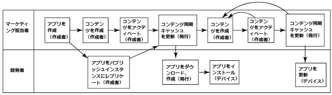

このページでは、マーケティング担当者のタスクを実行する方法について説明します。開発者のタスクについては、PhoneGap アプリケーションの構築を参照してください。

## モバイルアプリケーションの構造 {#the-structure-of-mobile-applications}

AEM Mobile では、モバイルアプリケーションを作成するための PhoneGap アプリのブループリントが提供されます。ブループリントは、作成するアプリケーションの構造を定義したものです。アプリケーションは、次の項目で構成されています。

* ルートページ。
* アプリケーションの言語バリエーション。
* 言語バリエーションのホームページ。

### PhoneGap アプリのルート {#the-root-of-a-phonegap-app}

AEM で作成するモバイルアプリケーションのルートページは、アプリコンソールに表示されます。

ルートページは、アプリケーションの作成時に指定された、アプリケーションの「宛先のパス」プロパティの下に格納されます（デフォルトのパスは /content/phonegap/apps です）。ページ名は、アプリケーションの「名前」プロパティです。For example, the default URL of the root page of the site named `myphonegapapp` is `http://localhost:4502/content/phonegap/apps/myphonegapapp.html`.

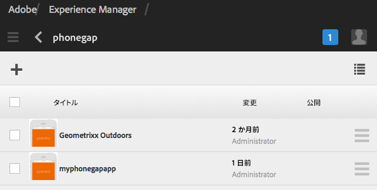

### PhoneGap アプリの言語バリエーション {#the-language-variation-of-a-phonegap-app}

ルートページの最初の子ページは、アプリケーションの言語バリエーションです。各ページの名前は、アプリケーションの作成に使用される言語です。例えば、アプリケーションの英語バリエーションの名前は English です。

**注意：** デフォルトの PhoneGap ブループリントは、英語アプリケーションのみを作成します。開発者は、追加の言語バリエーションも作成できるようにブループリントを変更できます。

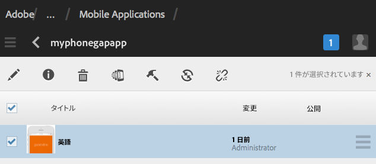

言語ページは、次の 2 つの目的を果たします。

* ページコンテンツは、アプリケーションの言語バリエーションのスプラッシュページです。
* ページプロパティは、コンテンツ更新の要求に使用する URL や、クラウドビルドと Adobe Analytics サービス統合への接続に関する情報など、アプリケーションのさまざまなデザイン面を制御します。

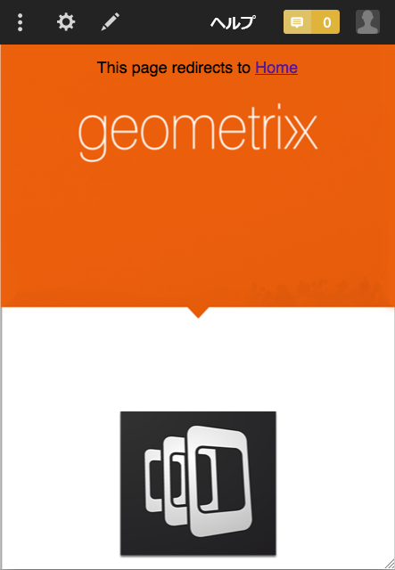

### ホームページ {#the-home-page}

ホームページ（アプリケーションの言語バリエーションの index.html ページ）は、アプリケーションを開いたときに表示されます。ホームページでは、ユーザーはアプリ内のさまざまなページへのリンクが配置されたメニューを利用できます。段落システムでは、コンテンツを作成するためのコンポーネントをページに追加できます。

## モバイルアプリケーションの作成 {#creating-a-mobile-application}

モバイルアプリケーションは、ページ構造およびプロパティを定義するブループリントに基づいています。次のアプリケーションプロパティを設定できます。

* **タイトル：**&#x200B;アプリケーションのタイトル。
* **宛先のパス：**&#x200B;アプリケーションが格納されるリポジトリ内での場所。デフォルトのままにすると、アプリ名に基づいてパスが作成されます。

* **名前：**&#x200B;デフォルト値は、「タイトル」プロパティの値から空白文字を除外した値です。この名前は、CQ 内でアプリケーションを参照するために使用されます（例えば、アプリケーションを表すリポジトリノードなど）。
* **説明：**&#x200B;アプリケーションの説明。
* **サーバー URL：**&#x200B;アプリケーションに対して無線（OTA）によるコンテンツ更新を提供する URL。デフォルト値は、アプリケーションの作成に使用するインスタンスのパブリッシュサーバー URL です（Externalizer サービスから取得されます）。これは、作成者ではなく、発行サーバーインスタンスである必要があります。これには認証が必要です。

アプリケーションサムネールとして使用する画像ファイルを提供したり、使用する PhoneGap Build 設定を選択したり、使用するモバイルアプリ分析設定を選択したりすることもできます。この画像は、Experience Managerのモバイルアプリコンソール内でモバイルアプリを表すためのサムネールとしてのみ使用されます。

その他の（オプションの）タブは、ビルドクラウドサービス向けで、Adobe Mobile Services SDK プラグインをアプリに統合する場合に使用します。

* ビルド：ここでは、「設定を管理」をクリックし、build.phonegap.com ビルドサービスを設定します。次に、ドロップダウンから、新規に作成した PhoneGap Build クラウドサービスを選択できます。
* 分析：「設定を管理」をクリックし、[Adobe Mobile Services SDK](https://docs.adobe.com/content/help/en/mobile-services/using/home.html) クラウドサービスを設定します。ドロップダウンから、モバイルアプリに統合する新しく作成したモバイルサービスを選択できるようになります。

>[!NOTE]
>
>開発者は、AEM PhoneGap スターターキットを使用してアプリを作成し、コンソールに追加できます。

次の手順では、タッチ UI を使用して、モバイルアプリケーションを作成します。

1. レールで、「アプリ」をクリックします。
1. 「作成」アイコンをクリックまたはタップします。

   

1. （オプション）「詳細」タブで、アプリケーションの説明を指定し、必要に応じてサーバー URL を変更します。
1. （オプション）PhoneGap Build を使用してアプリケーションをコンパイルしている場合には、「ビルド」タブで、使用する設定を選択します。

   PhoneGap Build 設定を作成するには、「設定を管理」をクリックします。

1. （オプション）SiteCatalyst を使用してアプリケーションアクティビティをトラッキングしている場合には、「分析」タブで、使用する設定を選択します。

   モバイルアプリケーション設定を作成するには、「設定を管理」をクリックします。

1. （オプション）アプリケーションアイコンを指定するには、「参照」ボタンをクリックして、ファイルシステムから画像ファイルを選択し、「開く」をクリックします。
1. 「作成」をクリックします。

### モバイルアプリケーションのプロパティの変更 {#changing-the-properties-of-a-mobile-application}

モバイルアプリケーションを作成したら、プロパティを変更できます。

#### タイトル、説明およびアイコンを変更します。 {#change-the-title-description-and-icon}

1. レールで、「アプリ」をクリックまたはタップします。
1. 設定するアプリケーションを選択し、「ページのプロパティを表示」アイコンをクリックします。

   

1. プロパティ値を変更するには、「編集」アイコンをクリックまたはタップします。

   

1. 「基本」および「詳細」のプロパティを設定し、「完了」アイコンをクリックまたはタップします。

   

#### アプリケーションの言語バリエーションを設定します。 {#configure-a-language-variation-of-the-application}

1. レールで、「アプリ」をクリックまたはタップします。
1. アプリ管理コンソール内で、クリックして編集対象のモバイルアプリケーションを表示します。設定するアプリケーションの言語バージョンを選択し、「アプリケーションのプロパティを表示」アイコンをクリックします。

   

1. プロパティ値を変更するには、「編集」アイコンをクリックまたはタップします。

   

1. 「基本」、「詳細」、「ビルド」、「分析」の各タブでプロパティを設定し、「完了」アイコンをクリックまたはタップします。

   

### モバイルアプリケーションのコンテンツのオーサリング {#authoring-the-content-of-a-mobile-application}

モバイルアプリケーションを作成したら、アプリケーション UI として使用するコンテンツを追加します。

1. レールで、「アプリ」をクリックまたはタップします。
1. アプリケーションをクリックまたはタップし、「英語」をクリックまたはタップします。
1. ホームページを編集するか、または必要に応じて子ページを追加します。

### モバイルアプリケーションへのコンテンツの移動 {#moving-content-to-mobile-applications}

AEM パブリッシュインスタンスのコンテンツ同期キャッシュは、モバイルアプリケーション向けのコンテンツのリポジトリとして使用されます。

* コンテンツ同期キャッシュ内のコンテンツは、開発者がアプリケーションをコンパイルする際にアプリケーションにインクルードされます。
* キャッシュ内のコンテンツは、インストール済みのモバイルアプリケーションでアプリケーションコンテンツを更新するために使用できます。

モバイルアプリケーションには、更新されたアプリケーションコンテンツをダウンロードしてインストールする「更新」コマンドが含まれます。アプリケーションインスタンスが更新要求を送信すると、コンテンツ同期は前回のアプリケーションの更新またはインストール後に変更されたコンテンツを特定し、新規コンテンツを提供します。

更新されたコンテンツをアプリケーションで利用できるようにするには、コンテンツ同期キャッシュを更新します。初めてキャッシュを更新すると、公開済みのすべてのコンテンツが追加されます。以後の更新では、前回の更新以降に変更された公開済みコンテンツのみが追加されます。

コンテンツ同期は、更新が行われた日時もトラッキングします。この情報を利用して、コンテンツ同期はモバイルアプリケーションに送信するキャッシュ更新を特定できます。

キャッシュを更新するインスタンスに対して次の手順を実行します。例えば、アプリケーションがパブリッシュインスタンスに更新を要求する場合は、パブリッシュインスタンスでこの手順を実行します。

1. レールで、「アプリ」をクリックまたはタップし、アプリケーションをクリックまたはタップします。
1. スプラッシュページを選択し、「キャッシュを更新」アイコンをクリックまたはタップします。

   

### アプリテンプレートの使用 {#using-app-templates}

これは、Apps 6.1 Feature Pack 2で利用できる機能で、AEM内で新しいアプリを作成する際に既存のアプリテンプレートを利用しやすい方法です。

アプリテンプレートとはアプリのベースラインまたは基盤となるページテンプレートおよびコンポーネントをひとまとめにしたものと考えることができます。新規アプリを別のアプリのテンプレートに基づいて作成すると、作成元アプリと同じ開始点からアプリを作成することができます。

この機能を利用するには、既存のモバイルアプリテンプレートが必要です（またはアプリテンプレートを含むアプリがインストールされている必要があります）。

最新のAEM Apps 6.1サンプルパッケージには、Geometrixxアプリの更新版とアプリテンプレートが含まれています。 または、テンプレートも提供するStarterKitをインストールすることもできます。

アプリテンプレートに基づいて新規アプリを作成する手順：

1. 最新の AEM Apps 6.1 機能パックおよび参照サンプルパッケージをインストール済みであることを確認します。
1. 左側のレールから「アプリ」をクリックします。

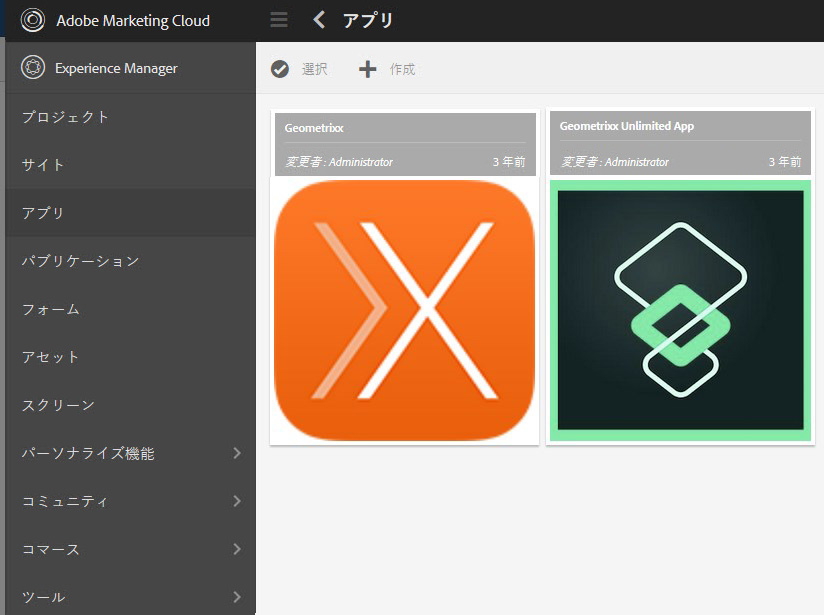

1. 最上部にある「+ 作成」ボタンをクリックし、「アプリを作成」を選択します。
1. アプリテンプレートのリストが表示されたら、以下のいずれかを選択します。

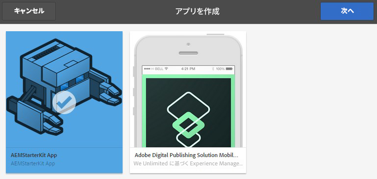

1. 「次へ」をクリックします。
1. アプリの「ID」および「タイトル」を指定します。ただし、「名前」および「説明」も含めることをお勧めします。

   1. また、AEM アセットを参照して、PNG（サポートされている PhoneGap アイコン形式）をアイコンとして提供することもできます。
   1. これらのすべてのフィールドは、アプリを管理タイルでアプリを作成した後に編集することができます。ただし「アプリ ID」は例外で、一度設定したら変更できません。

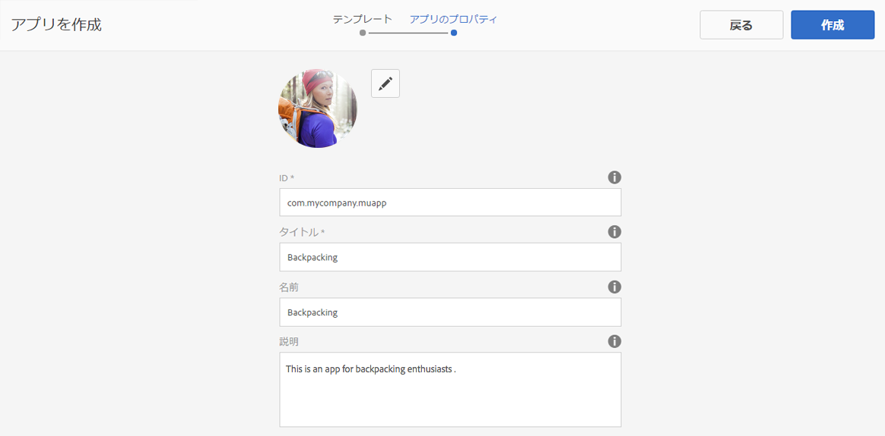

1. 「作成」ボタンをクリックすると、「完了」（アプリカタログビューに戻ります）と「アプリを管理」（アプリダッシュボードを開きます）という 2 つのオプションが表示されます。
1. 新しいアプリを作成すると、アプリカタログに新しいアプリが表示されます。

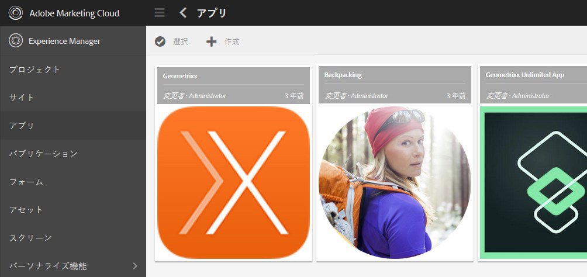

1. アプリをクリックして開きます。既存のアプリのテンプレートに基づいて新しいアプリが正常に作成されました。

>[!NOTE]
>
>Geometrixx Outdoors 参照アプリパッケージを AEM からアンインストールした場合、そのテンプレートに基づいて作成したアプリは機能しなくなります。Geometrixx Outdoors版アプリは削除できますが、他のモバイルアプリで使用する場合は、アプリテンプレートを残しておく必要があります。

## サンプルの Geometrixx Outdoors アプリの詳細 {#exploring-the-sample-geometrixx-outdoors-app}

Geometrixx Outdoors アプリは、デフォルトの PhoneGap アプリケーションブループリントの機能およびサンプルのモバイルコンポーネントの機能を体験できるサンプルの PhoneGap アプリケーションです。

アプリケーションを開くには、レールから「モバイルアプリケーション」をクリックし、「Geometrixx Outdoors アプリ」を選択します。

### 共通のページ機能 - Geometrixx モバイルアプリ {#common-page-features-geometrixx-mobile-app}

モバイルアプリの各ページには、次のような機能があります。

* 親ページに戻るための「戻る」ボタン。「戻る」ボタンはホームページには表示されないことに注意してください。
* コマンドおよびリンクのメニューを提供する拡張可能なレール。

   * 「ロケーション」ページを開きます。
   * 「買い物かご」を開きます。
   * ログインします。
   * アプリケーションを更新します。

* コンポーネントを追加し、コンテンツを作成するための段落システム。

### ホームページ - Geometrixx モバイルアプリ {#the-home-page-geometrixx-mobile-app}

ホームページのコンテンツは、次のナビゲーションツールで構成されています。

* 「ギア」、「レビュー」、「ニュース」、「会社概要」の各子ページへのリンクを備えたメニューリストコンポーネント。
* 子ページを表示するスワイプカルーセルコンポーネント。

### 「ギア」ページ - Geometrixx モバイルアプリ {#the-gear-page-geometrixx-mobile-app}

「ギア」ページでは、ユーザーは製品ページにアクセスできます。メニューリストコンポーネントでは、「ギア」ページの子ページにアクセスできます。子ページは、Web サイトに掲載している製品のカテゴリです。

* 季節
* アパレル
* 性別
* アクティビティ

各カテゴリページは、「ギア」ページと同じコンテンツ構造を使用します。カルーセルでは、製品のサブカテゴリである子ページにアクセスできます。サブカテゴリページには、製品ページへのリンクを掲載した製品リストが含まれています。

### 「製品」ページ - Geometrixx モバイルアプリ {#the-products-page-geometrixx-mobile-app}

「製品」ページとその子ページの階層は、製品ページの分類体系を実装したものです。階層の各ブランチの最下位ページは、ng 製品コンポーネントが含まれている製品のページです。

アプリケーションユーザーが「製品」ページを使用することはできません。「ギア」ページでは、各製品ページにアクセスできます。

### 「レビュー」ページ - Geometrixx モバイルアプリ {#the-reviews-page-geometrixx-mobile-app}

「戻る」ボタンが含まれています。段落システムでは、コンポーネントを追加できます。

アプリケーションを使用する場合、「レビュー」ページは英語ページのカルーセルから使用可能です。

### 「ニュース」ページ - Geometrixx モバイルアプリ {#the-news-page-geometrixx-mobile-app}

「戻る」ボタンが含まれています。段落システムでは、コンポーネントを追加できます。

アプリケーションを使用する場合、「ニュース」ページは英語ページのカルーセルから使用可能です。

### 「会社概要」ページ - Geometrixx モバイルアプリ {#the-about-us-page-geometrixx-mobile-app}

「会社概要」ページには、2 列の行コンポーネントがいくつか含まれています。各列には、画像コンポーネントまたはテキストコンポーネントが含まれています。コンポーネントは編集可能で、段落システムではコンポーネントを追加できます。

アプリケーションを使用する場合、「会社概要」ページは「英語」ページのカルーセルから使用可能です。

### 「ロケーション」ページ - Geometrixx モバイルアプリ {#the-locations-page-geometrixx-mobile-app}

「ロケーション」ページには、ロケーションコンポーネントが含まれています。

アプリケーションを使用する場合、「ロケーション」ページは「英語」ページのメニューリストから使用可能です。

## サンプルのモバイルコンポーネント {#sample-mobile-components}

モバイルアプリケーションのページを作成する場合は、複数のコンポーネントがサイドキックですぐに使用可能になります。これらのコンポーネントは、PhoneGap コンポーネントグループに属しています。

### スワイプカルーセル {#swipe-carousel}

スワイプカルーセルコンポーネントは、サイトページを参照および移動するためのツールです。コンポーネントに含まれるカルーセルによって、ページリンクリストの上部にページの画像が順に表示されます。公開するページおよびカルーセルの動作を指定するには、このコンポーネントを編集します。

カルーセルに画像が表示されるのは、独自の方法で画像が関連付けられているページであることに注意してください。ページが画像に関連付けられていない場合には、リンクリストのみが表示されます。

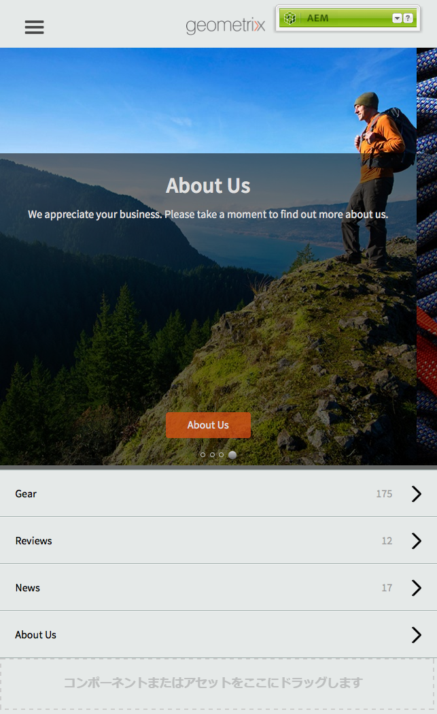

**「カルーセル」のプロパティタブ**

カルーセルの動作を設定します。

* 再生速度：各画像の表示時間（ミリ秒単位）で、この時間が経過すると次の画像が表示されます。
* 遷移時間：画像遷移のアニメーションの時間（ミリ秒単位）。
* コントロールのスタイル：画像間の移行用に用意されるコントロールのタイプ。

**「リスト」のプロパティタブ**

ページリストの生成方法を指定します。

* 次を使用してリストを構築：カルーセルに含めるページを指定するために使用するメソッドです。 ページリストのビルドを参照してください。
* 並べ替え順：ページリストの並べ替えに使用するページプロパティを選択します。例えば、ページをタイトルのアルファベット順に並べ替えるには、jcr:title を選択します。
* 制限：含めるページの最大数。このプロパティは、検索ベースのページリストビルド方法に適しています。

#### ページリストのビルド {#building-the-page-list}

スワイプカルーセルコンポーネントによって、「リストを選択」プロパティの次の値が提供されます。編集ダイアログは、選択する値に応じて異なります。

**子ページ**

このコンポーネントは、特定のページのすべての子ページをリストします。この値を選択した後、「子ページ」タブでページを選択するか、または値を指定しないで現在のページの子をリストします。

**固定リスト**

含めるページのリストを指定します。この値を選択した後、「固定リスト」を選択すると表示される「固定リスト」タブでリストを設定します。

* ページを追加するには、「項目を追加」をクリックし、ページを参照します。
* リスト内でページを移動するには、上下の矢印アイコンを使用します。
* リストからページを削除するには、「削除」ボタンをクリックします。

「並べ替え順」プロパティは、固定リストの順序には影響を与えません。

**検索**

キーワード検索の結果を使用して、リストに値を入力します。検索は、指定したページの子で実行されます。

1. 検索のルートページを指定するには、「開始」プロパティを使用してページパスを選択します。パスを指定しないと、現在のページより下で検索されます。
1. 「検索クエリー」プロパティに、検索キーワードを入力します。

**詳細検索**

[Querybuilder](/help/sites-developing/querybuilder-api.md) クエリーを使用して、リストに値を入力します。

### 画像 {#image}

アプリケーションコンテンツに画像を追加します。

### テキスト {#text}

アプリケーションコンテンツにリッチテキストを追加します。

### ストアの場所 {#store-locations}

ストアの場所コンポーネントでは、ユーザーはビジネスアウトレットを検索するためのツールを利用できます。

* 検索
* デバイスの GPS 座標に近いロケーションまたは遠いロケーションのリスト。

このコンポーネントを利用するには、リポジトリに各ストアの位置情報が含まれている必要があります。サンプルのロケーションが /etc/commerce/locations/adobe ノードにインストールされています。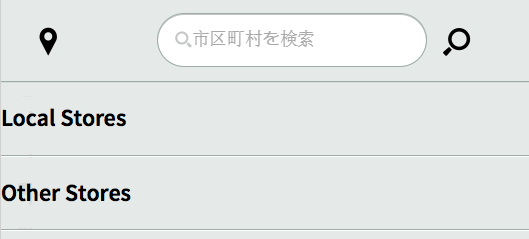

### 2 列の行 {#two-column-row}

1 ページにコンポーネントを並べて追加できます。

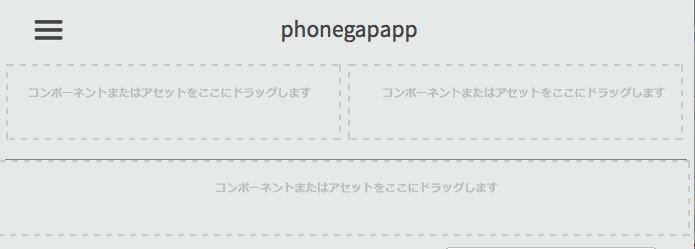
