# アプリコンソールを使用したアプリの作成および編集{#creating-and-editing-apps-using-the-apps-console}

{{ue-over-mobile}}

AEM モバイルアプリケーション開発プロセスでは、様々な専門知識を持つユーザーがモバイルアプリケーションの開発に貢献していることを認識しています。 次のプロセスマップは、コンテンツ作成者とアプリケーション開発者がタスクを実行する一般的な順序を示しています。

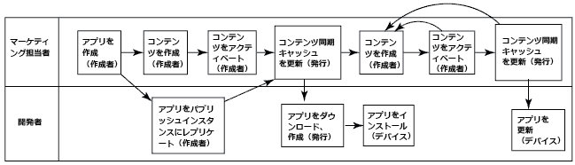

マーケターのタスクの実行方法に関する情報は、このページに表示されます。 開発者タスクについて詳しくは、PhoneGap アプリケーションの構築を参照してください。

## モバイルアプリケーションの構造 {#the-structure-of-mobile-applications}

AEM Mobileは、モバイルアプリケーションを作成するためのPhonegap App Blueprintを提供しています。 ブループリントでは、作成するアプリケーションの構造を定義します。 アプリケーションは次の項目で構成されます。

* ルートページ。
* アプリケーションの言語バリエーション。
* 言語バリエーションのホームページ。

### Phonegap アプリのルート {#the-root-of-a-phonegap-app}

AEMで作成したモバイルアプリケーションのルートページがApps コンソールに表示されます。

ルートページは、アプリケーションの作成時に指定されたアプリケーションの「宛先パス」プロパティの下に保存されます（デフォルトのパスは/content/phonegap/appsです）。 ページ名は、アプリケーションの「名前」プロパティです。 例えば、`myphonegapapp`という名前のサイトのルートページのデフォルト URLは`http://localhost:4502/content/phonegap/apps/myphonegapapp.html`です。

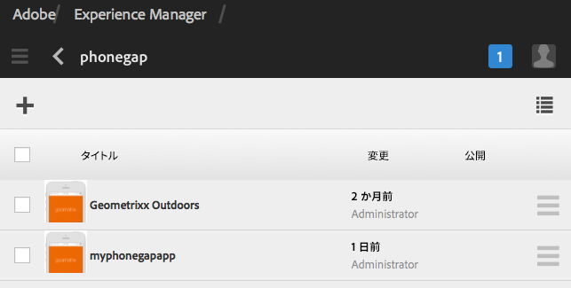

### PhoneGap アプリの言語バリエーション {#the-language-variation-of-a-phonegap-app}

ルートページの最初の子ページは、アプリケーションの言語バリエーションです。 各ページの名前は、アプリケーションを作成する言語です。 例えば、英語は、アプリケーションの英語版の名前です。

**注：** デフォルトのPhoneGap ブループリントでは、英語のアプリケーションのみが作成されます。 開発者は、ブループリントを修正することで、より多くの言語のバリエーションを制作できるようになります。

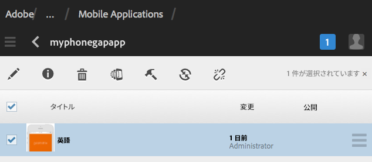

言語ページには、次の2つの目的があります。

* ページコンテンツは、アプリケーションの言語バリエーションのスパッシュページです。
* ページプロパティは、コンテンツ更新のリクエストに使用するURL、クラウドビルドとAdobe Analytics Servicesの統合への接続に関する情報など、アプリケーションのいくつかのデザイン要素を制御します。

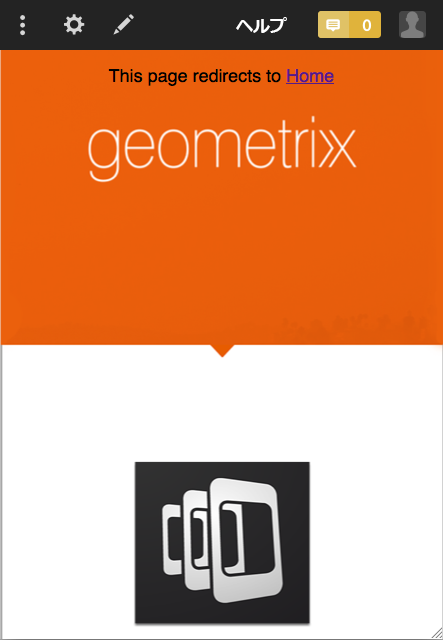

### ホームページ {#the-home-page}

アプリケーションを開くと、アプリケーションの言語バリエーションのホームページまたはindex.html ページが表示されます。 ホームページには、アプリケーション内の様々なページへのリンクのメニューが表示されます。 段落システムを使用すると、コンテンツを作成するためのコンポーネントをページに追加できます。

## モバイルアプリケーションの作成 {#creating-a-mobile-application}

モバイルアプリケーションは、ページ構造とプロパティを定義する設計図にもとづいています。 次のアプリケーションプロパティを設定できます。

* **タイトル：** アプリケーションのタイトル。
* **宛先パス：** アプリケーションが保存されているリポジトリ内の場所。 アプリ名に基づいてパスを作成するには、デフォルトのままにします。

* **名前：** デフォルト値は、スペース文字が削除されたタイトルプロパティの値です。 名前は、CQ内でアプリケーションを表すリポジトリノードなどのアプリケーションを参照するために使用されます。
* **説明：** アプリケーションの説明。
* **サーバーURL:** アプリケーションに対する無線（OTA）コンテンツ更新を提供するURL。 デフォルト値は、アプリケーションの作成に使用されるインスタンスのパブリッシュサーバーのURLです（externalizer サービスから取得）。 注意：これはオーサーではなくパブリッシュサーバーインスタンスである必要があり、認証が必要です。

アプリケーションのサムネールとして使用する画像ファイルを指定し、使用するPhoneGap Build設定を選択し、使用するMobile App Analytics設定を選択することもできます。 この画像は、Experience Managerのモバイルアプリコンソール内でモバイルアプリケーションを表すサムネールとしてのみ使用されます。

ビルドクラウドサービス用およびAdobe Mobile Services SDK プラグインをアプリに統合するためのタブが追加（およびオプション）で用意されています。

* ビルド：設定の管理をクリックし、ここでbuild.phonegap.com ビルドサービスを設定します。 次に、ドロップダウンから、新しく作成したPhoneGap ビルドクラウドサービスを選択できます。
* Analytics:「設定を管理」をクリックし、[Adobe Mobile Services SDK](https://experienceleague.adobe.com/docs/mobile-services/using/home.html) クラウドサービスを設定します。 次に、ドロップダウンから、新しく作成したモバイルサービスを選択して、モバイルアプリに統合できます。

>[!NOTE]
>
>開発者は、AEM PhoneGap Starter Kitを使用してアプリを作成し、コンソールに追加できます。

次の手順では、タッチ UIを使用してモバイルアプリケーションを作成します。

1. パネルで、「アプリ」をクリックします。
1. 「作成」アイコンをクリックします。

   

1. （オプション）詳細タブで、アプリケーションの説明を入力し、必要に応じてサーバーURLを変更します。
1. （オプション） PhoneGap Buildを使用してアプリケーションをコンパイルする場合は、「ビルド」タブで、使用する設定を選択します。

   PhoneGap ビルド設定を作成するには、「設定を管理」をクリックします。

1. （オプション） SiteCatalystを使用してアプリケーションアクティビティを追跡している場合は、「分析」タブで、使用する設定を選択します。

   モバイルアプリ設定を作成するには、「設定を管理」をクリックします。

1. （オプション）アプリケーションアイコンを指定するには、「参照」ボタンをクリックし、ファイルシステムから画像ファイルを選択して、「開く」をクリックします。
1. 「作成」をクリックします。

### モバイルアプリケーションのプロパティの変更 {#changing-the-properties-of-a-mobile-application}

モバイルアプリケーションを作成したら、プロパティを変更できます。

#### タイトル、説明、アイコンを変更する {#change-the-title-description-and-icon}

1. パネルで、「アプリ」をクリックします。
1. 設定するアプリケーションを選択し、ページプロパティを表示アイコンをクリックします。

   

1. プロパティ値を変更するには、編集アイコンをクリックします。

   

1. 基本プロパティと詳細プロパティを設定し、「完了」アイコンをクリックします。

   

#### アプリケーションの言語バリエーションの設定 {#configure-a-language-variation-of-the-application}

1. パネルで、「アプリ」をクリックします。
1. クリックすると、アプリ Admin Console内で編集するモバイルアプリケーションをドリルダウンします。 設定するアプリケーションの言語バージョンを選択し、「アプリケーションのプロパティを表示」アイコンをクリックします。

   

1. プロパティ値を変更するには、編集アイコンをクリックします。

   

1. 「基本」、「詳細」、「ビルド」および「分析」タブでプロパティを設定し、「完了」アイコンをクリックします。

   

### モバイルアプリケーションのコンテンツのオーサリング {#authoring-the-content-of-a-mobile-application}

モバイルアプリケーションを作成したら、アプリケーション UIとして使用されるコンテンツを追加します。

1. パネルで、「アプリ」をクリックします。
1. アプリケーションをクリックし、「英語」をクリックします。
1. ホームページを編集するか、必要に応じて子ページを追加します。

### コンテンツをモバイルアプリケーションに移行する {#moving-content-to-mobile-applications}

AEM パブリッシュインスタンスのContent Sync キャッシュは、モバイルアプリケーションのコンテンツリポジトリとして使用されます。

* 開発者がアプリケーションをコンパイルすると、コンテンツ同期キャッシュのコンテンツがアプリケーションに含まれます。
* キャッシュ内のコンテンツは、インストール済みのモバイルアプリケーションでアプリケーションコンテンツを更新するために利用できます。

モバイルアプリケーションには、更新されたアプリケーションコンテンツをダウンロードしてインストールする「更新」コマンドがあります。 アプリケーションインスタンスが更新リクエストを送信すると、コンテンツ同期は、アプリケーションが最後に更新またはインストールされたときにどのコンテンツが変更されたかを判断し、新しいコンテンツを提供します。

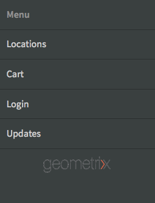

更新されたコンテンツをアプリケーションで使用できるようにするには、コンテンツ同期キャッシュを更新します。 キャッシュを初めて更新すると、公開されたすべてのコンテンツが追加されます。 その後の更新では、前回の更新以降に変更された公開済みコンテンツのみが追加されます。

コンテンツ同期は、更新が発生したときにも追跡します。 この情報を使用すると、コンテンツシンクは、モバイルアプリケーションに送信するキャッシュアップデートを決定できます。

キャッシュを更新するインスタンスで、次の手順を実行します。 例えば、アプリケーションがパブリッシュインスタンスから更新をリクエストする場合は、パブリッシュインスタンスで手順を実行します。

1. パネルで、「アプリ」をクリックしてから、アプリケーションをクリックします。
1. スプラッシュページを選択し、「キャッシュを更新」アイコンをクリックします。

   

### アプリテンプレートの使用 {#using-app-templates}

これは、Apps 6.1機能パック 2で利用できる機能で、AEM内で新しいアプリを作成するために既存のアプリテンプレートを簡単に使用できます。

アプリテンプレートとは？これは、アプリのベースラインや基盤を表すページテンプレートとコンポーネントのコレクションと考えてください。
別のアプリのテンプレートに基づいてアプリを作成する場合、作成元のアプリを代表する開始点を持つアプリが表示されます。

この機能を使用するには、既存のモバイルアプリテンプレート（またはアプリテンプレートを持つアプリがインストールされている場合）が必要です。

最新のAEM Apps 6.1 サンプルパッケージには、アプリテンプレート付きのGeometrixx アプリの更新版が含まれています。 または、テンプレートも提供するStarterKitをインストールすることもできます。

アプリテンプレートに基づいてアプリを作成する手順：

1. 最新のAEM Apps 6.1機能パックとリファレンスサンプルパッケージがインストールされていることを確認します
1. 左側のパネルから「アプリ」をクリックします。

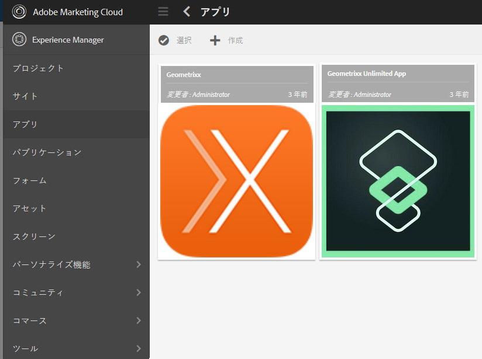

1. 上部の「+作成」ボタンをクリックし、「アプリを作成」を選択します。
1. アプリテンプレートのリストが表示されたら、次のいずれかを選択します。

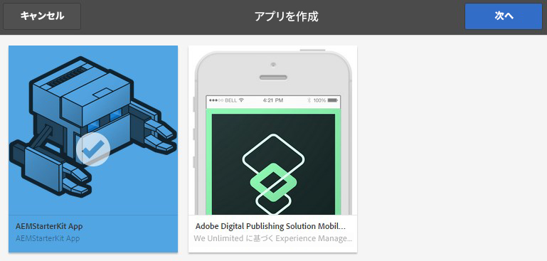

1. 次へをクリックします。
1. アプリ IDとタイトルを指定します。ただし、名前と説明も含める場合があります。

   1. また、AEM アセットを参照して、PNG （サポートされているPhoneGap アイコン形式）をアイコンとして指定することもできます。
   1. アプリの管理画面でアプリを作成した後、これらのフィールドをすべて編集できます。 アプリ IDを除き、アプリ IDが設定されると、変更できません。

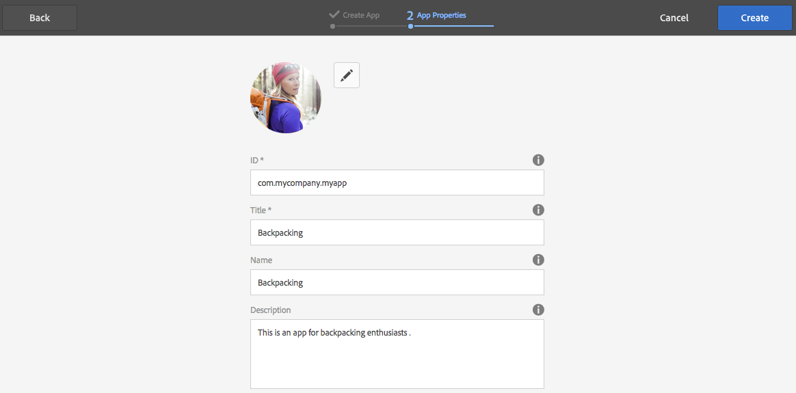

1. 「作成」ボタンをクリックすると、「完了」（アプリカタログ表示に戻る）または「アプリを管理」（アプリダッシュボードを開く）の2つのオプションが表示されます。
1. 作成すると、新しいアプリがアプリカタログに一覧表示されます。

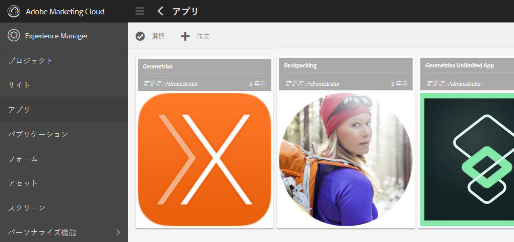

1. アプリをクリックして開くと、既存のアプリのテンプレートに基づいて新しいアプリが正常に作成されました。

>[!NOTE]
>
>AEMからGeometrixx Outdoors参照アプリパッケージをアンインストールし、そのテンプレートに基づいてアプリケーションを作成した場合、そのアプリケーションは機能しなくなります。 Geometrixx Outdoors アプリは削除できますが、他のモバイルアプリケーションで使用する場合は、アプリテンプレートを残す必要があります。

## サンプルのGeometrixx Outdoors アプリの確認 {#exploring-the-sample-geometrixx-outdoors-app}

Geometrixx Outdoors アプリは、デフォルトのPhoneGap アプリケーション ブループリントとサンプル モバイル コンポーネントの機能を示すサンプル PhoneGap アプリケーションです。

アプリケーションを開くには、パネルから「モバイルアプリケーション」をクリックし、「Geometrixx Outdoors アプリケーション」を選択します。

### 一般的なページ機能 – Geometrixx モバイルアプリ {#common-page-features-geometrixx-mobile-app}

モバイルアプリの各ページには、次の機能が含まれています。

* 親ページに戻るための「戻る」ボタン。 「戻る」ボタンはホームページには表示されません。
* コマンドとリンクのメニューを提供する消耗品のレール：

   * 場所ページを開きます。
   * カートを開きます。
   * ログイン。
   * アプリケーションを更新します。

* コンポーネントを追加し、コンテンツを作成するための段落システム。

### ホームページ - Geometrixxモバイルアプリ {#the-home-page-geometrixx-mobile-app}

ホームページのコンテンツは、次のナビゲーションツールで構成されます。

* 歯車、レビュー、ニュース、および会社概要の子ページへのリンクを提供するメニューリストコンポーネント。
* 子ページを表示するスワイプカルーセルコンポーネント。

### The Gear Page - Geometrixxモバイルアプリ {#the-gear-page-geometrixx-mobile-app}

歯車ページでは、ユーザーに商品ページへのアクセス権を提供します。 メニューリストコンポーネントでは、歯車ページの子ページにアクセスできます。 子ページは、web サイトの機能を備えた製品カテゴリです。

* シーズン
* アパレル
* 性別
* アクティビティ

各カテゴリーページでは、歯車ページと同じコンテンツ構造を使用します。 カルーセルでは、製品のサブカテゴリである子ページにアクセスできます。 サブカテゴリーページには、製品ページへのリンクを提供する製品リストが含まれます。

### The Products Page - Geometrixx Mobile App {#the-products-page-geometrixx-mobile-app}

製品ページとその子ページの階層は、製品ページの分類システムを実装します。 階層の各ブランチの最下位ページは、ng製品コンポーネントを含む製品ページです。

製品ページは、アプリケーションユーザーには使用できません。 歯車ページでは、各製品ページにアクセスできます。

### レビューページ - Geometrixx モバイルアプリ {#the-reviews-page-geometrixx-mobile-app}

背面ボタンが含まれています。 段落システムでは、コンポーネントを追加できます。

アプリケーションを使用する場合は、英語ページのカルーセルから「レビュー」ページを使用できます。

### The News Page - Geometrixxモバイルアプリ {#the-news-page-geometrixx-mobile-app}

背面ボタンが含まれています。 段落システムでは、コンポーネントを追加できます。

アプリケーションを使用する場合、ニュースページは英語ページのカルーセルから利用できます。

### 会社概要ページ - Geometrixxモバイルアプリ {#the-about-us-page-geometrixx-mobile-app}

「会社概要」ページには、複数の2列行コンポーネントが含まれています。 各列には、画像またはテキストコンポーネントが含まれます。 コンポーネントは編集可能で、段落システムでコンポーネントを追加できます。

アプリケーションを使用する場合は、英語ページのカルーセルから「会社概要」ページを使用できます。

### The Locations Page - Geometrixx Mobile App {#the-locations-page-geometrixx-mobile-app}

「場所」ページには、「場所」コンポーネントが含まれています。

アプリケーションを使用する場合は、英語ページのメニューリストから「場所」ページを使用できます。

## モバイルコンポーネントの例 {#sample-mobile-components}

モバイルアプリケーションのページをオーサリングする際に、いくつかのコンポーネントがSidekickですぐに利用できます。 コンポーネントはPhoneGap コンポーネントグループに属します。

### スワイプカルーセル {#swipe-carousel}

スワイプカルーセルコンポーネントは、サイトページを表示してナビゲートするためのツールです。 コンポーネントには、ページリンクのリストの上にあるページの画像を切り替えるカルーセルが含まれています。 コンポーネントを編集して、表示するページとカルーセルの動作を指定します。

画像は、特定の方法で画像に関連付けられているページのカルーセルに表示されます。 ページが画像に関連付けられていない場合は、リンクのリストのみが表示されます。

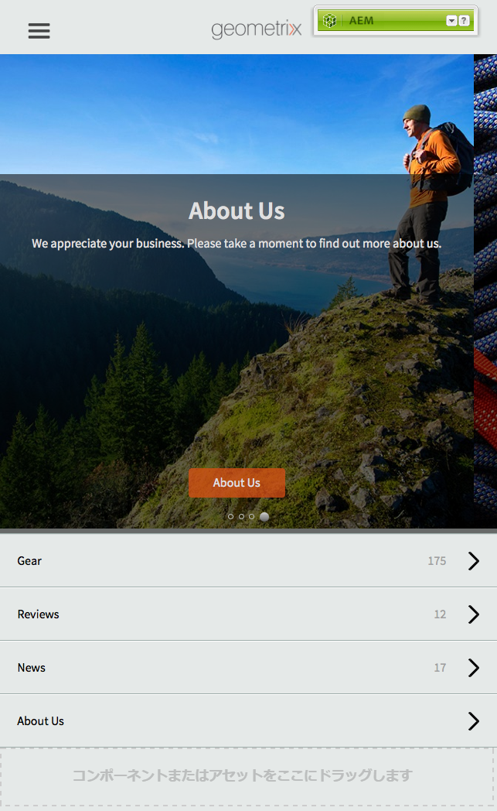

**カルーセルプロパティタブ**

カルーセルの動作を設定します。

* 再生速度：各画像が次の画像を表示するまでの時間（ミリ秒単位）です。
* トランジション時間：画像トランジションのアニメーションのデュレーション（ミリ秒単位）。
* コントロールのスタイル：画像間を移動するために用意されているコントロールのタイプです。

**リストプロパティタブ**

ページリストの生成方法を指定します。

* 使用するリストを作成：カルーセルに含めるページを指定するために使用するメソッド。 ページリストの作成を参照してください。
* 並べ替え基準：ページリストの並べ替えに使用するページプロパティを選択します。 例えば、タイトルでアルファベット順にページを並べ替えるには、jcr:titleを選択します。
* 制限：含めるページの最大数。 このプロパティは、ページリストを作成する検索ベースのメソッドに適しています。

#### ページリストの作成 {#building-the-page-list}

「カルーセルをスワイプ」コンポーネントには、「リストを作成」プロパティに次の値が用意されています。 編集ダイアログは、選択した値に応じて変化します。

**子ページ**

コンポーネントには、特定のページのすべての子ページが一覧表示されます。 この値を選択した後、「子ページ」タブでページを選択するか、現在のページの子を一覧表示する値を指定しません。

**固定リスト**

インクルードするページのリストを指定します。 この値を選択した後、「固定リスト」を選択したときに表示される「固定リスト」タブでリストを設定します。

* ページを追加するには、「項目を追加」をクリックし、ページを参照します。
* 上向き矢印アイコンと下向き矢印アイコンを使用して、リスト内のページを移動します。
* 「削除」ボタンをクリックして、リストからページを削除します。

Order By プロパティは、固定リストの順序には影響しません。

**検索**

キーワード検索の結果を使用してリストに入力します。 検索は、指定したページの子で実行されます。

1. 検索のルートページを指定するには、「開始」プロパティを使用してページパスを選択します。 現在のページの下に検索するパスを指定しないでください。
1. 検索クエリプロパティで、検索キーワードを入力します。

**詳細検索**

[Querybuilder](/help/sites-developing/querybuilder-api.md) クエリを使用してリストに入力します。

### 画像 {#image}

アプリケーションのコンテンツに画像を追加します。

### テキスト {#text}

アプリケーションコンテンツにリッチテキストを追加します。

### ストアの場所 {#store-locations}

ストアの場所コンポーネントには、ビジネスアウトレットを検索するためのツールが用意されています。

* 検索
* デバイスのGPS座標に近い、または遠い場所のリスト。

コンポーネントには、各ストアの位置情報がリポジトリに含まれている必要があります。 サンプルの場所は、/etc/commerce/locations/adobe ノードにインストールされます。 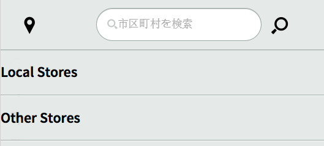

### 2 列の行 {#two-column-row}

ページに並べてコンポーネントを追加できます。

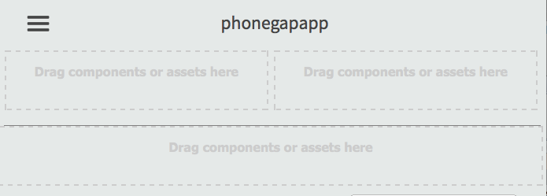
