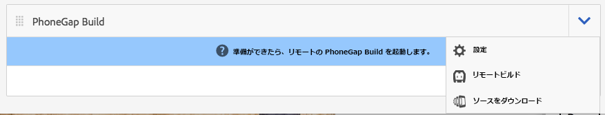
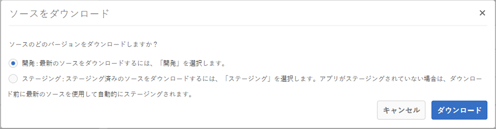
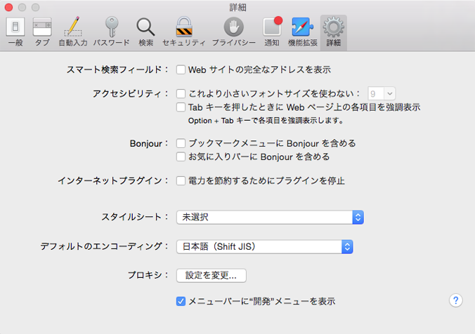
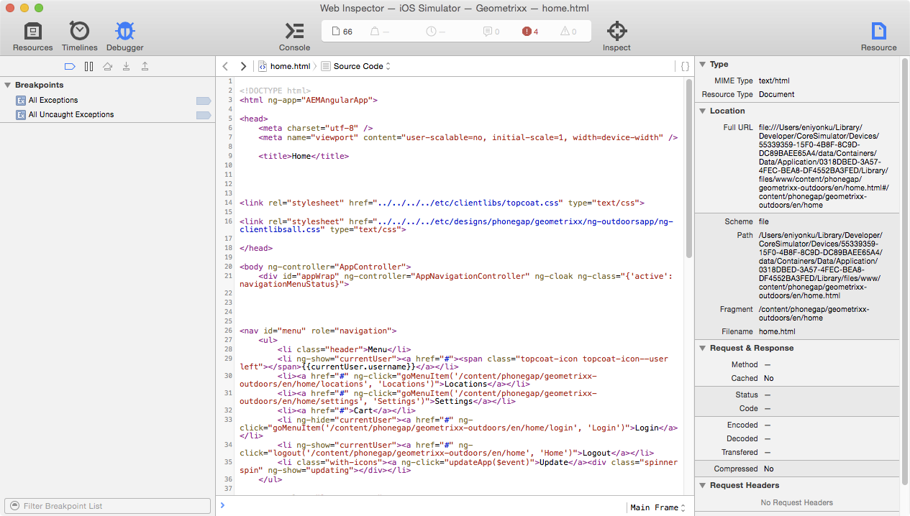

# PhoneGap CLI によるアプリの開発{#developing-apps-with-phonegap-cli}

>[!NOTE]
>
>単一ページアプリケーションフレームワークを基にしたクライアント側レンダリング（React など）が必要なプロジェクトでは、SPA エディターを使用することをお勧めします。[詳細情報](/help/sites-developing/spa-overview.md)

開発者は、開発環境を設定しておくと、デバイス上またはエミュレーター内でいつでもアプリを実行できます。

次のサンプルを実行するには、Xcode 搭載の OSx を実行しているシステム（Mac）か、Android SDK がインストールされた Mac／Win／Linux システムが必要です。

## 開発環境のブートストラップ {#bootstrap-your-development-environment}

[PhoneGap CLI の設定](https://docs.phonegap.com/en/4.0.0/guide_cli_index.md.html#The%20Command-Line%20Interface)

iOS の場合：iPhone および iPad 向けに開発するには、Apple の Xcode IDE が必要です。

* Download it for free [here](https://developer.apple.com/xcode/downloads/).
* [PhoneGap iOSプラットフォームガイド](https://docs.phonegap.com/en/4.0.0/guide_platforms_ios_index.md.html#iOS%20Platform%20Guide)

Android の場合：Android 向けに開発するには、Google の Android Studio IDE が必要です。

* Download it for free [here](https://developer.android.com/sdk/index.html).
* [PhoneGap Android プラットフォームのガイド](https://docs.phonegap.com/en/4.0.0/guide_platforms_android_index.md.html#Android%20Platform%20Guide)

## ソースのダウンロード {#download-the-source}

開発環境を正常にブートストラップしたら、AEM アプリのビルドタイルからソースをダウンロードします。

* [PhoneGap Buildタイル]ドロップダウンの山形をクリックします。



* 「ソースをダウンロード」をクリックします。
* 「ソースをダウンロード」モーダルから目的のソースを選択します。



>[!NOTE]
>
>開発ソースにはアプリの最新状態が含まれていますが、ステージングされていない変更も含まれています。アプリストアベンダーに提出するリリース候補をビルドするには、ステージングソースを使用します。
>
>まだアプリをステージングしていない場合には、「ステージング」を選択するとステージングワークフローが実行されます（ヒント：これにより、AppStore および Google PlayStore で使用可能な PhoneGap エンタープライズ版 Viewer アプリにステージング済みアプリとして表示されるようになります）。

* 「ダウンロード」をクリックし、コンピューターに ZIP を保存します。
* ダウンロードした zip ファイルをワークスペースに抽出します。

## （ソースからの）アプリのビルドおよび読み込み {#build-and-load-the-app-from-source}

PhoneGap CLI では、プラットフォームプロジェクトの作成、ソースのコンパイルおよびアプリのデプロイを単一のコマンドで実行できます。

>[!NOTE]
>
>これらすべての手順を個別に行うことができます。[PhoneGap CLI のドキュメント](https://phonegap.com/blog/2014/11/13/phonegap-cli-3-6-3/)を参照してください。

1. PhoneGap CLI をインストール済みであることを確認してください（上記を参照）。
1. コンソール（またはターミナル）ウィンドウで、抽出したソースのルートディレクトリに移動します。
1. 以下のコマンドを入力します。

```xml
phonegap run android

// -- or -- //

phonegap run ios
```

>[!NOTE]
>
>この時点で問題が発生した場合には、基本に戻ってトラブルシューティングしてください。
>
>1. 新規フォルダーを作成します（mkdir test）。
>1. この新規フォルダーに移動します（cd test）。
>1. 「phonegap create helloWorld」を実行します。
>1. helloWorld に移動します（cd helloWorld）。
>1. 「phonegap run android」を実行します（または上記のように android を ios に置き換えます）。
>1. エミュレーターが開いて、新規に作成した PhoneGap アプリが実行されます。ネイティブへの JavaScript ブリッジが動作している場合には、「Device Ready」と表示されます。

>
>
この場合、PhoneGap CLI 開発環境は正しく稼動していることになります。

## Safari および iOS デバッグでの JavaScript のデバッグ {#debug-javascripts-with-safari-and-ios-debug}

Web アプリケーションの場合と同じように、Safari の開発者向けツールを使用してアプリの JavaScript をデバッグできます。

## Safari 開発者向けツールの使用可能化 {#enable-safari-developer-tools}

開発者向けツールを使用可能にするには：

* Safari の環境設定を開きます。

   * メニューバーで「Safari」をクリックします。
   * 「環境設定」をクリックします。

* 環境設定ウィンドウで「詳細」をクリックします。



* 「メニューバーに開発メニューを表示」をオンにします。
* 環境設定ウィンドウを閉じます。

## iOS への Safari の接続 {#connect-safari-to-ios}

iOS デバイスまたはエミュレーターに Safari を接続できます。

* コンソールウィンドウで、抽出したソースのルートディレクトリに移動します。
* 次のコマンドを入力して、デバイスまたはエミュレーターでアプリを起動します。

```xml
phonegap run <platform> --device

// -- or -- //

phonegap run <platform> --emulator
```

* Safari を開きます。
* メニューバーで「開発」をクリックします。
* iOS シミュレーターサブメニューを選択します。
* home.html をクリックします。



## Safari の Web インスペクタでの JavaScript のデバッグ {#debug-javascript-with-safari-s-web-inspector}

ソースの任意の場所にブレークポイントを設定できます。エミュレーターまたはデバイスと対話する場合、設定したブレークポイントでアプリの実行が停止します。アプリをステップ単位で実行して、変数の値を調べることができます。

* Web インスペクタウィンドウで「リソース」をクリックします。
* ソースツリーを移動し、目的のソースファイルをクリックします。
* 隣接する行番号をクリックして、ブレークポイントを追加します。
* デバイスまたはエミュレーターと対話します。


* コントロールボタンを使用してメソッドの実行、ステップオーバー、ステップインおよびステップアウトを続行します。


>[!NOTE]
>
>変数の値を表示するには、現在のメソッドにマウスのカーソルを置きます。

## 次の手順 {#the-next-steps}

PhoneGap CLI によるアプリの開発について学習したら、[デバイスの機能へのアクセス](/help/mobile/phonegap-access-device-features.md)を参照してください。
