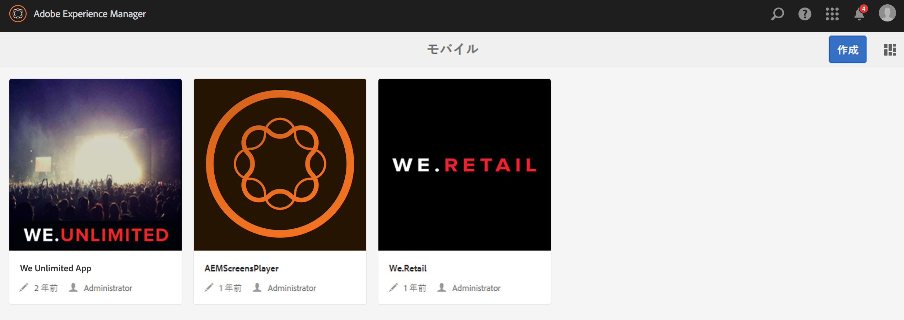
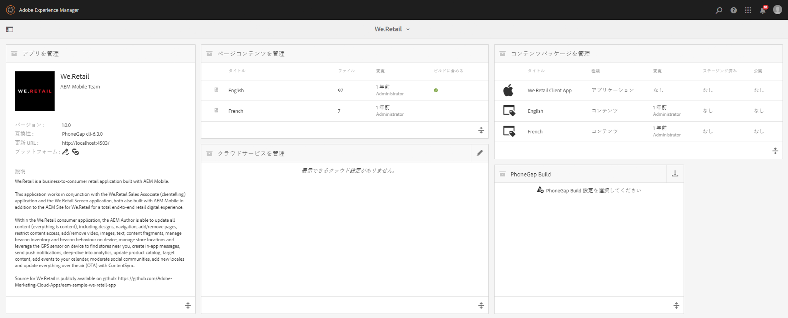
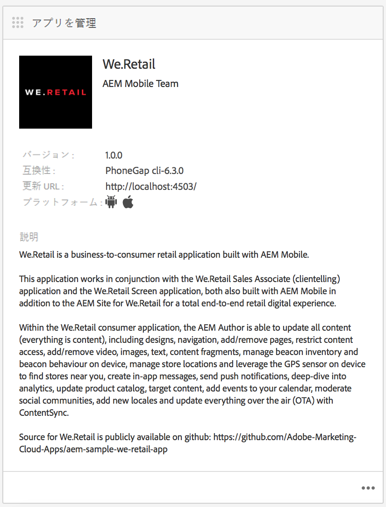
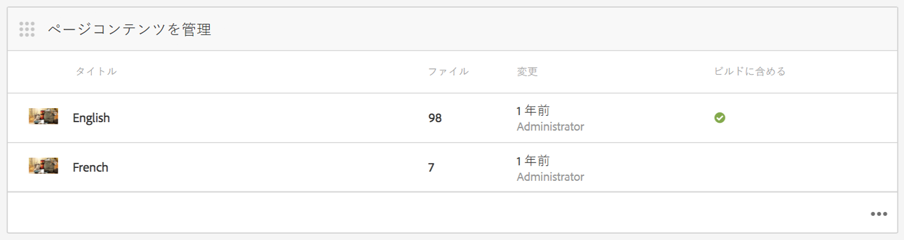
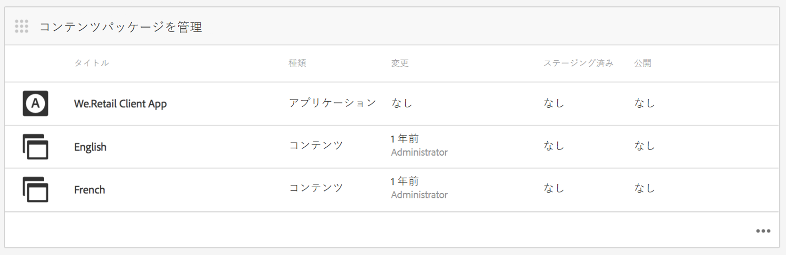
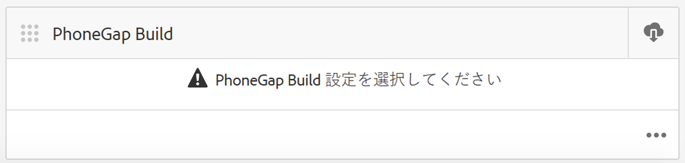
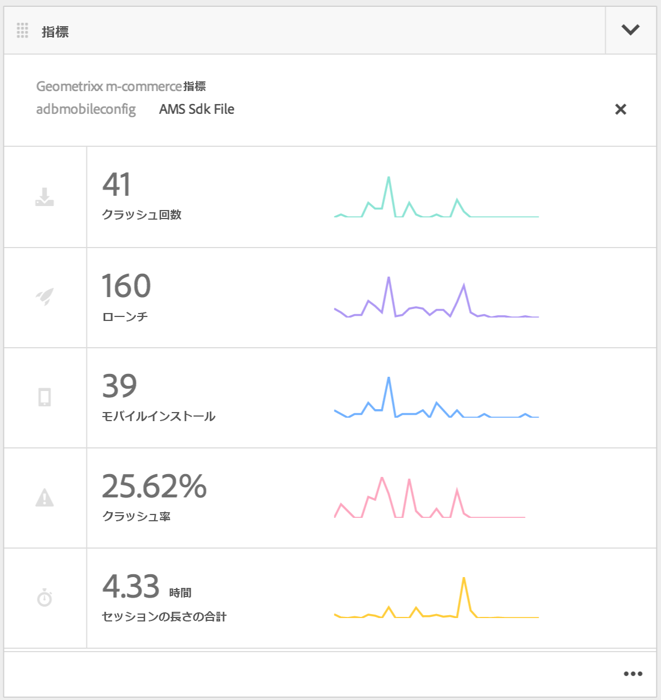
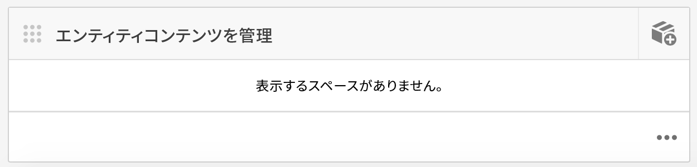

# モバイルアプリケーションのオーサリング{#authoring-mobile-applications}

>[!NOTE]
>
>単一ページアプリケーションフレームワークを基にしたクライアント側レンダリング（React など）が必要なプロジェクトでは、SPA エディターを使用することをお勧めします。[詳細情報](/help/sites-developing/spa-overview.md)を参照してください。

AEM Mobile ダッシュボードでは、モバイルアプリケーションの作成、ビルド、デプロイや、アプリケーションのメタデータの作成、削除、編集をおこなえます。申し込みが実稼動状態になったら、ライフサイクルや使用状況指標を含む申し込み分析を分析し、顧客コンバージョンやブランド忠誠度を改善できます。

To build your AEM Mobile Application, see the [Building Mobile Applications](/help/mobile/building-app-mobile-phonegap.md) page.

環境を設定して作業を始めるには、[AEM PhoneGap Enterprise を使用するための AEM の管理](/help/mobile/administer-phonegap.md)を参照してください。

## AEM Mobile アプリカタログ {#the-aem-mobile-apps-catalog}

The [AEM Mobile Apps Catalog](http://localhost:4502/aem/apps.html/content/phonegap) displays all of your mobile app managed in AEM.

このカタログは AEM Mobile の「ランディングページ」と考えられ、管理者はここで新しい AEM Mobile アプリケーションを開始できます。テンプレートに基づいて作成することも、モバイル開発者が既に開始している既存アプリケーションをアップロードすることもできます。

アプリカタログのランディングページに移動するには、以下の手順に従います。

1. **ナビゲーション**&#x200B;に移動し、「**モバイル**」を選択します。

1. 「**アプリ**」を選択して、アプリカタログを開きます。

## AEM Mobile アプリダッシュボード {#the-aem-mobile-app-dashboard}

カタログから AEM Mobile アプリケーションを選択すると、そのアプリケーションのダッシュボードが表示されます。ここでは、アプリ、表示の統計、モバイルアプリのコンテンツの構築、デプロイ、管理を行うことができます。

AEM Mobile ダッシュボードの各タイルの右下隅にある「...」をクリックして、詳細を表示または編集できます。

### アプリを管理タイル {#the-manage-app-tile}

アプリを管理タイルには、アプリケーションのアイコン、名前、説明、サポートされているプラットフォーム、更新用コールホーム URL およびバージョン情報が表示されます。このタイルをドリルダウンしてPhoneGapアプリケーション設定(config.xml)を編集、管理し、様々なアプリケーションストアに送信して配布するためのアプリケーションの準備を行うことができます。

詳しくは[こちら](/help/mobile/phonegap-app-details-tile.md)を参照してください。

### ページコンテンツを管理タイル {#the-manage-page-content-tile}

AEM Sites とほぼ同様に、AEM Mobile でコンテンツを作成、更新および削除できます。**ページコンテンツを管理タイル**&#x200B;には、管理されているコンテンツのページ数と最終更新日が表示されます。タイルの各レコードをクリックすることによって、コンテンツにドリルダウンしてページを作成、コピー、移動、削除および更新できます。Once content has been updated, you can push a content update to your customers through the **Manage Content Packages Tile.**

### コンテンツパッケージを管理タイル {#the-manage-content-packages-tile}

ページコンテンツを管理タイルでコンテンツを追加または変更したら、コンテンツリリースの更新を使用して、変更を利用者に公開できます。

AEM アプリケーション作成者は、コンテンツパッケージを使用して AEM でページコンテンツを管理し、開発チームに PhoneGap シェルアプリケーション（アプリケーションのフレームワークまたはインフラストラクチャ）を変更してもらい、その変更を利用者に迅速に公開することができます。配信のために様々なストアに再提出するよう、開発者に協力を求める必要はありません。

コンテンツパッケージは、更新ごとにコンテンツリリースパッケージと見なされる ZIP ファイルを作成します。これらのパッケージには、アプリのレンダリング中に生成されるhtmlリソースとhtmlページが含まれ、インテリジェントなので、最後の更新以降に変更されたファイルのみをパッケージ化できます。

The Manage Content Package Tile&#39;s **Type** column will display either &#39;App&#39; to signify Application Shell content, for example framework or infrastructure of the app managed by a developer or, &#39;Content&#39; which represents page content managed by the content author.

コンテンツは言語として、または複数のコンテンツリリースパッケージを使用するアプリケーションの特定の部分として表すことができます。コンテンツのバンドル方法の選択肢は柔軟で、アプリケーションのコンテンツの管理方法に完全に合致するようにデザインされています。

「**変更済み**」列には、ページの最終変更日が示されます。

「**ステージング済み**」列には、最新のコンテンツ更新がいつ作成されたかが示されます。新しいコンテンツ更新を作成して変更をステージングするには、タイル内の任意のレコードを開いて、新しい更新を作成します。

「**発行済み**」列には、いつ最新のコンテンツ更新が公開され、利用者が使用できるようになったかが示されます。コンテンツを公開するには、最初にそのコンテンツを公開し、次にこのタイルにドリルダウンしてコンテンツリリースの詳細コンソールから公開し、更新を公開する必要があります。

このアイコンは、アプリケーションシェルのコンテンツリリースパッケージを表します。

このアイコンは、アプリケーションコンテンツのコンテンツリリースパッケージを表します。

### PhoneGap Build タイル {#the-phonegap-build-tile}

**PhoneGap Buildタイル** は、https://build.phonegap.comに接続して、リモートビディを構築し、ホストします。 ビルドが完了すると、ビルドはダウンロードとして、またはQRコード経由でデバイスに直接提供されます。

または、デバイスソースをダウンロードし、[PhoneGap CLI](https://docs.phonegap.com/en/3.5.0/guide_cli_index.md.html) を使用してローカルにビルドできます。

### 指標タイル {#the-metrics-tile}

>[!CAUTION]
>
>指標タイルは、クラウドサービスを設定した後にのみ表示されます。
>
>See [Configure your Adobe Mobile Services Cloud Service](/help/mobile/configure-adobe-mobile-cloud-service.md) for details.

AEM Mobile integerates with Adobe Analytics through [Adobe Mobile Services SDK](https://www.adobe.com/ca/solutions/digital-marketing/mobile-services/app-sdk.html) (AMS).

コントロールセンターの&#x200B;**指標タイル**&#x200B;には、AMS から取得したアプリケーションの分析概要が表示されます。右下にある「...」をクリックして、分析ダッシュボードの詳細を表示できます。

### エンティティコンテンツを管理タイル {#the-manage-entity-content-tile}

エンティティコンテンツを管理タイルでは、アプリの定義を追加および管理できます。アプリの定義は、アプリに適したスペース（およびその他の設定）を特定する手段です。 これにより、アプリを再コンパイルすることなく、新しいスペースを追加できます。 アプリの定義が更新され、新しいスペースの情報が含まれます。

アプリの定義の作成および管理については、[こちら](/help/mobile/phonegap-app-definitions.md)を参照してください。

右下にある「...」をクリックして、エンティティコンテンツを管理ダッシュボードの詳細を表示できます。

#### その他のリソース {#additional-resources}

管理者および開発者の役割と責任について詳しくは、以下のリソースを参照してください。

* [AEM と Adobe PhoneGap Enterprise での開発](/help/mobile/developing-in-phonegap.md)
* [AEM での Adobe PhoneGap Enterprise のコンテンツの管理](/help/mobile/administer-phonegap.md)

