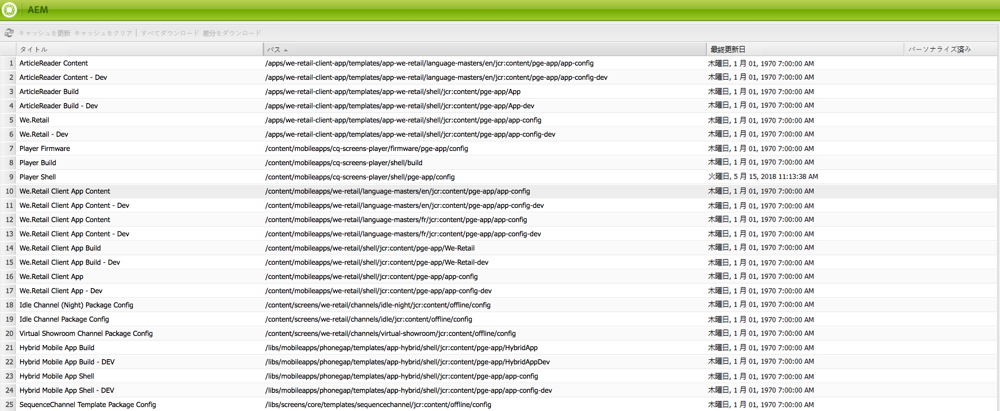

# モバイルとコンテンツ同期{#mobile-with-content-sync}

>[!NOTE]
>
>単一ページアプリケーションフレームワークを基にしたクライアント側レンダリング（React など）が必要なプロジェクトでは、SPA エディターを使用することをお勧めします。[詳細情報](/help/sites-developing/spa-overview.md)を参照してください。

>[!NOTE]
>
>This document is part of the [Getting Started with AEM Mobile](/help/mobile/getting-started-aem-mobile.md) Guide, a recommended starting point for AEM Mobile reference.

コンテンツをパッケージ化してネイティブモバイルアプリケーションで使用できるようにするには、コンテンツ同期を使用します。AEM で作成されるページは、デバイスがオフラインの場合でもアプリコンテンツとして使用できます。さらに、AEM ページは Web 標準に基づいているので、ネイティブラッパーに AEM ページを埋め込むことを可能にするクロスプラットフォームを使用します。この戦略によって、開発の作業を削減し、アプリコンテンツを簡単に更新できます。

>[!NOTE]
>
>AEM ツールを使用して作成する PhoneGap アプリは、コンテンツ同期を経由して AEM ページをコンテンツとして使用するように既に設定されています。

コンテンツ同期フレームワークは、Web コンテンツを格納するアーカイブファイルを作成します。このコンテンツには、シンプルなページのデータ、画像、PDF ファイルまたは Web アプリ全体を含めることができます。コンテンツ同期 API は、モバイルアプリまたはビルドプロセスからアーカイブファイルへのアクセスを提供することで、コンテンツを取得してアプリに追加できるようにします。

次の一連の手順は、コンテンツ同期の一般的な使用例を示しています。

1. AEM 開発者が、追加するコンテンツを指定するコンテンツ同期設定を作成します。
1. コンテンツ同期フレームワークが、コンテンツを収集してキャッシュします。
1. モバイルデバイスで、モバイルアプリケーションが起動され、サーバーからコンテンツを要求します。コンテンツは ZIP ファイルで提供されます。
1. クライアントが、ZIP のコンテンツをローカルファイルシステムに解凍します。ZIP ファイル内のフォルダー構造は、クライアント（ブラウザーなど）が、通常、サーバーから要求するパスをシミュレートします。
1. クライアントが、組み込みのブラウザーでコンテンツを開くか、その他の方法でコンテンツを使用します。
1. クライアントが、更新されたコンテンツを後でサーバーから要求します。コンテンツ同期フレームワークが、ダウンロードのサイズと時間を削減するための増分更新を提供します。これは、帯域幅とデータボリュームが限られているモバイルデバイスで重要になる場合があります。

>[!NOTE]
>
>To get more information on guidelines for developing Content Sync handlers ade see out of the box app handlers, See [Developing Content Sync Handlers](/help/mobile/contentsync-app-handlers.md).

## コンテンツ同期のコンテンツの設定 {#configuring-the-content-sync-content}

クライアントに提供される ZIP ファイルのコンテンツを指定するためのコンテンツ同期設定を作成します。任意の数のコンテンツ同期設定を作成できます。各設定には識別用の名前が付けられています。

コンテンツ同期の設定を作成するには、 `cq:ContentSyncConfig` プロパティをに設定して、リポジトリに `sling:resourceType` ノードを追加し `contentsync/config`ます。 ノードはリポジトリ内の任意の場所に配置できますが、AEM発行インスタンスのユーザーはノードにアクセスできる必要があります。 `cq:ContentSyncConfig` したがって、以下にノードを追加する必要があり `/content`ます。

コンテンツ同期の ZIP ファイルのコンテンツを指定するには、cq:ContentSyncConfig ノードに子ノードを追加します。それぞれの子ノードの次のプロパティによって、追加するコンテンツ項目と追加の際の処理方法が特定されます。

* `path`：コンテンツの場所。
* `type`：コンテンツの処理に使用する設定タイプの名前。複数のタイプを使用できます。設定タイプを参照してください。

コンテンツ同期の設定の例を参照してください。

作成したコンテンツ同期設定はコンテンツ同期コンソールに表示されます。

>[!NOTE]
>
>コンテンツ同期フレームワークは、アセットとデザインに関連するファイルの依存関係がコンテンツ同期パッケージに含まれているかどうかを確認しません。必要なファイルをすべて ZIP ファイルに含めてください。

### コンテンツ同期のダウンロードへのアクセスの設定 {#configuring-access-to-content-sync-downloads}

コンテンツ同期からダウンロードを行うことのできるユーザーまたはグループを指定します。コンテンツ同期のすべてのキャッシュからダウンロードを行うことのできるデフォルトのユーザーまたはグループを設定できます。このデフォルト設定を上書きして、特定のコンテンツ同期設定のためのアクセスを設定できます。

AEM をインストールすると、administrators グループのメンバーはデフォルトでコンテンツ同期からダウンロードを行うことができます。

### コンテンツ同期のダウンロードのデフォルトアクセスの設定 {#setting-the-default-access-for-content-sync-downloads}

Day CQ コンテンツ同期マネージャーサービスは、コンテンツ同期へのアクセスを制御します。このサービスを設定して、コンテンツ同期からのダウンロードをデフォルトで実行できるユーザーまたはグループを指定します。

[Web コンソールを使用してサービスを設定する](/help/sites-deploying/configuring-osgi.md#osgi-configuration-with-the-web-console)場合は、ユーザーまたはグループの名前を「許可可能なフォールバックキャッシュ」プロパティの値として入力します。

[リポジトリで設定する](/help/sites-deploying/configuring-osgi.md#osgi-configuration-in-the-repository)場合は、サービスに関する以下の情報を使用します。

* PID:com.day.cq.contentsync.impl.ContentSyncManagerImpl
* プロパティ名：contentsync.fallback.authorizable

#### コンテンツ同期キャッシュのダウンロードアクセスの上書き {#overriding-download-access-for-a-content-sync-cache}

To configure download access for a specific Content Sync configuration, add the following property to the `cq:ContentSyncConfig` node:

* 名前：authorizable
* タイプ：String
* 値：ダウンロードを行うことのできるユーザーまたはグループの名前

For example, your app enables users to install updates directly from Content Sync. To enable all users to download the update, you set the value of the authorizable property to `everyone`.

`cq:ContentSyncConfig` ノードに authorizable プロパティがない場合は、Day CQ コンテンツ同期マネージャーサービスの「許可可能なフォールバックキャッシュ」プロパティに設定されているデフォルトのユーザーまたはグループによって、ダウンロードを行うことのできるユーザーが決定されます。

### コンテンツ同期キャッシュの更新のためのユーザーの設定 {#configuring-the-user-for-updating-a-content-sync-cache}

ユーザがコンテンツ同期キャッシュの更新を行うと、特定のユーザアカウントがユーザに代わって操作を行います。匿名ユーザーは、デフォルトで、すべてのコンテンツ同期キャッシュを更新します。

デフォルトのユーザーを上書きして、特定のコンテンツ同期キャッシュを更新するユーザーまたはグループを指定できます。

デフォルトのユーザーを上書きするには、cq:ContentSyncConfigノードに次のプロパティを追加して、特定のコンテンツ同期設定の更新を実行するユーザーまたはグループを指定します。

* 名前：updateuser
* タイプ：String
* 値：更新を実行できるユーザーまたはグループの名前

cq:ContentSyncConfigノードにupdateuserプロパティがない場合、デフォルトの匿名ユーザーがキャッシュを更新します。

### 設定タイプ {#configuration-types}

シンプルな JSON のレンダリングからページ（参照先のアセットを含む）の本格的なレンダリングまで、様々な処理が可能です。ここでは、使用可能な設定タイプとそのパラメーターについて説明します。

**copy** ：ファイルとフォルダーをコピーするだけです。

* **path** — パスが単一のファイルを指す場合、そのファイルのみがコピーされます。フォルダー（ページノードを含む）を指す場合は、下のすべてのファイルとフォルダーがコピーされます。

**content** Sling標準の要求処理を使用してコンテンツをレンダリングします。

* **path** — 出力するリソースのパス。
* **extension** — リクエストで使用する拡張子。一般的な例は *html* と *jsonですが*、他の拡張子は使用できます。

* **selector** — オプションで、ドット区切りのセレクター。一般的な例としては、モバイルバージョンのページのレンダリングには *touch* 、JSON出力には *無限* (infinity)があります。

**clientlib** :JavaScriptまたはCSSクライアントライブラリをパッケージ化します。

* **path** — クライアントライブラリのルートへのパス。
* **extension** — クライアントライブラリのタイプ。現時点では、 *js* または *css* に設定する必要があります。

* **includeFolders** - Typeは文字列の配列で、クライアントライブラリでスキャンする追加のフォルダーを指定して、ファイル（カスタムフォントなど）を取得できます。

**アセット**

アセットの元のレンディションを収集します。

* **path** - /content/damの下のアセットフォルダーのパス。
* **renditions** - Typeは文字列の配列で、ユーザーはデフォルトの画像の代わりに使用するレンディションを指定できます。 次のリストでは、あらかじめ用意されているレンディションの概要を示します。ただし、ワークフローで作成された任意のレンディションを使用することもできます。

   * *オリジナル*
   * *cq5dam.thumbnail.48.48.png*
   * *cq5dam.thumbnail.319.319.png*
   * *cq5dam.thumbnail.140.100.png*
   * *cq5dam.web.1280.1280.png*

**image** 画像を収集します。

* **path** — イメージリソースへのパス。

image タイプは、zip ファイルに We.Retail ロゴを追加するために使用します。

**pages** AEMページをレンダリングし、参照アセットを収集します。

* **path** - ページのパス。
* **extension** — リクエストで使用する拡張子。ページの場合、これはほとんど常に *htmlですが*、他のページはまだ可能です。

* **selector** — オプションで、ドット区切りのセレクター。一般的な例は、 *タッチ* （タッチ）によるページのモバイルバージョンのレンダリングです。

* **deep** — 子ページも含める必要があるかどうかを決定するオプションのブール型プロパティ。デフォルト値は *trueです。*

* **includeImages** - 画像を含める必要があるかどうかを指定する、オプションンのブールプロパティ。デフォルト値は *true* です。デフォルトでは、リソースタイプが foundation/components/image の画像コンポーネントだけが追加の対象になります。Web コンソールで **Day CQ WCM Pages Update Handler** を設定することで、その他のリソースタイプを追加できます。

**rewrite** 「rewrite」ノードは、書き出したページでリンクを書き換える方法を定義します。 書き換え後のリンクは、zip ファイルに含まれるファイルまたはサーバー上のリソースを指すことができます。

The `rewrite` node needs to be located below the `page` node.

`rewrite` ノードには、次に示す 1 つ以上のプロパティを指定できます。

* `clientlibs`:clientlibsのパスを書き換えます。

* `images`:画像のパスを書き換えます。
* `links`:リンクのパスを書き換えます。

各プロパティには、次のどちらかの値を指定できます。

* `REWRITE_RELATIVE`：ファイルシステム上のページの .html ファイルを基準とした相対位置を使用してパスを書き換えます。

* `REWRITE_EXTERNAL`:aem [Externalizerサービスを使用して、サーバー上のリソースを指してパスを書き換えます](/help/sites-developing/externalizer.md)。

**PathRewriterTransformerFactory** という名前の AEM サービスを使用すると、書き換える特定の html 属性を設定できます。The service can be configured in the Web console and has a configuration for each property of the `rewrite` node: `clientlibs`, `images` and `links`.

この機能は AEM 5.5 で追加されました。

### コンテンツ同期設定の例 {#example-content-sync-configuration}

コンテンツ同期の設定例を次に示します。

```java
+ weretail_go [cq:ContentSyncConfig]
  - sling:resourceType = "contentsync/config"

  + etc.designs.default [nt:unstructured]
    - path = "/etc/designs/default"
    - type = "copy"

  + etc.designs.mobile [nt:unstructured]
    - path = "/etc/designs/mobile"
    - type = "copy"

  + events.plist [nt:unstructured]
    - path = "/content/weretail_mobile/en/events/jcr:content/par/events"
    - type = "content"
    - extension = "plist"

  + events.touch.html [nt:unstructured]
    - path = "/content/weretail_mobile/en/events"
    - type = "pages"
    - extension = "html"
    - selector = "touch"

  + logo [nt:unstructured]
    - path = "/etc/designs/mobile/jcr:content/mobilecontentpage/logo"
    - type = "logo"

  + manifest [nt:unstructured]
    - indexPage = "/content/weretail_mobile/en/events.touch.html"
    - metadataPlist = "/content/weretail_mobile/en/events/_jcr_content/par/events.plist"

  + ...
```

**etc.designs.defaultおよびetc.designs.mobile設定の最初の2つのエントリは、明確である必要があります。** モバイル用のページを多数含めるため、/etc/designsの下に関連するデザインファイルが必要です。 また、余分な処理が不要なので、コピーで十分です。

**イベント.plist** このエントリは少し特殊です。 序文で述べたように、イベントの位置のマーカーを持つマップ表示をアプリケーションが提供する必要があります。 必要な場所の情報は、PLIST形式の別のファイルとして提供します。 これを機能させるには、インデックスページで使用されるイベントリストコンポーネントにplist.jspというスクリプトがあります。 このスクリプトは、.plist拡張子を持つコンポーネントのリソースが要求された場合に実行されます。 通常、コンポーネントのパスはpathプロパティで指定され、typeはcontentに設定されます。これは、Sling要求処理を利用したいからです。

**イベント.touch.html** ：次に、アプリに表示される実際のページが表示されます。 pathプロパティは、イベントのルートページに設定されます。 deepプロパティのデフォルトはtrueなので、そのページより下のすべてのイベントページも含まれます。 ページを設定タイプとして使用するので、イメージまたはページ上のダウンロードコンポーネントから参照されるイメージや他のファイルが含まれます。 また、タッチセレクターを設定すると、モバイル版のページが表示されます。 機能パックの設定には、この種のエントリが多く含まれていますが、ここでは簡単にするために取り除かれています。

**logo** ロゴの設定タイプについては、これまで説明しておらず、組み込みのタイプについても触れていません。 ただし、コンテンツ同期フレームワークはある程度まで拡張可能であり、このタイプはその一例です。フレームワークの拡張については、以降の節で説明します。

**manifest** ：コンテンツの開始ページなど、zipファイルに何らかのメタデータを含めることが望ましい場合が多くあります。 ただし、このような情報をハードコーディングすると、後で簡単に変更できなくなります。 Content Syncフレームワークは、設定内のマニフェストノードを探すことでこの使用例をサポートします。マニフェストノードは名前で識別されるだけで、設定タイプは必要ありません。 特定のノードに定義されているすべてのプロパティがファイルに追加されます。このファイルは「manifest」とも呼ばれ、zipファイルのルートに存在します。

前述の例では、イベントリストページが初期ページになります。この情報は **indexPage** プロパティで指定され、いつでも簡単に変更できます。A second property defines the path of the *events.plist* file. 後述のとおり、これでクライアントアプリケーションはマニフェストを読み取り、それに従って動作できるようになります。

設定が完了したらすぐに、ブラウザーまたはその他の任意の HTTP クライアントでコンテンツをダウンロードできます。iOS 用の開発をおこなう場合は、専用の WAppKitSync クライアントライブラリを使用できます。The download location is made up of the configuration&#39;s path and the *.zip* extension, e.g. when working with a local AEM instance: *https://localhost:4502/content/weretail_go.zip*

### コンテンツ同期コンソール {#the-content-sync-console}

コンテンツ同期コンソールには、リポジトリ内のコンテンツ同期設定（`cq:ContentSyncConfig` タイプのすべてのノード）がすべて表示されます。各設定を使用すると、次の操作を行うことができます。

* キャッシュの更新
* キャッシュのクリア
* zip 全体のダウンロード
* 現在および特定の日時の差分の zip のダウンロード

このコンソールは開発およびトラブルシューティングの際に役立ちます。

次の URL からコンソールにアクセスできます。

`https://localhost:4502/libs/cq/contentsync/content/console.html`

次のようなコンソールが表示されます。



### コンテンツ同期フレームワークの拡張 {#extending-the-content-sync-framework}

多数の設定オプションが用意されているとしても、特定の使用例のすべての要件に対応することはできない可能性があります。ここでは、コンテンツ同期フレームワークの拡張ポイントとカスタム設定タイプを作成する方法について説明します。

For each configuration type, there is a *Content Update Handler*, which is an OSGi component factory that is registered for that specific type. These handlers collect content, process it, and add it to a cache that is maintained by the Content Sync framework. Implement the following interface or abstract base class:

* `com.day.cq.contentsync.handler.ContentUpdateHandler` - すべての更新ハンドラーが実装する必要のあるインターフェイス
* `com.day.cq.contentsync.handler.AbstractSlingResourceUpdateHandler` - Sling を使用してリソースのレンダリングを簡略化する抽象クラス

実装したクラスを OSGi コンポーネントファクトリとして登録し、バンドル内の OSGi コンテナにデプロイします。そのためには、JavaDoc タグまたはアノテーションを使用して [Maven SCR Plugin](https://felix.apache.org/site/apache-felix-maven-scr-plugin.html) を使用します。次の例は、JavaDoc バージョンを示しています。

```java
/*
 * @scr.component metatype="no"
 * factory="com.day.cq.contentsync.handler.ContentUpdateHandler/customtype"
 */
public class CustomTypeUpdateHandler implements ContentUpdateHandler {
    // add your code here
}

/*
 * @scr.component metatype="no" inherit="true"
 * factory="com.day.cq.contentsync.handler.ContentUpdateHandler/othertype"
 */
public class OtherTypeUpdateHandler extends AbstractSlingResourceUpdateHandler {
    // add your code here
}
```

ファクトリ定義には、共通のインターフェイスとカスタムタイプがスラッシュ区切りで含まれています。この方法により、設定エントリのカスタムタイプがコンテンツ同期フレームワークで認識されるので、フレームワークではカスタムクラスのインスタンスを検索および作成できます。次の節では、カスタム更新ハンドラーの具体例を示します。**

>[!CAUTION]
>
>When building upon the AbstractSlingResourceUpdateHandler base class, you must add the *inherit* definition. Otherwise the OSGi container will not set the required references that are declared in the base class.

### カスタム更新ハンドラーの実装 {#implementing-a-custom-update-handler}

すべての We.Retail Mobile ページには、左上隅にロゴが表示されます。当然ながら、このロゴも zip ファイルに含めます。However, for cache optimization, AEM doesn&#39;t reference the image file&#39;s real location in the repository, which prevents us from simply using the **copy** configuration type. What we need to do instead is to provide our own **logo** configuration type that makes the image available at the location requested by AEM. 次のコードは、ロゴ更新ハンドラの完全な実装を示しています。

#### LogoUpdateHandler.java {#logoupdatehandler-java}

```java
package com.day.cq.wcm.apps.weretail.impl;

import javax.jcr.Node;
import javax.jcr.RepositoryException;
import javax.jcr.Session;

import org.apache.sling.api.resource.Resource;
import org.apache.sling.api.resource.ResourceResolver;
import org.apache.sling.jcr.resource.JcrResourceResolverFactory;

import com.day.cq.commons.jcr.JcrUtil;
import com.day.cq.contentsync.config.ConfigEntry;
import com.day.cq.contentsync.handler.ContentUpdateHandler;
import com.day.cq.wcm.foundation.Image;
import com.day.text.Text;

/**
 * The <code>LogoUpdateHandler</code> is used to update the content sync cache
 * with a page logo added using a logo component.
 *
 * @scr.component metatype="no"
 * factory="com.day.cq.contentsync.handler.ContentUpdateHandler/logo"
 */
public class LogoUpdateHandler implements ContentUpdateHandler {

    private static final Logger log = LoggerFactory.getLogger(LogoUpdateHandler.class);

    /** @scr.reference policy="static" */
    protected JcrResourceResolverFactory resolverFactory;

    public boolean updateCacheEntry(ConfigEntry configEntry, Long lastUpdated, String configCacheRoot, Session admin, Session session) {
        ResourceResolver resolver = resolverFactory.getResourceResolver(admin);
        Resource resource = resolver.getResource(configEntry.getContentPath());

        Image img = new Image(resource);
        img.setItemName(Image.NN_FILE, "image");
        img.setItemName(Image.PN_REFERENCE, "imageReference");
        img.setSelector("img");

        try {
            if(img.getLastModified() == null || lastUpdated < img.getLastModified().getTime().getTime()) {
                String src = img.getSrc();
                String parentPath = configCacheRoot + Text.getRelativeParent(src, 1);

                Node parent = JcrUtil.createPath(parentPath, "sling:Folder", admin);
                Node image = resolver.getResource(resource.getPath() + "/image").adaptTo(Node.class);
                JcrUtil.copy(image, parent, Text.getName(src));

                admin.save();

                return true;
            }
        } catch (RepositoryException e) {
            log.error("Unexpected error while updating logo: ", e);
        }

        return false;
    }
}
```

The `LogoUpdateHandler` class implements the `ContentUpdateHandler` interface&#39;s `updateCacheEntry(ConfigEntry, Long, String, Session, Session)` method, which takes a number of arguments:

* このハンドラーを呼び出す対象となる、設定エントリへのアクセスを提供する `ConfigEntry` インスタンスとそのプロパティ。
* 前回のコンテンツ同期によってキャッシュが更新された日時を示す `lastUpdated` タイムスタンプ。このタイムスタンプ以降に変更されていないコンテンツをハンドラーで更新しないでください。
* キャッシュのルートパスを指定する `configCacheRoot` 引数。 このパスの下に、更新されたすべてのファイルを保存し、zipファイルに追加する必要があります。
* キャッシュ関連のすべてのリポジトリ操作に使用する必要がある管理セッション。
* 特定のユーザーのコンテキストでコンテンツを更新し、ある種のパーソナライズされたコンテンツを提供するために使用できるユーザーセッション。

カスタムハンドラーを実装するには、設定エントリに指定されたリソースに基づいて、Image クラスのインスタンスを最初に作成します。基本的に、これはページ上の実際のロゴコンポーネントによって行われる手順と同じです。画像のターゲットパスは、ページから参照されるパスと同じです。

次に、前回の更新後にリソースが変更されたかどうかを確認します。カスタム実装では、キャッシュの不要な更新を避ける必要があります。変更が行われていない場合は、false が返されます。リソースが変更されている場合は、キャッシュのルートを基準とした相対的な位置に画像をコピーします。最後に、キャッシュが更新されたことをフレームワークに示すために `true` が返されます。

## クライアントでのコンテンツの使用 {#using-the-content-on-the-client}

コンテンツ同期が提供するコンテンツをモバイルアプリで使用するには、HTTP または HTTPS 接続を経由してコンテンツを要求する必要があります。その結果、取得したコンテンツ（ZIP ファイルにパッケージ化されます）がモバイルデバイスのローカルに解凍および格納されます。コンテンツは、データだけでなくロジック（つまり、完全な Web アプリケーション）も参照します。これにより、ネットワークに接続されていない場合でも、取得した Web アプリケーションと対応するデータをモバイルユーザーが実行できるようになります。

コンテンツ同期は、インテリジェントな方法でコンテンツを配信します。前回の正常なデータ同期以降のデータ変更のみが配信されるので、データ転送に要する時間が短縮されます。1970年1月1日以降、アプリケーションデータの最初の実行時には変更が要求され、その後、前回の同期の成功以降に変更されたデータのみが要求されます。AEMは、iOS用のクライアント通信フレームワークを利用してデータ通信と転送を簡素化し、iOSベースのWebアプリケーションを有効にするために必要なネイティブコードの量を最小限に抑えます。

転送されたデータはすべて同じディレクトリ構造に解凍できます。データの解凍時に追加の手順（依存関係の確認など）を行う必要はありません。iOS では、すべてのデータが iOS アプリの Documents フォルダー内のサブフォルダーに格納されます。

iOS ベースの AEM モバイルアプリの一般的な実行パスは次のとおりです。

* ユーザーが iOS デバイスでアプリを起動します。
* アプリが AEM バックエンドへの接続を試行して、前回の実行時以降のデータの変更を要求します。
* サーバーが対応するデータを取得して、zip ファイルに圧縮します。
* データがクライアントデバイスに返されて、Documents フォルダーに解凍されます。
* UIWebView コンポーネントが起動／更新されます。

接続を確立できなかった場合は、以前にダウンロードしたデータが表示されます。

### さらに先のステップ {#getting-ahead}

管理者および開発者の役割と責任について詳しくは、以下のリソースを参照してください。

* [AEM での Adobe PhoneGap Enterprise 向けのオーサリング](/help/mobile/phonegap.md)
* [AEM での Adobe PhoneGap Enterprise のコンテンツの管理](/help/mobile/administer-phonegap.md)

