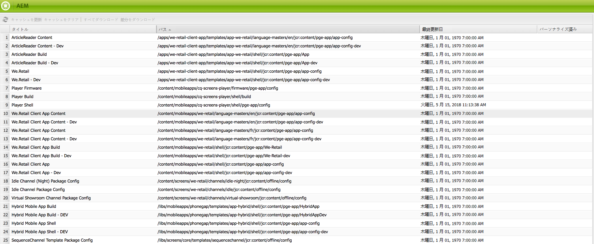

# モバイルとコンテンツ同期{#mobile-with-content-sync}

{{ue-over-mobile}}

>[!NOTE]
>
>このドキュメントは、[Adobe Experience Manager（AEM）モバイル入門ガイド &#x200B;](/help/mobile/getting-started-aem-mobile.md) ガイドの一部です。このガイドは、AEM Mobile リファレンスの出発点として推奨されます。

Content Syncを使用してコンテンツをパッケージ化し、ネイティブモバイルアプリケーションで使用できるようにします。 AEMで作成されたページは、デバイスがオフラインの場合でも、アプリコンテンツとして使用できます。 さらに、AEM ページはweb標準に基づいているため、クロスプラットフォームで動作するため、任意のネイティブラッパーに埋め込むことができます。 これにより、開発の手間を軽減し、アプリのコンテンツを簡単に更新できます。

>[!NOTE]
>
>AEM ツールを使用して作成したPhoneGap アプリは、Content Syncを介してAEM ページをコンテンツとして使用するように既に設定されています。

コンテンツ同期フレームワークは、web コンテンツを含むアーカイブファイルを作成します。 コンテンツには、単純なページ、画像、PDFファイル、web アプリケーション全体など、何でも利用できます。 Content Sync APIは、モバイルアプリまたはビルドプロセスからアーカイブファイルにアクセスし、コンテンツを取得してアプリに含めることができるようにします。

次の一連の手順は、コンテンツ同期の一般的な使用例を示しています。

1. AEM開発者は、含めるコンテンツを指定するContent Sync設定を作成します。
1. Content Sync フレームワークは、コンテンツを収集してキャッシュします。
1. モバイルデバイスでは、モバイルアプリケーションが起動され、サーバーからコンテンツがリクエストされ、ZIP ファイルで配信されます。
1. クライアントはZIP コンテンツをローカルファイルシステムに展開します。 ZIP ファイルのフォルダー構造は、クライアント（ブラウザーなど）が通常サーバーに要求するパスをシミュレートします。
1. クライアントは、埋め込まれたブラウザーでコンテンツを開くか、別の方法で使用します。
1. その後、クライアントはサーバーから更新されたコンテンツをリクエストします。 コンテンツ同期フレームワークは、ダウンロードサイズと時間を短縮するための増分更新を提供します。これは、帯域幅やデータ量が限られているため、モバイルデバイスにとって重要な場合があります。

>[!NOTE]
>
>コンテンツ同期ハンドラーの開発に関するガイドラインについて詳しくは、標準搭載のアプリハンドラーを参照してください。[&#x200B; コンテンツ同期ハンドラーの開発](/help/mobile/contentsync-app-handlers.md)を参照してください。

## コンテンツ同期コンテンツの設定 {#configuring-the-content-sync-content}

コンテンツ同期設定を作成して、クライアントに配信するZIP ファイルのコンテンツを指定します。 任意の数のコンテンツ同期設定を作成できます。 各設定には、識別のために名前が付けられます。

コンテンツ同期設定を作成するには、`sling:resourceType` プロパティが`contentsync/config`に設定された`cq:ContentSyncConfig` ノードをリポジトリに追加します。 `cq:ContentSyncConfig` ノードは、リポジトリ内の任意の場所に配置できますが、AEM パブリッシュインスタンスのユーザーがノードにアクセスできる必要があります。 したがって、`/content`の下にノードを追加してください。

コンテンツ同期ZIP ファイルのコンテンツを指定するには、cq:ContentSyncConfig ノードに子ノードを追加します。 各子ノードの次のプロパティは、含めるコンテンツアイテムと、その追加時の処理方法を識別します。

* `path`: コンテンツの場所。
* `type`: コンテンツの処理に使用する構成タイプの名前。 いくつかのタイプが使用可能で、構成タイプに記載されています。

コンテンツ同期設定の例を参照してください。

コンテンツ同期設定を作成すると、コンテンツ同期コンソールに表示されます。

>[!NOTE]
>
>コンテンツ同期フレームワークでは、アセットとデザイン関連ファイルの依存関係がコンテンツ同期パッケージに含まれているかどうかがチェックされません。 必要なファイルがすべてZIP ファイルに含まれていることを確認します。

### コンテンツ同期ダウンロードへのアクセスの設定 {#configuring-access-to-content-sync-downloads}

Content Syncからダウンロードできるユーザーまたはグループを指定します。 すべてのコンテンツ同期キャッシュからダウンロードできるデフォルトのユーザーまたはグループを設定できます。また、デフォルトを上書きして、特定のコンテンツ同期設定に対するアクセスを設定できます。

AEMがインストールされている場合、管理者グループのメンバーはデフォルトでContent Syncからダウンロードできます。

### コンテンツ同期ダウンロードのデフォルトアクセスの設定 {#setting-the-default-access-for-content-sync-downloads}

Day CQ Content Sync Manager サービスは、Content Syncへのアクセスを制御します。 このサービスを設定して、デフォルトでコンテンツ同期からダウンロードできるユーザーまたはグループを指定します。

Web コンソール [&#128279;](/help/sites-deploying/configuring-osgi.md#osgi-configuration-with-the-web-console)を使用してサービスを設定する場合は、ユーザーまたはグループの名前をフォールバックキャッシュ承認可能プロパティの値として入力します。

リポジトリ [&#128279;](/help/sites-deploying/configuring-osgi.md#osgi-configuration-in-the-repository)で構成している場合は、サービスに関する次の情報を使用します。

* PID: com.day.cq.contentsync.impl.ContentSyncManagerImpl
* プロパティ名：contentsync.fallback.authorizable

#### コンテンツ同期キャッシュのダウンロードアクセスの上書き {#overriding-download-access-for-a-content-sync-cache}

特定のコンテンツ同期設定のダウンロードアクセスを設定するには、次のプロパティを`cq:ContentSyncConfig` ノードに追加します。

* 名前：authorizable
* タイプ：String
* 値：ダウンロードできるユーザーまたはグループの名前。

例えば、ユーザーはアプリを使用して、コンテンツ同期から直接アップデートをインストールできます。 すべてのユーザーが更新プログラムをダウンロードできるようにするには、承認可能なプロパティの値を`everyone`に設定します。

`cq:ContentSyncConfig` ノードに承認可能なプロパティがない場合、Day CQ Content Sync Manager サービスのFallback Cache Authorizable プロパティに設定されているデフォルトのユーザーまたはグループによって、ダウンロードできるユーザーが決まります。

### コンテンツ同期キャッシュを更新するためのユーザーの設定 {#configuring-the-user-for-updating-a-content-sync-cache}

ユーザーがコンテンツ同期キャッシュに対して更新を実行すると、特定のユーザーアカウントがユーザーに代わってアクションを実行します。 匿名ユーザーは、すべてのコンテンツ同期キャッシュをデフォルトで更新します。

デフォルトのユーザーを上書きし、特定のコンテンツ同期キャッシュを更新するユーザーまたはグループを指定できます。

デフォルトユーザーを上書きするには、特定のコンテンツ同期設定の更新を実行するユーザーまたはグループを指定して、次のプロパティをcq:ContentSyncConfig ノードに追加します。

* 名前：updateuser
* タイプ：String
* 値：更新を実行できるユーザーまたはグループの名前。

cq:ContentSyncConfig ノードに`updateuser` プロパティがない場合、デフォルトの匿名ユーザーはキャッシュを更新します。

### 設定タイプ {#configuration-types}

処理には、シンプルなJSONのレンダリングから、参照アセットを含むページの本格的なレンダリングまで、さまざまな種類があります。 この節では、使用可能な設定タイプとその特定のパラメーターを示します。

**copy** ファイルとフォルダーをコピーするだけです。

* **パス** - パスが1つのファイルを指している場合、そのファイルのみがコピーされます。 フォルダー（ページノードを含む）を指している場合、以下のすべてのファイルとフォルダーがコピーされます。

**content** – 標準のSling リクエスト処理を使用してコンテンツをレンダリングします。

* **path** – 出力するリソースへのパス。
* **extension** - リクエストで使用する拡張機能。 一般的な例は&#x200B;*html*&#x200B;と&#x200B;*json*&#x200B;ですが、他の拡張機能は使用できます。

* **セレクター** - オプションのセレクターをドットで区切ります。 一般的な例としては、ページのモバイルバージョンをレンダリングする場合は&#x200B;*touch*、JSON出力の場合は&#x200B;*infinity*&#x200B;があります。

**clientlib** - JavaScriptまたはCSS クライアントライブラリをパッケージ化します。

* **パス** - クライアントライブラリのルートへのパス。
* **extension** - クライアントライブラリのタイプ。 これは、現時点では&#x200B;*js*&#x200B;または&#x200B;*css*&#x200B;のいずれかに設定する必要があります。

* **includeFolders** - タイプは文字列の配列であり、ユーザーはクライアントライブラリでスキャンする追加のフォルダーを指定して、ファイル（カスタムフォントなど）を取得できます。

**アセット** - アセットの元のレンディションを収集します。

* **パス** - /content/damの下のアセットフォルダーへのパス。
* **レンディション** - タイプは、ユーザーがデフォルトの画像の代わりに使用するレンディションを指定できる文字列の配列です。 次のリストでは、一部の標準レンディションを要約していますが、ワークフローで作成した任意のレンディションを使用することもできます。

   * *original*
   * *cq5dam.thumbnail.48.48.png*
   * *cq5dam.thumbnail.319.319.png*
   * *cq5dam.thumbnail.140.100.png*
   * *cq5dam.web.1280.1280.png*

**image** – 画像を収集します。

* **パス** – 画像リソースへのパス。

画像タイプは、We.Retail ロゴをzip ファイルに含めるために使用されます。

**pages** - AEM ページをレンダリングし、参照アセットを収集します。

* **パス** - ページへのパス。
* **extension** - リクエストで使用する拡張機能。 ページの場合は、ほとんどの場合&#x200B;*html*&#x200B;ですが、他のページでも可能です。

* **セレクター** - オプションのセレクターをドットで区切ります。 一般的な例は、ページのモバイルバージョンをレンダリングするための&#x200B;*touch*&#x200B;です。

* **deep** – 子ページを含めるかどうかを決定するオプションのブール値プロパティです。 デフォルト値は&#x200B;*trueです。*

* **includeImages** – 画像を含めるかどうかを決定するオプションのブール型プロパティ。 デフォルト値は&#x200B;*true*&#x200B;です。デフォルトでは、リソースタイプがfoundation/components/imageの画像コンポーネントのみが含まれると見なされます。 Web コンソールで&#x200B;**Day CQ WCM Pages Update Handler**&#x200B;を設定することで、さらにリソースタイプを追加できます。

**rewrite** – 書き換えノードは、書き出されたページでのリンクの書き換え方法を定義します。 書き換えられたリンクは、zip ファイルに含まれるファイルまたはサーバー上のリソースを指すことができます。

`rewrite` ノードは、`page` ノードの下に配置する必要があります。

`rewrite` ノードには、次の1つ以上のプロパティを設定できます。

* `clientlibs`: clientlibs パスを書き換えます。

* `images`：画像パスを書き換えます。
* `links`: リンク パスを書き換えます。

各プロパティには、次のいずれかの値を指定できます。

* `REWRITE_RELATIVE`: ファイル システム上のページ .html ファイルへの相対位置を持つパスを書き換えます。

* `REWRITE_EXTERNAL`: AEM [Externalizer サービス &#x200B;](/help/sites-developing/externalizer.md)を使用して、サーバー上のリソースを指すことでパスを書き換えます。

**PathRewriterTransformerFactory**&#x200B;というAEM サービスを使用すると、書き換える特定のhtml属性を設定できます。 サービスはWeb コンソールで設定でき、`rewrite` ノードの各プロパティの設定があります：`clientlibs`、`images`、および`links`。

この機能は、AEM 5.5で追加されました。

### コンテンツ同期設定の例 {#example-content-sync-configuration}

次のリストは、コンテンツ同期の設定例を示しています。

```java
+ weretail_go [cq:ContentSyncConfig]
  - sling:resourceType = "contentsync/config"

  + etc.designs.default [nt:unstructured]
    - path = "/etc/designs/default"
    - type = "copy"

  + etc.designs.mobile [nt:unstructured]
    - path = "/etc/designs/mobile"
    - type = "copy"

  + events.plist [nt:unstructured]
    - path = "/content/weretail_mobile/en/events/jcr:content/par/events"
    - type = "content"
    - extension = "plist"

  + events.touch.html [nt:unstructured]
    - path = "/content/weretail_mobile/en/events"
    - type = "pages"
    - extension = "html"
    - selector = "touch"

  + logo [nt:unstructured]
    - path = "/etc/designs/mobile/jcr:content/mobilecontentpage/logo"
    - type = "logo"

  + manifest [nt:unstructured]
    - indexPage = "/content/weretail_mobile/en/events.touch.html"
    - metadataPlist = "/content/weretail_mobile/en/events/_jcr_content/par/events.plist"

  + ...
```

**etc.designs.defaultおよびetc.designs.mobile** – 設定の最初の2つのエントリは明らかです。 複数のモバイルページを含めるので、/etc/designsの下に関連するデザインファイルが必要です。 そして、追加の処理は必要ないので、コピーで十分です。

**events.plist** – このエントリは少し特殊です。 概要に記載されているように、アプリケーションは、イベントの場所のマーカーを含むマップビューを提供する必要があります。 必要な位置情報をPLIST形式の別のファイルとして提供します。 これを機能させるには、インデックスページで使用されるイベントリストコンポーネントには、plist.jspというスクリプトがあります。 このスクリプトは、コンポーネントのリソースが`.plist`拡張機能で要求されたときに実行されます。 通常どおり、コンポーネントパスはpath プロパティで指定され、タイプはcontentに設定されます。これは、Sling リクエスト処理を使用するためです。

**events.touch.html** – 次に、アプリに表示される実際のページが表示されます。 path プロパティは、イベントのルートページに設定されます。 そのページの下にあるすべてのイベントページも含まれます。これは、ディーププロパティのデフォルトがtrueであるためです。 ページを設定タイプとして使用するので、ページ上の画像またはダウンロードコンポーネントから参照できる画像またはその他のファイルが含まれます。 さらに、タッチセレクターを設定すると、ページのモバイル版が表示されます。 機能パックの設定には、この種類のエントリが多く含まれていますが、ここでは簡単にするため、これらのエントリは省略されています。

**logo** - ロゴ設定の種類は今のところ言及されておらず、ビルトインの種類ではありません。 ただし、コンテンツ同期フレームワークはある程度拡張可能であり、これはその一例です。これについては、次の節で説明します。

**マニフェスト** – 例えば、コンテンツの開始ページなど、zip ファイルに何らかのメタデータを含めることが望ましいことがよくあります。 しかし、このような情報をハードコーディングすると、後で簡単に変更できなくなります。 コンテンツ同期フレームワークは、設定でマニフェストノードを検索することで、このユースケースをサポートします。このノードは名前で識別され、設定タイプは必要ありません。 特定のノードで定義されたすべてのプロパティがファイルに追加されます。このファイルはマニフェストとも呼ばれ、zip ファイルのルートにあります。

この例では、イベントリストページが最初のページになります。 この情報は&#x200B;**indexPage** プロパティで提供されるので、いつでも簡単に変更できます。 2番目のプロパティは、*events.plist* ファイルのパスを定義します。 後で見るように、クライアントアプリケーションはマニフェストを読み取り、それに従って行動できるようになりました。

設定が設定されている場合、コンテンツはブラウザーまたはその他のHTTP クライアントでダウンロードできます。また、iOS用に開発する場合は、専用のWAppKitSync クライアントライブラリを使用できます。 ダウンロード場所は、設定のパスと&#x200B;*.zip*&#x200B;拡張機能で構成されます。例えば、ローカル AEM インスタンスで作業する場合は、*https://localhost:4502/content/weretail_go.zip*

### コンテンツ同期コンソール {#the-content-sync-console}

コンテンツ同期コンソールには、リポジトリ内のすべてのコンテンツ同期設定（タイプ `cq:ContentSyncConfig`のすべてのノード）が一覧表示され、各設定に対して次の操作を実行できます。

* キャッシュを更新します。
* キャッシュをクリアします。
* フル zip ファイルをダウンロードします。
* 現在と特定の日時の差分zipをダウンロードします。

これは、開発とトラブルシューティングに役立ちます。

コンソールには、次の場所からアクセスできます。

`https://localhost:4502/libs/cq/contentsync/content/console.html`

次のようなコンソールが表示されます。



### コンテンツ同期フレームワークの拡張 {#extending-the-content-sync-framework}

設定オプションの数は既に多いのですが、特定のユースケースのすべての要件をカバーしているわけではありません。 この節では、コンテンツ同期フレームワークの拡張ポイントと、カスタム設定タイプの作成方法について説明します。

設定タイプごとに、*Content Update Handler*&#x200B;があります。これは、その特定のタイプに登録されているOSGi コンポーネントファクトリです。 これらのハンドラーは、コンテンツを収集して処理し、コンテンツ同期フレームワークによって維持されるキャッシュに追加します。 次のインターフェイスまたは抽象ベースクラスを実装します。

* `com.day.cq.contentsync.handler.ContentUpdateHandler` – すべての更新ハンドラーが実装する必要があるインターフェイス
* `com.day.cq.contentsync.handler.AbstractSlingResourceUpdateHandler` - Slingを使用したリソースのレンダリングを簡略化する抽象クラス

クラスをOSGi コンポーネントファクトリとして登録し、バンドルのOSGi コンテナにデプロイします。 これは、[Maven SCR プラグイン &#x200B;](https://felix.apache.org/documentation/subprojects/apache-felix-maven-scr-plugin/apache-felix-maven-scr-plugin-use.html)を使用して、JavaDoc タグまたは注釈を使用して行うことができます。 次の例は、JavaDoc バージョンを示しています。

```java
/*
 * @scr.component metatype="no"
 * factory="com.day.cq.contentsync.handler.ContentUpdateHandler/customtype"
 */
public class CustomTypeUpdateHandler implements ContentUpdateHandler {
    // add your code here
}

/*
 * @scr.component metatype="no" inherit="true"
 * factory="com.day.cq.contentsync.handler.ContentUpdateHandler/othertype"
 */
public class OtherTypeUpdateHandler extends AbstractSlingResourceUpdateHandler {
    // add your code here
}
```

*factory*&#x200B;定義には、共通インターフェイスとカスタムタイプがスラッシュで区切られていることに注意してください。 この戦略により、コンテンツ同期フレームワークは、設定エントリ内のカスタムタイプを認識するので、カスタムクラスのインスタンスを検索して作成できます。 次の節では、カスタム更新ハンドラーの具体的な例を示します。

>[!CAUTION]
>
>AbstractSlingResourceUpdateHandler ベースクラスに基づいて構築する場合は、*inherit*&#x200B;定義を追加する必要があります。 それ以外の場合、OSGi コンテナは、ベースクラスで宣言された必要な参照を設定しません。

### カスタム更新ハンドラーの実装 {#implementing-a-custom-update-handler}

すべてのWe.Retail モバイルページには、左上隅にzip ファイルに含めるロゴが含まれています。 ただし、キャッシュ最適化の場合、AEMはリポジトリ内の画像ファイルの実際の場所を参照しないため、**copy**&#x200B;設定タイプを使用することはできません。 代わりに行う必要があるのは、AEMが要求した場所で画像を使用できるようにするために、独自の&#x200B;**logo**&#x200B;設定タイプを提供することです。 次のコードリストは、ロゴ更新ハンドラーの完全な実装を示しています。

#### LogoUpdateHandler.java {#logoupdatehandler-java}

```java
package com.day.cq.wcm.apps.weretail.impl;

import javax.jcr.Node;
import javax.jcr.RepositoryException;
import javax.jcr.Session;

import org.apache.sling.api.resource.Resource;
import org.apache.sling.api.resource.ResourceResolver;
import org.apache.sling.jcr.resource.JcrResourceResolverFactory;

import com.day.cq.commons.jcr.JcrUtil;
import com.day.cq.contentsync.config.ConfigEntry;
import com.day.cq.contentsync.handler.ContentUpdateHandler;
import com.day.cq.wcm.foundation.Image;
import com.day.text.Text;

/**
 * The <code>LogoUpdateHandler</code> is used to update the content sync cache
 * with a page logo added using a logo component.
 *
 * @scr.component metatype="no"
 * factory="com.day.cq.contentsync.handler.ContentUpdateHandler/logo"
 */
public class LogoUpdateHandler implements ContentUpdateHandler {

    private static final Logger log = LoggerFactory.getLogger(LogoUpdateHandler.class);

    /** @scr.reference policy="static" */
    protected JcrResourceResolverFactory resolverFactory;

    public boolean updateCacheEntry(ConfigEntry configEntry, Long lastUpdated, String configCacheRoot, Session admin, Session session) {
        ResourceResolver resolver = resolverFactory.getResourceResolver(admin);
        Resource resource = resolver.getResource(configEntry.getContentPath());

        Image img = new Image(resource);
        img.setItemName(Image.NN_FILE, "image");
        img.setItemName(Image.PN_REFERENCE, "imageReference");
        img.setSelector("img");

        try {
            if(img.getLastModified() == null || lastUpdated < img.getLastModified().getTime().getTime()) {
                String src = img.getSrc();
                String parentPath = configCacheRoot + Text.getRelativeParent(src, 1);

                Node parent = JcrUtil.createPath(parentPath, "sling:Folder", admin);
                Node image = resolver.getResource(resource.getPath() + "/image").adaptTo(Node.class);
                JcrUtil.copy(image, parent, Text.getName(src));

                admin.save();

                return true;
            }
        } catch (RepositoryException e) {
            log.error("Unexpected error while updating logo: ", e);
        }

        return false;
    }
}
```

`LogoUpdateHandler` クラスは`ContentUpdateHandler` インターフェイスの`updateCacheEntry(ConfigEntry, Long, String, Session, Session)` メソッドを実装します。これには、いくつかの引数が必要です。

* このハンドラーが呼び出される設定エントリとそのプロパティへのアクセスを提供する`ConfigEntry` インスタンス。
* Content Syncが最後にキャッシュを更新した時刻を示す`lastUpdated` タイムスタンプ。 そのタイムスタンプの後に変更されていないコンテンツは、ハンドラーで更新しないでください。
* キャッシュのルート パスを指定する`configCacheRoot`引数。 更新されたすべてのファイルは、zip ファイルに追加するためにこのパスの下に保存する必要があります。
* キャッシュ関連のすべてのリポジトリ操作に使用する管理セッション。
* 特定のユーザーのコンテキストでコンテンツを更新し、パーソナライズされたコンテンツを提供するために使用できるユーザーセッション。

カスタムハンドラーを実装するには、まず、設定エントリで指定されたリソースに基づいてImage クラスのインスタンスを作成します。 これは、基本的に、ページの実際のロゴコンポーネントと同じ手順です。 画像のターゲットパスが、ページから参照されるものと同じであることを確認します。

次に、リソースが前回の更新以降に変更されたかどうかを確認します。 カスタム実装では、キャッシュの不必要な更新を避け、何も変更しない場合はfalseを返す必要があります。 リソースが変更された場合は、イメージをキャッシュルートに関連するターゲットの場所にコピーします。 最後に、`true`が返され、キャッシュが更新されたことをフレームワークに示します。

## クライアントでのコンテンツの使用 {#using-the-content-on-the-client}

Content Syncが提供するモバイルアプリでコンテンツを使用するには、HTTPまたはHTTPS接続を介してコンテンツをリクエストする必要があります。 その結果、取得したコンテンツ（ZIP ファイルに詰め込まれた）を抽出し、モバイル機器にローカルに保存することができます。 コンテンツは、データだけでなく、ロジック、つまり完全なweb アプリケーションも指します。したがって、モバイルユーザーは、ネットワーク接続がなくても、取得したweb アプリケーションと対応するデータを実行できます。

Content Syncは、インテリジェントな方法でコンテンツを配信します。最後にデータ同期が成功してからデータの変更のみが配信されるため、データ転送に必要な時間が短縮されます。 アプリケーションデータの初回実行時には、1970年1月1日以降に変更が要求され、その後最後に正常に同期されてから変更されたデータのみが要求されます。 AEMでは、iOSのクライアント通信フレームワークを使用してデータの通信と転送を簡素化するため、iOS ベースのweb アプリケーションを有効にするために最小限のネイティブコードが必要になります。

転送されたすべてのデータは同じディレクトリ構造に抽出できますが、データの抽出時に追加の手順（依存関係チェックなど）は必要ありません。 IOSがある場合、すべてのデータはiOS アプリのDocuments フォルダー内のサブフォルダーに保存されます。

IOS ベースのAEM Mobile アプリの一般的な実行パス：

* ユーザーがiOS デバイスでアプリを起動します。
* アプリがAEM バックエンドへの接続を試み、前回の実行以降のデータ変更をリクエストします。
* サーバーは問題のデータを取得し、それらをファイルに圧縮します。
* データはクライアントデバイスに返され、そこでドキュメントフォルダーに抽出されます。
* UIWebView コンポーネントが開始/更新されます。

接続を確立できなかった場合は、以前にダウンロードしたデータが表示されます。

### 一歩先を行く {#getting-ahead}

管理者と開発者の役割と責任について詳しくは、以下のリソースを参照してください。

* [Adobe PhoneGap EnterpriseとAEMのオーサリング](/help/mobile/phonegap.md)
* [AEM を使用した Adobe PhoneGap Enterprise のコンテンツの管理](/help/mobile/administer-phonegap.md)
