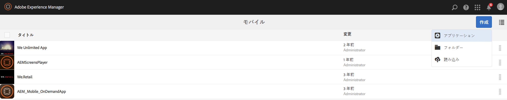
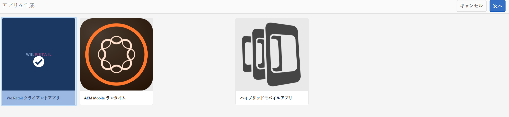
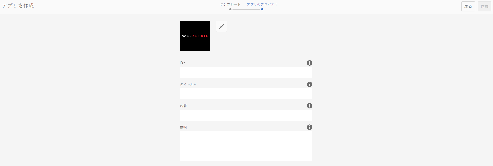

# 作成ウィザードを使用した新規 AEM Mobile アプリの作成{#creating-a-new-aem-mobile-app-using-create-wizard}

>[!NOTE]
>
>単一ページアプリケーションフレームワークを基にしたクライアント側レンダリング（React など）が必要なプロジェクトでは、SPA エディターを使用することをお勧めします。[詳細情報](/help/sites-developing/spa-overview.md)

AEM Mobile アプリは、ページ構成およびプロパティを定義するブループリントに基づきます。次のアプリケーションプロパティを設定できます。

* **タイトル：**&#x200B;アプリケーションのタイトル。
* **宛先のパス：**&#x200B;アプリケーションが格納されるリポジトリ内での場所。デフォルトのままにすると、アプリ名に基づいてパスが作成されます。

* **名前：**&#x200B;デフォルト値は、「タイトル」プロパティの値から空白文字を除外した値です。この名前は、AEM 内でアプリケーションを参照するために使用されます（例えば、アプリケーションを表すリポジトリノードなど）。
* **説明：**&#x200B;アプリケーションの説明。
* **サーバー URL：**&#x200B;アプリケーションに対して無線（OTA）によるコンテンツ更新を提供する URL。デフォルト値は、アプリケーションの作成に使用するインスタンスのパブリッシュサーバー URL です（Externalizer サービスから取得されます）。これは、認証が必要なオーサーではなく、パブリッシュサーバーインスタンスである必要があります。

アプリケーションサムネールとして使用する画像ファイルを提供したり、使用する PhoneGap Build 設定を選択したり、使用するモバイルアプリ分析設定を選択したりすることもできます。この画像は、Experience Managerのモバイルアプリコンソール内でモバイルアプリを表すサムネールとしてのみ使用されます。

その他の（オプションの）タブは、ビルドクラウドサービス向けで、Adobe Mobile Services SDK プラグインをアプリに統合する場合に使用します。

* ビルド：ここでは、「設定を管理」をクリックし、build.phonegap.com ビルドサービスを設定します。次に、ドロップダウンから、新規に作成した PhoneGap Build クラウドサービスを選択できます。
* 分析：「設定を管理」をクリックし、[Adobe Mobile Services SDK](https://docs.adobe.com/content/help/en/mobile-services/using/home.html) クラウドサービスを設定します。ドロップダウンから、モバイルアプリに統合する新しく作成したモバイルサービスを選択できるようになります。

## アプリテンプレートの使用  {#using-app-templates}

アプリテンプレートにより、AEM での新しいアプリの作成に使用される、開発者が作成した既存のデザインを利用する簡単な方法が提供されます。

アプリテンプレートとはアプリのベースラインまたは基盤となるページテンプレートおよびコンポーネントをひとまとめにしたものと考えることができます。新規アプリを別のアプリのテンプレートに基づいて作成すると、作成元アプリと同じ開始点からアプリを作成することができます。

この機能を利用するには、既存のモバイルアプリテンプレートが必要です（またはアプリテンプレートを含むアプリがインストールされている必要があります）。

最新のAEM Appsサンプルパッケージには、Geometrixxアプリの最新バージョンとアプリテンプレートが含まれています。 または、テンプレートも提供する[StarterKit](https://github.com/Adobe-Marketing-Cloud-Apps/aem-phonegap-starter-kit)をインストールできます。

アプリテンプレートに基づいて新しいアプリを作成する手順は次のとおりです。

1. AEM Mobileアプリカタログに移動します。&lt;*server-url*>aem/apps.html/content/mobileapps
1. 以下のように「**作成**」を選択し、「**アプリ**」を選択します。

AEM 開発者が使用可能にしたアプリテンプレートを選択します。開発者向けのサポートについては、「 [AEM Mobile App](/help/mobile/phonegap-structure-an-app.md)の構造」を参照してください。

新しいアプリの詳細を必要に応じて入力します。オプションで、そのサムネール画像を変更します。これらの値は、後で&#x200B;**アプリを管理**&#x200B;タイルから編集できます。

## 次の手順 {#the-next-steps}

他のオーサリングの役割について詳しくは、以下のリソースを参照してください。

* [アプリを管理タイル](/help/mobile/phonegap-app-details-tile.md)
* [アプリのメタデータの編集](/help/mobile/phonegap-editmetadata.md)
* [アプリの定義](/help/mobile/phonegap-app-definitions.md)
* [既存のハイブリッドアプリのインポート](/help/mobile/phonegap-adding-content-to-imported-app.md)
* [コンテンツサービス](/help/mobile/develop-content-as-a-service.md)

## その他のリソース {#additional-resources}

管理者および開発者の役割と責任について詳しくは、以下のリソースを参照してください。

* [AEM と Adobe PhoneGap Enterprise での開発](/help/mobile/developing-in-phonegap.md)
* [AEM での Adobe PhoneGap Enterprise のコンテンツの管理](/help/mobile/administer-phonegap.md)
