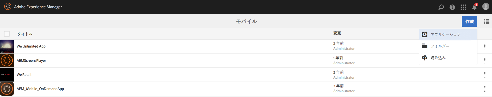
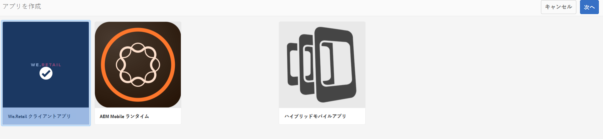
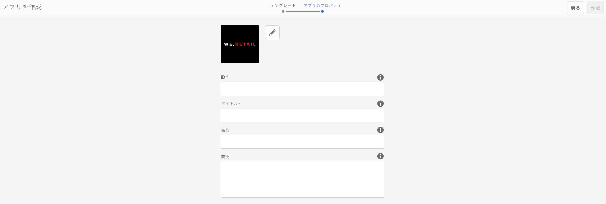

# 作成ウィザードを使用したAEM Mobile アプリの作成{#creating-a-new-aem-mobile-app-using-create-wizard}

{{ue-over-mobile}}

AEM Mobileは、ページ構造とプロパティを定義する設計図にもとづいています。 次のアプリケーションプロパティを設定できます。

* **タイトル：** アプリケーションのタイトル。
* **宛先パス：** アプリケーションが保存されているリポジトリ内の場所。 アプリ名に基づいてパスを作成するには、デフォルトのままにします。

* **名前：** デフォルト値は、スペース文字が削除されたタイトルプロパティの値です。 名前は、AEM内でアプリケーションを表すリポジトリノードなどのアプリケーションを参照するために使用されます。
* **説明：** アプリケーションの説明。
* **サーバーURL:** アプリケーションに対する無線（OTA）コンテンツ更新を提供するURL。 デフォルト値は、アプリケーションの作成に使用されるインスタンスのパブリッシュサーバーのURLです（externalizer サービスから取得）。 注意：これはオーサーではなくパブリッシュサーバーインスタンスである必要があり、認証が必要です。

アプリケーションのサムネールとして使用する画像ファイルを指定し、使用するPhoneGap Build設定を選択し、使用するMobile App Analytics設定を選択することもできます。 この画像は、Experience Managerのモバイルアプリコンソール内でモバイルアプリケーションを表すサムネールとしてのみ使用されます。

ビルドクラウドサービス用およびAdobe Mobile Services SDK プラグインをアプリに統合するためのタブが追加（およびオプション）で用意されています。

* ビルド：設定の管理をクリックし、ここでbuild.phonegap.com ビルドサービスを設定します。 次に、ドロップダウンから、新しく作成したPhoneGap ビルドクラウドサービスを選択できます。
* Analytics:「設定を管理」をクリックし、[Adobe Mobile Services SDK](https://experienceleague.adobe.com/docs/mobile-services/using/home.html?lang=ja) クラウドサービスを設定します。 次に、ドロップダウンから、新しく作成したモバイルサービスを選択して、モバイルアプリに統合できます。

## アプリテンプレートの使用 {#using-app-templates}

アプリテンプレートは、AEM内で新しいアプリを作成するために使用される、開発者が作成した既存のデザインを簡単に使用する方法を提供します。

アプリテンプレートとは？これは、アプリのベースラインや基盤を表すページテンプレートとコンポーネントのコレクションと考えてください。
別のアプリのテンプレートに基づいてアプリを作成する場合、作成元のアプリを代表する開始点を持つアプリが表示されます。

この機能を使用するには、既存のモバイルアプリテンプレート（またはアプリテンプレートを持つアプリがインストールされている場合）が必要です。

最新のAEM Apps サンプルパッケージには、アプリテンプレート付きのGeometrixx アプリの更新版が含まれています。 または、テンプレートも提供する[StarterKit](https://github.com/Adobe-Marketing-Cloud-Apps/aem-phonegap-starter-kit)をインストールすることもできます。

アプリテンプレートに基づいてアプリを作成する手順：

1. AEM Mobile アプリカタログに移動します。&lt;*server-url*>aem/apps.html/content/mobileapps
1. **作成**&#x200B;を選択し、次に示すように&#x200B;**アプリ**&#x200B;を選択します

AEM開発者が提供するアプリテンプレートを選択します。 詳しくは、[AEM Mobile アプリの構造](/help/mobile/phonegap-structure-an-app.md)を参照してください。

必要に応じて、サムネール画像の変更など、新しいアプリの詳細を入力します。 これらの値は、**アプリの管理** タイルから後で編集できます。

## 次の手順 {#the-next-steps}

その他のオーサリングの役割について詳しくは、次のリソースを参照してください。

* [アプリを管理タイル](/help/mobile/phonegap-app-details-tile.md)
* [アプリのメタデータの編集](/help/mobile/phonegap-editmetadata.md)
* [アプリ定義](/help/mobile/phonegap-app-definitions.md)
* [既存のハイブリッドアプリの読み込み](/help/mobile/phonegap-adding-content-to-imported-app.md)
* [コンテンツサービス](/help/mobile/develop-content-as-a-service.md)

## その他のリソース {#additional-resources}

管理者と開発者の役割と責任について詳しくは、以下のリソースを参照してください。

* [AEMを使用したAdobe PhoneGap Enterpriseの開発](/help/mobile/developing-in-phonegap.md)
* [AEM を使用した Adobe PhoneGap Enterprise のコンテンツの管理](/help/mobile/administer-phonegap.md)
