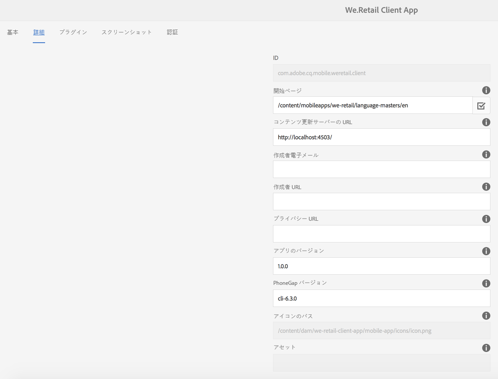
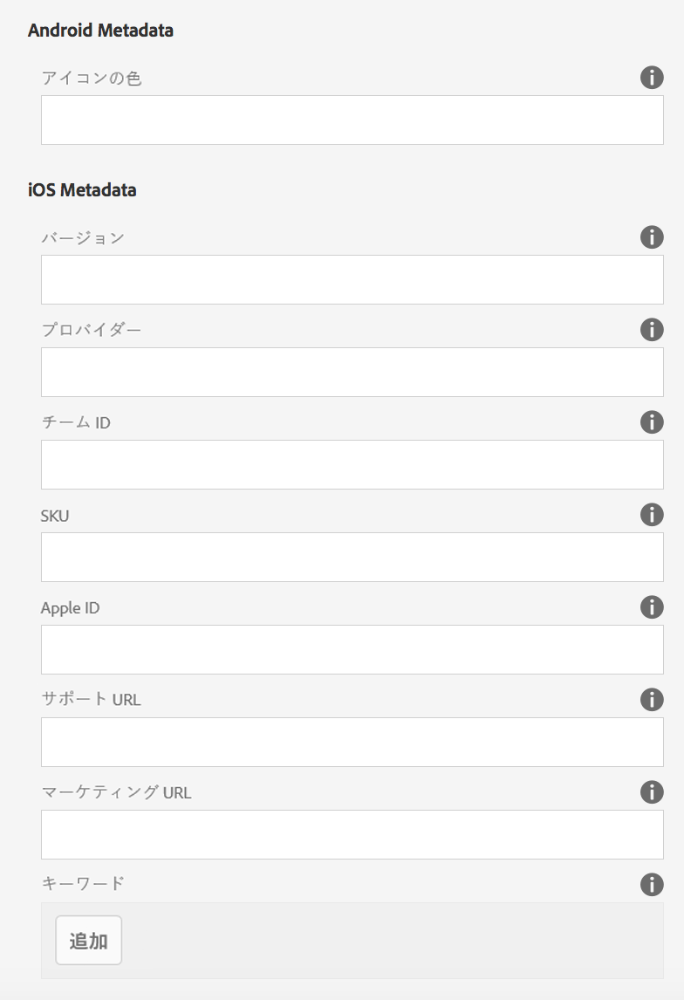
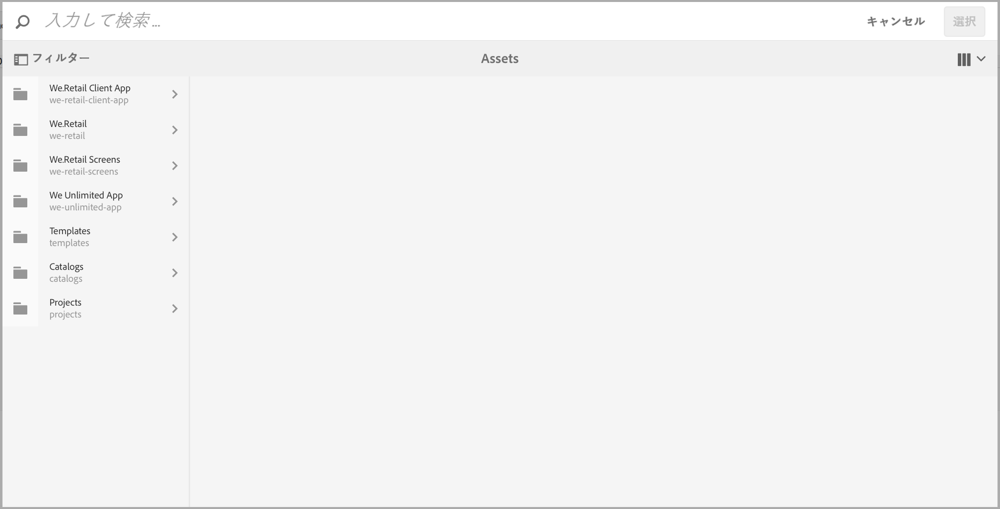

# アプリのメタデータの編集 {#editing-app-metadata}

>[!NOTE]
>
>単一ページアプリケーションフレームワークを基にしたクライアントサイドレンダリング（React など）が必要なプロジェクトでは、SPA エディターを使用することをお勧めします。[詳細情報](/help/sites-developing/spa-overview.md)。

この **アプリの管理** タイルと「アプリを管理」ページは、アプリケーションのメタデータを表示および編集する手段を提供します。 アプリのメタデータは、ベンダーのストアにアプリをリリースするために必要な詳細です。 これには、共通のメタデータ、iOSのメタデータおよびスクリーンショットが含まれる場合があります。 を参照してください。 [アプリを管理タイル](/help/mobile/phonegap-app-details-tile.md) 共通およびiOS メタデータについての詳細を参照してください。

## アプリデータの編集 {#editing-the-app-data}

アプリのメタデータを編集するには：

1. アプリのダッシュボードページに移動します。

   

1. の右下隅にある「。..」をクリックして詳細を表示または編集するには **アプリの管理** タイル。

1. 次の図に示すように、5 つのタブのいずれかで詳細を入力または表示します。

   

## 共通メタデータとIOS メタデータの編集 {#editing-common-and-ios-metadata}

共通メタデータとIOS メタデータは次の場所で編集できます。

* 「」を選択します **詳細** アプリの説明ページで tab キーを押します。
* 共通メタデータとIOS メタデータを編集または表示します。 詳しくは、以下の図を参照してください。

 

## スクリーンショットの追加と削除 {#add-and-remove-screenshots}

メタデータロールアップにアプリのスクリーンショットを含めることができます。 一部のベンダーは、アプリストアにアプリを送信する際に、正確なスクリーンショットを必要とします。 これらの画像は、既に Assets に存在している必要があります。 参照： [アセットピッカー](../assets/search-assets.md#assetpicker) スクリーンショットをアップロードします。

### スクリーンショットを追加 {#add-screenshots}

アセットをスクリーンショットとして追加するには：

1. の編集モードの場合 **アプリの管理** ページで、「追加」（プラスアイコン）をクリックします。
1. アセットを選択し、 **を選択** をクリックしてアセットを追加します。

   

1. アセットを選択し、 **を選択** をクリックしてアセットを追加します。

>[!NOTE]
>
>スクリーンショットは、ターゲット・デバイスの画面解像度と一致する必要があります。

### スクリーンショットを削除 {#delete-screenshots}

スクリーンショットを削除するには：

アセットの削除をクリックします。

## 次の手順 {#the-next-steps}

他のオーサリングの役割について詳しくは、次のリソースを参照してください。

* [アプリを管理タイル](/help/mobile/phonegap-app-details-tile.md)
* [アプリの定義](/help/mobile/phonegap-app-definitions.md)
* [アプリの作成ウィザードを使用した新しいアプリの作成](/help/mobile/phonegap-create-new-app.md)
* [既存のハイブリッドアプリを読み込む](/help/mobile/phonegap-adding-content-to-imported-app.md)
* [コンテンツサービス](/help/mobile/develop-content-as-a-service.md)

### その他のリソース {#additional-resources}

管理者と開発者の役割と責任については、以下のリソースを参照してください。

* [AEMを使用したAdobe PhoneGap Enterprise 向けの開発](/help/mobile/developing-in-phonegap.md)
* [AEM を使用した Adobe PhoneGap Enterprise のコンテンツの管理](/help/mobile/administer-phonegap.md)
