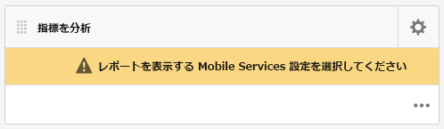
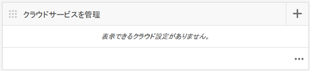
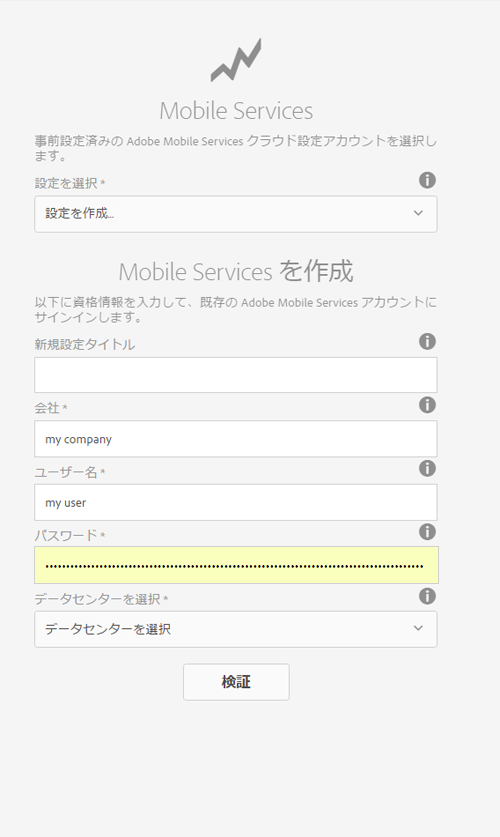
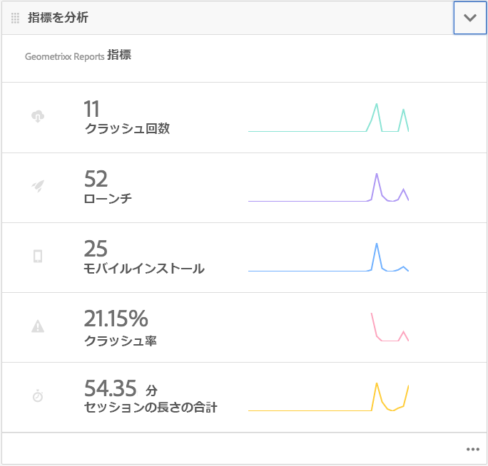
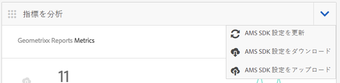
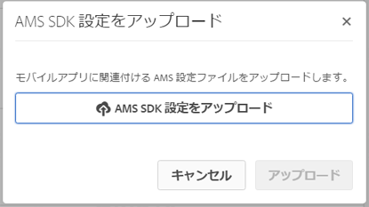

# Adobe Mobile Analytics によるアプリパフォーマンスのトラッキング{#track-app-performance-with-adobe-mobile-analytics}

>[!NOTE]
>
>単一ページアプリケーションフレームワークを基にしたクライアント側レンダリング（React など）が必要なプロジェクトでは、SPA エディターを使用することをお勧めします。[詳細情報](/help/sites-developing/spa-overview.md)

顧客コンバージョンおよびロイヤルティを高めたいと考えています。

関連性の高い魅力的なエクスペリエンスを顧客に提供したい。

マーケティングキャンペーンにおいて AEM Mobile アプリはどのような役割を果たしていますか。

ユーザーに最適なエクスペリエンスを提供するために、どのようにモバイルアプリケーションを微調整できますか。

Adobe Mobile Services では、使用状況、アプリのクラッシュ、デバイスの詳細など、モバイルアプリの数ある重要な指標をトラッキングすることで、ユーザーがモバイルアプリをどのように使用しているかを把握できます。

Adobe Experience Manager Mobile では、AEM Mobile アプリケーションダッシュボードから直接モバイル分析の詳細を一目で確認できます。The **Mobile Metrics Tile** in the dashboard provides real-time analytics for your mobile application, allowing developers, authors and administrators to get a quick glipse of the health of your mobile app. Under the covers powering the analytics is the [Adobe Mobile Analytics](https://www.adobe.com/ca/solutions/digital-analytics/mobile-web-apps-analytics.html) SDK. AdobeのMobile Analytics SDKは、ネイティブに、またはWebビュー用のPhoneGapブリッジプラグインを通じて、アプリケーションにプラグインできます。 指標は収集され、デバイスに接続されるまでデバイス上にキャッシュされます。レポートと分析のためにデータがMobile Services Cloudにプッシュされます。

Adobe Mobile Analytics SDK は、次の機能を提供します。

1. **モバイルチャネルに関するデータ収集** - すべての主要オペレーティングシステム上のモバイル Web サイトおよびアプリに関して総合的なデータを収集します。
1. **モバイルエンゲージメントの分析** — ユーザーがモバイルアプリ、Webサイトまたはビデオ内で行うエンゲージメントを把握できます。例えば、チャネルを起動する頻度や、消費者がアプリから購入するかどうかなどを把握できます。
1. **モバイルアプリのダッシュボードとレポート** — アプリのライフサイクル指標やアプリストア指標を含む使用状況レポートを取得します。ユーザー、起動回数、セッションの平均長さ、リテンション期間、クラッシュの傾向を確認できます。
1. **モバイルキャンペーン分析** - SMS、モバイル検索広告、モバイルディスプレイ広告、QRコードなど、モバイル固有のキャンペーンの効果を定量化します。
1. **位置情報分析** — アプリのユーザーが起動し、GPSの位置や目標地点でモバイルエクスペリエンスを操作する場所を見つけます。
1. **パス分析** — ユーザーがアプリ内をどのように移動して、ユーザーを惹きつける画面やUI要素を特定し、ユーザーをドロップオフさせる原因を確認します。

This section describes how [AEM Developers](#developers) can then learn how to instrument AEM Mobile apps with analytics tracking.

Finally, [AEM Administrators](#administrators) learn to:

* Adobe Mobile Services に対するクラウドサービスを作成します。
* モバイルサービス設定を作成し、レポートスイートを関連付けます。
* モバイルアプリにモバイルサービス設定を関連付けます。
* AEM アプリケーションコマンドセンターで指標を表示します。
* モバイルアプリに AMS SDK 設定を割り当てます。

## 開発者向け - アプリへの Analytics の統合 {#for-developers-integrate-analytics-into-your-app}

**前提条件：** AEM管理者は、以下で説明するように、AdobeMobile Servicesクラウドの設定 [を設定する必要があります](#amscloudserviceconfig)。

Developers are responsible for [adding analytics to an AEM Mobile app](/help/mobile/phonegap-add-analytics-to-apps.md) as necessary to track, report and understand how you users engage with your mobile app content and to measure key lifecycle metrics such as launches, time in app, and crash rate.

## 管理者向け - Adobe Mobile Services クラウドサービスの設定 {#for-administrators-configure-the-adobe-mobile-services-cloud-service}

AdobeMobile Servicesを利用するには、Adobe Analyticsのアカウント情報とAEMAdobeMobile ServicesCloud Serviceを設定する必要があります。 The Apps Command Center provides a **Analyze Metrics** tile where you can create and associate the cloud service with your mobile app.

モバイルアプリにクラウドサービスを設定するには、まず、指標を分析タイルにある歯車アイコンをクリックします。

指標を分析タイルで歯車アイコンをクリックすると、Mobile Services 分析を設定モーダルダイアログが開きます。「Select a Mobile Service Configuration」ドロップダウンから設定を選択します。 新しい設定を作成する必要がある場合は、設定ボタンをクリックします。

Adobe Mobile Services クラウドサービスを作成するには、サービスに接続することと、設定に割り当てるレポートスイートを選択することの 2 つの手順が必要です。

まず、ダッシュボードのクラウドサービスを管理タイルで + ボタンをクリックします。

Upon clicking the &#39;**+**&#39; button, the **Add Cloud Service** wizard will be displayed.

モバイルサービス設定を選択するか、または次のように必須フィールドに入力して新規モバイルサービス設定を作成します。AEM管理者は、この情報を使用してAdobeMobile Servicesへの接続を正常に作成する必要があります。

Mobile Services アカウント設定が完了したら、アプリを選択するように求められます。これにより、AdobeMobile Serviceの解析レポートがそのアプリケーションに接続されます。

目的のモバイルサービスを選択し、「更新」をクリックしてモバイルサービス設定を割り当ててから、ダイアログを閉じます。

AEM Mobile アプリにモバイルサービス設定を関連付けたので、タイルによって指標データの取得とレポートの作成が開始されます。

### Adobe Mobile Services SDK 設定ファイル {#adobe-mobile-services-sdk-config-file}

この時点で、モバイルアプリケーションはクラウドサービスに関連付けられていますが、収集されたモバイル指標を Adobe Analytics に通信する方法をまだ認識していません。モバイルアプリをAdobe Analyticsに配信するには、AdobeMobile Services SDK ConfigファイルをAdobe Experience Managerに追加する必要があります。

指標を分析タイルから、矢印アイコンをクリックして「AMS SDK 設定をダウンロード」または「AMS SDK 設定をアップロード」メニューエントリを表示します。

最初の手順では、Adobe Mobile Services から SDK 設定を取得します。「AMS SDK 設定をダウンロード」をクリックすると、設定ファイルをダウンロードできる Adobe Mobile Services の Web サイトにリダイレクトされます。ADBMobileConfig.jsonファイルを入手したら、「Upload AMS SDK Config」をクリックして、設定ファイルをAEMにアップロードします。

「Adobe Mobile Services アプリ設定をアップロード」ボタンをクリックし、ADBMobileConfig.json ファイルを参照し、「アップロード」をクリックします。

モバイルアプリは、ADBMobileConfig.json ファイルにアクセスできるようになったので、Adobe Analytics に通信する方法を認識し、アプリの成功を促進するのに役立つ重要な指標値に関するレポートの作成を開始します。

## 次の手順 {#what-s-next}

1. [AEM Mobile アプリを使ってみる](/help/mobile/starting-aem-phonegap-app.md)
1. [アプリのコンテンツを管理する](/help/mobile/phonegap-manage-app-content.md)
1. [アプリケーションをビルドする](/help/mobile/building-app-mobile-phonegap.md)
1. [Adobe Mobile Analytics でアプリケーションのパフォーマンスをトラッキングする](/help/mobile/phonegap-intro-to-app-analytics.md)
1. [Adobe Target でパーソナライズされたアプリケーションエクスペリエンスを提供する](/help/mobile/phonegap-aem-mobile-content-personalization.md)
1. [重要なメッセージをユーザーに送信する](/help/mobile/phonegap-push-notifications.md)