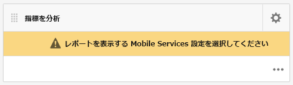
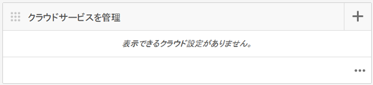
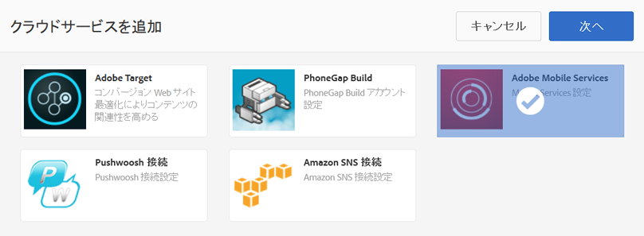
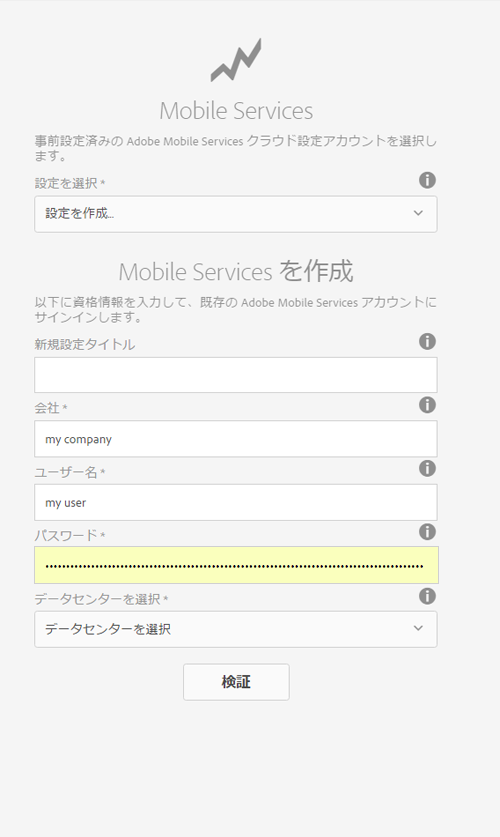
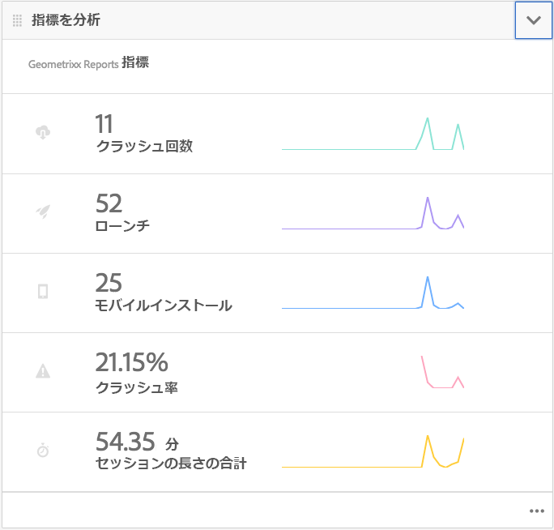
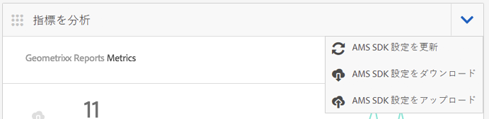
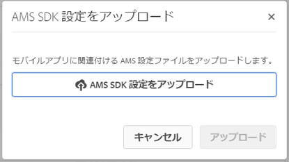

# Adobe Mobile Analytics によるアプリパフォーマンスのトラッキング{#track-app-performance-with-adobe-mobile-analytics}

{{ue-over-mobile}}

高い顧客コンバージョンとロイヤルティを実現できます。

顧客には、適切で魅力的なエクスペリエンスを提供することが求められます。

AEM Mobileアプリは、マーケティングキャンペーンでどのような役割を果たしますか？

最適な体験を提供するために、モバイルアプリケーションを最適化する方法を検討しましょう。

Adobe Mobile Servicesを利用すれば、モバイルアプリの使用状況、アプリのクラッシュ、デバイスの詳細など、モバイルアプリに関する多くの重要指標を追跡して、利用者がモバイルアプリをどのように利用しているのかを把握できます。

Adobe Experience Manager Mobileでは、AEM Mobileアプリケーションダッシュボードから直接モバイル分析の詳細を確認できます。 ダッシュボードの&#x200B;**モバイル指標タイル**&#x200B;は、モバイルアプリケーションにReal-Time Analyticsを提供し、開発者、作成者、管理者がモバイルアプリケーションの正常性をすばやく確認できるようにします。 カバーの下では、分析を強化するのは、[Adobe Mobile Analytics](https://business.adobe.com/products/analytics/mobile-marketing.html) SDKです。 Adobe Mobile Analytics SDKは、ネイティブまたはWeb ビュー用のPhoneGap Bridge プラグインを介してアプリケーションに接続できます。 指標は、デバイスが接続されるまでデバイス上で収集およびキャッシュされ、データはレポートと分析のためにAdobe Mobile Services Cloudにプッシュされます。

Adobe Mobile Analytics SDKには、次の機能があります。

1. **モバイルチャネル向けデータ収集** – 主要なオペレーティングシステムで、モバイルサイトとアプリに関する包括的なデータを収集します。
1. **モバイルエンゲージメント分析** – 消費者がチャネルを立ち上げる頻度、チャネルから購入する頻度など、モバイルアプリ、web サイト、またはビデオ内のユーザーエンゲージメントを把握します。
1. **モバイルアプリのダッシュボードとレポート** - アプリとアプリストアの指標に関するライフサイクル指標を含む使用状況レポートを取得します。ユーザー、ローンチ、平均セッション長、保持期間、クラッシュの傾向を参照してください。
1. **モバイルキャンペーン分析** - SMS、モバイル検索広告、モバイルディスプレイ広告、QR コードなどのモバイル固有キャンペーンの効果を定量化します。
1. **位置情報の分析** - アプリのユーザーが起動する場所や、モバイル エクスペリエンスを操作する場所をGPSの場所または興味のある場所で検索します。
1. **パス分析** - ユーザーがアプリ内をどのように移動して、ユーザーを惹きつける画面とUI要素、およびユーザーが離脱する原因を判断するかを確認します。

この節では、[AEM Developers](#developers)がAnalytics トラッキングを使用してAEM Mobile アプリをインストルメントする方法を学習する方法について説明します。

最後に、[AEM管理者](#administrators)は次のことを学習します。

* Adobe Mobile Servicesへのクラウドサービスの作成
* モバイルサービス設定の作成とレポートスイートの関連付け
* モバイルサービス設定をモバイルアプリに関連付ける
* AEM Apps Command Centerを使用した指標の表示
* ams SDK設定をモバイルアプリに割り当てる

## 開発者向け – Analyticsをアプリに統合する {#for-developers-integrate-analytics-into-your-app}

**前提条件：** AEM管理者は、以下の説明に従ってAdobe Mobile Services クラウド設定[を構成する必要があります](#amscloudserviceconfig)。

開発者は、必要に応じて[AEM Mobile アプリに分析を追加して](/help/mobile/phonegap-add-analytics-to-apps.md) モバイルアプリのコンテンツに対するユーザーのエンゲージメントを追跡、レポート、把握し、起動、アプリ内の時間、クラッシュ率などの主要なライフサイクル指標を測定する責任があります。

## 管理者向け – Adobe Mobile Services Cloud Serviceの設定 {#for-administrators-configure-the-adobe-mobile-services-cloud-service}

Adobe Mobile Servicesを利用するには、AEM Adobe Mobile Services Cloud ServiceにAdobe Analytics アカウント情報を設定する必要があります。 Apps Command Centerには、**指標の分析** タイルが用意されており、クラウドサービスを作成してモバイルアプリに関連付けることができます。

モバイルアプリへのクラウドサービスの設定は、「指標を分析」タイルの歯車アイコンをクリックすることから始まります。

指標を分析タイルの歯車アイコンをクリックすると、「モバイルサービス分析を設定」モーダルダイアログが開きます。 「モバイルサービス設定を選択」ドロップダウンから設定を選択します。 設定を作成する必要がある場合は、レンチボタンをクリックします。

Adobe Mobile Service Cloud Serviceを作成するには、サービスへの接続と、設定に割り当てるレポートスイートの選択という2つの手順が必要です。

まず、ダッシュボードの「クラウドサービスを管理」タイルの「+」ボタンをクリックします。

「**+**」ボタンをクリックすると、**Cloud Serviceを追加** ウィザードが表示されます。

次に示すように、必須フィールドに入力して、モバイルサービス設定を選択または作成します。 AEM管理者は、Adobe Mobile Servicesへの接続を正常に作成するためにこの情報を必要とします。

Mobile Services アカウント設定を完了すると、アプリの選択を求めるメッセージが表示されます。 これにより、Adobe Mobile Serviceの分析レポートがそのアプリケーションに接続されます。

目的のモバイルサービスを選択し、「更新」をクリックしてモバイルサービス設定を割り当て、ダイアログを閉じます。

これで、モバイルサービス設定をAEM Mobile アプリに関連付けたことで、タイルが指標データの取得を開始し、レポートを開始します。

### Adobe Mobile Services SDK設定ファイル {#adobe-mobile-services-sdk-config-file}

この時点で、お使いのモバイルアプリケーションはクラウドサービスに関連付けられていますが、モバイルアプリケーションは、収集したモバイル指標をAdobe Analyticsに通知する方法をまだ知りません。 モバイルアプリをAdobe Analyticsに接続するには、Adobe Mobile Services SDK Config ファイルをAdobe Experience Managerに追加する必要があります。

Analyze Metrics タイルで、矢印アイコンをクリックして、AMS SDK Config メニューエントリをダウンロード / アップロードします。

最初の手順は、Adobe Mobile ServicesからSDK Configを取得することです。 「AMS SDK設定をダウンロード」をクリックすると、設定ファイルをダウンロードできるAdobe Mobile Services Web サイトにリダイレクトされます。 ADBMobileConfig.json ファイルを取得したら、「AMS SDK Configのアップロード」をクリックして、設定ファイルをAEMにアップロードします。

「Adobe Mobile Services Application Configをアップロード」ボタンをクリックし、ADBMobileConfig.json ファイルを参照して、「アップロード」をクリックします。

これで、モバイルアプリはADBMobileConfig.json ファイルにアクセスできるようになりました。これで、Adobe Analyticsに連絡し、アプリを成功に導く重要な指標の値のレポートを開始する方法に関する知識が得られました。

## 次のステップ？ {#what-s-next}

1. [AEM Mobile アプリ体験を開始する](/help/mobile/starting-aem-phonegap-app.md)
1. [アプリのコンテンツを管理](/help/mobile/phonegap-manage-app-content.md)
1. [アプリケーションを作成](/help/mobile/building-app-mobile-phonegap.md)
1. [Adobe Mobile Analyticsでアプリのパフォーマンスを追跡する](/help/mobile/phonegap-intro-to-app-analytics.md)
1. [Adobe Targetでパーソナライズされたアプリ体験を提供する](/help/mobile/phonegap-aem-mobile-content-personalization.md)
1. [ユーザーに重要なメッセージを送信する](/help/mobile/phonegap-push-notifications.md)
