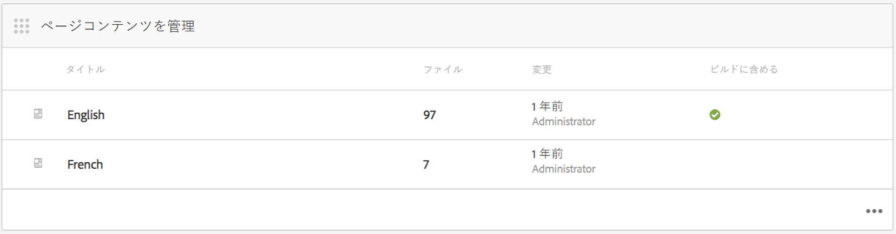
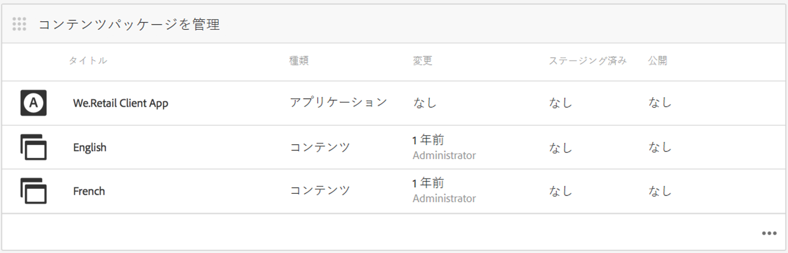
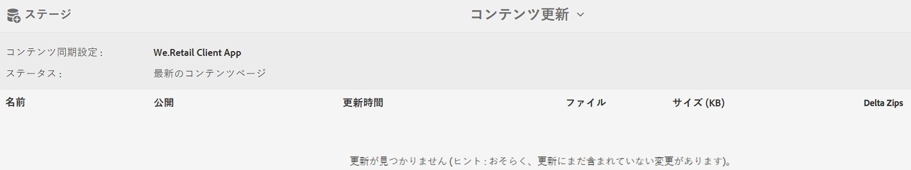
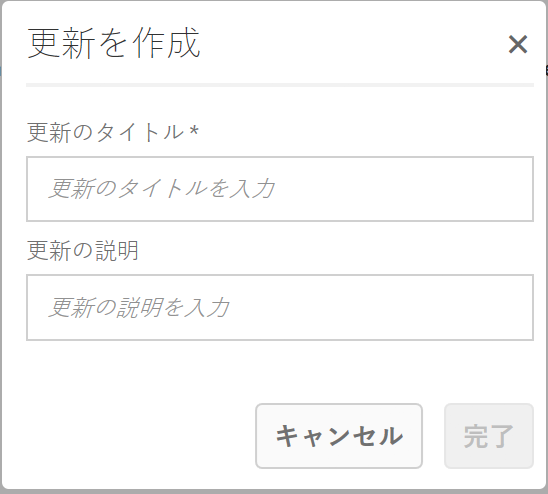
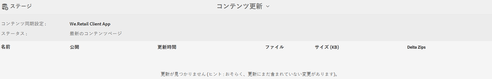
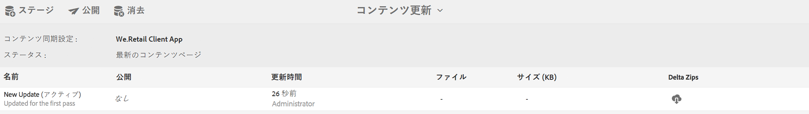

# アプリコンテンツの作成および管理{#creating-and-managing-app-content}

>[!NOTE]
>
>単一ページアプリケーションフレームワークを基にしたクライアント側レンダリング（React など）が必要なプロジェクトでは、SPA エディターを使用することをお勧めします。[詳細情報](/help/sites-developing/spa-overview.md)

アプリコンテンツを管理するには、[開発者](#developer)、コンテンツ[作成者](#author)および[管理者](#administrator)が連携して作業する必要があります。作成者は、アプリ開発者が生成したテンプレートおよびコンポーネントに基づいて、ページを操作します。

最後に、管理者が更新されたアプリコンテンツを戦略的に公開します。

>[!NOTE]
>
>**前提条件**：
>
>In [Deploying and Maintaining](/help/sites-deploying/deploy.md), developers became familiar with AEM&#39;s system of components and templates.

## ページコンテンツを管理タイル {#the-manage-page-content-tile}

>[!CAUTION]
>
>標準搭載のアプリテンプレートを使用していない場合は、新しいアプリコンテンツをOTAに公開できるようにするには、コンテンツ同期ハンドラーを設定する必要があります。
>
>See [Mobile with Content Sync](/help/mobile/phonegap-contentsync.md) in Developer&#39;s section for more details.

AEM Sites 内とほぼ同じ方法で、AEM Mobile でコンテンツを作成、編集および削除できます。

The **Manage Page Content tile** displays the number of pages of managed content and last modified for a particular payload. タイルの各レコードをクリックすることによって、コンテンツにドリルダウンしてページを作成、コピー、移動、削除および更新できます。

Once content has been updated, administrators can publish a content update payload Over-the-Air (OTA) to customers through the **Manage Content Packages tile.**

一覧表示されているコンテンツパッケージのいずれかを選択して、コンテンツを作成または編集し（ページの作成、編集または削除、ナビゲーションおよびページ順序の変更など）、コピー（テキスト）やメディアなどのコンテンツを作成または更新します。

すべてのものがコンテンツである&#x200B;**&#x200B;ことに注意してください。つまり、アプリケーションスタイル、コピー（テキスト）、メディア、ページ、ナビゲーションおよびコンテンツのターゲット設定を、すべて App Store に移動せずに OTA で編集および更新できます。

In order to edit AEM Mobile content, *AEM authors *will need a solid understanding of AEM&#39;s content editiing interface: [Authoring pages in AEM.](/help/sites-authoring/qg-page-authoring.md)

## コンテンツパッケージを管理タイル {#the-manage-content-packages-tile}

AEM 管理者&#x200B;**&#x200B;は、開発者や App Store 再送信を必要とせずに、アプリを迅速かつ簡単に更新し、魅力的なエクスペリエンスと最新のコンテンツを配信して、ブランドエンゲージメントを促進し、ビジネス目標を達成することができます。

Once *AEM Authors* have added or modified content through the Manage Content Tile, *AEM Administrators* are able to push those changes out to customers with a Content Packages update.

コンテンツパッケージアクションによって、AEM 作成者&#x200B;**&#x200B;はページコンテンツを作成および編集できます。一方で、開発チームは、ナビゲーション、スタイル、サーバー側ロジック、テンプレート、コンポーネントなどのホストアプリケーション設計および実装を変更して、配布のために様々なストアに再送信することなく、変更を利用者に OTA で公開できます。

**新しいコンテンツまたは更新したコンテンツを公開するには**

コンテンツパッケージをタイルから選択します（この例では English パッケージ）。Notice a content update dialog lists the relevant *Content Sync* configuration. If app content has been modified since a previous update, the status will display *Pending*, as shown below.

次に、右上にある「**ステージ**」アクションを選択し、新しいコンテンツ更新の作成中に設定します。適切な追加更新情報を入力し、「完了」を押します。

コンテンツ同期&#x200B;**&#x200B;ハンドラーにより、差分（変更内容のみ&#x200B;**&#x200B;のパッケージ）を形成することによって、必要なパッケージが作成されます。完了したら、このアップデートコンテンツパッケージは次のようにステージングされました。

コンテンツに対する更新のステージングによって、OTA でモバイルデバイスに公開する前に、複数の更新を行うことができます。

>[!NOTE]
>
>ステージングされたコンテンツは、公開前に AEM Verify アプリを使用して検証できます。
>
>See [Mobile Quickstart for AEM Verify](/help/mobile/phonegap-mobile-quickstart.md) for more details on AEM Verify app.

コンテンツ同期によって OTA で新しいコンテンツをアプリユーザーに配信する準備が整ったら、以下に示すように「**公開**」を選択します。

### 次の手順 {#the-next-steps}

アプリケーションダッシュボードでのアプリコンテンツの作成と管理について詳しくは、次の他のオーサリングロールのリソースを参照してください。

* [アプリを管理タイル](/help/mobile/phonegap-app-details-tile.md)
* [アプリのメタデータの編集](/help/mobile/phonegap-editmetadata.md)
* [アプリの定義](/help/mobile/phonegap-app-definitions.md)
* [アプリを作成ウィザードを使用した新規アプリの作成](/help/mobile/phonegap-create-new-app.md)
* [既存のハイブリッドアプリのインポート](/help/mobile/phonegap-adding-content-to-imported-app.md)

### その他のリソース {#additional-resources}

管理者および開発者の役割と責任について詳しくは、以下のリソースを参照してください。

* [AEM と Adobe PhoneGap Enterprise での開発](/help/mobile/developing-in-phonegap.md)
* [AEM での Adobe PhoneGap Enterprise のコンテンツの管理](/help/mobile/administer-phonegap.md)
