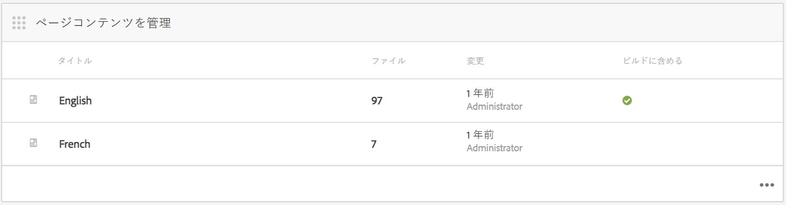
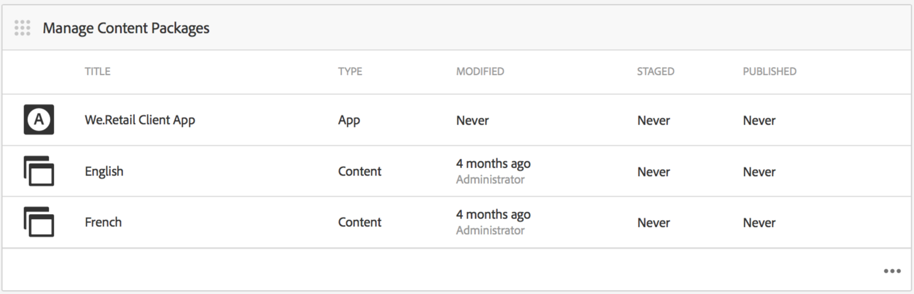
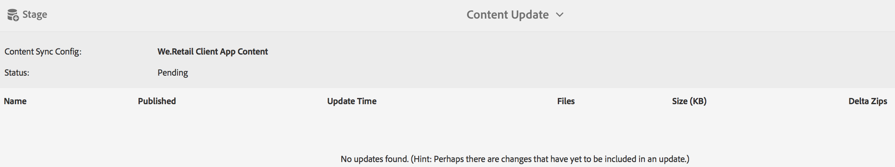
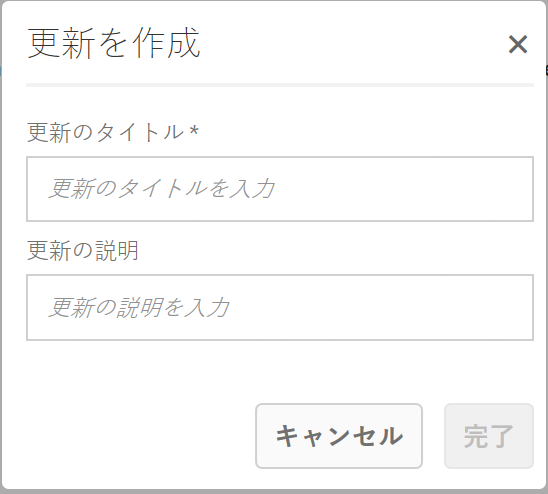
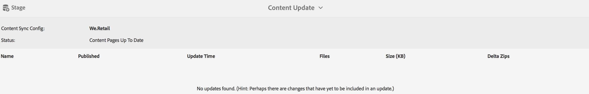
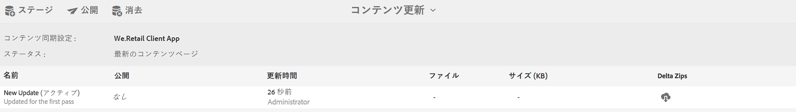

# アプリコンテンツの作成および管理{#creating-and-managing-app-content}

{{ue-over-mobile}}

アプリコンテンツの管理には、[開発者](#developer)、コンテンツ [作成者](#author)、および[管理者](#administrator)の共同作業が必要です。 作成者は、アプリ開発者によって生成されたテンプレートとコンポーネントに基づいてページを操作します。

最後に、管理者は更新されたアプリコンテンツを戦略的に公開します。

>[!NOTE]
>
>**前提条件**:
>
>[&#x200B; デプロイとメンテナンス &#x200B;](/help/sites-deploying/deploy.md)で、開発者はAdobe Experience Manager（AEM）のシステム コンポーネントとテンプレートに慣れました。

## ページコンテンツを管理タイルを使用すると {#the-manage-page-content-tile}

>[!CAUTION]
>
>すぐに使えるアプリテンプレートを使用していない場合、新しいアプリコンテンツをOTAで公開できるようにするには、コンテンツ同期ハンドラーを設定する必要があります。
>
>詳しくは、開発者の節の「[&#x200B; コンテンツ同期を使用したモバイル &#x200B;](/help/mobile/phonegap-contentsync.md)」を参照してください。

ここでは、AEM Sitesと同様に、AEM Mobileでもコンテンツを作成、編集、削除できます。

**ページコンテンツの管理タイル**&#x200B;には、特定のペイロードに対して管理されたコンテンツと最後に変更されたコンテンツのページ数が表示されます。 コンテンツをドリルダウンして、タイルの各レコードをクリックすることで、ページを作成、コピー、移動、削除、更新できます。

コンテンツが更新されると、管理者は、**コンテンツパッケージの管理タイル**&#x200B;を介して、コンテンツ更新ペイロードのOver-the-Air （OTA）を顧客に公開できます。

リストされているコンテンツパッケージのいずれかを選択して、ページの作成、編集、削除、ナビゲーションとページの順序の変更、コピー（テキスト）やメディアなどのコンテンツの作成や更新などのコンテンツを作成または編集します。

注意&#x200B;*すべてがコンテンツ*&#x200B;です。つまり、アプリケーションスタイル、コピー（テキスト）、メディア、ページ、ナビゲーション、コンテンツのターゲティングはすべて、アプリストアに行かなくても、OTAで編集および更新できます。

AEM Mobile コンテンツを編集するには、*AEM オーサー*は、AEMのコンテンツ編集インターフェイスについて十分に理解している必要があります。[AEMでのページのオーサリング &#x200B;](/help/sites-authoring/qg-page-authoring.md)

## 「コンテンツパッケージを管理」タイル {#the-manage-content-packages-tile}

ここでは、*AEM管理者*&#x200B;が、開発者やアプリストアの再提出を必要とせずに、魅力的なエクスペリエンスを提供し、最新のコンテンツを提供してブランドエンゲージメントを促進し、ビジネス目標を達成するために、アプリをすばやく簡単に更新できます。

*AEM作成者*&#x200B;がコンテンツタイル管理を通じてコンテンツを追加または変更すると、*AEM管理者*&#x200B;は、コンテンツパッケージの更新を行って、これらの変更を顧客にプッシュできます。

コンテンツパッケージアクションを使用すると、*AEM オーサー*&#x200B;がページコンテンツを作成および編集できます。開発部門は、ナビゲーション、スタイル、サーバーサイドのロジック、テンプレート、コンポーネントなどのホストアプリケーションの設計および実装に変更を加え、それらの変更を配布のために様々なストアに再送信することなく、OTAをお客様にプッシュします。

**新しいコンテンツまたは更新されたコンテンツを公開するには**

タイルからコンテンツパッケージ（この例では英語パッケージ）を選択します。 コンテンツ更新ダイアログボックスに、関連する&#x200B;*コンテンツ同期*&#x200B;設定が一覧表示されていることに注意してください。 アプリのコンテンツが前回のアップデート以降に変更された場合、次に示すように、ステータスは&#x200B;*保留中*&#x200B;と表示されます。

次に、コンテンツの更新を作成する右上の&#x200B;**ステージ** アクションを選択します。 適切な更新情報を追加し、「完了」を押します。

次に、*コンテンツ同期* ハンドラーは、差分（変更された&#x200B;*のみ*&#x200B;のパッケージ）を形成して、必要なパッケージを作成します。 完了すると、この更新コンテンツパッケージは次のようにステージングされます。

コンテンツの更新をステージングすると、OTAに公開する前に、いくつかの更新をモバイルデバイスに行うことができます。

>[!NOTE]
>
>ステージングされたコンテンツは、公開前にAEM Verify アプリを使用して検証できます。
>
>AEM Verify アプリについて詳しくは、[AEM Verifyのモバイルクイックスタート &#x200B;](/help/mobile/phonegap-mobile-quickstart.md)を参照してください。

コンテンツ同期OTAを使用してアプリユーザーに新しいコンテンツを配信する準備ができたら、以下に示すように&#x200B;**公開**&#x200B;を選択します。

### 次の手順 {#the-next-steps}

アプリケーションダッシュボードでのアプリコンテンツの作成と管理について理解したら、他のオーサリング役割に関する次のリソースを参照してください。

* [アプリを管理タイル](/help/mobile/phonegap-app-details-tile.md)
* [アプリのメタデータの編集](/help/mobile/phonegap-editmetadata.md)
* [アプリ定義](/help/mobile/phonegap-app-definitions.md)
* [アプリ作成ウィザードを使用した新しいアプリの作成](/help/mobile/phonegap-create-new-app.md)
* [既存のハイブリッドアプリの読み込み](/help/mobile/phonegap-adding-content-to-imported-app.md)

### その他のリソース {#additional-resources}

管理者と開発者の役割と責任について詳しくは、以下のリソースを参照してください。

* [AEMを使用したAdobe PhoneGap Enterpriseの開発](/help/mobile/developing-in-phonegap.md)
* [AEM を使用した Adobe PhoneGap Enterprise のコンテンツの管理](/help/mobile/administer-phonegap.md)
