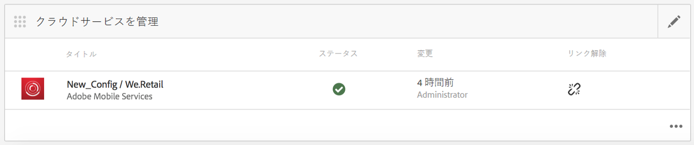
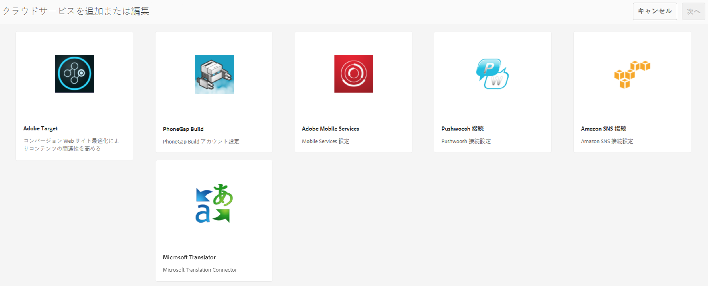
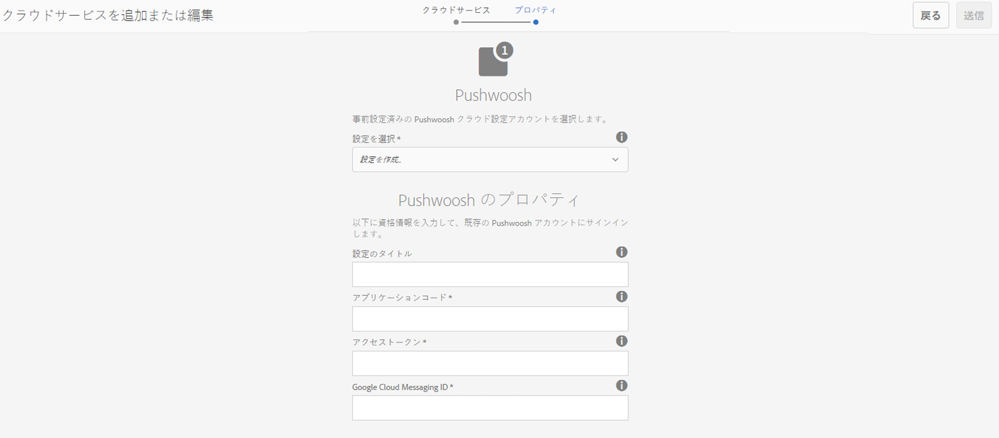
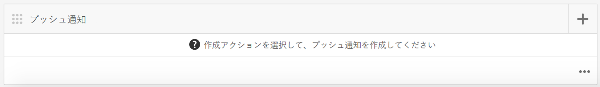
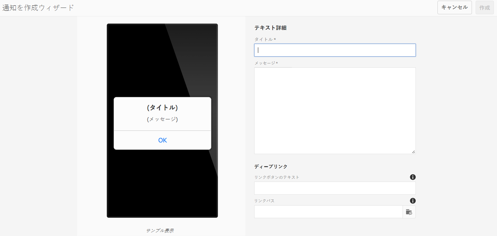
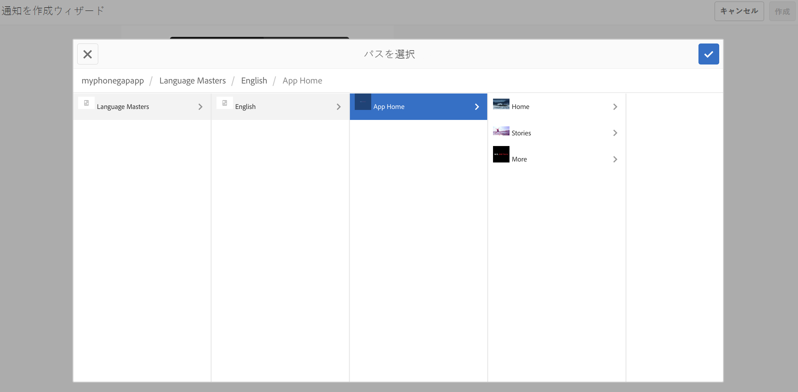
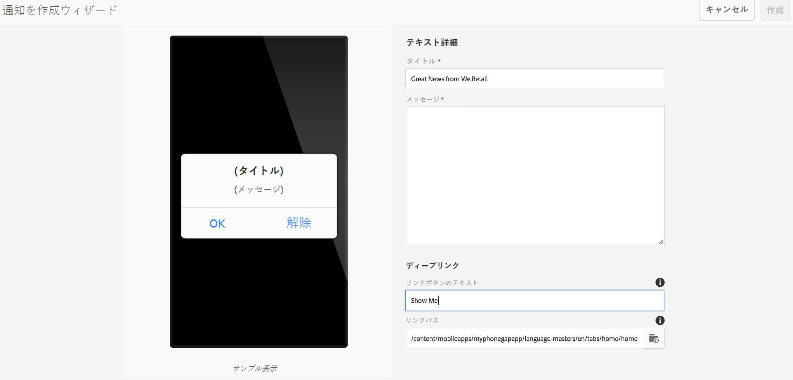
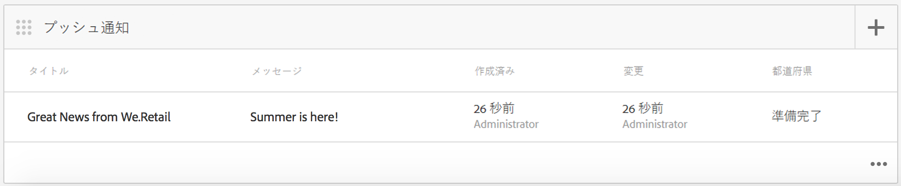

# プッシュ通知{#push-notifications}

>[!NOTE]
>
>単一ページアプリケーションフレームワークを基にしたクライアント側レンダリング（React など）が必要なプロジェクトでは、SPA エディターを使用することをお勧めします。[詳細情報](/help/sites-developing/spa-overview.md)を参照してください。

重要な通知を AEM Mobile アプリユーザーに即座に警告できることは、モバイルアプリとそのマーケティングキャンペーンの価値にとって重要です。ここでは、アプリがプッシュ通知を受信できるようにするために必要な手順と、AEM Mobileから携帯電話にインストールされたアプリにプッシュを設定して送信する方法について説明します。 また、プッシュ通知に[ディープリンク](#deeplinking)機能を設定する方法についても説明します。

>[!NOTE]
>
>プッシュ通知は保証型配信ではありません。むしろお知らせに近いものです。全ユーザーがプッシュ通知を受信するように最大限の努力が払われていますが、保証型配信メカニズムではありません。*また、プッシュを配信する時間は、1秒未満から最大30分までと異なる場合があります。*

AEM でプッシュ通知を使用するには、さまざまなテクノロジーがいくつか必要になります。まず、プッシュ通知サービスプロバイダーを使用して、通知とデバイスを管理する必要があります(AEMでは、まだおこなっていません)。 AEMでは、次の2つのプロバイダーが標準で設定されます。[Amazon Simple Notification Service](https://aws.amazon.com/sns/)（またはSNS）と[Pushwoosh](https://www.pushwoosh.com/)。 次に、指定したモバイル OS 向けのプッシュテクノロジーは、適切なサービスである Apple のプッシュ通知サービス（APNS。iOS デバイス用）、Google Cloud Messaging（GCM。Android デバイス用）を経由する必要があります。AEMは、これらのプラットフォーム固有のサービスと直接通信しませんが、これらのサービスがプッシュを実行するには、AEMが通知と共に一部の関連設定情報を提供する必要があります。

インストールおよび設定（下記）が完了すると、次のように機能します。

1. プッシュ通知が AEM に作成されて、サービスプロバイダー（Amazon SNS または Pushwoosh）に送信されます。
1. サービスプロバイダーが、プッシュ通知を受信してコアプロバイダー（APNS または GCM）に送信します。
1. コアプロバイダーが、プッシュ通知を受け取るように登録されているすべてのデバイスに通知をプッシュします。各デバイスでは、携帯電話データネットワークまたはWiFiを使用します（デバイスで現在使用可能な方を選択）。
1. 通知用に登録されているアプリが実行中でない場合、通知はデバイスに表示されます。ユーザーが通知をタップすると、アプリが起動し、アプリ内に通知が表示されます。 アプリケーションが既に実行されている場合は、アプリ内通知のみが表示されます。

AEM のこのリリースでは、iOS と Android のモバイルデバイスをサポートしています。

## 概要および手順  {#overview-and-procedure}

AEM Mobile アプリでプッシュ通知を使用するには、次のおおまかな手順を実行する必要があります。

通常、AEM開発者は次の操作をおこないます。

1. Apple および Google メッセージングサービスに登録します。
1. プッシュメッセージングサービスに登録して設定します。
1. アプリにプッシュサポートを追加します。
1. テスト用に電話を準備します。

AEM管理者は次の操作を実行します。

1. AEM アプリでのプッシュの設定
1. アプリのビルドおよびデプロイ
1. プッシュ通知の送信
1. ディープリンクの設定（オプション）**

### 手順 1：Apple および Google メッセージングサービスへの登録  {#step-register-with-apple-and-google-messaging-services}

#### Apple Push Notification Service(APNS)の使用{#using-the-apple-push-notification-service-apns}

Appleのページ[ここ](https://developer.apple.com/library/ios/documentation/NetworkingInternet/Conceptual/RemoteNotificationsPG/Chapters/ApplePushService.html)に移動して、Appleプッシュ通知サービスに慣れてください。

APNSを使用するには、Appleの&#x200B;**証明書**&#x200B;ファイル（.cerファイル）、プッシュ&#x200B;**秘密鍵**（.p12ファイル）、**秘密鍵のパスワード**&#x200B;が必要です。 その方法に関する説明は、[ここ](https://developer.apple.com/library/ios/documentation/NetworkingInternet/Conceptual/RemoteNotificationsPG/Chapters/ProvisioningDevelopment.html)にあります。

#### Google Cloud Messaging（GCM）サービスの使用 {#using-the-google-cloud-messaging-gcm-service}

>[!NOTE]
>
>Google は、GCM を Firebase Cloud Messaging（FCM）という類似のサービスに置き換えます。FCM について詳しくは、[こちら](https://developers.google.com/cloud-messaging/faq)を参照してください。

Googleページ[here](https://developer.android.com/google/gcm/index.html)に移動して、Android向けのGoogle Cloud Messagingに慣れてください。

[ここ](https://developer.android.com/google/gcm/gs.html)から&#x200B;**Google APIプロジェクトを作成する**、**GCMサービスを有効にする**、**APIキーを取得**&#x200B;する手順に従う必要があります。 Android デバイスにプッシュ通知を送信するには、**API キー**&#x200B;が必要になります。また、**プロジェクト番号**&#x200B;を記録します。この番号は、**GCM送信者ID**&#x200B;とも呼ばれます。

以下に、GCM API キーを作成する別の方法を示します。

1. googleにログインし、[GoogleのDeveloperページ](https://developers.google.com/mobile/add?platform=android&amp;cntapi=gcm)に移動します。
1. リストからアプリを選択します（または新しいアプリを作成します）。
1. 「Androidパッケージ名」に、アプリのID(`com.adobe.cq.mobile.weretail.outdoorsapp`. （うまくいかない場合は、「test.test」を再試行してください）。
1. 「**Continue To Choose and configure services**」をクリックします。
1. 「Cloud Messaging」を選択し、「**Enable Google Cloud Messaging**」をクリックします。
1. 新しいサーバー API キー（「Server API Key」）と（新規または既存の）送信者 ID（「Sender ID」）が表示されます。

>[!NOTE]
>
>サーバー API キーを記録します。この値は、プッシュプロバイダーのサイトで入力します。

### 手順 2：プッシュメッセージングサービスの登録および設定  {#step-register-and-configure-a-push-messaging-service}

AEM は、プッシュ通知に 3 つのサービスのうちいずれかを使用するように設定されています。

* Amazon SNS
* Pushwoosh
* Adobe Mobile Services

Amazon SNS ** および Pushwoosh ** の設定を使用すると、AEM 画面内からプッシュ通知を送信できます。

Adobe Mobile Services ** の設定を使用すると、Adobe Analytics アカウントを使用して Adobe Mobile Services 内からプッシュ通知を設定および送信できます（ただし、AMS プッシュ通知を有効にするには、この設定をおこなってアプリをビルドする必要があります）。

#### Amazon SNS メッセージングサービスの使用  {#using-the-amazon-sns-messaging-service}

>[!NOTE]
>
>*Amazon SNSに関する情報と、新しいAWSアカウントを作成するためのリンクは、こちらを参照し [てください](https://aws.amazon.com/sns/)。1 年間無料のアカウントを入手できます。*

Amazon SNS を使用しない場合には、この手順をスキップできます。

次の手順に従って、プッシュ通知用に Amazon SNS を設定します。

1. **Amazon SNS への登録**

   1. アカウント ID を記録します。形式は、スペースやダッシュを含まない12桁である必要があります。&quot;123456789012&quot;。
   1. 現在の地域が「us-east」または「eu」であることを確認します。後の手順（ID プールの作成）でそのどちらかが必要になるからです。
   1. 登録後、管理コンソールにログインし、[SNS](https://console.aws.amazon.com/sns/)（プッシュ通知サービス）を選択します。 「Get Started」が表示されたらクリックします。

1. **アクセスキーおよび ID の作成**

   1. 画面右上のログイン名をクリックし、メニューから「Security Credentials」を選択します。
   1. 「アクセスキー」をクリックし、下のスペースで「**新しいアクセスキーを作成**」をクリックします。
   1. 「**アクセスキーを表示**」をクリックし、表示されたアクセスキーIDと秘密アクセスキーをコピーして保存します。 キーをダウンロードするオプションを選択した場合には、ダウンロードした csv ファイルにそれらと同じ値が記載されています。
   1. このページでは、他のセキュリティ関連の証明書などを管理できます。

   >[!NOTE]
   >
   >アクセスキーは、複数のアプリで使用できます。

   「AWS サンドボックス」アカウントを使用する組織でも、同様に以下の手順に従います。

   1. 画面右上のログイン名をクリックし、メニューから「My Security Credentials」を選択します。
   1. 左側のアクションのリストから「Users」をクリックして、ユーザー名を選択します。
   1. 「Security credentials」タブをクリックします。
   1. ここからキーを表示し、新規のキーを作成します。後で使用するためにキーを保存します。

1. **トピックの作成**

   1. 「**Create Topic**」をクリックし、トピック名を選択します。「Topic ARN」、「Topic Owner」、「Region」、「Display name」などすべてのフィールドを記録します。
   1. **その他のトピックアクション** / **トピックポリシーを編集**&#x200B;をクリックします。 「**Allow these users to subscribe to this topic**」で、「**Everyone.**」を選択します。
   1. 「**Update Policy**」をクリックします。

   >[!NOTE]
   >
   >開発、テスト、デモなどの、様々なシナリオに合わせて複数のトピックを作成できます。残りのSNS構成は同じままにできます。 別のトピックでアプリを構築します。そのトピックに送信されるプッシュ通知は、そのトピックで作成されたアプリでのみ受信されます。

1. **プラットフォームアプリケーションの作成**

   1. Applications／Create Platform Application をクリックします。名前を選択し、プラットフォーム（iOS の場合は APNS、Android の場合は GCM）を選択します。プラットフォームに応じて、他のフィールドにも入力する必要があります。

      1. APNS の場合、P12 ファイル、パスワード、証明書および秘密鍵をすべて入力する必要があります。これらは、上記の手順&#x200B;*Apple Push Notification Service(APNS)*&#x200B;の使用で取得されたはずです。
      1. GCM の場合、API キーを入力する必要があります。これは、上記の手順&#x200B;*Google Cloud Messaging(GCM)サービスの使用*&#x200B;で入手済みです。
   1. サポート対象のプラットフォームごとに 1 回、上述の手順を繰り返します。iOS と Android の両方にプッシュできるようにするには、2 つのプラットフォームアプリケーションを作成する必要があります。

1. **ID プールの作成**

   1. [Cognito](https://console.aws.amazon.com/cognito)を使用して、IDプールを作成し、未認証ユーザーの基本データを保存します。 現在、Amazon Cognitoでは「us-east」および「eu」リージョンのみがサポートされています。
   1. ID プールに名前を付け、「Enable access to unauthenticated identities」ボックスをオンにします。
   1. 次のページ（Your Cognito identities require access to your resources **）で、「Allow」をクリックします。
   1. ページの右上で、「Edit identity pool」リンクをクリックします。** IDプールIDが表示されます。 後で使用するために、このテキストを保存します。
   1. 同じページで、「Unauthenticated role」の隣にあるドロップダウンを選択し、「Cognito_&lt;プール名>UnauthRole」という役割が選択されていることを確認します。変更を保存します。

1. **アクセスの設定**

   1. [IDとアクセスの管理](https://console.aws.amazon.com/iam/home) (IAM)にログインします。
   1. 「Roles」を選択します。
   1. 前の手順で作成した役割（Cognito_&lt;ID プール名>Unauth_Role という名前）をクリックします。表示された「ロールARN」を記録します。
   1. 「Inline Policies」をまだ開いていない場合は開きます。1Click_Cognito_&lt;yourIdentityPoolName>Unauth_Role_1234567890123のような名前のポリシーが表示されます。
   1. 「Edit Policy」をクリックします。ポリシードキュメントの内容をJSONの次のスニペットに置き換えます。

   <table>
    <tbody>
     <tr>
     <td>
 
 
{
 
 "Version":"2012-10-17"
 
 "Statement": [
 
 {
 
 "動作": [
 
 "mobileanalytics:PutEvents",
 
 "cognito-sync:*",
 
 "SNS:CreatePlatformEndpoint",
 
 "SNS:Subscribe"
 
 ]
 
 "Effect":「許可」
 
 "リソース": [
 
 "*"
 
 ]
 
 }
 
 ]
 
}
 
 
 </td>
     </tr>
    </tbody>
    </table>

   1. 「**Apply Policy**」をクリックします。

#### Pushwoosh メッセージングサービスの使用 {#using-the-pushwoosh-messaging-service}

Pushwoosh を使用しない場合には、この手順をスキップできます。

Pushwoosh を使用するには：

1. **Pushwoosh への登録**

   1. pushwoosh.com に移動し、新しいアカウントを作成します。

1. **API アクセストークンの作成**

   1. Pushwooshサイトで、APIアクセスメニュー項目に移動して、APIアクセストークンを生成します。 これは安全に記録する必要があります。

1. **新しいアプリを作成**

   1. Android をサポートする場合には、GCM API キーを指定する必要があります。
   1. アプリを設定するときには、フレームワークとして Cordova を選択します。
   1. iOS をサポートする場合には、証明書ファイル（.cer）、プッシュ証明書（.p12）および秘密鍵のパスワードを指定する必要があります。これらは、Apple の APNS サイトから入手済みです。「フレームワーク」で、「Cordova」を選択します。
   1. Pushwoosh が、そのアプリのアプリ ID を「XXXXX-XXXXX」という形式で生成します。各 X は 16 進数値（0 ～ F）です。

>[!NOTE]
>
>*2つ目のアプリが同じアプリID（およびその他の関連値）を持つAEMで設定されている場合：APIアクセストークンおよびGCM ID)、AEM上の2番目のアプリを介して送信されたプッシュ通知は、そのアプリIDを持つ他のアプリに送信されます。*

### 手順 3：アプリへのプッシュサポートの追加 {#step-add-push-support-to-the-app}

#### コンテンツ同期設定の追加 {#add-contentsync-configuration}

notificationsConfig という 2 つのコンテンツノードを（1 つは app-config に、もう 1 つは app-config-dev に）作成します。

* /content/`<your app>`/shell/jcr:content/pge-app/app-config-dev/notificationsConfig
* /content/`<your app>`/shell/jcr:content/pge-app/app-config/notificationsConfig

次のプロパティ（.content.xmlファイル）を使用する場合：
&lt;jcr:root xmlns:jcr=&quot; [https://www.jcp.org/jcr/1.0](https://www.jcp.org/jcr/1.0)&quot; xmlns:nt=&quot; [https://www.jcp.org/jcr/nt/1.0](https://www.jcp.org/jcr/nt/1.0)&quot;
jcr:primaryType=&quot;nt:unstructured&quot;
excludeProperties=&quot;[appAPIAccessToken]&quot;
path=&quot;../../../...&quot;
targetRootDirectory=&quot;www&quot;
type=&quot;notificationsconfig&quot;/>

>[!NOTE]
>
>コンテンツ同期ハンドラーは、これらのノードを検索し、ノードがなければ pge-notifications-config.json ファイルを書き出しません。

#### クライアントライブラリの追加 {#add-client-libraries}

次の手順に従って、プッシュ通知クライアントライブラリをアプリに追加する必要があります。

CRXDE Lite で以下の手順に従います。

1. */etc/designs/phonegap/&lt;app name>/clientlibsall.*&#x200B;に移動します。
1. プロパティペインで「埋め込み」セクションをダブルクリックします。
1. 表示されるダイアログで、+ ボタンをクリックして新規クライアントライブラリを追加します。
1. 新規テキストフィールドで、「cq.mobile.push」を追加し、「OK」をクリックします。
1. もう 1 つ「cq.mobile.push.amazon」というエントリを追加し、「OK」をクリックします。
1. 変更内容を保存します。

>[!NOTE]
>
>アプリのスペースの都合で、プッシュ通知を削除したか、使用していない場合は、コンソールのエラーメッセージを避けるために、これらのクライアントライブラリをアプリから削除します。

### 手順 4：テスト用の電話の準備  {#step-prepare-a-phone-for-testing}

>[!NOTE]
>
>*プッシュ通知の場合、エミュレーターはプッシュ通知を受信できないので、実際のデバイスでテストする必要があります。*

#### iOS {#ios}

iOSの場合は、Mac OSコンピュータを使用し、[iOS Developer Program](https://developer.apple.com/programs/ios/)に参加する必要があります。 一部の企業は、すべての開発者が利用できる企業ライセンスを持っています。

XCode 8.1 では、プッシュ通知を使用する前に、プロジェクトの「Capabilities」タブに移動し、「Push Notifications」のトグルをオンに切り替える必要があります。

#### Android {#android}

CLIを使用してAndroidスマートフォンにアプリをインストールするには（以下を参照）**手順6 — アプリをビルドしてデプロイする**)、まず電話を「開発者モード」にする必要があります。 この方法について詳しくは、[デバイス上の開発者向けオプション](https://developer.android.com/tools/device.html#developer-device-options)の有効化を参照してください。

### 手順 5：AEM アプリでのプッシュの設定 {#step-configure-push-on-aem-apps}

ビルドして設定済みのモバイルデバイスにデプロイする前に、使用するメッセージングサービス用に通知設定をおこなう必要があります。

1. プッシュ通知に適切な認証グループを作成します。
1. 適切なユーザーとして AEM にログインし、「アプリ」タブをクリックします。
1. 「アプリケーション」をクリックします。
1. クラウドサービスを管理タイルを検索し、鉛筆をクリックして、クラウド設定を変更します。
1. 通知設定として、「Amazon SNS 接続」、「Pushwoosh 接続」または「Adobe Mobile Services」を選択します。
1. プロバイダーのプロパティを入力し、「送信」をクリックして保存し、「完了」をクリックします。この段階では、AMSの場合を除き、リモートでは検証されません。
1. クラウドサービスを管理タイルに、入力した設定が表示されます。

### 手順 6：アプリのビルドおよびデプロイ  {#step-build-and-deploy-the-app}

**注意：** PhoneGapアプリケーションの構築に関するアドビの  指示も参照してください。

PhoneGap を使用してアプリをビルドしてデプロイするには、2 つの方法があります。

**注意：** プッシュ通知のテストの場合、エミュレーターでは十分ではありません。プッシュ通知は、プッシュプロバイダー（AppleまたはGoogle）とデバイスの間で異なるプロトコルを使用するからです。現在の Mac／PC ハードウェアおよびエミュレーターは、これをサポートしていません。

1. *PhoneGap Build* は、PhoneGapが提供するサービスで、サーバー上でアプリを構築し、デバイスに直接ダウンロードできます。PhoneGap Buildの設定方法と使用方法については、[PhoneGap Buildのドキュメント](https://build.phonegap.com/)を参照してください。

1. *PhoneGapコマンドラインインターフェイス* (CLI)を使用すると、コマンドラインで豊富なPhoneGapコマンドセットを使用して、アプリを構築、デバッグ、デプロイできます。PhoneGap CLIの設定および使用方法については、[PhoneGap開発者向けドキュメント](https://docs.phonegap.com/en/edge/guide_cli_index.md.html#The%20Command-Line%20Interface)を参照してください。

### 手順 7：プッシュ通知の送信 {#step-send-a-push-notification}

新規通知を作成して送信するには、次の手順に従います。

1. 新規通知の作成

   * AEM Mobile アプリのダッシュボードで、プッシュ通知タイルを探します。
   * 右上のメニューで、「作成」を選択します。このボタンは、クラウド設定が最初に設定されるまでは使用できません。
   * 通知を作成ウィザードで、タイトルおよびメッセージに入力し、「作成」ボタンをクリックします。これで、通知をすぐに送信するか、後で送信する準備が整いました。 メッセージやタイトルを編集したり、変更して保存したりできます。

1. 通知の送信

   * アプリダッシュボードで、プッシュ通知タイルを探します。
   * 通知を選択するか、右下の「詳細」ボタン( )をクリックします。.)をクリックして、通知のリストを表示します。 このリストは、通知の送信準備ができたか、既に送信されたか、送信中にエラーが発生したかを示します。
   * 1 つの通知（のみ）のチェックボックスを選択し、リストの上方にある「通知を送信」ボタンをクリックします。表示されるダイアログで、「キャンセル」または「送信」の通知を1回確認できます。

1. 結果の処理

   * プッシュ通知サービス（Amazon SNS または Pushwoosh）が送信要求を受信し、要求が有効であることを確認してネイティブのプロバイダー（APNS および GCM）に正常に送信した場合には、送信ダイアログがメッセージなしで閉じます。通知リストには、その通知のステータスが「送信済み」と表示されます。
   * プッシュ送信が失敗した場合、ダイアログには問題の発生を示すメッセージが表示されます。通知リストには、その通知のステータスが「エラー」と表示されますが、問題が修正された場合は、通知を再度送信できます。 エラーが発生した場合は、追加のエラー情報がサーバーエラーログに表示されます。
   * iOS と Android のプッシュ通知には、プラットフォームの違いがいくつかあります。その中には

      * CLI によるビルドでアプリが起動するのは、アプリを Android にデプロイした後です。iOSでは、手動で起動する必要があります。 プッシュ登録手順は起動時に発生するので、iOSアプリは起動および登録されているので、Androidアプリはすぐにプッシュ通知を受け取ることができます。
      * Android では「OK」ボタンのテキストはすべて大文字です（アプリ内通知で追加されたその他のボタンも大文字です）が、iOS ではそうではありません。

AMS プッシュ通知では、AMS サーバーから通知を作成し、送信する必要があります。AMSは、AWSおよびPushwooshを使用したAEM通知で提供される機能以外にも、追加のプッシュ通知機能を提供します。

>[!NOTE]
>
>プッシュ通知は保証型配信ではありません。むしろお知らせに近いものです。全ユーザーがプッシュ通知を受信するように最大限の努力が払われていますが、保証型配信メカニズムではありません。*また、プッシュを配信する時間は、1秒未満から最大30分までと異なる場合があります。*

### プッシュ通知でのディープリンクの設定 {#configuring-deep-linking-with-push-notifications}

ディープリンクとはプッシュ通知のコンテキストでは、アプリを開く、またはアプリ内の指定した場所に（開いている場合に）誘導することを許可する手段です。

では、これはどのように機能するでしょうか。プッシュ通知の作成者は、視覚的なパスブラウザーを利用して、オプションで通知にボタンラベル（「Show me!」など）を追加したり、通知内にリンクを記載するページを選択したりできます。送信すると、プッシュが通常どおりに発生しますが、アプリ内メッセージでは「OK」ボタンが「解除」ボタンに置き換えられ、指定した新しいボタン（「Show me!」）も表示される点が異なります。新しいボタンをクリックすると、アプリがアプリ内の指定されたページに移動します。 「解除」をクリックすると、単にメッセージが消去されます。

アプリが開かれていない場合は、シェードが通常どおりに表示されます。日陰で通知に対してアクションを実行すると、アプリが開き、プッシュ通知で設定した内容に基づいてユーザーにディープリンクボタンが表示されます。

通知を作成し、オプションのディープリンクのボタンテキストおよびリンクパスを追加します。

>[!CAUTION]
>
>ダッシュボードのプッシュ通知タイルにアクセスするには、以下の手順に従います。

1. **クラウドサービスを管理**&#x200B;タイルの右上隅の編集アイコンをクリックします。

   

1. 「**Pushwoosh 接続**」を選択します。「**次へ**」をクリックします。

   

1. プロパティの詳細を入力して、「**送信**」をクリックします。

   

   設定を送信すると、ダッシュボードに&#x200B;**プッシュ通知**&#x200B;タイルが表示されます。

   

### 通知を作成ウィザード {#create-notification-wizard}

ダッシュボードに&#x200B;**プッシュ通知**&#x200B;タイルが表示されたら、通知を作成ウィザードを使用してコンテンツを追加します。

1. **プッシュ通知**&#x200B;タイルの右上隅にある追加記号をクリックし、**通知を作成ウィザード**&#x200B;を表示します。

   

1. リンクパス内の参照アイコンをクリックすると、ユーザーにアプリのコンテンツ構造が表示されます。

   パスを選択したら、チェックアイコンをクリックします。

   

   >[!NOTE]
   >
   >リンクボタンのテキストは20文字に制限されています。
   >
   >エンドユーザーがアプリケーションの最新バージョンを持たず、リンクされたパスを使用できない場合、ディープリンクのアクションを確認すると、ユーザーはアプリのメインページに移動します。

1. **通知を作成ウィザード**&#x200B;の「**テキスト詳細**」に入力し、「**作成**」をクリックします。

   

   **プッシュ通知**&#x200B;タイルから、作成したプッシュ通知をクリックして、詳細を表示します。

   プロパティの編集、通知の送信、通知の削除をおこなえます。

   

>[!NOTE]
>
>**追加情報**:
>
>PushwooshおよびAmazon SNSは、6.4リリース以降はサポートされなくなり、パッケージ共有のアドオンとして使用できるようになります。

### 次の手順 {#the-next-steps}

アプリのプッシュ通知の詳細を理解したら、[AEM Mobile Content Personalization](/help/mobile/phonegap-aem-mobile-content-personalization.md)を参照してください。
