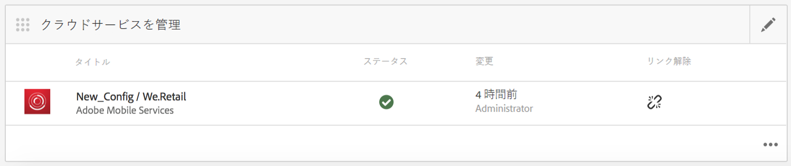
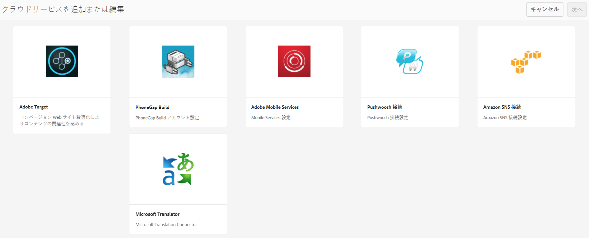
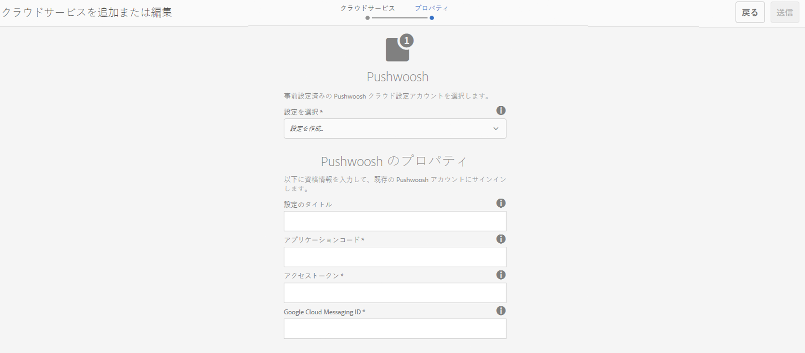
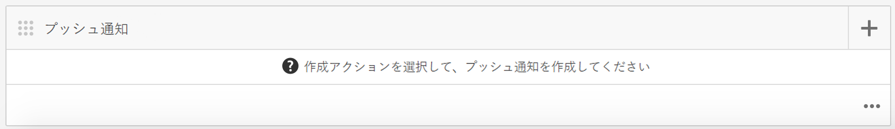
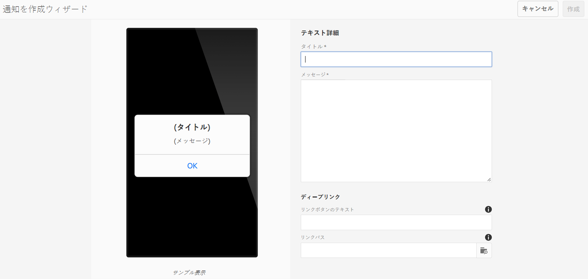
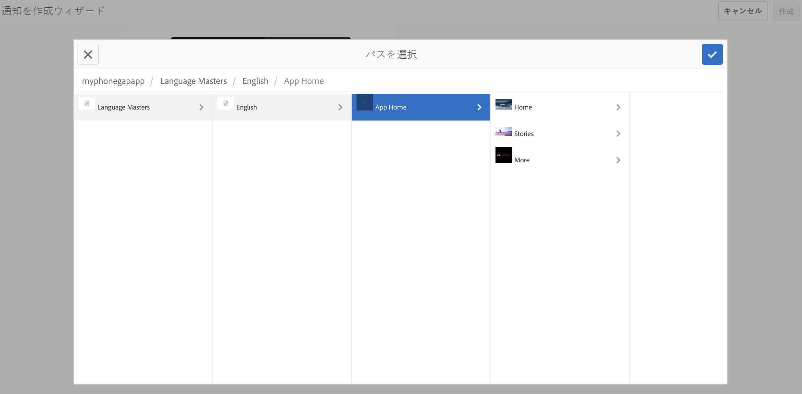
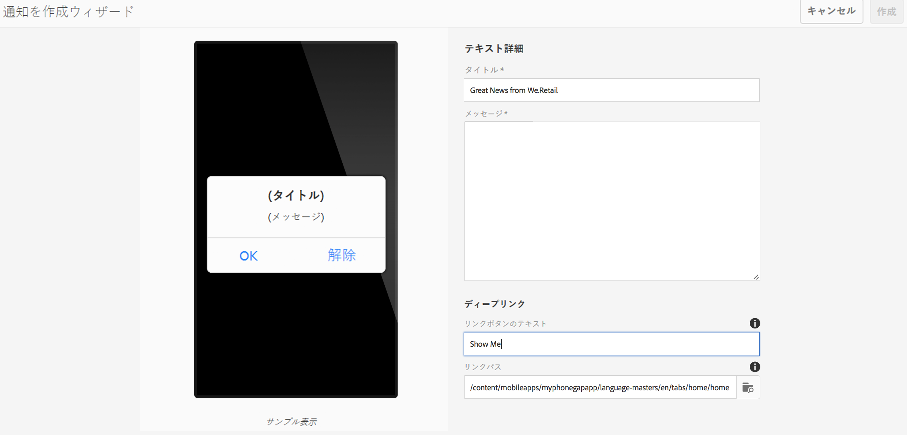
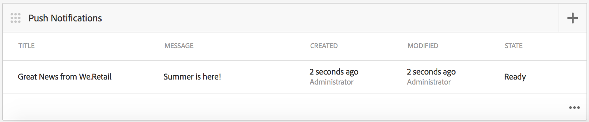

# プッシュ通知{#push-notifications}

{{ue-over-mobile}}

重要な通知をAdobe Experience Manager（AEM）モバイルアプリのユーザーにすばやく通知できるようにすることは、モバイルアプリとそのマーケティングキャンペーンの価値にとって非常に重要です。 ここでは、アプリがプッシュ通知を受信できるようにするために実行する必要がある手順について説明します。 また、AEM Mobileからスマートフォンにインストールされたアプリにプッシュを設定して送信する方法についても説明します。 また、この節では、プッシュ通知に[ ディープリンク ](#deeplinking)機能を設定する方法についても説明します。

>[!NOTE]
>
>*プッシュ通知は配信が保証されていません。通知に似ています。 最善の努力は、全員がそれらを受け取ることを確認しますが、保証された配信メカニズムではありません。 また、プッシュを配信する時間は、1秒未満から半時間まで変化する場合があります。*

AEMでプッシュ通知を使用するには、いくつかのテクノロジーが必要です。 まず、プッシュ通知サービスプロバイダーを使用して、通知とデバイスを管理する必要があります（AEMはまだこれを行っていません）。 2つのプロバイダーが、AEMで[Amazon Simple Notification Service](https://aws.amazon.com/sns/) （またはSNS）と[Pushwoosh](https://www.pushwoosh.com/)をすぐに使用できるように設定されています。 次に、特定のモバイル OSのプッシュ通知テクノロジーは、適切なサービス（iOS デバイスの場合はAppleのプッシュ通知サービス（またはAPNS）、Android デバイスの場合はGoogle Cloud Messaging （またはGCM）™を経由する必要があります。 AEMは、これらのプラットフォーム固有のサービスと直接コミュニケーションすることはできませんが、プッシュを実行するためにこれらのサービスの通知と共に、AEMから関連する設定情報の一部を提供する必要があります。

インストールして設定すると（以下で説明するように）、次のように動作します。

1. プッシュ通知がAEMで作成され、サービスプロバイダー（Amazon SNSまたはPushwoosh）に送信されます。
1. サービスプロバイダーはそれを受信し、コアプロバイダー（APNSまたはGCM）に送信します。
1. コアプロバイダーは、そのプッシュに登録されているすべてのデバイスに通知をプッシュします。 各デバイスでは、デバイス上で利用可能なセルラーデータネットワークまたはWiFiを使用します。
1. 登録されているアプリが実行されていない場合、通知がデバイスに表示されます。 ユーザーが通知をタップすると、アプリが起動し、アプリ内に通知が表示されます。 アプリケーションが既に実行されている場合は、アプリ内通知のみが表示されます。

このリリースのAEMは、iOSとAndroid™のモバイルデバイスをサポートしています。

## 概要と手順 {#overview-and-procedure}

AEM Mobile アプリでプッシュ通知を使用するには、次の大まかな手順を実行する必要があります。

通常、Experience Manager開発者は次の操作を行います。

1. AppleおよびGoogle メッセージングサービスへの登録
1. プッシュメッセージングサービスに登録して設定する
1. アプリにプッシュサポートを追加する
1. テスト用の電話の準備

Experience Manager Administratorは次の操作を行います。

1. AEM アプリでのプッシュの設定
1. アプリのビルドとデプロイ
1. プッシュ通知を送信
1. ディープリンクの設定&#x200B;*（オプション）*

### 手順1:AppleおよびGoogle メッセージングサービスへの登録 {#step-register-with-apple-and-google-messaging-services}

#### Apple プッシュ通知サービス（APNS）の使用 {#using-the-apple-push-notification-service-apns}

Apple ページ [ここ](https://developer.apple.com/documentation/usernotifications#//apple_ref/doc/uid/TP40008194-CH8-SW1)に移動して、Apple プッシュ通知サービスに慣れましょう。

APNを使用するには、Appleから&#x200B;**証明書** ファイル（.cer ファイル）、プッシュ **秘密鍵** （.p12 ファイル）、および&#x200B;**秘密鍵パスワード**&#x200B;が必要です。 その方法に関する手順については、[こちら](https://developer.apple.com/library/archive/documentation/NetworkingInternet/Conceptual/RemoteNotificationsPG/)を参照してください。

#### Google Cloud Messaging （GCM）サービスの使用 {#using-the-google-cloud-messaging-gcm-service}

>[!NOTE]
>
>Googleは、GCMをFirebase Cloud Messaging （FCM）と呼ばれる同様のサービスに置き換えています。 FCMの詳細については、[こちら](https://firebase.google.com/docs/cloud-messaging/)をクリックしてください。

Google ページ [こちら](https://developer.android.com/google/gcm/index.html)に移動して、Android™向けGoogle Cloud Messagingに関する情報を入手してください。

[次の手順](https://developer.android.com/google/gcm/gs.html)から&#x200B;**Google API プロジェクトの作成**、**GCM サービスの有効化**、**API キーの取得**。 Android™ デバイスにプッシュ通知を送信するには、**API キー**&#x200B;が必要です。 また、**プロジェクト番号**&#x200B;を記録します。これは&#x200B;**GCM送信者ID**&#x200B;とも呼ばれます。

次の手順では、GCM API キーを作成する別の方法を示します。

1. Googleにログインし、[Google開発者向けページ ](https://developers.google.com/mobile/add?platform=android&cntapi=gcm)に移動します。
1. リストからアプリを選択します（またはアプリを作成します）。
1. Android™ パッケージ名の下に、アプリ ID （`com.adobe.cq.mobile.weretail.outdoorsapp`）を入力します。 （それが機能しない場合は、「test.test」でもう一度試してください）。
1. 「**続行してサービスを選択して設定する**」をクリックします
1. 「Cloud Messaging」を選択し、「**Google Cloud Messagingを有効にする**」をクリックします。
1. 新しいサーバーAPI キーと（新規または既存の）送信者IDが表示されます。

>[!NOTE]
>
>サーバーAPI キーを記録します。 この値は、プッシュプロバイダーのサイトに入力されます。

### 手順2：プッシュメッセージングサービスの登録と設定 {#step-register-and-configure-a-push-messaging-service}

AEMでは、プッシュ通知に3つのサービスのいずれかを使用するように設定されています。

* Amazon SNS
* Pushwoosh
* Adobe Mobile Services

*Amazon SNS*&#x200B;および&#x200B;*Pushwoosh*&#x200B;設定を使用すると、AEM画面内からプッシュを送信できます。

*Adobe Mobile Services*&#x200B;設定では、Adobe Analytics アカウントを使用してAdobe Mobile Services内からプッシュ通知を設定および送信できます（ただし、AMS プッシュ通知を有効にするには、この設定を使用してアプリを構築する必要があります）。

#### Amazon SNS メッセージングサービスの使用 {#using-the-amazon-sns-messaging-service}

>[!NOTE]
>
>*Amazon SNSに関する情報と、AWS アカウントを作成するためのリンクは、[ここ](https://aws.amazon.com/sns/)にあります。 1年間の無料アカウントを取得できます。*

Amazon SNSを使用しない場合は、これらの手順をスキップできます。

プッシュ通知用にAmazon SNSを設定するには、次の手順に従います。

1. **Amazon SNSに登録**

   1. アカウント IDを記録します。 形式は、スペースやダッシュのない12桁の数字、つまり「123456789012」にする必要があります。
   1. 後の手順（ID プールの作成）では、いずれかの手順が必要なので、「us-east」または「eu」リージョンであることを確認してください。
   1. 登録後、管理コンソールにログインし、[SNS](https://console.aws.amazon.com/sns/) （プッシュ通知サービス）を選択します。 表示された場合は、「開始」をクリックします。

1. **アクセスキーとIDを作成**

   1. 画面の右上にあるログイン名をクリックし、メニューから「セキュリティ認証情報」を選択します。
   1. 「アクセスキー」をクリックし、下のスペースで「**新しいアクセスキーを作成**」をクリックします。
   1. 「**アクセスキーを表示**」をクリックし、表示されているアクセスキーIDとシークレットアクセスキーをコピーして保存します。 キーをダウンロードするオプションを選択すると、同じ値を含むcsv ファイルが取得されます。
   1. その他のセキュリティ関連の証明書、およびその他の証明書は、このページで管理できます。

   >[!NOTE]
   >
   >アクセスキーは複数のアプリケーションに使用できます。

   「AWS サンドボックス」アカウントを使用する組織の場合は、次の手順に従い、手順を説明します。

   1. 画面の右上にあるログイン名をクリックし、メニューから「My Security Credentials」を選択します。
   1. アクションの左側のリストで「ユーザー」をクリックし、ユーザー名を選択します。
   1. 「セキュリティ認証情報」タブをクリックします。
   1. ここから、キーが表示され、新しいキーを作成します。 後で使用するためにキーを保存します。

1. **トピックの作成**

   1. 「**トピックを作成**」をクリックし、トピック名を選択します。 トピック ARN、トピック所有者、地域、表示名など、すべてのフィールドを記録します。
   1. **その他のトピックアクション** > **トピックポリシーの編集**&#x200B;をクリックします。 **これらのユーザーがこのトピックを購読することを許可する**&#x200B;で、**全員を選択します。**
   1. 「**ポリシーを更新**」をクリックします。

   >[!NOTE]
   >
   >開発、テスト、デモなど、様々なシナリオ用に複数のトピックを作成できます。 残りのSNS設定は同じままにできます。 別のトピックでアプリを構築します。そのトピックに送信されたプッシュ通知は、そのトピックで構築されたアプリによってのみ受信されます。

1. **プラットフォームアプリケーションの作成**

   1. 「アプリケーション」をクリックし、「プラットフォームアプリケーションを作成」をクリックします。 名前を選び、プラットフォーム（iOSのAPNS、AndroidのGCM™）を選びます。 ワークフローをカスタマイズできます。 その他のフィールドに入力する必要があります：

      1. APNSの場合は、P12 ファイル、パスワード、証明書、秘密鍵をすべて入力する必要があります。 これらは、上記の手順&#x200B;*Apple プッシュ通知サービス（APNS）の使用*&#x200B;で取得する必要があります。
      1. GCMの場合は、API キーを入力する必要があります。 これは、上記の手順&#x200B;*Google Cloud Messaging （GCM） サービスの使用*&#x200B;で取得する必要があります。

   1. サポートしている各プラットフォームについて、上記の手順を1回繰り返します。 IOSとAndroid™の両方にプッシュするには、2つのPlatform アプリケーションを作成する必要があります。

1. **ID プールの作成**

   1. [Cognito](https://console.aws.amazon.com/cognito)を使用して、未認証ユーザーの基本データを保存するID プールを作成します。 注意：現在、Amazon Cognitoでサポートされているのは、「us-east」および「eu」リージョンのみです。
   1. 名前を付け、「未認証IDへのアクセスを有効にする」チェックボックスをオンにします。
   1. 次のページ（「*Cognito IDにはリソースへのアクセスが必要です*」）で、「許可」をクリックします。
   1. ページの右上にある「*ID プールを編集」* リンクをクリックします。 ID プール IDが表示されます。 このテキストを後で使用するために保存します。
   1. 同じページで、「未認証の役割」の横にあるドロップダウンを選択し、Cognito_&lt; プール名>UnauthRoleが選択されていることを確認します。 変更を保存します。

1. **アクセスの設定**

   1. [Identity and Access Management](https://console.aws.amazon.com/iam/home) （IAM）にログインします。
   1. 「役割」を選択します。
   1. 前の手順で作成したCognito_&lt;yourIdentityPoolName>Unauth_Roleという役割をクリックします。 表示された「Role ARN」を記録します。
   1. まだ開いていない場合は、「インラインポリシー」を開きます。 oneClick_Cognito_&lt;yourIdentityPoolName>Unauth_Role_1234567890123のような名前のポリシーが表示されます。
   1. 「ポリシーを編集」をクリックします。 ポリシードキュメントの内容を、次のJSONのスニペットに置き換えます。

   <table>
    <tbody>
     <tr>
     <td>
 
 
{
 
 "Version": "2012-10-17",
 
 "ステートメント": [
 
 {
 
 "Action": [
 
 "mobileanalytics:PutEvents",
 
 "cognito-sync:*",
 
 "SNS:CreatePlatformEndpoint",
 
 「SNS:Subscribe」
 
 ],
 
 "Effect": "Allow",
 
 「リソース」 : [
 
 "*"
 
 ]
 
 }
 
 ]
 
}
 
 
 </td>
     </tr>
    </tbody>
    </table>

   1. 「**ポリシーを適用**」をクリックします。

#### Pushwoosh メッセージングサービスの使用 {#using-the-pushwoosh-messaging-service}

Pushwooshを使用しない場合は、この手順をスキップできます。

Pushwooshを使用するには：

1. **Pushwooshに登録**

   1. pushwoosh.comに移動し、アカウントを作成します。

1. **API アクセストークンの作成**

   1. Pushwoosh サイトで、API アクセス メニュー項目に移動して、API アクセストークンを生成します。 このトークンを安全に記録します。

1. **アプリを作成**

   1. Android™ サポートの場合は、GCM API キーを指定する必要があります。
   1. アプリを設定する際は、フレームワークとしてCordovaを選択します。
   1. IOS サポートの場合は、証明書ファイル（.cer）、プッシュ証明書（.p12）および秘密鍵パスワードを指定する必要があります。これらは、AppleのAPNS サイトから取得する必要があります。 「Framework」で「Cordova」を選択します。
   1. Pushwooshは、そのアプリのアプリ IDを「XXXXX-XXXXXXX」の形式で生成します。各Xは16進数値（0 ～ F）です。

>[!NOTE]
>
>*同じアプリ ID （および他の関連する値：API アクセストークン、GCM ID）を持つ2番目のアプリがAEMで設定されている場合、AEM上の2番目のアプリを介して送信されたプッシュ通知は、そのアプリ IDを持つ他のアプリに送信されます。*

### 手順3：アプリにプッシュサポートを追加する {#step-add-push-support-to-the-app}

#### ContentSync設定の追加 {#add-contentsync-configuration}

notificationsConfigと呼ばれる2つのコンテンツノード（app-configとapp-config-devの1つ）を作成します。

* /content/`<your app>`/shell/jcr:content/page-app/app-config-dev/notificationsConfig
* /content/`<your app>`/shell/jcr:content/page-app/app-config/notificationsConfig

次のプロパティ（.content.xml ファイル）を使用します。
&lt;jcr:root xmlns:jcr=&quot; [https://experienceleague.adobe.com/en/tools/aem-api-documentation/spec/jcr/1.0/index.html](https://experienceleague.adobe.com/en/tools/aem-api-documentation/spec/jcr/1.0/index.html)&quot; xmlns:nt=&quot; [https://experienceleague.adobe.com/en/tools/aem-api-documentation/spec/jcr/1.0/index.html](https://experienceleague.adobe.com/en/tools/aem-api-documentation/spec/jcr/1.0/index.html)&quot;
jcr:primaryType=&quot;nt:unstructured&quot;
excludeProperties=&quot;[appAPIAccessToken]&quot;
path=&quot;../../.../..&quot;
targetRootDirectory=&quot;www&quot;
type=&quot;notificationsconfig&quot;/>

>[!NOTE]
>
>コンテンツ同期ハンドラーはそれらのノードを探し、そこにない場合、pge-notifications-config.json ファイルを書き出しません。

#### クライアントライブラリの追加 {#add-client-libraries}

プッシュ通知クライアントライブラリは、次の手順に従ってアプリに追加する必要があります。

CRXDE Liteで：

1. */etc/designs/phonegap/&lt; アプリ名>/clientlibsall.*&#x200B;に移動します
1. プロパティパネルで「埋め込み」セクションをダブルクリックします。
1. 表示されるダイアログボックスで、+ ボタンをクリックしてクライアントライブラリを追加します。
1. 新しいテキストフィールドに「cq.mobile.push」を追加し、「OK」をクリックします。
1. 「cq.mobile.push.amazon」という名前をもう1つ追加し、「OK」をクリックします。
1. 変更を保存します。

>[!NOTE]
>
>プッシュ通知が削除された場合、または使用されていない場合は、アプリのスペースに関する考慮事項、およびコンソールエラーメッセージを回避するために、アプリからこれらのclientlibを削除します。

### 手順4：テスト用に携帯電話を準備する {#step-prepare-a-phone-for-testing}

>[!NOTE]
>
>*プッシュ通知の場合、エミュレーターはプッシュ通知を受信できないため、実際のデバイスでテストする必要があります。*

#### IOS {#ios}

IOSの場合は、macOS コンピューターを使用し、[iOS Developer Program](https://developer.apple.com/programs/ios/)に参加します。 一部の企業では、すべての開発者が利用できる法人向けライセンスを保有しています。

XCode 8.1では、プッシュ通知を使用する前に、プロジェクトの「機能」タブに移動し、プッシュ通知トグルをオンにする必要があります。

#### Android™ {#android}

CLIを使用してAndroid™携帯電話にアプリをインストールするには（以下を参照：**手順6 - アプリをビルドしてデプロイ**）、まず携帯電話を「デベロッパーモード」にする必要があります。 この方法について詳しくは、[ オンデバイス開発者オプションの有効化](https://developer.android.com/tools/device.html#developer-device-options)を参照してください。

### 手順5:AEM アプリケーションでのプッシュの設定 {#step-configure-push-on-aem-apps}

設定したモバイルデバイスを構築してデプロイする前に、使用するメッセージングサービスの通知設定を設定する必要があります。

1. プッシュ通知に適した認証グループを作成します。
1. AEMに適切なユーザーとしてログインし、「アプリ」タブをクリックします。
1. アプリをクリックします。
1. クラウドサービスの管理タイルを見つけて、鉛筆をクリックして、クラウド設定を変更します。
1. 通知の設定として、「Amazon SNS Connection」、「Pushwoosh Connection」または「Adobe Mobile Services」を選択します。
1. プロバイダープロパティを入力し、「送信」をクリックして保存し、「完了」をクリックします。 AMSがある場合を除き、この段階ではリモートで検証されません。
1. これで、クラウドサービスの管理タイルに入力した設定が表示されます。

### 手順6：アプリのビルドとデプロイ {#step-build-and-deploy-the-app}

**メモ：** PhoneGap アプリケーションのビルドに関する手順[ここ](/help/mobile/building-app-mobile-phonegap.md)を参照してください。

PhoneGapを使用してアプリを構築およびデプロイするには、2つの方法があります。

**注：** プッシュ通知テストでは、プッシュ通知はプッシュプロバイダー（AppleまたはGoogle）とデバイスの間で異なるプロトコルを使用するため、エミュレーターでは十分ではありません。 現在のMac/PC ハードウェアおよびエミュレータでは、この機能はサポートされていません。

1. *PhoneGap Build*&#x200B;は、PhoneGapが提供するサービスで、ユーザー向けにアプリをサーバー上に構築し、デバイスに直接ダウンロードできます。 PhoneGap Buildの設定と使用方法については、`https://build.phonegap.com/`のPhoneGap Build ドキュメントを参照してください。

1. *PhoneGap コマンドライン インターフェイス* （CLI）を使用すると、コマンドラインで豊富なPhoneGap コマンドを使用して、アプリをビルド、デバッグ、デプロイできます。 PhoneGap CLIのセットアップと使用方法については、PhoneGap開発者ドキュメント （`https://docs.phonegap.com/en/edge/guide_cli_index.md.html#The%20Command-Line%20Interface`）を参照してください。

### 手順7：プッシュ通知の送信 {#step-send-a-push-notification}

通知を作成して送信するには、次の手順に従います。

1. 通知の作成

   * AEM Mobile アプリのダッシュボードで、プッシュ通知タイルを見つけます。
   * 右上のメニューで「作成」を選択します。 このボタンは、クラウド設定が最初に設定されるまで使用できません。
   * 通知の作成ウィザードで、タイトルとメッセージを入力し、「作成」ボタンをクリックします。 通知をすぐに送信するか、後で送信する準備ができました。 編集でき、メッセージやタイトルを変更して保存できます。

1. 通知を送信

   * アプリダッシュボードで、プッシュ通知タイルを見つけます。
   * 通知を選択するか、右下の詳細ボタン（。 . .）、通知のリストを表示します。 このリストは、通知を送信する準備ができているか、すでに送信されているか、送信中にエラーが発生したかどうかも示します。
   * 1つの通知のチェックボックスを選択し（のみ）、リストの上にある「通知を送信」ボタンをクリックします。 表示されるダイアログで通知を「キャンセル」または「送信」するチャンスが1つあります。

1. 結果の処理

   * プッシュ通知サービス（Amazon SNSまたはPushwoosh）が送信リクエストを受け取り、有効であることを確認し、ネイティブプロバイダー（APNSおよびGCM）に正常に送信すると、送信ダイアログボックスがメッセージなしで閉じます。 通知リストでは、その通知のステータスが「送信済み」と表示されます。
   * プッシュ送信が失敗した場合、ダイアログボックスに問題を示すメッセージが表示されます。 通知リストでは、その通知のステータスが「エラー」と表示されますが、問題が修正された場合は、通知を再度送信できます。 エラーが発生した場合は、サーバーのエラーログに追加のエラー情報が表示されます。
   * IOSとAndroid™のプッシュ通知には、プラットフォームの違いがいくつかあります。 その中には、

     * CLIを使用してビルドすると、Android™にデプロイされた後にアプリが開始されます。 IOSでは、手動で起動する必要があります。 プッシュ登録ステップは起動時に発生するため、Android™ アプリケーションはプッシュ通知をすぐに受け取ることができますが（既に開始および登録されているため）、iOS アプリケーションは受け取ることができません。
     * Android™では、「OK」ボタンのテキストはすべての大文字（およびアプリ内通知に追加されたその他のボタン）ですが、iOSではそうではありません。

AMS プッシュ通知の場合、通知を作成してAMS サーバーから送信する必要があります。 AMSでは、AWSおよびPushwooshを使用したAEMの通知の機能に加えて、プッシュ通知機能も提供されています。

>[!NOTE]
>
>*プッシュ通知は配信が保証されていません。通知に似ています。 最善の努力は、全員がそれを聞くようにしますが、保証された配信メカニズムではありません。 また、プッシュを配信する時間は、1秒未満から半時間まで変化する場合があります。*

### プッシュ通知によるディープリンクの設定 {#configuring-deep-linking-with-push-notifications}

ディープリンクとは？ プッシュ通知のコンテキストでは、アプリを開いたり、アプリ内の指定された場所に（開いている場合）誘導したりできるようにするための手段です。

どのように機能しますか？ プッシュ通知の作成者は、オプションでボタンラベルを追加します（つまり、「Show me!」）。 ビジュアルパスブラウザーを使用して、通知にリンクするページを選択します。 送信すると、プッシュは通常どおりに行われますが、アプリ内メッセージでは、「OK」ボタンは「閉じる」ボタンに置き換えられ、新しいボタンは指定されます（「Show me!」） も表示されます。 新しいボタンをクリックすると、アプリはアプリ内の指定されたページに移動します。 「閉じる」をクリックすると、メッセージが削除されます。

アプリが開いていない場合、シェードは通常どおり表示されます。 日陰の通知に対してアクションを実行すると、アプリが開き、プッシュ通知で設定された内容に基づいてディープリンクボタンがユーザーに表示されます。

通知を作成し、オプションのディープリンク用のボタンテキストとリンクパスを追加します。

>[!CAUTION]
>
>ダッシュボードのプッシュ通知タイルにアクセスするには、次の手順に従います。

1. **クラウドサービスの管理** タイルの右上隅にある編集をクリックします。

   

1. **プッシュウーシュ接続**&#x200B;を選択します。 「**次へ**」をクリックします。

   

1. プロパティの詳細を入力し、**送信**&#x200B;をクリックします。

   

   設定を送信すると、**プッシュ通知** タイルがダッシュボードに表示されます。

   

### 通知を作成ウィザード {#create-notification-wizard}

ダッシュボードに「**プッシュ通知**」タイルが表示されたら、通知の作成ウィザードを使用してコンテンツを追加します。

1. **プッシュ通知** タイルの右上隅にある追加記号をクリックして、**通知の作成ウィザード**&#x200B;を開きます。

   

1. リンクパスの参照アイコンをクリックすると、アプリのコンテンツ構造がユーザーに表示されます。

   パスを選択したら、チェックアイコンをクリックします。

   

   >[!NOTE]
   >
   >リンクボタンのテキストは20文字に制限されています。
   >
   >エンドユーザーが最新バージョンのアプリケーションを使用しておらず、リンクされたパスが使用できない場合は、ディープリンクのアクションを確認すると、ユーザーはアプリのメインページに移動します。

1. **通知の作成ウィザード**&#x200B;で&#x200B;**テキストの詳細**&#x200B;を入力し、**作成**&#x200B;をクリックします。

   

   **プッシュ通知** タイルから作成したプッシュ通知をクリックして、詳細を開きます。

   プロパティを編集したり、通知を送信したり、通知を削除したりできます。

   

>[!NOTE]
>
>**追加情報**:
>
>PushwooshおよびAmazon SNSは6.4 リリース以降はサポートされず、Package Shareからアドオンとして利用できるようになります。

### 次の手順 {#the-next-steps}

アプリのプッシュ通知の詳細を理解したら、[AEM Mobile Content Personalization](/help/mobile/phonegap-aem-mobile-content-personalization.md)を参照してください。
