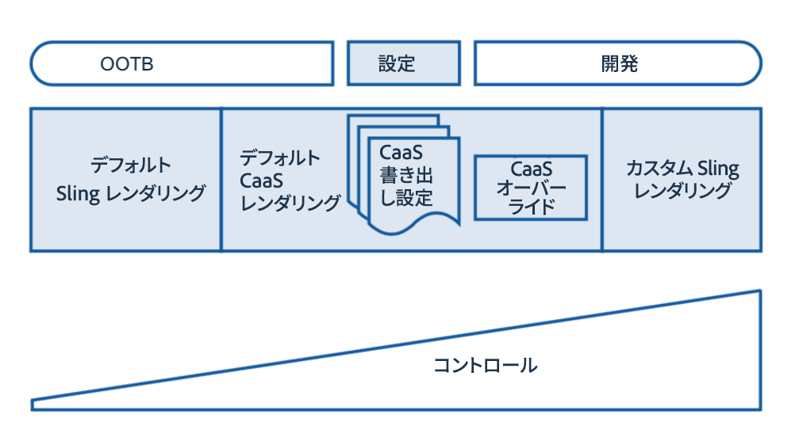

# レンダリングと配信{#rendering-and-delivery}

>[!NOTE]
>
>単一ページアプリケーションフレームワークを基にしたクライアント側レンダリング（React など）が必要なプロジェクトでは、SPA エディターを使用することをお勧めします。[詳細情報](/help/sites-developing/spa-overview.md)を参照してください。

AEM content can easily be rendered via [Sling Default Servlets](https://sling.apache.org/documentation/bundles/rendering-content-default-get-servlets.html) to render [JSON](https://sling.apache.org/documentation/bundles/rendering-content-default-get-servlets.html#default-json-rendering) and other formats.

これらの既製のレンダラーは一般に、リポジトリを調べて、コンテンツをそのまま返します。

また、AEM は、Sling を介して、レンダリングされるスキーマとコンテンツのフルコントロールを取得するカスタム sling レンダラーの開発および展開もサポートします。

Content Servicesのデフォルトレンダラーは、標準搭載のSlingのデフォルトとカスタムの開発の間のギャップを埋め、開発を行わずにレンダリングされたコンテンツの様々な要素をカスタマイズし、制御できます。

次の図に、コンテンツサービスのレンダリングの構造を示します。

## JSON のリクエスト {#requesting-json}

**&lt;RESOURCE.caasを使用します[。&lt;EXPORT-CONFIG][.&lt;EXPORT-CONFIG].json** to request JSON.

<table>
 <tbody>
  <tr>
   <td>リソース</td>
   <td>/content/entitiesの下のエンティティリソース  、または/content   の下のコンテンツリソース</td>
  </tr>
  <tr>
   <td>EXPORT-CONFIG</td>
   <td>
<strong>オプション</strong>  
 
/apps/mobileapps/caas/exportConfigs/EXPORT-CONFIGにあるエクスポート設定を指定します  。省略した場合   、デフォルトのエクスポート設定が適用されます 
 </td>
  </tr>
  <tr>
   <td>DEPTH-INT</td>
   <td><strong>Slingレンダリ</strong>   ングで使用される子のレンダリング用のOPTIONAL深度再帰</td>
  </tr>
 </tbody>
</table>

## 書き出し設定の作成 {#creating-export-configs}

書き出し設定を作成して、JSON レンダリングをカスタマイズできます。

You can create a configuration node under */apps/mobileapps/caas/exportConfigs.*

| ノード名 | 設定の名前（レンダリングセレクター用） |
|---|---|
| jcr:primaryType | nt:unstructured |

次の表に、エクスポート設定のプロパティを示します。

<table>
 <tbody>
  <tr>
   <td><strong>名前</strong></td>
   <td><strong>タイプ</strong></td>
   <td><strong>デフォルト（設定されていない場合）</strong></td>
   <td><strong>値</strong></td>
   <td><strong>説明</strong></td>
  </tr>
  <tr>
   <td>includeComponents</td>
   <td>文字列[]</td>
   <td>すべてを含む</td>
   <td>sling:resourceType</td>
   <td>sling:resourceTypeがJSONエクスポートから指定されたノードの詳細を除外</td>
  </tr>
  <tr>
   <td>excludeComponents</td>
   <td>文字列[]</td>
   <td>何も除外</td>
   <td>sling:resourceType</td>
   <td>sling:resourceTypeをJSONエクスポートから指定したノードの詳細のみを含める</td>
  </tr>
  <tr>
   <td>excludePropertyPrefixes</td>
   <td>文字列[]</td>
   <td>何も除外</td>
   <td>プロパティ接頭辞</td>
   <td>指定した接頭辞で始まるプロパティをJSONエクスポートから除外する</td>
  </tr>
  <tr>
   <td>excludeProperties</td>
   <td>文字列[]</td>
   <td>何も除外</td>
   <td>プロパティ名</td>
   <td>jsonの書き出しから指定したプロパティを除外する</td>
  </tr>
  <tr>
   <td>includeProperties</td>
   <td>文字列[]</td>
   <td>すべてを含む</td>
   <td>プロパティ名</td>
   <td>
excludePropertyPrefixesが設定されている場合  、除外されるプレフィックスと一致するにもかかわらず、指定したプロパティが含まれます。
 
else（除外プロパティは無視されます）は、これらのプロパティのみを含めます
 </td>
  </tr>
  <tr>
   <td>includeChildren</td>
   <td>文字列[]</td>
   <td>すべてを含む</td>
   <td>子名</td>
   <td>jsonエクスポートから指定した子を除外</td>
  </tr>
  <tr>
   <td>excludeChildren</td>
   <td>String[]    </td>
   <td>何も除外</td>
   <td>子名</td>
   <td>指定した子のみをJSONエクスポートから含め、他の子を除外する</td>
  </tr>
  <tr>
   <td>renameProperties</td>
   <td>String[]    </td>
   <td>名前を変更しない</td>
   <td>&lt;実際のプロパティ名&gt;,&lt;置換プロパティ名&gt;</td>
   <td>置換を使用してプロパティの名前を変更する</td>
  </tr>
 </tbody>
</table>

### リソースタイプの書き出しの上書き {#resource-type-export-overrides}

Create a configuration node under */apps/mobileapps/caas/exportConfigs.*

| 名前 | resourceTypeOverrides |
|---|---|
| jcr:primaryType | nt:unstructured |

次の表に、プロパティを示します。

<table>
 <tbody>
  <tr>
   <td><strong>名前</strong></td>
   <td><strong>タイプ</strong></td>
   <td><strong>デフォルト（設定されていない場合）</strong></td>
   <td><strong>値</strong></td>
   <td><strong>説明</strong></td>
  </tr>
  <tr>
   <td>&lt;SELECTOR_TO_INC&gt;</td>
   <td>文字列[] </td>
   <td>-</td>
   <td>sling:resourceType</td>
   <td>次のSlingリソースタイプの場合、デフォルトのCaaS JSONエクスポートを返さないでください。  リソースを次のようにレンダリングして、顧客のJSONエクスポートを返します。  &lt;リソース&gt;。&lt;SELECTOR_TO_INC&gt;.json </td>
  </tr>
 </tbody>
</table>

### 既存のコンテンツサービスの書き出し設定 {#existing-content-services-export-configs}

コンテンツサービスには 2 つの書き出し設定があります。

* デフォルト（設定が指定されていません）
* ページ（サイトのページをレンダリングする）

#### デフォルト書き出し設定 {#default-export-configuration}

リクエストされた URI に設定が指定されている場合は、コンテンツサービスのデフォルト書き出し設定が適用されます。

&lt;RESOURCE>.caas[.&lt;DEPTH-INT>].json

<table>
 <tbody>
  <tr>
   <td><strong>名前</strong></td>
   <td><strong>値</strong></td>
  </tr>
  <tr>
   <td>excludeProperties</td>
   <td> </td>
  </tr>
  <tr>
   <td>excludePropertyPrefixes</td>
   <td>jcr:,sling:,cq:,oak:,page-</td>
  </tr>
  <tr>
   <td>includeProperties</td>
   <td>jcr:text,text  jcr:title,title  jcr:description,description  jcr:lastModified,lastModified  cq:tags,tags  cq:lastModified,lastModified</td>
  </tr>
  <tr>
   <td>includeComponents</td>
   <td> </td>
  </tr>
  <tr>
   <td>excludeComponents</td>
   <td> </td>
  </tr>
  <tr>
   <td>includeChildren</td>
   <td> </td>
  </tr>
  <tr>
   <td>excludeChildren</td>
   <td> </td>
  </tr>
  <tr>
   <td>Sling JSONの上書き</td>
   <td>foundation/components/image  wcm/foundation/components/image  mobileapps/caas/components/data/contentReference  mobileapps/caas/components/data/assetlist</td>
  </tr>
 </tbody>
</table>

#### ページ書き出し設定 {#page-export-configuration}

この設定は、デフォルトを拡張して、子要素ノードの下にグループ化された子要素を含めます。

&lt;SITE_PAGE>.caas.page[.&lt;DEPTH-INT>].json

### その他のリソース {#additional-resources}

コンテンツサービスの追加トピックについて詳しくは、次のリソースを参照してください。

* [モデルの開発](/help/mobile/administer-mobile-apps.md)
* [コンテンツサービスのオーサリング](/help/mobile/develop-content-as-a-service.md)
* [コンテンツサービスの管理](/help/mobile/developing-content-services.md)

