# スペースとエンティティ{#spaces-and-entities}

>[!NOTE]
>
>単一ページアプリケーションフレームワークを基にしたクライアント側レンダリング（React など）が必要なプロジェクトでは、SPA エディターを使用することをお勧めします。[詳細情報](/help/sites-developing/spa-overview.md)

スペースは、コンテンツサービス REST API を介して公開されるエンティティを保存するのに便利な場所です。これは、アプリ(または任意のチャネル)が多くのエンティティに関連付けられる可能性があるので、特に便利です。 エンティティをスペース内に強制的に配置すると、ベストプラクティスとして、アプリの要件が強制的にグループ化されます。必要に応じて、AEMのアプリケーションに少数のスペースを関連付けることができます。

>[!NOTE]
>
>コンテンツサービスからチャネルで使用したい要素は、スペース下になければなりません。

## スペースの作成 {#creating-a-space}

多くのコンテンツやアセットをモバイルアプリに一括で公開する場合は、AEM Mobile ダッシュボードを使用してスペースを作成します。

スペースを操作するようにコンテンツサービスを設定していない場合は、**コンテンツサービス**&#x200B;の選択後、AEM Mobile ダッシュボードにはアプリのみが表示されます。

>[!CAUTION]
>
>**スペースの追加の前提条件**
>
>Check the **Enable AEM Content Services** to work with Spaces and enable it in your AEM Mobile application dashboard.
>
>See [Administering Content Services](/help/mobile/developing-content-services.md) for more details.

ダッシュボードでスペースを設定したら、次の手順に従って、スペースを作成します。

1. Choose **Spaces** from Content Services.

   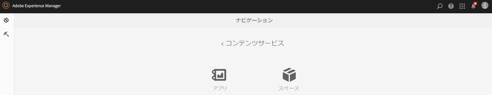

1. Choose **Create** to create a space. Enter **Title**, **Name**, and **Description** for the space.

   「**作成**」をクリックします。

   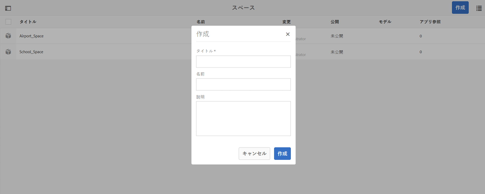

## スペースの管理 {#managing-a-space}

スペースの作成後、リスト内のスペースを管理するには、リストの左側をクリックします。

スペースのプロパティを表示、スペースを削除またはスペースとそのコンテンツを AEM パブリッシュインスタンスに公開できます。

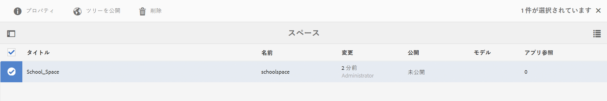

**スペースのプロパティの表示および編集**

1. リストからスペースを選択します。
1. Choose **Properties** from the toolbar
1. Click **Close** when done

**スペースをパブリッシュする** ：スペースがパブリッシュされると、そのスペース内のすべてのフォルダとエンティティもパブリッシュされます。

1. スペースコンソールのリスト内のアイコンをクリックして、スペースを選択します。
1. Choose **Publish Tree**

>[!NOTE]
>
>スペースは&#x200B;**非公開**&#x200B;にできます。スペースを非公開にすると、パブリッシュインスタンスからスペースが削除されます。
>
>次の図に、スペースの公開後に実行できる操作を示します。

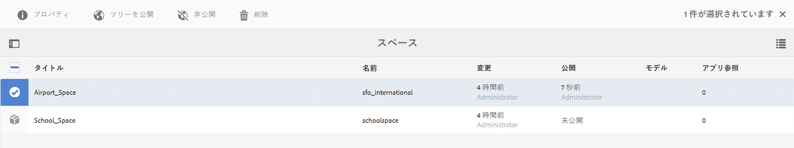

## スペース内のフォルダーの操作 {#working-with-folders-in-a-space}

スペース内にフォルダーを含めると、コンテンツやアセットを簡単に整理できます。ユーザーは、スペース下に自分独自のフォルダー階層を作成できます。

### フォルダーの作成 {#creating-a-folder}

1. Click on the space in the list in the space console and click **Create Folder**

   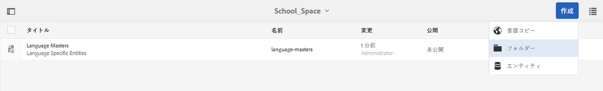

1. Enter the **Title**, **Name,** and **Description** for the folder

   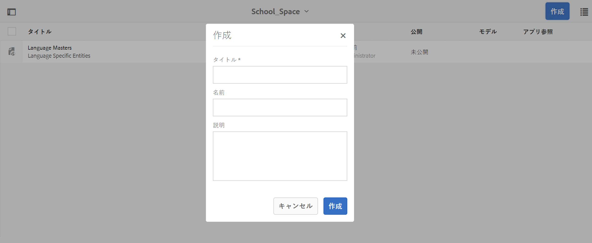

1. 「**作成**」をクリックして、スペース内にフォルダーを作成します。

## 言語コピー {#language-copy}

>[!CAUTION]
>
>言語コピーは、このリリースでは十分にサポートされていません。このリリースでは構造の設定のみおこなえます。

The **Language Copy** feature allows authors to copy their master Language Copy and then create a Project and Workflow to automatically translate the content. 言語コピーによって正しい構造が作成されます。 スペース内にフォルダーを追加すると、スペースに言語コピーを追加できます。

>[!NOTE]
>
>翻訳する可能性があるすべてのコンテンツを、言語コピーノード下に配置することをお勧めします。

### 言語コピーの追加 {#adding-language-copy}

1. スペースを作成したら、そのスペースをクリックして言語コピーを作成します。

   Click **Create** and choose **Language Copy**.

   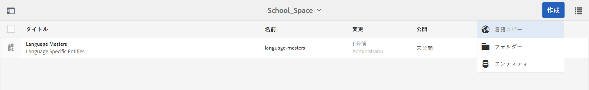

   >[!NOTE]
   >
   >言語コピーノードは、スペースの直属の子要素としてのみ存在できます。

1. Choose **Content Package Language&amp;ast;** and enter the **Title&amp;ast;** in **Create Language Copy** dialog.

   「**作成**」をクリックします。

   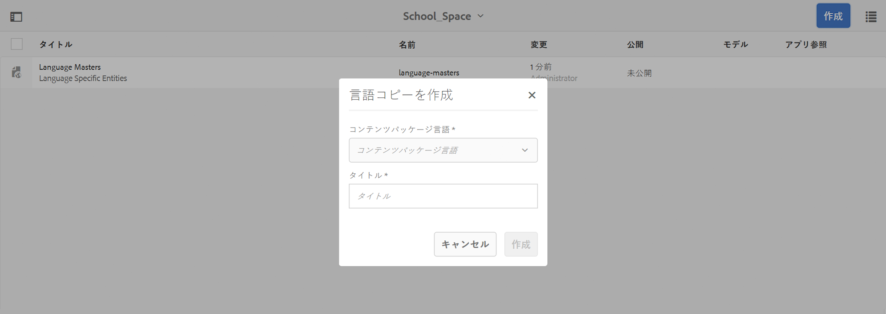

1. Once you create a Language Copy, it appears in your space in **Language Masters**.

   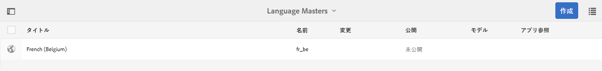

   >[!NOTE]
   >
   >Select **Language Masters** to view the language copy folders.

### スペースからのフォルダーの削除 {#removing-a-folder-from-the-space}

1. スペースのコンテンツのリストから、フォルダーを選択します。
1. ツールバーの「**削除**」をクリックします。

   >[!NOTE]
   >
   >フォルダー内に移動してコンテンツを表示したり、サブフォルダーやエンティティを追加したりするには、スペースのコンテンツリスト内のフォルダーのタイトルをクリックします。

## スペース内のエンティティの操作 {#working-with-entities-in-a-space}

エンティティとは、Web サービスエンドポイントを介して公開されるコンテンツのことです。エンティティはスペース内に保存されるので、簡単に見つけることができ、関連するコンテンツが保存される AEM リポジトリからの独立性を維持できます。

エンティティは、いくつかの論理グループに分けることができます。この場合、いくつかのフォルダーを作成します。

エンティティの子要素（子要素自体が別のエンティティである）をデータモデリングのためにグループ化する場合は、既製の「エンティティグループ」モデルタイプから特定の「グループモデル」を作成できます。

>[!NOTE]
>
>エンティティは、常にスペースに関連付けられています。したがって、スペースコンソールから、エンティティユーザーインターフェイスのほとんどの部分にアクセスできます。

### エンティティの作成 {#creating-an-entity}

1. スペースコンソールを開き、スペースのタイトルをクリックします。

   オプションで、リスト内のフォルダーのタイトルをクリックして、そのフォルダーに移動できます。

   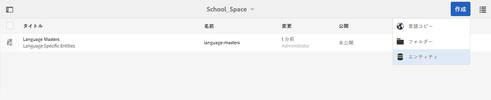

1. エンティティのモデルを選択します。これは、作成するエンティティのタイプです。「次へ」をクリックします。

   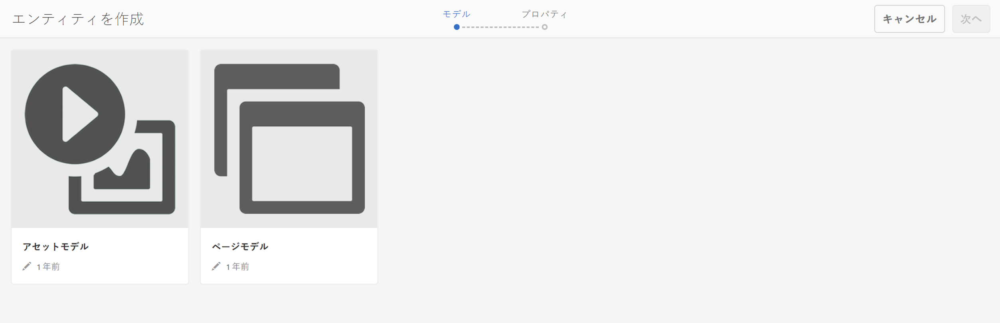

   >[!NOTE]
   >
   >You have the option to choose the **Assets Model**, **Pages Model**, or a model of entity type you created before.
   >
   >See [Creating a Model](/help/mobile/administer-mobile-apps.md), to create your custom entity.

1. Enter a **Title**, **Name**, **Description**, and **Tags** for the entity. 「**作成**」をクリックします。

   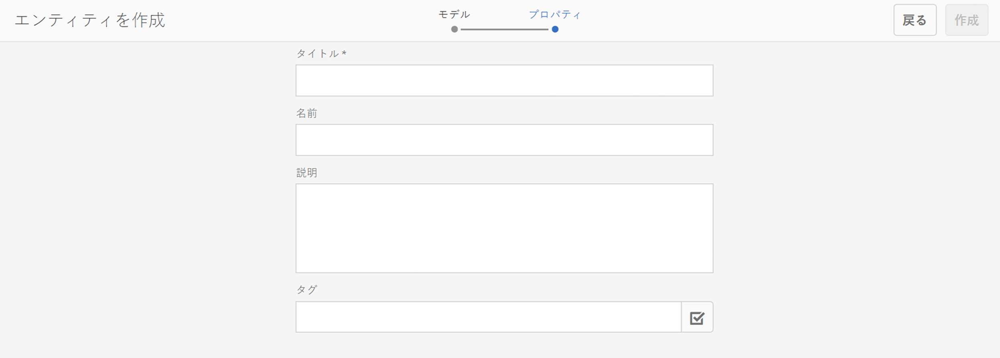

   完了すると、スペースの下位にエンティティが表示されます。

### エンティティの編集 {#editing-an-entity}

1. エンティティを作成したら、フォルダーまたはスペースに移動し、編集するスペースコンソールからエンティティを選択します。

   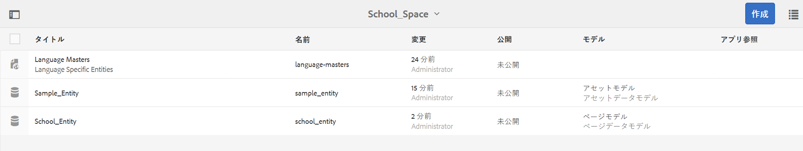

1. Select an entity for editing and click **Edit**.

   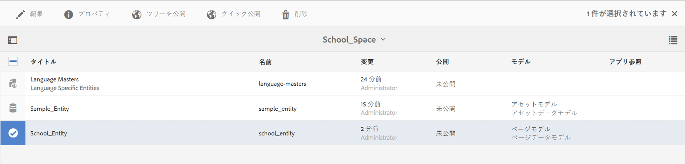

   >[!CAUTION]
   >
   >エンティティのプロパティの編集用 UI も表示用 UI も、エンティティの作成で選択しているテンプレートによって異なります。詳しくは、以下の手順を参照してください。

   ***エンティティをアセットモデルとして作成するテンプレートを選択している場合は***、「**編集**」をクリックすると、下の図に示すアセットを追加できます。

   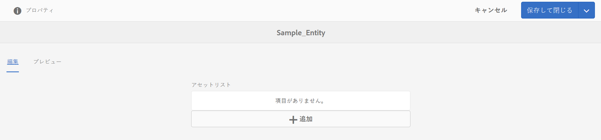

   また、「**プレビュー**」をクリックすると、JSON リンクを表示できます。

   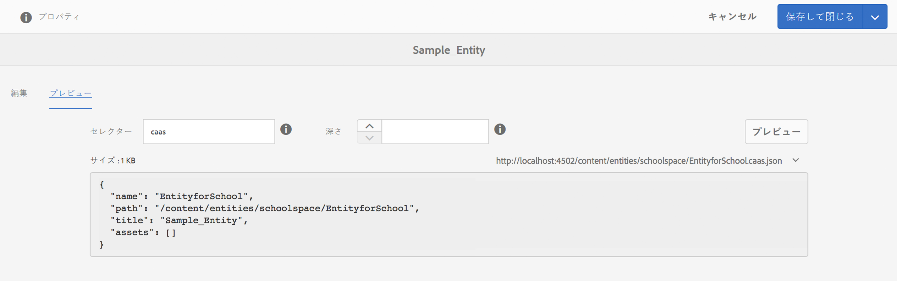

   ***エンティティを作成するためのテンプレートをページモデル***&#x200B;として選択した場合は、 **「編集」をクリックすると** 、次の図に示すようにアセットを追加できます。

   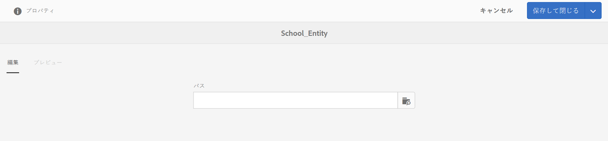

   「**パス**」のアイコンをクリックすると、アセットを追加できます。

   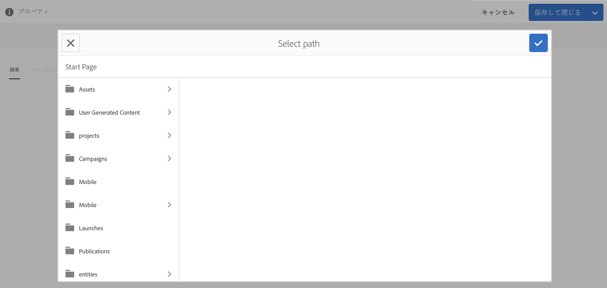

   >[!NOTE]
   >
   >エンティティを追加したら、そのエンティティを保存して、プレビューリンクを使用できるようにする必要があります。プレビューを表示するには、「**保存**」をクリックします。Clicking on the **Preview** shows the json of the added asset, as shown in the figure below:

   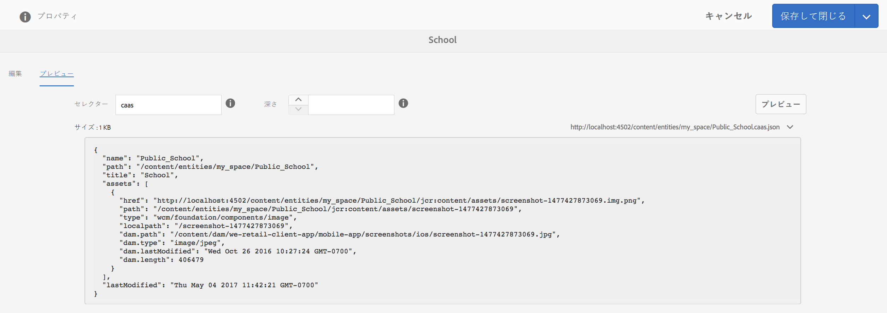

   >[!NOTE]
   >
   >エンティティへのアセットの追加が完了したら、「**保存**」を選択して変更を保存できます。また、「**保存して閉じる**」を選択して変更を保存し、エンティティが定義されているスペースコンソールのリストに戻ることもできます。

   また、スペースコンソールのリストからエンティティを選択し、「**プロパティ**」をクリックして、定義済みエンティティのプロパティを表示、編集します。

   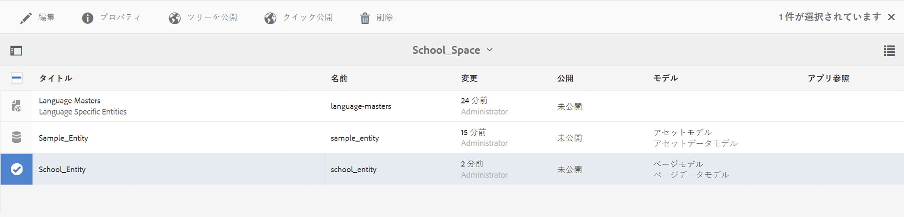

   タイトル、説明およびタグを編集し、エンティティにアセットを追加できます。

   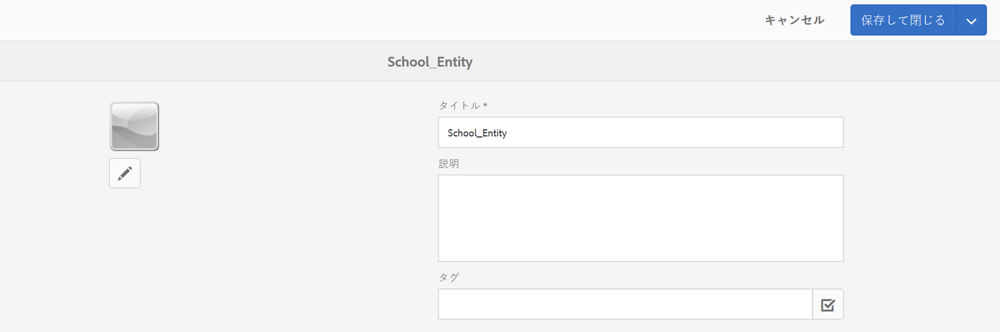

### エンティティの削除 {#removing-an-entity}

1. スペースのコンテンツのリストから、エンティティを選択します。

   

1. ツールバーの「**削除**」をクリックして、スペースから特定のエンティティを削除します。

### エンティティの公開 {#publishing-an-entity}

エンティティの公開オプションとして、「**ツリーを公開**」および「**クイック公開**」があります。

1. スペースコンソールリストから図形を選択し、[**パブリッシュツリー**]をクリックして、その図形とその子をパブリッシュします。

   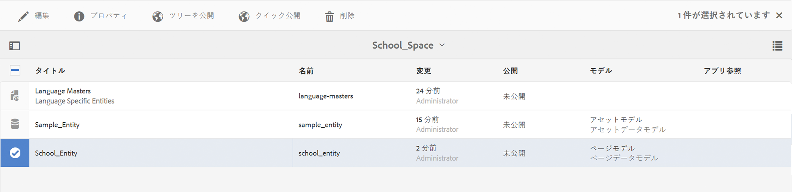

   **または**、

   「**クイック公開**」をクリックすると、その特定のエンティティが公開されます。
