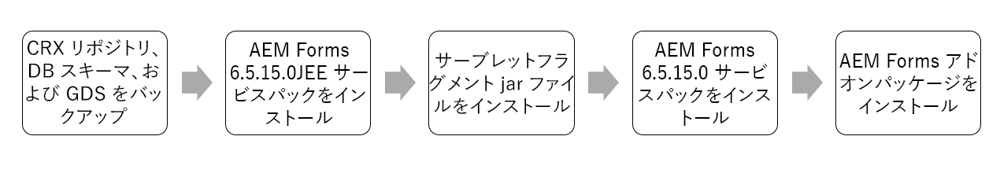
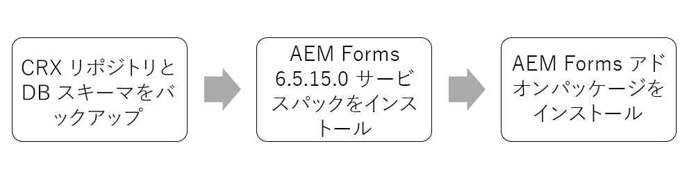

# AEM 6.5 Forms Service Pack のインストール手順 {#aem-form-patch-installation-instructions}

## リリース情報

| 製品 | Adobe Experience Manager 6.5 Forms |
|---|---|
| バージョン | 6.5.15.0 |
| タイプ | サービスパックのリリース |
| 日付 | 2022年12月01日（PT） |

## Experience Manager Forms 6.5.15.0に含まれる機能

Adobe Experience Manager(AEM)Formsサービスパックには、お客様からリクエストされた主な機能強化、パフォーマンス、安定性、セキュリティの改善など、新機能およびアップグレードされた機能が含まれています。 AEM Formsでは、最新の機能と改善点を提供するために、サービスパックを定期的にリリースしています。 スタックに応じて、次のいずれかのパスを選択して、お使いの環境に service pack をダウンロードおよびインストールします。

* [JEE 環境のAEM Formsに Service Pack をダウンロードしてインストールする](#download-and-install-for-jee-service-pack)
* [OSGi 環境のAEM Formsに Service Pack をダウンロードしてインストールする](#download-and-install-for-osgi-service-pack)

>[!NOTE]
>
> Adobeは、6 回目のサービスパックのたびに完全なインストーラをリリースします。 JEE 上のAEM 6.5 Forms Service Pack 12(6.5.12.0) は、最後の完全インストーラーです。 完全なインストーラーは新しいプラットフォームをサポートし、通常のサービスパッケージインストーラーにはバグ修正と一般的な改善のみが含まれています。 JEE 上のAEM 6.5 Forms環境で最新のソフトウェアを使用する場合は、2019 年 4 月 8 日にリリースされたAEM 6.5 Formsインストーラーの代わりに、2022 年 3 月 3 日にリリースされたAEM 6.5.12.0 Forms on JEE 上の完全なインストーラーを使用することをお勧めします。 完全なインストーラーを使用した後、最新のサービスパックをインストールします。

## JEE 環境のAEM Formsに Service Pack をダウンロードしてインストールする {#download-and-install-for-jee-service-pack}

+++1. 既存の環境のバックアップを作成します。

1. バックアップ [CRX リポジトリ、データベーススキーマ、GDS（グローバルドキュメントストレージ）](https://experienceleague.adobe.com/docs/experience-manager-65/forms/administrator-help/aem-forms-backup-recovery/backing-aem-forms-data.html).
1. &lt; のバックアップ&#x200B;*AEM_forms_root*>/deploy フォルダー。 これは、Service Pack をアンインストールする場合に必要です。

+++

+++2.必要なソフトウェアをダウンロードします。

* AEM Forms on JEE 6.5.15.0 Service Pack
* AEM 6.5.15.0 サービスパック
* Forms アドオンパッケージ
* バンドル
* フラグメント

+++

+++3. JEE 上のAEM Forms Service Pack をインストールします。

1. アプリケーションサーバーを停止します。
1. を抽出します。 **AEM Forms on JEE 6.5.15.0 Service Pack インストーラーアーカイブ** をハードドライブに追加します。

   * **Windows**
インストーラをコピーしたハードディスク上のインストールメディアまたはフォルダの適切なディレクトリに移動し、 
`aemforms65_cfp_install.exe` ファイル.

      * （Windows 32 ビット） `Windows\Disk1\InstData\VM`
      * （Windows 64 ビット） `Windows_64Bit`\ `Disk1\InstData\VM`
   * **Linux**
適切なディレクトリに移動し、シェルからを選択して、と入力します。 
`./aem65_cfp_install.bin` を入力します。

      * （Linux）`Linux/Disk1/InstData/NoVM`

   インストールの手順を示すインストールウィザードが起動します。

1. 概要パネルで「**[!UICONTROL 次へ]**」をクリックします。
1. の **フォルダのインストールを選択** 画面を表示し、表示された既定の場所が既存のインストールに対して正しいことを確認するか、 **[!UICONTROL 参照]** AEM forms がインストールされている別のフォルダーを選択し、 **[!UICONTROL 次へ]**.
1. Service Pack の概要情報を読み、 **[!UICONTROL 次へ]**.
1. プリインストールの概要情報を読み、「**[!UICONTROL インストール]**」をクリックします。
1. インストールが完了したら、「**[!UICONTROL 次へ]**」をクリックして、インストールされたファイルに対して Quick Fix アップデートを適用します。
1. **[Windows のみ]:** 次のいずれかの手順を実行します。

   * 次のいずれかを選択解除します。 **Configuration Manager を起動します。** オプションを使用して、 **[!UICONTROL 完了]**. 実行 **Configuration Manager** を使用して、 **ConfigurationManager.bat** 次の場所にあるファイル： `[aem-forms root]\configurationManager\bin`.

   * または、 **Configuration Manager を起動します。** オプションを使用して、 **[!UICONTROL 完了]**. 実行前 **Configuration Manager** using **ConfigurationManager.exe** または **ConfigurationManager_IPv6.exe**&#x200B;に移動します。 *`<AEMForms_Install_Dir>\configurationManager\bin`* ディレクトリと置換 [ConfigurationManager.lax](/help/assets/ConfigurationManager.lax) および [ConfigurationManager_IPV6.lax](/help/assets/ConfigurationManager_IPv6.lax) ファイル。

      >[!NOTE]
      >
      > の使用 **ConfigurationManager.bat** ファイルを使用すると、 .lax ファイルの名前を手動で更新するのを防ぐことができます。

1. **[UNIX ベースの場合のみ]:** この **Configuration Manager を起動します。** デフォルトでは、「 」チェックボックスがオンになっています。 クリック **[!UICONTROL 完了]** Configuration Manager を即座に実行するか、 **Configuration Manager** 後で、選択を解除します。 **Configuration Manager を起動します。** オプションを使用して、 **[!UICONTROL 完了]**. 以下を開始できます。 **Configuration Manager** 後で `[AEM_forms_root]/configurationManager/bin` ディレクトリ。

1. アプリケーションサーバーに応じて、以下のいずれかのドキュメントを選択し、*AEM Forms の設定とデプロイ*&#x200B;節の指示に従ってください。

   * [AEM Forms のインストールおよびデプロイ（JBoss 版）](https://www.adobe.com/go/learn_aemforms_installJBoss_65_jp)
   * [AEM Forms のインストールおよびデプロイ（WebSphere 版）](https://www.adobe.com/go/learn_aemforms_installWebSphere_65_jp)
   * [AEM Forms for WebLogic のインストールとデプロイ](https://www.adobe.com/go/learn_aemforms_installWebLogic_65_jp)

+++

+++4. サーブレットフラグメントをインストール

インストールが必須です。 **サーブレットフラグメント** JBoss EAP 7.4.0 で実行されているアプリケーションサーバーを除くすべてのアプリケーションサーバーの場合。サーブレットフラグメントをダウンロードしてインストールするには、次の手順に従います。

1. フラグメントをダウンロードしていない場合は、からダウンロードします。 [ソフトウェア配布](https://experience.adobe.com/#/downloads/content/software-distribution/en/aem.html?package=/content/software-distribution/en/details.html/content/dam/aem/public/adobe/packages/cq650/featurepack/org.apache.felix.http.servlet-api-1.2.0_fragment_full.jar)

1. アプリケーションサーバーを起動し、ログが安定するのを待って、バンドルの状態を確認します。

1. Web コンソールバンドルを開きます。 デフォルトの URL は `http://[Server]:[Port]/system/console/bundles` です。

1. 「Install/Update」をクリックします。 ダウンロードしたフラグメント org.apache.felix.http.servlet-api-1.2.0_fragment_full.jar を選択します。 「Install」または「Update」をクリックします。アプリケーションサーバーが安定するのを待つ

1. アプリケーションサーバーを停止します。

+++

+++5. AEM サービスパック をインストールします。

1. インスタンスが更新モードの場合（インスタンスが以前のバージョンから更新された場合）、インストール前にインスタンスを再起動します。インスタンスの現在の稼動時間が長い場合、アドビは再起動することを推奨します。
1. インストールする前に、[!DNL Experience Manager] インスタンスのスナップショットまたは新しいバックアップを作成します。
1. [ソフトウェア配布](https://experience.adobe.com/#/downloads/content/software-distribution/en/aem.html?package=/content/software-distribution/jp/details.html/content/dam/aem/public/adobe/packages/cq650/servicepack/aem-service-pkg-6.5.15.0.zip)からサービスパックをダウンロードします。 <!-- UPDATE FOR EACH NEW RELEASE -->
1. パッケージマネージャーを開き、「 **[!UICONTROL パッケージをアップロード]** をクリックしてパッケージをアップロードします。 詳しくは、 [パッケージマネージャー](/help/sites-administering/package-manager.md)を参照してください。
1. パッケージを選択し、「 」を選択します。 **[!UICONTROL インストール]**.
1. S3 コネクタを更新するには、サービスパックのインストール後にインスタンスを停止し、既存のコネクタをインストールフォルダーに用意されている新しいバイナリファイルに置き換えて、インスタンスを再起動します。[Amazon S3 データストア](/help/sites-deploying/data-store-config.md#upgrading-to-a-new-version-of-the-s-connector)を参照してください。

**自動インストール**

[!DNL ExperienceManager] 6.5.15.0. の自動インストールに使用できる方法は 2 つあります<!--       UPDATE FOR EACH NEW RELEASE -->

* パッケージをに配置します。 `../crx-quickstart/install` フォルダーに保存されます。
パッケージが自動的にインストールされます。

* [パッケージマネージャーの HTTP API](/help/sites-administering/package-managermd#package-share) を使用します。用途     `cmd=install&recursive=true` ネストされたパッケージがインストールされるようにする。

   >[!NOTE]
   >
   >Experience Manager6.5.15.0では、Bootstrapのインストールはサポートされていません。 <!-- UPDATE FOR EACHNEW RELEASE -->

**インストールの検証**

このリリースでの動作が認定されているプラットフォームについては、 [技術的要件](/help/ sites-deploying/technical-requirements.md) を参照してください。

1. 製品情報ページ (`/system/console/productinfo`) は、更新されたバージョン文字列を表示します `Adobe Experience      Manager (6.5.15.0)` under [!UICONTROL インストール済み製品].<!-- UPDATE FOR EACH NEW RELEASE -->
1. すべての OSGi バンドルは、 **[!UICONTROL アクティブ]** または **[!UICONTROL フラグメント]** OSGi コンソール (Web コンソールを使用： `/system/console/bundles`) をクリックします。
1. OSGi バンドル `org.apache.jackrabbit.oak-core` はバージョン1.22.13以降です (WebConsole を使用： `/system/console/     bundles`) をクリックします。

+++

+++6. AEM Experience Manager Formsアドオンパッケージのインストール

1. をインストール済みであることを確認します。 [!DNL Experience Manager] サービスパック。
1. 次のリストにある、対応するFormsアドオンパッケージをダウンロードします。 [AEM Formsリリース](https:/experienceleague.adobe.com/ docs/experience-manager-release-informationaem-release-updates/forms-updates/aem-forms-releases.html#forms-updates) を使用して、オペレーティングシステムを起動できます。
1. Formsアドオンパッケージをインストールします。詳しくは、 [AEM Formsアドオンパッケージのインストール](help/forms/using/ installing-configuring-aem-forms-osgimd#install-aem-forms-add-on-package)
1. Experience Manager6.5 Formsでレターを使用する場合は、 [最新の AEMFDC 互換性パッケージ](https:// experienceleague.adobe.com/docsexperience-manager-release-information/aem-release-updates/forms-updates/ aem-forms-releases.html#forms-updates)。

+++

<!-- 1. (JBoss only) After installing the patch and configuring the server, delete  tmp  and work directories of JBoss application server.

>[!IMPORTANT]
>
>Before installing [AEM 6.5.15.0 service pack](#install-the-aem-service-pack-install-aem-service-pack), for all the AEM Forms on JEE environments using any application servers other than JBoss EAP 7.4.0: 
> * Install  the [org.apache.felix.http.servlet-api-1.2.0_fragment-full.jar](https://experience.adobe.com/#/downloads/content/software-distribution/en/aem.html?package=/content/software-distribution/en/details.html/content/dam/aem/public/adobe/packages/cq650/featurepack/org.apache.felix.http.servlet-api-1.2.0_fragment_full.jar) servlet fragment and wait for the application server to stabilize.
>* If you install the latest [AEM service pack (6.5.15.0)](#install-the-aem-service-pack-install-aem-service-pack), prior to the fragment servlet `org.apache.felix.http.servlet-api-1.2.0_fragment-full.jar` on JEE environment, the CRX/bundle and the start page show service unavailable errors, [click here](/help/forms/using/aem-service-pack-installation-solution.md) to know the troubleshooting steps. 

### !-->

## OSGi 環境のAEM Formsに Service Pack をダウンロードしてインストールする {#download-and-install-for-osgi-service-pack}

+++1. 既存の環境のバックアップを作成します。

1. バックアップ [CRX リポジトリとデータベーススキーマ](https://experienceleague.adobe.com/docs/experience-manager-65/forms/administrator-help/aem-forms-backup-recovery/backing-aem-forms-data.html).

>[!NOTE]
>
> リレーショナルデータベース用のAEM Forms Service Pack をインストールする場合は、DB_schema のバックアップを作成する必要があります。

+++

+++2.必要なソフトウェアをダウンロードします。

* [AEM 6.5.15.0 サービスパック](https://experience.adobe.com/#/downloads/content/software-distribution/en/aem.html?package=/content/software-distribution/jp/details.html/content/dam/aem/public/adobe/packages/cq650/servicepack/aem-service-pkg-6.5.15.0.zip)
* [Forms アドオンパッケージ](/help/forms/using/installing-configuring-aem-forms-osgi.md#install-aem-forms-add-on-package)

+++

+++3. AEM サービスパック をインストールします。

1. インスタンスが更新モードの場合（インスタンスが以前のバージョンから更新された場合）、インストール前にインスタンスを再起動します。インスタンスの現在の稼動時間が長い場合、アドビは再起動することを推奨します。
1. インストールする前に、[!DNL Experience Manager] インスタンスのスナップショットまたは新しいバックアップを作成します。
1. [ソフトウェア配布](https://experience.adobe.com/#/downloads/content/software-distribution/en/aem.html?package=/content/software-distribution/jp/details.html/content/dam/aem/public/adobe/packages/cq650/servicepack/aem-service-pkg-6.5.15.0.zip)からサービスパックをダウンロードします。 <!-- UPDATE FOR EACH NEW RELEASE -->
1. パッケージマネージャーを開き、「 **[!UICONTROL パッケージをアップロード]** をクリックしてパッケージをアップロードします。 詳しくは、 [パッケージマネージャー](/help/sites-administering/package-manager.md)を参照してください。
1. パッケージを選択し、「 」を選択します。 **[!UICONTROL インストール]**.
1. S3 コネクタを更新するには、サービスパックのインストール後にインスタンスを停止し、既存のコネクタをインストールフォルダーに用意されている新しいバイナリファイルに置き換えて、インスタンスを再起動します。[Amazon S3 データストア](/help/sites-deploying/data-store-config.md#upgrading-to-a-new-version-of-the-s-connector)を参照してください。

**自動インストール**

[!DNL Experience Manager] 6.5.15.0. の自動インストールに使用できる方法は 2 つあります<!--       UPDATE FOR EACH NEW RELEASE -->

* サーバーがオンラインで使用可能な場合、パッケージを `../crx-quickstart/install` フォルダーに配置します。パッケージが自動的にインストールされます。
* [パッケージマネージャーの HTTP API](/help/sites-administering/package-manager.md#package-share) を使用します。ネストされたパッケージがインストールされるように、`cmd=install&recursive=true` を使用します。

   >[!NOTE]
   >
   >Experience Manager6.5.15.0では、Bootstrapのインストールはサポートされていません。 <!-- UPDATE FOR EACH NEW RELEASE -->

**インストールの検証**

このリリースでの動作が認定されているプラットフォームについては、 [技術要件](/help/ sites-deploying/technical-requirements.md) を参照してください。

1. 製品情報ページ (`/system/console/productinfo`) は、更新されたバージョン文字列を表示します `Adobe Experience      Manager (6.5.15.0)` under [!UICONTROL インストール済み製品]. <!-- UPDATE FOR EACH NEW RELEASE -->

1. すべての OSGi バンドルは、OSGi コンソールで **[!UICONTROL アクティブ]** または **[!UICONTROL フラグメント]** です（web コンソールを使用：`/system/console/bundles`）。

   1. OSGi バンドル `org.apache.jackrabbit.oak-core` はバージョン 1.22.13 以降です（web コンソールを使用：`/system/console/bundles`）。

+++

+++4. AEM Experience Manager Formsアドオンパッケージのインストール

1. をインストール済みであることを確認します。 [!DNL Experience Manager] サービスパック。
1. [AEM Forms リリース](https://experienceleague.adobe.com/docs/experience-manager-release-information/aem-release-updates/forms-updates/aem-forms-releases.html?lang=ja)のリストから、使用しているオペレーティングシステムに対応する Forms アドオンパッケージをダウンロードします。
1. [AEM Forms アドオンパッケージのインストール](/help/forms/using/installing-configuring-aem-forms-osgi.md#install-aem-forms-add-on-package-install-aem-forms-add-on-package)の記載どおりに Forms アドオンパッケージをインストールします。
1. Experience Manager6.5 Formsでレターを使用する場合は、 [最新の AEMFD 互換性パッケージ](https://experienceleague.adobe.com/docs/experience-manager-release-information/aem-release-updates/forms-updates/aem-forms-releases.html?lang=ja).

+++

## トラブルシューティング

* If **パッケージマネージャー UI のダイアログ** service pack のインストール中に終了します。デプロイメントにアクセスする前に、エラーログが安定するのを待ちます。 アップデーターバンドルのアンインストールに関連する特定のログが表示されるのを待ってから、インストールが成功したことを保証します。 通常、この問題は Safari ブラウザーで発生しますが、どのブラウザーでも断続的に発生する場合があります。

* インストールが完了したら、アクティビティの監視ログ (error.log) を確認します。 ログにアクティビティが表示されなくなるまで、数分待ちます。 AEM インスタンスを再起動します。

* 次の場合に **サービス利用不可エラー** 最新のAEM Forms 6.5.15.0 service pack のインストール後、 [ここをクリック](/help/forms/using/aem-service-pack-installation-solution.md) を参照してください。
