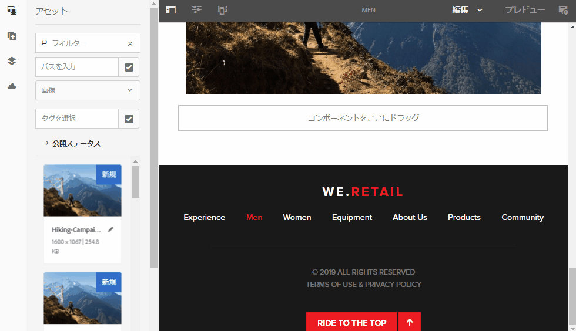

# AEM Assets リリースノート{#aem-assets-release-notes}

AEM 6.5 Assets リリースの主要な機能を以下に示します。

## Adobe Creative Cloud およびクリエイティブワークフローとの連携 {#integration-with-adobe-creative-cloud-and-creative-workflows}

AEM では、様々な方法で Adobe Creative Cloud と連携し、クリエイティブチームとマーケティングチームが密接に共同作業するワークフローでアセットを共有できます。AEM 6.5 では連携を引き続き改善し効率化して、より多くのチャンスを明らかにし、既存の手段の無駄も省きます。

コンテンツ速度の使用事例の最適サポートに活用できる、AEM 6.5 の特定の機能と連携について説明します。

### Adobe Asset Link {#aal}

Adobe Asset Link を使用すると、コンテンツ作成プロセスでのクリエイティブ担当者とマーケティング担当者のコラボレーションを強化できます。クリエイティブ担当者は、最も使い慣れたアプリから直接、Adobe Experience Manager Assets（AEM Assets）に保存されているコンテンツにアクセスできます。また、Photoshop、Illustrator、InDesign などのアプリ内のパネルを使用して、アセットをシームレスに参照、検索、チェックアウトおよびチェックインすることができます。

Adobe Asset Link は ](https://www.adobe.com/creativecloud/business/enterprise.html)Creative Cloud エンタープライズ版[に含まれています。AEM デプロイメントの必要な設定など、詳細については、](https://helpx.adobe.com/enterprise/using/adobe-asset-link.html)Adobe Asset Link[ を参照してください。

### Adobe Stock との連携 {#stock}

組織は、AEM Assets内でAdobe Stockエンタープライズプランを使用して、ライセンスを取得したアセットがクリエイティブプロジェクトやマーケティングプロジェクトで広く利用できるようにします。 AEMの強力なDAM機能を使用して、AEMに保存されたAdobe stockアセットをすばやく検索、プレビューおよびライセンス認証できます。

Adobe Stock サービスは、あらゆるクリエイティブプロジェクトに使用できる、何百万点もの質の高い選ばれた著作権使用料不要の写真、ベクター、イラスト、ビデオ、テンプレートおよび 3D アセットを提供します。

詳しくは、[AEM Assets での Adobe Stock アセットの使用](/help/assets/aem-assets-adobe-stock.md)を参照してください。

AEM Assets 内での Adobe Stock 画像およびライセンスのプレビュー

AEM でのライセンス取得済み Adobe Stock 画像の検索とフィルタリング

### Dynamic references in Adobe InDesign {#dynamic-references-in-indesign}

Adobe InDesign ファイルで使用される AEM Assets は動的です。参照先アセットが JCR 階層内で移動すると、参照が自動的に更新されます。詳しくは、[複合アセットの管理](/help/assets/managing-linked-subassets.md)を参照してください。

## Brand Portal の機能 {#brand-portal-capabilities}

AEM Assets Brand Portal では、承認済みアセットを容易に取得、効果的に制御し、それらのアセットを様々なデバイスをまたいで外部のベンダー／代理店、および内部のビジネスユーザーへと安全に配布できます。アセットの共有を効率化し、アセットの市場投入時間を短縮し、コンプライアンスに違反した使用や不正アクセスのリスクをなくすことができます。

詳細については、](https://helpx.adobe.com/experience-manager/brand-portal/using/whats-new.html)AEM Assets Brand Portal の新機能[を参照してください。

## Connected Assets {#connectedassets}

大規模企業では、Web サイトの作成に必要なインフラストラクチャを分散させることができます。しかし、Web サイトの作成機能と必要なデジタルアセットが、分断させた状態で別々の場所に存在する場合があります。

AEM Sites は Web ページの作成機能を備え、AEM Assets は Web サイトに必要なアセットを提供するデジタルアセット管理（DAM）システムです。AEM では、AEM Sites と AEM Assets の統合により、上記の使用事例をサポートできるようになりました。

詳しくは、[Connected Assets からのアセットの使用](/help/assets/use-assets-across-connected-assets-instances.md)を参照してください。

異なる AEM インスタンス間での Sites 内の DAM アセットのドラッグ＆ドロップ

## Dynamic Media {#dynamic-media}

Dynamic Media により、リッチメディアのオーサリングと AEM Assets での配信が強化され、臨場感あふれるパーソナライズされた最先端のエクスペリエンスが促進されます。1 つの高品質なマスターアセットをアップロードし、高度なクラウドレンダリングおよびビューアを使用することで、所属組織のメディア戦略をサポートするレンディションの任意の組み合わせをその場で提供できます。

新しい Dynamic Media 機能の詳細については、](https://marketing.adobe.com/resources/help/en_US/s7/release_notes/)Dynamic Media のリリースノート[を参照してください。

### 360 ビデオのサポート {#video-support}

Dynamic Media の最先端ビューアを使用してデスクトップ、モバイルおよび VR ヘットセットに VR エクスペリエンスを提供することで、360 ビデオファイルを AEM で直接管理できます。詳しくは、[360 ビデオ の使用](/help/assets/360-video.md)を参照してください。

### カスタムビデオのサムネール {#custom-video-thumbnails}

DAM に保存されているビデオそのものまたは他のコンテンツのフレームを使用して、ビデオアセットのサムネールをカスタマイズできるようになりました。詳しくは、[ビデオのサムネールについて](/help/assets/video.md#about-video-thumbnails-in-dynamic-media-scene-mode)を参照してください。

### アクセシビリティの強化 {#accessibility-enhancements}

Dynamic Media ビューアでは、Aria フォントのサポート、スクリーンリーダー、代替テキストなどの拡張アクセシビリティ機能をサポートするようになりました。詳細については、[Dynamic Media ビューアのリリースノート](https://marketing.adobe.com/resources/help/en_US/s7/viewers_ref/index.html)を参照してください。

## 検索エクスペリエンスの強化 {#search-experience-enhancement}

AEM 6.5以降では、マーケターは検索結果ページから目的のアセットをより迅速に見つけることができます。 検索フィルターのアセット数は、検索フィルターを適用する前でも更新されます。フィルターに対するアセット数を確認すると、検索結果を効率的にナビゲートすることができます。詳しくは、[AEM でのアセットの検索](../assets/search-assets.md)を参照してください。

検索ファセットで検索結果をフィルタリングしない場合のアセット数の表示

## 使いやすさの向上 {#usability-enhancement}

フォルダー内または検索結果からすべてのアセットを一括選択できるようになりました。複数のアセットをすばやく管理するのに役立ちます。チェックボックスをオンにすると、AEM インターフェイスに表示されるアセットだけでなく、シナリオに合致するすべてのアセット（検索結果）が選択されます。

「すべてを選択」オプションを使用してすべてのアセットをワンクリックで選択

## メタデータの機能強化 {#metadata-enhancements}

Assets では、フォルダープロパティページに表示されるレイアウトおよびメタデータを定義する、アセットフォルダーのメタデータスキーマを作成できます。既存のフォルダーまたは新規作成するフォルダーにフォルダーメタデータスキーマを割り当てることができるようになりました。詳しくは、](/help/assets/folder-metadata-schema.md)フォルダーメタデータスキーマ[を参照してください。

カスケードメタデータを指定すると、選択肢をフォームに手動で入力するのではなく、実行時に JSON ファイルから読み込むことができます。詳しくは、[カスケードメタデータ](/help/assets/cascading-metadata.md)を参照してください。

## レポート機能の強化 {#reporting-enhancements}

「ダウンロードされたアセット」レポートに、コンテンツフラグメントとリンク共有が含まれるようになりました。詳しくは、[AEM Assets レポート](/help/assets/asset-reports.md)を参照してください。
