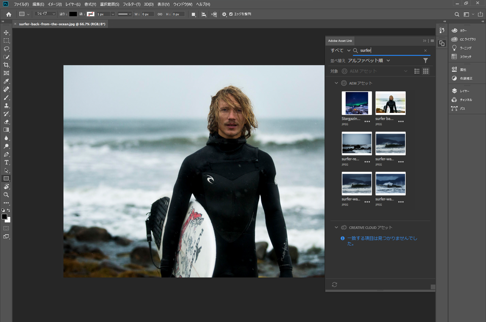
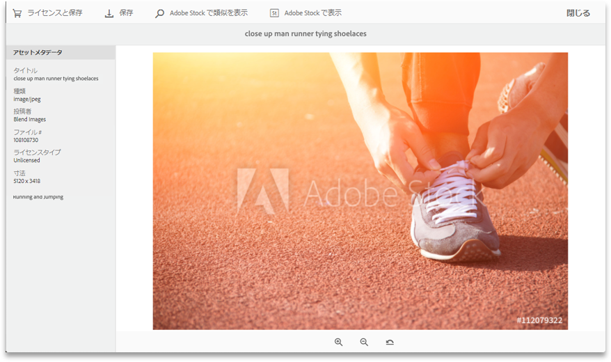
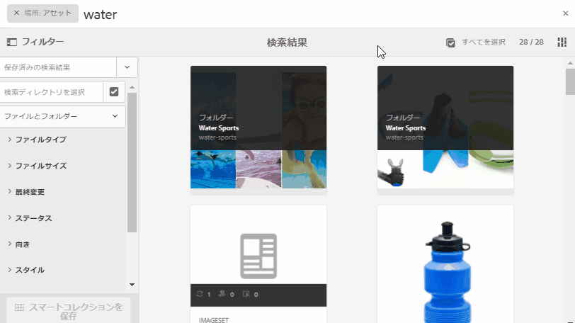

# Adobe Experience Manager Assetsリリースノート {#aem-assets-release-notes}

Adobe Experience Manager 6.5 Assetsリリースの主な機能と主な特徴を以下に示します。

## Integration with [!DNL Adobe Creative Cloud] and creative workflows {#integration-with-adobe-creative-cloud-and-creative-workflows}

[!DNL Adobe Experience Manager] では、様々な方法で と連携し、クリエイティブチームとマーケティングチームが密接に共同作業するワークフローでアセットを共有できます。[!DNL Adobe Creative Cloud][!DNL Experience Manager] 6.5 では連携を引き続き改善し効率化して、より多くのチャンスを明らかにし、既存の手段の無駄も省きます。

Read on to know the specific capabilities and integrations of [!DNL Experience Manager] 6.5 that you can leverage to best support your content velocity use cases.

### Adobe Asset Link {#aal}

[!DNL Adobe Asset Link] コンテンツ作成プロセスにおけるクリエイティブとマーケティング担当者のコラボレーションを強化します。 クリエイティブは、に保存されているコン [!DNL Experience Manager Assets]テンツに、最もなじみのあるアプリを残さずにアクセスできます。 Creatives can seamlessly browse, search, check out, and check in assets using the in-app panel in [!DNL Adobe Photoshop], [!DNL Adobe Illustrator], and [!DNL Adobe InDesign] apps.

[!DNL Adobe Asset Link] は、 [Creative Cloudエンタープライズ版の一部です](https://www.adobe.com/jp/creativecloud/business/enterprise.html) 。 For more information about it, including necessary configuration of your [!DNL Experience Manager] deployment, see [Adobe Asset Link](https://helpx.adobe.com/jp/enterprise/using/adobe-asset-link.html).

### [!DNL Adobe Stock] 統合 {#stock}

Your organization can use its [!DNL Adobe Stock] enterprise plan within [!DNL Experience Manager Assets] to ensure that licensed assets are broadly available for your creative and marketing projects. You can quickly find, preview, and license [!DNL Adobe Stock] assets that are saved in Experience Manager, using the powerful DAM capabilities of [!DNL Experience Manager].

[!DNL Adobe Stock] サービスは、あらゆるクリエイティブプロジェクトに使用できる、適切にキュレーションされ、著作権使用料が不要で質の高い何百万点もの写真、ベクター、イラスト、ビデオ、テンプレートおよび 3D アセットを提供します。

For more info, see [Use [!DNL Adobe Stock] assets in Experience Manager Assets](/help/assets/aem-assets-adobe-stock.md).

*図：プレビュー[!DNL Adobe Stock]の画像とライセンスを[!DNL Experience Manager Assets]。*

*図：でライセンス画像を検索し、フィ[!DNL Adobe Stock]ルターしま[!DNL Experience Manager]す。*

### Dynamic references in [!DNL Adobe InDesign] {#dynamic-references-in-indesign}

[!DNL Experience Manager Assets] ファイルで使用さ [!DNL Adobe InDesign] れる動的な動作。 参照先のアセットがリポジトリ内で移動すると、参照が自動的に更新されます。 詳しくは、複合アセットの管 [理方法を参照してください](/help/assets/managing-linked-subassets.md)。

## Brand Portal の機能 {#brand-portal-capabilities}

[!DNL Experience Manager Assets Brand Portal] では、承認済みアセットを容易に取得、効果的に制御し、それらのアセットを様々なデバイスをまたいで外部のベンダー／代理店、および内部のビジネスユーザーへと安全に配布できます。アセットの共有を効率化し、アセットの市場投入時間を短縮し、コンプライアンスに違反した使用や不正アクセスのリスクをなくすことができます。

詳細については、](https://helpx.adobe.com/experience-manager/brand-portal/using/whats-new.html)AEM Assets Brand Portal の新機能[を参照してください。

## Connected Assets {#connectedassets}

大規模企業では、Web サイトの作成に必要なインフラストラクチャを分散させることができます。しかし、Web サイトの作成機能と必要なデジタルアセットが、分断させた状態で別々の場所に存在する場合があります。

[!DNL Experience Manager Sites] は Web ページの作成機能を備え、 は Web サイトに必要なアセットを提供するデジタルアセット管理（DAM）システムです。[!DNL Experience Manager Assets][!DNL Experience Manager] とを統合することで、上記の使用例をサポートするように [!DNL Sites] なりまし [!DNL Assets]た。 接続され [たアセット機能の設定方法と使用方法を参照してください](/help/assets/use-assets-across-connected-assets-instances.md)。

![別の展開のページに、展 [!DNL Experience Manager] 開からアセ [!DNL Sites] ットをドラッグ [!DNL Experience Manager] する](assets/connected-assets-drag-and-drop-only.gif)

*図：別の展開上のページに、展[!DNL Experience Manager]開からアセッ[!DNL Sites]トをドラッグして配置[!DNL Experience Manager]します。*

## Dynamic Media {#dynamic-media}

[!DNL Dynamic Media] リッチメディアのオーサリングと配信が強化され、没入型で [!DNL Experience Manager Assets] パーソナライズされた最新のエクスペリエンスを実現します。 高品質のマスターアセットを1つアップロードし、アドビの高度なクラウドレンダリングとビューアを使用することで、任意のレンディションを組み合わせて、組織のメディア戦略をサポートできます。

For more details on new [!DNL Dynamic Media] features see [Dynamic Media Release Notes](https://docs.adobe.com/content/help/en/dynamic-media-developer-resources/release-notes/s7rn2017.html).

### 360 ビデオのサポート {#video-support}

Manage your 360-video files directly in [!DNL Experience Manager] using the cutting edge viewers to deliver VR-experiences to desktops, mobile and VR-headsets. 詳しくは、[360 ビデオ の使用](/help/assets/360-video.md)を参照してください。

### カスタムビデオのサムネール {#custom-video-thumbnails}

DAM に保存されているビデオそのものまたは他のコンテンツのフレームを使用して、ビデオアセットのサムネールをカスタマイズできるようになりました。詳しくは、[ビデオのサムネールについて](/help/assets/video.md#about-video-thumbnails-in-dynamic-media-scene-mode)を参照してください。

### アクセシビリティの強化 {#accessibility-enhancements}

[!DNL Dynamic Media] ビューアで、アリアサポート、スクリーンリーダー、代替テキストなどのアクセシビリティ機能が強化されました。 詳細については、[Dynamic Media ビューアのリリースノート](https://docs.adobe.com/content/help/en/dynamic-media-developer-resources/library/home.html)を参照してください。

## 検索エクスペリエンスの強化 {#search-experience-enhancement}

[!DNL Experience Manager] 6.5以降では、マーケターは検索結果ページから目的のアセットをより迅速に見つけることができます。 検索フィルターのアセット数は、検索フィルターを適用する前でも更新されます。フィルターに対するアセット数を確認すると、検索結果を効率的にナビゲートすることができます。For more information, see [Search assets in Experience Manager](../assets/search-assets.md).

*図：検索結果を検索ファセットでフィルタリングせずに、アセットの数を確認する。*

## 使いやすさの向上 {#usability-enhancement}

フォルダ内または検索結果から、読み込まれたすべてのアセットを1回で選択できるようになりました。 複数のアセットをすばやく管理するのに役立ちます。The check box selects all the assets that fits the scenario, say a search result and not just the assets that are visible in the [!DNL Experience Manager] interface.

*図：「すべて選択」オプションを使用すると、読み込まれたすべてのアセットを1回のクリックで選択できます。*

## メタデータの機能強化 {#metadata-enhancements}

[!DNL Assets] では、フォルダープロパティページに表示されるレイアウトおよびメタデータを定義する、アセットフォルダーのメタデータスキーマを作成できます。既存のフォルダーまたは新規作成するフォルダーにフォルダーメタデータスキーマを割り当てることができるようになりました。詳しくは、](/help/assets/folder-metadata-schema.md)フォルダーメタデータスキーマ[を参照してください。

カスケードメタデータを指定すると、選択肢をフォームに手動で入力するのではなく、実行時に JSON ファイルから読み込むことができます。詳しくは、[カスケードメタデータ](/help/assets/cascading-metadata.md)を参照してください。

## レポート機能の強化 {#reporting-enhancements}

ダウンロードしたレポートに、コンテンツフラグメントとリンク共有が含まれるようになりました。 詳しくは、[AEM Assets レポート](/help/assets/asset-reports.md)を参照してください。
