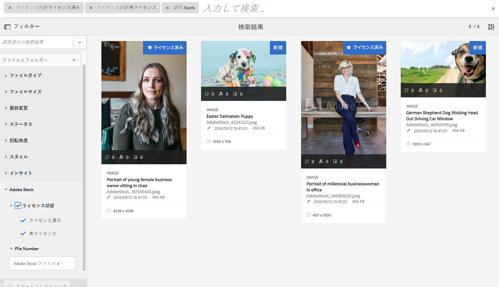

# [!DNL Adobe Experience Manager Assets] リリースノート  {#aem-assets-release-notes}

[!DNL Adobe Experience Manager] 6.5 [!DNL Assets]リリースの主な機能と主な特徴を示します。

## [!DNL Adobe Creative Cloud]およびクリエイティブワークフロー{#integration-with-adobe-creative-cloud-and-creative-workflows}との統合

[!DNL Adobe Experience Manager] では、様々な方法で と連携し、クリエイティブチームとマーケティングチームが密接に共同作業するワークフローでアセットを共有できます。[!DNL Adobe Creative Cloud][!DNL Experience Manager] 6.5 では連携を引き続き改善し効率化して、より多くのチャンスを明らかにし、既存の手段の無駄も省きます。

[!DNL Experience Manager] 6.5の特定の機能と統合について、コンテンツ速度の使用例を最もサポートするために活用できる情報をお読みください。

### Adobe Asset Link {#aal}

[!DNL Adobe Asset Link] コンテンツ作成プロセスにおけるクリエイティブとマーケティング担当者のコラボレーションを強化します。クリエイティブは、[!DNL Experience Manager Assets]に保存されたコンテンツに、最もよく知っているアプリを残さずにアクセスできます。 クリエイティブは、[!DNL Adobe Photoshop]、[!DNL Adobe Illustrator]および[!DNL Adobe InDesign]アプリのアプリ内パネルを使用して、アセットの参照、検索、チェックアウト、チェックインをシームレスに行うことができます。

[!DNL Adobe Asset Link] は、企業向け製品の [Creative Cloudの一部](https://www.adobe.com/jp/creativecloud/business/enterprise.html) です。[!DNL Experience Manager]デプロイメントの必要な設定など、詳しくは、[Adobeアセットリンク](https://helpx.adobe.com/jp/enterprise/using/adobe-asset-link.html)を参照してください。

### [!DNL Adobe Stock] 統合  {#stock}

[!DNL Experience Manager Assets]内で[!DNL Adobe Stock]エンタープライズプランを使用して、ライセンスを取得したアセットがクリエイティブプロジェクトやマーケティングプロジェクトで広く利用できるようにします。 [!DNL Experience Manager]の強力なDAM機能を使用すると、Experience Managerに保存されている[!DNL Adobe Stock]アセットをすばやく見つけ、プレビュー、ライセンスを取得できます。

[!DNL Adobe Stock] サービスは、あらゆるクリエイティブプロジェクトに使用できる、適切にキュレーションされ、著作権使用料が不要で質の高い何百万点もの写真、ベクター、イラスト、ビデオ、テンプレートおよび 3D アセットを提供します。

詳しくは、[Experience ManagerアセットでのAdobe Stockアセットの使用](/help/assets/aem-assets-adobe-stock.md)を参照してください。

*図：プレビュー [!DNL Adobe Stock] の画像とライセンスを内から取得 [!DNL Experience Manager Assets]できます。*

*図：でライセンス [!DNL Adobe Stock] 画像を検索し、フィルタし [!DNL Experience Manager]ます。*

### [!DNL Adobe InDesign] {#dynamic-references-in-indesign}の動的参照

[!DNL Experience Manager Assets] 動的な [!DNL Adobe InDesign] ファイルで使用されます。参照先のアセットがリポジトリ内で移動すると、参照が自動的に更新されます。 詳しくは、[複合アセットの管理方法](/help/assets/managing-linked-subassets.md)を参照してください。

## Brand Portal の機能 {#brand-portal-capabilities}

[!DNL Experience Manager Assets Brand Portal] では、承認済みアセットを容易に取得、効果的に制御し、それらのアセットを様々なデバイスをまたいで外部のベンダー／代理店、および内部のビジネスユーザーへと安全に配布できます。アセットの共有を効率化し、アセットの市場投入時間を短縮し、コンプライアンスに違反した使用や不正アクセスのリスクをなくすことができます。

詳細については、](https://helpx.adobe.com/experience-manager/brand-portal/using/whats-new.html)AEM Assets Brand Portal の新機能[を参照してください。

## Connected Assets {#connectedassets}

大規模企業では、Web サイトの作成に必要なインフラストラクチャを分散させることができます。しかし、Web サイトの作成機能と必要なデジタルアセットが、分断させた状態で別々の場所に存在する場合があります。

[!DNL Experience Manager Sites] は Web ページの作成機能を備え、 は Web サイトに必要なアセットを提供するデジタルアセット管理（DAM）システムです。[!DNL Experience Manager Assets][!DNL Experience Manager] では、[!DNL Sites] と [!DNL Assets] の統合により、上記の使用事例をサポートできるようになりました。[接続されたアセット機能の設定方法と使用方法](/help/assets/use-assets-across-connected-assets-instances.md)を参照してください。

![アセットを [!DNL Experience Manager] 展開から別の [!DNL Sites] 展開の [!DNL Experience Manager] ページにドラッグする](assets/connected-assets-drag-and-drop-only.gif)

*図：アセットを [!DNL Experience Manager] 展開から別の [!DNL Sites] 展開の [!DNL Experience Manager] ページにドラッグします。*

## Dynamic Media {#dynamic-media}

[!DNL Dynamic Media] リッチメディアのオーサリング機能と配信機能が強化され、 [!DNL Experience Manager Assets] 没入型でパーソナライズされた最新のエクスペリエンスを実現します。1つの高品質マスターアセットをアップロードし、アドビの高度なクラウドレンダリングとビューアを使用して、任意のレンディションをその場で配信し、組織のメディア戦略をサポートします。

新しい[!DNL Dynamic Media]機能の詳細については、[Dynamic Mediaリリースノート](https://experienceleague.adobe.com/docs/dynamic-media-developer-resources/release-notes/s7rn2017.html)を参照してください。

### 360ビデオサポート{#video-support}

最先端のビューアを使用して、360ビデオファイルを[!DNL Experience Manager]内で直接管理し、デスクトップ、モバイル、VRヘッドセットにVRエクスペリエンスを配信します。 詳しくは、[360 ビデオ の使用](/help/assets/360-video.md)を参照してください。

### カスタムビデオサムネール{#custom-video-thumbnails}

DAM に保存されているビデオそのものまたは他のコンテンツのフレームを使用して、ビデオアセットのサムネールをカスタマイズできるようになりました。詳しくは、[ビデオのサムネールについて](/help/assets/video.md#about-video-thumbnails-in-dynamic-media-scene-mode)を参照してください。

### アクセシビリティの強化 {#accessibility-enhancements}

[!DNL Dynamic Media] ビューアで、アリアサポート、スクリーンリーダー、代替テキストなどの強化されたアクセシビリティ機能がサポートされるようになりました。詳細については、[Dynamic Media ビューアのリリースノート](https://experienceleague.adobe.com/docs/dynamic-media-developer-resources/library/home.html)を参照してください。

## 検索エクスペリエンスの強化  {#experience-enhancement-for-searching}

[!DNL Experience Manager] 6.5以降では、マーケターは検索結果ページで目的のアセットを迅速に見つけることができます。検索フィルターのアセット数は、検索フィルターを適用する前でも更新されます。フィルターに対するアセット数を確認すると、検索結果を効率的にナビゲートすることができます。詳しくは、[Experience Manager](../assets/search-assets.md)内のアセットの検索を参照してください。

*図：検索結果を検索ファセットでフィルタリングしないで、アセットの数を確認します。*

## 使いやすさの向上 {#usability-enhancement}

フォルダ内または検索結果から、ロードされたすべてのアセットを1回の操作で選択できるようになりました。 複数のアセットをすばやく管理するのに役立ちます。このチェックボックスをオンにすると、[!DNL Experience Manager]インターフェイスに表示されるアセットだけでなく、検索結果など、シナリオに合うすべてのアセットが選択されます。

*図：「すべて選択」オプションを使用すると、ロードされたすべてのアセットを1回のクリックで選択できます。*

## メタデータの機能強化 {#metadata-enhancements}

[!DNL Assets] では、フォルダープロパティページに表示されるレイアウトおよびメタデータを定義する、アセットフォルダーのメタデータスキーマを作成できます。既存のフォルダーまたは新規作成するフォルダーにフォルダーメタデータスキーマを割り当てることができるようになりました。詳しくは、](/help/assets/metadata-config.md#folder-metadata-schema)フォルダーメタデータスキーマ[を参照してください。

カスケードメタデータを指定すると、選択肢をフォームに手動で入力するのではなく、実行時に JSON ファイルから読み込むことができます。詳しくは、[カスケードメタデータ](/help/assets/metadata-schemas.md#cascading-metadata)を参照してください。

## レポート機能の強化 {#reporting-enhancements}

現在は、ダウンロードしたレポートにコンテンツフラグメントとリンク共有が含まれます。 詳しくは、[AEM Assets レポート](/help/assets/asset-reports.md)を参照してください。
