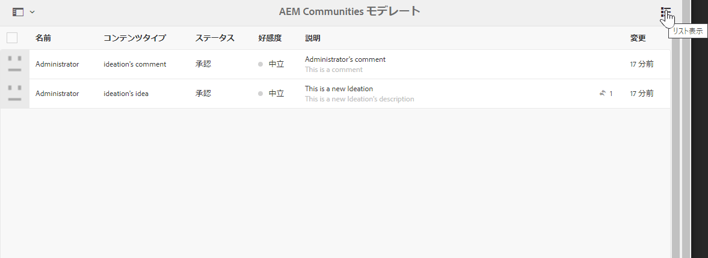

# AEM Communities release notes {#aem-communities-release-notes}

6.4 リリース以降の AEM Communities の改善点について説明します。To learn about the new features in greater detail, see [AEM 6.5 Communities User Guide](https://helpx.adobe.com/jp/experience-manager/6-4/communities/user-guide.html).

最新リリースを入手するには、このドキュメントの [Communities のデプロイ](https://helpx.adobe.com/in/experience-manager/6-4/help/communities/deploy-communities.html#LatestReleases)の節を参照してください。

## 主な機能強化 {#major-enhancements}

### コミュニティエンゲージメントの強化 {#enhancements-to-community-engagement}

**@メンションのサポート** AEM Communitiesでは、ユーザー生成コンテンツで、登録ユーザーが他の登録メンバーにタグ（メンション）を付けて、注意を引くことができるようになりました。 タグ付け（メンション）されたメンバーには、対応するユーザー生成コンテンツへのディープリンクが付いた通知が届きます。ただし、Web通知や電子メール通知を無効/有効にすることはできます。

コミュニティユーザーは、自分の名、姓またはユーザー名を検索しなくても、誰かが自分に接触してきたかどうか、または誰かが自分の注意を引く必要があるのかどうかを確認することができます。さらに、UGC 作成者は、問題に最もうまく対処し入力を追加できる特定の登録ユーザーからの応答を探すことができます。

The community administrators need to **Enable Mention** on community components to allow registered users use the functionality on those components.

**グループメッセージ送信**

コミュニティの登録メンバーは、同じメッセージをグループメンバーに個々に送信するのではなく、1 回の電子メール作成でダイレクトメッセージをグループに一括送信できるようになりました。[グループメッセージを許可するには](/help/communities/configure-messaging.md)、 [Messaging Operations Serviceの両方のインスタンスを有効にします](/help/communities/messaging.md#group-messaging)。

### 一括モデレートの機能強化 {#enhancements-to-bulk-moderation}

一括モデレートでのカスタムフィルター

[カスタムフィルター](/help/communities/moderation.md#custom-filters) を開発し、一括モデレートUIに追加できるようになりました。

タグによるフィルタリングの例を示す[サンプルプロジェクト](https://github.com/Adobe-Marketing-Cloud/aem-communities-extensions/tree/master/aem-communities-moderation-filter)を ](https://github.com/Adobe-Marketing-Cloud/aem-communities-extensions/tree/master/aem-communities-moderation-filter)GitHub [ で入手できます。このプロジェクトをベースに、類似のスタムフィルターを開発できます。

**一括モデレートのリスト表示**

UI が改善された新しいリスト表示が一括モデレートに提供され、ユーザ生成コンテンツエントリを表示できるようになりました。

### サイトおよびグループ管理の機能強化 {#enhancements-to-site-and-group-management}

**作成者側のサイトおよびグループ管理者**

AEM 6.5 以降の Communities では、様々なコミュニティサイトやグループ／ネストされたグループの分散管理が可能です。複数のコミュニティサイトやネストされたグループをホストしている組織では、サイト（およびグループ）の作成時に作成者側で管理者ロールのメンバーを選択できるようになりました。

サイト管理者はデフォルトの管理者になり、任意の階層レベルにグループを作成できます。これらの管理者は、後で他のグループ管理者によって削除できます。 グループ管理者はグループ G1 を管理し、G1 内にネストしたサブグループを作成することができます。

### イネーブルメントの機能強化 {#enhancements-to-enablement}

**SCORM 2017.1 のサポート**

The enablement functionality of AEM 6.5 Communities support Shareable Content Object Reference Model [(SCORM) 2017.1](https://rusticisoftware.com/blog/scorm-engine-2017-released/) engine.

* 有効化コンポーネントでのキーボードナビゲーションのサポート
* AEM Communitiesの有効化コンポーネント（カタログとコースの再生、割り当て、ファイルライブラリなど）は、キーボードナビゲーションをサポートし、アクセシビリティを向上しました。

### その他の機能強化 {#other-enhancements}

* Solr 7のサポート
* AEM 6.5 Communitiesでは、MSRPとDSRPの設定時に、Apache Solr 7.0バージョンの検索プラットフォームをサポートしています。
