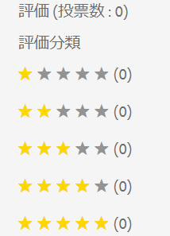

# Adobe Experience Manager 6.5 Service Pack 5の新機能 {#aem-whats-new-service-pack-5}

Adobe Experience Manager 6.5のサービスパックは、新機能、お客様から要望に応えた機能強化、パフォーマンス、安定性、セキュリティの向上を四半期ごとに提供します。 四半期ごとの可用性により、新機能や革新性に容易にアクセスし、導入できます。

この記事では、最新の6.5 Service Packに含まれる機能、以前の6.5 Service Packに含まれる [主な機能](#key-features-previous-service-packs)、Experience Manager 6.5.4.0 [リリース以降の](#key-releases-since-last-sp) 主なリリースの一部について説明します。

## Adobe Experience Managerサイト {#aem-sites}

### アクセシビリティの強化 {#accessibility-sites}

* テキスト情報を追加してエラーレポートを改善。

* キーボードナビゲーション中のユーザーインターフェイスのフォーカスを改善。

* 様々なユーザーインターフェイス要素のコントラスト比が改善されました。

* ページ画像の代替属性の一貫性が向上しました。

* アクセシブルなリッチインターネットアプリケーション(ARIA)のラベルの一貫性が向上しました。

* Non-Visual Desktop Access(NVDA)機能を改善。

* スクリーンリーダーのサポートが強化されました。

### その他の主な機能強化 {#other-enhancements-sites}

* ページツリーをコピーまたは貼り付けるときに、ルートページを貼り付けるか、ルートページをツリーのサブページと共に貼り付けるかを選択できるようになりました。

* [!DNL Adobe Experience Manager Experience Fragments] ワークスペースに書き出したデータは、 [!DNL Adobe Target] で一意のオファータイプとオファーソースとして表示されるようにな [!DNL Target]りました。

* マルチサイトマネージャ — コンポーネントがソースページから削除されている場合、発行トリガーによって、発行済みページからコンポーネントが削除されるようになりました。

* マルチサイトマネージャ — [!UICONTROL ライブコピーのローカルコンポーネントの名前が設計図のコンポーネントの名前と同じで]`_msm_moved` 、コンポーネントが設計図からロールアウトされた場合、ローカルコンポーネントの名前にキーワードが追加されます。

## [!DNL Adobe Experience Manager Assets] {#aem-assets}

### アクセシビリティの強化( [!DNL Assets] {#assets-accessibility}

[!DNL Experience Manager Assets] は、Webコンテンツアクセシビリティガイドライン(WCAG)に準拠してアクセシビリティを強化しました。 次の機能強化により、アクセシビリティが向上しました。

* 多くのユーザーインターフェイス要素、コントロール、ページ、ダイアログは、スクリーンリーダーに適したものです。

* 多くのユーザーインターフェイス要素、コントロール、入力フォームフィールドには、キーボードを使用してアクセスできます。

* 一部のユーザインターフェイス要素の色とコントラストが更新され、視覚が限られたユーザや、色の知覚を持たないユーザが、これらのユーザインターフェイス要素を区別できるようになりました。 例えば、星レーティングアイコンの色(アセットのプ [!UICONTROL ロパティの「] 詳細」タブの「レーティング [!UICONTROL 」セクションやカードの] 表示など  )は、適切なコントラストに合わせて変更されます。

   

### 例外処理の強化 {#exception-handling}

[!DNL Assets] ユーザーインターフェイスフローの例外処理が改善されました。 アセットのディメンションにタイプが指定されていない場合、監視対象の例外がログファイルに記録されます。

### での3Dアセットのサポート [!DNL Dynamic Media] {#support-for-3d}

での3D画像のサポートにより、ユーザーは3Dコンテンツを公開し、Webページやアプリケーションに追加で [!DNL Dynamic Media] きます。 次のサポートが含まれます。

* 共通の3Dアセット形式を公開し、Webページや他のアプリケーションで使用できるアセットURLを生成します。

* パブリッシュした3Dアセットをインタラクティブに表示す [!DNL Adobe Dimension]るための3D Web Viewer。

* WCMコンポーネントを使用して、 [!DNL Experience Manager Sites] ページ上の共通3Dアセットをパブリッシュおよび表示し [!DNL Sites] ます。

## Adobe Experience Manager Forms {#aem-forms}

### Adobe Experience Managerインボックスの列のカスタマイズ {#customize-aem-inbox-columns}

受信トレイをカスタマイズして、 [!DNL Experience Manager] 列の既定のタイトルを変更したり、列の位置を並べ替えたり、ワークフローのデータに基づいて追加の列を表示したりできます。 またはグループのメンバ `administrators``workflow-administrators` ーは、列をカスタマイズできます。

### 対話型通信をドラフトとして保存 {#save-as-draft}

エージェントUIを使用して、各対話型通信用の1つ以上のドラフトを保存し、後でドラフトを取得して、そのドラフトの操作を続行できます。 ドラフトごとに異なる名前を指定して、ドラフトを識別できます。

### [!DNL Oracle WebLogic] アプリケーションサーバーサポート {#weblogic-support}

Adobe Experience Manager Formsでは、JEE上のAdobe Experience Manager Formsのサポート [!DNL Oracle WebLogic 12] が追加されました。 以前のバージョンからアップグレードするか、12.2.1.4以降のJEE上に新しいExperience Manager 6.5 Formsサーバーを設定す [!DNL Oracle WebLogic] ることができます。 後で、マイナーバージョンの変更に対応します。12.2.1.xのxはバージョン番号に置き換えられます。

### アクセシビリティの強化 {#accessibility-improvements}

Adobe Experience Manager Formsでは、次のアクセシビリティの機能強化が行われました。

* アダプティブフォームをHTMLフォームとしてプレビューした場合、「 [!UICONTROL 手書き署名] 」フィールドはタブのフォーカスを保持します。

* アダプティブフォームの送信時に表示されるエラーメッセージに、属性が含まれるようにな `aria-describedBy` りました。 属性は、エラーメッセージで参照されるフィールドに添付されます。 属性は、オブジェクトを記述する要素のIDを示します。 `aria-describedby` ウィジェットまたはグループと、それらを説明するテキストとの間の関係を確立するのに役立ちます。

* アダプティブフォームに必須フィールドが含まれている場合、ARIAアクセシビリティスキーマでは、このようなフィールド `True` の必須属性はに設定されます。

### フォームデータモデルのSOAPベースWebサービス用のX-509証明書ベースの認証 {#x509-based-authentication-soap}

フォームデータモデルで、SOAP Webサービスをデータソースとして使用している場合に、X-509証明書ベースの認証がサポートされるようになりました。

### その他の主な改善点 {#other-improvements}

* JEE上のExperience Manager 6.5 Formsドキュメントセキュリティがに基づくようになり [!DNL Apache Struts 2]ました。

* のサポートを追加し [!DNL Oracle Real Applications Cluster (RAC) 19c]ました。

## 以前のExperience Manager 6.5サービスパックの主な機能 {#key-features-previous-service-packs}

### Experience Manager Sites {#aem-sites-previous-service-packs}

#### スタイルシステムの拡張(6.5.4.0) {#style-system-enhancements}

拡張スタイルシステムを使用して、コンポーネントダイアログ内のスタイルを選択できるようになりました。

#### 様々な領域でのパフォーマンスの向上(6.5.4.0) {#performance-improvements}

* サイト内でContextHubを読み込んで初期化する時間を短縮しました(`contexthub.kernel.js`)。 サイト訪問中のページ読み込みが速くなります。

* ページエディターにドラッグした後にページを更新する時間 [!DNL Experience Fragments] を短縮し [!DNL Sites] ました。

* ライブコピーの概要で200を超えるライブコピーを含む [!DNL Sites] ページへのエントリの読み込み時間を短縮し **[!UICONTROL ました]**。

* 不完全または無効なURLの処理を改善。 このようなURLを使用すると、テンプレートエディターの動作が遅くなる場合があります。

### [!DNL Adobe Experience Manager Assets] {#aem-assets-previous-service-packs}

#### 次 [!DNL Experience Manager Assets] で設定 [!DNL Brand Portal] (6.5.4.0) {#configure-assets-bp}

との間の認証チャネル [!DNL Experience Manager Assets] が変更 [!DNL Brand Portal] されます。 Earlier, [!DNL Brand Portal] was configured in Classic UI via Legacy OAuth Gateway, which uses the JWT token exchange to obtain an IMS Access token for authorization. [!DNL Experience Manager Assets] は、Adobe I/O [!DNL Brand Portal][!DNL Brand Portal] を介して設定され、テナントの認証用にIMSトークンを調達します。

The steps to configure [!DNL Experience Manager Assets] with [!DNL Brand Portal] are different depending on your [!DNL Experience Manager] version, and whether you are configuring for the first time, or upgrading the existing configurations. See [Configure Experience Manager Assets with Brand Portal](https://docs.adobe.com/content/help/ja-JP/experience-manager-brand-portal/using/publish/configure-aem-assets-with-brand-portal.html) for details.

#### Accessibility enhancements (6.5.4.0) {#accessibility-enhancements}

[!DNL Experience Manager Assets] には、次のアクセシビリティの強化が含まれています。

* キーボードの矢印キーを使用して、ズームされた画像内の領域を移動およびパンできます。 詳しくは、キーボードキーのみを使用した [プレビューアセットを参照してください](../assets/managing-assets-touch-ui.md#previewing-assets)。

* フィルターパネル内の混在状態のチェックボックス（ネストされた述語のすべてを選択しない限り、最初のレベルのチェックボックスは選択されず、完全に読み取られます）は、スクリーンリーダーで読み取り可能です。

* 日付と時間の形式に関する制約が日付フィールドのフィールドラベルに設けられ、ユーザーがキーボードを使用して正しい形式で日付を入力できるようになっています。
例えば、`On Time (MM-DD-YYYY HH:mm)` のようになります。MMは2桁の形式の月、YYYYは年、DDは2桁の形式の日、HHは24時間の軍事形式の時、mmは分です。

* スクリーンリーダーは、選択したタグと選択したタグの数を読み上げ、そのタグを削除する `X` 記号を読み上げるようになりました。

#### Visual Search for [!DNL Adobe Experience Manager Assets] (6.5.2.0) {#visual-search}

[!DNL Assets] ユーザーは、視覚的に類似した画像を検索できます。Experience Managerに、ユーザーが選択した画像に類似したDAMリポジトリのスマートタグ付け画像が表示されます。 See [Visual search](../assets/search-assets.md).

### Dynamic Media {#dynamic-media-previous-service-packs}

#### ダイナミックメディア向けスマートイメージング {#smart-imaging}

スマートイメージングでは、各ユーザー固有の視聴特性を使用して、エクスペリエンスに最適化された適切な画像を自動的に提供し、パフォーマンスとエンゲージメントを向上させます。 スマートイメージングは、既存の画像プリセットで機能し、配信の直前にインテリジェンスを使用して、ブラウザーまたはネットワークの接続速度に基づいて画像のファイルサイズをさらに低減します。詳しくは、 [スマートイメージングを参照してください](../assets/imaging-faq.md)。

#### ダイナミックメディア用のビデオプロファイルでのスマート切り抜き(6.5.3.0) {#smart-crop-video}

ビデオのスマート切り抜き（ビデオプロファイルで使用できるオプション機能）は、Adobe Sensei の人工知能機能を使用して、サイズに関係なく、アップロードしたアダプティブビデオやプログレッシブビデオの重要な部分を自動的に検出して切り抜くツールです。See [About using smart crop in video profiles](../assets/video-profiles.md).

### Experience Manager Forms {#aem-forms-previous-service-packs}

#### Experience Manager Formsワークフローで印刷可能な出力を生成する(6.5.4.0) {#generate-printable-output}

印刷可能出力の生成ワークフローステップでは、ソーステンプレートファイルをデータファイルと統合できます。 この統合により、テンプレートファイルの別のコピーを印刷または保存できます。 このステップで、PCL、PostScript、ZPL、IPL、TPCLまたはDPL出力が生成されます。 この機能について詳しくは、「OSGiでの [フォーム中心のワークフロー — ステップリファレンス](../forms/using/aem-forms-workflow-step-reference.md)」を参照してください。

#### レイアウトモードでのアダプティブフォームとインタラクティブな通信の複数列のサポート(6.5.4.0) {#multi-column-adaptive-forms}

アダプティブフォームとインタラクティブな通信で、パネルの列数を定義できるようになりました。 レイアウトモードに切り替えて、新しい複数列オプションを使用します。 詳しくは、レイアウトモードを [使用してコンポーネントのサイズを変更するを参照してください](../forms/using/resize-using-layout-mode.md)。

#### Experience Managerインボックスのカスタマイズ(6.5.4.0) {#aem-inbox}

新しい「管理コントロール」オプションを使用すると、管理者は次のことができます。

* ヘッダーのテキストとロゴをカスタマイズします。

* ヘッダーで使用できるナビゲーションリンクの表示を制御します。

「管理者コントロール」オプションは、 `administrators` またはグループのメンバーにのみ表示され `workflow-administrators` ます。 この機能の詳細については、「受信トレイ 」を参照してください。

#### HTML5フォームでのリッチテキストのサポート(6.5.4.0) {#rich-text-support}

XFAフォームのテキストフィールドをHTML5フォームのリッチテキストフィールドに変換します。 詳しくは、「HTML5フォーム用のフォームテンプレートの [デザイン](../forms/using/designing-form-template.md)」を参照してください。

#### Accessibility enhancements (6.5.4.0) {#forms-accessibility-enhancements-6540}

Experience Manager Formsでは、次のアクセシビリティの強化が行われました。

* スクリーンリーダーは、アダプティブフォームで、チェックボックス、リンク、日付選択、日付入力の各フィールドについて正しく読み上げます。

* アダプティブフォームの各ページに、1つのタイトルと1つのメインのランドマークラベルが含まれるようになりました。

#### Experience Manager Formsユーザー(6.5.3.0)のインボックスアイテムの共有とリクエスト {#share-request-access}

受信トレイの項目を他のユーザーと共有できます。 別のユーザーが受信トレイのアイテムにアクセスできるようになると、そのユーザーは共有アイテムに対して適切なアクションを実行できます。 同様に、他のユーザーからインボックス項目へのアクセスを要求することもできます。 詳しくは、ユーザーのインボックスアイテムの [共有およびアクセスの要求を参照してください](../forms/using/configure-shared-queues-osgi.md)。

#### AEM Formsユーザーのインボックスアイテムに対する不在設定の設定(6.5.3.0) {#configure-out-of-office}

不在にする予定がある場合は、その期間に割り当てられたアイテムに対する処理を指定できます。
不在設定が実施される開始日と時刻および終了日と時刻を指定するオプションがあります。すべてのアイテムを送信するデフォルトのユーザーを設定できます。 「不在設定の [設定](../forms/using/configure-out-of-office-settings.md)」を参照してください。

#### Batch API for AEM Forms(6.5.3.0)を使用して複数のインタラクティブな通信を生成する {#generate-multiple-ic}

Batch APIを使用すると、テンプレートから複数のインタラクティブな通信を作成できます。 テンプレートは、データを一切使用しないインタラクティブな通信です。 Batch APIは、データとテンプレートを組み合わせてインタラクティブな通信を行います。 このAPIは、インタラクティブ通信の大量生産に役立ちます。 例えば、電話料金、複数の顧客のクレジットカード明細などです。 Batch APIを使用した複数の対話型通信の [生成を参照してください](../forms/using/generate-multiple-interactive-communication-using-batch-api.md)。

## Adobe Experience Manager 6.5 SP4以降の主なリリース {#key-releases-since-last-sp}

2020年3月5日～ 2020年6月4日の間に、アドビは、サービスパックと累積修正パックに加え、次の機能をリリースしました。

* [ソフトウェア配布ポータル](https://experience.adobe.com/#/downloads/content/software-distribution/en/aem.html) は、Experience Manager Service Pack、累積Fix Pack、ホットフィックス、およびFeature Packをダウンロードするのに使用できます。

* [!DNL Adobe Experience Manager Cloud Manager] [2020.3.0](https://docs.adobe.com/content/help/en/experience-manager-cloud-manager/using/release-notes/release-notes-2020-3-0.html)、 [2020.4.0](https://docs.adobe.com/content/help/en/experience-manager-cloud-manager/using/release-notes/release-notes-2020-4-0.html)、 [2020.5.0](https://docs.adobe.com/content/help/ja-JP/experience-manager-cloud-manager/using/release-notes/release-notes-current.translate.html)。

* [Experience Managerデスクトップアプリケーション2.0.2.0](https://docs.adobe.com/content/help/en/experience-manager-desktop-app/using/release-notes.html).

* [Experience Manager画面： 機能パック202004](https://docs.adobe.com/content/help/en/experience-manager-screens/user-guide/release-notes/release-notes-fp-202004.html)。

>[!MORELIKETHIS]
>
>* [Adobe Experience Manager 6.5ドキュメント](../user-guide/home.md)
>* [Adobe Experience Manager 6.5の一般的なリリースノート](release-notes.md)
>* [Adobe Experience Manager 6.5用Service Packリリースノート](sp-release-notes.md)

