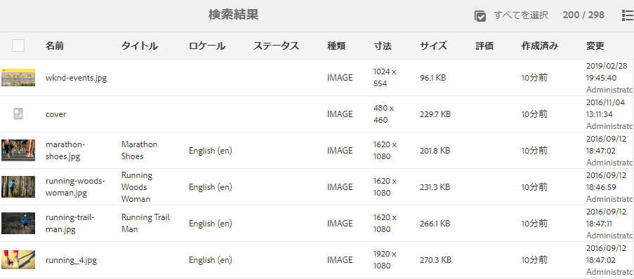

# Adobe Experience Manager6.5 Service Pack 7の新機能{#aem-whats-new-service-pack}

[!DNL Adobe Experience Manager] 6.5サービスパックは、新機能、お客様から要望を受けた機能強化、パフォーマンス、安定性、セキュリティの向上を四半期ごとに提供します。四半期ごとの可用性により、新機能や革新性に容易にアクセスし、導入できます。

この記事では、最新の6.5 Service Packに含まれる機能、以前の6.5 Service Pack](#key-features-previous-service-packs)に含まれる[主な機能、および最後のservice pack](#key-releases-since-last-sp)リリース以降の[キーAEMの機能について説明します。

## アドビ [!DNL Experience Manager Sites] {#aem-sites}

### 展開に使用できるライブコピーページを並べ替え{#sort-livecopy-pages}

[!UICONTROL 名前]、[!UICONTROL 最終変更日]、[!UICONTROL 最終ロールアウト日]の各プロパティを使用して、ロールアウトに使用できるライブコピーページを並べ替えることができるようになりました。 ページの[!UICONTROL 最終ロールアウト日]は、このリリースで導入された新しいプロパティです。

### ページの移動とMSMロールアウトを非同期操作として使用できる{#page-moves-msm-asynchronous}

これで、ページの移動およびMSMロールアウトを非同期操作として実行でき、実行時のパフォーマンスへの影響を軽減できます。 操作を即時に実行するか、後で実行するかをスケジュールできます。 関連するジョブとプロセスステップのステータスがコンソールに表示され、大規模なMSMロールアウトを監視する場合に便利です。

## [!DNL Adobe Experience Manager Assets] {#aem-assets}

* [!DNL Assets] アクセシビリティを [!DNL Dynamic Media] 強化しました。強化された機能は、キーボードナビゲーション、スクリーンリーダーの使用、支援テクノロジー(AT)の使用を可能にする機能強化と似ています。 [[!DNL Assets] enhancements](/help/release-notes/sp-release-notes.md#assets-6570)および[[!DNL Dynamic Media] enhancements](/help/release-notes/sp-release-notes.md#dynamic-media-6570)を参照してください。

* カードと列の表示ーでデジタルアセットを並べ替えることができます。

## [!DNL Adobe Experience Manager Forms] {#aem-forms}

>[!NOTE]
>
>[!DNL Experience Manager Forms] アドオンパッケージは、予定されている [!DNL Experience Manager] Service Packのリリースの1週間後に公開されます。

### パフォーマンスの向上{#performance-improvements-forms}

[!DNL Experience Manager] 6.5 Service Pack 7Formsは、次の点でパフォーマンスが向上しました。

* アダプティブフォームを送信する際に、サーバー上のフィールド値を検証する。

* [!DNL Automated Forms Conversion service]を使用してPDFフォームをアダプティブフォームに変換する。

### フォームデータモデルHTTPクライアント構成によるパフォーマンスの最適化{#fdm-http-client-config}

[!DNL Experience Manager Forms] フォームデータモデルを使用して、データソースとしてRESTful Webサービスとの統合時に、パフォーマンスを最適化するためのHTTPクライアント設定が含まれるようになりました。[データソースの設定](../../help/forms/using/configure-data-sources.md#fdm-http-client-configuration)を参照してください。

### レイアウトモード{#reset-option-layout-mode}で各コンポーネントのリセットオプションを使用できる

アダプティブフォームのレイアウトモードで各コンポーネントに対してリセットオプションを使用できるようになりました。 パネルに複数列レイアウトを定義する場合、この機能を使用してパネル内の個々のコンポーネントをリセットできます。 詳しくは、[レイアウトモードを使用したコンポーネントのサイズ変更](../../help/forms/using/resize-using-layout-mode.md#resize-components)を参照してください。

## 以前の[!DNL Experience Manager] 6.5サービスパック{#key-features-previous-service-packs}の主な機能

### [!DNL Experience Manager Sites] {#aem-sites-previous-service-packs}

#### 非同期モード(6.5.6.0)でのページ移動操作の可用性{#page-move-asynchronous}

「ページ移動」操作を非同期モードで使用できるようになりました。 即時実行に加えて、後で実行できるようにPage Move操作をスケジュールすることもできます。

#### アクセシビリティの向上(6.5.5.0) {#accessibility-sites}

* テキスト情報を追加してエラーレポートを改善。

* キーボードナビゲーション中のユーザーインターフェイスのフォーカスを改善。

* 様々なユーザーインターフェイス要素のコントラスト比が改善されました。

* ページ画像の代替属性の一貫性が向上しました。

* アクセシブルなリッチインターネットアプリケーション(ARIA)のラベルの一貫性が向上しました。

* Non-Visual Desktop Access(NVDA)機能を改善。

* スクリーンリーダーのサポートが強化されました。

#### その他の主な改良点(6.5.5.0) {#other-enhancements-sites}

* CRXDE Liteへの匿名アクセスは、セキュリティを強化するために許可されていません。 代わりに、ユーザーはログイン画面に誘導されます。 [CRXDE Liteを使用した開発](/help/sites-developing/developing-with-crxde-lite.md)を参照してください。

* ページツリーをコピーまたは貼り付けるときに、ルートページを貼り付けるか、ルートページをツリーのサブページと共に貼り付けるかを選択できるようになりました。

* [!DNL Adobe Experience Manager Experience Fragments] ワーク [!DNL Adobe Target] スペースに書き出されたデータは、で一意のオファータイプおよびオファーソースとして表示されるようにな [!DNL Target]りました。

* マルチサイトマネージャ — コンポーネントがソースページから削除されている場合、発行トリガーによって、発行済みページからコンポーネントが削除されるようになりました。

* マルチサイトマネージャ — [!UICONTROL ライブコピー]内のローカルコンポーネントの名前がブループリント内のコンポーネントの名前と同じで、コンポーネントがブループリントからロールアウトされた場合、ローカルコンポーネントの名前に`_msm_moved`が追加されます。

#### スタイルシステムの拡張(6.5.4.0) {#style-system-enhancements}

拡張スタイルシステムを使用して、コンポーネントダイアログ内のスタイルを選択できるようになりました。

#### 様々な領域(6.5.4.0)でのパフォーマンスの向上{#performance-improvements}

* サイト内でContextHubを読み込んで初期化する時間を短縮しました(`contexthub.kernel.js`)。 サイト訪問中のページ読み込みが速くなります。

* [!DNL Experience Fragments]を[!DNL Sites]ページエディターにドラッグした後にページを更新する時間を短縮。

* **[!UICONTROL ライブコピーの概要]**&#x200B;で200を超えるライブコピーを含む、[!DNL Sites]ページのエントリの読み込み時間を短縮。

* 不完全または無効なURLの処理を改善。 このようなURLを使用すると、テンプレートエディターの動作が遅くなる場合があります。

### [!DNL Adobe Experience Manager Assets] {#aem-assets-previous-service-packs}

#### アクセシビリティの強化(6.5.6.0) {#accessibility-assets-6560}

* **キーボードナビゲーション中のユーザーインターフェイスフォーカスの強化(例**:

   * `x` アイコン(タイ [!UICONTROL ムライン内のアセットの] Version  [!UICONTROL Previewダイアログ内)]。

   * 対応可能なユーザーインターフェイスオプション。

   * [!UICONTROL リンクを共有]ダイアログの電子メールフィールド、およびフォルダー[!UICONTROL プロパティ]の[!UICONTROL 権限]タブに閉じたユーザーグループを追加するフィールド。

* **キーボードキーを使用した機能の強化**

   スクリーンリーダーのブラウズモードでは、キーボードキーを使用して、メタデータスキーマフォームエディターのコントロールをドラッグできます。

* **次の点が理由で、スクリーンリーダーユーザーの使い勝手が向上しました**。

   * スクリーンリーダーは、ビデオプレーヤーとオーディオプレーヤーの目的を読み上げます。

   * スクリーンリーダーは、アセット[!UICONTROL プロパティ]の[!UICONTROL タグ選択ダイアログ]を使用して選択したタグを削除するユーザーインターフェイスオプションの目的を読み上げます。

   * スクリーンリーダーはテーブルの行ヘッダーと行項目を読み上げるので、ユーザーは同じ行に属するエントリを把握できます。

   * 検索ページのわかりやすいページタイトル。

   * スクリーンリーダーは、検索フィルターパネルのオプションを拡大可能なアコーディオンとして読み上げます。

#### [!DNL Assets] (6.5.6.0) {#other-enhancements-assets-6560}のその他の改良点

* フォルダー（プライベートおよび非プライベート）に関連付けられたユーザーグループは、[これらのフォルダー](/help/assets/private-folder.md#delete-private-folder)の削除時に、リポジトリから削除されるようになりました。 ただし、既存の冗長、親なし、未使用、自動生成のユーザーグループは、JMXを使用してリポジトリから削除できます。

#### [!DNL Assets] (6.5.5.0) {#assets-accessibility}のアクセシビリティの強化

[!DNL Experience Manager Assets] は、Webコンテンツアクセシビリティガイドライン(WCAG)に準拠してアクセシビリティを強化しました。次の機能強化により、アクセシビリティが向上しました。

* 多くのユーザーインターフェイス要素、コントロール、ページ、ダイアログは、スクリーンリーダーに適しています。

* 多くのユーザーインターフェイス要素、コントロール、入力フォームフィールドには、キーボードを使用してアクセスできます。

* 一部のユーザインターフェイス要素の色とコントラストが更新され、視覚が限られたユーザや、色の知覚を持たないユーザが、これらのユーザインターフェイス要素を区別できるようになりました。例えば、星評価アイコンの色(アセット[!UICONTROL プロパティ]またはカード表示の[!UICONTROL 詳細]タブの[!UICONTROL 定格]セクションなど)は、適切なコントラストを得るために変更されます。

   

#### 拡張された例外処理(6.5.5.0) {#exception-handling}

[!DNL Assets] ユーザーインターフェイスフローの例外処理が改善されました。アセットのディメンションにタイプが指定されていない場合、監視対象の例外がログファイルに記録されます。

#### [!DNL Dynamic Media] (6.5.5.0) {#support-for-3d}での3Dアセットのサポート

[!DNL Dynamic Media]での3D画像のサポートにより、ユーザーは3DコンテンツをWebページやアプリケーションに投稿したり、追加したりできます。 次のサポートが含まれます。

* 共通の3Dアセット形式を公開し、Webページや他のアプリケーションで使用できるアセットURLを生成します。

* [!DNL Adobe Dimension]を利用した、パブリッシュされた3Dアセットのインタラクティブな表示のための3D Web Viewer。

* [!DNL Sites] WCMコンポーネントを使用して、[!DNL Experience Manager Sites]ページ上の共通の3Dアセットをパブリッシュし、表示します。

#### [!DNL Experience Manager Assets]を[!DNL Brand Portal] (6.5.4.0) {#configure-assets-bp}に設定

[!DNL Experience Manager Assets]と[!DNL Brand Portal]の間の認証チャネルが変更されます。 以前は、[!DNL Brand Portal]は従来のOAuth Gateway経由でClassic UIに設定されていました。従来のOAuth Gatewayは、JWTトークン交換を使用して認証用のIMSアクセストークンを取得します。 [!DNL Experience Manager Assets] が、 [!DNL Brand Portal] 経由でAdobe I/Oに設定されました。これにより、 [!DNL Brand Portal] テナントの認証用にIMSトークンが調達されます。

[!DNL Experience Manager Assets]を[!DNL Brand Portal]に設定する手順は、[!DNL Experience Manager]のバージョン、および初めて設定するか、既存の設定をアップグレードするかによって異なります。 詳しくは、[Brand PortalでのExperience Managerアセットの設定](https://docs.adobe.com/content/help/ja-JP/experience-manager-brand-portal/using/publish/configure-aem-assets-with-brand-portal.html)を参照してください。

#### アクセシビリティの強化(6.5.4.0) {#accessibility-enhancements}

[!DNL Experience Manager Assets] には、次のアクセシビリティの強化が含まれています。

* キーボードの矢印キーを使用して、ズームされた画像内の領域を移動およびパンできます。 詳しくは、[キーボードキーを使用したプレビューアセットのみ](../assets/manage-assets.md#previewing-assets)を参照してください。

* フィルターパネル内の混在状態のチェックボックス（ネストされた述語のすべてを選択しない限り、最初のレベルのチェックボックスは選択されず、完全に読み取られます）は、スクリーンリーダーで読み取り可能です。

* 日付と時間の形式に関する制約が日付フィールドのフィールドラベルに設けられ、ユーザーがキーボードを使用して正しい形式で日付を入力できるようになっています。
例えば、`On Time (MM-DD-YYYY HH:mm)` のようになります。MMは2桁の形式の月、YYYYは年、DDは2桁の形式の日、HHは24時間の軍事形式の時、mmは分です。

* スクリーンリーダーは、選択したタグ（`X`記号）と選択したタグの数を削除するオプションを読み上げます。

#### リスト表示内のアセットの作成日の並べ替え可能な列(6.5.3.0) {#sortable-date-created-column}

作成したアセットの日付の並べ替えが可能な新しい列が、DAMリスト表示およびリスト表示のアセット検索結果に追加されます。

#### [!DNL Adobe Experience Manager Assets] (6.5.2.0) {#visual-search}のビジュアル検索

[!DNL Assets] ユーザーは、視覚的に類似した画像を検索できます。Experience Managerは、ユーザーが選択した画像に類似した、DAMリポジトリのスマートタグ付け画像を表示します。 「[ビジュアル検索](../assets/search-assets.md)」を参照してください。

### Dynamic Media {#dynamic-media-previous-service-packs}

#### CDNキャッシュコンテンツ(6.5.6.0)を無効にする{#invalidate-cdn-cached-content}

[!DNL Dynamic Media]ユーザーインターフェイスを使用して、コンテンツ配信ネットワーク(CDN)のキャッシュされたコンテンツを無効にできるようになりました。 その結果、キャッシュの期限が切れるのを待つ代わりに、更新されたアセットを即座に使用できます。 CDNは次の方法で無効にできます。

* CDN無効化テンプレートの作成：アセットとフォームに関連付けられたテンプレートベースのURLの選択

* アセット選択を使用したアセットと関連プリセットの選択

* 完全なアセットURLの追加

#### [!DNL Experience Manager]と[!DNL Dynamic Media] (6.5.6.0) {#selective-publishing}にアセットを選択的に公開

[!UICONTROL クイック発行]ウィザードまたは[!UICONTROL パブリケーションの管理]ウィザードを使用して、[!DNL Experience Manager]または[!DNL Dynamic Media]に対するアセットの発行と非公開を選択できるようになりました。 `Publish`モードまたは`Unpublish`モードをフォルダーレベルで設定することもできます。

#### Dynamic Media向けスマートイメージング{#smart-imaging}

スマートイメージングでは、各ユーザー固有の視聴特性を使用して、エクスペリエンスに最適化された適切な画像を自動的に提供し、パフォーマンスとエンゲージメントを向上させます。 スマートイメージングは、既存の画像プリセットで機能し、配信の直前にインテリジェンスを使用して、ブラウザーまたはネットワークの接続速度に基づいて画像のファイルサイズをさらに低減します。[スマートイメージング](../assets/imaging-faq.md)を参照してください。

#### Dynamic Media向けビデオプロファイル(6.5.3.0) {#smart-crop-video}のスマート切り抜き

ビデオのスマート切り抜き（ビデオプロファイルで使用できるオプション機能）は、Adobe Sensei の人工知能機能を使用して、サイズに関係なく、アップロードしたアダプティブビデオやプログレッシブビデオの重要な部分を自動的に検出して切り抜くツールです。詳しくは、[ビデオプロファイルでのスマート切り抜きの使用について](../assets/video-profiles.md)を参照してください。

### Experience Manager Forms {#aem-forms-previous-service-packs}

#### クライアント(6.5.6.0)でアダプティブフォームに事前入力する{#prefill-merge-data-at-client}

アダプティブフォームに事前入力すると、[!DNL Experience Manager Forms]サーバーはデータをアダプティブフォームにマージし、入力済みのフォームをユーザーに配信します。 デフォルトでは、データの結合アクションはサーバーで実行されます。
これで、[!DNL Experience Manager Forms]サーバーを[に設定して、サーバーではなくクライアント](../../help/forms/using/prepopulate-adaptive-form-fields.md)でデータマージ操作を実行できるようになりました。 これにより、アダプティブフォームの事前入力とレンダリングに要する時間が大幅に短縮されます。

#### 双方向SSL実装(6.5.6.0)を使用したサーバー上のRESTful APIとのフォームデータモデル統合(6.5.6.0) {#fdm-integration-rest-apis-two-way-ssl}

[!DNL Experience Manager Forms] フォームデータモデルは、双方向SSLが実装されたサーバー上のRESTful APIと [統合できるようになりました](../../help/forms/using/configure-data-sources.md)。

#### automated forms conversionサービス(6.5.6.0){#sign-integration-acroform-afcs}の[!DNL Adobe Sign]テキストタグのサポートを追加しました。

AcroFormに[!DNL Adobe Sign]テキストタグが含まれる場合、これらのフィールドは、[!DNL Automated Forms Conversion service]を使用して変換されたアダプティブフォームでは[!DNL Adobe Sign]フィールドとして認識され、表現されるようになりました。 署名者は、アダプティブフォームの署名時にこのようなフィールドに入力できます。

#### 色付きPDF formsのアダプティブフォーム(6.5.6.0)への変換のサポート{#colored-PDF-forms}

[!DNL Automated Forms Conversion service]を使用すると、色付きのPDF formsをアダプティブフォームに変換できます。

#### SMB 2およびSMB 3プロトコル(6.5.6.0)のサポート{#smb-support}

[!DNL Experience Manager Forms] 現在は、SMB 2およびSMB 3プロトコルをサポートしています。

#### 翻訳済みアダプティブフォームページのキャッシュの強化(6.5.6.0) {#enhanced-caching-translated-adaptive-forms}

アダプティブフォームURL](../../help/forms/using/supporting-new-language-localization.md)の引数の代わりに、アダプティブフォームURLのセレクターとして[ロケールを指定できるようになりました。 変換済みのアダプティブフォームを[!DNL Experience Manager Dispatcher]にキャッシュするのに役立ちます。 変換済みのアダプティブフォームは、以前のバージョンではキャッシュできませんでした。 アダプティブフォームURLでロケールをセレクターとして使用するためのキャッシュの設定について詳しくは、「[ディスパッチャー](../../help/forms/using/configure-adaptive-forms-cache.md)でアダプティブフォームのキャッシュを設定する」を参照してください。

#### フォームデータモデルサービスの出力を変数(6.5.6.0)に保存{#save-fdm-service-to-variable}

フォームデータモデルを使用すると、フォームデータモデルサービスの出力を変数に保存できます。 [!DNL Experience Manager Forms] フォームデータモデルサービスの型を変数の型に自動的にマッピングするようになりました。

#### 添付ファイルコンポーネント(6.5.6.0)に複数のファイルを添付{#attach-multiple-files}

複数のファイル[をアダプティブフォームの[!UICONTROL 添付ファイル]コンポーネントに&lt;a0/>添付できるようになりました。](../../help/forms/using/introduction-forms-authoring.md)

#### [Adobe Experience Manager受信トレイ]列(6.5.5.0)をカスタマイズする{#customize-aem-inbox-columns}

[!DNL Experience Manager]受信トレイをカスタマイズして、列のデフォルトのタイトルを変更したり、列の位置を並べ替えたり、ワークフローのデータに基づいて列を追加表示したりできます。 `administrators`または`workflow-administrators`グループのメンバーは、列をカスタマイズできます。 詳しくは、[管理コントロール](../sites-authoring/inbox.md#inbox-admin-control)を参照してください。

#### 対話型通信をドラフトとして保存(6.5.5.0) {#save-as-draft}

エージェントUIを使用して、各対話型通信用の1つ以上のドラフトを保存し、後でドラフトを取得して、そのドラフトの操作を続行できます。 ドラフトごとに異なる名前を指定して、ドラフトを識別できます。 詳しくは、「[対話型通信をドラフトとして保存](../forms/using/prepare-send-interactive-communication.md#save-as-draft)」を参照してください。

#### [!DNL Oracle WebLogic] アプリケーションサーバーのサポート(6.5.5.0)  {#weblogic-support}

Adobe Experience Manager FormsはJEE上のAdobe Experience Manager Formsの[!DNL Oracle WebLogic 12]のサポートを追加しました。 以前のバージョンからアップグレードするか、JEEサーバー上の新しいExperience Manager6.5Formsを[!DNL Oracle WebLogic] 12.2.1.4以降にセットアップできます。 後で、マイナーバージョンの変更に対応します。12.2.1.xのxはバージョン番号に置き換えられます。

#### アクセシビリティの向上(6.5.5.0) {#accessibility-improvements}

Adobe Experience Manager Formsでは、次のアクセシビリティの強化が行われました。

* ユーザーがHTMLフォームとしてアダプティブフォームをプレビューした場合、[!UICONTROL 手書き署名]フィールドはタブのフォーカスを保持します。

* アダプティブフォームの送信時に表示されるエラーメッセージには、`aria-describedBy`属性が含まれるようになりました。 属性は、エラーメッセージで参照されるフィールドに添付されます。 `aria-describedby`属性は、オブジェクトを記述する要素のIDを示します。 ウィジェットまたはグループと、それらを説明するテキストとの間の関係を確立するのに役立ちます。

* アダプティブフォームに必須フィールドが含まれている場合、ARIAアクセシビリティスキーマでは、このようなフィールドの必須属性は`True`に設定されます。

#### フォームデータモデル(6.5.5.0) {#x509-based-authentication-soap}内のSOAPベースのWebサービス用のX-509証明書ベースの認証

フォームデータモデルで、SOAP Webサービスをデータソースとして使用している場合に、X-509証明書ベースの認証がサポートされるようになりました。 詳しくは、「[SOAP Webサービスの設定](../forms/using/configure-data-sources.md#configure-soap-web-services)」を参照してください。

#### その他の主な改善点(6.5.5.0) {#other-improvements}

* JEE上のExperience Manager6.5Formsドキュメントセキュリティは、[!DNL Apache Struts 2]に基づくようになりました。

* [!DNL Oracle Real Applications Cluster (RAC) 19c]のサポートを追加しました。

#### Experience ManagerFormsワークフロー(6.5.4.0) {#generate-printable-output}で印刷可能出力を生成

印刷可能出力の生成ワークフローステップでは、ソーステンプレートファイルをデータファイルと統合できます。 この統合により、テンプレートファイルの別のコピーを印刷または保存できます。 このステップで、PCL、PostScript、ZPL、IPL、TPCLまたはDPL出力が生成されます。 この機能について詳しくは、[OSGiでのForms中心のワークフロー — ステップリファレンス](../forms/using/aem-forms-workflow-step-reference.md)を参照してください。

#### レイアウトモード(6.5.4.0)でのアダプティブフォームとインタラクティブ通信の複数列のサポート{#multi-column-adaptive-forms}

アダプティブフォームとインタラクティブな通信で、パネルの列数を定義できるようになりました。 レイアウトモードに切り替えて、新しい複数列オプションを使用します。 詳しくは、[レイアウトモードを使用してコンポーネントのサイズを変更する](../forms/using/resize-using-layout-mode.md)を参照してください。

#### Experience Managerインボックスのカスタマイズ(6.5.4.0) {#aem-inbox}

新しい「管理コントロール」オプションを使用すると、管理者は次のことができます。

* ヘッダーのテキストとロゴをカスタマイズします。

* ヘッダーで使用できるナビゲーションリンクの表示を制御します。

「管理者コントロール」オプションは、`administrators`または`workflow-administrators`グループのメンバーにのみ表示されます。 この機能の詳細については、「[受信トレイ](../sites-authoring/inbox.md)」を参照してください。

#### HTML5フォーム(6.5.4.0)でのリッチテキストのサポート{#rich-text-support}

XFAフォームのテキストフィールドをHTML5フォームのリッチテキストフィールドに変換します。 詳しくは、「[HTML5フォームのフォームテンプレートのデザイン](../forms/using/designing-form-template.md)」を参照してください。

#### アクセシビリティの強化(6.5.4.0) {#forms-accessibility-enhancements-6540}

Experience ManagerFormsには、次のアクセシビリティの強化が含まれています。

* スクリーンリーダーは、アダプティブフォームで、チェックボックス、リンク、日付選択、日付入力の各フィールドについて正しく読み上げます。

* アダプティブフォームの各ページに、1つのタイトルと1つのメインのランドマークラベルが含まれるようになりました。

#### Experience ManagerFormsユーザー(6.5.3.0) {#share-request-access}の受信トレイアイテムを共有し、アクセスを要求する

受信トレイの項目を他のユーザーと共有できます。 別のユーザーが受信トレイのアイテムにアクセスできるようになると、そのユーザーは共有アイテムに対して適切なアクションを実行できます。 同様に、他のユーザーからインボックス項目へのアクセスを要求することもできます。 [ユーザーのインボックス項目へのアクセスを共有して要求する](../forms/using/configure-shared-queues-osgi.md)を参照してください。

#### Experience ManagerFormsユーザー(6.5.3.0) {#configure-out-of-office}の受信トレイ項目の不在設定を構成します

不在にする予定がある場合は、その期間に割り当てられたアイテムに対する処理を指定できます。
不在設定が実施される開始日と時刻および終了日と時刻を指定するオプションがあります。すべてのアイテムを送信するデフォルトのユーザーを設定できます。 「[不在設定の構成](../forms/using/configure-out-of-office-settings.md)」を参照してください。

#### Experience ManagerForms(6.5.3.0) {#generate-multiple-ic}のBatch APIを使用して複数の対話型通信を生成する

Batch APIを使用すると、テンプレートから複数のインタラクティブな通信を作成できます。 テンプレートは、データを一切使用しないインタラクティブな通信です。 Batch APIは、データとテンプレートを組み合わせてインタラクティブな通信を行います。 このAPIは、インタラクティブ通信の大量生産に役立ちます。 例えば、電話料金、複数の顧客のクレジットカード明細などです。 [Batch APIを使用した複数の対話型通信の生成](../forms/using/generate-multiple-interactive-communication-using-batch-api.md)を参照してください。

## Adobe Experience Manager6.5 SP6 {#key-releases-since-last-sp}以降の主なリリース

2020年9月3日～ 2020年11月26日の間に、Adobeは、サービスパックおよび累積修正パックに加え、次の機能をリリースしました。

* [!DNL Adobe Experience Manager] をCloud Service2020.9.0 [および](https://experienceleague.adobe.com/docs/experience-manager-cloud-service/release-notes/release-notes/release-notes-2020-9-0.html?lang=en#release-notes) 2020.10.0 [と](https://experienceleague.adobe.com/docs/experience-manager-cloud-service/release-notes/release-notes/release-notes-2020-10-0.html?lang=en#release-notes)して使用する場合。

* [[!DNL Experience Manager] デスクトップアプリ2.0 (2.0.3.2)](https://experienceleague.adobe.com/docs/experience-manager-desktop-app/using/release-notes.html)。

* [WKNDリファレンスサイト — 0.0.6](https://github.com/adobe/aem-guides-wknd/releases/tag/aem-guides-wknd-0.0.6)

* [Experience Manager Screens:機能パック202011](https://experienceleague.adobe.com/docs/experience-manager-screens/user-guide/release-notes/release-notes-fp-202011.html)

* [Adobeアセットリンクv2.2](https://helpx.adobe.com/enterprise/admin-guide.html/enterprise/using/adobe-asset-link.ug.html)

>[!MORELIKETHIS]
>
>* [[!DNL Adobe Experience Manager] 6.5ドキュメント](../user-guide/home.md)
>* [6. [!DNL Adobe Experience Manager] 5の一般的なリリースノート](release-notes.md)
>* [Service Packリリースノート [!DNL Adobe Experience Manager] 6.5](sp-release-notes.md)

