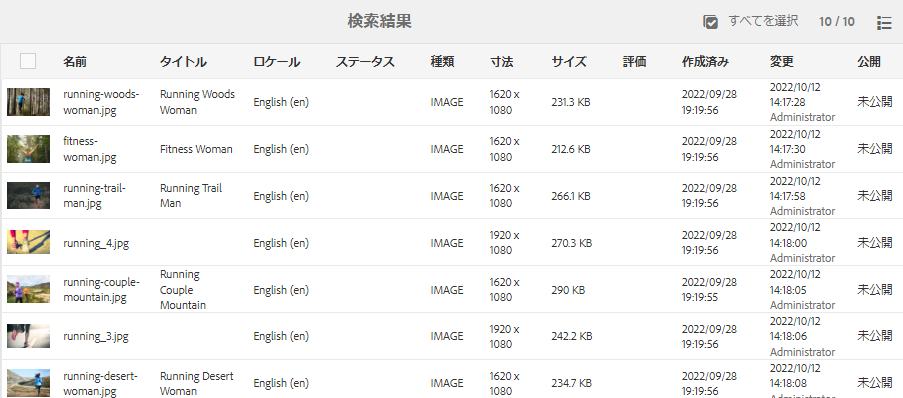

# [!DNL Adobe Experience Manager] 6.5 Service Pack 8 {#aem-whats-new-service-pack}の新機能

[!DNL Adobe Experience Manager] 6.5サービスパックは、新機能、お客様から要望を受けた機能強化、パフォーマンス、安定性、セキュリティの改善を四半期ごとに提供します。四半期ごとの可用性により、新機能やイノベーションに容易にアクセスし、採用できます。

この記事では、最新のサービスパックに含まれる機能、以前の6.5サービスパック](#key-features-previous-service-packs)に含まれる主な機能、および前回のサービスパック](#key-releases-since-last-sp)リリース以降の[キーリリースについて説明します。[

## [!DNL Adobe Experience Manager Sites] {#aem-sites}

### ロールアウト可能なライブコピーページを並べ替え{#sort-livecopy-pages}

[!UICONTROL 名前]、[!UICONTROL 最終変更日]および[!UICONTROL 最終ロールアウト日]の各プロパティを使用して、ロールアウトに使用できるライブコピーページを並べ替えることができるようになりました。 ページの[!UICONTROL 最終ロールアウト日]は、このリリースで導入された新しいプロパティです。

## [!DNL Adobe Experience Manager Assets] {#aem-assets}

* [Connected Assets機能](/help/assets/use-assets-across-connected-assets-instances.md)を使用する場合、そのアセットを使用するすべての[!DNL Sites]ページのリストを表示できるようになりました。 アセットへのこれらの参照は、アセットの[!UICONTROL プロパティ]ページで使用できます。 これにより、管理者、マーケター、ライブラリ担当者がアセットの使用状況を完全に把握でき、トラッキング、管理、ブランドの一貫性を向上させることができます。

* Webページで参照されているアセットを削除すると、[!DNL Experience Manager]に警告が表示されます。 参照元のアセットを強制的に削除するか、アセットの[!DNL Properties]ページに表示される参照を確認して変更できます。 参照をクリックすると、ローカルページとリモートページの[!DNL Sites]が開きます。

## [!DNL Adobe Experience Manager Forms] {#aem-forms}

>[!NOTE]
>
>[!DNL Experience Manager Forms]のアドオンパッケージは、スケジュールされた[!DNL Experience Manager] Service Packリリースの1週間後に提供されます。

### ルール{#show-hide-captcha}に基づくアダプティブフォーム内のCAPTCHAコンポーネントの表示/非表示を切り替えます。

アダプティブフォーム送信時またはユーザーアクション時に、CAPTCHAを検証できるようになりました。 また、ルールに基づいてアダプティブフォーム内のCAPTCHAコンポーネントの表示と非表示を切り替えるための条件を追加して、ユーザーアクションでCAPTCHAを検証することもできます。

### カスタム CAPTCHA サービスの追加 {#add-custom-captcha-services}

[!DNL Experience Manager Forms] は、Google reCAPTCHA（Google reCAPTCHA APIの別のライセンスが必要）をCAPTCHA検証サービスとして使用するための標準サポートを提供します。また、カスタムCAPTCHAサービスを使用してCAPTCHAを検証することもできます。

### その他の機能強化 {#other-enhancements-forms-6580}

* [!DNL Experience Manager Forms]日付選択コンポーネントのアクセシビリティを改善しました。

* PrintChannel APIを使用してPCL形式のインタラクティブ通信を生成するサポートを追加しました。

* PDFG変換を実行する際に、カスタムブックマーク生成用の[!DNL Experience Manager Forms]レジストリの変更を有効または無効にできるようになりました。

## 以前の[!DNL Experience Manager] 6.5サービスパック{#key-features-previous-service-packs}の主な機能

### [!DNL Experience Manager Sites] {#aem-sites-previous-service-packs}

#### ページ移動およびMSMロールアウトが非同期操作(6.5.7.0)として使用可能({#page-moves-msm-asynchronous})

これで、ページの移動およびMSMロールアウトを非同期操作として実行し、実行時のパフォーマンスへの影響を軽減できます。 操作を即時または後で実行するようにスケジュールできます。 関連するジョブとプロセスステップのステータスは、コンソールに表示されます。これは、大規模なMSMロールアウトの監視に役立ちます。

#### 非同期モード(6.5.6.0)でのページ移動操作の可用性{#page-move-asynchronous}

非同期モードでページ移動操作を使用できるようになりました。 即時実行に加えて、後で実行するように「ページ移動」操作をスケジュールすることもできます。

#### アクセシビリティの改善(6.5.5.0) {#accessibility-sites}

* テキスト情報を追加することでエラーレポートを改善しました。

* キーボードナビゲーション中のユーザーインターフェイスのフォーカスを改善。

* 様々なユーザーインターフェイス要素のコントラスト比が改善されました。

* ページ画像の代替属性の一貫性が向上しました。

* アクセシブルなリッチインターネットアプリケーション(ARIA)ラベルの一貫性が向上しました。

* 非ビジュアルデスクトップアクセス(NVDA)機能の改善

* スクリーンリーダーのサポートを改善しました。

#### その他の主な機能強化(6.5.5.0) {#other-enhancements-sites}

* セキュリティを強化するために、CRXDE Liteへの匿名アクセスは許可されていません。 代わりに、ユーザーはログイン画面に移動します。 [CRXDE Lite](/help/sites-developing/developing-with-crxde-lite.md)を使用した開発を参照してください。

* ページツリーをコピーまたは貼り付ける際に、ルートページを貼り付けるか、ルートページをツリーのサブページと貼り付けるかのどちらかのオプションが追加されました。

* [!DNL Adobe Experience Manager Experience Fragments] ワークスペースに書き [!DNL Adobe Target] 出されたが、で一意のオファータイプおよびオファーソースとして表示されるようになり [!DNL Target]ました。

* マルチサイトマネージャー — パブリッシュトリガーで、コンポーネントがソースページから削除された場合に、公開されたページからコンポーネントが削除されるようになりました。

* マルチサイトマネージャー — [!UICONTROL ライブコピー]内のローカルコンポーネントの名前がブループリント内のコンポーネントの名前と同じで、コンポーネントがブループリントからロールアウトされる場合、ローカルコンポーネントの名前に`_msm_moved`が追加されます。

#### スタイルシステムの強化(6.5.4.0) {#style-system-enhancements}

拡張スタイルシステムを使用して、コンポーネントダイアログ内のスタイルを選択できるようになりました。

#### 様々な領域でのパフォーマンス向上(6.5.4.0) {#performance-improvements}

* サイト内でのContextHubの読み込みと初期化に要する時間が短縮されました(`contexthub.kernel.js`)。 これにより、サイト訪問中のページ読み込みが高速になります。

* [!DNL Experience Fragments]を[!DNL Sites]ページエディターにドラッグした後にページを更新する時間を短縮しました。

* **[!UICONTROL ライブコピーの概要]**&#x200B;で200を超えるライブコピーがあり、[!DNL Sites]ページのエントリの読み込み時間が短縮されました。

* 不完全なURLまたは無効なURLの処理を改善しました。 このようなURLを使用すると、テンプレートエディターの速度が低下する可能性があります。

### [!DNL Adobe Experience Manager Assets] {#aem-assets-previous-service-packs}

* [!DNL Assets] およびで [!DNL Dynamic Media] は、複数のアクセシビリティ強化がおこなわれています。この機能強化は、キーボードナビゲーション、スクリーンリーダーの使用、支援テクノロジー(AT)を使用するための同様の機能強化に関連しています。 [[!DNL Assets] enhancements](/help/release-notes/sp-release-notes.md#assets-6570)および[[!DNL Dynamic Media] enhancements](/help/release-notes/sp-release-notes.md#dynamic-media-6570)(6.5.7.0)を参照してください。

* カード表示および列表示(6.5.7.0)でデジタルアセットを並べ替えることができます。

#### アクセシビリティの強化(6.5.6.0) {#accessibility-assets-6560}

* **キーボードナビゲーション中のユーザーインターフェイスフォーカスの強化**（例：次の操作にフォーカス）。

   * `x` アイコン( [!UICONTROL タイム] ライン内のアセットのバージョンプ [!UICONTROL レビューダイアログ])

   * 実用的なユーザーインターフェイスオプション

   * [!UICONTROL リンクを共有]ダイアログの電子メールフィールドと、閉じられたユーザーグループをフォルダー[!UICONTROL プロパティ]の「[!UICONTROL 権限]」タブに追加するフィールド。

* **キーボードキーを使用した機能強化**

   キーボードのキーを使用して、スクリーンリーダーの参照モードでメタデータスキーマフォームエディターのコントロールをドラッグできます。

* **次の理由により、スクリーンリーダーユーザーの操作性が向上しました**。

   * スクリーンリーダーは、ビデオプレーヤーとオーディオプレーヤーの目的を読み上げます。

   * スクリーンリーダーは、アセット[!UICONTROL プロパティ]の[!UICONTROL タグ選択ダイアログ]を使用して選択されたタグを削除するユーザーインターフェイスオプションの目的を読み上げます。

   * スクリーンリーダーは、テーブルの行ヘッダーと行項目を読み上げるので、ユーザーは、同じ行に属するエントリを把握できます。

   * 検索ページのわかりやすいページタイトル。

   * スクリーンリーダーは、検索フィルターパネルのオプションを拡大可能なアコーディオンとして読み上げます。

#### [!DNL Assets](6.5.6.0) {#other-enhancements-assets-6560}のその他の機能強化

* フォルダーに関連付けられたユーザーグループ（プライベートおよび非プライベート）が、[これらのフォルダー](/help/assets/private-folder.md#delete-private-folder)の削除時にリポジトリから削除されるようになりました。 ただし、既存の冗長な、孤立した、未使用の、自動生成されたユーザーグループは、JMXを使用してリポジトリから削除できます。

#### [!DNL Assets](6.5.5.0) {#assets-accessibility}のアクセシビリティの強化

[!DNL Experience Manager Assets] は、Webコンテンツアクセシビリティガイドライン(WCAG)に準拠してアクセシビリティを強化しました。次の機能強化により、アクセシビリティが向上しました。

* 多くのユーザーインターフェイス要素、コントロール、ページ、ダイアログは、スクリーンリーダーに適しています。

* 多くのユーザーインターフェイス要素、コントロールおよび入力フォームフィールドは、キーボードを使用してアクセスできます。

* 一部のユーザインターフェイス要素の色とコントラストが更新され、視覚が限られたユーザや、色の知覚を持たないユーザが、これらのユーザインターフェイス要素を区別できるようになりました。例えば、星評価アイコンの色（アセット[!UICONTROL プロパティ]の「[!UICONTROL 詳細]」タブの「[!UICONTROL 評価]」セクションやカード表示など）は、コントラストに合わせて変更されます。

   

#### 拡張例外処理(6.5.5.0) {#exception-handling}

[!DNL Assets] ユーザーインターフェイスのフローの例外処理が改善されました。アセットのディメンションにタイプがない場合、観察された例外はログファイルに記録されます。

#### [!DNL Dynamic Media](6.5.5.0) {#support-for-3d}での3Dアセットのサポート

[!DNL Dynamic Media]での3D画像のサポートにより、3DコンテンツをWebページやアプリケーションに公開および追加できます。 サポートには次のものが含まれます。

* 共通の3Dアセット形式を公開し、Webページや他のアプリケーションで使用できるアセットURLを生成します。

* [!DNL Adobe Dimension]による3D Webビューア。公開済みの3Dアセットをインタラクティブに表示します。

* [!DNL Sites] WCMコンポーネントを使用して、[!DNL Experience Manager Sites]ページ上の共通の3Dアセットを公開および表示します。

#### [!DNL Experience Manager Assets]を[!DNL Brand Portal](6.5.4.0) {#configure-assets-bp}に設定します

[!DNL Experience Manager Assets]と[!DNL Brand Portal]の間の承認チャネルが変更されます。 以前は、[!DNL Brand Portal]は、旧来のOAuthゲートウェイを通じてクラシックUIで設定されていました。このゲートウェイは、JWTトークン交換を使用して認証用のIMSアクセストークンを取得します。 [!DNL Experience Manager Assets] がで設定されるようにな [!DNL Brand Portal] りま [!DNL Adobe I/O]した。このは、テナントの認証用のIMSトークンを取得 [!DNL Brand Portal] します。

[!DNL Experience Manager Assets]を[!DNL Brand Portal]で設定する手順は、[!DNL Experience Manager]のバージョンと、初めて設定するか既存の設定をアップグレードするかによって異なります。 詳しくは、[Brand Portal](https://docs.adobe.com/content/help/ja/experience-manager-brand-portal/using/publish/configure-aem-assets-with-brand-portal.html)とのExperience Managerアセットの設定を参照してください。

#### アクセシビリティの強化(6.5.4.0) {#accessibility-enhancements}

[!DNL Experience Manager Assets] には、次のアクセシビリティ機能の強化が含まれています。

* キーボードの矢印キーを使用して、ズームされた画像内の領域を移動およびパンできます。 詳しくは、[キーボードキーのみを使用したアセットのプレビュー](../assets/manage-assets.md#previewing-assets)を参照してください。

* フィルターパネルの混合状態チェックボックス（ネストされた述語をすべて選択しない限り、第1レベルのチェックボックスは選択されず、侵入される）は、スクリーンリーダーで読み取り可能です。

* 日付と時間の形式の制約は、キーボードを使用して正しい形式で日付を入力できるように、日付フィールドのフィールドラベルに提供されます。
例えば、`On Time (MM-DD-YYYY HH:mm)` のようになります。ここで、MMは2桁の形式、YYYYは年、DDは2桁の形式の日、HHは24時間の形式の時、mmは分です。

* スクリーンリーダーは、選択したタグ（`X`記号）と選択したタグの番号を削除するオプションを読み上げます。

#### リスト表示のアセットの作成日の並べ替え可能な列(6.5.3.0) {#sortable-date-created-column}

アセットの作成日の新しい並べ替え可能な列が、DAMリスト表示およびリスト表示のアセット検索結果に追加されます。

#### [!DNL Adobe Experience Manager Assets] (6.5.2.0) {#visual-search}のビジュアル検索

[!DNL Assets] ユーザーは、視覚的に類似した画像を検索できます。Experience Managerは、ユーザーが選択した画像に類似した、DAMリポジトリのスマートタグ付き画像を表示します。 [ビジュアル検索](../assets/search-assets.md)を参照してください。

### Dynamic Media {#dynamic-media-previous-service-packs}

#### CDNにキャッシュされたコンテンツ(6.5.6.0) {#invalidate-cdn-cached-content}を無効にする

[!DNL Dynamic Media]ユーザーインターフェイスを使用して、キャッシュされたコンテンツをコンテンツ配信ネットワーク(CDN)を無効にできるようになりました。 その結果、キャッシュの有効期限が切れるのを待たずに、更新されたアセットを即座に使用できるようになります。 CDNを無効にするには、次の手順を実行します。

* CDN無効化テンプレートの作成：アセットとフォーム関連のテンプレートベースのURLの選択

* アセットピッカーを使用したアセットと関連プリセットの選択

* 完全なアセットURLの追加

#### [!DNL Experience Manager]および[!DNL Dynamic Media](6.5.6.0){#selective-publishing}へのアセットの選択的公開

[!UICONTROL クイック公開]ウィザードまたは[!UICONTROL 公開を管理]ウィザードを使用して、[!DNL Experience Manager]または[!DNL Dynamic Media]に対してアセットを選択的に公開または非公開にできるようになりました。 `Publish`モードまたは`Unpublish`モードをフォルダーレベルで設定することもできます。

#### Dynamic Media向けスマートイメージング{#smart-imaging}

スマートイメージングは、各ユーザーに固有の閲覧特性を使用して、エクスペリエンスに最適化された適切な画像を自動的に提供し、パフォーマンスとエンゲージメントを向上させます。 スマートイメージングは、既存の画像プリセットで機能し、配信の直前にインテリジェンスを使用して、ブラウザーまたはネットワークの接続速度に基づいて画像のファイルサイズをさらに低減します。詳しくは、[スマートイメージング](../assets/imaging-faq.md)を参照してください。

#### Dynamic Media(6.5.3.0)のビデオプロファイルでのスマート切り抜き{#smart-crop-video}

ビデオのスマート切り抜き（ビデオプロファイルで使用できるオプション機能）は、Adobe Sensei の人工知能機能を使用して、サイズに関係なく、アップロードしたアダプティブビデオやプログレッシブビデオの重要な部分を自動的に検出して切り抜くツールです。[ビデオプロファイルでのスマート切り抜きの使用について](../assets/video-profiles.md)を参照してください。

### Experience Manager Forms {#aem-forms-previous-service-packs}

#### パフォーマンスの向上(6.5.7.0) {#performance-improvements-forms}

[!DNL Experience Manager] 6.5 Service Pack 7 Formsにより、次の点でパフォーマンスが向上しました。

* アダプティブフォームを送信する際に、サーバー上でフィールド値を検証する。

* [!DNL Automated Forms Conversion service]を使用したPDFフォームのアダプティブフォームへの変換

#### Microsoft SQL Server 2016 Always On可用性グループのサポート(6.5.7.0) {#always-on-availability-groups}

[!DNL Experience Manager Forms] は、OSGiデプロイメ [!DNL Microsoft] ントの高可用性を実現するために、SQL Server 2016 Always On可用性グループをサポートするようになりました。

#### パフォーマンスを最適化するためのフォームデータモデルHTTPクライアント設定(6.5.7.0) {#fdm-http-client-config}

[!DNL Experience Manager Forms] フォームデータモデルを使用して、データソースとしてRESTful Webサービスとの統合時に、パフォーマンス最適化用のHTTPクライアント設定が含まれるようになりました。[データソースの設定](../../help/forms/using/configure-data-sources.md#fdm-http-client-configuration)を参照してください。

#### レイアウトモード(6.5.7.0) {#reset-option-layout-mode}で各コンポーネントのリセットオプションが使用可能

これで、アダプティブフォームのレイアウトモードで、各コンポーネントのリセットオプションを使用できるようになりました。 パネルに複数列のレイアウトを定義する場合、この機能を使用して、パネル内の個々のコンポーネントをリセットできます。 [レイアウトモードを使用したコンポーネントのサイズ変更](../../help/forms/using/resize-using-layout-mode.md#resize-components)を参照してください。

#### クライアントでのアダプティブフォームの事前入力(6.5.6.0) {#prefill-merge-data-at-client}

アダプティブフォームに事前に入力すると、[!DNL Experience Manager Forms]サーバーはデータをアダプティブフォームにマージし、入力済みのフォームをユーザーに配信します。 デフォルトでは、データの結合アクションはサーバーで実行されます。これで、[!DNL Experience Manager Forms]サーバーを[に設定して、サーバーではなくクライアント](../../help/forms/using/prepopulate-adaptive-form-fields.md)でデータ結合アクションを実行できるようになりました。 これにより、アダプティブフォームの事前入力とレンダリングに要する時間が大幅に短縮されます。

#### 双方向SSL実装(6.5.6.0)を使用したサーバー上のRESTful APIとのフォームデータモデル統合(6.5.6.0) {#fdm-integration-rest-apis-two-way-ssl}

[!DNL Experience Manager Forms] フォームデータモデル [は、双方向SSLが実装されたサーバー上のRESTful APIと統合できるようになりました](../../help/forms/using/configure-data-sources.md)。

#### automated forms conversionサービス(6.5.6.0)の[!DNL Adobe Sign]テキストタグのサポートを追加しました。 {#sign-integration-acroform-afcs}

AcroFormsに[!DNL Adobe Sign]テキストタグが含まれる場合、それらのフィールドは認識され、 [!DNL Automated Forms Conversion service]を使用して変換されたアダプティブフォーム内の[!DNL Adobe Sign]フィールドとして表されます。 署名者は、アダプティブフォームの署名時に、このようなフィールドに入力できます。

#### 色付きPDF formsのアダプティブフォーム(6.5.6.0)への変換のサポート{#colored-PDF-forms}

[!DNL Automated Forms Conversion service]を使用して、色付きのPDF formsをアダプティブフォームに変換できます。

#### SMB 2およびSMB 3プロトコル(6.5.6.0) {#smb-support}のサポート

[!DNL Experience Manager Forms] は、SMB 2およびSMB 3プロトコルをサポートするようになりました。

#### 翻訳済みアダプティブフォームページのキャッシュ機能が強化されました(6.5.6.0) {#enhanced-caching-translated-adaptive-forms}

アダプティブフォームURLで](../../help/forms/using/supporting-new-language-localization.md)の引数の代わりに、アダプティブフォームURLで[ロケールをセレクターとして指定できるようになりました。 変換済みのアダプティブフォームを[!DNL Experience Manager Dispatcher]上でキャッシュするのに役立ちます。 翻訳済みのアダプティブフォームのキャッシュは、以前のバージョンでは実行できませんでした。 アダプティブフォームURLでロケールをセレクターとして使用するためのキャッシュの設定について詳しくは、「[Dispatcher](../../help/forms/using/configure-adaptive-forms-cache.md)でのアダプティブフォームのキャッシュの設定」を参照してください。

#### フォームデータモデルサービスの出力を変数(6.5.6.0)に保存する{#save-fdm-service-to-variable}

フォームデータモデルを使用すると、フォームデータモデルサービスの出力を変数に保存できます。 [!DNL Experience Manager Forms] では、フォームデータモデルサービスのタイプを変数のタイプに自動的にマッピングするようになりました。

#### 添付ファイルコンポーネントに複数のファイルを添付する(6.5.6.0) {#attach-multiple-files}

複数のファイル](../../help/forms/using/introduction-forms-authoring.md)を、アダプティブフォームの[!UICONTROL 添付ファイル]コンポーネントに[添付できるようになりました。

#### Adobe Experience Managerの受信トレイ列のカスタマイズ(6.5.5.0) {#customize-aem-inbox-columns}

[!DNL Experience Manager]インボックスをカスタマイズして、列のデフォルトのタイトルの変更、列の位置の並べ替え、ワークフローのデータに基づく追加の列の表示を行うことができます。 `administrators`または`workflow-administrators`グループのメンバーは、列をカスタマイズできます。 詳しくは、[管理コントロール](../sites-authoring/inbox.md#inbox-admin-control)を参照してください。

#### インタラクティブ通信を下書きとして保存(6.5.5.0) {#save-as-draft}

エージェントUIを使用して、各インタラクティブ通信の1つ以上のドラフトを保存し、後でドラフトを取得して作業を続行できます。 ドラフトごとに異なる名前を指定して識別できます。 詳しくは、「[インタラクティブ通信を下書きとして保存](../forms/using/prepare-send-interactive-communication.md#save-as-draft)」を参照してください。

#### [!DNL Oracle WebLogic] アプリケーションサーバーのサポート(6.5.5.0)  {#weblogic-support}

Adobe Experience Manager Formsは、JEE上のAdobe Experience Manager Formsの[!DNL Oracle WebLogic 12]のサポートを追加しました。 以前のバージョンからアップグレードするか、[!DNL Oracle WebLogic] 12.2.1.4以降でJEEサーバー上の新しいExperience Manager6.5 Formsを設定します。 後で、マイナーバージョンの変更に対応します。12.2.1.xのxはバージョン番号に置き換えられます。

#### アクセシビリティの改善(6.5.5.0) {#accessibility-improvements}

Adobe Experience Manager Formsには、次のアクセシビリティの強化が含まれています。

* アダプティブフォームをHTMLフォームとしてプレビューする場合、 [!UICONTROL 手書き署名]フィールドはタブのフォーカスを保持します。

* アダプティブフォームの送信時に表示されるエラーメッセージに、`aria-describedBy`属性が含まれるようになりました。 属性は、エラーメッセージで参照されるフィールドに添付されます。 `aria-describedby`属性は、オブジェクトを記述する要素のIDを示します。 ウィジェットまたはグループと、それらを記述したテキストとの間の関係を確立するのに役立ちます。

* アダプティブフォームにいくつかの必須フィールドがある場合、ARIAアクセシビリティスキーマのそのようなフィールドに対して、mandatory属性は`True`に設定されます。

#### フォームデータモデル(6.5.5.0)のSOAPベースWebサービス用のX-509証明書ベースの認証{#x509-based-authentication-soap}

フォームデータモデルで、SOAP Webサービスをデータソースとして使用する際に、X-509証明書ベースの認証がサポートされるようになりました。 詳しくは、[SOAP Webサービスの設定](../forms/using/configure-data-sources.md#configure-soap-web-services)を参照してください。

#### その他の主な改善点(6.5.5.0) {#other-improvements}

* JEE上のFormsExperience Manager6.5は、[!DNL Apache Struts 2]に基づいています。

* [!DNL Oracle Real Applications Cluster (RAC) 19c]のサポートを追加しました。

#### FormsExperience Manager(6.5.4.0)で印刷可能な出力を生成する{#generate-printable-output}

印刷可能な出力を生成ワークフローステップでは、ソーステンプレートファイルをデータファイルと統合できます。 この統合により、テンプレートファイルの別のコピーを印刷または保存できます。 このステップは、PCL、PostScript、ZPL、IPL、TPCL、またはDPL出力を生成します。 この機能について詳しくは、[OSGi上のForms中心型ワークフロー — ステップリファレンス](../forms/using/aem-forms-workflow-step-reference.md)を参照してください。

#### レイアウトモード(6.5.4.0) {#multi-column-adaptive-forms}でのアダプティブフォームとインタラクティブ通信の複数列サポート

アダプティブフォームおよびインタラクティブ通信で、パネルの列数を定義できるようになりました。 新しい複数列オプションを使用するには、レイアウトモードに切り替えます。 詳しくは、[レイアウトモードを使用したコンポーネントのサイズ変更](../forms/using/resize-using-layout-mode.md)を参照してください。

#### Experience Manager受信ボックスのカスタマイズ(6.5.4.0) {#aem-inbox}

新しい「管理コントロール」オプションでは、管理者は次の操作を実行できます。

* ヘッダーのテキストとロゴをカスタマイズします。

* ヘッダーで使用できるナビゲーションリンクの表示を制御します。

「管理コントロール」オプションは、`administrators`または`workflow-administrators`グループのメンバーにのみ表示されます。 この機能について詳しくは、[インボックス](../sites-authoring/inbox.md)を参照してください。

#### HTML5フォーム(6.5.4.0)でのリッチテキストのサポート{#rich-text-support}

XFAフォームのテキストフィールドをHTML5フォームのリッチテキストフィールドに変換します。 詳しくは、「[HTML5フォーム用のフォームテンプレートのデザイン](../forms/using/designing-form-template.md)」を参照してください。

#### アクセシビリティの強化(6.5.4.0) {#forms-accessibility-enhancements-6540}

Experience ManagerFormsのアクセシビリティが次のように強化されました。

* スクリーンリーダーは、アダプティブフォームでチェックボックス、リンク、日付選択、日付入力の各フィールドを正しく読み上げます。

* アダプティブフォームの各ページに、1つのタイトルと1つのメインランドマークラベルが含まれるようになりました。

#### Experience ManagerのFormsユーザー(6.5.3.0)の受信ボックス項目へのアクセス権を共有し、要求します{#share-request-access}

インボックスの項目を別のユーザーと共有できます。 別のユーザーが受信トレイ項目にアクセスできるようになると、ユーザーは共有項目に対して適切なアクションを実行できます。 同様に、他のユーザーからインボックス項目へのアクセスをリクエストすることもできます。[ユーザーのインボックス項目へのアクセス権を共有して要求する](../forms/using/configure-shared-queues-osgi.md)を参照してください。

#### Experience ManagerのFormsユーザー(6.5.3.0)の受信トレイ項目の不在設定を行います{#configure-out-of-office}

不在にする予定がある場合は、その期間に割り当てられる項目に対して実行する操作を指定できます。不在設定が有効になる開始日時および終了日時を指定するオプションがあります。すべてのアイテムを送信する既定のユーザーを設定できます。 [「不在設定の構成](../forms/using/configure-out-of-office-settings.md)」を参照してください。

#### FormsExperience Manager(6.5.3.0)用のBatch APIを使用して複数のインタラクティブ通信を生成する{#generate-multiple-ic}

Batch APIを使用すると、テンプレートから複数のインタラクティブ通信を作成できます。 テンプレートは、データのないインタラクティブ通信です。 Batch APIは、データとテンプレートを組み合わせて、インタラクティブ通信を作成します。 このAPIは、インタラクティブ通信を大量に生産する際に役立ちます。 例えば、電話料金、複数の顧客のクレジットカード明細などです。 [Batch API](../forms/using/generate-multiple-interactive-communication-using-batch-api.md)を使用した複数のインタラクティブ通信の生成を参照してください。

<!-- TBD: Check if the wider team released anything in FY21.
-->

## [!DNL Adobe Experience Manager] 6.5 SP7 {#key-releases-since-last-sp}以降の主なリリース

2020年11月26日～ 2021年2月25日に、Adobeは、サービスパックおよび累積修正パックに加えて、次の機能をリリースしました。

* [!DNL Adobe Experience Manager] (Cloud Service [2020.11.0](https://experienceleague.adobe.com/docs/experience-manager-cloud-service/release-notes/release-notes/2020/release-notes-2020-11-0.html)、 [2020.12.0](https://experienceleague.adobe.com/docs/experience-manager-cloud-service/release-notes/release-notes/2020/release-notes-2020-12-0.html)、 [2021.1.0](https://experienceleague.adobe.com/docs/experience-manager-cloud-service/release-notes/release-notes/release-notes-current.html?lang=en#release-date))。

* [[!DNL Experience Manager] デスクトップアプリ2.1(2.1.0.0)](https://experienceleague.adobe.com/docs/experience-manager-desktop-app/using/release-notes.html)を参照してください。

* [Experience Manager Screens:機能パック202011](https://experienceleague.adobe.com/docs/experience-manager-screens/user-guide/release-notes/release-notes-fp-202011.html?lang=ja)

>[!MORELIKETHIS]
>
>* [[!DNL Adobe Experience Manager] 6.5ドキュメント](../user-guide/home.md)
* [ [!DNL Adobe Experience Manager] 6.5の一般的なリリースノート](release-notes.md)
* [ [!DNL Adobe Experience Manager] 6.5のサービスパックリリースノート](sp-release-notes.md)

