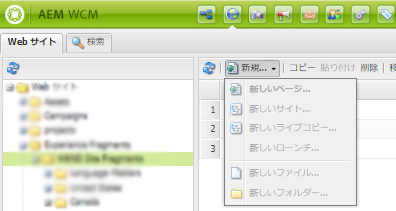

# 以前のサービスパックに含まれていたホットフィックスと機能パック {#hotfixes-and-feature-packs-included-in-previous-service-packs}

## [!DNL Adobe Experience Manager] 6.5.10.0 {#experience-manager-65100}

[!DNL Adobe Experience Manager] 6.5.10.0には、2019 年 4 月の 6.5 リリースのリリース以降にリリースされた新機能、お客様からリクエストされた主な機能強化、パフォーマンス、安定性、セキュリティの改善が含まれています。 サービスパックがにインストールされている [!DNL Adobe Experience Manager] 6.5.

に導入された主な機能および機能強化 [!DNL Adobe Experience Manager] 6.5.10.0は次のとおりです。

* **強化機能 [!DNL Content Fragment] モデルとエディター**:ネストされたを使用して、構造化コンテンツ用の複雑なモデルやカスタムモデルを作成できるようになりました。 [!DNL Content Fragment] モデル。 コンテンツ構造は、サブフラグメントとしてモデル化された基本要素にモジュール化されます。 上位レベルのフラグメントは、これらのサブフラグメントを参照します。 高度な検証ルールなどのデータタイプの強化により、 [!DNL Content Fragments]. この [!DNL Experience Manager] [!DNL Content Fragment] エディターは、一般的なエディターセッションでネストされたフラグメント構造をサポートします。たとえば、構造ツリー表示や、フラグメント階層を介したタブ付きパンくずナビゲーションなどの機能強化がおこなわれます。

* **の GraphQL API[!DNL Content Fragments]**:新しい GraphQL API は、構造化コンテンツを JSON 形式で配信する標準の方法です。 GraphQL クエリを使用すると、クライアントはエクスペリエンスをレンダリングする関連コンテンツ項目のみを要求できます。 このような選択により、クライアント側でのコンテンツ解析を必要とするコンテンツの過剰配信（HTTP REST API での可能性）が排除されます。 GraphQL スキーマは次から派生します。 [!DNL Content Fragment] モデルと API の応答は JSON 形式でおこなわれます。 In [!DNL Experience Manager] as a [!DNL Cloud Service], [GraphQL クエリが保持されます](https://experienceleague.adobe.com/docs/experience-manager-cloud-service/assets/admin/graphql-api-content-fragments.html#persisted-queries-caching) キャッシュに適したGETリクエストを処理 ～ではまだ不可能だ [!DNL Experience Manager] 6.5.10.0.

* **の GraphQL API[!DNL Content Fragments]**:GraphQL API をサポートするために、「コンテンツフラグメントモデルプロパティ」フィールドでハイフンを使用できなくなりました。 コンテンツフラグメントモデルのプロパティ名のいずれかにハイフンが存在する場合、GraphQL クエリは望ましくない結果を返す可能性があります。
プロパティ名には、次の文字のみを使用できます。A-Za-z0-9_ 数字を最初の位置に配置することはできません。

* **階層の管理と今後のプレビュー**:ユーザーは、 [!DNL Experience Manager] ローンチに含まれるページの追加と削除の機能を含むローンチ。 この機能により、 [!DNL Experience Manager] 今後の公開をターゲットとするコンテンツバージョンを作成するためのローンチ。 [タイムワープ機能](/help/sites-authoring/working-with-page-versions.md#timewarp) ユーザーは、ローンチを将来のコンテンツステートとしてプレビューできます。

* **Connected Assets**: [!DNL Experience Manager] は [!DNL Connected Assets] 使用に対する機能 [!DNL Dynamic Media] 該当するコアコンポーネント内の画像。 「[Connected Assets の使用](/help/assets/use-assets-across-connected-assets-instances.md)」を参照してください。

* **アセットまたはレンディションをダウンロードするためのリンク共有オプション**:アセットとコレクションをリンクとして共有する場合、元のアセットのダウンロードを許可するか、レンディションのダウンロードを許可するか、共有リンクを使用して両方を許可するかを選択できます。 また、リンクを通じて共有されているアセットをダウンロードしたユーザーは、元のアセットのみ、レンディションのみ、またはその両方をダウンロードするオプションが使用できます。

* **生成されるサブアセットを制限**:管理者は、 [!DNL Experience Manager] は、PDF、PowerPoint、InDesign、キーノートファイルなどの複合アセットに対してを生成します。 詳しくは、 [複合アセットの管理](/help/assets/managing-linked-subassets.md#generate-subassets).

* **Camera Raw支援**:新しい [!DNL Camera Raw] をサポートするパッケージが利用可能です [!DNL Adobe Camera Raw] v10.4。詳しくは、 [を使用して画像を処理 [!DNL Camera Raw]](/help/assets/camera-raw.md).

* 組み込み型のリポジトリ (Apache Jackrabbit Oak) が1.22.8に更新されました。

* **アクセシビリティの強化**:

   * [!DNL Dynamic Media] では、ビューアに対して多くのアクセシビリティ強化を提供しています。 詳しくは、 [[!DNL Dynamic Media] 更新](#dynamic-media-65100).

   * Platform では、アクセシビリティがいくつか強化されています。 詳しくは、 [Platform の更新](#platform-65100).

* **ユーザーエクスペリエンスの強化**:

   * [!DNL Experience Manager] フォルダーの下にすべてのコンテンツモデルのリストを直接表示します。コンテンツ作成者はファイル構造内を移動する必要はありません。 この機能により、クリック数が少なくなり、オーサリングの効率が向上しました。

   * のパスフィールド [!DNL Sites] エディターを使用すると、作成者は次の場所からアセットをドラッグできます： [!DNL Content Finder].

* のサポートを追加しました。 `GuideBridge#getGuidePath` の API [!DNL AEM Forms].

* これで、Automated forms conversionサービスを [PDF formsをフランス語、ドイツ語、スペイン語、イタリア語、ポルトガル語の各言語で変換する](https://experienceleague.adobe.com/docs/aem-forms-automated-conversion-service/using/extending-the-default-meta-model.html#language-specific-meta-model) アダプティブフォームに変換する

* **プロパティブラウザーのエラーメッセージ**：アダプティブフォームのプロパティブラウザーに、各プロパティに関するエラーメッセージを追加しました。これらのメッセージは、フィールドの許可値を理解するのに役立ちます。

* **リテラルオプションを使用して JSON タイプの変数の値を設定する機能をサポート**:リテラルオプションを使用して、AEM Workflow の変数設定手順で JSON 型変数の値を設定できます。 リテラルオプションを使用すると、文字列の形式で JSON を指定できます。

* [プラットフォームの更新](../forms/using/aem-forms-jee-supported-platforms.md): [!DNL Adobe Experience Manager Forms] JEE 上では、次のプラットフォームのサポートが追加されました。
   * [!DNL Adobe Acrobat 2020]
   * [!DNL Ubuntu 20.04]
   * [!DNL Open Office 4.1.10]
   * [!DNL Microsoft Office 2019]
   * [!DNL Microsoft Windows Server 2019]
   * [!DNL RHEL8]

に導入されたすべての機能および機能強化の一覧については、 [!DNL Experience Manager] 6.5.10.0、 [の新機能 [!DNL Adobe Experience Manager] 6.5 サービスパック 10](new-features-latest-service-pack.md).

以下は、 [!DNL Experience Manager] 6.5.10.0リリース。

### [!DNL Sites] {#sites-65100}

* フォーカスは、 **[!UICONTROL デフォルト値]** 下のフィールド **[!UICONTROL プロパティ]** コンテンツフラグメントエディターのタブ (NPR-36992)。

* フィルタリング中 [!DNL Content Fragment] 指定したパスの下のモデル [!DNL Experience Manager] 検索では、 `cq:Template` のパスやノードを返す代わりに、 [!DNL Content Fragment] モデル (SITES-1453)。
* [!DNL Content Fragments] 戻る `null` をフォルダーのステータス (SITES-1157) として追加しました。
* [!DNL Experience Manager] ユーザーが無効にして有効にすることを許可しない [!DNL Content Fragment] モデル (SITES-1088)。
* ユーザーが移動、名前変更、または削除したとき [!DNL Content Fragments] ( 参照元の [!DNL Content Fragments] は自動的には更新されません (SITES-196)。
* あるページから別のページにコンポーネントを貼り付けると、JavaScript エラーが発生する (NPR-37030)。
* ページのプロパティがすばやく表示されると、別のページのページプロパティが開かれる (NPR-37025)。
* コンテンツフラグメントを使用すると、コンテンツフラグメントは自身を参照できます。 ピッカーが操作をサポートしていない (NPR-36993)。
* Service Pack 9 にアップグレードした後、一部のユーザーは、Experience Manager内でフォルダを移動できず、ログにエラーが表示されません (SITES-1481)。
* 編集モードでレイアウトコンテナ内のコンポーネントの幅を調整する際に、ちらつきが発生する (NPR-36961)。
* ローンチの昇格時に、昇格済みのローンチの変更が他のローンチに二重にロールアウトされます。 ユーザーがダブルロールアウトされたローンチを昇格すると、2 倍のコンテンツがソースページに反映される (NPR-36893)。
* [!DNL Experience Manager] 画像コアコンポーネントを使用してページに画像を追加する場合、または基盤画像コンポーネントを使用してサイズを変更する場合に、透明度を持つ一部の PNG 画像にグレーの境界線を追加する。(NPR-36879)
* [!DNL Experience Manager Sites] 多数のテンプレートを含む管理 UI で、ナビゲーションが遅くなる (NPR-36870)。
* Service Pack 9 にアップグレードすると、一部のコンポーネントが作成されなくなります。 この問題では、 [!DNL Sites] 新しいページを作成するユーザー (NPR-36857)。
* この `ContextHubImpl` メソッドは `ResourceResolver` それは閉じられていません。 長時間実行に関する警告メッセージが表示されます。 `ResourceResolver` また、サービスが予期しない結果を時々返す (NPR-36853)。
* ブループリントページのプロパティから単一のライブコピーを同期すると、その他のすべてのライブコピーも同期される (NPR-36829、NPR-36522)。
* XLS の MIME タイプのみを使用した場合、ファイルのアップロード機能が期待どおりに動作しない (NPR-36785)。
* パスケースとすべて大文字の単語を含む新しいタグは、内のタグフィールドに表示されません [!DNL Content Fragments] (NPR-36742)。
* 「単一のテキスト要素」オプション ( [!DNL Content Fragment] を指定すると、テキストが欠落し、リストとネストされたリストに関連する奇数の書式が作成される (NPR-36565)。
* 作成者がページ上の任意のコンポーネントに注釈を付け、そのコンポーネントを削除し、削除操作の取り消しを実行すると、サイトコンソールでそのページのタイムラインデータを表示しようとするとエラーが発生する。(NPR-36528)
* ページプロパティバルクエディターの [!UICONTROL 保存して閉じる] オプションは変更を保存するが、エディターを閉じない (NPR-36527)。
* ユーザーが新しいテキストコンポーネントをページにドラッグ&amp;ドロップしようとすると、そのコンポーネントが直ちに消える (NPR-36442)。
* ユーザーがスペース（システム上に存在しないタグ）を含むオンデマンドタグに入力し、Enter キーを押すと、そのタグがフィールドの下に表示されます。 ただし、 [!DNL Content Fragment] が保存され再び開かれた場合、オンデマンドタグは表示されない (NPR-36441)。
* インスタンスが Dispatcher 経由でアクセスされる場合、テンプレートは削除できない。(NPR-36385)
* ページを移動する際に、変更をレンダリングするには、ブラウザを手動で更新する必要がある (NPR-36381)。
* コンポーネントを選択する際に、Ctrl + X または Ctrl + C キー ( およびMacでは Command + X または Command + C キー ) を使用して切り取りまたはコピーできます。 別のコンポーネントをクリックしたときに、ツールバーで貼り付けることができますが、キーボード（Ctrl+V または Command+V）では貼り付けできません (NPR-36379)。
* ユーザーがはさみアイコンを使用してコンポーネントを切り取って別の場所に移動しようとすると、コンソールエラーが発生します。 また、1 つのコンポーネントのみ貼り付けると、移動される (NPR-36378)。
* [!DNL Experience Manager] には、WCM 上のインデックスや通知を含まないクエリがあり、パフォーマンスが低下する (NPR-36303)。
* 作成者が、削除された継承コンポーネントの継承を復元する場合、使用可能なオプションは、すべてのページコンテンツを同期することです。 継承が 1 つのコンポーネントでのみ復元された場合でも、コンテンツ作成者は完全なページを同期する必要があります。 完全な同期により、望ましくないコンテンツが同期される可能性がある (NPR-34456、CQ-4310183)。
* オーサーインスタンス上のコンポーネントのライブ使用では、すべての項目が表示されるわけではありません。 1,000 ページを超えるページで使用されているコンポーネントもありますが、レポートには約 40 ページしか表示されません (CQ-4323724)。
* 多数のサブページを含むサイト構造がある場合、列表示でのサブページの読み込みには、Experience Manager6.4.8.2 に比べて、Experience Manager6.5.8 での時間が長くなります (CQ-4322766)。
* 「ページをロールアウト」オプションで「すべて」が機能しない。(NPR-37070)
* ページの既存の v3 コンポーネントバージョンを開くと、ページのプロパティダイアログが開かず、 `NullPointerException` がログに記録されます (SITES-1830)。

### [!DNL Assets] {#assets-65100}

以下の問題を修正しました。 [!DNL Assets]:

* プロパティの値 `jcr:title` フォルダーを移動した後、パブリッシュインスタンス上ではが更新されません。 作成者内のフォルダーの名前を変更して再公開しても、 `jcr:title` パブリッシュインスタンスで同じプロパティ値を持つ (NPR-36369)。

* 2 つ以上のアセットを選択し、1 つ以上のメタデータフィールドが編集された場合、Safari ブラウザーでエラーコード 500 が表示されて保存操作が失敗する。(NPR-36413)

* 日付の形式が正しくないので、一括メタデータの読み込みに失敗する。(NPR-36428)

* 選択が [!UICONTROL プロパティ] メタデータを更新するページで、スキーマから多くのオプションが提供される場合、インターフェイスの応答が遅くなる (NPR-36430)。

* を使用した検索フィルター [!UICONTROL 有効期限ステータス] 述語が機能しない (NPR-36436)。

* の各種フィールドのポップアップメニュー [!UICONTROL フォルダーメタデータ] プロパティには、最後に選択された値が表示されない (NPR-36937、CQ-4314429)。

* ファイルとフォルダを検索する場合、フィルタを適用して選択する場合 [!UICONTROL ファイルとフォルダー]の場合、ファイルのみが表示されますが、フォルダーは表示されません (CQ-4319543、NPR-36627)。

* フォルダー内から同じコレクションが選択されている場合と、検索結果から選択されている場合で、ツールバーのオプションが異なる (NPR-36620)。

* この [!UICONTROL クイック公開] オプションが検索結果ページで使用できない (NPR-36904、CQ-4317748)。

* ユーザーが拡張子を指定せずにアセットのライブコピーを作成した場合、ダウンロード後にライブコピーファイルを使用できない (NPR-36903、CQ-4326305)。

* ユーザーが子フォルダーの所有者として追加されると、そのユーザーは親フォルダーの所有者権限も取得します。つまり、親フォルダーの他の子フォルダーの所有者権限も取得します。 また、ユーザーが親フォルダーを削除しようとしても、親フォルダーの所有者として削除されません。 (NPR-36801、CQ-4323737)。

* [!DNL Experience Manager] PowerPoint プレゼンテーションなどの複合アセットのサブアセットを作成しようとすると、メモリ不足の例外が生成されます (NPR-36668)。

* 公開済みのサイトページで既に使用されているアセットをユーザーが移動すると、公開するオプションが選択されていない場合でも、サイトページが再び公開されます (NPR-36636、CQ-4323500)。

* Apache Tika の MIME タイプ検出機能を使用する場合、 `AssetManager.createAsset` メソッドは、 `apache-tika-*.tmp` ファイルを一時ディレクトリに格納します。 この一時ファイルは、使用可能なすべての空きディスク領域を使用します (NPR-36545)。

* DRM で保護されているすべてのアセットがダウンロードされ、特定のアセットをダウンロードするためのユーザー選択が実行されません (CQ-4327422)。

* アセットを次にドラッグできません： `pathfield` ユーザーインターフェイス (NPR-36849) で確認。

* 列表示でアセットを選択すると、アセットの詳細パネルが表示されなくなる (NPR-36667)。

### [!DNL Dynamic Media] {#dynamic-media-65100}

**アクセシビリティの強化**

では、次のアクセシビリティの強化が利用できます。 [!DNL Dynamic Media Viewers].

* スクリーンリーダーが、プレースホルダーテキストを読み上げ、アセットをリンクダイアログとして共有する際に、電子メールアドレスを必須フィールドとして追加し、 [!UICONTROL このフィールドに入力してください] tooltip(CQ-4327761)

* スクリーンリーダーで、 [!UICONTROL 画像プリセットエディター] キーボードを使用してユーザーインターフェイスフィールドにアクセスする際に (CQ-4325677)。

* キーボードフォーカスがの検索タブに適切に移動するようになりました。 [!UICONTROL ビューアプリセット] のアセットピッカーのダイアログボックス [!UICONTROL リッチメディアタイプ] オプション (CQ-4324736) が表示されます。

* キーボードキーを使用してフォームモードで移動する場合、スクリーンリーダーは、の増分および減分オプションに対応するラベルを読み上げます。 [!UICONTROL 作成] タブ [!UICONTROL 画像プリセット] (CQ-4323900)。

* スクリーンリーダーで [!UICONTROL メールアドレスを検索して追加] アセットをリンクダイアログボックスとして共有するオプション (CQ-4323352)

* キーボードキーを使用してアセットを移動しても、ツールバーにキーボードフォーカスが保持される (CQ-4322037)。

* スクリーンリーダーで、新しく追加された [!UICONTROL 編集] 選択後のフィールド情報 [!UICONTROL 切り抜きを追加] オプションを [!UICONTROL レスポンシブ画像の切り抜き] オン [!UICONTROL 画像処理プロファイルを編集] ページ (CQ-4290734) に表示されます。

* オン [!UICONTROL 画像プリセットを編集] および [!UICONTROL インタラクティブビデオを作成] ページ、スクリーンリーダーで、見出しキーボードショートカットキーを使用してページを移動する際に、ページ見出しが適切に読み上げられるようになりました (CQ-4290730)(CQ-4290701)。

* スクリーンリーダーは、次のページを移動する際に、ランドマークキーと領域ショートカットキーを使用して、画面の様々な領域（右パネル領域、左パネル、アクションツールバー、ビューアツールバーのランドマーク、ズーム可能な画像のランドマークなど）を認識できるようになりました。

   * [!UICONTROL ビューアプリセットエディター] (CQ-4290729)

   * [!UICONTROL 画像セットエディター] (CQ-4290710)

   * [!UICONTROL インタラクティブビデオを作成] (CQ-4290702)。

* スクリーンリーダーが下向き矢印キーを使用して移動する際に、ビデオフレームの共有オプションの名前を読み上げるようになりました (CQ-4290728)。

* スクリーンリーダーで、 [!UICONTROL スプライト] および [!UICONTROL 背景] タブ [!UICONTROL 外観] タブ [!UICONTROL ビューアプリセットエディター] (CQ-4290727)。

* 編集するフィールドなどの必須フィールド [!UICONTROL 幅]、 [!UICONTROL 基本] タブ [!UICONTROL ビデオエンコーディングを編集] ページにアスタリスク記号 (*) が表示されるようになりました (CQ-4290725)。

* スクリーンリーダーで、 [!UICONTROL イメージプロファイル] ページ (CQ-4290723) に表示されます。

* Windows ユーザーは、 [!UICONTROL ビューアプリセットエディター] フォーカスが CSS エディターにあるとき (CQ-4290720)。

* オン [!UICONTROL 基本] タブ [!UICONTROL 画像プリセットを編集] フォームモードで移動する際に、スクリーンリーダーが様々な編集フィールドおよびオプションのラベルを読み上げるようになりました (CQ-4290717)。

* スクリーンリーダーが、アセットの詳細ページの左側のナビゲーションにあるユーザーインターフェイスオプションの役割と状態（選択または未選択）を読み上げるようになりました (CQ-4290709)。

* スクリーンリーダーで、状態（選択された、または選択されていない）を正しく読み上げ、画像のリンクが [!UICONTROL コンテンツ] タブ [!UICONTROL インタラクティブビデオを作成] ページ (CQ-4290707) に表示されます。

* スクリーンリーダーで、上の下向き矢印キーを使用して移動する際、ビデオタイムラインスケールで、様々なセグメントの名前、役割、状態を正しく読み上げるようになりました。 [!UICONTROL インタラクティブビデオを作成] ページ (CQ-4290706) に表示されます。

* スクリーンリーダーで、 [!UICONTROL インタラクティブビデオを作成] ページ (CQ-4290704) に表示されます。

* スクリーンリーダーで、 [!UICONTROL すべてのアセット] および [!UICONTROL すべてのコレクション] 移動時のオプション [!UICONTROL 公開] ページ (CQ-4290705) に表示されます。

* で（MP4 以外の）サポートされていないビデオ形式をアップロードしたとき [!UICONTROL インタラクティブビデオを作成] ページ、Experience Managerが表示され、エラーメッセージがアナウンスされる (CQ-4290700)。

* タイムラインスケールの数値（秒単位の時間）のコントラスト [!UICONTROL インタラクティブビデオを作成] ページが最小限の必要な明るさの比率を満たし、色の知覚が限られたユーザーが読みやすくなるようになりました (CQ-4290699)。

* スクリーンリーダーで、 [!UICONTROL 製品名] フィールド ( [!UICONTROL インタラクティブビデオを作成] ページ (CQ-4290697) に表示されます。

**修正された問題**

以下のバグ修正が、 [!DNL Dynamic Media].

* にビデオをアップロードしました [!DNL Experience Manager] 表示 `Process failed` 後 `dynamicmedia_scene7` 実行モードが有効で、同期が無効です (CQ-4327791)。

### Platform {#platform-65100}

このサービスパックでは、次の機能強化が提供されています。

* ユーザーがツリー表示で項目を選択すると、スクリーンリーダーは、上部に表示される選択とツールバーオプションを読み上げる (NPR-36504)。
* 明るさの比率が最小要求比 4.5:1 を満たすので、視覚の問題があるユーザーは、テキストや制御名の読みやすさが一部わかりやすくなります (NPR-36503)。
* ユーザーがカレンダーコントロールを使用する場合、スクリーンリーダーは、記述的な日付、月、曜日の情報をナレーションします。 ユーザーがカレンダーショートカットキーを使用すると、スクリーンリーダーが日付、月、年の変更をナレーションする (NPR-36498)。
* カスタム JavaScript を実行するためのサポートが提供されました `Clientlibs` 厳密なモードに準拠せずに ECMAScript 6 機能を使用する。 特に、 `emitUseStrict` フラグが `GCCScriptProcessor` (NPR-36411)。

このサービスパックには、次のバグ修正が含まれています。

* カスタムヘルスチェックは、スケジュールされたよりも頻繁に実行されます (NPR-36985)。
* この `Resourceresolver map` メソッドがエイリアスページに対して誤った結果を返す。(NPR-36767)
* [!DNL Experience Manager] 読み込みワークフローが原因で、起動が遅延する。(NPR-36615)

### 統合 {#integrations-65100}

* Experience Managerが応答しなくなるのは、プライマリ MongoDB ノードが別のノードに切り替わったときです (NPR-36566)。
* [!DNL Sling content distribution] コレクションメンバーの削除操作の実行時に失敗する。(NPR-36521、CQ-4323578)

### ユーザーインターフェイス {#user-interface-65100}

* この **[!UICONTROL 参照]** サイドパネルにアセットおよびサイトの参照が表示されない (GRANITE-35078、GRANITE-34892)。

### 翻訳プロジェクト {#translation-65100}

* 多言語翻訳プロジェクトの言語コピーの余分なサブページが削除される (NPR-36622)。

### ワークフロー {#workflow-65100}

* サーバーが不在メッセージを受け取ると、メモリアラートを報告し、応答を停止する (NPR-36768)。

### [!DNL Communities] {#communities-65100}

* コミュニティサイトページが `LoggedIn` 匿名のゲストユーザーの状態 (NPR-36908)。

* ページが **[!UICONTROL コミュニティ]** > **[!UICONTROL アイデア]** > **[!UICONTROL コメント]** ページのナビゲーションが機能しない (NPR-36541)。

<!--
Need to verify with Engineering, the status is currently showing as Resolved
-->


<!--
### [!DNL Brand Portal] {#brandportal-65100}

*
-->

### [!DNL Forms] {#forms-65100}


>[!NOTE]
>
>* [!DNL Experience Manager Forms] では、予定されている [!DNL Experience Manager] サービスパックリリース日の 1 週間後にアドオンパッケージをリリースします。


[!DNL AEM 6.5.10.0 Forms] には、次のバグ修正が含まれています。

* インストール時 [!DNL AEM 6.5 Forms]に設定すると、次のサードパーティライブラリが自動的にインストールされます (CQDOC-18373)。
   * [!DNL Microsoft Visual C++ 2008 Service Pack 1 (x86)]
   * [!DNL Microsoft Visual C++ 2010 Service Pack 1 (x86)]

**アダプティブフォーム**

* アダプティブフォームのフィールド値に対して実行された検証が正常に完了した場合、 [!DNL AEM Forms] フォームデータモデルの呼び出しに失敗しました (CQ-4325491)。

* 翻訳プロジェクトに言語辞書を追加し、そのプロジェクトを開くと、 [!DNL AEM Forms] は次のエラーメッセージを表示します (CQ-4324933)。

   ```TXT
   Uncaught TypeError: Cannot read property 'PROJECT_LISTING_PATH' of undefined
   at openButtonClickHandler (clientlibs.js:245)
   at HTMLButtonElement.onclick (clientlibs.js:258)
   ```

* インストール後のパフォーマンスの問題 [!DNL AEM Forms] Service Pack 7(CQ-4326828)。

**Correspondence Management**

* 内の文字の表示遅延 [!UICONTROL データ] タブやHTMLレターのプレビュー (NPR-37020) も表示される。

* テキストドキュメントフラグメントを編集しているとき、フラグメントを保存すると、新しい単語がHTMLタグとして表示される (NPR-36837)。

* ドラフトとして保存されているレターを表示できない (NPR-36816)。

* テキストドキュメントフラグメントを編集してレターをプレビューすると、AEM FormsはHTMLレタープレビューに式言語を表示します (CQ-4322331)。

* セルフサービスレターテンプレートを使用してデータをレンダリングする際に発生する問題 (NPR-37161)。


**インタラクティブコミュニケーション**

* タブ文字は、テキストドキュメントフラグメントの編集後にインタラクティブ通信のプレビューを印刷するたびに、2 つの単語間で重複します (NPR-37021)。

* [!DNL AEM Forms] 最大サイズ制限を超えるテキストドキュメントフラグメントを保存すると、エラーが表示される。(NPR-36874)

* インタラクティブ通信に画像を追加すると、その画像の後に追加の空のブロックが表示される (NPR-36659)。

* エディターですべてのテキストを選択すると、フォントテキストを Arial に変更できない (NPR-36646)。

* エディターで URL を作成し、変更をプレビューすると、URL テキストの代わりに黒い背景が表示される (NPR-36640)。

* エディターにテキストをコピーして貼り付ける際、ドキュメント内の箇条書き記号のフォントを Arial に変更する際に問題が発生する。(NPR-36628)

* テキストエディターでの箇条書きのインデントの問題 (NPR-36513)。

**デザイナー**

* 画面Readerが、マスターページ上のテキストラベルまたは動的PDFのサブフォームページに配置されたフローティングフィールドデータを読み取れませんでした (CQ-4321587)。

**ドキュメントサービス**

* XDP ファイルをPDFファイルに変換し、結果のPDFをアセンブリすると、PDFの生成に失敗し、次のエラーメッセージが表示されます。

   ```TXT
   Caused by: com.adobe.fd.assembler.client.AssemblerException$ClientException: Document is in a disposed state!
   ```

**Forms のワークフロー**

* AEM Forms Service Pack 8 にアップグレードした後、Workbench プロセスにフォームを送信できない (CQ-4325846)。

**HTML5 のフォーム**

* この `mfAllowAttachments` プロパティとして `True` CRX DE リポジトリで、 `dataXml` 送信時に破損するHTML5 フォーム (NPR-37035)。

* を使用して XDP をHTMLとしてレンダリングする場合 `dataXml`, [!DNL AEM Forms] が表示されます `Page Unresponsive` エラー (NPR-36631)。

### コマース {#commerce-65100}

* の値 **[!UICONTROL 公開者]** 表示されるフィールドが列表示で正しくない (NPR-36902)。
* カタログがロールアウトされると、新しい製品が誤って変更された製品としてマークされる (NPR-36666)。
* 削除された製品を再作成しても、製品ページは再作成されません (NPR-36665)。
* 変更されたページは更新されますが、対応するリンクされた製品は「カタログ」ロールアウトで更新されません (CQ-4321409、NPR-36422)。
* この **[!UICONTROL 後で公開]** および **[!UICONTROL 後で非公開にする]** ワークフローが機能しない (CQ-4327679)。

セキュリティ更新について詳しくは、 [[!DNL Experience Manager] セキュリティ速報ページ](https://helpx.adobe.com/security/products/experience-manager.html).

## Experience Manager6.5.10.0の既知の問題 {#known-issues}

* 形式 [!DNL Microsoft Windows Server 2019] はをサポートしていません [!DNL MySQL 5.7] および [!DNL JBoss EAP 7.1], [!DNL Microsoft Windows Server 2019] の自動インストールはサポートされていません [!DNL AEM Forms 6.5.10.0].

* アップグレードする場合は、 [!DNL Experience Manager] 6.5 から 6.5.10.0バージョンのインスタンスは、 `RRD4JReporter` 例外 `error.log` ファイル。 この問題を解決するには、インスタンスを再起動します。

* 次をインストールした場合： [!DNL Experience Manager] 6.5 Service Pack 10 または以前の Service Pack ( [!DNL Experience Manager] 6.5：アセットのカスタムワークフローモデルのランタイムコピー ( `/var/workflow/models/dam`) が削除されました。
ランタイムコピーを取得するには、HTTP API を使用して、カスタムワークフローモデルのデザイン時コピーをそのランタイムコピーと同期することをAdobeにお勧めします。
   `<designModelPath>/jcr:content.generate.json`

* ユーザーは、 [!DNL Assets] ネストされたフォルダーをに公開します。 [!DNL Brand Portal]. ただし、フォルダーのタイトルは [!DNL Brand Portal] ルートフォルダーが再公開されるまで。

* アダプティブフォームで初めてフィールドを設定する場合、設定を保存するオプションはプロパティブラウザーに表示されません。 同じエディターでアダプティブフォームの他のフィールドを設定するように選択すると、問題が解決します。

* Experience Manager6.5.x.x のインストール中に、次のエラーと警告メッセージが表示される場合があります。
   * 「Adobe Target統合が Target Standard API（IMS 認証）を使用してExperience Managerで設定されている場合、エクスペリエンスフラグメントを Target に書き出すと、間違ったオファータイプが作成されます。 Target では、「エクスペリエンスフラグメント」/source「Adobe Experience Manager」タイプではなく、「HTML」/source「Adobe Target Classic」タイプのオファーをいくつか作成します。
   * `com.adobe.granite.maintenance.impl.TaskScheduler` : granite/operations/maintenance にメンテナンスウィンドウが見つかりません。
   * SUM、MAX、MIN などの集計関数が使用されている場合、アダプティブフォームのサーバー側検証が失敗します (CQ-4274424)。
   * `com.adobe.granite.maintenance.impl.TaskScheduler` - granite/operations/maintenance にメンテナンスウィンドウが見つかりません。
   * ショッパブルバナービューアでアセットをプレビューすると、Dynamic Mediaのインタラクティブ画像のホットスポットが表示されない。
   * `com.adobe.cq.social.cq-social-jcr-provider bundle com.adobe.cq.social.cq-social-jcr-provider:1.3.5 (395)[com.adobe.cq.social.provider.jcr.impl.SpiSocialJcrResourceProviderImpl(2302)]` :登録の変更が完了するのを待機中のタイムアウトが未登録になりました。

## [!DNL Adobe Experience Manager] 6.5.9.0 {#experience-manager-6590}

[!DNL Adobe Experience Manager] 6.5.9.0 には、2019 年 4 月の 6.5 リリースのリリース以降にリリースされた新機能、お客様からリクエストされた主な機能強化、パフォーマンス、安定性、セキュリティの改善が含まれています。 サービスパックがにインストールされている [!DNL Adobe Experience Manager] 6.5.

に導入された主な機能および機能強化 [!DNL Adobe Experience Manager] 6.5.9.0 は次のとおりです。

* [!DNL Experience Manager Sites] Dynamic Media Foundation コンポーネントで、レスポンシブ画像プリセットまたはスマート切り抜きを使用する際の、高解像度デバイス向けの最適化のオン/オフを切り替えることができるようになりました。

* パフォーマンスを向上させるには、 `hidden=false` 条件が JCR クエリからに移動されました [!UICONTROL QueryBuilder] 評価基準 変更後に非表示の述語が機能していることを確認するには、次の手順を実行します。 [!DNL Experience Manager] 非表示のフォルダが表示されないことを確認します。

* 削除されたページとツリーを [!DNL Experience Manager Sites] ページ。

* 新しいユーザーがメーラー設定サービスの更新トークンを使用してアクセストークンを更新する機能をサポートします。

* [SMTP XOAUTH2 のサポート](/help/sites-administering/notification.md#setting-up-oauth) メール設定サービスのメカニズム。

* のサポート [!DNL MongoDB] バージョン 4.2 および 4.4。

* 香港、マカオ、台湾に関連する名前が、中国のロケールと地域の新しい命名規則に従って更新されます。

* のアクセシビリティの強化 [!DNL Experience Manager] [[!DNL Assets]](#assets-accessibility-6590) および [[!DNL Dynamic Media]](#accessibility-dm-6590).

* スマートイメージング DPR（デバイスのピクセル比）とネットワーク帯域幅の最適化により、最高品質の画像を効率的に配信できます。（高解像度のディスプレイとネットワーク帯域幅の制限があるデバイス） 詳しくは、 [スマートイメージングに関する FAQ](/help/assets/imaging-faq.md).

* [!DNL Dynamic Media] 配信 (`fmt` URL 修飾子 ) は、次世代の画像形式 AVIF（AV1 画像形式）をサポートします。 詳しくは、 [画像サービングおよびレンダリング API fmt](https://experienceleague.adobe.com/docs/dynamic-media-developer-resources/image-serving-api/image-serving-api/http-protocol-reference/command-reference/r-is-http-fmt.html).

* 次を使用してグループに通知 E メールを送信する機能 [!UICONTROL タスクを割り当て] ワークフローステップ。

* インタラクティブ通信のソースを変更した後に、インタラクティブ通信の下書きを取得する機能。

* で reCAPTCHA サービスの読み込み、レンダリングおよび検証を行うためのカスタムドメイン名を設定します。 [!DNL Experience Manager Forms].

* の入力データの強化 [!UICONTROL フォームデータモデルサービスを起動] ワークフローステップ。

* のレコードのドキュメントテンプレートで複数のマスターページを使用できます。 [!DNL Experience Manager Forms].

* レコードのドキュメントでの改ページをサポート [!DNL Experience Manager Forms].

* 組み込み型のリポジトリ (Apache Jackrabbit Oak) が1.22.7に更新されました。

に導入された機能と機能強化の完全なリストについては、 [!DNL Experience Manager] 6.5.9.0( [の新機能 [!DNL Adobe Experience Manager] 6.5 サービスパック 9](new-features-latest-service-pack.md).

>[!NOTE]
>
>Service Pack 9 の導入 [!DNL Experience Manager] 顧客が開発し、運用できる [!DNL Experience Manager] 分布を持つアプリケーション [!DNL Azul Zulu] OpenJDK のビルド。Java™ SE に準拠。
>のサポート [!DNL Azul Zulu] JDK は、 [!DNL Experience Manager] 顧客。
>関連するバージョンの [!DNL Azul Zulu] からの JDK [Adobeソフトウェア配布](https://experience.adobe.com/#/downloads/content/software-distribution/en/aem.html).
>oracleJava™テクノロジーの使用権は、Adobeが配布するものとして、2022 年 12 月末までに失効します。 [!DNL Experience Manager] のお客様は、 [!DNL Azul Zulu] この日までに最新の JDK。 の使用方法の詳細については、 [!DNL Oracle Java™] 技術と [!DNL Azul Zulu] 技術 ( 関連する [よくある質問](https://experienceleague.adobe.com/docs/experience-manager-65/assets/adobe-azul-openjdk-license-agreement.pdf).

以下は、 [!DNL Experience Manager] 6.5.9.0 リリースです。

### [!DNL Sites] {#sites-6590}

* 認証要件プロパティが有効な公開済みページがログインページにリダイレクトされず、404 エラーメッセージが返される (NPR-36354)。

* ハイパーリンクを作成する際に、テキストコンポーネントでリンクを検索するオプションが機能しない (NPR-35849)。

* トラバーサルクエリが `com.day.cq.wcm.commons.ReferenceSearch` API これはのパフォーマンスに影響を与えます [!DNL Experience Manager] サーバー (NPR-36407)

* 別のサイズ変更されたレイアウトコンテナ内にネストされたレイアウトコンテナが子コンポーネントの列数を正しく表示しないため、これらのコンポーネントがグリッドに揃えられない (NPR-36359)。

* 外部リンクチェッカーが有効な外部リンクを無効なリンクとして表示する (NPR-36289)。

* しばらくの間参照を表示した後、参照パネルがエラーメッセージを表示し始める (NPR-36167)。

* コンポーネントを移動すると、自動的に作成された parsys には `sling:resourceType` ノード (NPR-36165)。

* ライブコピーの同期を試みる場合（ロールアウト設定を使用する場合） [!UICONTROL ブループリントのアクティベート時に有効化] および [!UICONTROL ブループリントのアクティベート時に無効化]) コンポーネントがライブコピーマスターで削除された場合、同期は失敗し、 `NullPointerException` がログに記録される (NPR-36127)。

* ユーザーがタグの即興テキスト（システムに存在しないタグ）に入力し、Enter キーを押すと、そのタグがフィールドの下に表示されますが、コンテンツフラグメントが保存されて再開されると、即興タグは消えます (NPR-36132)。

* インボックスに、非同期操作のステータスを表示するオプションがない (NPR-36104)。

* 継承を復元した後に、重複コンポーネントが作成される (NPR-36000)。

* を使用する場合、 `RemoteContentRenderingService`を返し、 `RemoteContentRendererRequestHandler.getRequest` 常に  `ComponentExporter`に含まれますが、トラバーサルの深さとフィルタリングオプションセットに基づいてルートモデルに含まれていない場合、要求されたページは含まれません。 SPAが応答をレンダリングするのに十分な情報を持つように、要求には常に要求されたページを含める必要がある (NPR-35961)。

* onTime/offTime 項目が、期待された onTime/offTime でアクティブ化/非アクティブ化されない (NPR-35936)。

* を持たないエクスペリエンスフラグメントを含むページを公開するとき `cq:lastModified` プロパティ `NullPointerException` が発生する (NPR-35914)。

* コンテナ内のコンポーネントのサイズを変更しようとすると、元のサイズに戻すことはできません。 コンポーネントのコンテナのサイズが小さくなると、元のサイズに戻すことはできません (NPR-35809)。

* エディターまたはライブコピーの概要からトリガーされるロールアウトダイアログで、分離されたページ、休止されたページ、または作成されていないページのステータスアイコンが間違っている (NPR-35691)。

* マルチサイトマネージャーのロールアウトマスターのページ上のプロパティで、ロールアウトページおよびサブページを無視するチェックボックスがオンになっている (NPR-35634)。

* クラシック UI で使用可能な復元ツリー機能がタッチ UI にありません (CQ-4315352、CQ-4309415)。

* 継承を元に戻してページをロールアウトする際の問題 [!DNL Experience Manager Sites] ページ (NPR-36033) に表示される。

### [!DNL Assets] {#assets-6590}

ユーザーエクスペリエンスに関する次の機能強化は、 [!DNL Assets]:

* いずれかの [!UICONTROL 作成], [!UICONTROL 変更]または [!UICONTROL 名前] パラメータ [!DNL Adobe Experience Manager] オファー [!UICONTROL なし] 内のオプション [!UICONTROL 並べ替え基準] オプション。 この [!UICONTROL なし] オプションを使用すると、Assets ユーザーインターフェイス（カード、列、インサイト表示）のアセットが JCR ノードに存在するのと同じ順序になるようにします (NPR-36356)。

* ACP API 応答で電子メール ID を小文字にするには、次の手順に従います。 [!DNL Adobe Experience Manager] オプションの設定が導入されました。を [!DNL Adobe Asset Link] ユーザーは、自分の ID にすべての文字が小文字で含まれていない場合、アセットをチェックインできませんでした。 この [!DNL Adobe Asset Link] パネルは、次の ACP API 応答を使用します： [!DNL Adobe Experience Manager] (CQ-4317704)。

では、次のアクセシビリティの強化が利用できます。 [!DNL Assets] サービスパック 9 の一部として：

以下のテキストとアイコンのコントラスト（背景と共に）が改善され、視覚や色の知覚が限られたユーザーが理解できるようになりました。

* アセットのタイトル ( ) [!UICONTROL プロパティ] ページ (NPR-35967) に表示される。
* の星評価アイコン [!UICONTROL 評価] 各地のセクション (NPR-36009)。
* アセットおよびフォルダーのカード表示のテキスト。(NPR-35966)
* 上のプレースホルダーテキスト [!UICONTROL タイムライン] 表示 (NPR-35965)。
* アセット検索結果のアセット名 (NPR-35964)。
* 上のプレースホルダーテキスト [!UICONTROL リンク共有] ダイアログ (NPR-35963)。
* [!UICONTROL メタデータ], [!UICONTROL ステータス]、および [!UICONTROL その他] テキスト入力 [!UICONTROL リスト] オプション [!UICONTROL 設定を表示] ダイアログ (NPR-35910)。
* [!UICONTROL 場所] および [!UICONTROL 入力して検索] グローバル検索のプレースホルダーテキスト (NPR-35909)。
* 下のアイコンを展開または折りたたむ [!UICONTROL コンテンツツリー] (NPR-35908)。
* この [!UICONTROL Assets] アセットフォルダーが表示されるページのテキスト (NPR-35905)。
* テキスト入力 [!UICONTROL アセットメタデータ], [!UICONTROL 使用状況の統計] 範囲 [!UICONTROL 概要] オプションがアセットの詳細ページに表示される (NPR-35904)。
* のショートカットキーのテキスト [!UICONTROL プロパティ] および [!UICONTROL 編集] アセットの詳細ページのオプション (NPR-35904)。

以下のバグ修正が、 [!DNL Assets] サービスパック 9 の一部として：

* タグ選択要素内で作成されたタグ ( [!UICONTROL フォルダーメタデータスキーマ] フォームが保存されない (NPR-36119)。

* 小さな楕円を使用してアセットに注釈を付けると、楕円は印刷バージョンの注釈の数と重なります (NPR-36114)。

* いつか、列表示で [!DNL Experience Manager] 重複アセットがアップロードされた際に、重複アセットの競合を確認するメッセージが表示されない (NPR-36048)。

* リンクを共有ダイアログが開いていて、変更が行われていない場合、閉じるボタンをクリックしてもリンクを共有ダイアログが閉じない (NPR-36030)。

* 複数のアセットを選択してプロパティを更新すると、エラーが発生したり、選択解除されたアセットのプロパティが更新されたりする (NPR-36002)。

* アセットのアップロード時に、アセットファイル名の先頭または末尾に空白が追加され、残りの文字がリポジトリ内の既存のアセットの名前と同じ場合、既存のアセットはエラーを記録せずに置き換えられる (NPR-36001)。

* アセットの詳細ページでビデオが再生されると、再生と一時停止のオプションが機能しない (NPR-35999)。

* アセットを一括して非公開にすると、要求 URI が長すぎることを示すエラーがBrand Portalで生成される (NPR-35954)。

* 長い注釈テキストを持つアセットが印刷されると、空きスペースがある場合でも、注釈テキストがトリミングされる (NPR-35948)。

* 「次のページに移動」オプションは、カタログを作成ページの「テンプレートを選択」ビューでページを選択すると無効になります (CQ-4315462)。

* ビデオアセットでアセットの更新ワークフローが開始されると、ページが繰り返し更新されます (CQ-4313375)。

* DAM フォルダーを削除または移動できず、例外が記録される (NPR-35942)。

### [!DNL Dynamic Media] {#dynamic-media-6590}

In [!DNL Adobe Experience Manager] 6.5.9.0 では、次のアクセシビリティ強化が利用できます [!DNL Dynamic Media]:

* ダイアログを開き、 [!UICONTROL 画像セット] 編集者：
   * スクリーンリーダーは、ダイアログが開かれたことを読み上げる。
   * キーボードフォーカスがダイアログを開くと、ダイアログに移動する。
   * ダイアログが閉じると、キーボードフォーカスが「アセットを追加」オプションに戻る (CQ-4312134)。

* ホットスポットエディターのキーボードキーを使用して、アセット上のホットスポットを追加および編集できるようになりました (CQ-4305965)。

* キーボードキーを使用して、ホットスポット管理を通じて、ホットスポットにハイパーリンクを配置できるようになりました。 スクリーンリーダーのフォーカスが、URL パスを編集するフィールドに移動し、「選択ダイアログを開く」オプションが表示されるようになりました (CQ-4290735)。

* 画像セットエディターページのテキストとコントロールのコントラスト（背景と共に）が改善され、視覚や色の知覚が限られているユーザーが理解できるようになりました (CQ-4290733)。

* ビューアプリセットエディターでアセット共有オプションに移動し、キーボードキーを使用して展開された共有オプションを折りたたむことができるようになりました (CQ-4290724)。

* キーボードキーを使用してビデオエンコーディングを編集ページの「基本」タブと「詳細」タブの情報アイコンとアラートアイコンのツールチップに移動して表示できるようになりました (CQ-4290722)。

* スクリーンリーダーが、ビューアプリセットエディターの「外観」タブと「ビヘイビアー」タブで、様々なフィールドの手順を読み上げるようになりました (CQ-4290721)。

* フォームモードで画像プリセットを編集ページに移動する際、スクリーンリーダーは、様々なフィールドおよびコントロールの目的と名前をナレーションします (CQ-4290717)。

* アセットの詳細ページに移動する際に、スクリーンリーダーでビューア内の様々なオプションの目的が説明されるようになりました (CQ-4290716)。

* プレースホルダーテキストの（背景と共に）コントラスト ( アセットの詳細ページの「レンディションのすべてのレンディション」オプションが改善され、視覚や色の知覚が限られたユーザーが理解できるようになりました (CQ-4290713)。

* 必須フィールドを示す視覚的なアスタリスクが画像セットエディターのアセットの「タイトル」フィールドに提供され、スクリーンリーダーがそのフィールドに必要な情報を読み上げるようになりました (CQ-4290712)。

* スクリーンリーダーは、アセットの詳細ページで、ビューア内の様々なインタラクティブオプションの目的にアクセスし、ナレーションできるようになりました (CQ-4290708)。

Adobe Experience Manager 6.5.9.0 Assets での修正点次の問題が修正されました。 [!DNL Dynamic Media]:

* カスタムのビューアプリセットと CSS がにレプリケートされない [!DNL Dynamic Media] when [!DNL Dynamic Media] が選択的に有効化され、が無効になる [デフォルト](https://experienceleague.adobe.com/docs/experience-manager-cloud-service/assets/dynamicmedia/config-dm.html#troubleshoot-dm-config) (NPR-36232)。

* アセットの詳細ページでビデオレンディションをプレビューしようとすると、ビデオの読み込みが遅くなる (CQ-4320122)。

* 重複アセット検出が有効な 200 個を超えるアセットをアップロードすると、ブラウザーページが応答しなくなり、低速になります (CQ-4319633)。

* ページ上のパノラマメディアコンポーネントにパノラマ画像アセットが追加されると、キャッチできない参照エラーが記録されます (CQ-4317666)。

* エクスペリエンスフラグメントと共にインタラクティブメディアビューアを実装する場合、パブリッシャーからエクスペリエンスフラグメントが開かれず、エラーが記録されます (CQ-4317655)。

* [!UICONTROL Dynamic Mediaに公開] オプションは以下の場所で使用できません： [!UICONTROL クイック公開] オプション [!UICONTROL プロパティ] ページ (CQ-4317199) に表示されます。

* 読み取り専用の権限を持つサイト作成者は、アセットに対してスマート切り抜き機能を使用し、スマート切り抜きレンディションを編集できます (CQ-4316450)。

* 次の場合、フォルダーパスに対してビデオ注釈は機能しません。 [!DNL Dynamic Media] 設定は、 [!DNL Experience Manager] インスタンスは、 [!DNL Dynamic Media] モード (CQ-4314950) で使用できます。

* アセットのタイトルに 2 バイト、マルチバイト、高 ASCII、キリル文字、サロゲートペア、ヘブライ語、アラビア語、GB18030文字が含まれる場合、Dynamic Mediaに公開すると、アセットのタイトルに疑問符 (?) が付きます (CQ-4311872).

>Dynamic Mediaの既知のビデオ再生の問題 *Experience Manager6.5.9.0 のみ*:
>
>* 

   <!-- CQDOC-18116 -->You cannot play video renditions from the asset's Details page on Experience Manager - Dynamic Media running in hybrid mode.
>* 

   <!-- CQDOC-18116 -->You cannot stream videos on Experience Manager - Dynamic Media running in hybrid mode.


### Platform {#platform-6590}

* ブループリントのサムネールを生成し、ライブコピーの変更をロールアウトすると、一部のフィールドの継承が機能しません (CQ-4319517)。

* フォルダーを作成する際に、「Orderable」プロパティを選択し、20 個を超えるアセットをフォルダーに追加した場合、フォルダー内のすべてのアセットを選択すると、誤ったカウントが表示されます (CQ-4316243)。

* ページを更新すると、フォルダーまたはアセットの並べ替えに適切な結果が表示されません (CQ-4316200)。

* Handlebars JavaScript ライブラリが v4.7.7 にアップグレードされました (NPR-36375)。

* パッケージマネージャーを使用して新しいコードパッケージをインストールしても、カスタムバンドルが更新されない (NPR-35949)。

* A `resourceresolver` Sling バンドルが原因です `Sling:alias` クエリが失敗する (NPR-35335)。

* Experience Managerで SSL を設定すると、コンテキストパスが削除される (NPR-35294)。

* この `SegmentNotFound` 長時間実行されたセッションの後に例外が返される (NPR-36405)。

### 統合 {#integrations-6590}

* Cloud Servicesエクスペリエンスフラグメントの継承が有効なページプロパティを保存できない。(NPR-36107)

* IMS ユーザーインターフェイスのページネーションと遅延読み込みで、適切な結果が表示されない (NPR-36046)。

* A4T Target 設定を作成し、レポートソースをとして選択する場合 [!DNL Adobe Analytics]に設定されている場合、Adobe Target対応のレポートスイートがドロップダウンリストに表示されない。(NPR-36006)

### プロジェクト {#projects-6590}

* 追加のスラッシュ (`/`) をプロジェクトパスに追加する必要があります (NPR-36191)。

### スクリーン {#screens-6590}

* [!DNL Experience Manager Screens] カスタムの 2 要素認証ハンドラーが使用されている場合、プレーヤーは認証できません (NPR-35854)。

### コマース {#commerce-6590}

* この [!UICONTROL コマースカタログ] 列表示で 40 個を超える項目を読み込めませんでした (CQ-4318379)。

### 翻訳プロジェクト {#translation-6590}

* 再翻訳中に、「更新」または「上書き」オプションが表示されない `es` から `es_es` ページ (NPR-36170) に表示される。

* 人間による翻訳を含むプロジェクトで「自動承認」オプションが選択されている場合、ジョブステータスは「 `Unknown` (NPR-35981)。

* ページを翻訳する場合、 [!DNL Experience Fragments] の宛先に対する更新はおこないません [!DNL Experience Fragment] 参照パス (NPR-35911)。

* 親ページと子ページに変更を加え、翻訳用に親ページを送信すると、子ページも誤って翻訳される (NPR-35896)。

* 選択したページに対して同時に複数の翻訳プロジェクトがある場合、 [!UICONTROL プロジェクトに移動] オプションが最新の翻訳プロジェクトにリンクされない。(NPR-35454)

* アセットをに公開する際 [!DNL Dynamic Media], [!DNL Experience Manager] 非公開のタグに対して誤ったメッセージが表示されます (CQ-4315914、CQ-4315913)。

* 削除したジョブを開くと、 [!DNL Experience Manager] は誤ったメッセージを表示します (CQ-4315910)。

### ワークフロー {#workflow-6590}

* インボックスで使用可能な項目に対して [ 完了 ]、[ 委任 ]、または [ 開く ] をクリックした場合、これらの操作を完了するための視覚的な手がかりはありません (NPR-36317)。

### [!DNL Communities] {#communities-6590}

* スパムフィルタリングでは、システムが Java™のヒープ領域の 100%を消費するので、Experience Managerサーバーが応答しなくなる (NPR-36316、NPR-36493)。
* フォーラムで、JCR セッションの元のデータを `SearchCommentSocialComponentListProvider` が漏洩した。(NPR-36235)
* 特定のインボックスメッセージを開くと、不適切なページネーションやその他の問題が発生したすべてのメッセージが反映される (NPR-35917)。

### [!DNL Brand Portal] {#brandportal-6590}

* アセットソーシング機能フラグは設定時に自動的に有効になります [!DNL Experience Manager Assets] と [!DNL Brand Portal] (NPR-36010)。

### [!DNL Forms] {#forms-6590}

>[!NOTE]
>
>* [!DNL Experience Manager Forms] では、予定されている [!DNL Experience Manager] サービスパックリリース日の 1 週間後にアドオンパッケージをリリースします。


**アダプティブフォーム**

* での言語の初期化の問題 [!DNL Experience Manager Forms] 6.5.7.0 で、複数の翻訳辞書の生成中 (NPR-36439)。
* アダプティブフォームフラグメントに添付ファイルを追加してフォームを送信する場合、 [!DNL Experience Manager Forms] 次のエラーメッセージを表示する (NPR-36195)。

   ```TXT
    POST /content/forms/af/attachmentissue/jcr:content/guideContainer.af.submit.jsp HTTP/1.1] com.adobe.aemds.guide.servlet.GuideSubmitServlet [AF] Invalid file name or mime type for file resulted in submission failure
   ```

* 人間による翻訳を使用して辞書を更新し、アダプティブフォームをプレビューすると、変更が表示されない (NPR-36035)。

**インタラクティブコミュニケーション**

* インタラクティブ通信の印刷チャネルを使用して画像をアップロードし、編集すると、その画像が表示されなくなる (NPR-36518)。

* テキストアセットを編集し、プレースホルダーを設定すると、すべてのインタラクティブ要素がナビゲーションペインから削除される (NPR-35991)。

**ワークフロー**

* を呼び出す際に、 [!DNL Experience Manager Forms] JBoss®上のサービス [!DNL Experience Manager] 次のエラーメッセージを表示する (NPR-36305)。

   ```TXT
   Invalid input. The maximum length of 2000 characters was exceeded.
   ```

**BackendIntegration**

* 読み取りサービスの引数をダッシュを含むリテラル値にバインドしている間、フォームデータモデルを保存できない。(NPR-36366)

**Document Security**

* GlobalSign の証明書と HSM を設定する場合、 [!DNL Experience Manager Forms] には、 `Unsuported Algorithm` および `Invalid TSA Certificate` LTV にタイムスタンプを追加する際にエラーメッセージが発生する (NPR-36026、NPR-36025)。

**ドキュメントサービス**

* の更新 [!DNL Gibson] ～との統合のための図書館 [!DNL Experience Manager Forms] (NPR-36211)。

**Foundation JEE**

* AdminUI で「エンドポイント管理」を選択した場合、 [!DNL Experience Manager Forms] には、 `endpoint registry failure` エラーメッセージ (CQ-4320249) が表示されます。

セキュリティ更新について詳しくは、 [[!DNL Experience Manager] セキュリティ速報ページ](https://helpx.adobe.com/security/products/experience-manager.html).

### Experience Manager6.5.9.0 の既知の問題 {#known-issues-6590}

* アップグレードする場合は、 [!DNL Experience Manager] 6.5 から 6.5.10.0バージョンのインスタンスは、 `RRD4JReporter` 例外 `error.log` ファイル。 この問題を解決するには、インスタンスを再起動します。

* 次をインストールした場合： [!DNL Experience Manager] 6.5 Service Pack 5 または以前の Service Pack( [!DNL Experience Manager] 6.5：アセットのカスタムワークフローモデルのランタイムコピー ( `/var/workflow/models/dam`) が削除されました。
ランタイムコピーを取得するには、HTTP API を使用して、カスタムワークフローモデルのデザイン時コピーをそのランタイムコピーと同期することをAdobeにお勧めします。
   `<designModelPath>/jcr:content.generate.json`.

* ユーザーは、 [!DNL Assets] ネストされたフォルダーをに公開します。 [!DNL Brand Portal]. ただし、フォルダーのタイトルは [!DNL Brand Portal] ルートフォルダーが再公開されるまで。

* アダプティブフォームで初めてフィールドを設定する場合、設定を保存するオプションはプロパティブラウザーに表示されません。 同じエディターでアダプティブフォームの他のフィールドを設定するように選択すると、問題が解決します。

* Experience Manager6.5.x.x のインストール中に、次のエラーと警告メッセージが表示される場合があります。
   * 「Adobe Target統合が Target Standard API（IMS 認証）を使用してExperience Managerで設定されている場合、エクスペリエンスフラグメントを Target に書き出すと、間違ったオファータイプが作成されます。 Target では、「エクスペリエンスフラグメント」/source「Adobe Experience Manager」タイプではなく、「HTML」/source「Adobe Target Classic」タイプのオファーをいくつか作成します。
   * `com.adobe.granite.maintenance.impl.TaskScheduler` : granite/operations/maintenance にメンテナンスウィンドウが見つかりません。
   * SUM、MAX、MIN などの集計関数が使用されている場合、アダプティブフォームのサーバー側検証が失敗します (CQ-4274424)。
   * `com.adobe.granite.maintenance.impl.TaskScheduler` - granite/operations/maintenance にメンテナンスウィンドウが見つかりません。
   * ショッパブルバナービューアでアセットをプレビューすると、Dynamic Mediaのインタラクティブ画像のホットスポットが表示されない。
   * `com.adobe.cq.social.cq-social-jcr-provider bundle com.adobe.cq.social.cq-social-jcr-provider:1.3.5 (395)[com.adobe.cq.social.provider.jcr.impl.SpiSocialJcrResourceProviderImpl(2302)]` :登録の変更が完了するのを待機中のタイムアウトが未登録になりました。

## [!DNL Adobe Experience Manager] 6.5.8.0 {#experience-manager-6580}

[!DNL Adobe Experience Manager] 6.5.8.0 には、2019 年 4 月の 6.5 リリースのリリース以降にリリースされた新機能、お客様からリクエストされた主な機能強化、パフォーマンス、安定性、セキュリティの改善が含まれています。 サービスパックがにインストールされている [!DNL Adobe Experience Manager] 6.5.

に導入された主な機能および機能強化 [!DNL Adobe Experience Manager] 6.5.8.0 は次のとおりです。

<!-- TBD:
* Using the Connected Assets functionality, it is now possible to connect up to 3 [!DNL Sites] instances with 1 [!DNL Assets] instances. The configuration user interface now allows the administrators to provide the details of these [!DNL Sites] instances. -->

* を使用する場合 [Connected Assets の機能](/help/assets/use-assets-across-connected-assets-instances.md)に設定すると、 [!DNL Sites] アセットを使用するページ。 アセットへのこれらの参照は、アセットの [!UICONTROL プロパティ] ページ。 これにより、管理者、マーケター、ライブラリアンは、アセットの使用状況を完全に把握でき、トラッキング、管理、ブランドの一貫性を向上できます。

* Web ページで参照されているアセットを削除する場合、 [!DNL Experience Manager] [警告を表示](/help/assets/use-assets-across-connected-assets-instances.md#asset-usage-references). 参照元のアセットを強制的に削除することも、 [!DNL Properties] ページに表示されます。 参照をクリックすると、ローカルおよびリモートの [!DNL Sites] ページ。

* ロールアウトで使用可能なライブコピーページの並べ替え ( [!UICONTROL 名前], [!UICONTROL 最終変更日] および [!UICONTROL 前回のロールアウト日] プロパティ。

* 組み込み型のリポジトリ (Apache Jackrabbit Oak) が1.22.6に更新されました。 <!-- TBD: Mention the version -->

に導入された機能と機能強化の完全なリストについては、 [!DNL Experience Manager] 6.5.8.0 の場合は、 [の新機能 [!DNL Adobe Experience Manager] 6.5 サービスパック 8](new-features-latest-service-pack.md).

以下は、 [!DNL Experience Manager] 6.5.8.0 リリースです。

### [!DNL Sites] {#sites-6580}

* ページがブループリントに移動されても、リンク先は更新されない (NPR-35724)。
* Tizen ベースのプレーヤーが、特定のブラウザーで認証に失敗する場合があります。 この問題は、samesite=none 属性をサポートしないブラウザーで発生する (NPR-35589)。
* ロックが解除されたレスポンシブコンテナには、許可されたコンポーネントが表示されない (NPR-35565)。
* 新しく追加されたページのライブコピーを作成すると、言語マスターは各ドメインに対して 2 つのコピーを作成します (NPR-35545)。
* SCR コンポーネントレジストリで、 `org.apache.felix.scr.impl.ComponentRegistry` タイマー。 その結果、 [!DNL Experience Manager] が無期限に応答を停止する (GRANITE-33125、FELIX-6252)。
* サイドレールで特定のアセットを検索すると、結果には、未検索のアセットが含まれます (NPR-35524)。
* Experience Managerインスタンスに対して SSL を有効にすると、コンテキストパスが削除される (NPR-35477)。
* リストを作成し、最初の要素にテキストを追加し、2 番目の要素にテーブルを追加し、テーブル内にリストを追加すると、親リストが歪む (NPR-35465)。
* 連続するリスト項目で異なるプラグインを使用する場合、 <br> タグがリスト項目に追加される。(NPR-35464)
* リストが 2 つの段落の間に配置されている場合、リストにテーブルを追加できない (NPR-35356)。
* AEMインスタンスをAEM 6.3 からAEM 6.5 にアップグレードすると、アップグレードインスタンスの起動に時間がかかる (NPR-35323)。
* 階層 () を含むAEMアセットをレプリケートする場合。 この名前では、レプリケーションが失敗します (GRANITE-27004、NPR-35315)。
* 見出しをリッチテキストエディターに追加すると、段落ボタンが無効になる (NPR-35256)。
* 既存のリストに項目を追加すると、次の折りたたみ可能なリストまたはトグルリストが削除されます (NPR-35206)。
* 「ページをロールアウト」オプションを選択すると、使用可能なすべてのライブコピーを含むダイアログボックスが表示され、自動ロールアウトが実行されます。 ページのライブコピーは、ユーザーの操作を行わずにすべての地域にロールアウトされます (NPR-35138)。
* 「子を含める」オプションを使用すると、「公開を管理」オプションですべてのページがリストされない問題を修正しました。 22 ページのみが表示される (NPR-35086)。
* ポリシーが編集されると、テキストコンポーネントはポリシーの変更を保持しない (NPR-35070)。
* 番号付きリストの一部の項目をインデントする場合、すべての項目は同じ番号を保持しますが、同じインデントを持つ項目に対しては、1 から始める番号を付ける必要があります (CQ-4313011)。
* 縮小化が有効になっている場合、どのページやコンポーネントも編集できません。 問題は、AEM 6.5 Service Pack 7 のインストール後に発生しました (CQ-4311133)。
* オムニサーチおよびアセットフィルターが、無関係な結果を返す、または結果が返さない (CQ-4312322、NPR-35793)。
* 複数のページが同時にクライアントライブラリにアクセスする場合、HTMLライブラリマネージャーはクライアントライブラリの読み込みに失敗します。 これにより、ページの誤ったレンダリングが発生する。(NPR-35538)
* SSL を [!DNL Experience Manager] (NPR-35294)。
* パッケージマネージャーがログアウトオプションをクリックした後、ユーザーをログアウトしない (NPR-35160)。

### [!DNL Assets] {#assets-6580}

[!DNL Adobe Experience Manager] 6.5.8.0 [!DNL Assets] では、次の問題が修正され、次の機能強化がおこなわれました。

* 以前のバージョンのアセットを復元すると、OSGi コンソールで DamEvent.Type RESTORED イベントがトリガーされない (NPR-35789)。
* `IndexWriter.merge` 原因 `OutOfMemoryError` スマートタグ機能が大きく作成する際にエラーが発生しました `/oak:index/lucene` および `/oak:index/ntBaseLucene` インデックス (NPR-35651)。
* を保存しようとすると、エラーメッセージが表示されます。 [!UICONTROL アセット貢献度] 名前にマルチバイト文字を含むフォルダーを入力する (NPR-35605)。
* カスケードメタデータサブタイプフィールドを使用すると、誤った「このフィールドに入力してください」エラーが発生する (NPR-35643)。
* 既存のアセットを [!DNL Assets] ユーザーインターフェイスと新しいバージョンが作成された場合、メタデータの変更は永続的ではない (NPR-34940)。
* カスケードメニュー用のルールをメタデータスキーマエディターで作成する場合、 [!UICONTROL 依存] オプションは同じ名前を繰り返す (NPR-35596)。
* 編集後、類似性検索が機能しません [!UICONTROL アセット管理者の検索レール] (NPR-35588)。
* フォルダー内から、左側のパネルで「 [!UICONTROL フィルター]、 [!UICONTROL ステータス] > [!UICONTROL チェックアウト] > [!UICONTROL チェックアウト済み] が機能しない (NPR-35530)。
* アセットのすべてのスマートタグを削除して変更を保存しようとしても、タグは削除されません。 ただし、ユーザーインターフェイスは、変更が保存されたことを示します (NPR-35519)。
* 並べ替え可能なフォルダー内のリスト表示で、アセットの並べ替えや並べ替えができない。(NPR-35516)
* デフォルトのメタデータスキーマを編集すると、アセットの [!UICONTROL プロパティ] ページがテキストフィールドに変わります。 この変更により、ユーザーがオンデマンドタグを追加することを認識できなくなり、そのタグがリポジトリ内の文字列として保存される。(NPR-35478)
* アセットをダウンロードする際に、有効な電子メールアドレスを持たない名前を指定した場合、「ダウンロード」オプションは使用できません。 ただし、ダウンロードダイアログの別のオプションが選択されている場合、このボタンは有効になるが、電子メールは送信されない (NPR-35365)。
* ユーザーがで編集した後、アセットをチェックインできない [!DNL Adobe InDesign] 権限の欠如に関するエラーを受け取る。(NPR-35341)
* Handlebars JavaScript ライブラリが v4.7.6 にアップグレードされました (NPR-35333)。
* 一括メタデータ編集を開始し、1 つの項目が選択されるまで項目の選択を解除すると、メタデータエディターインターフェイスが期待どおりに動作しなくなる (NPR-35144)。
* 内からクリックした場合、グローバルナビゲーションで正しいコンソールが開かない `assets.html` ページ (CQ-4312311) に表示されます。
* [!DNL Assets] RGBレンディションを持つRGBのアセットレンディションが表示されない (CQ-4310190)。
* この [!UICONTROL 関連付け] メニューのオプションが [!UICONTROL プロパティ] ページ (CQ-4310188) に表示されます。
* ドキュメントのファイルタイプフィルターを使用してアセットを検索し、スマートコレクションを作成した場合、コレクションへのアクセス時にフィルターは適用されません。 代わりに、すべてのタイプのアセットが検索に表示される (NPR-35759)。
* Lightbox にアセットをドラッグして [!DNL Assets] ユーザーインターフェイス (NPR-35901)。
* 名前の競合を解決した後に既存のアセットの新しいバージョンが作成されると、元のアセットのメタデータが上書きされます (CQ-4313594)。
* 検索フィルターまたは述語を使用してアセット検索をフィルターする場合は、アセットを開いて表示または編集し、検索結果ページに戻ると、フィルターは機能しません。 検索したすべてのアセットが、フィルタリングされていない状態で表示される (NPR-35913)。

#### [!DNL Dynamic Media] {#dynamic-media-6580}

* RESS 画像プリセットの「 URL 」オプションは、アセットの詳細ページで有効になっています。 動的レンディションセクションで RESS 画像プリセットが選択されている場合、アセットの詳細ページで URL オプションと RESS オプションの両方が使用できるようになりました。 （CQ-4311241）
* インタラクティブメディアコンポーネント — ユーザーが [!DNL Experience Manager] 選択的公開設定を使用 (CQ-4311054)
* フォルダー間でアセットを移動する場合は、 [!DNL Experience Manager] および [!DNL Dynamic Media–Scene7] API 経由での処理が非常に遅い (CQ-4310001)。
* オムニサーチを使用する場合、ログのサイズが大幅に増加します (CQ-4309153)。
* 選択的同期が有効で、アセットが同期フォルダーにコピー（移動されない）されると、期待どおりに同期されません (CQ-4307122)。
* DM に自動公開されるアップロード済みアセットの場合、ステータスに「AEMで公開済み」が表示されません。 また、「Dynamic Media公開ステータス」列に正しい公開ステータスが表示されません (CQ-4306415)。
* にアセットが公開されている場合 [!DNL Experience Manager] に設定され、 [!DNL Dynamic Media] 有効化時に、 `scene7FileStatus` メタデータ値が期待どおりに更新されません (CQ-4308269)。
* ビデオプロファイルの編集時に、 [!DNL Experience Manager] では、ビデオプリセットに設定された高さとビットレートの値は表示されません。 フィールドは空白で表示されます (CQ-4311828)。

### [!DNL Commerce] {#commerce-6580}

* コマースのすべての製品のカスタムタグを作成できません (CQ-4310682)。

* 製品アセットの参照の更新により、ProductAssetListener スレッドが JCR へのコミットを完了するまで、レプリケーションスレッドが待機状態になる (NPR-35269)。

### Platform {#platform-6580}

* タブのない Coral タブ表示コンポーネントを使用し、基盤バリデーターをトリガーすると、次のエラーが発生する (NPR-35636)。

   ```TXT
    Uncaught TypeError: Cannot set property 'invalid' of undefined
     at enable (foundation.js:10703)
     at foundation.js:10710
   ```

* 名前にコンマを含むノードの削除イベントで、SCD 転送レプリケーションが失敗する (NPR-35191)。

* AEM 6.5.7 にアップグレードすると、ビルドが失敗し始めます。 理由は、古いバージョンが uber-jar に埋め込まれているか、jackson-core がないからです (GRANITE-33006)。

### ユーザーインターフェイス {#ui-6580}

* アセットコンソールで、フォルダー内のドキュメントのカード表示からリスト表示に切り替えると、並べ替えが適切に機能しない (NPR-35842)。

* テキストコンポーネント内のテキストをハイパーリンクすると、検索機能に適切な結果が表示されない (NPR-35849)。

* 値が必須とマークされた非表示フィールドに指定されていない場合、コンポーネントの保存がブロックされます (NPR-35219)。

### 統合 {#integrations-6580}

* IMS テナント ID と Target クライアントコードに異なる値を使用する場合、 [!DNL Experience Manager] との統合に失敗する [!DNL Adobe Target] (NPR-35342)。

### 翻訳プロジェクト {#translation-6580}

* で翻訳ジョブを書き出しまたは読み込む際の問題 [!DNL Experience Manager] (NPR-35259)。

### Campaign {#campaign-6580}

* タッチ UI の標準テンプレートを使用してキャンペーンページを作成し、ページプロパティダイアログの「 E メール」タブを開くと、件名フィールドと本文フィールドのパーソナライゼーション変数が無効のままになります (CQ-4312388)。

### [!DNL Communities] {#communities-6580}

* コミュニティグループにページ構造を追加すると、 [!UICONTROL グループ] パンくずリストのタイトルが最初の [!UICONTROL ページ] (NPR-35803)。
* モデレーターとは異なり、標準コミュニティメンバーはドラフト投稿にアクセスして編集することができません (NPR-35339)。
* を使用したアクセス制御およびサービス拒否の破損 `DSRPReindexServlet` これにより、インデックス作成が完了するまでコミュニティサイトが停止します (NPR-35591)。
* 削除中 [!UICONTROL すべてのユーザー] から [!UICONTROL 管理者] フィールドは、実際にはバックエンドからこれらを削除しません (NPR-35592、NPR-35611)。
* この [!UICONTROL メッセージを作成] 入力したテキストが部分一致の場合、コンポーネントは結果を返しません (NPR-35666)。

* 新しいブログにタグを追加しようとすると、パフォーマンスに影響が出たり遅くなったりする場合があります。 **[!UICONTROL タグを追加]**. パフォーマンスを向上させるには、をインストールします。 [cqTagLucene-0.0.1.zip ホットフィックス](https://experience.adobe.com/#/downloads/content/software-distribution/en/aem.html?package=/content/software-distribution/en/details.html/content/dam/aem/public/adobe/packages/cq650/hotfix/cqTagLucene-0.0.1.zip).

### [!DNL Brand Portal] {#brandportal-6580}

* メンバーの [!UICONTROL アセット貢献度] フォルダー表示の種類 [!UICONTROL ユーザーまたはグループを追加] ユーザーインターフェイスのキャプション。ただし、Brand Portalのアクティブなユーザーのみがサポートされ、グループはサポートされない (NPR-35332)。

### [!DNL Forms] {#forms-6580}

>[!NOTE]
>
>[!DNL Experience Manager Forms] では、予定されている [!DNL Experience Manager] サービスパックリリース日の 1 週間後にアドオンパッケージをリリースします。

**アダプティブフォーム**

* アダプティブフォーム内に複数のインスタンスを持つ繰り返し可能なパネルに、繰り返し可能な行を持つテーブルを挿入すると、そのテーブルは常にパネルの最初のインスタンスに追加される。(NPR-35635)

* アダプティブフォームでタブフォーカスが 1 回正常に検証された後に、再び CAPTCHA コンポーネントに到達した場合、 [!DNL Experience Manager Forms] には、 `Provide Captcha phrase to proceed` エラーメッセージ (NPR-35539)。

**インタラクティブコミュニケーション**

* 翻訳済みのフォームを送信すると、送信メッセージは英語で表示され、適切な言語に翻訳されません (NPR-35808)。

* 添付された XDP またはドキュメントフラグメントに非表示の条件を含めると、インタラクティブ通信の読み込みに失敗する (NPR-35745)。

**Correspondence Management**

* レターを編集する際、条件を持つモジュールの読み込みに時間がかかる (NPR-35325)。

* 左側のナビゲーションパネルからレターに含まれていないアセットを選択し、次のアセットを選択した場合、青いハイライトは、以前に選択したアセットから削除されません (NPR-35851)。

* レターのテキストフィールドを編集する場合、 [!DNL Experience Manager Forms] には、 `Text Edit Failed` エラーメッセージ (CQ-4313770) が表示されます。

**ワークフロー**

* アダプティブフォームを [!DNL Experience Manager Forms] iOSのモバイルアプリケーションが応答を停止した場合 (CQ-4314825)。

* この [!UICONTROL TODO] 「HTML」ワークスペースの「 」タブにHTML文字が表示される (NPR-35298)。

**XMLFM**

* Output サービスを使用して XML ドキュメントを生成する場合、 `OutputServiceException` 一部の XML ファイルでエラーが発生します (CQ-4311341、CQ-4313893)。

* 箇条書きの最初の文字に上付き文字プロパティを適用すると、箇条書きのサイズが小さくなります (CQ-4306476)。

* Output Service を使用して生成されたPDF formsには、境界線が含まれません (CQ-4312564)。

**デザイナー**

* で XDP ファイルを開くと、 [!DNL Experience Manager Forms] Designer では、designer.log ファイルが XDP ファイルと同じフォルダーに生成されます (CQ-4309427、CQ-4310865)。

**HTML5 のフォーム**

* アダプティブフォームで [!DNL Safari] web ブラウザー [!DNL iOS 14.1 or 14.2]の場合、追加のフィールドが表示されない (NPR-35652)。

**Forms Management**

* XDP ファイルの CRX リポジトリへのバルクアップロードが正常に完了したことを示す確認メッセージが表示されない (NPR-35546)。

**Document Security**

* 次に関して複数の問題が報告されました： [!UICONTROL ポリシーを編集] オプションが表示される。(NPR-35747)

### Experience Manager6.5.8.0 の既知の問題 {#known-issues-6580}

* アップグレードする場合は、 [!DNL Experience Manager] 6.5 から 6.5.8.0 バージョンのインスタンスは、 `RRD4JReporter` 例外 `error.log` ファイル。 インスタンスを再起動して問題を解決します。

* 次をインストールした場合： [!DNL Experience Manager] 6.5 Service Pack 5 または以前の Service Pack( [!DNL Experience Manager] 6.5：アセットのカスタムワークフローモデルのランタイムコピー ( `/var/workflow/models/dam`) が削除されました。
ランタイムコピーを取得するには、HTTP API を使用して、カスタムワークフローモデルのデザイン時コピーをそのランタイムコピーと同期することをAdobeにお勧めします。
   `<designModelPath>/jcr:content.generate.json`.

* でカスケードルールを編集および作成する際に問題が発生した場合は、Adobeカスタマーサポートにお問い合わせください。 [!UICONTROL フォルダーメタデータスキーマForms Editor] および [!UICONTROL メタデータスキーマForms Editor] using [!UICONTROL ルールを定義] ダイアログ。 既に作成および保存されているルールは、期待どおりに動作しています。

* 階層内のフォルダーの名前が [!DNL Experience Manager Assets] およびアセットを含むネストされたフォルダーがに公開されます。 [!DNL Brand Portal]の場合、フォルダーのタイトルは [!DNL Brand Portal] ルートフォルダーが再度公開されるまで。

* アダプティブフォームで初めてフィールドを設定する場合、設定を保存するオプションはプロパティブラウザーに表示されません。 同じエディターでアダプティブフォームの他のフィールドを設定するように選択すると、問題が解決します。

* If [!UICONTROL Connected Assets の設定] インストール後、ウィザードが 404 エラーメッセージを返す。 `cq-remotedam-client-ui-content` および `cq-remotedam-client-ui-components` パッケージマネージャーを使用してパッケージを作成します。

* Experience Manager6.5.x.x のインストール中に、次のエラーと警告メッセージが表示される場合があります。
   * 「Adobe Target統合が Target Standard API（IMS 認証）を使用してExperience Managerで設定されている場合、エクスペリエンスフラグメントを Target に書き出すと、間違ったオファータイプが作成されます。 Target では、「エクスペリエンスフラグメント」/source「Adobe Experience Manager」タイプではなく、「HTML」/source「Adobe Target Classic」タイプのオファーをいくつか作成します。
   * `com.adobe.granite.maintenance.impl.TaskScheduler` : granite/operations/maintenance にメンテナンスウィンドウが見つかりません。
   * SUM、MAX、MIN などの集計関数が使用されている場合、アダプティブフォームのサーバー側検証が失敗します (CQ-4274424)。
   * `com.adobe.granite.maintenance.impl.TaskScheduler` - granite/operations/maintenance にメンテナンスウィンドウが見つかりません。
   * ショッパブルバナービューアでアセットをプレビューすると、Dynamic Mediaのインタラクティブ画像のホットスポットが表示されない。
   * `com.adobe.cq.social.cq-social-jcr-provider bundle com.adobe.cq.social.cq-social-jcr-provider:1.3.5 (395)[com.adobe.cq.social.provider.jcr.impl.SpiSocialJcrResourceProviderImpl(2302)]` :登録の変更が完了するのを待機中のタイムアウトが未登録になりました。

## [!DNL Adobe Experience Manager] 6.5.7.0 {#experience-manager-6570}

[!DNL Adobe Experience Manager] 6.5.7.0 は、2019 年 4 月の 6.5 リリースのリリース以降にリリースされた新機能、お客様からリクエストされた主な機能強化、パフォーマンス、安定性、セキュリティの改善を含む重要なアップデートです。 Service Pack がにインストールされている [!DNL Adobe Experience Manager] 6.5.

に導入された主な機能および機能強化 [!DNL Adobe Experience Manager] 6.5.7.0 には次のものが含まれます。

* ページ移動や MSM ロールアウトを非同期操作として実行すると、実行時のパフォーマンスに対する影響を軽減できます。

* ユーザーは、カード表示および列表示でデジタルアセットを並べ替えることができます。

* [!DNL Assets] および [!DNL Dynamic Media] では、複数のアクセシビリティを強化しています。 機能強化は、キーボードナビゲーション、スクリーンリーダーの使用、類似の支援テクノロジー (AT) を使用できるようにすることに関連しています。 詳しくは、 [[!DNL Assets] 機能強化](#assets-6570) および [[!DNL Dynamic Media] 機能強化](#dynamic-media-6570).

* [フォームデータモデルの HTTP クライアント設定](../../help/forms/using/configure-data-sources.md#fdm-http-client-configuration) をクリックしてパフォーマンスを最適化します。

* [各コンポーネントのリセットオプションの使用可能性](../../help/forms/using/resize-using-layout-mode.md#resize-components) レイアウトモードで

* [!DNL Experience Manager] 6.5 Service Pack 7 Formsにより、次のパフォーマンスが向上しました。

   * アダプティブフォームを送信する際に、サーバー上のフィールド値を検証する。

   * を使用してPDFフォームをアダプティブフォームに変換する [!DNL Automated Forms Conversion service].

* のサポート [!DNL Microsoft SQL Server] 2019 年 [!DNL Experience Manager Forms].

* のサポート [!DNL Microsoft] SQL Server 2016 OSGi デプロイメントの高可用性のための可用性グループが常に稼動します。

* 組み込み型のリポジトリ（Apache Jackrabbit Oak）をバージョン 1.22.5 に更新しました。

に導入された機能と機能強化の完全なリストについては、 [!DNL Experience Manager] 6.5.7.0 の場合は、 [の新機能 [!DNL Adobe Experience Manager] 6.5 サービスパック 7](new-features-latest-service-pack.md).

以下は、 [!DNL Experience Manager] 6.5.7.0 リリースです。

### [!DNL Sites] {#sites-6570}

* を開くと、 [!UICONTROL 時間折り返し] オプションを使用し、「タイムラインサイドレール」オプションを開いたままにして、次の場所に移動します。 [!UICONTROL サイト] コンソール、 `Failed to Load` エラーが発生する (NPR-34951)。

* この [!UICONTROL 時間折り返し] オプションで、選択された日付と時間範囲の画像が表示されない (NPR-34951)。

* フィルターが呼び出されたとき `getHeader()` コンテンツフラグメントを含むページから、 `java.lang.AbstractMethodError` エラーが発生する (NPR-34942)。

* ページのパスに複数のコンテンツサブ文字列が含まれている場合、プレビューがレンダリングに失敗し、バージョン比較関数も失敗する (NPR-34740)。

* 次に示すように、 `String` コンポーネントのラベルプロパティを入力すると、コンポーネントを削除し、削除操作を元に戻すことができます。 ただし、削除を元に戻した後、ラベルプロパティが `String` から `Long` (NPR-34739)。

* 次の例外は、ロックされたレイアウトを持つテンプレートをページに基づいてエクスペリエンスフラグメントを追加する際に発生する。(NPR-34632)

   ```TXT
   org.apache.sling.api.SlingException: Cannot get DefaultSlingScript: org.apache.sling.api.SlingException: Cannot get DefaultSlingScript: org.mozilla.javascript.EcmaError: TypeError: Cannot call method "getChildren" of null
   ```

* フォルダーを移動すると、トラバーサルの問題が発生し、次のエラーが発生する (NPR-34554)。

   ```TXT
   org.apache.sling.api.SlingException: Cannot get DefaultSlingScript. org.apache.jackrabbit.oak.query.RuntimeNodeTraversalException: The query read or traversed more than 100000 nodes. To avoid affecting other tasks, processing was stopped
   ```

* 新しいアセットが作成、公開され、新しい場所に移動されると、 `Request to complete move operation` ワークフローが作成され、「中止」状態になります。 新しいアセットのアップロードと `move` 操作の結果、 `Request to complete move operation` ワークフローが保留状態になっている (NPR-34543)。

* エクスペリエンスフラグメントを [!DNL Experience Manager] 6.5.2 への環境 [!DNL Target] 標準の場合、ワークスペースプロパティを使用できないので、API 呼び出しは失敗します。 [!DNL Target] 標準 (NPR-34557)。

* ユーザーは、 [!UICONTROL 公開を管理] オプションを使用する場合は、 [!UICONTROL 公開] オプションが表示されなくなる (NPR-34542)。

* テキストにスタイルを追加する場合、 `<div>` タグがテキストに追加され、そのスタイルはもはやテキストに適用できない (NPR-34531)。

* ポップアップメニューで項目を選択して必要なファイルを更新した場合、他のメニューの必須フィールドが空のため、ダイアログ値の保存は許可されません (NPR-34529)。

* カスタムテンプレートからページを作成し、ブループリント階層内に移動すると、そのページから先に削除されたコンポーネントがライブコピー階層内のページに表示され始める。(NPR-34527)

* 記事のスタイルがコンテンツに適用されると、そのコンテンツは削除できなくなります (NPR-34486)。

* エクスペリエンスフラグメントのすべてのライブコピーとコピーが同じを指している [!DNL Adobe Target] オファー ID(NPR-34469)。

* 箇条書きリスト項目は、番号付きリストに加えて表示される (NPR-34455)。

* 「ソースと比較」オプションで、ソースページとページの編集バージョンとの違いが表示されない (NPR-34285)。

* ページを削除すると、バージョン管理の詳細は設定できない (NPR-34159)。

* ユーザーが [!UICONTROL 選択を開く] ダイアログオプションの場合、キーボードフォーカスがページ上にある非表示のコントロールに移動します (CQ-4307779、CQ-4293601)。

* オーサー環境で公開済みのフォルダーを移動しても、パブリッシュインスタンス上でのフォルダーのパスがそれに応じて更新されません (CQ-4305144)。

* ユーザーが `Enter` キー [!UICONTROL すべてを選択] 」オプションを選択した場合、キーボードフォーカスは [!UICONTROL コントロールの作成] オプション (CQ-4293599) が表示されます。

* を選択し、 `Esc` キーの場合、フォーカスは親コントロールに復元されません (CQ-4293593、CQ-4293590)。

* WCAG への準拠の改善 [!DNL Sites] UI およびコアコンポーネント (CQ-4293448)。

* [!UICONTROL ズーム] および [!UICONTROL 拡大・縮小] 関数が無効になっている [!DNL Sites Editor] ページ (CQ-4282353) に表示されます。

* 「右に回転」オプションを使用すると、スクリーンリーダーは現在の回転または反転状態のナレーションを停止します (CQ-4282128)。

* 「完了」および「キャンセル」設定ダイアログボタンには、多くのタブストップがあります (CQ-4274601)。

* 同じレベルで同じ名前のページを移動することは許可されない (NPR-35041)。

* 「クリア (x) 」オプションを選択した後、キーボードフォーカスが [!UICONTROL フィルター] フィールド (CQ-4293581) に入力します。

* にアップグレードする場合 [!DNL Experience Manager] 6.5.6.0 では、継承された段落システムの動作が変更され、正しく動作しない (NPR-35117)。

* キーボードユーザーが、 [!UICONTROL アクション] セクション [!DNL AEM Sites] ページ (CQ-4307786) に表示されます。

* コンテンツフラグメントの編集時に、RTE ツールバーのリンクターゲットメニューリストでオプションを選択すると、コンテンツフラグメント作成者ダイアログがちらつきを開始します (CQ-4305532)。

* キーボードユーザーが [!UICONTROL コンポーネントを追加] ドロップダウンリストに表示されます (CQ-4295097)。

* タブのフォーカスが、 [!UICONTROL Assets] タブ [!DNL Sites] ページ (CQ-4293600) に表示されます。

* サイトページの編集時に使用できる「リンク」オプションまたは「テキスト」オプションを削除した後も、キーボードユーザーの次のオプションまたは前のオプションにタブフォーカスが移動しない (CQ-4293597)。

* キーボードユーザーが、タブのフォーカスを、 [!UICONTROL アクション] セクションを開き、 `Esc` キー (CQ-4293592) が含まれています。

* 次をアクティブ化すると、 [!UICONTROL 回転] オプション [!UICONTROL 編集] モードでは、Rotate に留まる代わりに、タブフォーカスが [!UICONTROL やり直し] オプションが表示されます (CQ-4293587)。

* 内 [!UICONTROL 選択を開く] 次の場所で利用可能なダイアログ [!UICONTROL リンクとアクション] タブで、タブフォーカスはページ内の [!UICONTROL キャンセル] オプション (CQ-4293579) が表示されます。

* キーボードユーザーが画像を編集する際に、 [!UICONTROL 完了] 」オプションを選択し、Enter キーを押しても、スクリーンリーダーで完了が読み上げられない (CQ-4282351)。

* 「上へ移動」および「下へ移動」オプションは、 [!UICONTROL リンクとアクション] ダイアログがスクリーンリーダーおよびキーボードユーザーに対して使用できない (CQ-4281120)。

* キーボードユーザーが、 [!UICONTROL プロパティ] ページ (CQ-4293581、NPR-34653)。

### [!DNL Assets] {#assets-6570}

[!DNL Adobe Experience Manager] 6.5.7.0 [!DNL Assets] では、次の問題が修正され、次の機能強化がおこなわれました。

* このリリースでは、[!DNL Experience Manager Assets] のアクセシビリティに関する次の機能強化が行われています。詳しくは、[ [!DNL Assets]](/help/assets/accessibility.md) のアクセシビリティ機能を参照してください。

   * キーボードを使用してタイムラインに移動する場合、 `Esc` キーは折りたたむことができます [!UICONTROL すべて表示] オプションがフォーカスを失わない (CQ-4293598)
   * キーボードの Tab キーを使用してナビゲートする際、追加したタグから最後のタグを削除した後、タグフィールドにフォーカスが保持される (NPR-35109)。
   * [!DNL Experience Manager] コンポーネントに、スクリーンリーダーが使用する名前、役割、値に関する適切な情報が含まれるようになりました (NPR-34255)。
   * 「種類/サイズ」コンボボックス、リンクコンボボックス、言語コンボボックス、テキスト編集ボックスを削除すると、キーボードフォーカスが次または前のユーザーインターフェイス要素、またはより関連性の高いユーザーインターフェイス要素に戻ります (CQ-4293585)。
   * オプションの上にポインターを置くと、「選択」や「ダウンロード」などのヒントが表示されます。拡大鏡を使用している場合は、これらのヒントが原因でファイルのサムネールが表示されないことがあります。`Escape` キーを使用してオプションを削除した後に、フォーカスを保持できるようになりました。(CQ-4293554).
   * ページに表示されるグリッドからグリッドセルを選択すると、フォーカスが画面に表示されるアクションバーに移動します (CQ-4282127)。
   * ビジュアルユーザーは、 [!DNL Experience Manager] ホームページ (CQ-4282072) に表示されます。

* 次のユーザーエクスペリエンスの機能強化は、 [!DNL Assets]:

   * カード表示と列表示でのアセットの並べ替えを有効にする (NPR-35097)。

* 6.5 へのアップグレード後に、Assets HTTP API を使用して JSON ファイルが生成された場合、ファイルで使用されているエンコーディングに問題があります (NPR-35129)。

* コレクションを作成する権限が与えられていないグループのユーザー（「コレクションを作成」オプションは使用できません）は、URL に直接アクセスしてコレクションを作成できます `https://[aem_server]:[port]/mnt/overlay/dam/gui/content/collections/createcollectionwizard.html/content/dam/collections?contentPath=/content/dam/collections` (NPR-35115)。

* 名前で並べ替えられた場合、検索されたアセットは大文字と小文字が区別されて並べ替えられます。 これにより、検索結果で順序付けされて表示される大文字と小文字に基づいて、2 つの異なる並べ替えリストが作成される (NPR-35068)。

* コンテンツフラグメントをエディターで開くと、警告メッセージ (`Invalid value specified for a metadata property`) がエラーログに記録される (NPR-35012)。

* 管理者権限を持たないユーザーは、 [Experience Manager] デスクトップアプリケーション。 (NPR-34993).

* 同じアセットが Assets ユーザーインターフェイス上でドラッグされ、新しいバージョンが作成された場合、メタデータの変更は保持されません (NPR-34940)。

* コレクションの編集時に、ユーザーはコレクションのタイトルを削除し、変更を正常に保存できる (NPR-34889)。

* 重複画像をアップロードすると、削除オプションが表示されます。 「削除」を選択すると、画像をアップロードできます。 DAM アセットの更新ワークフローもトリガーされます (NPR-34744)。

* を使用する場合 [!DNL Adobe Asset Link] と [!DNL Adobe InDesign]の場合、検索結果にはフォルダーやコレクションは含まれず、アセットのみが含まれる。(NPR-34699、CQ-4303666)

* カード表示にカーソルを合わせると、カードで使用可能なクイックアクションに（自動的に）フォーカスした結果、画面がスクロールする (NPR-34514)。

* 複数のアセットのプロパティを一括編集する場合は、 [!UICONTROL 保存] オプションを選択すると、バルクエディターの表示が閉じ、メインにリダイレクトされます。 [!DNL Assets] ページ。 この動作は、 [!UICONTROL 保存して閉じる] 」オプションが含まれ、予期されない (NPR-34546)。

* 保存後、スマートコレクションに正しいユーザーインターフェイス設定が表示されません。 クエリは正しく保存されるが、インターフェイスには常に最後に追加されたオプションの述語が表示される (NPR-34539)。

* アセットを [!DNL Experience Manager]の場合、名前空間のないメタデータは読み込まれません (NPR-34530)。

* フォルダー上のアセットをドラッグして移動すると、ユーザーインターフェイスには次のオプションも表示されます。 [!UICONTROL Lightbox にドロップ] および [!UICONTROL コレクションにドロップ]. 移動操作がキャンセルされても、ユーザーインターフェイスには後の 2 つのオプションが引き続き表示される (NPR-34526)。

* 記号 `%>` がコレクションページに表示される。(NPR-34499)

* 列表示では、 [!DNL Assets] は、すべてのアセットが表示される前に上下にスクロールすると、重複したフォルダーおよびアセット名を表示する (NPR-34464)。

* 公開フォルダーを作成した直後に非公開フォルダーを作成した場合、その公開フォルダーはプライベートフォルダー設定を使用する (NPR-34415)。

* カード表示では、カードはアルファベット順に表示されず、カードはアルファベット順に並べ替えられない (NPR-34234)。

* カスケードルールを再度開いても、ユーザーインターフェイス上で選択肢が維持されない (CQ-4301452)。

#### [!DNL Dynamic Media] {#dynamic-media-6570}

* でのアクセシビリティの向上のため、次の機能強化がおこなわれました。 [!DNL Dynamic Media] (CQ-4290306)。 詳しくは、 [のアクセシビリティ機能 [!DNL Dynamic Media]](/help/assets/accessibility-dm.md).

   * スクリーンリーダー（JAWS、ナレーター）は、「埋め込みサイズ」メニューオプションのメニュー項目の名前、役割、状態をナレーションします (CQ-4290927)。
   * ユーザーは、 `Tab` キー (CQ-4290926) が含まれています。
   * ビデオエンコーディングプロファイルを作成するワークフローは、スクリーンリーダーの機能強化を考慮すると、より使いやすくなります (CQ-4290623、CQ-4290622)。
   * を使用して移動する場合 `Tab` キーを押すと、フォーカスがワークフロー内の適切なユーザーインターフェイス要素に移動して、インタラクティブビデオが作成されます (CQ-4290621、CQ-4290620、CQ-4290619)。
   * 公開、アセットを編集、スマート切り抜きを編集、画像セットエディターの各ページが、Web 標準に準拠するように改善されました。支援テクノロジー (AT) を使用すると、これらのページを簡単に移動し、画像の切り抜きなどのアクションを実行できるようになりました (CQ-4290617、CQ-4290616、CQ-4290613、CQ-4290612、CQ-4290610、CQ-4290614)。
   * ビューアが改善され、ユーザーがキーボードを使用して移動できるようになりました (CQ-4290615)。
   * キーボードおよびスクリーンリーダーのユーザーは切り抜き機能を使用できます (CQ-4290609)。
   * キーボードユーザーは、ホットスポットをより適切に管理できます (CQ-4290604、CQ-4290603)。

* リモートイメージセットはで編集できません [!DNL Experience Manager] 会社名とフォルダー名が同じ場合 (NPR-31340)。

* ホットスポットを [!DNL Dynamic Media] 画像または編集後 [!DNL Dynamic Media] ビデオまたは [!DNL Experience Fragment] 画像を含む (CQ-4307267)

* [!DNL Dynamic Media] 混在メディアセットが再処理されると、同期が失敗します (CQ-4307184)。

* アセットが、自動同期先のフォルダーに移動された場合 [!DNL Dynamic Media] が設定されている場合、アセットは同期されません (CQ-4307122)。

* [!DNL Dynamic Media] ネイティブのHTML5 ビデオ制御で、iOSデバイスでビデオが再生されない (CQ-4306977、CQ-4306727)。

* スマート切り抜きが適用されている画像をダウンロードできません (CQ-4304558)。

* Dynamic Mediaにフォルダーを選択的に公開できない (CQ-4304526)。

* 次のビデオファイルを非公開にする： [!DNL Experience Manager] 設定済みのScene7デプロイメントからアダプティブビデオセットを非公開にしないでください (CQ-4304405)。

* パノラマメディアコンポーネントでパノラマ画像アセットを追加し、ページを更新すると、 `Uncaught ReferenceError: $ is not defined` エラー (CQ-4302810) が発生しました。

* 内 [!UICONTROL ビューアプリセットエディター]（編集時） [!UICONTROL PanoramicImage/PanoramicImage_VR] プリセット、 `PanoramicView` コンポーネント、 `PANORAMICVIEW_AUTOROTATE` 修飾子ラベルは使用できません (CQ-4302443)。

* ビデオが MixedMediaSet の最初の画像でない場合、ビデオのキャプションは表示されません (CQ-4298161)。

* iPhone モバイルデバイスのHTML5 eCatalog ビューアでは、ページをめくったりページをめくったりすることはできません (CQ-4296611)。

* モバイルデバイスでスウォッチをスクロールすると、スウォッチが表示領域の右と外に数秒間スクロールしてから、表示に戻ります (CQ-4296439)。

* ビューアプリセットのマスターレコードが作成されると、CSS とアートワークは公開されず、ビューアプリセットのみが公開されます (CQ-4262205)。

* 特定のホットスポットのエクスペリエンスフラグメントを [!UICONTROL インタラクティブなビデオ/画像] コンポーネントに含まれる場合、選択したエクスペリエンスフラグメントのパスは表示されません。 代わりに、パスフィールドから空の値が返されます (NPR-35146、CQ-4298136)。

* IVV エディターでエクスペリエンスフラグメントをプレビューできません (CQ-4308560)。

* 画像にホットスポットを追加してエクスペリエンスフラグメントを選択する場合、エクスペリエンスフラグメントのサブフォルダーとバリアントを選択することはできません (CQ-4307455)。

* 画像以外のアセットは、アップロード後に公開済みとして表示されません (CQ-4306415)。

#### [!DNL Experience Manager] 3D アセット {#three-d-assets-6570}

* `DAM CQ MIME Type` サービスが 3D アセットに間違った MIME タイプを適用すると、誤ったレンダリングが発生する (NPR-34731)。

### [!DNL Commerce] {#commerce-6570}

* コマース製品コレクションのユーザーインターフェイスに、1 つのコレクション内に 15 個を超える製品が表示されない (NPR-34502)。

### Platform {#platform-6570}

* HTTPS を介した HTTP セッションが無効化されない (NPR-35083)。
* A `NullPointerException` が返されるのは、ユーザーインターフェイスから日別または週別のメンテナンスタスクを開始するときです (NPR-34953)。
* W3C バリデーターが、準拠しているクライアントライブラリ JavaScript ファイルに関する警告を報告する (NPR-34898)。
* この `AudienceOmniSearchHandler` 関数は、非推奨のインデックスを使用します (NPR-34870)。
* Experience Managerからサインアウトしても、Cookie がクリアされない (NPR-34743)。
* この `findByTitle` 関数 `TagManager` タグ名に特殊文字が含まれている場合、API が機能しない。(NPR-34357)
* ユーザー同期パッケージを読み込むプロセスが失敗する (NPR-34399)。
* のサポートを追加しました。 `ariaLabel` および `ariaLabelledby` プロパティを `Coral.Masonry` コンポーネント (GRANITE-29962)。
* 最新のコアコンポーネントパッケージをインストールした後、コンテンツフラグメントを含むページで Dispatcher キャッシュが更新されない (CQ-4306788)。
* 引用符 (`"`) がユーザーインターフェイスに正しく表示されない問題を修正しました (CQ-4305439)。

### ユーザーインターフェイス {#ui-6570}

* この [!UICONTROL リンク先] コンポーネントプロパティのフィールドに、指定した文字列と一致しないオートコンプリート候補が表示される (NPR-34865)。

* 2 日間に配信される日次メンテナンスウィンドウをスケジュールすると、AEMに次のエラーメッセージが表示される (NPR-35280)。

   ```TXT
   ERROR The start time must precede (be less than) the end time
   ```

### 統合 {#integrations-6570}

* 既存の [!DNL Adobe Launch] 設定に失敗する (NPR-35045)。
* 書き出せません [!DNL Experience Fragments] から [!DNL Adobe Target] IMS 設定を使用し、 [!DNL Adobe Target Standard] 環境 (NPR-34555)。
* この [!UICONTROL 作成] オプションが [!UICONTROL オーディエンス] フォルダーから [!UICONTROL オーディエンス] ページ (NPR-35151) に表示される。

### Sling {#sling-6570}

* デフォルトのログインヘルスチェックは、存在しないユーザーの資格情報を検証します (NPR-34686)。

### 翻訳プロジェクト {#translation-6570}

* で翻訳プロジェクトをキャンセルするとき [!DNL Experience Manager]の場合、キャンセルするリクエストは翻訳プロバイダーに送信されません (NPR-34433)。

### [!DNL Communities] {#communities-6570}

* 製品内の不公平な用語のインスタンスは、すべて、受け入れられた同等のものに置き換えられます (NPR-34311)。
* [!DNL Google+] がソーシャル共有オプションのリストから削除された。(NPR-33877)

### [!DNL Brand Portal] {#brandportal-6570}

* ユーザーインターフェイスで [!UICONTROL リスト表示] (NPR-34728)。

### [!DNL Forms] {#forms-6570}

>[!NOTE]
>
>[!DNL Experience Manager Forms] では、予定されている [!DNL Experience Manager] サービスパックリリース日の 1 週間後にアドオンパッケージをリリースします。

>[!NOTE]
>
>[!DNL Experience Manager] Service Pack には、次の修正が含まれていません： [!DNL Forms]. これらは、別の [!DNL Forms] アドオンパッケージ。 さらに、の修正を含む累積インストーラーがリリースされました。 [!DNL Experience Manager Forms] JEE 上で 詳しくは、 [AEM Formsアドオンのインストール](#install-aem-forms-add-on-package) および [JEE でのAEM Formsのインストール](#install-aem-forms-jee-installer).

**アダプティブフォーム**

* 適用後にクラシック UI を使用してアダプティブフォームを編集できない [!DNL Experience Manager] サービスパック 6(NPR-35126)。

* PDFをアダプティブフォームに変換する場合、タブ化されたレイアウト上のフォームデータモデルを使用して、入れ子にされたパネルの値を設定することはできません。 また、コードエディターを使用して、ラジオボタングループの値を静的な配列で動的に設定する際に問題が発生する (NPR-35062)。

* アダプティブフォームのテキストフィールドコンポーネントに日本語の文字を入力する場合、最大文字数の 35 文字を超える文字を指定できます (NPR-35039)。

* アダプティブフォームには、次のような不要なパラメーターが表示されます。 `owner` および `status`、 **[!UICONTROL ありがとう]** フォームの送信後に表示されるページ (NPR-34989)。

* この [!UICONTROL ファイル選択] 対話 [!UICONTROL 添付ファイル] コンポーネントは、選択でサポートされていないファイルタイプも表示し、アダプティブフォームの送信中にエラーが発生する。(NPR-34970)

* アダプティブフォームを [!DNL Experience Manager Sites] フォームの前のテキストを含むページで、カーソルのフォーカスが、フォームの前のテキストではなく、直接フォームに移動する (NPR-34947)。

* [!UICONTROL データを使用してプレビュー] を使用してアダプティブフォームに事前入力するオプション [!DNL Experience Manager] 6.2 データ XML ファイルが適切に動作しない (NPR-35087)。

* アダプティブフォームのデータディクショナリを更新すると、アダプティブフォームがキャッシュされた値を返すので、フォームは翻訳されません (NPR-34845)。

* キャッシュの無効化により、フラグメントのアダプティブフォームへの読み込みに時間がかかる。(NPR-34567)

* アダプティブフォームのスクリーンリーダーに対して、タブナビゲーションが適切に機能しない (NPR-34544)。

**Correspondence Management**

* フロートタイプを含む数値データを含む XML タグの値をドラフトとして保存できない (NPR-35050)。

* ES3 からアセットを移行する場合、アセットには編集不可の 2 つのデフォルト条件が含まれます (NPR-34972)。

* レター内のデータディクショナリを編集する場合、 [!UICONTROL 貸したコンテンツ] 「 」セクションには、有用な情報の代わりに回転中の長方形が表示されます (NPR-34853)。

**インタラクティブコミュニケーション**

* インタラクティブ通信のロールアウト設定名。 [!DNL Forms] アドオンパッケージは、標準のロールアウト設定名を複製します (NPR-34976)。

**Document Security**

* 新しい Document Security ポリシーを保存すると、Experience Manager Formsに `Relative validity period is required` エラーメッセージ (NPR-34679)。

* Document Security でPDF2.0 ドキュメントを保護できない (CQ-4305851)。

セキュリティ更新について詳しくは、 [Experience Managerセキュリティ速報ページ](https://helpx.adobe.com/security/products/experience-manager.html).

## [!DNL Adobe Experience Manager] 6.5.6.0 {#experience-manager-6560}

Adobe Experience Manager 6.5.6.0 は、の 6.5 リリースの一般リリース以降にリリースされた新機能、お客様からリクエストされた主な機能強化、パフォーマンス、安定性、セキュリティの改善を含む重要なアップデートです。 **2019 年 4 月**. Adobe Experience Manager 6.5 の上にインストールできます。

Adobe Experience Manager 6.5.6.0 で導入された主な機能と機能強化には、次のものが含まれます。

* 次のいずれかに対して、アセットを選択的に公開または非公開にする [!DNL Experience Manager] または [!DNL Dynamic Media] using [!UICONTROL クイック公開] または [!UICONTROL 公開を管理] ウィザード。

* 以下を使用： [!DNL Dynamic Media] コンテンツ配信ネットワーク (CDN) にキャッシュされたコンテンツを無効にするユーザーインターフェイス。

* Brand PortalからExperience Manager Assetsへのアセット投稿フォルダーの公開が、プロキシサーバーを通じてサポートされるようになりました。

* プライベートフォルダーの自動生成グループが、 [!DNL Experience Manager Assets].

* ビデオ内の修飾子の説明 [!UICONTROL 閲覧者] プリセットエディターはで更新されました。 [!DNL Dynamic Media].

* 新しい会社設定が提供され、 [!DNL Dynamic Media] コネクタ。

* 次のデフォルトのオプション： `test` および `aiprocess` が `Thumbnail`から `Rasterize` 以前はDynamic Mediaでは、必ずサムネールのみを作成して、ページ抽出とキーワード抽出をスキップする必要がありました。

* [クライアントでのアダプティブフォームの事前入力](../../help/forms/using/prepopulate-adaptive-form-fields.md#prefill-at-client).

* [双方向 SSL 実装のサーバー上の RESTful API とのフォームデータモデル統合](../../help/forms/using/configure-data-sources.md).

* [翻訳済みアダプティブフォームページのキャッシュ機能が強化されました](../../help/forms/using/configure-adaptive-forms-cache.md).

* のサポート [Adobe Sign Text Tags in Text ServiceAutomated forms conversion](https://experienceleague.adobe.com/docs/aem-forms-automated-conversion-service/using/convert-existing-forms-to-adaptive-forms.html?lang=ja).

* サポート対象 [カラーフォームをアダプティブフォームに変換する](https://experienceleague.adobe.com/docs/aem-forms-automated-conversion-service/using/convert-existing-forms-to-adaptive-forms.html) using [!DNL Automated Forms Conversion service].

* SMB 2 および SMB 3 プロトコルのサポート。

* 組み込み型のリポジトリ（Apache Jackrabbit Oak）をバージョン 1.22.4 に更新しました。

Experience Manager6.5.6.0 で導入された機能と機能強化の完全なリストについては、 [Adobe Experience Manager 6.5 Service Pack 6 の新機能](new-features-latest-service-pack.md).

以下は、 [!DNL Experience Manager] 6.5.6.0 リリースです。

### [!DNL Sites] {#sites-6560}

* In [!DNL Sites] または [!DNL Screens]を選択し、「プロジェクト」を選択して、「 [!UICONTROL 管理パブリケーション]. ユーザーは [!UICONTROL 公開を管理] ユーザーインターフェイスエラーが原因でウィザードが起動しました。 特に、 [!UICONTROL 公開] オプションが機能しない (NPR-34099)。
* iParsys（継承された段落システム）の位置は、選択を解除した後も元のデフォルトの位置に戻りません [!UICONTROL 継承をキャンセル] または [!UICONTROL 継承を無効にする] オプション (NPR-34097)。
* この `RolloutConfigManagerFactoryImpl` はロールアウト設定を読み込めません。見つからない設定の読み込みは試みません。 キャッシュされた設定を返します (NPR-34092)。
* テキストコアコンポーネントで、ソースHTML編集オプションを使用した後、 `em` タグが削除される (NPR-34081)。
* Experience Manager6.3.3 からExperience Manager6.5.3 にアップグレードした後、ロールアウトプロセスに時間がかかり、ロールアウトがタイムアウトエラーで失敗する (NPR-34049)。
* この `htmlwriter` では、属性値はエンコードされません。 XF マークアップに存在するマークアップは、デコードされた属性値 ( `"` の代わりに `&#34`) をクリックします。 これにより、XF が書き出された Visual Experience Composer で、ターゲット側の問題が発生する (NPR-34048)。
* でページを移動するとき [!DNL Experience Manager Sites]を強化し、理由でバージョン作成の失敗をキャプチャするようにログを強化する (NPR-34014)。
* In [!DNL Rich Text Editor] すべてのテキストが削除されると、段落タグも削除される (NPR-33976)。
* 次の場合に `siteadmin` （クラシック UI の）ページが開かれたり、更新されたりすると、 `New` メニューが無効になっている (NPR-33949)。

   

* A [!DNL Content Fragment] は `TemplatedResource` ～で失敗するので `ContentFragmentUsePojo` (NPR-33911)。
* 同期移動操作と非同期移動操作は、同時転送が原因でエラーが発生する場合があります。 ページ移動操作は、非同期移動にのみ制限されます。 これは、ページの同時移動を防ぎます (NPR-33875)。
* [!UICONTROL 公開を管理] オーサーインスタンスからパブリッシュインスタンスにコンテンツをレプリケートする操作が失敗し、JavaScript エラーが発生する (NPR-33872)。
* 複数のページまたはアセットを選択してバージョンを作成する場合、新しいバージョンは最後に選択されたページまたはアセットに対してのみ作成される (NPR-33866)。
* ライブコピーを含むブループリントページを別のフォルダーに移動します。 元のフォルダーに移動すると、移動操作がエラーなしで失敗する (NPR-33864)。
* 移動アクションを使用して [!DNL Sites] コンソールで、ウィザードの最後のステップで 2 つの重なるダイアログが表示されます (NPR-33831)。

   

* この `cq:acLinks` および `cq:acUUID` プロパティ [!DNL Adobe Campaign] のコピーが、コピーおよび貼り付け操作中に削除される (NPR-33794)。
* 分離された親ライブコピーの子ページでロールアウトを試みる場合、 [!DNL Experience Manager] ヌルポインタ例外を生成する (NPR-33676)。
* この [!DNL RTE] レイアウトコンテナをコピーして再びページに貼り付けると、レイアウトコンテナ内のコンポーネントが表示されない。 この [!DNL RTE] コンポーネントは編集できないが、ページの更新時に表示される (NPR-33662)。
* 異なるブレークポイント（中、大）のレイアウトコンポーネントのサイズを変更すると、レイアウトが期待どおりに動作しない (NPR-33608)。
* のインライン編集モードで [!DNL RTE]に設定されている場合、画像をドラッグしても、テキストコンポーネントでは機能しない (NPR-33602)。
* ブループリントページ内に、ページ名と同じ名前のコンポーネントを作成できます。 ロールアウト時に、 `_msm_moved` の末尾にが付いて、コンポーネントの名前が変更されます。 コンポーネントは、 [!UICONTROL 段落システム] (NPR-33535)。
* 多くのページやアセットで offTime または onTime が設定されている場合、リソースが大量に消費され、起動時とシャットダウン時にシステムの速度が低下します (NPR-33482)。
* に対する CRUD 権限を持つユーザー `/content/experience-fragment` がフォルダーを削除できない。(NPR-33436)
* 次を選択できます。 [!UICONTROL HTMLと JSON] を [!UICONTROL Adobe Target書き出し形式] を [!DNL Experience Fragments] 」セクションに入力します。 この親フォルダーのサブフォルダーに対して、タッチ操作対応 UI に同じプロパティが表示されます。 ただし、CRXDE では、 `cq:adobeTargetExportFormat`を指定した場合は、 `html,json` (NPR-33423)。
* ページエイリアスの公開または非公開はサポートされていません。 別の場合に要求されると思われるオプションを削除する (NPR-33415)。
* 特定のタグは、 [!DNL Experience Manager]. また、移動前と移動後の異なるページに適用することもできます。 ページのプロパティを編集する際に、タグが同じであっても、タグが編集用に表示されない (NPR-33353)。
* 複数のレイアウトコンテナを含むテンプレートからレイアウトコンテナが削除されると、ページテンプレートが正しくレンダリングされない。(NPR-33347)
* テンプレートエディターで、以下の100000ページ以上で使用されているテンプレートを削除してみます。 `/content/`. エラーメッセージが表示されないエラーが表示される (NPR-33312)。
* へのリダイレクト [!DNL Experience Manager] アンカー付きのページは、オーサーインスタンス上で、 `PageRedirectServlets` は、URL フラグメントまたはアンカーの後にクエリ文字列を配置する (NPR-34288)。
* 以下にブランドを作成 `/content/campaign` その結果、キャンペーンを作成できない構造になります。 [!UICONTROL ブランドを作成] オプションを選択すると、新しく作成されたブランドは作成できなくなります [!UICONTROL オファーとアクティビティ] 何もないので [!UICONTROL 作成] オプション (NPR-34113)。
* 一時停止できる [!DNL Live Copy] ページの継承とは、エディターモードで見たように、で壊れています。 ページプロパティで、継承を表すアイコンが誤って、継承が存在し壊れていないことを示す (NPR-34017)。
* 多数の参照を持つページは非同期で移動できず、移動操作が失敗する場合があります (CQ-4297969)。
* を含む Web ページ `/` オーサリング中に URL 内の文字が応答しなくなる。 オーサリング中にコンポーネントを追加すると、CPU 使用率が増加し、ブラウザーが応答を停止します (CQ-4295749)。
* 参照モードでは、NVDA は、「タイプ/サイズ」メニューオプションから選択された値を読み上げません。 選択した要素に視覚的なフォーカスがありません。 スクリーンリーダーに依存するユーザーは、参照モードを使用できません (CQ-4294993)。
* Web ページを作成する際に、ユーザーが [!UICONTROL コンテンツページ] テンプレート。 内 [!UICONTROL ソーシャルメディア] タブ、ユーザーが選択 [!UICONTROL 優先 XF バリエーション]. NVDA 参照モードでエクスペリエンスフラグメントを選択するには、ユーザーがキーボードキーを使用できない (CQ-4292669)。
* ハンドルバーライブラリをより安全な v4.7.3 に更新しました (NPR-34484)。
* での複数のクロスサイトスクリプティングインスタンス [!DNL Experience Manager Sites] コンポーネント (NPR-33925)。
* 新しいフォルダーを作成する際のフォルダー名フィールドが、保存されたクロスサイトスクリプティングに対して脆弱である (GRANITE-30094)。
* 検索結果[!UICONTROL  ようこそ] ページおよびパス完了テンプレートがクロスサイトスクリプティングに対して脆弱である (NPR-33719、NPR-33718)。
* 非構造化ノードでバイナリプロパティを作成すると、バイナリプロパティダイアログでクロスサイトスクリプティングがおこなわれる (NPR-33717)。
* を使用する場合のクロスサイトスクリプティング [!UICONTROL アクセス制御テスト] 」オプションが表示される。
* クライアントに情報を送信する際に、ユーザ入力が様々なコンポーネントに対して適切にエンコードされない (NPR-33695)。
* Experience Managerインボックスのカレンダー表示でのクロスサイトスクリプティング (NPR-33545)。
* 次で終わる URL `childrenlist.html` は、404 応答ではなくHTMLページを表示します。 このような URL は、クロスサイトスクリプティングに対して脆弱です (NPR-33441)。


### [!DNL Assets] {#assets-6560}

**Experience Manager Assetsのアクセシビリティの強化**

* キーボードキーを使用して、のインタラクティブなユーザーインターフェイスオプションにアクセスし、フォーカスできるようになりました。 [!UICONTROL 参照] アセットのリスト (NPR-34115)。

* スクリーンリーダーが、検索ページ上の述語の意図したアクションを通知するようになった (NPR-34104)。

* 検索ページと検索結果ページに、スクリーンリーダーユーザーをより深く理解するための、より有益なタイトルが追加されました (NPR-34093)。

* スクリーンリーダーで、選択したタグを削除するオプションが読み上げられるようになりました。 [!UICONTROL 基本] アセットのタブ [!UICONTROL プロパティ] ページ (NPR-33972) に表示される。

* リスト表示の各行の要素が、スクリーンリーダーによって同じ行の要素としてアナウンスされるようになった (NPR-33932)。

* を使用して移動する際のユーザーフォーカス `Tab` キーがバージョンプレビューの閉じるオプションに移動するようになった (NPR-33863)。

* オムニサーチが閉じられた後、ユーザーのフォーカスが検索アイコンに移動するようになった (NPR-33705)。

* 操作可能なユーザーインターフェイスオプションで、キーボードキーを使用してナビゲートした際のコントラストが強化され、より目立つ視覚的なフォーカスが得られるようになりました。 キーボードユーザーは、フォーカスされた領域を識別できる (NPR-33542)。

* キーボードを使用したドラッグ機能がで動作するようになりました。 [!UICONTROL メタデータスキーマエディター] スクリーンリーダーの参照モード (CQ-4296326)。

* リンク共有ダイアログで、参照モードで移動するときに、スクリーンリーダーに次の操作を行う。

   * ダイアログが読み込まれるとすぐに、テーブル情報を読み上げない。

   * リストに表示されているすべての自動候補に移動できる。

   * 表示される [!UICONTROL メールアドレスを追加/検索] (CQ-4294232)。

* の使用 `Esc` カード表示からクイックアクションアイコンを削除するためのキーが、最後にフォーカスされた項目からキーボードフォーカスを削除しなくなりました (CQ-4293554)。

* ユーザーインターフェイスのインタラクティブオプションの場合、スクリーンリーダーが、アイコンのリテラル名ではなくその目的を通知するようになりました (CQ-4272943)。

* キーボードフォーカスがに正常に移動しました [!UICONTROL フライアウト], [!UICONTROL InlineZoom], [!UICONTROL Shoppable_Banner], [!UICONTROL Zoom_dark], [!UICONTROL Zoom_light], [!UICONTROL ZoomVertical_dark]、および [!UICONTROL ZoomVertical_light] アセットの詳細でキーボードの Tab キーを使用して移動する際のオプション [!UICONTROL ビューア] in [!DNL Dynamic Media] (CQ-4290605)。

* [!UICONTROL 保存して閉じる] アセットのオプション [!UICONTROL プロパティ] キーボードキーを使用してページにアクセスできるようになりました (NPR-34107)。

* ログインページのユーザー名とパスワードの組み合わせが正しくないことに起因するエラーメッセージが、エラーが発生するたびにスクリーンリーダーによって通知されるようになりました (NPR-33722)。

* In [!DNL Experience Manager] 参照モードで移動する際に、スクリーンリーダーが以下を通知するようになりました。

   * での自動編集された候補 [!UICONTROL 入力して検索] オムニサーチで。

   * 展開または折りたたまれた状態 [!UICONTROL ソリューション], [!UICONTROL ヘルプ], [!UICONTROL インボックス]、および [!UICONTROL ユーザー] オプション。

   * この [!UICONTROL ヘルプを検索中] ユーザーが検索文字列を [!UICONTROL ヘルプを検索] ～の下のフィールド [!UICONTROL ヘルプ] オプション。

   

   *図： [!UICONTROL ヘルプを検索] in [!UICONTROL ヘルプ] メニュー*

   * 誤った値が入力された場合のエラーメッセージ [!UICONTROL 次のユーザーとして動作] ～の下のフィールド [!UICONTROL ユーザー] オプションとフォーカスがテキストフィールドに正しく移動する。(NPR-33804)

   

   *図： [!UICONTROL 次のユーザーとして動作] ～に入る [!UICONTROL ユーザー] 」メニューを使用します。*

* ユーザーは、以下内のキーボードを使用してフォーカスを変更できるようになりました。

   * [!UICONTROL メールアドレスを検索/追加] フィールド [!UICONTROL リンク共有] ダイアログ。

   * [!UICONTROL ユーザーまたはグループを追加] ～の下のフィールド [!UICONTROL 閉じられたユーザーグループ] 内 [!UICONTROL 権限] フォルダーのタブ [!UICONTROL プロパティ] (NPR-34452)。

**Experience Manager Assetsで修正された問題**

[!DNL Adobe Experience Manager] 6.5.6.0 [!DNL Assets] では、次の問題が修正されました。

* 注釈がアセットのタイムラインから選択されても、ハイライト表示されません (CQ-4302422)。

* を使用して作成されたマーケティング用資料アセット（パンフレット、チラシ、名刺など）のプレビュー [!DNL Adobe InDesign] テンプレートに改行および段落区切りが表示されない (NPR-34268)。

* テキスト抽出と、アップロードされたPDFファイルの全文検索が機能しない (NPR-34164)。 この問題を修正するには、 [!DNL sAdobe Experience Manager] Service Pack 6 のインストール後のデプロイメント

* 複数ページのアセットのタイムラインで、アセットを参照したときに、特定のサブアセットに固有の注釈が表示されるのではなく、すべてのサブアセットに適用された注釈が表示される。(NPR-34100)

* を使用してアセットフォルダーを公開できない [!UICONTROL 公開を管理] オプションが表示される。

* オムニサーチで適用されているタグやフィルターの選択を解除または削除すると、検索クエリが複数回実行され、検索時間が長くなる (NPR-34078)。

* （フォルダー内のアセット上の）ワークフローが進行中または保留中の場合のカード表示では、ワークフローが完了または終了するまで、ページがリロードされます。 したがって、作成者は、下にスクロールする必要があるフォルダー内のアセットを操作できません (NPR-33986)。

* ユーザーが公開済みのアセットを新しい場所に移動した場合、アセットは ( [!UICONTROL 再公開] オプションの選択を解除した場合。 これにより、多数の孤立したアセットがパブリッシュインスタンス上に配置されます。 ただし、デフォルトの動作では、公開済みアセットの移動操作によって自動的に非公開になります。作成者が選択した場合、このアセットは再公開されます [!UICONTROL 再公開] 」オプションを使用している。(NPR-33934)

* この [!UICONTROL アセットを移動] コレクション内のアセットのページが、次のようなすべてのHTMLコンテンツを読み込まない。 [!UICONTROL 調整/再公開] オプション。 したがって、ユーザーは移動操作を完了できない (NPR-33860)。

* アセットを移動し、移動したアセットの名前とタイトルに特殊文字を追加すると、そのアセットの新しい場所に（同じ名前の）追加のフォルダーが作成される (NPR-33826)。

* [!UICONTROL ダウンロード] 次の場合にアセットのボタンが無効になる [!UICONTROL 電子メール] オプションが [!UICONTROL ダウンロード] ダイアログ (NPR-33730)。

* 一括メタデータ編集など、アセットに対して一括操作を実行すると、「リクエスト URI が長すぎます」というエラーが表示される (NPR-33723)。

* JavaScript エラーが発生し、 [!UICONTROL ドロップダウン] フィールド別 [!UICONTROL JSON パスを使用して追加] 機能 [!UICONTROL フォルダーメタデータスキーマフォームエディター]アップロードされた JSON ファイルの値にスペースまたは特殊文字が含まれている場合 (NPR-33712)。

* を使用してアセットを更新した場合、アセットの静的レンディションは更新されません。 [!UICONTROL 開く] オプション [!DNL desktop app] または [!DNL Adobe Asset Link] とはに再び同期されます。 [!DNL Adobe Experience Manager] (CQ-4296279)。

* 列表示では、一連のアセットに対する移動操作によって、使用前に選択されたアセットも移動されます [!UICONTROL フィルター] オプションを使用します。 なお、 [!UICONTROL フィルター] オプションは、以前の選択を解除する (NPR-34018)。

* 名前に特殊文字が含まれるアセットの検索候補で、特殊文字の前にバックスラッシュが追加される。(NPR-33834)

* でドロップダウンのルールを作成する場合 [!UICONTROL フォルダーメタデータスキーマフォーム]の場合、ユーザーは次の値を選択できません： [!UICONTROL フィールドの選択肢] 列 (CQ-4297530) に格納されます。

* アセットの実行時コピーカスタムワークフローモデル ( `/var/workflow/models/dam`) は、 [!DNL Experience Manager] 6.5 Service Pack 5 または以前のバージョン ( [!DNL Experience Manager] 6.5(NPR-34532)。 実行時コピーを取得するには、HTTP API を使用して、ワークフローモデルのデザイン時コピーと実行時コピーを同期します。
   `<designModelPath>/jcr:content.generate.json`.

**Dynamic Mediaで修正された問題**

* ユーザーがビデオプロファイルの作成後に編集時にエンコーディング設定を定義した場合、スマート切り抜き設定はビデオプロファイルから削除されます (CQ-4299177)。

* ユーザーがサイドレールオプション ( 例： [!UICONTROL 概要], [!UICONTROL タイムライン], [!UICONTROL ビューア]) をクリックします。

* 再処理ジョブでは、次の問題が発生しています。

   * ジョブ ID が再処理ジョブによって返されたジョブハンドルにありません。

   * ビデオログのジョブを再処理する際、ファイル名のみを使用し、フルパスは使用しません。

   * 再処理ジョブには、アセットタイプを静的に設定するオプションはありません。

   * `ExcludeFromAVS` オプションが指定されていません (CQ-4298401)。

* 画像プロファイルが複数の縦横比（例：11）を持つフォルダーに追加されると、スマート切り抜き機能がエラーで失敗する (NPR-34082)。

* ユーザーが上にスクロールダウンしたときに DAM アセットの更新ワークフローがトリガーされる [!UICONTROL ワークフローアーカイブ] ページ [!UICONTROL ワークフロー] タブ内 [!UICONTROL ツール] in [!DNL Adobe Experience Manager] Dynamic Media Scene7で設定 (CQ-4299727)

* の記号 [!UICONTROL 動作] タブ [!UICONTROL ビューアプリセットエディター] がローカライズされていません (CQ-4299026)。

* ビューアがレスポンシブモードの場合、メインビューに画像が正しくないレイアウトで表示されます (CQ-4298293)。

* 内の画像プリセットの変更 [!UICONTROL Adobe Experience Manager] Scene7 Publishing System と同期しない (CQ-4299713)。

### [!DNL Commerce] {#commerce-6560}

* アセットが移動された際に、製品からのアセットへのリンクがリファクタリングされない (NPR-34098)。

### Platform {#platform-6560}

* アップグレードされたExperience Managerインスタンスの診断ツールを使用してログをダウンロードできない。(NPR-34336)
* 特定のバージョンの `cq-wcm-api` 基盤パッケージ (CQ-4300520)。
* のデフォルト値 **[!UICONTROL 接続タイムアウト]** および **[!UICONTROL ソケットタイムアウト]** 「デフォルトエージェント（パブリッシュ） 」設定が指定されていない (NPR-33707)。
* 以下のマッピング設定を更新しました。 `/etc/map.publish` サイトページに反映しない (NPR-34015)。
* [API リファレンスドキュメント](https://helpx.adobe.com/experience-manager/6-5/sites/developing/using/reference-materials/javadoc/com/day/cq/tagging/package-summary.html) には、 `com.day.cq.tagging` パッケージ (CQ-4295864)。

### ユーザーインターフェイス {#ui-6560}

* ブラウザーのオフロードインターフェイスに、一部のジョブトピックが表示されない (NPR-34308)。
* この [設定ブラウザー](/help/sites-administering/configurations.md) インターフェイスにすべての設定が表示されない (NPR-33644)。
* を押したとき `Esc` 実行するユーザーを検索する際に、 **[!UICONTROL ユーザー]** ダイアログがユーザーリストの代わりに閉じる (NPR-34084)。

### 統合 {#integrations-6560}

* 長い名前のアクティビティは、と同期されません [!DNL Adobe Target] (NPR-34254)。

* 新しいAdobeLaunch 設定を作成する際にプロパティを選択すると、次のエラーメッセージが表示される。(NPR-33947)

   ```javascript
   GET http://hostname:Port/libs/cq/dtm-reactor/content/configurations/createcloudconfigwizard/jcr:content/body/items/form/items/wizard/items/general/items/fixedcolumns/items/container/items/general/items/property/data.html?query=&start=0&end=25&imsConfigurationId=Adobe%20Launch&companyId=&_charset_=utf-8 400 (Bad Request)
   ```

### 翻訳プロジェクト {#translation-6560}

* ユーザーが `authorizableID` に特殊文字が含まれる (NPR-33828)。

### Sling {#sling-6560}

* ヘルスチェックとパターン検出には、重複する機能があります。 その結果、ヒースチェックが製品から削除されます (NPR-33928)。

### WCM {#wcm-6560}

* 基盤コンポーネント — ページに基盤画像コンポーネントを追加し、画像を参照する場合、 `Undo` 操作が動作しない (NPR-34516)。

* ページ移動操作を使用できません (CQ-4303028)。

### [!DNL Communities] {#communities-6560}

* ソーシャルメディアで投稿を共有すると、古いオプションGoogle+が表示される (NPR-33877)。

* コミュニティメンバーが、グループテンプレートや他のグループ機能設定を変更できない。(NPR-33530)

* 画像のハイパーリンクタグが、フォーラムの投稿で正しく生成されない (NPR-33464)。

* アクセシビリティの障害は、コミュニティ割り当て機能で識別されます (NPR-33442)。

* 管理コンソールを通じて追加されたコミュニティグループの既存のユーザーは、コミュニティグループコンソールで変更されると、ユーザーリストから削除されます (NPR-34315)。

* この `TagFilterServlet` は、潜在的に機密データを漏洩する (NPR-33868)。

<!--
* Tag filters are vulnerable to sensitive information disclosure (NPR-33868).
-->

### [!DNL Forms] {#forms-6560}

>[!NOTE]
>
>[!DNL Experience Manager] Service Pack には、次の修正が含まれていません： [!DNL Forms]. これらは、別の [!DNL Forms] アドオンパッケージ。 さらに、の修正を含む累積インストーラーがリリースされました。 [!DNL Experience Manager Forms] JEE 上で 詳しくは、 [AEM Formsアドオンのインストール](#install-aem-forms-add-on-package) および [JEE でのAEM Formsのインストール](#install-aem-forms-jee-installer).

インストール後 [!DNL Experience Manager Forms] 6.5.6.0 アドオンパッケージ：

* を停止します。 [!DNL Experience Manager Forms] インスタンス。

* 削除 `bcpkix-1.51`, `bcmail-1.51`、および `bcprov-1.51` からの JAR ファイル `crx-repository\launchpad\ext` ディレクトリ。

* 削除` sling.bootdelegation.class.org.bouncycastle.jce.provider.BouncyCastleProvider` プロパティを `sling.properties` ファイル。

* を再起動します。 [!DNL Experience Manager Forms] インスタンス。

**アダプティブフォーム**

* 見つからないアダプティブフォームフラグメントがある場合、そのアダプティブフォームがレンダリングに失敗する (NPR-34302)。

* アダプティブフォームフィールドのヘルプコンテンツの説明に段落HTMLタグが表示される (NPR-34116)。

* を選択し、 **[!UICONTROL サーバーでの再検証]** プロパティに値が設定されていない場合、アダプティブフォームが送信に失敗する (NPR-33876)。

* この **[!UICONTROL REST エンドポイントに送信]** アダプティブフォームの送信アクションが機能しない (CQ-4299044)。

* アクセシビリティ：必須フィールドの添付ファイルをアップロードせずにアダプティブフォームを送信しようとしても、フォーカスが添付フィールドに自動的に移動することはありません (CQ-4298065)。

* アダプティブフォームの表に行を追加すると、 **[!UICONTROL 上に追加]** および **[!UICONTROL 下に追加]** オプションに適切な結果が表示されません (CQ-4297511)。

* この [!UICONTROL 値のコミット] スクリプトが誤ってトリガーされ、アダプティブフォームでデータが失われます (CQ-4296874)。

* ローカライズされたアダプティブフォームで日付選択が正しく機能しない。(NPR-34333)

* ファイル名にアンダースコアまたはスペースが含まれている場合、アダプティブフォームにファイルを添付することはできません (CQ-4301001)。

* ネストされた繰り返し可能なパネルに親よりも多くの出現がある場合、ネストされた繰り返し可能なパネルの出現箇所がすべて事前入力に失敗する (NPR-33666)。

* アダプティブフォームには、いくつかのオープンリソースリゾルバーがあります。 これらは送信エラーにつながります。 この問題は断続的に発生します (CQ-4299407)。

* 初めてフィールド設定を開いたときに、プロパティアイコンが表示されません (CQ-4296284)。

* ユーザーは、次のような送信メタデータを編集できます。 `afPath`, `afSubmissionTime` および `signers`：アダプティブフォームの送信時に送信されます。 この問題を解決するために、クライアント側のフォーム送信データからメタデータ値が削除されます。 ユーザーは、 `FormSubmitInfo` オブジェクトを使用して、これらの値をサーバーから取得する。(NPR-33654)

* ユーザー入力が [!DNL Forms] クライアントに情報を送信する際のコンポーネント (NPR-33611)。

**ワークフロー**

* ワークフロー承認者が添付ファイルをアップロードすると、添付ファイルの名前が「 」に変更されます。 `undefined` (NPR-33699)。

* [!DNL Experience Manager] ワークフローのパージ操作が失敗し、次のエラーメッセージが表示される (NPR-33575)。

   `java.lang.UnsupportedOperationException: The query read more than 500000 nodes in memory`

* [!DNL Experience Manager Forms] アプリ [!DNL Windows] フォームの送信後に応答を停止する。(NPR-34409)

* AEM Service Pack をインストールすると、 **タスク** 項目のリストはリンクとして表示されません。 のテキスト **タスク** 項目にはHTMLタグが含まれる (NPR-34317)。

**インタラクティブコミュニケーション**

* テキストドキュメントフラグメントにネストされた繰り返し可能なコンポーネントを含めると、インタラクティブ通信が保存に失敗する (NPR-34095)。

**Correspondence Management**

* データ辞書の値を含むテキストドキュメントフラグメントを変更すると、エージェント UI が応答を停止する (NPR-33930)。

* コンテンツのコピーと貼り付け [!DNL Microsoft Word] レター内のテキストドキュメントフラグメントにドキュメントを追加すると、フォーマットの問題が発生する (NPR-33536)。

**ドキュメントサービス**

* Output サービスとFormsサービスを使用して XDP ファイルからPDFファイルを生成すると、テキストが欠落し、重なり合う結果になります (NPR-34237、CQ-4299331)。

* HTMLファイルをPDFに変換すると、 `MaxReuseCount` 属性が設定できない (NPR-33470)。

* Reader拡張のインタラクティブ機能を含むPDFファイルをダウンロードする場合、 [!DNL Adobe Reader] (NPR-33729)。

**Document Security**

* インストール後に、HSM ベースの証明書を使用して署名操作をPDFファイルで実行できません [!DNL Experience Manager] サービスパック (NPR-34310)。

**デザイナー**

* Designer バージョン 6.5.x で XForms を開けません (CQ-4295322)。

* Designer を開くと、ようこそ画面に誤った年が表示されます (CQ-4295289)。

* インストール時 [!DNL Acrobat DC] サーバー上で、 **[!UICONTROL フォームを配布]** オプションが非アクティブになっています (CQ-4296304)。

セキュリティ更新について詳しくは、 [Experience Managerセキュリティ速報ページ](https://helpx.adobe.com/security/products/experience-manager.html).

## [!DNL Adobe Experience Manager] 6.5.5.0 {#experience-manager-6550}

Adobe Experience Manager 6.5.5.0 は、の 6.5 リリースの一般リリース以降にリリースされた新機能、お客様からリクエストされた主な機能強化、パフォーマンス、安定性、セキュリティの改善を含む重要なアップデートです。 **2019 年 4 月**. Adobe Experience Manager 6.5 の上にインストールできます。

で導入された主な機能および機能強化 [!DNL Adobe Experience Manager] 6.5.5.0 には次のものが含まれます。

* 匿名でのCRXDE Liteへのアクセスは許可されていません。 代わりに、ユーザーはログイン画面に移動します。 詳しくは、 [CRXDE Lite](/help/sites-developing/developing-with-crxde-lite.md).

* に表示する列名をカスタマイズ [!DNL Adobe Experience Manager] インボックス。

* ページエディター、コアコンポーネント、RTE、管理者ユーザーインターフェイスなど、Experience ManagerWeb コンテンツ管理 (WCM) の様々な領域でのアクセシビリティが向上しました。

* 保存 [!DNL Interactive Communication] 下書きとして

* のサポート [!DNL Oracle WebLogic 12] (JEE 上のExperience Manager Forms)

* での例外処理の改善 [!DNL Adobe Experience Manager Assets] ユーザーインターフェイスのフロー。

* 新しいメソッド、Dynamic Media Scene7の公開 URL を取得するには `getRemoteAssetPublishURL` が `com.day.cq.dam.api.s7dam.scene7.ImageUrlApi` インターフェイス。

* [アクセシビリティの強化](#assets-6550) in [!DNL Adobe Experience Manager Assets] (Web コンテンツアクセシビリティガイドライン (WCAG) に準拠 )

* Adobe Experience Manager内からパッケージ共有の統合を削除しました。

* 組み込み型のリポジトリ（Apache Jackrabbit Oak）をバージョン 1.22.3 に更新しました。

Experience Manager6.5 Service Pack 5 で導入された機能、主な特徴、主な機能の一覧については、 [Adobe Experience Manager 6.5 Service Pack 5 の新機能](new-features-latest-service-pack.md) .

以下は、 [!DNL Experience Manager] 6.5.5.0 リリースです。

### [!DNL Sites] {#sites-6550}

* Experience Manager Sitesには、エイリアスからページを公開または非公開にするオプションが用意されています。 このオプションが機能しない (NPR-33415)。
* 複数のテンプレートを含むテンプレートからレイアウトコンテナを削除すると、そのテンプレートが正しくレンダリングされない (NPR-33347)。
* Experience Manager Sitesページが、複数のライブコピーを含む大きなコンテンツセットに含まれている場合、ページバージョン履歴プレビューの読み込みに失敗する (NPR-33311)。
* 「移動」コマンドを使用してExperience Manager Sitesページの名前を変更すると、ページタイトルが更新されない (NPR-33264)。
* 列ビュー内でページを移動すると、列が消える (NPR-33216)。
* 言語コピーのローカルコンポーネントの名前がブループリント内のコンポーネントの名前と同じで、そのコンポーネントがブループリントからロールアウトされる場合、「 `_msm_moved` がローカルコンポーネントの名前に追加されない。(NPR-33208)
* ページリダイレクトサーブレットは、ResourceType がでない場合に、Experience Manager Sites URLに.html を追加します `cq:Page` (NPR-33176)。
* サブツリーを貼り付ける場合、対応するサブページを貼り付けるかどうかを決定するオプションはありません (NPR-33149)。
* コンポーネントのライブ使用の結果の数は、49 個に制限されます (NPR-33058)。
* スキーマ上のコンテンツフラグメントのベースにして、そのフラグメントに必須のテキスト領域またはパスフィールドが含まれている場合、コンテンツフラグメントの保存に失敗する (NPR-33007)。
* デフォルトのエクスペリエンスフラグメントコンポーネントを使用してカスタムコンポーネントを作成し、Experience Manager Sitesページで使用すると、Experience Managerにカスタムコンポーネントの参照（使用状況）が表示されない。(NPR-32852)
* 多数の参照を含むフォルダーの名前を変更すると、そのフォルダーへの参照の多くが更新されない (NPR-32765)。
* ソース編集オプションを有効にすると、インラインフルスクリーンオプションで使用できるようになりますが、リッチテキストエディターの編集ダイアログやフルスクリーンオプションでは見つかりません (NPR-32763)。
* 複数フィールドがあり、ブループリントのページプロパティに必須フィールド（ドロップダウンやパスフィールドなど）が含まれている場合、そのような複数フィールドを含むページがロールアウトされると、ライブコピーのページプロパティは保存されません (NPR-32751)。
* スクリーンリーダーは、見出し構造を使用してページを移動することはできません。 また、「コンポーネント」タブのラベルが正しくない (NPR-32648)。
* ページネーションが開始すると、エクスペリエンスフラグメントピッカーはすべての項目を読み込まない (NPR-32605)。
* ライブコピーの読み取り、変更、作成、削除をおこなう作成者権限は取り消されます。 各作成者は、ブループリント内でページを移動するための読み取りおよび変更権限を明示的に提供する必要がありました (NPR-32550)。
* Adobe Analyticsとの統合を持つページのローンチをコンテンツ作成者が作成できない (NPR-32548)。
* ユーザーが同期を使用して継承を再開すると、親ページのライブコピーがブループリントと同期されず、誤ったステータスが表示される。(NPR-32500)
* Experience Manager Sitesエディターページの読み込みに 15 秒以上かかる (NPR-32413)。
* 一部のフィールドで、「継承をキャンセル」オプションが表示されない (NPR-32362)。
* エクスペリエンスフラグメントコンポーネントのパスを選択し、「選択ダイアログを開く」チェックボックスを選択した場合、パスブラウザーで選択されたパスに移動しない (NPR-32308)。
* Experience Manager6.2 からExperience Manager6.5 にアップグレードすると、静的テンプレートの Parsys コンポーネントが正しく表示されません。 Parsys コンポーネントの高さが 0 に設定され、その中のコンポーネントが表示されない (NPR-33663)。
* ユーザーがレイアウトコンテナを同じページにコピーして貼り付けると、レイアウトコンテナ内のコンポーネントが表示されない (NPR-33648)。
* Dispatcher ヘルスチェックが表示されます `Invalid cookie header` ログファイルの警告メッセージ (NPR-33629)。
* PreferencesServlet に XSS が反映される (NPR-33438)。
* 匿名ユーザーはCRXDE Lite機能にアクセスできます (GRANITE-27790)。

### [!DNL Assets] {#assets-6550}

>[!IMPORTANT]
>
>の Windows ユーザー [!DNL Experience Manager desktop app] は、 [デスクトップアプリケーションバージョン 2.0.3.2](https://experienceleague.adobe.com/docs/experience-manager-desktop-app/using/release-notes.html#what-is-new) 次の場所で DAM リポジトリーにアクセスするには： [!DNL Adobe Experience Manager 6.5.5.0] インスタンス。 で DAM リポジトリにアクセスする際に問題が発生する可能性があるので、 [!DNL Adobe Experience Manager] デスクトップアプリケーションバージョン 2.0.2 を使用した 6.5.5.0 インスタンス

**Experience Manager Assetsのアクセシビリティの強化**

* キーボードのフォーカスを置くことができるようになりました [!UICONTROL コメント] リストに記載されたクリック可能なオプション [!UICONTROL 作成] 次のバージョンのコメント： [!UICONTROL 新しいバージョンを作成] in [!UICONTROL タイムライン] アセットのパネル (NPR-33424)。

* これで、 [!UICONTROL 設定を表示] アセットのオプションと [!UICONTROL 設定を表示] キーボードキーを使用したダイアログ (NPR-33420)。

* コンボボックスのリストボックスポップアップ（異なるページの様々なフィールド）で、スクリーンリーダーがアナウンス可能なオプションのリストとしてエントリが表示されるようになりました (NPR-33516)。

* 並べ替え可能なヘッダーの並べ替え機能 ( リスト表示では [!UICONTROL タイムライン] 表示、および [!UICONTROL 公開を管理] ページ ) がスクリーンリーダーによって通知され、列ヘッダーの並べ替えコントロールがキーボードを使用してアクセスできるようになった (NPR-32979)。

* コメントカード、バージョン更新、コンボボックス、メニューの山形アイコンなどのクリック可能な要素にフォーカスを設定し、キーボードを使用して操作できるようになりました (NPR-33514)。

* （使用状況、インプレッションおよびクリック数に関する）インサイトアイコンの機能（またはアクションの目的） [!UICONTROL インサイト表示] がスクリーンリーダーによって正しく読み上げられるようになった (NPR-33513)。

* 読み取り専用フォームフィールド ( 例えば、 [!UICONTROL 「基本」タブ] 資産の [!UICONTROL プロパティ]) がキーボードを使用してフォーカスできるようになりました (NPR-33493、CQ-4273031)。

* 様々な入力フィールドのラベルが、テキストを入力すると消えた、プレースホルダーラベルだけでなく、永続的なラベル（したがってアクセス可能）になりました (NPR-33475)。

* 異なる見出しレベル（ページタイトルやセクション見出しなど）が、スクリーンリーダーユーザーに対して、異なるレベルの見出しとして認識されるようになった (NPR-33471)。

* リンクやオプション（アセットページのヘッダーとズームオプション、フォルダーナビゲーション）などのインタラクティブなユーザーインターフェイス要素が、キーボードを使用してアクセスできるようになりました (NPR-33468、CQ-4271412)。

* この [!UICONTROL オプション], [!UICONTROL 範囲]、および [!UICONTROL ワークフロー] ～に関する進捗指標 [!UICONTROL 公開を管理] ページが、タブではなく、スクリーンリーダーによって進行状況インジケーターとして正しく読み上げられるようになった (NPR-33416)。

* 星評価アイコンの色（など） [!UICONTROL 評価] セクション [!UICONTROL 詳細] アセットのタブ [!UICONTROL プロパティ] またはカード表示で ) は、視覚が限られ、色の知覚を持たないユーザーに対して、適切なコントラストが表示されるように変更される (NPR-33414)。

* 隣の山形の上矢印 [!UICONTROL コメント] アセットの詳細ページのフィールドに、キーボードキーを使用してアクセスできるようになりました。(NPR-33397)

* の展開状態と崩壊状態 [!UICONTROL タグ] アセットのダイアログ [!UICONTROL プロパティ] と（アセットのユーザーインターフェイスで）左側のレールのナビゲーションが、スクリーンリーダーによって正しく通知されるようになった (NPR-33396)。

* 次のすべての参照済みページのタイトル [!DNL Adobe Experience Manager] アセットが一意になりました (NPR-33343)。

* ツリー構造をナビゲートする際に、ツリービューコントロールの様々な要素がスクリーンリーダーによって正しく通知されるようになった (NPR-33304)。

* のアセットの異なるバージョン [!UICONTROL タイムライン] アセットの詳細ページの表示が、キーボードキーを使用してアクセスできるようになった。(NPR-33283)

* オムニサーチコンボボックスに表示される検索候補の名前が、検索機能を使用する際にスクリーンリーダーによってアナウンスされるようになった (NPR-33280)。

* クリック可能な要素および [!UICONTROL リンクに移動] in [!UICONTROL 参照レール] は、スクリーンリーダーによってクリック可能な要素として読み上げられるようになった (NPR-33278)。

* 次のテーブル構造情報（行 1、セル 1、テーブルなど） [!UICONTROL リンクを共有] ダイアログが開いたときに、スクリーンリーダーがダイアログを発表しなくなる (NPR-33268)。

* 様々なコンボボックス要素の目的（アセットのプロパティの「基本」タブの「パス」フィールドや「選択」ダイアログを開くオプションなど）が、スクリーンリーダーによって正しく読み上げられるようになった。(NPR-33235)

* リスト表示テーブルの行が選択可能な情報が、キーボードフォーカスがあるときにスクリーンリーダーユーザーに伝わるようになりました。 ポインタが行に合わさると、スクリーンリーダは情報を読み上げる (NPR-33234)。

* オプション ( [!UICONTROL x]) をクリックして、 [!UICONTROL タグ] ～に入る [!UICONTROL 基本] タブ [!UICONTROL プロパティ] がスクリーンリーダーでアクセスできるようになりました (NPR-33206)。

* カレンダーの日付選択が、スクリーンリーダーユーザーと目の見えるキーボードユーザーによるキーボードを使用して、フォーカス可能で操作可能になりました (NPR-33200)。

* リスト表示とカード表示を切り替える切り替えで、その機能（表示の調整）がスクリーンリーダーに正しく表示されるようになりました (NPR-33069)。

* 左側のパネルのメニューにアクセスできるようになりました。 メニューを展開する機能と目的は、スクリーンリーダーによって適切にアナウンスされる (NPR-33068)。

* リストボックスやその他の多くのユーザーインターフェイス要素が、目の見えないスクリーンリーダーユーザーがアクセスできるようになり、それらに関する次の情報がスクリーンリーダーによって通知されるようになりました (NPR-33040)。

   * フォームを送信する前に、要素に対してユーザー入力が必要かどうかを示します。
   * 要素が編集できないかどうか。
   * ウィジェットが選択されているかどうか。

* フィルターのサイドバーを開くオプションが、キーボードを使用してアクセスできるようになりました (NPR-32842、CQ-4273018)。

* リスト表示の列ヘッダーのチェックボックスコントロールがアクセス可能になり、コントロールを使用する目的がスクリーンリーダーによって通知されるようになった (NPR-32722、NPR-33005)。

* カレンダー日付選択の時間 (HH) および分 (mm) フィールドのラベルが、プレースホルダーラベルではなく永続的なラベルになり、ユーザーがこれらのフィールドにテキストを入力すると表示されなくなりました (NPR-32720)。

* 通知のリンクテキスト（ベルのアイコンをクリックした後に表示される）がスクリーンリーダーユーザーに対してアナウンスされるようになりました。このユーザーは、タブを使用して各リンクにアクセスします (NPR-32645)。

* [!UICONTROL 選択], [!UICONTROL ダウンロード], [!UICONTROL プロパティ]、および [!UICONTROL その他のアクション] のアセットカードのオプション [!UICONTROL インサイト表示] がキーボードを使用してアクセスできるようになりました (NPR-32609)。

* 目に見えないコンテンツ（検索結果のヘッダーメニューバーのコンテンツなど）が、キーボードを使用してアクセスしたときにスクリーンリーダーによってアナウンスされなくなった (NPR-32606)。

* カレンダー日付選択で次の月と前の月に移動するコントロールのラベルの目的が、スクリーンリーダーによってアナウンスされるようになった (NPR-32604)。

* 星評価アイコンが、キーボードキーを使用してフォーカス可能になり、操作可能になった (NPR-32513)。

* ビデオボリュームを制御する機能が、（ボリュームスライダにフォーカスする）タブと（ボリュームを調整する）矢印キーを介して、キーボードでアクセスできるようになりました (NPR-32065)。

* 下限 ([!UICONTROL 送信者]) および上限 ([!UICONTROL 宛先]) ファイルサイズフィルターの入力フィールドが、目の見えないスクリーンリーダーユーザーに対して通知されるようになった (NPR-32064)。

* この [!UICONTROL 言語] メニュー [!UICONTROL 作成と翻訳] 参照モードでスクリーンリーダーがフォームにアクセスできるようになりました (CQ-4293906)。

* この [!UICONTROL 参照] パネルに次の機能強化が追加され、アクセスできるようになりました (NPR-33261、CQ-4293798)。

   * 参照モードで、スクリーンリーダーのフォーカスが複数行編集フィールドの非表示に移動しなくなりました。 [!UICONTROL サイト参照], [!UICONTROL アセット参照], [!UICONTROL コピー]、および [!UICONTROL フォーム参照] セクション。

   * スクリーンリーダーで、 [!UICONTROL サイト参照] および [!UICONTROL 言語コピー] 要素。

   * 参照モードでのスクリーンリーダーのフォーカスは、意味のある順序で様々な要素に移行する。

* [!UICONTROL メタデータスキーマエディター] ページとその要素がキーボードを使用してアクセスできるようになり、スクリーンリーダーに適した状態になりました (CQ-4290962、CQ-4272953)。

* の目的 `X` 選択したタグを削除するシンボルが、選択したタグの数と共に、スクリーンリーダーによってアナウンスされるようになりました (CQ-4273017)。

* スクリーンリーダーを使用する目の見えないユーザーが混乱を避けるために、装飾用のアイコンと画像がスクリーンリーダーで無視されるようになりました (CQ-4272944)。

**Experience Manager Assetsで修正された問題**

[!DNL Adobe Experience Manager] 6.5.5.0 Assets では、次の問題が修正されました。

* [!UICONTROL 開始] オプション： [!UICONTROL ワークフローを作成] コレクション内のアセットのダイアログが無効になっているので、ワークフローがトリガーされない。(NPR-32471)

* メタデータスキーマでカスケードポップアップを使用する場合、（子ドロップダウンから）アポストロフィを含むドロップダウンオプションを選択して保存すると、選択したアポストロフィオプションがアセットを再度開いた後に消える [!UICONTROL プロパティ] (NPR-32649)。

* [!UICONTROL アセットインサイト同期ジョブ] が停止し、次のエントリに移動する代わりに（Analytics 側で）無効なエントリが検出された場合に失敗する。(NPR-32674)

* パノラマビューアのモバイルブラウザーでは、モーションセンサーがデフォルトで無効になっているので、ジャイロスコープは機能しません (CQ-4272937)。

* [!UICONTROL Connected Assets 設定] 6.5.1 に 6.5.3 をインストールすると、ウィザードが 404 エラーで動作しない (NPR-32730)。

* XMPの書き戻しプロセス中に、すべてのカスタム名前空間メタデータプロパティが、設定された名前空間プレフィックスとは異なり、カスタム名前空間プレフィックスを ns2 に変更します (NPR-32748)。

* 遅延読み込みはトリガーされず、通知インボックスからタスクを確認するために選択すると、100 個のアセットのみが表示される。(NPR-32750)

* `NullPointerException` は、新しく作成されたユーザープロファイル (SAML/SSO) でノードの環境設定が見つからないために表示されます。 このエラーは、新しくログインしたユーザーが [!DNL Adobe Experience Manager Stock] 統合 (NPR-32777)。

* 10,000 個を超えるアセットを含むスマートコレクションを開くと、ログにトラバーサルの警告が表示される。(NPR-32980)

* アセットをフォルダー間で移動する際、アセット名が小文字に変更される [!DNL Adobe Experience Manager] Dynamic Media Scene7実行モードの操作 (NPR-32995)

* 検索されたアセットは、検索結果からそのプロパティに移動した後、検索結果に戻って削除した後は削除できない (NPR-32998)。

* [!UICONTROL 次へ] の保存先フォルダーを選択すると、オプションが無効のままになります。 [!UICONTROL アセットを移動] インターフェイス (NPR-33356)。

* [!UICONTROL 次へ] 親ノード（単一の子フォルダーが表示される）を選択した後で子フォルダーを選択した場合、オプションが有効にならない。(NPR-33275)

* 読み取り、作成、変更などの他の権限が付与されている場合でも、削除権限を持つAdobeの Asset Link(AAL) でのチェックインおよびチェックアウトの権限が無効になる (NPR-33272)。

* スマート切り抜きレンディションは、アセットのダウンロードダイアログで使用できない。(NPR-33167)

* スマート切り抜きプロファイルを持つフォルダーの下でPDFのレンディションパネルを開くとログに例外が表示されます (CQ-4294201)。

* 画像プリセットは、 [!UICONTROL Dynamic Media同期モード] は、Dynamic Media Scene7実行モードとのExperience Manager時に、デフォルトで無効になっています (CQ-4294200)。

* バルクアップロード中のアセット処理が停止し、ワークフローインスタンスに DAM 更新アセットのスタックインスタンスが表示される (CQ-4293916)。

* Experience ManagerでのDynamic Media設定の作成は機能しますが、ユーザーインターフェイスで「保存」を選択しても何も起こりません (CQ-4292442)。

* Safari/Macでのプログレッシブ再生で、F4V ビデオアセットのプレビューが機能しない (CQ-4289844)。

* 親フォルダー内のアセットを、ドット付きでスマート切り抜きで追加フォルダーが作成されます `.` 文字を含める必要があります (CQ-4289337)。

* サムネールが壊れ、ビデオのコピー時にビデオ処理バナーが表示されない (CQ-4284125)。

* ディメンショナルビューアで、空のカメラビューを持つ一部のモデルについて、Firefox で誤って空のサムネールが表示される。(CQ-4283447)

* 6.5.5.0 で修正されたパフォーマンスの問題は次のとおりです (CQ-4279206)。

   * 大きなバイナリをDynamic Media Image Processing Server にアップロードするには、時間がかかりすぎます。

   * Dynamic Media Scene7アーキテクチャが原因で、Experience Managerに関するサムネールの生成時間が長くなりました。

* 多数のアセットを持つお客様の場合、Dynamic Media Scene7の移行に関する問題が失敗します (CQ-4279206)。

* 次の場合、ビデオ 360 ビューアのレイアウトが壊れます `setVideo` が使用され、ビデオが下にシフトして、 `video= modifier` (CQ-4263201)。

* SDL パッケージのインストール中にExperience Managerメッセージが表示される (NPR-33175)。

* Experience Managerの SSRF 脆弱性 (NPR-33435)。

### Platform {#platform-6550}

* この [!DNL Sling] フィルターが呼び出されない場合、 `sling:match` マップエントリは、 `/etc/maps` (NPR-33362)。
* Experience Manager障害が原因でセグメントがクラッシュする [!DNL Apache Lucene] (NPR-32988)。
* [!DNL Jackson] コアパッケージがExperience Manageruberjar ファイルに見つかりません (NPR-32848)。
* CRXDE Liteは、 `jcr:primaryType` ノードのプロパティ (NPR-32611)。
* [!DNL Granite] メンテナンスタスクスケジューラーは、Experience Managerデプロイメント中に再初期化の頻度が高すぎます (CQ-4294627)。
* SQL クエリが長時間（例えば 7 時間）実行されると、Experience Managerは応答を停止する (NPR-33044)。

### ユーザーインターフェイス {#ui-6550}

* ラジオボタンの選択がマルチフィールドで保持されない (NPR-33309)。
* リスト表示で遅延読み込み制限が機能しない (NPR-33124)。
* オムニサーチの結果ページに一致がない場合、メッセージが表示されない (NPR-32974)。
* オムニサーチフィルターが、以下にあるすべての一致を返す `/content` 選択された場所を無視するノード (NPR-32849)。

### 統合 {#integrations-6550}

* Adobe Targetコンポーネントを含むページが公開されると、内部キャッシュがクリアされる (NPR-33162)。
* Adobe Targetとの統合は、 [!DNL Windows Internet Explorer] 11(NPR-33111)。
* Adobe Targetを設定する際に、 [!UICONTROL 会社] および [!UICONTROL レポートスイート] レポートソースを選択すると、フィールドが表示されない (NPR-32502)。
* エクスポート時 [!DNL Experience Fragments] using [!DNL Adobe I/O]の場合、ソース製品などのメタデータはAdobe Targetに書き出されない。(NPR-32159)
* ローカルのExperience Manager管理者グループの承認済み IMS ユーザーは、IMS 設定を作成または変更できません (NPR-33045)。
* Adobe起動設定ページに、すべてのレコードが表示されない (NPR-33011)。
* JavaScript エラーが発生したため、content-authors グループのユーザーは、Adobe Targetコンポーネントのプロパティを編集できません (NPR-32996)。
* JSON のクロスサイトスクリプティング (NPR-32744)。

### 翻訳プロジェクト {#translation-6550}

* 翻訳されたタグは、サードパーティのExperience Managerサービスから翻訳に読み込まれません。(NPR-33154)
* 翻訳設定ページに、翻訳に使用されたものとは正しくない翻訳プロバイダーが表示される (NPR-32971)。
* 既存の翻訳プロジェクトにエクスペリエンスフラグメントフォルダーを追加すると、新しいプロジェクトが作成されます (NPR-32843)。
* A `NullPointerException` 翻訳ジョブの実行時にログにエラーが表示される (NPR-32628)。

### WCM {#wcm-6550}

* ページエディター — [!DNL Sites] ページエディターでは、キーボードのみのユーザーが、ヘッダーで使用可能なすべてのオプションにタブのフォーカスを移動する代わりに、メインコンテンツにスキップすることはできません (CQ-4293883)。
* ページエディター — Well コンポーネントを使用し、保存されたデータを含むパネルは、内での更新により表示されません。 [!DNL Chrome] および [!DNL Firefox] バージョン (CQ-4292995)。
* MSM — ページからコンポーネントを削除しても、ページの公開済みバージョンからはコンポーネントが削除されません (CQ-4292360)。

### [!DNL Brand Portal] {#assets-brand-portal-6550}

* 公開済みのメタデータスキーマの削除 [!DNL Brand Portal] の結果、エラーが発生します (CQ-4292063)。
* 管理者が [!DNL Experience Manager Assets] 6.5.4 とBrand Portal、Adobe開発者コンソール、 [!DNL Brand Portal] ユーザーが投稿フォルダーのアセットを [!DNL Brand Portal] から [!DNL Experience Manager] (NPR-33046)。
* 親フォルダーの重複レプリケーションが競合の原因となる (NPR-33001)。

### [!DNL Communities] {#communities-6550}

* クイック編集メニューオプションを使用してモデレートコンソールでカードを削除できない (NPR-33117)。
* 次の項目にアクセスするとエラーが発生します： [!UICONTROL アクティビティストリーム] ページ (NPR-33146) に表示される。
* オーサーインスタンスで削除されたグループが、すべてのパブリッシュインスタンスから削除されるわけではありません (NPR-33199)。
* 作成者は、新しいグループを作成した後、 [!UICONTROL コミュニティグループ] のセクション [!DNL Internet Explorer] 11(NPR-33205)。
* メッセージインボックス内のExperience Managerにアクセスしても、メッセージのステータスは読み取りに変更されない (NPR-32764)。
* の編集 [!DNL Communities] グループ化し、サムネール画像を変更しても、グループのサムネール画像は更新されない (NPR-32599)。
* ユーザがコミュニティ内の別のユーザにメールを送信できない (NPR-32598)。
* 送信されたブログは、ユーザーがページを更新するまで表示されない (NPR-32391)。
* ユーザー生成コンテンツ (UGC) の通知および購読のバージョンを作成する際に、ソースページの誤った ID が保存されます (CQ-4279355、CQ-4289703)。
* クロスサイトスクリプティングの問題 (NPR-33203)。

### ワークフロー {#workflow-6550}

* この [!UICONTROL タイムライン] オプションの読み込みに予想以上の時間がかかる (NPR-32851)。
* Experience Managerインスタンスを再起動した後、コレクションのレビュータスクの電子メールに、誤ったペイロードリンクが含まれる。(NPR-32774)

### [!DNL Forms] {#forms-6550}

>[!NOTE]
>
>Experience Managerサービスパックには、次の修正が含まれていません： [!DNL Forms]. 別の Forms アドオンパッケージを使用して配布されます。さらに、JEE 上のAEM Formsの修正を含む累積インストーラーがリリースされました。 詳しくは、 [Experience Manager Formsアドオンのインストール](/help/release-notes/sp-release-notes.md#install-aem-forms-add-on-package) および [JEE でのExperience Manager Formsのインストール](/help/release-notes/sp-release-notes.md#install-aem-forms-jee-installer).

* Correspondence Management:ターゲット領域内のアセットの順序は、文字の送信後にシャッフルする (NPR-33359、NPR-33153)。
* アダプティブForms:ユーザーがアダプティブフォームを編集すると、 [!UICONTROL ワークフローを開始] オプションは [!UICONTROL ページ情報] メニューが機能しない (NPR-33004)。
* アダプティブForms:ユーザーが複数の添付ファイルを含むアダプティブフォームを保存できない。(NPR-32997)
* アダプティブForms:アダプティブフォームでパネルレイアウトを変更すると、エラーが発生する (CQ-4293880)。
* アダプティブForms:アダプティブフォームディクショナリ内の文字列に新しい行を追加すると、 `&#xa;` 文字を辞書に追加する (NPR-33266)。
* アダプティブFormsのアクセシビリティ：ユーザーがアダプティブフォームをHTMLフォームとしてプレビューする場合、 [!UICONTROL 手書き署名] フィールドがタブフォーカスを保持できない (NPR-33159)。
* アダプティブFormsのアクセシビリティ：アダプティブフォームの送信時に表示されるエラーメッセージは、 `aria-describedBy` 属性 (NPR-33071)。
* アダプティブFormsのアクセシビリティ：アダプティブフォーム内で必須とマークされたフィールドが、ARIA アクセシビリティスキーマで必須属性を「True」に設定していない。(NPR-33070)
* PDFG サービス：ユーザーがテキストファイルをPDFに変換すると、日本語の文字が正しく表示されない (NPR-33238)。
* PDFG サービス： `CreatePDF` 操作で、PDFファイルをPDFOCR 形式に変換できない (NPR-32994)。
* PDFG サービス：PDF変換は、 [!DNL OpenOffice] ドキュメント (NPR-32766)。
* BackendIntegration:非アクティブな状態が正しくないため、更新トークンの期限が切れると、フォームデータモデルのリクエストが失敗する。(NPR-33169)
* デザイナー：スクリーンリーダーは、XDP ファイルで定義されたカスタムのタブ順序の代わりに、デフォルトの地理的順序に基づいてタブ順序を実行する (NPR-32160)。
* デザイナー：タグ付けオプションが有効になっている場合、生成されたPDF出力でサブフォームの境界線が消える (NPR-32778)。
* GuideSOMProviderServlet を使用して XSS を格納しました (NPR-32700)。

## Adobe Experience Manager 6.5.4.0 {#experience-manager-6540}

Adobe Experience Manager 6.5.4.0 は、の 6.5 リリースの一般リリース以降にリリースされた、新機能、お客様からリクエストされた主な機能強化、パフォーマンス、安定性、セキュリティの改善を含む重要なアップデートです。 **2019 年 4 月**. Adobe Experience Manager 6.5 の上にインストールできます。

Adobe Experience Manager 6.5.4.0 で導入された主な機能および機能強化には、次のものが含まれます。

* Adobe Experience Manager Assets とBrand Portalの連携が、 [!DNL Adobe I/O] コンソール。

* 新しい [印刷可能な出力を生成](../forms/using/aem-forms-workflow-step-reference.md) これで、Adobe Experience Manager Formsワークフローで手順を使用できるようになりました。

* [複数列のサポート](../forms/using/resize-using-layout-mode.md) アダプティブフォームとインタラクティブ通信のレイアウトモード用。

* のサポート [リッチテキスト](../forms/using/designing-form-template.md) (HTML5 フォーム )

* [アクセシビリティの強化](new-features-latest-service-pack.md#accessibility-enhancements) Experience Manager Assets

* 組み込み型のリポジトリ（Apache Jackrabbit Oak）をバージョン 1.10.8 に更新しました。

* 選択したコンテンツサブツリーをに同期できるようになりました。 *Dynamic Media - Scene7モード* にあるすべての `content/dam`.

* SOAP Web サービスとのフォームデータモデルの統合で、要素の選択グループまたは属性がサポートされるようになりました。

* SOAP 入力または出力と複雑なデータ構造で、動的グループ置換がサポートされるようになりました。

最新のサービスパックで導入された機能と主なハイライトの一覧については、 [Adobe Experience Manager 6.5 Service Pack の新機能](new-features-latest-service-pack.md).

### Sites {#sites-fixes}

* Adobe Experience Manager Sitesページの URL にコロン (`:`) またはパーセント記号 (`%`) の場合、ブラウザーが応答を停止し、CPU 使用率のスパイクが発生する (NPR-32369、NPR-31918)。

* Experience Manager Sitesページを編集用に開き、コンポーネントをコピーした場合、一部のプレースホルダーでは貼り付け操作が使用できない。(NPR-32317)

* 公開を管理ウィザードを開くと、コアコンポーネントにリンクされているエクスペリエンスフラグメントが、公開された参照のリストに表示されない。(NPR-32233)

* タッチ UI のライブコピーの概要が、クラシック UI のレンダリングに比べて大幅に時間がかかる (NPR-32149)。

* サーバー時間とマシン時間が異なるタイムゾーンにある場合、スケジュールされた公開時間はタッチ UI でサーバー時間を表示するのに対して、クラシック UI ではマシン時間が表示される (NPR-32077)。

* Experience Manager Sitesが、URL にサフィックスの付いたページを開けない。(NPR-32072)

* ユーザーがコンテンツフラグメントを編集すると、削除されたバリエーションのコンテンツフラグメントが復元される (NPR-32062)。

* ユーザーは、必須フィールドに情報を提供せずにコンテンツフラグメントを保存できます (NPR-31988)。

* kernel.js と ui.js は事前にコンパイルされたり、キャッシュされたりしません。 ページのレンダリングにさらに時間がかかる (NPR-31891)。

* PageEventAuditListener を有効にすると、コミットキューの長さが長くなります。 これは、一括公開、ナビゲーション、一括アセット移動など、多くの操作のパフォーマンスに影響を与える。(NPR-31890)

* エクスペリエンスフラグメントがドラッグされると、応答時間が長くなる (NPR-31878)。

* レスポンシブグリッドのプレースホルダーで「コンポーネントをここにドラッグ」オプションを選択すると、GETリクエストが送信され、リクエストが HTTP 403 エラーになる (NPR-31845)。

* 同じフォルダー内のコンテンツを移動すると、ページ移動オプションが無効になる (NPR-31840)。

* 編集可能なテンプレートの構造モードでは、レイアウトコンテナの許可されたコンポーネントリストに正しくない結果が表示されます。 デザインダイアログを持つコンポーネントのみがレイアウトコンテナに表示される (NPR-31816)。

* ページにユーザーに対する読み取り専用権限がある場合、「プロパティを開く」オプションが sites.html に表示されるが、editor.html には表示されない (NPR-31770)。

* ユーザーが「作成」ボタンをクリックすると、ページオプションが使用できない (NPR-31756)。

* OOTB（標準）デザインインポーターコンポーネントを含むAdobeキャンペーンでキャンペーンを同期できない。(NPR-31728)

* 箇条書きリストを番号付きリストに変更しようとすると、リストの最初の 2 つの項目のみが変更されます (NPR-31636)。

* ページの作成が解除され、子ノードが選択されても、選択ダイアログには初期ノードが表示されます。 ページを作成し、ユーザーが「参照」をクリックすると、ページは、作成したノードではなく、ルートノードにリダイレクトされる。(NPR-31618)

* インボックスカスタマイズワークフロー機能に対して、設定の表示ダイアログボックスが正しく機能しない (NPR-32503および NPR-32492)。

* インボックスを使用してワークフロー情報を表示すると、エラーメッセージが表示されます (CQ-4282168)。

### Assets {#assets-6540-enhancements}

* アセット収集ページのトリガーワークフローへのボタンが無効になっている (NPR-32471)。

* Dynamic Media Scene7設定とExperience Managerしてアセットを別のフォルダーに移動すると、名前のないフォルダーが SPS(Scene7 Publishing System) に作成される (NPR-32440)。

* 「すべて選択」を使用して、公開済みアセットを含むフォルダーにすべてのアセットを移動した後、移動するアクションが失敗し、エラーが表示される (NPR-32366)。

* ${extension} を持つアセットのレンディションの生成に失敗した (NPR-32294)。

* バージョン履歴 URL は、アセットプロパティページの「参照元」フィールドに表示される。(NPR-31889)

* DAM からダウンロードした ZIP ファイルを WinZip を使用して開くことができない (NPR-32293)。

* フォルダーの元の権限は、フォルダー設定が開かれたときに更新され、フォルダーのタイトルやサムネール画像を変更してから保存される (NPR-32292)。

* スケジュールされたアクティベーションのカレンダーアイコンが、アクティベーションが後の日時にスケジュールされているアセットの「ステータス」列（DAM アセットリストのクラシック UI）に表示されない (NPR-32291)。

* スニペットテンプレートを使用したスニペット作成で、スニペット作成プロセス中にコレクションの検索でエラーが発生する (NPR-32290)。

* 検索フィルターから複数のタグが選択されると、複数の検索クエリが実行される。(NPR-32143)

* ファイル名に 50 文字を超えるアセットがアップロードされると、Experience Manager Assets UI にファイル名が切り捨てられて表示される (NPR-32054)。

* Adobe Stockのチェックボックスツリーのレベル 2 のチェックボックスが選択されている場合、フィルターパネルのすべてのチェックボックスは、最初と 2 番目のチェックボックスがオフになるとクリアされます (NPR-31919)。

* オムニサーチファセットを使用したファイルおよびフォルダー検索で例外が発生する (NPR-31872)。

* 依存関係ルールが対応するメタデータスキーマフォームに設定されている場合、メタデータエディターでの必須フィールド選択のフィールドハイライトが、必須フィールドを選択した後でも削除されない。(NPR-31834)

* （タグ階層からの）リーフレベルタグの完全な名前が、アセットのプロパティページに表示されない (NPR-31820)。

* Safari ブラウザーでアセットのプロパティページから戻るコマンドを使用すると、エラーが発生する (NPR-31753)。

* （オムニサーチを通じて）タッチ UI 検索結果ページが自動的にスクロールアップし、ユーザのスクロール位置が失われる (NPR-31307)。

* PDFアセットのアセットの詳細ページに、Dynamic Media Scene7実行モードで実行されているExperience Managerで、「コレクションに追加」ボタンと「レンディションを追加」ボタン以外のアクションボタンが表示されない (CQ-4286705)。

* Scene7のバッチアップロードプロセスでは、アセットの処理に時間がかかりすぎます (CQ-4286445)。

* ユーザーがDynamic Mediaクライアントのセットエディターで変更を加えていない場合、保存ボタンはリモートセットを読み込みません (CQ-4285690)。

* サポートされている 3D モデルがExperience Managerに取り込まれる場合、3D アセットのサムネールは情報を提供しません (CQ-4283701)。

* スマート切り抜きビデオビューアプリセットの未処理のステータスが、バナーテキストのプリセット名と共に 2 回表示されます (CQ-4283517)。

* 3D ビューアでプレビューしたアップロード済み 3D モデルのコンテナの高さが、アセットの詳細ページに誤って表示される (CQ-4283309)。

* Experience ManagerDynamic Mediaハイブリッドモードで、IE 11 でカルーセルエディターが開かない (CQ-4255590)。 **AdobeDynamic Media — ハイブリッドモードのお客様の場合：** Adobeは、2022 年 5 月以降、Dynamic Media — ハイブリッドモードでの Internet Explorer 11 のサポートを終了します。

* Chrome および Safari ブラウザーで、ダウンロードダイアログの電子メールドロップダウンにキーボードフォーカスが動かなくなる (NPR-32067)。

* Experience Managerで DM クラウド設定を追加しようとすると、「すべてのコンテンツを同期」チェックボックスがデフォルトで有効になりません (CQ-4288533)。

### Foundation UI {#foundation-ui-6540}

* フィルターパネルを使用してアセットを検索する際、既存のフィルターフィールドに留まる代わりに、マウスの制御が前のフィルターフィールドに移動します (NPR-32538)。

* プラットフォームタグ付け：タグフィールドに入力してタグを検索すると、ルート境界の外側に表示されるタグは考慮されず、 `rootPath` タグフィールドのプロパティ (NPR-31895)。

* Platform UI:テキストフィールドに無効なパスが追加されると、パスブラウザーが壊れる (NPR-31884)。

* 通知が、ページ選択のスティッキーメニューの背後に隠れる (NPR-31628)。

### Platform {#platform-sling-6540}

* (HTL)URL のパスセクションのアンダースコアはコロンを置き換える (NPR-32231)。

### プロジェクト {#projects-6540}

* サブフォルダーにプロジェクトを作成する権限を持っているユーザーでも、「作成」ボタンがユーザーに表示されない (NPR-31832)。

### プロジェクト翻訳 {#projects-translation-6540}

* で「スペースをトリム」オプションが有効になっていると、翻訳プロジェクトの作成で UI が壊れます。 `Apache Sling JSP Script Handler` (NPR-32154)。

* 翻訳するタグが翻訳プロジェクトに追加されると、UI でのエラーとエラーログでのヌルポイント例外が発生する (NPR-31896)。

### 統合 {#integrations-6540}

* Launch ライブラリ URL の生成は、 `path` および `library_name` Launch API からの値（に基づくものではない） `library_path` 値 (NPR-31550)。

* LiveFyre 関連の項目の処理中にエラーメッセージが表示されます (FYR-12420)。

* ReportSuitesServlet が SSRF に対して脆弱である。（NPR-32156）

### WCM テンプレートエディター {#wcm-template-editor-6540}

* 編集可能なテンプレート構造モードで、レイアウトコンテナ内の許可されたコンポーネントリストにリンクボタンコンポーネントが表示されません (CQ-4282099)。

### WCM ページエディター {#wcm-page-editor-6540}

* オーバーレイを選択し、レスポンシブグリッドのコンポーネントをここにドラッグすると、エラーが発生しました (CQ-4283342)。

### キャンペーンターゲティング {#campaign-targeting-6540}

* Target クラウド設定が失敗し、「get mboxes request failed」というエラーが表示されます (CQ-4279880)。

### Brand Portal {#assets-brand-portal-6540}

* Brand Portalユーザーが投稿フォルダーのアセットをに公開できない [!DNL Assets] アップグレード時 [!DNL Adobe I/O] Experience Manager6.5.4(CQDOC-15655) の Experience Manager6.5.4 の即時修正をおこなうには、次の操作をお勧めします。 [ホットフィックスをダウンロード](https://www.adobeaemcloud.com/content/marketplace/marketplaceProxy.html?packagePath=/content/companies/public/adobe/packages/cq650/hotfix/cq-6.5.0-hotfix-33041) オーサーインスタンスにをインストールします。

* メタデータスキーマのポップアップ値が、アセットのプロパティに表示されません (CQ-4283287)。

* メタデータサブスキーマに、アセットプロパティの MIME タイプに基づくタブが表示されません (CQ-4283288)。

* 非公開メタデータスキーマが、バックエンドでスキーマが削除されてもエラーメッセージを入力する。

* 公開済みアセットのプレビュー画像が表示されない (CQ-4285886)。

* 名前に一重引用符が含まれているアセットを公開または非公開にできない (CQ-4272686)。

* 複数のアセットのダウンロード中に利用条件が表示されない (CQ-4281224)。

* セキュリティに関する小さな脆弱性を解消。

### Communities {#communities-6540}

* 「メンバーの作成」フォームが空白のページとして表示される (NPR-31997)。

* ユーザーがオーサーインスタンスで Analytics レポートを表示できない。(NPR-30913)

### Oak — インデックス作成とクエリ {#oak-indexing-6540}

* JPEGイメージを含む MS Word および MS Excel ドキュメントは、Tika パーサーで解析に失敗し、クラスが見つからなかったエラーが表示される (NPR-31952)。

### Forms {#forms-6540}

>[!NOTE]
>
>Experience Managerサービスパックには、Experience Manager Formsの修正が含まれていません。 別の Forms アドオンパッケージを使用して配布されます。さらに、JEE 上のAdobe Experience Manager Formsの修正を含む累積インストーラーがリリースされました。 詳しくは、 [Experience Manager Formsアドオンのインストール](/help/release-notes/sp-release-notes.md#install-aem-forms-add-on-package) および [JEE でのExperience Manager Formsのインストール](/help/release-notes/sp-release-notes.md#install-aem-forms-jee-installer).

* Correspondence Management:後処理ワークフローに送信した後、レターに余分な文字が表示される (NPR-32626)。

* Correspondence Management:レターは、後処理ワークフローに送信した後、テキストコンポーネントとしてドロップダウンプレースホルダーを表示する (NPR-32539)。

* Correspondence Management:レターテンプレートで定義されたデフォルト値は、プレビューモードで表示されない。(NPR-32511)

* モバイルForms:送信ボタンは、HTMLバージョンで XDP フォームをレンダリングする際に、サイズが拡張されて表示される。(NPR-32514)

* ドキュメントサービス：Service Pack 2 を適用した後のレターおよび他のページの URL アクセスの問題 (NPR-32508、NPR-32509)。

* ドキュメントサービス：サーバー上のトランザクションの数が特定の制限を超えると、HTMLからPDFへの変換が失敗し、ファイルタイプの設定が [!DNL Forms] サーバー (NPR-32204)

* アダプティブForms:ブラウザーアクセシビリティツールが、WCAG2 レベルの AA ガイドラインに従ってアダプティブフォーム内のエラーを報告する (NPR-32312、NPR-32309、CQ-4285439)。

* アダプティブForms:Chrome ブラウザーアクセシビリティツールがベストプラクティスの失敗を報告する (NPR-32310)。

* アダプティブForms:Experience Manager Sitesページに埋め込まれたアダプティブフォームの設定時に翻訳の問題が発生する (NPR-32168)。

* Workbench:Experience Utilities サービスの「 GetPDFのプロパティ」操作を使用すると、PDFメッセージが表示される。(NPR-32150)

* Document Security:保護されたPDFファイルが、DisableGlobalOfflineSynchronizationData オプションを True に設定した状態でオフラインで開けない (NPR-32078)。

* デザイナー：タグ付けオプションが有効になっている場合、生成されたPDF出力でサブフォームの境界線が消える (NPR-32547、NPR-31983、NPR-31950)。

* デザイナー：テーブル内に結合されたセルがある場合、出力サービスを使用して XDP フォームから変換された出力PDFファイルのアクセシビリティテストが失敗します (CQ-4285372)。

* Foundation JEE:Experience Manager Formsサーバーがクラスターから切断されている場合、キャッシュの問題によってサーバーへの再接続が妨げられます (NPR-32412)。

## Adobe Experience Manager 6.5.3.0 {#experience-manager-6530}

[!DNL Adobe Experience Manager] 6.5.3.0 は、パフォーマンス、安定性、セキュリティ、お客様向けの主要な修正および 6.5 リリースの一般リリース以降にリリースされた機能強化を含む重要なリリースです。 **2019 年 4 月**. 上にインストールできます [!DNL Adobe Experience Manager] 6.5.

この Service Pack リリースの主な特徴は次のとおりです。

* 組み込み型のリポジトリ（Apache Jackrabbit Oak）をバージョン 1.10.6 に更新しました。

* [!DNL Experience Manager Assets] は、Deflate64 アルゴリズムを使用して作成された ZIP アーカイブをサポートするようになりました。

* DAM リスト表示およびリスト表示のアセット検索結果に、並べ替え可能な作成日の新しい列が追加されました。

* 名前列に基づくアセットの並べ替えがリスト表示で有効になりました。

* [!DNL Dynamic Media] で、スマート切り抜きビデオアセットがサポートされるようになりました。 スマート切り抜きは、機械学習主導の機能で、フレームを移動しながらビデオを再トリミングして、シーンの焦点に合わせます。

* [!DNL Dynamic Media] は、スマートイメージングをサポートしています。

* 次の機能を持つ [不在にする](../forms/using/configure-out-of-office-settings.md) 環境設定 [!DNL Experience Manager] ワークフロー。

* 次の機能を持つ [インボックスまたはインボックス項目の共有](../forms/using/configure-shared-queues-osgi.md) を [!DNL Experience Manager] ワークフロー。

* 次の機能を持つ [バッチモードでのインタラクティブ通信の生成](../forms/using/generate-multiple-interactive-communication-using-batch-api.md).

* ContextHub にバンドルされている jQuery のバージョンを 3.4.1 に更新しました。

### Assets {#assets-6530-enhancements}

**製品の機能強化**

* [!DNL Experience Manager Assets] は、Deflate64 アルゴリズムを使用して作成された ZIP アーカイブをサポートするようになりました (NPR-27573)。

* 作成日の新しい列（並べ替え可能）が DAM リスト表示およびリスト表示のアセット検索結果に追加される。(NPR-31312)

* リスト表示では、ユーザーは、 [!UICONTROL 名前] 列 (NPR-31299)

* GLB、GLTF、OBJ、STL ファイルは、でプレビューできます。 [!UICONTROL アセットの詳細] DAM のページ (CQ-4282277) に含まれている必要があります。

* `ReplicationOnModifyListener` チャンクのアップロード中にチャンクノードに対してイベントが発生しました： [!DNL Dynamic Media] (CQ-4281279)。

* [!DNL Dynamic Media] で、スマート切り抜きビデオアセットがサポートされるようになりました。 スマート切り抜きは、シーンの焦点に従ってフレームを移動しながらビデオを再切り抜く機械学習主導の機能です (CQ-4278995)。

* [!DNL Dynamic Media] は、スマートイメージング (CQ-4222249) をサポートしています。

* リクエストでクエリパラメーターが渡された場合、検索または参照ビューが Foundation ピッカーのデフォルトビューとして設定される (NPR-31601)。

**安定性および**

* 一部のPDFドキュメントのメタデータが更新されず、タイトルが変更されたときにPDFに保存されない (NPR-31629)。

* プラス文字 (`+`) を含める必要があります (NPR-31547)。

* デフォルトの検索フォーム「アセット管理者の検索レール」での編集が期待どおりに動作しない (NPR-31502)。

* アセットの検索でアセットビューのオムニサーチを使用すると、候補が表示されない。(NPR-31496)

* 同じアセットが別のユーザーによって別のコレクションで参照されている場合、参照先のアセットが別の場所に移動されても、コレクション内のアセット参照は更新されない。(NPR-31486)

* 重複した IPTC タグがアセットメタデータに追加される (NPR-31328)。

* フィルターレールから検索がトリガーされた場合、検索結果数が正確に更新されない (NPR-31316)。

* ファイルタイプフィルターの第 2 レベルのチェックボックスの選択を解除すると、すべてのチェックボックスがオフになり、検索バーのテキストが、選択または選択解除されたプロパティと同期しない (NPR-31287)。

* フォルダーの「メンバー」セクションからすべてのメンバー（ユーザー/グループ）を削除することはできません。すべてのユーザーを削除しようとすると、ログインしたユーザーがリストに追加される (NPR-31171)。

* プラス記号 (`+`) を削除できない。

* フォルダーを選択すると上部のメニューに表示される「作成」ドロップダウンメニューが、作成オプションとして「フォルダー」と表示されない (NPR-30877)。

* 拒否の ACL の場合、フォルダ選択作成/FileUpload アクション項目が見つかりません `jcr:removeChildNodes` および `jcr:removeNode` のパスがユーザーに適用される (NPR-30840)。

* 特定の mp4 アセットがアップロードされると、DAM ワークフローが古い状態になり、残りのすべてのワークフローが古い状態になる (NPR-30662)。

* （数 GB の）大きなPDFファイルが DAM にアップロードされ、そのサブアセットが処理されると、メモリ不足エラーが発生する。(NPR-30614)

* アセットの一括移動が失敗し、警告メッセージが表示される (NPR-30610)。

* でアセットをあるフォルダーから別のフォルダーに移動する際に、アセット名が小文字に変更される [!DNL Experience Manager] 実行中 [!DNL Dynamic Media]-Scene7モード (NPR-31630)。

* Scene7の会社名と同じ名前のフォルダーに存在する画像について、リモート画像セットの編集中にエラーが発生する (NPR-31340)。

* [!DNL Dynamic Media] 参照を含むアセットが公開されない (NPR-31180)。

* からのアップロード [!DNL Dynamic Media]7-Scene7モードから [!DNL Dynamic Media Classic] が完了するまでに時間がかかりすぎる (NPR-31048)。

* 画像アセットに追加されたホットスポットが、アセットの詳細ページのインタラクティブ画像ビューアに表示されない。(NPR-30979)

* でアセットに対してアクションが実行されると、巨大な Sling ジョブが作成され、「処理中」バナーが再び表示されます。 [!DNL Experience manager Assets] がScene7に渡される。(NPR-30947)

* アセットとアセットの言語コピーを作成したときに競合が発生し、Scene7にアップロードされない (NPR-30932)。

* からダウンロードした動的レンディション [!DNL Experience Manager] 実行中 [!DNL Dynamic Media] — ハイブリッドモードが壊れる（画像コンテンツタイプではなく、コンテンツが「画像が見つかりません」を含むテキストタイプである）(NPR-30876)。

* [!DNL Dynamic Media] 移行元のビデオのサムネールの生成に失敗するビデオエンコーディングワークフロー [!DNL Dynamic Media Classic] から [!DNL Dynamic Media]Adobe Experience Managerの —Scene7モード (CQ-4282011)

* 別のScene7会社 ID を使用してアセットを別のインスタンスに移行する際に IpsApiException が発生していました (CQ-4280548)。

* 3D アセットのサムネールは、サポートされている 3D モデルが [!DNL Experience Manager] (CQ-4283701)。

* 3D アセットにカメラビューが少ない場合は、ビューアにスクロールボタンが表示されます (CQ-4283322)。

* アセットの詳細ページの DimensionalViewer でプレビューされた、アップロードされた 3D モデルのコンテナの高さが正しくありません (CQ-4283309)。

* ビデオは、Internet Explorer 11 および Safari で SmartCropVideoViewer を使用して再生できません (CQ-4281422)。

* 複数のアセットを 1 つのフォルダーから別のフォルダーに移動する際に、「移動」ボタンを使用すると失敗する [!DNL Experience Manager] 実行中 [!DNL Dynamic Media]-Scene7実行モード (CQ-4280384)。

* MIME タイプが MP4 以外の場合、アセットの詳細でビデオがゆがんで表示される (CQ-4279704)。

* ビデオプロファイルが設定されたフォルダーに新しく取り込まれたビデオは、エンコードの割合が 100%に完了した後も処理状態のままです (CQ-4279389)。

* フォルダーからアセットを移動すると、理想的には必要な数よりも多くの Sling ジョブ (Scene7 API 呼び出し ) が作成されます (CQ-4278664)。

* DAM で画像セット（またはメディアセット）が作成され、適切な命名規則を使用して名前が付けられている場合、Scene7では画像セットの名前が小文字に変更されます (CQ-4281112)。

* Scene7 Migrator がパブリッシュ状態を正しく設定しない (CQ-4263492)。

* タッチ UI 検索（オムニサーチを通じて実行）の結果ページは自動的に上にスクロールし、コンテンツフラグメントでのユーザーのスクロール位置が失われます (CQ-4282898)。

* PDFファイルのインデックスが作成されず、内のコンテンツを検索できない (CQ-4278916)。

* エラー「グループがユーザーピッカーに表示されていません：異なる `principalName` および `authorizableId` (CQ-4278177)。

* Assets UI の列表示に、特定のテナントの DAM ルートパスに関係なく、すべてのパスが表示されます (CQ-4278175)。

* アセットセレクターの検索が期待どおりに動作しない (CQ-4275886)。

* レンディションワークフローが失敗する (CQ-4271928)。

* DAM イベントの削除で最新の (`maxSavedActivities`) イベントデータを保持し、前に作成したデータを保持する (NPR-31336)。

* （オムニサーチを通じて）タッチ UI 検索結果ページが自動的にスクロールアップし、ユーザのスクロール位置が失われる (NPR-31307)。

* タッチ UI ですべての項目（フォルダー/個々のアセット）を選択した後で選択解除した場合に、アクションバーとアセット数が更新されない (NPR-31118)。

* 例外は、 [!DNL Experience Manager] アセットのジョブの詳細をポーリングする際に発生しました (CQ-4283569)。

### サイト

* ライブコピーの継承が壊れている場合、ライブコピーページには、ライブコピーリンクではなく言語コピーリンクが表示される。(NPR-30980)
* 新しいブループリントの場合、レコード数が 40 を超える場合、最初の 40 件のレコードのみが表示されます。 ブループリントに残りのレコードの空白行が表示される (NPR-31182)。
* ユーザーがメニューの description プロパティに日本語または韓国語の文字を追加すると、メニューに日本語および韓国語のテキストに対して歪んだ文字が表示される (NPR-31331)。
* リッチテキストエディター (RTE) では、埋め込みテーブルをリスト項目として挿入できません (NPR-30879)。
* 初期設定で、リッチテキストエディター (RTE) の基礎モードになります。 予期せず、インラインフォントサイズを要素に適用する (NPR-31284)。
* 左パネルフィールドにフォーカスし、キーボードショートカットを使用してコンテンツをペーストすると、左パネルフィールドからコピーされたコンテンツではなく、ページエディターのクリップボードのコンテンツがペーストされる。（NPR-31172）
* ユーザーがマルチフィールドにファイルのアップロードフィールドを追加すると、イメージパスがマルチフィールドノードではなくコンポーネントノードに格納されます (NPR-30882)。
* この `ResponsiveGridExporter` API が返されない `com.day.cq.wcm.foundation.model.impl.export.AllowedComponentsExporter` インターフェイス。 この `com.day.cq.wcm.foundation.model.impl` パッケージがプライベートパッケージとして宣言される (NPR-31398)。

<!-- Review: NPR-31398 has fixVersion as 6530. However, it is mentioned twice in 6530 and 6520 as fixed. 
Remove one mention of this fix.
-->

* 一部のエクスペリエンスフラグメントを含むページをエディター以外のモードで開いたとき ( `editor.html` プレフィックスと `wcmmode=disabled`またはパブリッシャーで )、リクエストが HTTP ステータスエラーコードで終わる場合、 `500` (NPR-30743)。
* ユーザーは自分のパスワードを変更して自分のプロファイルページにアクセスできない (NPR-31161)。

### 検索とユーザーインターフェイス {#ui-interface-and-search}

* カード表示から検索結果ページのリスト表示に切り替えると、ページがスクロール可能になるまでの遅延が生じる (NPR-31286)。

* この [!UICONTROL すべてを選択] のリスト表示ではチェックボックスが非表示になります。 [!DNL Sites] ユーザーインターフェイス (NPR-31614)。

* この [!UICONTROL すべてを選択] 検索結果ページのカウントが正しくない (NPR-31120)。

* メタデータエディターに、存在しないタグが表示される (NPR-31119)。

### 翻訳 {#translation}

* 翻訳ジョブで「期限」オプションを選択すると、2 つのカレンダーポップアップが表示される (NPR-31270)。

### Platform

* Web コンソールの「MIME タイプ」オプションが機能しない (NPR-31108)。

* シングルサインオンを設定する際に、クライアント証明書が受け入れられない (NPR-31165)。

* Jetty ベースの HTTP サービスのバッファーサイズ設定でアップデートが保存されない。（NPR-30925）

* QueryBuilder で orderby がサポートされるようになりました。 `fn:name()` xpath クエリ (NPR-31322)。

* アップグレード時に重複したアクティベーションツリーが作成されます [!DNL Experience Manager] 6.3(NPR-31513)。

* 転送された要求は、sling 認証中に設定された応答ヘッダーを保持しない (NPR-30013)。

* ピッカーコンポーネント内の検索が機能しない (NPR-31692)。

* ZIP ファイルをに添付すると、エラーが表示される [!DNL Experience Manager Communities] Apache POI と Apache Tika バンドルの異なるバージョンに基づく投稿 (NPR-31018)。

* この `org.apache.sling.distribution.api` バンドルは configuration manager で非表示になるので、カスタムバンドルで使用できない。(NPR-31720)

### プロジェクト

* カレンダービューの切り替えが機能しない (NPR-31271)。

### Brand Portal {#assets-brand-portal-6530}

**製品の機能強化**

* アセットソーシング読み込みワークフロー ( ) [!DNL Experience Manager Assets] は、新しく作成されたアセットのみをから取得するように変更されています。 [!DNL Brand Portal] から [!DNL Experience Manager]をクリックし、NEW フォルダーに既に存在するアセットをスキップして、レプリケーションを回避します (CQ-4278527)。

**安定性および**

* アセットソーシング機能で新しい投稿フォルダーを作成すると、誤ったアイコンが表示されます (CQ-4282825)。
* 新しい投稿フォルダーを作成する際に、1 つまたは両方のサブフォルダー（NEW と SHARED）が投稿フォルダー (CQ-4282424) 内に表示されません。
* ユーザーが投稿フォルダーを再公開しようとすると、システムが例外をスローする [!DNL Experience Manager] から [!DNL Brand Portal] 投稿フォルダー内の新しいアセットの受け取り後 [!DNL Brand Portal] 終了 (CQ-4279740)。
* 投稿フォルダー（ネストされたフォルダー）内に投稿フォルダーを作成しても、複雑さを避けることはできません (CQ-4278391)。
* システムが [!DNL Brand Portal] から読み込まれたユーザーリスト（.csv ファイル） [!DNL Experience Manager] Admin Console。 .csv ファイル内の「Email」、「FirstName」、「LastName」の各フィールドのみが必須です (CQ-4278390)。

### コミュニティ {#communities-6530}

**安定性および**

* グループを管理するクイックリンク（グループを開く/編集/公開/削除）がコミュニティ管理者（グループ管理者/サイト管理者）に表示されない (NPR-31627)。
* 送信されたブログは、ページが手動で更新/再読み込みされない限り表示されない (NPR-31599)。
* 「メンション」機能で使用される JCR クエリでは、大文字と小文字が区別され、結果を返すのに時間がかかりすぎる (NPR-31475)。
* [!DNL Experience Manager] 6.5 UberJar ファイルで例外がスローされました。 `cq-social-translation` ～にないバンドル [!DNL Experience Manager] 6.5 UberJar ファイル (NPR-31186)。
* Jackson Databind ライブラリが、新しい脆弱性に対処するためにバージョン 2.9.9.3 に更新されました (NPR-30967)。
* アクティビティと通知タイトルに一貫性がない。（NPR-30941）
* でページネーションが正しく機能していません [!DNL Communities] ブログ (NPR-30914)。
* Analytics レポートが [!DNL Experience Manager] オーサー環境で、空白のページが表示される (NPR-30913)。

### Oak {#oak}

* Lucene インデックスの更新により、オーサーサーバーの速度が低下する (NPR-31548)。

### Forms {#forms-6530}

>[!NOTE]
>
>[!DNL Experience Manager] Service Pack には、次の修正が含まれていません： [!DNL Experience Manager Forms]. 別の Forms アドオンパッケージを使用して配布されます。さらに、の修正を含む累積インストーラーがリリースされました。 [!DNL Experience Manager Forms] JEE 上で 詳しくは、 [Experience Manager Formsアドオンのインストール](/help/release-notes/sp-release-notes.md#install-aem-forms-add-on-package) および [JEE でのExperience Manager Formsのインストール](/help/release-notes/sp-release-notes.md#install-aem-forms-jee-installer).

#### Forms アドオンパッケージ {#forms-add-on-package-6530}

**アダプティブフォーム**

* 文字列には、アダプティブフォームのローカライズ時に辞書キーが含まれます (NPR-31110)。

**インタラクティブコミュニケーション**

* **MissingNode.toString()** Jackson ライブラリを2.10.0にアップグレードした後、不正確な結果を返す (NPR-31549)。

* テキストエディターが、Microsoft Word からコピーしたテキストからスペース文字をランダムに削除する (NPR-31113)。

**Correspondence Management**

* LiveCycleES4SP1 からへのレターの移行中に、キャプションとツールチップが表示されない [!DNL Experience Manager] 6.5(NPR-31615)。

* **テキストフローの書式設定はサポートされなくなりました** レターをドラフトとして保存すると、エラーメッセージが表示される (NPR-30463)。

**ワークフロー**

* CPU 使用率 100%が原因で OSGi ワークフローが失敗する (NPR-31233)。

**HTML5 のフォーム**

* XDP フォームの HTML5 プレビューを生成すると、サブフォームのインスタンス追加中にちらつきが表示される。（NPR-30909）

#### Forms on JEE インストーラー {#forms-jee-installer-6530}

**Forms - ドキュメントサービス**

* .NET プロジェクトで MTOM を使用する SOAP Web サービスは、AssemblerServiceClient 呼び出しおよび HtmlToPDF2 メソッドの例外を表示します (NPR-4281771)。

* AXIS 1.4 jar で見つかったセキュリティ脆弱性 2012-5784 および 2014-3596 と、次の URL で提供された修正 [AXIS1.4.1 jar](https://helpx.adobe.com/jp/aem-forms/quick-fixes/6-5/jee-patch-0014.html) (NPR-31015)。

**Foundation JEE**

* アクション設定で、「Forms Workflowを起動」送信アクションのプロセス名が読み込まれない (NPR-31478)。

### 含まれている機能パック {#feature-packs-included-6530}

>[!NOTE]
>
>の場合 [!DNL Experience Manager Forms] のお客様は、 [!DNL Experience Manager Forms] インストール後のアドオンパッケージ [!DNL Experience Manager] Service Pack、Cumulative Fix Pack、または Feature Pack。

#### Forms - Foundation JEE {#forms-foundation-jee-feature}

* [!DNL Experience Manager] FormsがOracle18c をサポートする (NPR-29155)。

## Adobe Experience Manager 6.5.2.0 {#experience-manager-6520}

[!DNL Adobe Experience Manager] 6.5.2.0 は重要なリリースで、パフォーマンス、安定性、セキュリティ、お客様向けの主要な修正およびの一般リリース以降にリリースされた機能強化が含まれています。 [!DNL Adobe Experience Manager] 6.5 インチ **2019 年 4 月**. 上にインストールできます [!DNL Experience Manager] 6.5.

この Service Pack リリースの主な特徴は次のとおりです。

* 組み込み型のリポジトリ（Apache Jackrabbit Oak）をバージョン 1.10.3 に更新しました。
* エクスペリエンスフラグメントをユーザー定義のワークスペースに直接書き出し、 [!DNL Adobe Target].
* Assets ユーザーは、視覚的に類似した画像を検索できます。[!DNL Experience Manager] は、ユーザーが選択した画像に類似した、DAM リポジトリのスマートタグ付き画像を表示します。[ビジュアル検索](../assets/search-assets.md#visualsearch)を参照してください。

* Connected Assets 機能が強化されて、リモート DAM デプロイメントからドキュメントを取得できるようになりました。サイト作成者は、サポートされているドキュメントタイプをコンテンツファインダーで検索およびフィルタリングできるようになりました。リモートドキュメントは、Web ページのダウンロードコンポーネントに追加できます。[Connected Assets の使用](../assets/use-assets-across-connected-assets-instances.md)を参照してください。

* 複数値のオプションをサポートするため、EnhanceDocument タイプフィルタをより多くの MIME タイプで拡張します。
* 外部の再処理ワークフローが導入されて、複数のリソースがサポートされるようになりました。
* 最適化済み [!DNL Dynamic Media] レプリケーションにデフォルトのアセットフィルターを使用した場合のパフォーマンス。
* DMS7（Dynamic Media Scene7）の切り抜きおよび回転のアセット編集オプションが復活しました。
* VideoPlayer で読み込み時にビデオをミュートするオプションが実装されました。
* アセット UI の列表示にテナント固有のコンテンツのみ表示されるように修正しました。
* スタイルアコーディオンの変更が検索結果に反映されるように修正しました。

### Assets

**製品の機能強化**

* Connected Assets 機能が強化されて、リモート DAM デプロイメントからドキュメントを取得できるようになりました。サイト作成者は、サポートされているドキュメントタイプをコンテンツファインダーで検索およびフィルタリングできるようになりました。リモートドキュメントは、Web ページのダウンロードコンポーネントに追加できます。CQ-4270245 のホットフィックス. [Connected Assets の使用](/help/assets/use-assets-across-connected-assets-instances.md)を参照してください。

* [!DNL Experience Manager Assets] ユーザーは、視覚的に類似した画像を検索できます。[!DNL Experience Manager] は、ユーザーが選択した画像に類似した、DAM リポジトリのスマートタグ付き画像を表示します。[ビジュアル検索](../assets/search-assets.md#visualsearch)を参照してください。

**安定性および**

* ACP API で生成された URL およびフォルダーメタデータのアセットパスが URL エンコードされません。GRANITE-26198：CQ-4271814 のホットフィックス
* 名前にパーセント記号 (%) が含まれるフォルダーを使用してアーカイブを解凍すると、 [!DNL Experience Manager Assets] インターフェイス。 NPR-29989：CQ-4270467 のホットフィックス
* タッチ操作対応 UI:公開を管理ウィザード中に、post リクエスト本文のページの後に参照が追加され、ページの後にすべてのアセットが公開され、ページがレンダリングされると、パブリッシュインスタンス内の一部のアセットが失われます。 NPR-29985：CQ-4270724 のホットフィックス
* 名前に特殊文字（URI エンコードされる文字）を含む関連アセットに対して、アセットの関連付け解除機能が機能しません。NPR-30387：CQ-4274446 のホットフィックス
* コンテンツフラグメントを編集すると、間違ったユーザーでバージョンが作成されます。
* テナントベースのシステムで、コレクションの作成が途中で失敗します。NPR-30114：CQ-4272948 のホットフィックス
* アセット UI の列表示が現在のテナントの DAM ルートパスを無視して、すべてのテナント DAM パスにアクセスします。NPR-30636：CQ-4275481 のホットフィックス
* 挿入された画像を表示できてしまうので、制限されているファイルに対する警告ウィンドウ経由で、クロスサイトスクリプティング（XSS）攻撃を受ける可能性があります。NPR-30617：CQ-4270133 のホットフィックス
* マルチテナント：フォルダープロパティを保存するテナントは、成功プロンプトとエラーメッセージの両方を観察し、アクションが正常に実行されなかったことを示します。「プロパティを編集できません。権限が不十分です。」 ので、紛らわしくなります。NPR-30545：CQ-4275333 のホットフィックス
* アセットセレクターダイアログでアセットを選択できないので、関連ソース置換機能を使用してソースを更新できません。NPR-30502：CQ-4275029 のホットフィックス
* [!UICONTROL DAM アセットの更新] workflow — 大きなサイズの mp4 ファイルをアップロードする際に古い状態になっている。 NPR-30480：CQ-4271352 のホットフィックス
* ペイロードが空の場合、「レビュータスクを作成」機能が機能しないので、後続のレビュータスク関連アクションがすべて失敗します。NPR-30468：CQ-4274263 のホットフィックス
* Datapower によって Adobe スマートタグの接続に関する問題が発生する。NPR-30026：CQ-4269457 のホットフィックス
* Assets UI の列表示で、レールに残ったフィルターを開こうとするとエラーが発生します。NPR-30501：CQ-4273862 のホットフィックス
* アセットフォルダーの非公開のユーザーグループ（CUG）プロパティに LDAP から同期されたグループを追加した場合、グループの保存や取得がおこなわれません。NPR-30615：CQ-4274689 のホットフィックス
* フィルターの検索スタイルおよび方向フィールドのオートコンプリート値が検索クエリに適用されません。NPR-30620：CQ-4275724 のホットフィックス
* 名前にスペースや「&amp;」文字が含まれるフォルダーのアセット共有リンクで、一部のアセットに対して空白の灰色カードが表示されます。NPR-30557：CQ-4270187 のホットフィックス
* フォルダーメタデータスキーマフォームでデータ型が自動的に検出されないので、フォーム送信で関連するタイプヒントが作成されません。NPR-30599：CQ-4275227 のホットフィックス
* DMS7 のオーサリング UI で切り抜きと回転のアセット編集オプションが無効になっています。NPR-30118：CQ-4273221 のホットフィックス
* リンクを共有機能が機能しない [!DNL Experience Manager] DMS7 設定を含むインスタンス。 NPR-30080、NPR-30492：CQ-4273651 のホットフィックス
* の追加 [!DNL Dynamic Media]-Scene7コンポーネントをページに追加してからページを公開しても、dmscene7 設定が毎回トリガーされるわけではありません。 NPR-30641：CQ-4275962 のホットフィックス
* に IPSJobJournal を追加しました。 [!DNL Experience Manager] を使用して、1 つの処理プロファイルにつき 1 つの IPS(Intrusion Prevention Systems) ジョブのみを作成できます。 NPR-30490：CQ-4273614 のホットフィックス
* [!DNL Dynamic Media]:アセットをにレプリケートされないようにするデフォルトのフィルターを追加しました。 [!DNL Experience Manager] パブリッシュノード。 NPR-30538：CQ-4274678 のホットフィックス
* 外部の再処理ワークフローが導入されて、複数のリソースがサポートされ、フォルダーをペイロードとして使用できるようになりました。ワークフローには 2 つのステップがあります。次のステップへのメタデータマップを通じてハンドルなしでアセットを再処理するステップと、単一の IPS ジョブですべてのアセットをアセットハンドルなしで S7 に再アップロードするステップです。詳しくは、 [!DNL Dynamic Media] Cloud Services。 NPR-30489：CQ-4272903 のホットフィックス
* 正しい CSV の後に間違った CSV をアップロードすると、正しい CSV が消去されます。CQ-4277694、CQ-4277814 のホットフィックス
* 削除する投稿フォルダーに固有のアイコンが間違っています。CQ-4277580 のホットフィックス
* 「アセット投稿」タブのユーザーピッカーでユーザーを選択しても、ユーザーの名前がテーブルに表示されず、プロパティページのユーザーの削除ダイアログに間違ったテキストが表示されます。CQ-4277875 のホットフィックス
* ユーザーピッカーでユーザーを選択して「追加」をクリックしても、投稿者をアセット投稿フォルダーに追加できません。CQ-4277824、CQ-4278087 のホットフィックス
* ユーザーピッカーで小文字のユーザー名による検索が機能しません。CQ-4277958、CQ-4277930 のホットフィックス
* 管理者以外のユーザーでも、アセット投稿フォルダーの新しいフォルダーにアセットを公開できます。CQ-4278200 のホットフィックス
* 投稿者をアセット投稿フォルダーに追加するオプションが dam-user（管理者以外）にありません。CQ-4278192 のホットフィックス
* アセット投稿フォルダーに「作成」ボタンが表示されます。CQ-4277560 のホットフィックス
* 関連度の戻り値で検索クエリを並べ替え [!DNL InDesign] と一緒に書類 [!DNL InDesign] テンプレート。 CQ-4273864 のホットフィックス
* ユーザーのメール ID が大文字の場合、以前にチェックアウトしたアセットをチェックインできません。CQ-4276575 のホットフィックス
* 削除操作は、選択されているプリセットにのみ適用され、操作後に画面上のリストが自動的に更新されると、既に更新されている他のプリセットが表示されます。CQ-4261461 のホットフィックス
* 設定 [!DNL Dynamic Media] Cloud Services [!DNL Dynamic Media] — ハイブリッドモードを使用すると、 [!DNL Analytics]、にレポートスイート ID が格納されていない [!DNL Experience Manager]の場合は、レポートスイートが重複しています。 CQ-4249780 のホットフィックス
* での名前の変更操作 [!DNL Experience Manager] 重複した名前に対するアセットがScene7と同期できない。 CQ-4276763 のホットフィックス
* ユーザー生成コンテンツが検索フィルターパネルに正しく表示されません。CQ-4273875 のホットフィックス
* 類似検索オプションが TIFF 画像に使用できません。CQ-4278238 のホットフィックス
* VideoPlayer で読み込み時にビデオをミュートするオプションが実装されました。CQ-4266465 のホットフィックス
* ビューア — VideoViewer:poster=none は、外部ビデオを使用した場合に正しく機能しません。 CQ-4265536 のホットフィックス
* IE11 および MS Edge ブラウザーでビデオ再生中に待機アイコンが表示されます。CQ-4251539 のホットフィックス
* 3.8 SDK および 5.13 ビューアの README ファイルは更新されておらず、以前のリリースの情報が含まれています。 CQ-4273737 のホットフィックス
* コンテンツフラグメントが、変更を保存する前でもバージョン管理されます。NPR-30616：CQ-4273088 のホットフィックス
* サムネール処理で Asset#getMetadata(String) が Asset#getMetadataValueFromJcr(String) に置き換わります。NPR-30491：CQ-4273067 のホットフィックス
* jpg をアップロードすると、「ReplicateOnModifyWorker Replicating UPDATED」というメッセージがアセットごとに複数回表示され、パフォーマンスが低下します。
* 「アーカイブを抽出」機能を使用して zip アーカイブを解凍すると、名前やタイトルにパーセント（％）が含まれるフォルダーで問題が発生します。NPR-29990：CQ-4270467 のホットフィックス

### サイト {#sites-6520}

* ライブコピーの継承が壊れている場合、ライブコピーページには、ライブコピーリンクではなく言語コピーリンクが表示される。(NPR-30980)
* 新しいブループリントの場合、レコード数が 40 を超える場合、最初の 40 件のレコードのみが表示されます。 ブループリントに残りのレコードの空白行が表示される (NPR-31182)。
* テキストコンポーネントのリッチテキストエディター (RTE) プラグインが、日本語および韓国語のテキストにゆがんだ文字を表示する (NPR-31331)。
* リッチテキストエディター (RTE) では、埋め込みテーブルをリスト項目として挿入できません (NPR-30879)。
* デフォルトの基礎モードリッチテキストエディター (RTE) が、予期せず、要素にインラインフォントサイズを適用する (NPR-31284)。
* ユーザーが左側のレールのフィールドにフォーカスし、キーボードショートカットを使用してコンテンツを貼り付けると、左側のレールのフィールドからコピーしたコンテンツの代わりに、ページエディターのクリップボードのコンテンツを貼り付ける。(NPR-31172)
* ユーザーがマルチフィールドにファイルのアップロードフィールドを追加すると、イメージパスがマルチフィールドノードではなくコンポーネントノードに格納されます (NPR-30882)。
* この `ResponsiveGridExporter` API が返されない `com.day.cq.wcm.foundation.model.impl.export.AllowedComponentsExporter` インターフェイス。 この `com.day.cq.wcm.foundation.model.impl` パッケージがプライベートパッケージとして宣言される (NPR-31398)。
* 一部のエクスペリエンスフラグメントを含むページをエディター以外のモードで開いたとき ( `editor.html` プレフィックスと `wcmmode=disabled`またはパブリッシャーで )、リクエストが HTTP ステータスエラーコード 500 で終了する (NPR-30743)。

### WCM - ページエディター {#wcm-page-editor-6520}

**製品の機能強化**

* `EnhanceDocument` 複数値のオプションをサポートするための、より多くの MIME タイプを持つタイプフィルター。 CQ-4270694 のホットフィックス

### コンテンツフラグメント管理 {#content-fragment-management-6520}

* コンテンツフラグメントモデル UI で使用されるクエリが非常に遅く、最終的にエラーになります。CQ-4270807 のホットフィックス

### UI - 基盤 {#ui-foundation}

* 特定のユーザーインターフェイス内でユーザーが「m」、「p」、「e」を使用できないようにするショートカットトリガー。NPR-30355：Granite-26346 のホットフィックス
* 終了 [!DNL Experience Manager Assets] 検索 UI で左側のレールがコンテンツ選択にリセットされず、ユーザーは 2 回目以降にフィルターレールを開くことができません。 NPR-30509：CQ-4274716 のホットフィックス
* マルチテナント環境： [!DNL Experience Manager Assets] UI の上部ナビゲーションが使用できず、JavaScript エラーが発生する。 NPR-30104：Granite-26344 のホットフィックス

### 翻訳 {#translation-6520}

* 翻訳の問題 - 機械翻訳を使用して翻訳されているコンポーネントはごくわずかです。NPR-30079：CQ-4273764 のホットフィックス

### Platform {#platform-6520}

* [!DNL Experience Manager] のデフォルトメール送信者が TLS v1.2 を介してリモート SMTP サーバーにメールを送信できません。NPR-30476：GRANITE-26605 のホットフィックス

### プロジェクト {#projects-6520}

* フォルダー内のアセットを削除した後でも、dam:folderThumbnailPaths 値が更新されず、古いサムネールが表示されます。NPR-30424：CQ-4273667 のホットフィックス
* 「移動」オプションを完了しても、アセットのタイトルと名前が元のまま変更されません。NPR-30647：CQ-4276265 のホットフィックス

### コミュニティ {#communities-6520}

* ユーザー同期診断がまったく機能しません。NPR-30004、NPR-29943：CQ-4270287、CQ-4271348 のホットフィックス

### Sling {#sling}

* インスタンスを 6.3.3.2 から 6.5 にアップグレードすると、OSGi 設定が重複します。NPR-30130：CQ-4274016 のホットフィックス

### 統合

* パブリッシュインスタンスを再起動するまで、カスタマイズされたコンテンツがインスタンス上で正しく表示されません。NPR-30377：CQ-4273706 のホットフィックス
* Web サイトで Launch を設定すると、ライブラリアドレスの先頭にスラッシュ（/）が付加され、毎回手動の対応が必要になります。NPR-30694：CQ-4275501 のホットフィックス

### Forms {#forms-6520}

>[!NOTE]
>
>[!DNL Experience Manager] Service Pack には、次の修正が含まれていません： [!DNL Experience Manager Forms]. これらは、別の [!DNL Forms] アドオンパッケージ。 さらに、の修正を含む累積インストーラーがリリースされました。 [!DNL Experience Manager Forms] JEE 上で 詳しくは、 [Experience Manager Formsアドオンのインストール](/help/release-notes/sp-release-notes.md#install-aem-forms-add-on-package) および [JEE でのExperience Manager Formsのインストール](/help/release-notes/sp-release-notes.md#install-aem-forms-jee-installer).

主な特徴は次のとおりです。 [!DNL Experience Manager] 6.5.2.0 の形式は次のとおりです。

* 「自動」設定をに追加しました。 `RenderAtClient` in `PDFFormRenderOptions` の API [!DNL Experience Manager] Forms OSGi。

#### Forms アドオンパッケージ

**バックエンド統合**

* AWS ホスト型負荷分散 URL を使用してフォームデータモデルを設定できません。NPR-30123：CQ-4273359 のホットフィックス
* Web Service Definition Language(WSDL) を使用してフォームデータモデル (FDM) を作成する際に、エラーメッセージが表示されます `Caused by: com.adobe.aem.dermis.exception.DermisException: java.lang.Exception: Unable to handle content type` が返されます。NPR-30477:CQ-4272921のホットフィックス

**Correspondence Management**

* 「通信を作成 UI(CCR UI) のレンディションが、コンソールで以下のエラーで断続的に失敗します。
   `- Uncaught Error: variable [object Object]is already known the letter`- NPR-30127

**インタラクティブコミュニケーション**

* フォームデータモデルで必須とマークされたフィールドが、「通信を作成」UI（CCR UI）で必要に応じて表示されます。NPR-30623：CQ-4274902 のホットフィックス

**Forms - ワークフロー**

* 監視フォルダーのマッピングされていない出力変数が原因で、呼び出しが失敗します。CQ-4264451 のホットフィックス

**HTML5 のフォーム**

* カスタムコードまたはプロジェクトを 2 回目にデプロイした場合、ページはレンダリングされず、次のエラーが発生します。

   `org.apache.sling.scripting.sightly.SightlyException.`

   NPR-30539：CQ-4272509 のホットフィックス

* 参照モードで NonVisual Desktop Access を使用して HTML5 フォームを読み取る場合、Chrome ブラウザーがフォームデザインの各スケーラブルベクターグラフィック（SVG）の前に「グラフィック」を読み取る。NPR-30449：CQ-4274732 のホットフィックス

#### Forms JEE インストーラー

**Forms - Document Security**

* タイムスタンプ付きの署名を適用すると、次のエラーで失敗します：ALC-DSC-003-000 : com.adobe.idp.dsc.DSCInvocationException : 呼び出しエラー。NPR-30820：CQ-4275852 のホットフィックス

**Forms - ドキュメントサービス**

* 「SubmitURL」にアンパサンド (&amp;) が含まれている場合、に対するPOST要求時に解析エラーがログに表示されます。 `renderpdf` サーブレット NPR-30865：CQ-4278232 のホットフィックス

**Forms - Foundation JEE**

* HTMLtoPDF サービスが JMX コンソールに maxReuseCount を表示しない。 NPR-30134、NPR-30304：CQ-4273763 のホットフィックス
* から Web サービスを呼び出して Web サービス接続を追加または編集する [!DNL Experience Manager Forms] Workbench で次のエラーがスローされる。ClassNotFoundException org.apache.axis.message.SOAPBodyElement. NPR-30105：CQ-4273217 のホットフィックス

### 含まれている機能パック

>[!NOTE]
>
>の場合 [!DNL Experience Manager Forms] のお客様は、 [!DNL Experience Manager Forms] インストール後のアドオンパッケージ [!DNL Experience Manager] Service Pack、Cumulative Fix Pack、または Feature Pack。

#### サイト {#sites-feature-packs-included}

* エクスペリエンスフラグメントをユーザー定義のワークスペースに直接書き出し、 [!DNL Adobe Target]. NPR-29189：CQ-4249782 のホットフィックス

#### Forms - ドキュメントサービス {#forms-document-services-1}

* 「自動」設定をに追加しました。 `RenderAtClient` in `PDFFormRenderOptions` の API [!DNL Experience Manager Forms] OSGi。 NPR-30759：CQ-4278193 のホットフィックス

## Adobe Experience Manager 6.5.1.0 {#experience-manager-6510}

[!DNL Adobe Experience Manager] 6.5.1.0 は重要なリリースで、パフォーマンス、安定性、セキュリティ、お客様向けの主要な修正およびの一般リリース以降にリリースされた機能強化が含まれています。 [!DNL Adobe Experience Manager] 6.5 インチ *2019 年 4 月。* 上にインストールできます [!DNL Experience Manager] 6.5.

この Service Pack リリースの主な特徴は次のとおりです。

* 追跡イベントに dynamic-UI-state をカスタム属性として含めることが可能になりました。
* での 360 度ビデオアセットの配信のサポートを含みました。 [!DNL Dynamic Media]-Scene7モード
* 有効 *日本語のワードラップ* 機能を使用して、リッチテキストエディターのスタイルプラグインを使用できます。 詳しくは、 [日本語のワードラップを設定する](/help/sites-administering/configure-rich-text-editor-plug-ins.md#jpwordwrap)

### Assets

* DAM DMGateway インターフェイスが更新されて、S3 マルチパートがサポートされるようになりました。NPR-29740：CQ-4226303 のホットフィックス
* レンディションプレビューが生成 `Only empty tenantId is currently supported` アップグレード後のエラー [!DNL Experience Manager] 6.5.NPR-29986:CQ-4272353のホットフィックス
* ジョブの削除を許可する削除ダイアログが表示されません。NPR-29720：CQ-4271074 のホットフィックス
* プロパティページでアセットタイトルを追加した後、ユーザーがページを閉じようとしたときに、 [!DNL Experience Manager] プロパティページを再度開きます。 NPR-29627：CQ-4264929 のホットフィックス
* VersioningTimelineEventProvider は、nt:version タイプのノードと共にルートバージョンを提供する必要があります。GRANITE-26063 のホットフィックス
* で 360 個の球形ビデオをアップロードして再生する機能を実装しました。 [!DNL Experience Manager] DM-Scene7モード。 CQ-4265131 のホットフィックス
* ソースが編集されている場合、ライブコピーが間違ったステータスを取得します。CQ-4265451 のホットフィックス
* マルチサイトマネージャーのサポートを有効化 [!DNL Experience Manager Assets]. CQ-4271453、CQ-4268621、CQ-4257491 のホットフィックス
* [!DNL Experience Manager] インターフェイスに、タイムライン履歴にあるアセットの現在のバージョンに対する追加のエントリが表示され、次の最新のチェックインコメントが表示されます。 [!DNL Adobe Asset Link]. CQ-4262864 のホットフィックス
* プロパティがない場合、コンテンツフラグメントタイムラインにエラーメッセージが表示されます。 CQ-4272560 のホットフィックス
* Scene 7 ビデオプレーヤーで全画面表示に拡大すると問題が発生します。CQ-4266700 のホットフィックス
* ZoomVerticalViewer：使用されている画像アセットが 1 つだけの場合に、パンボタンが表示されることがあります。CQ-4264795 のホットフィックス
* ライブコピーの子ノードを削除すると、liveRelationship の接続が解除される必要があります。CQ-4270395 のホットフィックス
* メタデータスキーマにグローバル設定のアイテムのみが含まれ、アクティブテナントのアイテムが欠落しています。URL の formPath 値が変更されても、デフォルト値に戻ります。NPR-29945：CQ-4262898 のホットフィックス
* 画像プリセットをに公開 [!DNL Brand Portal] が失敗し、エラーコード 500 が返されます。 NPR-29510：CQ-4268659 のホットフィックス

### サイト

* ロールアウト時に空のプロパティと複数のプロパティがブループリントから伝播されません。ブループリントを使用したライブコピーのリセットは、コンポーネントでは機能しません。NPR-29253：CQ-4264928、CQ-4264926、CQ-4267722 のホットフィックス
* CoralUI（と共に使用する場合） `Multifield`、 `fileReferenceParameter` が、multifield レベルではなく、コンポーネントレベルに表示される。 NPR-29537：CQ-4266129 のホットフィックス
* 強化 [!DNL Experience Manager] テキストコンポーネントとテキストエディターを日本語に変換します。 NPR-29785：CQ-4265090 のホットフィックス
* タイムワープで復元されたページは、バージョン管理時に正しい画像を参照する必要があります。NPR-29431：CQ-4262638 のホットフィックス
* 親から子へのスタイルシステムノードの継承に関する問題。 NPR-29516：CQ-4270330 のホットフィックス
* ソーシャル投稿先の設定中にエラーメッセージが表示されました [!DNL Facebook] 認証。 NPR-29211：CQ-4266630 のホットフィックス
* コンテンツフラグメントにレンダリングされたサムネールに、日時フィールドの内部カレンダー表現が表示されます。NPR-29531：CQ-4269362 のホットフィックス
* Coral2 実装で「権限」タブを開いても、ボタンが表示されません。CQ-4269419 のホットフィックス

### コマース

* e コマースの遅延コンテンツ移行を実行すると、ConstraintViolationException が発生します。NPR-29247：CQ-4264383 のホットフィックス

### コンテンツフラグメント管理

* ドル文字のコンテンツフラグメントを開く際に解析エラーが発生しました `($)` および開き中括弧 `({)`. CQ-4270266 のホットフィックス

### エクスペリエンスフラグメント

* 書き出し [!DNL Experience Manager] エクスペリエンスフラグメントを [!DNL Adobe Target]. CQ-4265469 のホットフィックス
* Target へのエクスペリエンスフラグメントの書き出しが、スマート画像で失敗します。 CQ-4269606 のホットフィックス

* カード表示で Omnisearch を通じてエクスペリエンスフラグメントを移動しようとすると、行き詰まります。CQ-4263848 のホットフィックス

### WCM - ページエディター

* 無効なセレクターを使用すると、クロスサイトスクリプティング（XSS）が反映されます。CQ-4270397 のホットフィックス

### レプリケーション

* `cq/replication/components/agent` コンポーネントの出力でユーザー提供のデータがエスケープされないので、保存されたクロスサイトスクリプティング（XSS）の脆弱性がある。CQ-4266263 のホットフィックス

### ワークフロー

* ダイアログ参加者のカレンダーピッカーフィールドが機能しません。NPR-29727：CQ-4270423 のホットフィックス

### WCM - SPA エディター

* 事前にレンダリングされたコンテンツをリモートエンドポイントから取得できるようになりました。CQ-4270238 のホットフィックス
* サーバー側でレンダリングされた SPA テンプレートページを開くと、ログに警告が記録されます。CQ-4270238 のホットフィックス

### WCM - MSM

* へのアップグレード [!DNL Experience Manager] 6.4.3 では、Multi-Site Manager の展開に長い時間がかかります。 CQ-4271410 のホットフィックス

### 統合

* BrightEdge 認証情報が失敗し、接続エラーが発生します。NPR-29168：CQ-4265872 のホットフィックス

* 編集および保存を試みると、例外メッセージが表示されます [!DNL Experience Manager] launch の設定。 NPR-29176：CQ-4265782／CQ-4266153 のホットフィックス

### ユーザーインターフェイス

* Foundation の追跡 API で特定のイベントを追跡中に、dynamic-UI-state をカスタム属性として追跡できるようになりました。GRANITE-26283 のホットフィックス
* 送信ボタンに追跡機能を設定できません。GRANITE-26326 のホットフィックス
* ウィザードで、送信ボタンに追跡機能を設定できません。NPR-29995、NPR-30025：CQ-4264289 のホットフィックス

### コミュニティ

* メンバープロフィールページのドロップダウンに新しいバッジを整列配置できません。NPR-29381：CQ-4267987 のホットフィックス
* モデレーター権限のない訪問者とメンバーが、URL を貼り付けて未承認または承認待ちの投稿を表示できます。NPR-29724：CQ-4271124、CQ-4271441 のホットフィックス
* コミュニティにユーザーがログインする際、応答時間が長くなり、最大 40〜50 秒かかる場合があります。NPR-29677：CQ-4269444 のホットフィックス

### レプリケーション

* レプリケーションエージェントコンポーネントは、権限のないユーザーに機密情報が開示される脆弱性の影響を受けやすくなっています。NPR-29611：Granite-25070 のホットフィックス

* へのレプリケーションごとに、OAuth 中のセッションリーク [!DNL Brand Portal]. NPR-30001：Granite-26196 のホットフィックス

### プロジェクト

* 公開 [!DNL Experience Manager Assets] から [!DNL Experience Manager] /content/dam/mac フォルダーを次の場所に作成 [!DNL Brand Portal] 機能しません。 NPR-29819：CQ-4271118 のホットフィックス

### Platform

* キャッシュの無効化時に HtmlLibraryManager が crx-quickstart の内容をすべて削除します。NPR-29863：Granite-26197 のホットフィックス

### Felix

* Java11\を使用している場合、メモリ使用量の詳細はシステムコンソールに表示されません。 NPR-29669

### Forms

主な特徴は次のとおりです。 [!DNL Experience Manager Forms] 6.5.1.0 は次のとおりです。

* OSGi のみ：新しい属性を追加しました `PAGECOUNT` Output とForms Service の

* OSGi のみ：Formsサービスを使用した静的PDFファイルの作成のサポートを有効にしました。
* 管理者およびルートユーザーに対して XMLForm.exe の権限が有効になりました。
* Dynamics オンプレミス統合で ADFS v3.0 がサポートされるようになりました。

#### Forms アドオンパッケージ

**バックエンド統合**

* 保護された Web サービス定義言語（WSDL）の取得に失敗します。NPR-29944：CQ-4270777 のホットフィックス
* 条件 [!DNL Experience Manager Forms] がIBM WebSphere にインストールされ、SOAP に基づくフォームデータモデルの作成に失敗します。 CQ-4251134 のホットフィックス
* Microsoft Dynamics オンプレミス統合で Active Directory Federation Services（ADFS）v3.0 がサポートされるようになりました。CQ-4270586 のホットフィックス
* データソースのタイトルが変更されても、更新されたタイトルがフォームデータモデルに表示されません。CQ-4265599 のホットフィックス
* エンティティまたは属性の名前にハイフンまたはスペースが含まれている場合、式はそのようなエンティティや属性を評価できません。 CQ-4225129 のホットフィックス

* プリミティブ文字列出力にコロンが存在する場合、誤った出力が見られます。 CQ-4260825 のホットフィックス

* REST API 出力からコンテンツが想定されない場合でも、フォームデータモデルの呼び出し操作でエラーが発生します。CQ-4268828 のホットフィックス

**アダプティブフォーム**

* 遅延読み込み中にアダプティブフォームフラグメントに新しいインスタンスを追加できません。NPR-29818：CQ-4269875 のホットフィックス
* 検証コンポーネントが「レコードのドキュメント」テンプレートのエラーを記録または表示しません。CQ-4272999 のホットフィックス
* アダプティブフォームのレイアウトエディターを無効にできるようになりました。CQ-4270810 のホットフィックス
* でアダプティブFormsの検証手順を復元しました [!DNL Experience Manager] 6.5.CQ-4269583のホットフィックス

* アダプティブフォームフィールドの検証エラーが壊れました [!DNL Adobe Sign]. CQ-4269463 のホットフィックス
* 実行時に [!DNL Experience Manager Forms] インスタンスに 20 個を超えるアダプティブフォームフラグメントがあり、すべてのフォームフラグメントの名前が同じ文字列で始まっている場合、検索で返されるフラグメントは最近作成された 20 個までです。 CQ-4264414、CQ-4264914 のホットフィックス

* サイズの大きいデータセットでアダプティブFormsアプリを使用する際のパフォーマンスの問題。. CQ-4235310 のホットフィックス

* 匿名アカウントでパブリッシュインスタンスにアクセスすると、GuideRuntime スクリプトを読み込めません。CQ-4268679 のホットフィックス

**Forms - インタラクティブコミュニケーション**

* インタラクティブコミュニケーションテンプレートで、許可されたコンポーネントのリストにヘッダーおよびフッターコンポーネントが表示されません。CQ-4237895 のホットフィックス
* 画像フィールドを含んだインタラクティブコミュニケーション印刷テンプレートを作成すると、グラフのタイトルが空白に設定されます。CQ-4264772 のホットフィックス
* グラフの線の色が削除されると、未定義に設定されます。CQ-4264762 のホットフィックス
* 変更の同期を保持すると、ドキュメントフラグメントで行ったレイアウトレイヤーの変更が消えます。 CQ-4266054 のホットフィックス
* テキストフィールドにバインドされたドキュメントフラグメント内部のフォームデータモデル要素で、継承アイコンが表示されずに、バインディングが可能になっています。CQ-4261089 のホットフィックス
* 印刷チャネルレンダリング API に、データを API のパラメーターとして渡すオプションがありません。CQ-4263540 のホットフィックス
* バインディングの種類が「テキストフラグメント」から「なし/文字列フィールド/変数のデータモデルオブジェクト」に変更された場合、「エージェントが編集可能」チェックボックスがオフになっているので、エージェント設定が表示されない。 CQ-4261953 のホットフィックス
* Agent UI の送信時に、生成される Web データ json ファイルに、継承がキャンセルされた連結されていないフィールドの情報が格納されます。 CQ-4265621 のホットフィックス

**Forms - ワークフロー**

* アダプティブフォームアプリのアウトボックスからフォームを再送信すると、データが失われます。NPR-28345：CQ-4260929 のホットフィックス
* 非可変ケースの場合、保存中にドキュメントが閉じられません。CQ-4269784 のホットフィックス
* アダプティブフォームアプリでは、Microsoft Windows 8.1 のサポートを終了しました。CQ-4265274 のホットフィックス
* 2 MB を超える画像がフィールドレベルの添付ファイルとして Android バージョンの [!DNL Experience Manager Forms] アプリがクラッシュした場合、アプリがクラッシュします。 CQ-4265578 のホットフィックス

* タスクの割り当てでインタラクティブコミュニケーション印刷チャネルの事前入力オプションを有効にしました。CQ-4265577 のホットフィックス
* タスクの割り当て先グループのメンバーになるまで、共有タスクを表示できません。CQ-4248733 のホットフィックス
* Windows では、アダプティブフォームアプリでの JEE アプリケーションの保存または送信がブロックされます。CQ-4268704 のホットフィックス
* フォームデータモデル変数に関連付けられているフォームデータモデルが表示されません。CQ-4266554 のホットフィックス
* 変数サポートを使用したドキュメント署名のステータス変数がサポートされていません。CQ-4266312 のホットフィックス
* ウムラウト文字が含まれていると、ワークスペースからの送信に失敗します。CQ-4263172 のホットフィックス
* アップグレードされたセットアップで、ワークフローを編集用に開くと、監視フォルダーのユーザーインターフェイス（UI）にワークフロー名ではなくエラーが表示されます。CQ-4238579 のホットフィックス

**Forms - 管理**

* xsd または schema.json 以外の拡張子のファイルがアップロードされると、アップロードがおこなわれず、エラーメッセージも生成されません。CQ-4266716 のホットフィックス

**Forms - Correspondence Management**

* [!DNL Experience Manager Forms] 6.5 通信を作成 UI(CCR UI) が、で作成された通信を開けませんでした [!DNL Experience Manager Forms] 6.3.CQ-4266392のホットフィックス
* DDE データ型が数値型の場合、XDP の Sum 関数が機能しません。CQ-4227403 のホットフィックス
* アセットの公開時にアセットの最終変更時刻が更新されないので、メモリ内キャッシュの無効化ロジックを更新する必要があります。CQ-4250465 のホットフィックス
* DD およびレターのドキュメントフラグメントを公開できません。CQ-4272893 のホットフィックス

#### Forms JEE インストーラー

**PDF Generator**

* 64 ビット JDK では CAD ファイルから PDF への変換が失敗します。NPR-29924、NPR-29925：CQ-4272113 のホットフィックス
* HTML から PDF への変換の名前が PhantomJS から WebToPDF に変わりました。NPR-29933：CQ-4234545 のホットフィックス
* zip ファイルを PDF に変換中にエラーが発生します。CQ-4268628 のホットフィックス

**Forms - Designer**

* を使用して作成された静的PDFで完全なアクセシビリティチェックが実行されたとき [!DNL Experience Manager Forms Designer]を指定しない場合、プライマリ属性が見つからないので、言語チェックに失敗します。 CQ-4272923、CQ-4271002 のホットフィックス

**Forms - Document Security**

* ハードウェアセキュリティモジュール (HSM) を使用したデジタル署名が、Java 11 および Java 8\上の OSGi Linux で動作しない。 NPR-29838：CQ-4270441 のホットフィックス
* ハードウェアセキュリティモジュール（HSM）を使用したデジタル署名が、JEE Linux およびサポートされているすべてのアプリサーバー（JBoss および Websphere）で機能しません。NPR-29839：CQ-4266721 のホットフィックス
* PAdES（PDF Advanced Electronic Signatures）を使用して PDF の署名を検証すると、InvalidOperationException が発生します。NPR-29842：CQ-4244837 のホットフィックス
* Office 2019\の Document Security Extension サポートを追加しました。 CQ-4254369、CQ-4259764 のホットフィックス

**Forms - ドキュメントサービス**

* PDFは、Form フィールドのPDF/A-1b への変換に Appearance Dict がない。 NPR-29940：CQ-4269618 のホットフィックス

* OSGi:レンダリング中に生成されたページ数を特定できません。 NPR-28922：CQ-4270870 のホットフィックス
* でのFormsサービスを使用した静的PDFファイルのサポートを有効にしました [!DNL Experience Manager Forms OSGi]. NPR-28572：CQ-4270869 のホットフィックス
* XMLForm.exe の権限を変更できません。NPR-29828、NPR-29237：CQ-4267080 のホットフィックス
* 静的PDF( [!DNL Experience Manager Forms] サーバーの出力モジュールは、作成されたドキュメントの言語を language 属性/タグに入力しません。 NPR-27332：CQ-4271002 のホットフィックス

**Forms - Foundation JEE**

* 最終成果物で pdfg_srt を使用できないと、インストーラーが失敗します。NPR-29854：CQ-4270137 のホットフィックス
* LCBackupMode.sh が機能しません。NPR-29840：CQ-4269424 のホットフィックス
* WebSphere のユーザーインターフェイス（UI）から UDP ポート参照を削除する必要があります。CQ-4264782 のホットフィックス

### 含まれている機能パック

#### アセット — 含む

* マルチサイトマネージャーのサポートを有効化 [!DNL Experience Manager Assets]. 詳しくは、 [MSM for Experience Manager Assetsを使用したアセットの再利用](https://experienceleague.adobe.com/docs/experience-manager-65/assets/using/reuse-assets-using-msm.html). NPR-29199：CQ-4259922 のホットフィックス

#### サイト — 含まれる

* 書き出し [!DNL Experience Manager] エクスペリエンスフラグメントを [!DNL Adobe Target]. 詳しくは、 [Experience Fragment Link Rewriter Provider -HTML](https://helpx.adobe.com/experience-manager/6-5/help/sites-developing/experience-fragments.html#TheExperienceFragmentLinkRewriterProviderHTML). CQ-4265469 のホットフィックス

#### Forms - Document Services — 含まれる

* OSGi のみ：Output とForms Service に新しい属性 PAGECOUNT が追加されました。 NPR-28922：CQ-4270870 のホットフィックス
* OSGi のみ：Formsサービスを使用した静的PDFファイルの作成のサポートを有効にしました。 NPR-28572：CQ-4270869 のホットフィックス
* 管理者およびルートユーザーに対して XMLForm.exe の権限が有効になりました。NPR-29237：CQ-4267080 のホットフィックス

### OSGi バンドルとコンテンツパッケージ

次のテキストドキュメントでは、に含まれる OSGi バンドルとコンテンツパッケージの一覧を示します。 [!DNL Experience Manager] 6.5.1.0

に含まれている OSGi バンドルの一覧 [!DNL Experience Manager] 6.5.1.0

[ファイルを入手](assets/6_5-bundle-list.txt)

に含まれるコンテンツパッケージのリスト [!DNL Experience Manager] 6.5.1.0

[ファイルを入手](assets/6_5-content-package-list.txt)
