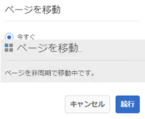
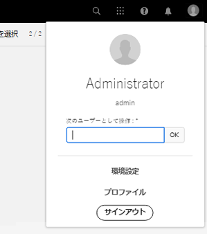

# 以前のサービスパック{#hotfixes-and-feature-packs-included-in-previous-service-packs}に含まれているホットフィックスと機能パック

## [!DNL Adobe Experience Manager] 6.5.7.0  {#experience-manager-6570}

[!DNL Adobe Experience Manager] 6.5.7.0は重要なアップデートであり、2019年4月の6.5リリース以降にリリースされた新機能、お客様からリクエストされた主な機能強化、パフォーマンス、安定性、セキュリティの改善が含まれています。サービスパックは[!DNL Adobe Experience Manager] 6.5にインストールされています。

[!DNL Adobe Experience Manager] 6.5.7.0で導入された主な機能と機能強化には、次のものが含まれます。

* ページの移動およびMSMロールアウトを非同期操作として実行すると、実行時のパフォーマンスへの影響を軽減できます。

* ユーザーは、カード表示と列表示でデジタルアセットを並べ替えることができます。

* [!DNL Assets] およびで [!DNL Dynamic Media] は、複数のアクセシビリティ強化がおこなわれています。この機能強化は、キーボードナビゲーション、スクリーンリーダーの使用、類似の支援テクノロジー(AT)を使用できるようにすることに関連しています。 [[!DNL Assets] enhancements](#assets-6570)および[[!DNL Dynamic Media] enhancements](#dynamic-media-6570)を参照してください。

* [パフォーマンスを最適化するためのフォームデ](../../help/forms/using/configure-data-sources.md#fdm-http-client-configuration) ータモデルHTTPクライアント設定。

* [レイアウトモードで各コンポーネントのリセ](../../help/forms/using/resize-using-layout-mode.md#resize-components) ットオプションを使用できる

* [!DNL Experience Manager] 6.5 Service Pack 7 Formsにより、次の点でパフォーマンスが向上しました。

   * アダプティブフォームを送信する際に、サーバー上でフィールド値を検証する。

   * [!DNL Automated Forms Conversion service]を使用したPDFフォームのアダプティブフォームへの変換

* [!DNL Experience Manager Forms]での[!DNL Microsoft SQL Server] 2019のサポート。

* [!DNL Microsoft] SQL Server 2016 Always On可用性グループのサポート（OSGiデプロイメントの高可用性を実現）。

* 組み込み型のリポジトリ（Apache Jackrabbit Oak）をバージョン 1.22.5 に更新しました。

[!DNL Experience Manager] 6.5.7.0で導入された機能と機能強化の完全なリストについては、[ [!DNL Adobe Experience Manager] 6.5 Service Pack 7](new-features-latest-service-pack.md)の新機能を参照してください。

[!DNL Experience Manager] 6.5.7.0リリースで提供された修正の一覧を以下に示します。

### [!DNL Sites] {#sites-6570}

* ページの[!UICONTROL タイムラップ]オプションを開き、「タイムライン」サイドレールオプションを開いたまま、[!UICONTROL サイト]コンソールに移動すると、`Failed to Load`エラーが発生します(NPR-34951)。

* [!UICONTROL タイムラップ]オプションは、選択された日時範囲の画像を表示しない(NPR-34951)。

* コンテンツフラグメントを含むページからフィルターが`getHeader()`を呼び出すと、`java.lang.AbstractMethodError`エラーが発生する(NPR-34942)。

* ページのパスに複数のコンテンツサブ文字列が含まれている場合、プレビューがレンダリングに失敗し、バージョン比較関数も失敗する(NPR-34740)。

* コンポーネントの`String`タイプラベルプロパティに数値を設定すると、コンポーネントを削除し、削除操作を取り消すことができます。 ただし、削除を取り消した後、ラベルプロパティが`String`から`Long`に変更されます(NPR-34739)。

* 次の例外は、ロックされたレイアウトを持つテンプレートをページに基づいてエクスペリエンスフラグメントを追加する際に発生します(NPR-34632)。

   ```TXT
   org.apache.sling.api.SlingException: Cannot get DefaultSlingScript: org.apache.sling.api.SlingException: Cannot get DefaultSlingScript: org.mozilla.javascript.EcmaError: TypeError: Cannot call method "getChildren" of null
   ```

* フォルダーを移動すると、トラバーサルの問題が発生し、次のエラーが発生する(NPR-34554)。

   ```TXT
   org.apache.sling.api.SlingException: Cannot get DefaultSlingScript. org.apache.jackrabbit.oak.query.RuntimeNodeTraversalException: The query read or traversed more than 100000 nodes. To avoid affecting other tasks, processing was stopped
   ```

* 新しいアセットが作成、公開、新しい場所に移動されると、`Request to complete move operation`ワークフローが作成され、「中止」状態になります。 新しいアセットをアップロードし、`move`操作を実行すると、保留中の状態の`Request to complete move operation`ワークフローが作成されます(NPR-34543)。

* エクスペリエンスフラグメントを[!DNL Experience Manager] 6.5.2環境から[!DNL Target]標準に書き出すと、ワークスペースプロパティが[!DNL Target]標準(NPR-34557)で使用できないので、API呼び出しが失敗します。

* [!UICONTROL 公開を管理]オプションを使用してページを公開できない。[!UICONTROL 公開]オプションが表示されないからである。(NPR-34542)

* テキストにスタイルを追加すると、`<div>`タグがテキストに追加され、そのスタイルをテキストに適用できなくなる(NPR-34531)。

* ポップアップメニューで項目を選択して必要なファイルを更新した場合、他のメニューに必須フィールドが空のので、ダイアログ値の保存は許可されません。(NPR-34529)

* カスタムテンプレートからページを作成してブループリント階層内に移動すると、そのページより前に削除されたコンポーネントがライブコピー階層内のページに表示され始める(NPR-34527)。

* 記事のスタイルがコンテンツに適用されると、そのスタイルは削除できなくなります(NPR-34486)。

* エクスペリエンスフラグメントのすべてのライブコピーとコピーが、同じ[!DNL Adobe Target]オファーIDを指している(NPR-34469)。

* 箇条書きリスト項目は、番号付きリストに加えて表示されます(NPR-34455)。

* 「ソースと比較」オプションで、ソースページとページの編集バージョンの違いが表示されない(NPR-34285)。

* ページを削除すると、バージョン管理の詳細は設定できなくなります(NPR-34159)。

* ユーザーが「[!UICONTROL 選択項目を開く]」ダイアログオプションを選択すると、キーボードフォーカスがページにある非表示のコントロールに移動します(CQ-4307779、CQ-4293601)。

* オーサー上の公開済みフォルダーを移動しても、パブリッシュインスタンス上のフォルダーパスは更新されません(CQ-4305144)。

* ユーザーが「[!UICONTROL すべて]を選択」オプションで`Enter`キーを選択した場合、キーボードフォーカスは「[!UICONTROL コントロールを作成]」オプションに移動しません(CQ-4293599)。

* `Esc`キーを選択した場合、フォーカスは親コントロールに復元されません(CQ-4293593、CQ-4293590)。

* [!DNL Sites] UIおよびコアコンポーネントのWCAG準拠を改善しました(CQ-4293448)。

*  このペ  ージではZoomおよびScale関数 [!DNL Sites Editor] が無効になっています(CQ-4282353)。

* 「右に回転」オプションを使用すると、スクリーンリーダーは現在の回転または反転状態のナレーションを停止します(CQ-4282128)。

* 「完了」および「設定をキャンセル」ダイアログボタンには、複数のタブストップがあります(CQ-4274601)。

* 同じレベルで同じ名前のページを移動することは許可されない(NPR-35041)。

* 「クリア(x) 」オプションを選択した後、キーボードフォーカスが[!UICONTROL フィルター]フィールドに移動しない(CQ-4293581)。

* [!DNL Experience Manager] 6.5.6.0にアップグレードすると、継承された段落システムの動作が変更され、正しく動作しない(NPR-35117)。

* キーボードユーザーは、[!DNL AEM Sites]ページの[!UICONTROL アクション]セクションを選択した後、タブフォーカスを適切な順序に移動できない(CQ-4307786)。

* コンテンツフラグメントの編集時に、RTEツールバーのリンクターゲットメニューリストでオプションを選択すると、コンテンツフラグメント作成者ダイアログがちらつき始めます(CQ-4305532)。

* キーボードユーザーは、下向き矢印キーを使用して「[!UICONTROL コンポーネントを追加]」ドロップダウンリストのオプションを選択できない(CQ-4295097)。

* [!DNL Sites]ページの「[!UICONTROL アセット]」タブのカレンダーメニューから日付を選択しても、タブのフォーカスが適切な順序に移ることはありません(CQ-4293600)。

* サイトページの編集時に使用できる「リンク」オプションまたは「テキスト」オプションを削除した後、タブフォーカスがキーボードユーザーの次のオプションまたは前のオプションに移動しない(CQ-4293597)。

* キーボードユーザーは、使用可能なオプションを表示して`Esc`キーを押した後で、[!UICONTROL アクション]セクションの「その他のオプション」にタブフォーカスを戻すことができません(CQ-4293592)。

* [!UICONTROL 編集]モードで画像の[!UICONTROL 回転]オプションを有効にすると、タブフォーカスが回転に留まらず、キーボードユーザーの[!UICONTROL やり直し]オプションに移動します(CQ-4293587)。

* 「[!UICONTROL リンクとアクション]」タブにある「[!UICONTROL 選択範囲を開く]」ダイアログで、「[!UICONTROL キャンセル]」オプションの後に、タブフォーカスがページ内の非表示の要素に移動します(CQ-4293579)。

* キーボードユーザーが画像を編集する際に、「[!UICONTROL 完了]」オプションに移動し、Enterキーを押しても、スクリーンリーダーが完了を読み上げない(CQ-4282351)。

* [!UICONTROL リンクおよびアクション]ダイアログで使用できる「上へ移動」および「下へ移動」オプションは、スクリーンリーダーおよびキーボードユーザーには使用できません(CQ-4281120)。

* [!UICONTROL プロパティ]ページ(CQ-4293581、NPR-34653)で「閉じる」(X)オプションに移動した後、キーボードユーザーがタブフォーカスを復元できない。

### [!DNL Assets] {#assets-6570}

[!DNL Adobe Experience Manager] 6.5.7.0では、次の問 [!DNL Assets] 題が修正され、次の機能強化がおこなわれました。

* このリリースでは、[!DNL Experience Manager Assets] のアクセシビリティに関する次の機能強化がおこなわれています。詳しくは、[ [!DNL Assets]](/help/assets/accessibility.md) のアクセシビリティ機能を参照してください。

   * キーボードを使用してタイムラインを移動する場合、`Esc`キーを押すと、フォーカスを失うことなく、[!UICONTROL 「すべてを表示」]オプションを折りたたむことができます(CQ-4293598)。
   * キーボードのTabキーを使用してナビゲートする場合、追加したタグから最後のタグを削除した後、タグフィールドにフォーカスが保持される(NPR-35109)。
   * [!DNL Experience Manager] コンポーネントに、スクリーンリーダーが使用する名前、役割、値に関する適切な情報が含まれるようになりました(NPR-34255)。
   * 「種類/サイズ」コンボボックス、リンクコンボボックス、言語コンボボックス、またはテキスト編集ボックスを削除すると、キーボードフォーカスが次または前のユーザーインターフェイス要素、またはより関連性の高いユーザーインターフェイス要素に戻ります(CQ-4293585)。
   * オプションの上にポインターを置くと、「選択」や「ダウンロード」などのヒントが表示されます。拡大鏡を使用している場合は、これらのヒントが原因でファイルのサムネールが表示されないことがあります。`Escape` キーを使用してオプションを削除した後に、フォーカスを保持できるようになりました。(CQ-4293554).
   * ページに表示されているグリッドからグリッドセルを選択すると、フォーカスが画面に表示されるアクションバーに移動します(CQ-4282127)。
   * ビジュアルユーザーは、[!DNL Experience Manager]ホームページ内のすべてのソリューションへのリンクに視覚的なヒント（下線と山括弧のアイコン）が表示されるので、通常のテキストとリンクを区別できます(CQ-4282072)。

* [!DNL Assets]では、次のユーザーエクスペリエンスの強化がおこなわれました。

   * カード表示と列表示でのアセットの並べ替えを有効にする(NPR-35097)。

* 6.5にアップグレードした後、Assets HTTP APIを使用してJSONファイルが生成された場合、ファイルで使用されるエンコーディングに問題があります(NPR-35129)。

* コレクションを作成する権限が与えられていないグループのユーザー（「コレクションを作成」オプションは使用できません）は、URL `https://[aem_server]:[port]/mnt/overlay/dam/gui/content/collections/createcollectionwizard.html/content/dam/collections?contentPath=/content/dam/collections`に直接アクセスしてコレクションを作成できます(NPR-35115)。

* 名前で並べ替えられた場合、検索されたアセットは大文字と小文字が区別されて並べ替えられます。 これにより、検索結果で順番に表示される大文字と小文字に基づいて、2つの異なる並べ替えリストが作成される(NPR-35068)。

* コンテンツフラグメントがエディターで開かれると、警告メッセージ(`Invalid value specified for a metadata property`)がエラーログに記録されます(NPR-35012)。

* 管理者権限を持たないユーザーは、[Experience Manager]デスクトップアプリケーションを使用して期限切れアセットを編集できます。 (NPR-34993).

* 同じアセットがAssetsユーザーインターフェイスにドラッグされ、新しいバージョンが作成されると、メタデータの変更が永続的に行われない(NPR-34940)。

* コレクションを編集する際に、ユーザーはコレクションのタイトルを削除し、変更を正常に保存できる(NPR-34889)。

* 重複した画像をアップロードする際に、削除オプションが表示されます。 「削除」を選択すると、画像をアップロードできます。 DAMアセットの更新ワークフローもトリガーされます(NPR-34744)。

* [!DNL Adobe Asset Link]を[!DNL Adobe InDesign]と共に使用する場合、検索結果にはフォルダーやコレクションは含まれず、アセットのみが含まれます(NPR-34699、CQ-4303666)。

* カード表示にカーソルを合わせると、カードで使用可能なクイックアクションに（自動的に）フォーカスした結果、画面がスクロールする(NPR-34514)。

* 複数のアセットのプロパティを一括編集する際に、「[!UICONTROL 保存]」オプションを選択すると、Bulk Editorの表示が閉じてメインの[!DNL Assets]ページにリダイレクトされます。 この動作は、[!UICONTROL 「保存して閉じる」]オプションの動作と同じで、予期されない動作です(NPR-34546)。

* 保存後、スマートコレクションに正しいユーザーインターフェイス設定が表示されません。 クエリは正しく保存されるが、インターフェイスには常に最後に追加されたオプションの述語が表示される(NPR-34539)。

* [!DNL Experience Manager]にアセットを追加すると、名前空間のないメタデータが読み込まれない(NPR-34530)。

* フォルダー上でアセットをドラッグして移動すると、ユーザーインターフェイスに「[!UICONTROL Lightboxにドロップ]」および「[!UICONTROL コレクションにドロップ]」のオプションも表示されます。 移動操作がキャンセルされても、ユーザーインターフェイスに後者の2つのオプションが引き続き表示される(NPR-34526)。

* コレクションページに`%>`記号が表示される(NPR-34499)。

* 列表示では、[!DNL Assets]は、上下にスクロールすると、すべてのアセットが表示される前に、重複するフォルダーおよびアセット名を表示します(NPR-34464)。

* 公開フォルダーを作成した直後にプライベートフォルダーを作成した場合、公開フォルダーはプライベートフォルダー設定を使用する(NPR-34415)。

* カード表示では、カードはアルファベット順に表示されず、カードはアルファベット順に並べ替えられない(NPR-34234)。

* カスケードルールを再度開いても、選択内容はユーザーインターフェイス上で維持されません(CQ-4301452)。

#### [!DNL Dynamic Media] {#dynamic-media-6570}

* [!DNL Dynamic Media]のアクセシビリティに関する次の機能強化がおこなわれました(CQ-4290306)。 詳しくは、 [!DNL Dynamic Media]](/help/assets/accessibility-dm.md)の[アクセシビリティ機能を参照してください。

   * スクリーンリーダー（JAWS、ナレーター）は、「埋め込みサイズ」メニューオプションのメニュー項目の名前、役割および状態をナレーションします(CQ-4290927)。
   * ユーザーは、`Tab`キーを使用してEメールリンクダイアログを移動できます(CQ-4290926)。
   * ビデオエンコーディングプロファイルを作成するワークフローは、スクリーンリーダーの機能強化を考慮すると、より使いやすくなります(CQ-4290623、CQ-4290622)。
   * `Tab`キーを使用して移動する場合、フォーカスはワークフロー内の適切なユーザーインターフェイス要素に移動し、インタラクティブビデオを作成します(CQ-4290621、CQ-4290620、CQ-4290619)。
   * 公開、アセットを編集、スマート切り抜きを編集、画像セットエディターの各ページが、Web 標準に準拠するように改善されました。支援テクノロジー(AT)のユーザーが、これらのページを簡単にナビゲートし、画像の切り抜きなどのアクションを実行できるようになりました(CQ-4290617、CQ-4290616、CQ-4290613、CQ-4290612、CQ-4290610、CQ-4290614)。
   * ビューアが改善され、ユーザーがキーボードを使用して移動できるようになりました(CQ-4290615)。
   * キーボードおよびスクリーンリーダーのユーザーは、切り抜き機能を使用できます(CQ-4290609)。
   * キーボードユーザーは、ホットスポットをより適切に管理できます(CQ-4290604、CQ-4290603)。

* 会社名とフォルダー名が同じ場合、 [!DNL Experience Manager]でリモートイメージセットを編集できない(NPR-31340)。

* [!DNL Dynamic Media]画像にホットスポットを追加した後、または[!DNL Dynamic Media]ビデオまたは[!DNL Experience Fragment]を画像付きで編集した後に出力をプレビューしようとすると、zインデックスの順序が正しくありません(CQ-4307267)。

* [!DNL Dynamic Media] 混在メディアセットが再処理されると同期が失敗する(CQ-4307184)。

* [!DNL Dynamic Media]への自動同期が設定されているフォルダーにアセットを移動した場合、そのアセットは同期されません(CQ-4307122)。

* [!DNL Dynamic Media] ネイティブのHTML5ビデオコントロールを使用してiOSデバイスでビデオが再生されない(CQ-4306977、CQ-4306727)。

* スマート切り抜きが適用されている画像をダウンロードできない(CQ-4304558)。

* フォルダーをDynamic Mediaに選択的に公開できない(CQ-4304526)。

* [!DNL Experience Manager]からビデオファイルを非公開にしても、設定済みのScene7デプロイメントからアダプティブビデオセットを非公開にしません(CQ-4304405)。

* パノラマメディアコンポーネントにパノラマ画像アセットを追加し、ページを更新すると`Uncaught ReferenceError: $ is not defined`エラーが発生します(CQ-4302810)。

* [!UICONTROL ビューアプリセットエディター]で、[!UICONTROL PanoramicImage/PanoramicImage_VR]プリセットを編集する際に、`PanoramicView`コンポーネントで`PANORAMICVIEW_AUTOROTATE`修飾子ラベルを使用できません(CQ-4302443)。

* ビデオがMixedMediaSetの最初でない場合、ビデオキャプションは表示されません(CQ-4298161)。

* iPhoneモバイルデバイスのHTML5 eCatalogビューアでは、ページをめくったりページをめくったりすることはできません(CQ-4296611)。

* モバイルデバイスでスウォッチをスクロールすると、スウォッチが表示領域の右と外に数秒間スクロールしてから、ビューに戻ります(CQ-4296439)。

* ビューアプリセットのマスターレコードが作成されると、CSSとアートワークは公開されず、ビューアプリセットのみが公開されます(CQ-4262205)。

* [!UICONTROL インタラクティブビデオ/画像]コンポーネント内で、特定のホットスポットのエクスペリエンスフラグメントをリンクしようとしても、選択したエクスペリエンスフラグメントのパスは表示されません。 代わりに、パスフィールドから空の値を返します(NPR-35146、CQ-4298136)。

* IVVエディターでエクスペリエンスフラグメントをプレビューできない(CQ-4308560)。

* 画像にホットスポットを追加してエクスペリエンスフラグメントを選択する場合、エクスペリエンスフラグメントのサブフォルダーとバリエーションを選択できません(CQ-4307455)。

* アップロード後に、画像以外のアセットが公開済みとして表示されない(CQ-4306415)。

#### [!DNL Experience Manager] 3Dアセット  {#three-d-assets-6570}

* `DAM CQ MIME Type` サービスにより、間違ったMIMEタイプが3Dアセットに適用され、誤ったレンダリングが発生する(NPR-34731)。

### [!DNL Commerce] {#commerce-6570}

* コマース製品コレクションのユーザーインターフェイスで、1つのコレクション内に15個を超える製品がリストされない(NPR-34502)。

### Platform {#platform-6570}

* HTTPSを介したHTTPセッションが無効化されない(NPR-35083)。
* ユーザーインターフェイスから日次または週次のメンテナンスタスクを開始すると、`NullPointerException`が返される。(NPR-34953)
* W3Cバリデーターが、準拠しているクライアントライブラリのJavaScriptファイルに関する警告を報告する(NPR-34898)。
* `AudienceOmniSearchHandler`関数は、廃止されたインデックスを使用します(NPR-34870)。
* Experience Managerからサインアウトしても、Cookieが消去されない(NPR-34743)。
* `TagManager` APIの`findByTitle`関数は、タグ名に特殊文字が含まれている場合に機能しません(NPR-34357)。
* ユーザー同期パッケージを読み込むプロセスが失敗する(NPR-34399)。
* `ariaLabel`および`ariaLabelledby`プロパティのサポートを`Coral.Masonry`コンポーネントに追加しました(GRANITE-29962)。
* 最新のコアコンポーネントパッケージをインストールした後、コンテンツフラグメントを含むページでDispatcherキャッシュが更新されない(CQ-4306788)。
* ローカライズされたタグ名が引用符(`"`)で囲まれていると、ユーザーインターフェイスに正しく表示されません(CQ-4305439)。

### ユーザーインターフェイス {#ui-6570}

* コンポーネントプロパティの[!UICONTROL Link to]フィールドに、指定した文字列と一致しないオートコンプリート候補が表示されます(NPR-34865)。

* 2日間に分散する日次メンテナンスウィンドウをスケジュールすると、AEMに次のエラーメッセージが表示される(NPR-35280)。

   ```TXT
   ERROR The start time must precede (be less than) the end time
   ```

### 統合 {#integrations-6570}

* 既存の[!DNL Adobe Launch]設定の編集に失敗する(NPR-35045)。
* IMS設定と[!DNL Adobe Target Standard]環境を使用している場合、[!DNL Experience Fragments]を[!DNL Adobe Target]に書き出せない(NPR-34555)。
* [!UICONTROL 作成]オプションは、フォルダーから[!UICONTROL オーディエンス]ページ(NPR-35151)に移動すると、[!UICONTROL オーディエンス]ページに表示されます。

### Sling {#sling-6570}

* デフォルトのログインヘルスチェックは、存在しないユーザーの資格情報を検証します(NPR-34686)。

### 翻訳プロジェクト{#translation-6570}

* [!DNL Experience Manager]で翻訳プロジェクトをキャンセルしても、キャンセルする要求は翻訳プロバイダーに送信されない。(NPR-34433)

### [!DNL Communities] {#communities-6570}

* 製品内の不公平な用語のすべてのインスタンスは、受け入れられた同等のものに置き換えられます(NPR-34311)。
* [!DNL Google+] がソーシャル共有オプションのリストから削除される(NPR-33877)。

### [!DNL Brand Portal] {#brandportal-6570}

* [!UICONTROL リストビュー]でのアセットの選択に対してユーザーインターフェイスが応答しない(NPR-34728)。

### [!DNL Forms] {#forms-6570}

>[!NOTE]
>
>[!DNL Experience Manager Forms] では、予定されている [!DNL Experience Manager] サービスパックリリース日の 1 週間後にアドオンパッケージをリリースします。

>[!NOTE]
>
>[!DNL Experience Manager] Service Packには、の修正が含まれていませ [!DNL Forms]ん。別の[!DNL Forms]アドオンパッケージを使用して配信されます。 さらに、JEE上の[!DNL Experience Manager Forms]の修正を含む累積的なインストーラーがリリースされました。 詳しくは、「 [AEM Formsアドオンのインストール](#install-aem-forms-add-on-package) 」および「 [JEE上のAEM Formsのインストール](#install-aem-forms-jee-installer) 」を参照してください。

**アダプティブフォーム**

* [!DNL Experience Manager]サービスパック6を適用した後、クラシックUIを使用してアダプティブフォームを編集できない(NPR-35126)。

* PDFをアダプティブフォームに変換する場合、タブ付きレイアウト上のフォームデータモデルを使用してネストされたパネルに値を設定することはできません。 また、コードエディターを使用して、ラジオボタングループの値を静的な配列で動的に設定する際に問題が発生する(NPR-35062)。

* アダプティブフォームのテキストフィールドコンポーネントに日本語の文字を入力する場合、最大35文字を超える文字を指定できます(NPR-35039)。

* アダプティブフォームは、フォームの送信後に表示される&#x200B;**[!UICONTROL ありがとう]**&#x200B;ページに、`owner`や`status`などの不要なパラメーターを表示します(NPR-34989)。

* [!UICONTROL 添付ファイル]コンポーネントの[!UICONTROL ファイル選択]ダイアログに、サポートされていないファイルタイプと、アダプティブフォームの送信中にエラーが発生する選択が表示されます(NPR-34970)。

* フォームの前にテキストを含む[!DNL Experience Manager Sites]ページにアダプティブフォームを挿入すると、カーソルのフォーカスは、フォームの前のテキストではなく、直接フォームに移動する。(NPR-34947)

* [!UICONTROL 「データを使用し]  [!DNL Experience Manager] てプレビュー」オプションを使用して6.2データXMLファイルを使用してアダプティブフォームに事前入力すると、適切に動作しない(NPR-35087)。

* アダプティブフォームのデータディクショナリを更新すると、アダプティブフォームがキャッシュされた値を返すので、フォームは変換されない。(NPR-34845)

* キャッシュの無効化が原因で、フラグメントがアダプティブフォームに読み込まれるのに時間がかかる(NPR-34567)。

* アダプティブフォームのスクリーンリーダーに対してタブナビゲーションが適切に機能しない(NPR-34544)。

**Correspondence Management**

* フロートタイプを含む数値データを含むXMLタグの値をドラフトとして保存できない(NPR-35050)。

* ES3からアセットを移行する場合、アセットには編集不可の2つのデフォルト条件が含まれます(NPR-34972)。

* レター内のデータディクショナリを編集すると、「[!UICONTROL 貸したコンテンツ]」セクションに、有用な情報ではなく、回転する長方形が表示されます(NPR-34853)。

**インタラクティブコミュニケーション**

* [!DNL Forms]アドオンパッケージのインストール後に使用できるインタラクティブ通信のロールアウト設定名は、標準のロールアウト設定名と重複します(NPR-34976)。

**Document Security**

* 新しいDocument Securityポリシーを保存すると、Experience ManagerFormsに`Relative validity period is required`エラーメッセージが表示されます(NPR-34679)。

* Document SecurityでPDF 2.0ドキュメントを保護できない(CQ-4305851)。

セキュリティ更新について詳しくは、[Experience Managerセキュリティ速報ページ](https://helpx.adobe.com/security/products/experience-manager.html)を参照してください。

## [!DNL Adobe Experience Manager] 6.5.6.0  {#experience-manager-6560}

Adobe Experience Manager 6.5.6.0は、2019年4月の&#x200B;**4月の6.5リリースの一般リリース(GA)以降にリリースされた新機能、お客様からリクエストされた主な機能強化、パフォーマンス、安定性、セキュリティの改善を含む重要なアップデートです。**&#x200B;これはAdobe Experience Manager 6.5の上にインストールできます。

Adobe Experience Manager 6.5.6.0で導入された主な機能および機能強化には、次が含まれます。

* [!UICONTROL クイック公開]または[!UICONTROL 公開を管理]ウィザードを使用して、[!DNL Experience Manager]または[!DNL Dynamic Media]にアセットを選択的に公開または非公開にする。

* [!DNL Dynamic Media]ユーザーインターフェイスを使用して、コンテンツ配信ネットワーク(CDN)にキャッシュされたコンテンツを無効にします。

* Brand PortalからExperience Managerアセットへのアセット投稿フォルダーの公開が、プロキシサーバーを通じてサポートされるようになりました。

* [!DNL Experience Manager Assets]内のプライベートフォルダーを削除すると、自動生成されたプライベートフォルダーのグループがクリーンアップされるようになりました。

* ビデオ[!UICONTROL ビューア]プリセットエディターの修飾子の説明を[!DNL Dynamic Media]で更新しました。

* [!DNL Dynamic Media]コネクタのステータスを反映する新しい会社設定が追加されました。

* 以前のDynamic Mediaの`test`と`aiprocess`のデフォルトオプションは、`Thumbnail`に更新されました。これにより、ユーザーはサムネールのみを作成し、ページ抽出とキーワード抽出をスキップする必要があります。`Rasterize`

* [クライアントでのアダプティブフォームの事前入力](../../help/forms/using/prepopulate-adaptive-form-fields.md#prefill-at-client)

* [双方向SSL実装を使用したサーバー上のRESTful APIとのフォームデータモデルの統合](../../help/forms/using/configure-data-sources.md)。

* [翻訳済みアダプティブフォームページのキャッシュ機能が強化されました](../../help/forms/using/configure-adaptive-forms-cache.md)。

* automated forms conversionサービス](https://docs.adobe.com/content/help/en/aem-forms-automated-conversion-service/using/convert-existing-forms-to-adaptive-forms.html)での[Adobe Signテキストタグのサポート。

* [[!DNL Automated Forms Conversion service]を使用して、色付きのフォームをアダプティブフォームに変換する](https://docs.adobe.com/content/help/en/aem-forms-automated-conversion-service/using/convert-existing-forms-to-adaptive-forms.html)をサポートします。

* SMB 2およびSMB 3プロトコルのサポート。

* 組み込み型のリポジトリ（Apache Jackrabbit Oak）をバージョン 1.22.4 に更新しました。

Experience Manager6.5.6.0で導入された機能と機能強化の完全なリストについては、「 [Adobe Experience Manager 6.5サービスパック6の新機能](new-features-latest-service-pack.md) 」を参照してください。

[!DNL Experience Manager] 6.5.6.0リリースで提供された修正の一覧を以下に示します。

### [!DNL Sites] {#sites-6560}

* [!DNL Sites]または[!DNL Screens]で、プロジェクトを選択し、[!UICONTROL パブリケーションの管理]をクリックします。 ユーザーインターフェイスエラーが原因で、[!UICONTROL 公開を管理]ウィザードに進めません。 特に、「[!UICONTROL 公開]」オプションは機能しません(NPR-34099)。
* 「[!UICONTROL 継承をキャンセル]」または「[!UICONTROL 継承を無効にする]」オプションを選択解除した後、iParsys（継承された段落システム）の位置が元のデフォルトの位置に戻ることはありません(NPR-34097)。
* `RolloutConfigManagerFactoryImpl`がロールアウト設定を読み込めない場合、見つからない設定の読み込みは試みません。 キャッシュされた設定を返します(NPR-34092)。
* テキストコアコンポーネントで、ソースHTML編集オプションを使用した後、`em`タグのクラスが削除される(NPR-34081)。
* Experience Manager6.3.3からExperience Manager6.5.3にアップグレードした後、ロールアウトプロセスに時間がかかり、ロールアウトがタイムアウトエラーで失敗する(NPR-34049)。
* `htmlwriter`は属性値をエンコードしません。 XFマークアップに存在するマークアップは、デコードされた属性値（`&#34`ではなく`"`）で書き出されます。 XFを書き出したを使用するVisual Experience Composerで、ターゲット側の問題を引き起こします(NPR-34048)。
* [!DNL Experience Manager Sites]内のページを移動する際に、理由を持つバージョン作成失敗をキャプチャするためのログ機能を強化する(NPR-34014)。
* [!DNL Rich Text Editor]で、すべてのテキストが削除されると、段落タグも削除されます(NPR-33976)。
* （クラシックUIで）`siteadmin`ページが開かれたり更新されたりすると、`New`メニューのオプションが無効になります(NPR-33949)。

   

* [!DNL Content Fragment]は`ContentFragmentUsePojo`で失敗するので、`TemplatedResource`として使用できません(NPR-33911)。
* 同期移動操作と非同期移動操作は、同時転送が原因でエラーになる場合があります。 ページ移動操作は、非同期移動にのみ制限されます。 これにより、ページの同時移動が妨げられる(NPR-33875)。
* [!UICONTROL オーサ] ーインスタンスからパブリッシュインスタンスにコンテンツをレプリケートする「Publication」操作を管理すると失敗し、JavaScriptエラーが発生する(NPR-33872)。
* 複数のページまたはアセットを選択してバージョンを作成する場合、新しいバージョンは最後に選択されたページまたはアセットに対してのみ作成される(NPR-33866)。
* ライブコピーを含むブループリントページを別のフォルダーに移動します。 元のフォルダーに移動すると、移動操作がエラーなく失敗する(NPR-33864)。
* 移動アクションを使用して[!DNL Sites]コンソールでWebページの名前を変更すると、ウィザードの最後の手順で、2つの重なり合うダイアログが表示されます(NPR-33831)。

   

* コピー&amp;ペースト操作中に、コピー上の`cq:acLinks`および`cq:acUUID`プロパティが削除される(NPR-33794)。[!DNL Adobe Campaign]
* 分離された親ライブコピーの子ページでロールアウトを試みると、[!DNL Experience Manager]によってヌルポインター例外が生成される(NPR-33676)。
* レイアウトコンテナをコピーして再度ページに貼り付けると、レイアウトコンテナの[!DNL RTE]コンポーネントが表示されなくなります。 [!DNL RTE]コンポーネントは編集できませんが、ページの更新時に表示されます(NPR-33662)。
* 異なるブレークポイント（中、大）に対してレイアウトコンポーネントのサイズを変更する場合、レイアウトが期待どおりに動作しない(NPR-33608)。
* [!DNL RTE]のインライン編集モードで、画像をドラッグしてもテキストコンポーネントに対しては機能しない。(NPR-33602)
* ブループリントページ内に、ページ名と同じ名前のコンポーネントを作成できます。 ロールアウト時に、コンポーネントの名前を変更するために`_msm_moved`が末尾に付加されます。 コンポーネントは、[!UICONTROL 段落システム]の最後に移動されます(NPR-33535)。
* 多くのページやアセットでoffTimeまたはonTimeが設定されている場合、リソースが大量に消費され、起動時とシャットダウン時にシステムの速度が低下します(NPR-33482)。
* `/content/experience-fragment`のCRUD権限を持つユーザーがフォルダーを削除できない(NPR-33436)。
* [!DNL Experience Fragments]セクションの親フォルダーで、[!UICONTROL Adobe Target書き出し形式]のオプションとして[!UICONTROL HTMLとJSON]を選択できます。 この親フォルダーのサブフォルダーに対して、タッチ操作対応UIに同じプロパティが表示されます。 ただし、CRXDEでは、`cq:adobeTargetExportFormat`の場合、`html,json`を表示する代わりにHTMLのみが表示されます(NPR-33423)。
* ページエイリアスの公開または非公開はサポートされていません。 他の場合に要求するようなオプションを削除する(NPR-33415)。
* [!DNL Experience Manager]内の別の場所に、特定のタグを移動できます。 また、移動前と移動後に、異なるページに適用することもできます。 ページのプロパティを編集する際に、タグが同じであっても、タグが編集用に表示されない(NPR-33353)。
* 複数のレイアウトコンテナを含むテンプレートからレイアウトコンテナが削除されると、ページテンプレートが正しくレンダリングされない。(NPR-33347)
* テンプレートエディターで、`/content/`の下の100000ページ以上で使用されているテンプレートを削除してみます。 エラーメッセージが表示されずにエラーが表示される(NPR-33312)。
* `PageRedirectServlets`はURLフラグメントまたはアンカーの後にクエリー文字列を配置するので、アンカーを含む[!DNL Experience Manager]ページへのリダイレクトはオーサーインスタンスで機能しません。(NPR-34288)
* `/content/campaign`の下にブランドを作成すると、キャンペーンの作成が許可されない構造になります。 [!UICONTROL 「Create ] Brandoption」は、「Create」オプションがないので、オファーやア [!UICONTROL クティビティを作成] する機能を持たずに、新しく作成されたブラ  ンドをそのまま残します(NPR-34113)。
* ページの[!DNL Live Copy]を休止すると、エディターモードで確認できるように、で継承が解除されます。 ページプロパティで、継承を表すアイコンが誤って、継承が存在し、壊れていないことを示す(NPR-34017)。
* 多数の参照を持つページは非同期で移動できず、移動操作が失敗する場合があります(CQ-4297969)。
* URLに`/`文字を含むWebページが、オーサリング中に応答しなくなります。 オーサリング中にコンポーネントが追加されると、CPU使用率が増加し、ブラウザーが応答を停止します(CQ-4295749)。
* 参照モードでは、NVDAは、「タイプ/サイズ」メニューオプションから選択した値を読み上げません。 選択した要素にビジュアルフォーカスがない。 スクリーンリーダーに依存するユーザーは参照モードを使用できません(CQ-4294993)。
* Webページを作成する際に、ユーザーは[!UICONTROL コンテンツページ]テンプレートを選択できます。 「[!UICONTROL ソーシャルメディア]」タブで、ユーザーが「[!UICONTROL 優先XFバリエーション]」を選択します。 NVDA参照モードでエクスペリエンスフラグメントを選択するには、キーボードキーを使用できません(CQ-4292669)。
* ハンドルバーライブラリを、より安全なv4.7.3に更新しました(NPR-34484)。
* [!DNL Experience Manager Sites]コンポーネントの複数のクロスサイトスクリプティングインスタンス(NPR-33925)。
* 新しいフォルダーを作成する際のフォルダー名フィールドに、保存されたクロスサイトスクリプティングに対する脆弱性がある(GRANITE-30094)。
* [!UICONTROL ウェルカム]ページの検索結果とパス完了テンプレートが、クロスサイトスクリプティングに対して脆弱である(NPR-33719、NPR-33718)。
* 非構造化ノードにバイナリプロパティを作成すると、バイナリプロパティダイアログでクロスサイトスクリプティングがおこなわれる(NPR-33717)。
* CRX DEインターフェイスで[!UICONTROL アクセス制御テスト]オプションを使用する場合のクロスサイトスクリプティング(NPR-33716)。
* ユーザ入力は、クライアントに情報を送信する際に、様々なコンポーネントに対して適切にエンコードされない(NPR-33695)。
* Experience Managerインボックスのカレンダー表示のクロスサイトスクリプティング(NPR-33545)。
* `childrenlist.html`で終わるURLは、404応答ではなくHTMLページを表示します。 このようなURLは、クロスサイトスクリプティングに対して脆弱です(NPR-33441)。


### [!DNL Assets] {#assets-6560}

**Experience Managerアセットのアクセシビリティの強化**

* キーボードキーを使用して、アセットの[!UICONTROL 参照]リストのインタラクティブユーザーインターフェイスオプションにアクセスし、フォーカスできるようになりました(NPR-34115)。

* スクリーンリーダーが、検索ページ上の述語の意図されたアクションを通知するようになった(NPR-34104)。

* 検索ページと検索結果ページに、スクリーンリーダーユーザーをより深く理解できるように、より多くの情報が表示されるタイトルが追加されました(NPR-34093)。

* スクリーンリーダーが、アセット[!UICONTROL プロパティ]ページの「[!UICONTROL 基本]」タブで選択したタグを削除するオプションを読み上げるようになりました(NPR-33972)。

* リスト表示の各行の要素が、スクリーンリーダーによって同じ行の要素としてアナウンスされるようになった(NPR-33932)。

* `Tab`キーを使用してナビゲートする際のユーザーフォーカスが、バージョンプレビューの閉じるオプションに移動するようになった。(NPR-33863)

* オムニサーチが閉じられた後、ユーザーのフォーカスが検索アイコンに移動するようになった(NPR-33705)。

* キーボードキーを使用してナビゲートした場合のコントラストが強化され、操作可能なユーザーインターフェイスオプションが、より目立つ視覚的フォーカスを持つようになりました。 キーボードユーザーは、フォーカスされた領域を識別できる(NPR-33542)。

* キーボードを使用したドラッグ機能が、スクリーンリーダーの参照モードの[!UICONTROL メタデータスキーマエディター]で動作するようになりました(CQ-4296326)。

* リンク共有ダイアログで、参照モードで移動する際に、スクリーンリーダーが、

   * ダイアログが読み込まれるとすぐに、テーブル情報を読み上げない。

   * リストに表示されているすべての自動候補に移動できます。

   * 「[!UICONTROL 電子メールアドレスを追加/検索]」に対して表示される自動候補の読み上げ(CQ-4294232)。

* `Esc`キーを使用してカード表示からクイックアクションアイコンを削除しても、最後にフォーカスされた項目からキーボードフォーカスが削除されなくなりました(CQ-4293554)。

* ユーザーインターフェイスのインタラクティブオプションの場合、スクリーンリーダーがアイコンのリテラル名ではなくその目的を通知するようになりました(CQ-4272943)。

* キーボードフォーカスが[!UICONTROL フライアウト]、[!UICONTROL InlineZoom]、[!UICONTROL Shoppable_Banner]、[!UICONTROL Zoom_dark]、[!UICONTROL Zoom_light]、[!UICONTROL ZoomVertical_darkアセットの詳細[!UICONTROL [!DNL Dynamic Media]の「ビューア]」(CQ-4290605)でキーボードのTabキーを使用して移動する際の、a11/>および[!UICONTROL ZoomVertical_light]オプション。]

* [!UICONTROL アセットのプ] ロパティページの「保  存して閉じる」オプションが、キーボードキーを使用してアクセスできるようになりました(NPR-34107)。

* ログインページのユーザー名とパスワードの組み合わせが正しくないことに起因するエラーメッセージが、エラーが発生するたびにスクリーンリーダーによって通知されるようになりました(NPR-33722)。

* [!DNL Experience Manager]ヘッダーセクションで、参照モードで移動する際に、スクリーンリーダーが以下を通知するようになりました。

   * [!UICONTROL 内の自動編集候補を入力して、オムニサーチで検索]を実行します。

   * [!UICONTROL ソリューション]、[!UICONTROL ヘルプ]、[!UICONTROL インボックス]、[!UICONTROL ユーザー]の各オプションで展開または折りたたまれた状態。

   * [!UICONTROL ヘルプ]オプションの下の「[!UICONTROL ヘルプを検索]」フィールドに検索文字列を入力すると表示される[!UICONTROL ヘルプ]の検索ステータスメッセージ。

   

   *図： [!UICONTROL ヘルピンヘルプメ] ニューを  検索します。*

   * 誤った値が[!UICONTROL 「[!UICONTROL ユーザー]」オプションの下の「]として動作」フィールドに入力され、フォーカスが正しくテキストフィールドに移動すると、エラーメッセージが表示される(NPR-33804)。

   

   *図： [!UICONTROL ヘッダーの] ユーザーメニュ  ーのフィールドとして実行します。*

* 次の中のキーボードを使用して、フォーカスを変更できるようになりました。

   * [!UICONTROL リンク共有ダイアログの「電子メ] ールアドレスを検 [!UICONTROL 索/] 追加」フィールド

   * [!UICONTROL フォルダーのプロパテ] ィの「権限」タブの「閉じら [!UICONTROL れたユーザーグ] ループ」の下にユーザーまたはグルー  プフィールド  を追加します(NPR-34452)。

**Experience Managerアセットで修正された問題**

[!DNL Adobe Experience Manager] 6.5.6.0で [!DNL Assets] は、次の問題が修正されました。

* アセットのタイムラインから選択した場合、注釈がハイライト表示されない(CQ-4302422)。

* [!DNL Adobe InDesign]テンプレートを使用して作成したマーケティングコラテラルアセット（パンフレット、チラシ、名刺など）のプレビューに、改行と段落区切りが表示されない(NPR-34268)。

* テキスト抽出と、アップロードされたPDFファイルの全文検索が機能しない(NPR-34164)。 この問題を修正するには、Service Pack 6をインストールした後に[!DNL sAdobe Experience Manager]デプロイメントを再起動します。

* 複数ページのアセットのタイムラインで、アセットをタイムラインビューで参照すると、特定のサブアセットに固有の注釈が表示されるのではなく、すべてのサブアセットに適用された注釈が表示される。(NPR-34100)

* フォルダーにJavaScript、CSSまたはJSONファイル形式のリソースが含まれている場合、「 [!UICONTROL 公開を管理] 」オプションを使用してアセットフォルダーが公開されない(NPR-34090)。

* オムニサーチで適用されているタグまたはフィルターの選択を解除または削除すると、検索クエリが複数回実行され、検索時間が長くなる(NPR-34078)。

* （フォルダー内のアセット上の）ワークフローが進行中または保留中の場合、カード表示では、ワークフローが完了または終了するまでページがリロードされます。 したがって、作成者は、下にスクロールする必要があるフォルダー内のアセットを操作できません(NPR-33986)。

* ユーザーが公開済みアセットを新しい場所に移動すると、「[!UICONTROL 再公開]」オプションの選択を解除しても、アセットが再公開されます。 これにより、多数の孤立したアセットがパブリッシュインスタンス上に配置されます。 ただし、デフォルトの動作では、公開済みアセットに対する移動操作によって自動的に非公開になります。このアセットは、アセットの移動時に作成者が「[!UICONTROL 再公開]」オプションを選択した場合に再公開されます(NPR-33934)。

* コレクション内のアセットの[!UICONTROL アセットを移動]ページでは、[!UICONTROL 調整/再公開]オプションなど、すべてのHTMLコンテンツが読み込まれるわけではありません。 したがって、ユーザーは移動操作を完了できない(NPR-33860)。

* アセットを移動し、移動したアセットの名前とタイトルに特殊文字を追加すると、そのアセットの新しい場所に（同じ名前の）追加のフォルダーが作成されます(NPR-33826)。

*  ダウンロードダイアログで「電子メール」が選択さ  れている場合、アセットのダウンロ  ードボタンが無効になる(NPR-33730)。

* アセットに対して一括操作（一括メタデータ編集など）を実行すると、「リクエストURIが長すぎます」というエラーが表示される(NPR-33723)。

* [!UICONTROL Add through JSON path]機能を[!UICONTROL Folder Metadata Schema Form Editor]に追加すると、アップロードされたJSONファイルの値にスペースや特殊文字が含まれている場合、JavaScriptエラーが発生し、[!UICONTROL Dropdown]フィールドに生成された選択肢を選択または削除できない。

* [!DNL desktop app]または[!DNL Adobe Asset Link]の「[!UICONTROL 開く]」オプションを使用してアセットが更新され、[!DNL Adobe Experience Manager]に同期された場合、アセットの静的レンディションは更新されません(CQ-4296279)。

* 列表示では、一連のアセットに対する移動操作によって、[!UICONTROL 「フィルター] 」オプションを使用する前に選択したアセットも移動されます。 「[!UICONTROL フィルター]」オプションを使用すると、前の選択が選択解除されることに注意してください(NPR-34018)。

* 名前に特殊文字が含まれるアセットの検索候補の特殊文字の前にバックスラッシュが追加される(NPR-33834)。

* [!UICONTROL フォルダーメタデータスキーマフォーム]でドロップダウンのルールを作成すると、ユーザーは[!UICONTROL フィールドの選択肢]列から値を選択できなくなります(CQ-4297530)。

* [!DNL Experience Manager] 6.5 Service Pack 5または以前のバージョンを[!DNL Experience Manager] 6.5にインストールすると、（`/var/workflow/models/dam`で作成された）アセットのカスタムワークフローモデルの実行時コピーが削除されます(NPR-34532)。 ランタイムコピーを取得するには、HTTP APIを使用して、ワークフローモデルのデザイン時コピーをランタイムコピーと同期します。
   `<designModelPath>/jcr:content.generate.json`

**Dynamic Mediaで修正された問題**

* ユーザーがビデオプロファイルの作成後に編集内でエンコーディング設定を定義した場合、スマート切り抜き設定はビデオプロファイルから削除されます(CQ-4299177)。

* アセットの詳細ページのサイドレールオプション（例：[!UICONTROL 概要]、[!UICONTROL タイムライン]、[!UICONTROL ビューア]）を切り替えると、アセットがページ読み込み時にちらつく(NPR-34235)。

* 再処理ジョブでは、次の問題が発生します。

   * ジョブIDが再処理ジョブによって返されたジョブハンドルにありません。

   * ビデオログのジョブを再処理する際に、フルパスではなく、ファイル名のみを使用します。

   * 再処理ジョブには、アセットタイプを静的に設定するオプションはありません。

   * `ExcludeFromAVS` オプションが指定されていません(CQ-4298401)。

* イメージプロファイルが複数（例えば、11）の縦横比を持つフォルダーに追加されると、スマート切り抜き機能がエラーで失敗する(NPR-34082)。

* Dynamic Media Scene7(CQ-4299727)で設定された[!UICONTROL ツール]内の[!UICONTROL 「ワークフロー]」タブの[!UICONTROL ワークフローアーカイブ]ページをユーザーがスクロールすると、DAMアセットの更新ワークフローがトリガーされます。[!DNL Adobe Experience Manager]

* [!UICONTROL ビューアプリセットエディター]の「[!UICONTROL 動作]」タブの記号がローカライズされません(CQ-4299026)。

* メインビューがレスポンシブモードの場合、画像はビューアに収まらない誤ったレイアウトで表示されます(CQ-4298293)。

* [!UICONTROL Adobe Experience Manager]の画像プリセットに対する変更がScene7 Publishing Systemに同期されない(CQ-4299713)。

### [!DNL Commerce] {#commerce-6560}

* アセットが移動された場合、製品からのアセットへのリンクがリファクタリングされない(NPR-34098)。

### プラットフォーム{#platform-6560}

* アップグレードされたExperience Managerインスタンスで診断ツールを使用してログをダウンロードできない。(NPR-34336)
* `cq-wcm-api`基盤パッケージの特定のバージョンへの依存関係が原因で、アップグレードが失敗します(CQ-4300520)。
* デフォルトエージェント（パブリッシュ）設定の「 **[!UICONTROL 接続タイムアウト]** 」および「 **[!UICONTROL ソケットタイムアウト]** 」のデフォルト値が指定されていません(NPR-33707)。
* `/etc/map.publish`下のマッピング設定の更新がサイトページに反映されない(NPR-34015)。
* [APIリファレンス](https://helpx.adobe.com/experience-manager/6-5/sites/developing/using/reference-materials/javadoc/com/day/cq/tagging/package-summary.html) ドキュメントには、パッケージのドキュメ `com.day.cq.tagging` ントは含まれていません(CQ-4295864)。

### ユーザーインターフェイス {#ui-6560}

* オフロードするブラウザーインターフェイスに、一部のジョブトピックが表示されない(NPR-34308)。
* [設定ブラウザー](/help/sites-administering/configurations.md)インターフェイスにすべての設定が表示されない(NPR-33644)。
* 別のユーザーとして実行するユーザーを検索する際に`Esc`キーを押すと、ユーザーリストの代わりに&#x200B;**[!UICONTROL User]**&#x200B;ダイアログが閉じます(NPR-34084)。

### 統合 {#integrations-6560}

* 長い名前のアクティビティが[!DNL Adobe Target]と同期されない(NPR-34254)。

* 新しいAdobeLaunch設定を作成する際にプロパティを選択すると、次のエラーメッセージが表示される。(NPR-33947)

   ```javascript
   GET http://hostname:Port/libs/cq/dtm-reactor/content/configurations/createcloudconfigwizard/jcr:content/body/items/form/items/wizard/items/general/items/fixedcolumns/items/container/items/general/items/property/data.html?query=&start=0&end=25&imsConfigurationId=Adobe%20Launch&companyId=&_charset_=utf-8 400 (Bad Request)
   ```

### 翻訳プロジェクト {#translation-6560}

* ユーザーの`authorizableID`に特殊文字が含まれている場合、翻訳プロジェクトは作成されません。(NPR-33828)

### Sling {#sling-6560}

* ヘルスチェックとパターン検出には、重複する機能があります。 その結果、ヒースチェックが製品から削除される(NPR-33928)。

### WCM {#wcm-6560}

* 基盤コンポーネント — 基盤画像コンポーネントをページに追加して画像を参照する場合、`Undo`操作は機能しない(NPR-34516)。

* ページ移動操作を使用できない(CQ-4303028)。

### [!DNL Communities] {#communities-6560}

* ソーシャルメディアで投稿を共有すると、古いオプションGoogle+が表示される(NPR-33877)。

* コミュニティメンバーが、グループテンプレートや他のグループ機能の設定を変更できない。(NPR-33530)

* 画像のハイパーリンクタグがフォーラム投稿で適切に生成されない(NPR-33464)。

* アクセシビリティのエラーは、コミュニティ割り当て機能で識別されます(NPR-33442)。

* 管理コンソールを通じて追加されたコミュニティグループの既存のユーザーは、コミュニティグループコンソールで変更を行うと、ユーザーリストから削除されます(NPR-34315)。

* `TagFilterServlet`は、潜在的に機密データを漏れる(NPR-33868)。

<!--
* Tag filters are vulnerable to sensitive information disclosure (NPR-33868).
-->

### [!DNL Forms] {#forms-6560}

>[!NOTE]
>
>[!DNL Experience Manager] Service Packには、の修正が含まれていませ [!DNL Forms]ん。別の[!DNL Forms]アドオンパッケージを使用して配信されます。 さらに、JEE上の[!DNL Experience Manager Forms]の修正を含む累積的なインストーラーがリリースされました。 詳しくは、「 [AEM Formsアドオンのインストール](#install-aem-forms-add-on-package) 」および「 [JEE上のAEM Formsのインストール](#install-aem-forms-jee-installer) 」を参照してください。

[!DNL Experience Manager Forms] 6.5.6.0アドオンパッケージをインストールした後：

* [!DNL Experience Manager Forms]インスタンスを停止します。

* `bcpkix-1.51`、`bcmail-1.51`および`bcprov-1.51`のJARファイルを`crx-repository\launchpad\ext`ディレクトリから削除します。

* ` sling.bootdelegation.class.org.bouncycastle.jce.provider.BouncyCastleProvider`プロパティを`sling.properties`ファイルから削除します。

* [!DNL Experience Manager Forms]インスタンスを再起動します。

**アダプティブフォーム**

* 見つからないアダプティブフォームフラグメントがある場合、そのアダプティブフォームがレンダリングに失敗する(NPR-34302)。

* アダプティブフォームフィールドのヘルプコンテンツの説明に段落のHTMLタグが表示される(NPR-34116)。

* 「**[!UICONTROL サーバーで再検証]**」プロパティを選択すると、アダプティブフォームが送信に失敗する(NPR-33876)。

* **[!UICONTROL RESTエンドポイントへの送信]**&#x200B;送信アクションは、アダプティブフォームに対しては機能しません(CQ-4299044)。

* アクセシビリティ：必須フィールドの添付ファイルをアップロードせずにアダプティブフォームを送信しようとしても、フォーカスが添付フィールドに自動的に移ることはありません(CQ-4298065)。

* アダプティブフォームの表に行を追加する場合、「**[!UICONTROL 上に追加]**」および「**[!UICONTROL 下に追加]**」の各オプションでは、適切な結果が表示されません(CQ-4297511)。

* [!UICONTROL 値コミット]スクリプトが正しくトリガーされず、アダプティブフォームでデータが失われます(CQ-4296874)。

* ローカライズされたアダプティブフォームに対して日付選択が正しく機能しない(NPR-34333)。

* ファイル名にアンダースコアまたはスペースが含まれている場合、そのファイルをアダプティブフォームに添付することはできません(CQ-4301001)。

* ネストされた繰り返し可能なパネルの回数が親よりも多い場合、ネストされた繰り返し可能なパネルの発生回数はすべて事前入力に失敗する(NPR-33666)。

* アダプティブフォームには、いくつかのオープンリソースリゾルバーがあります。 これらは送信エラーを引き起こします。 この問題は断続的に発生します(CQ-4299407)。

* フィールド設定を初めて開いたときに、プロパティアイコンが表示されません(CQ-4296284)。

* アダプティブフォームの送信時に、`afPath`、`afSubmissionTime`、`signers`などの送信メタデータを編集できます。 この問題を解決するために、クライアント側のフォーム送信データからメタデータ値が削除されます。 ユーザーは、`FormSubmitInfo`オブジェクトを使用して、これらの値をサーバーから取得できます(NPR-33654)。

* ユーザー入力は、クライアントに情報を送信する際に、[!DNL Forms]コンポーネントに対して適切にエンコードされない(NPR-33611)。

**ワークフロー**

* ワークフローの承認者が添付ファイルをアップロードすると、添付ファイルの名前が`undefined`に変更されます(NPR-33699)。

* [!DNL Experience Manager] ワークフローのパージ操作が失敗し、次のエラーメッセージが表示される(NPR-33575)。

   `java.lang.UnsupportedOperationException: The query read more than 500000 nodes in memory`

* [!DNL Experience Manager Forms] フォームを送信した後 [!DNL Windows] に、のアプリが応答を停止する(NPR-34409)。

* AEM Service Packをインストールすると、項目の&#x200B;**To Do**&#x200B;リストがリンクとして表示されません。 **To Do**&#x200B;項目のテキストには、HTMLタグが含まれます(NPR-34317)。

**インタラクティブコミュニケーション**

* ネストされた繰り返し可能なコンポーネントを含むテキストドキュメントフラグメントを含めると、インタラクティブ通信の保存に失敗する(NPR-34095)。

**Correspondence Management**

* データディクショナリ値を含むテキストドキュメントフラグメントを変更すると、エージェントUIが応答を停止する(NPR-33930)。

* [!DNL Microsoft Word]ドキュメントからレターのテキストドキュメントフラグメントにコンテンツをコピー&amp;ペーストすると、フォーマットの問題が発生する(NPR-33536)。

**ドキュメントサービス**

* OutputおよびFormsサービスを使用してXDPファイルからPDFファイルを生成すると、テキストが欠落し、重なり合う結果になります(NPR-34237、CQ-4299331)。

* HTMLファイルをPDFに変換する場合、`MaxReuseCount`属性は設定できません(NPR-33470)。

* Reader拡張機能のインタラクティブ機能を含むPDFファイルをダウンロードする場合、[!DNL Adobe Reader]を使用して添付ファイルをPDFファイルに追加することはできません(NPR-33729)。

**Document Security**

* [!DNL Experience Manager]サービスパックをインストールした後に、PDFファイル内のHSMベースの証明書を使用して署名操作を実行できない(NPR-34310)。

**デザイナー**

* Designerバージョン6.5.xでXFormsを開けない(CQ-4295322)。

* Designerを開くと、ようこそ画面に誤った年が表示されます(CQ-4295289)。

* サーバーに[!DNL Acrobat DC]をインストールすると、「**[!UICONTROL フォームを配布]**」オプションが無効になります(CQ-4296304)。

セキュリティ更新について詳しくは、[Experience Managerセキュリティ速報ページ](https://helpx.adobe.com/security/products/experience-manager.html)を参照してください。

## [!DNL Adobe Experience Manager] 6.5.5.0  {#experience-manager-6550}

Adobe Experience Manager 6.5.5.0は、2019年4月の&#x200B;**4月の6.5リリースの一般リリース(GA)以降にリリースされた新機能、お客様からリクエストされた主な機能強化、パフォーマンス、安定性、セキュリティの改善を含む重要なアップデートです。**&#x200B;これはAdobe Experience Manager 6.5の上にインストールできます。

[!DNL Adobe Experience Manager] 6.5.5.0で導入された主な機能と機能強化には、次のものが含まれます。

* 匿名でのCRXDE Liteへのアクセスは許可されていません。 代わりに、ユーザーはログイン画面に移動します。 [CRXDE Lite](/help/sites-developing/developing-with-crxde-lite.md)を使用した開発を参照してください。

* [!DNL Adobe Experience Manager]インボックスに表示する列名をカスタマイズします。

* ページエディター、コアコンポーネント、RTE、管理ユーザーインターフェイスなど、Experience ManagerWebコンテンツ管理(WCM)の様々な領域でのアクセシビリティが向上しました。

* [!DNL Interactive Communication]をドラフトとして保存します。

* JEE上のFormsExperience Managerの[!DNL Oracle WebLogic 12]のサポート。

* [!DNL Adobe Experience Manager Assets]ユーザーインターフェイスフローの例外処理を改善しました。

* Dynamic Media Scene7の公開URLを取得するために、新しいメソッド`getRemoteAssetPublishURL`が`com.day.cq.dam.api.s7dam.scene7.ImageUrlApi`インターフェイスに追加されました。

* [Webコンテ](#assets-6550) ンツアクセシビリ [!DNL Adobe Experience Manager Assets] ティガイドライン(WCAG)に準拠したアクセシビリティの強化。

* Adobe Experience Manager内からパッケージ共有の統合を削除しました。

* 組み込み型のリポジトリ（Apache Jackrabbit Oak）をバージョン 1.22.3 に更新しました。

Experience Manager6.5 Service Pack 5で導入された主な機能の一覧については、 [Adobe Experience Manager 6.5 Service Pack 5の新機能](new-features-latest-service-pack.md)を参照してください。

[!DNL Experience Manager] 6.5.5.0リリースで提供された修正の一覧を以下に示します。

### [!DNL Sites] {#sites-6550}

* Experience Managerサイトには、エイリアスからページを公開または非公開にするオプションが用意されています。 このオプションが機能しない(NPR-33415)。
* 複数のテンプレートを含むテンプレートからレイアウトコンテナを削除すると、そのテンプレートが正しくレンダリングされない(NPR-33347)。
* Experience Managerのサイトページが、複数のライブコピーを含む大きなコンテンツセットに含まれている場合、ページバージョン履歴のプレビューを読み込めない(NPR-33311)。
* 「移動」コマンドを使用してExperience Managerサイトページの名前を変更すると、ページタイトルが更新されない(NPR-33264)。
* 列ビュー内でページを移動すると、列が消える(NPR-33216)。
* 言語コピーのローカルコンポーネントの名前がブループリント内のコンポーネントの名前と同じで、コンポーネントがブループリントからロールアウトされる場合、ローカルコンポーネントの名前に「`_msm_moved`」が追加されない。(NPR-33208)
* ページリダイレクトサーブレットは、ResourceTypeが`cq:Page`でないExperience ManagerサイトのURLに.htmlを追加します(NPR-33176)。
* サブツリーを貼り付ける場合、対応するサブページを貼り付けるかどうかを決定するオプションはありません(NPR-33149)。
* コンポーネントのライブ使用の結果数は49に制限されます(NPR-33058)。
* スキーマにコンテンツフラグメントをベースにし、そのフラグメントに必須のテキスト領域またはパスフィールドが含まれている場合、コンテンツフラグメントの保存に失敗する(NPR-33007)。
* デフォルトのエクスペリエンスフラグメントコンポーネントを使用してカスタムコンポーネントを作成し、Experience Managerサイトページで使用すると、Experience Managerにカスタムコンポーネントの参照（使用状況）が表示されない。(NPR-32852)
* 参照数が多いフォルダーの名前を変更すると、そのフォルダーへの参照の多くが更新されない(NPR-32765)。
* ソース編集オプションを有効にすると、インラインのフルスクリーンオプションに使用できるようになりますが、リッチテキストエディターの編集ダイアログとフルスクリーンオプションには表示されません(NPR-32763)。
* 複数フィールドがあり、ブループリントのページプロパティに必須フィールド（ドロップダウンやパスフィールドなど）が含まれている場合、そのような複数フィールドを含むページをロールアウトすると、ライブコピーのページプロパティは保存されません(NPR-32751)。
* スクリーンリーダーは、見出し構造を使用してページを移動することはできません。 さらに、「Components」タブのラベルが正しくない(NPR-32648)。
* ページネーションが開始すると、エクスペリエンスフラグメントピッカーがすべての項目を読み込まない(NPR-32605)。
* ライブコピーの読み取り、変更、作成および削除をおこなう作成者権限は失効します。 各作成者は、ブループリント内でページを移動するための読み取りおよび変更権限を明示的に提供する必要がありました(NPR-32550)。
* Adobe Analyticsと統合されているページのLaunchをコンテンツ作成者が作成できない(NPR-32548)。
* ユーザーが同期を使用して継承を再開すると、親ページのライブコピーがブループリントと同期されず、誤ったステータスが表示される(NPR-32500)。
* Experience Managerサイトエディターページの読み込みに15秒以上かかる(NPR-32413)。
* 一部のフィールドで、「継承をキャンセル」オプションが表示されない。(NPR-32362)
* エクスペリエンスフラグメントコンポーネントのパスを選択し、「選択ダイアログを開く」チェックボックスを選択した場合、パスブラウザーで選択されたパスに移動しない(NPR-32308)。
* Experience Manager6.2からExperience Manager6.5にアップグレードすると、静的テンプレートのParsysコンポーネントが正しく表示されません。 Parsysコンポーネントの高さが0に設定され、その中のコンポーネントが表示されない(NPR-33663)。
* ユーザーがレイアウトコンテナをコピーして同じページに貼り付けると、レイアウトコンテナ内のコンポーネントが表示されない(NPR-33648)。
* Dispatcherヘルスチェックで、ログファイルに`Invalid cookie header`警告メッセージが表示される(NPR-33629)。
* PreferencesServletにXSSが反映される(NPR-33438)。
* 匿名ユーザーはCRXDE Lite機能にアクセスできます(GRANITE-27790)。

### [!DNL Assets] {#assets-6550}

>[!IMPORTANT]
>
>[!DNL Experience Manager desktop app]のWindowsユーザーは、[!DNL Adobe Experience Manager 6.5.5.0]インスタンス上のDAMリポジトリにアクセスするために、[デスクトップアプリケーションバージョン2.0.3.2](https://docs.adobe.com/content/help/en/experience-manager-desktop-app/using/release-notes.html#whats-new-added)にアップグレードすることをお勧めします。 デスクトップアプリケーションバージョン2.0.2を使用して[!DNL Adobe Experience Manager] 6.5.5.0インスタンスのDAMリポジトリにアクセスする際に問題が発生する可能性があるので、

**Experience Managerアセットのアクセシビリティの強化**

* アセットの[!UICONTROL タイムライン]パネルの[!UICONTROL 新しいバージョン]の下に[!UICONTROL コメント]リストにキーボードフォーカスを移し、[!UICONTROL バージョンコメントを作成]するクリック可能なオプションが追加されました。(NPR-33424)

* アセットの「[!UICONTROL 設定を表示]」オプションにアクセスし、キーボードキーを使用して[!UICONTROL 設定を表示]ダイアログの設定を変更できるようになりました(NPR-33420)。

* コンボボックスのリストボックスポップアップ（異なるページの様々なフィールド）で、スクリーンリーダーがアナウンス可能なオプションのリストとしてエントリが表示されるようになりました(NPR-33516)。

* 並べ替え可能なヘッダーの並べ替え機能（リスト表示、[!UICONTROL タイムライン]表示、[!UICONTROL 公開を管理]ページ）が、スクリーンリーダーによって通知され、列ヘッダーの並べ替えコントロールにキーボードを使用してアクセスできるようになりました。(NPR-32979)

* コメントカード、バージョン更新、コンボボックス、メニューの山形アイコンなどのクリック可能な要素に焦点を当て、キーボードを使用して操作できるようになりました(NPR-33514)。

* [!UICONTROL インサイトビュー]のインサイトアイコン（使用方法、インプレッション数およびクリック数）の機能（またはアクションの目的）が、スクリーンリーダーによって正しくアナウンスされるようになりました。(NPR-33513)

* 読み取り専用フォームフィールド（例えば、アセット[!UICONTROL プロパティ]の[!UICONTROL 「基本」タブ]の無効なフィールド）が、キーボードを使用してフォーカスできるようになりました(NPR-33493、CQ-4273031)。

* 様々な入力フィールドのラベルが、テキストの入力時に消えたプレースホルダーラベルだけでなく、永続的なラベル（したがってアクセス可能）になりました(NPR-33475)。

* 異なる見出しレベル（ページタイトルやセクション見出しなど）が、スクリーンリーダーユーザーに対して異なるレベルの見出しとして認識されるようになった(NPR-33471)。

* リンクやオプション（アセットページのヘッダーとズームオプション、フォルダーナビゲーション）などのインタラクティブなユーザーインターフェイス要素が、キーボードを使用してアクセスできるようになりました(NPR-33468、CQ-4271412)。

* [!UICONTROL 公開を管理]ページの[!UICONTROL オプション]、[!UICONTROL 範囲]、[!UICONTROL ワークフロー]の進行状況インジケーターが、タブではなく、進行状況インジケーターとしてスクリーンリーダーに正しく読み上げられるようになりました。(NPR-33416)

* アセット[!UICONTROL プロパティ]またはカード表示の「[!UICONTROL 詳細]」タブの「[!UICONTROL 評価]」セクションなど、星評価アイコンの色は、視覚が限られ、色の知覚がないユーザーに対して適切なコントラストが表示されるように変更される。

* アセットの詳細ページの[!UICONTROL コメント]フィールドの横にある山形の上向き矢印が、キーボードキーを使用してアクセスできるようになりました(NPR-33397)。

* アセット[!UICONTROL プロパティ]と左側のパネルのナビゲーション（アセットユーザーインターフェイス）の[!UICONTROL タグ]ダイアログの展開状態と折りたたみ状態が、スクリーンリーダーによって正しく通知されるようになりました。(NPR-33396)

* [!DNL Adobe Experience Manager]アセット上のすべての参照済みページのタイトルが一意になりました(NPR-33343)。

* ツリー構造をナビゲートする際に、ツリービューコントロールの様々な要素が、スクリーンリーダーによって正しく通知されるようになった(NPR-33304)。

* アセットの詳細ページの[!UICONTROL タイムライン]表示の異なるバージョンのアセットが、キーボードキーを使用してアクセスできるようになりました(NPR-33283)。

* オムニサーチコンボボックスに表示される検索候補の名前が、検索機能の使用時にスクリーンリーダーによって通知されるようになった(NPR-33280)。

* クリック可能な要素と[!UICONTROL [!UICONTROL リンク]へ移動]が、スクリーンリーダーによってクリック可能な要素としてアナウンスされるようになりました(NPR-33278)。

* [!UICONTROL Share Link]ダイアログのテーブル構造情報（行1、セル1、テーブルなど）は、ダイアログが開いたときに、スクリーンリーダーによってアナウンスされなくなる(NPR-33268)。

* 様々なコンボボックス要素の目的（アセットプロパティの「基本」タブの「パス」フィールドや「選択ダイアログを開く」オプションなど）が、スクリーンリーダーによって正しく通知されるようになりました。(NPR-33235)

* リスト表示テーブルの行が選択可能な情報が、キーボードフォーカスが置かれたときに、スクリーンリーダーユーザーに伝わるようになりました。 ポインタが行にカーソルを合わせると、スクリーンリーダーが情報を読み上げる(NPR-33234)。

* [!UICONTROL プロパティ]の[!UICONTROL 「基本]」タブの[!UICONTROL 「タグ」]フィールドの下にある、選択された各タグを削除するオプション（[!UICONTROL x]を含む）が、スクリーンリーダーにアクセスできるようになりました。(NPR-33206)

* カレンダーの日付選択が、スクリーンリーダーユーザーと目の見えるキーボードユーザーによって、キーボードを使用してフォーカスでき、操作可能になりました(NPR-33200)。

* リスト表示とカード表示を切り替える切り替えが、（表示の調整に関する）機能をスクリーンリーダーに正しく表示するようになりました(NPR-33069)。

* 左側のレールのメニューにアクセスできるようになりました。 メニューを拡張する機能と目的は、スクリーンリーダーによって適切にアナウンスされる(NPR-33068)。

* リストボックスやその他の多くのユーザーインターフェイス要素が、目の見えないスクリーンリーダーユーザーがアクセスできるようになり、それらに関する次の情報がスクリーンリーダーによって通知されるようになった(NPR-33040)。

   * フォームを送信する前に、要素に対してユーザー入力が必要かどうかを示します。
   * 要素が編集不可かどうか。
   * ウィジェットが選択されているかどうか。

* フィルターのサイドバーを開くオプションが、キーボードを使用してアクセスできるようになりました(NPR-32842、CQ-4273018)。

* リスト表示の列ヘッダーのチェックボックスコントロールがアクセス可能になり、コントロールを使用する目的がスクリーンリーダーによって通知されるようになった(NPR-32722、NPR-33005)。

* カレンダー日付選択の時間(HH)および分(mm)フィールドのラベルは、プレースホルダーラベルではなく永続的なラベルになり、ユーザーがこれらのフィールドにテキストを入力したときに消えなくなりました(NPR-32720)。

* （ベルのアイコンをクリックした後に表示される）通知のリンクテキストが、スクリーンリーダーユーザーに通知され、各リンクにタブを使用してアクセスする(NPR-32645)。

* インサイト [!UICONTROL ビューアで、キーボードを使用してアクセス可能になったアセットカードの「]」、「 [!UICONTROL ダウンロード]」、「 [!UICONTROL プロパティ] 」、「その他のアクション」オプションを選択しま  す(NPR-32609)。

* キーボードを使用してアクセスした場合に、視覚的に非表示のコンテンツ（検索結果のヘッダーメニューバーのコンテンツなど）がスクリーンリーダーによってアナウンスされなくなった(NPR-32606)。

* カレンダーの日付選択で、次の月と前の月に移動するコントロールのラベルの目的が、スクリーンリーダーによってアナウンスされるようになった(NPR-32604)。

* 星評価アイコンが、キーボードキーを使用してフォーカス可能で操作可能になった(NPR-32513)。

* ビデオボリュームを制御する機能が、（ボリュームスライダーにフォーカスするための）タブと（ボリュームを調整するための）矢印キーを介してキーボードでアクセスできるようになりました(NPR-32065)。

* ファイルサイズフィルターの下限([!UICONTROL From])および上限([!UICONTROL To])入力フィールドの目的が、目の見えないスクリーンリーダーユーザーに対して通知されるようになりました。(NPR-32064)

* [!UICONTROL 作成と翻訳]フォームの[!UICONTROL 言語]メニューが、参照モードのスクリーンリーダーでアクセスできるようになりました(CQ-4293906)。

* [!UICONTROL 参照]パネルが次の機能強化でアクセスできるようになりました(NPR-33261、CQ-4293798)。

   * 参照モードで、スクリーンリーダーのフォーカスが、「[!UICONTROL サイト参照]」、「[!UICONTROL アセット参照]」、「[!UICONTROL コピー]」、「[!UICONTROL フォーム参照]」の各セクションの下にある、非表示の複数行編集フィールドに移動しなくなりました。

   * スクリーンリーダーが、[!UICONTROL サイト参照]および[!UICONTROL 言語コピー]要素の役割を読み上げるようになりました。

   * ブラウズモードでのスクリーンリーダーのフォーカスは、意味のある順序で様々な要素に移行する。

* [!UICONTROL メタデータス] キーマエディターページとその要素がキーボードを使用してアクセスできるようになり、スクリーンリーダーに適するようになりました(CQ-4290962、CQ-4272953)。

* 選択したタグを削除する`X`記号の目的が、選択したタグの数と共にスクリーンリーダーによって通知されるようになりました(CQ-4273017)。

* スクリーンリーダーを使用する目の見えないユーザーが混乱するのを避けるために、装飾用のアイコンと画像がスクリーンリーダーで無視されるようになりました(CQ-4272944)。

**Experience Managerアセットで修正された問題**

[!DNL Adobe Experience Manager] 6.5.5.0 Assetsでは、次の問題が修正されました。

*  コレクション内 [!UICONTROL のア] セットのワークフローダイアログの作成の開始オプションが無効になり、ワークフローがトリガーされない。(NPR-32471)

* メタデータスキーマでカスケードポップアップを使用する場合、（子ドロップダウンから）アポストロフィを含むドロップダウンオプションを選択して保存すると、アセット[!UICONTROL プロパティ]を再度開くと、選択されたアポストロフィオプションが消える。(NPR-32649)

* [!UICONTROL アセットインサイ] トの同期ジョブは、次のエントリに移動する代わりに（Analytics側で）無効なエントリが見つかった場合に停止し、失敗します(NPR-32674)。

* パノラマビューアのモバイルブラウザでは、モーションセンサーがデフォルトで無効になっているので、ジャイロスコープは機能しません(CQ-4272937)。

* [!UICONTROL 6.5.1] に6.5.3をインストールすると、Connected Assetsの設定ウィザードが404エラーで動作しない(NPR-32730)。

* XMPの書き戻しプロセス中に、すべてのカスタム名前空間メタデータプロパティが、設定された名前空間プレフィックスではなく、カスタム名前空間プレフィックスをns2に変更します(NPR-32748)。

* 遅延読み込みがトリガーされず、通知インボックスからタスクを確認するために選択したときに100個のアセットのみが表示される(NPR-32750)。

* `NullPointerException` は、新しく作成されたユーザープロファイル(SAML/SSO)にノードの環境設定が見つからないことが原因で発生します。このエラーは、新しくログインしたユーザーが[!DNL Adobe Experience Manager Stock]統合を使用できないようにします(NPR-32777)。

* 10,000個を超えるアセットを含むスマートコレクションを開くと、ログにトラバーサル警告が表示される(NPR-32980)。

* Dynamic Media Scene7実行モードで動作している[!DNL Adobe Experience Manager]でアセットを別のフォルダーに移動する際に、アセット名が小文字に変更される(NPR-32995)。

* 検索結果からプロパティに移動し、検索結果に戻って削除した後で、検索されたアセットを削除することはできない(NPR-32998)。

*  アセットインターフェイスの移動で宛先フォルダーを選択す [!UICONTROL る] と、次のオプションが無効のままになる。(NPR-33356)

*  親ノード（単一の子フォルダーが表示される）を選択してから子フォルダーを選択すると、次のオプションが有効にならない。(NPR-33275)

* 読み取り、作成、変更などの他の権限が付与されている場合でも、削除権限を持つAdobeのAsset Link(AAL)でのチェックインおよびチェックアウト権限が無効になっている(NPR-33272)。

* スマート切り抜きレンディションは、アセットダウンロードダイアログで使用できない(NPR-33167)。

* スマート切り抜きプロファイルを持つフォルダーの下のPDFのレンディションレールを開くとログに例外が表示されます(CQ-4294201)。

* Dynamic Media Scene7実行モードとのExperience Manager時に[!UICONTROL Dynamic Media同期モード]がデフォルトで無効になっている場合、画像プリセットは公開されません(CQ-4294200)。

* バルクアップロード中のアセット処理が停止し、ワークフローインスタンスにDAM更新アセットのスタックインスタンスが表示される(CQ-4293916)。

* Experience ManagerでのDynamic Media設定の作成は機能しますが、ユーザーインターフェイスで「保存」を選択しても何も起こりません(CQ-4292442)。

* Safari/Macでのプログレッシブ再生で、F4Vビデオアセットのプレビューが機能しない(CQ-4289844)。

* 親フォルダー内にあるアセットのスマート切り抜き時に、名前にドット`.`文字が含まれる追加のフォルダーが作成されます(CQ-4289337)。

* サムネールが壊れ、ビデオをコピーしたときにビデオ処理バナーが表示されない(CQ-4284125)。

* ディメンショナルビューアで、空のカメラビューを持つ一部のモデルに対して、Firefoxで空のサムネールが誤って表示される。(CQ-4283447)

* 6.5.5.0で修正されたパフォーマンスの問題は次のとおりです(CQ-4279206)。

   * 大きなバイナリをDynamic Media Image Processing Serverにアップロードするには、時間がかかりすぎる。

   * Dynamic Media Scene7アーキテクチャが原因で、Experience Managerのサムネール生成時間が長くなりました。

* Dynamic Media Scene7の移行に関する問題は、多数のアセットを持つお客様に対して失敗します(CQ-4279206)。

* `setVideo`を使用すると、ビデオ360ビューアのレイアウトが壊れ、`video= modifier`を使用すると、ビデオが下にシフトします(CQ-4263201)。

* SDLパッケージのインストール中にExperience Managerメッセージが表示される(NPR-33175)。

* Experience ManagerのSSRF脆弱性(NPR-33435)。

### プラットフォーム{#platform-6550}

* `/etc/maps`の下に`sling:match`マップエントリが作成された場合、[!DNL Sling]フィルターは呼び出されません(NPR-33362)。
* [!DNL Apache Lucene]のセグメント化障害が原因でExperience Managerがクラッシュする(NPR-32988)。
* [!DNL Jackson] コアパッケージがExperience Manageruberjarファイルに見つからない(NPR-32848)。
* CRXDE Liteが、ノードの`jcr:primaryType`プロパティに対する読み取り権限を持たないユーザーのコンテンツを読み込まない。(NPR-32611)
* [!DNL Granite] メンテナンスタスクスケジューラーは、Experience Managerデプロイメント中に再初期化の頻度が高すぎます(CQ-4294627)。
* SQLクエリが長時間（例えば7時間）実行されると、Experience Managerは応答を停止する(NPR-33044)。

### ユーザーインターフェイス {#ui-6550}

* ラジオボタンの選択がマルチフィールドで保持されない(NPR-33309)。
* 遅延読み込み制限がリスト表示で機能しない(NPR-33124)。
* 一致がない場合、オムニサーチ結果ページにメッセージが表示されない(NPR-32974)。
* オムニサーチフィルターは、`/content`ノード以下で選択された場所を無視して一致するすべてのを返す(NPR-32849)。

### 統合 {#integrations-6550}

* Adobe Targetコンポーネントを含むページが公開されると、内部キャッシュがクリアされる(NPR-33162)。
* Adobe Targetとの統合は、[!DNL Windows Internet Explorer] 11では機能しません(NPR-33111)。
* Adobe Targetを設定する際に、レポートソースを選択すると、「[!UICONTROL 会社] 」と「[!UICONTROL レポートスイート] 」のフィールドが表示されない(NPR-32502)。
* [!DNL Adobe I/O]を使用して[!DNL Experience Fragments]を書き出す場合、ソース製品などのメタデータがAdobe Targetに書き出されない(NPR-32159)。
* ローカルのExperience Manager管理グループの権限を持つIMSユーザーは、IMS設定を作成または変更できない。(NPR-33045)
* Adobeの起動設定ページにすべてのレコードが表示されない(NPR-33011)。
* JavaScriptエラーが発生したため、content-authorsグループのユーザーがAdobe Targetコンポーネントのプロパティを編集できない。(NPR-32996)
* JSONのクロスサイトスクリプティング(NPR-32744)。

### 翻訳プロジェクト {#translation-6550}

* 翻訳されたタグは、サードパーティのExperience Managerサービスから翻訳に読み込まれません(NPR-33154)。
* 翻訳設定ページに、翻訳に使用されたものとは異なる翻訳プロバイダーが表示される(NPR-32971)。
* エクスペリエンスフラグメントフォルダーを既存の翻訳プロジェクトに追加すると、新しいプロジェクトが作成される(NPR-32843)。
* 翻訳ジョブの実行時にログに`NullPointerException`エラーが表示される(NPR-32628)。

### WCM {#wcm-6550}

* ページエディター — [!DNL Sites]ページエディターでは、キーボードのみのユーザーは、ヘッダーで使用可能なすべてのオプションを使用してタブフォーカスを移動するのではなく、メインコンテンツにスキップできません(CQ-4293883)。
* ページエディター — Wellコンポーネントを使用し、保存されたデータを含むパネルが、[!DNL Chrome]および[!DNL Firefox]バージョンで更新されたので表示されません(CQ-4292995)。
* MSM — ページからコンポーネントを削除しても、公開済みバージョンのページからはコンポーネントは削除されません(CQ-4292360)。

### [!DNL Brand Portal] {#assets-brand-portal-6550}

* [!DNL Brand Portal]から公開済みのメタデータスキーマを削除すると、エラーが発生します(CQ-4292063)。
* 管理者がAdobe開発者コンソールを通じてBrand Portalで[!DNL Experience Manager Assets] 6.5.4を設定した場合、[!DNL Brand Portal]ユーザーは、投稿フォルダーのアセットを[!DNL Brand Portal]から[!DNL Experience Manager]に公開できません(NPR-33046)。
* 親フォルダーの重複レプリケーションが競合を引き起こす(NPR-33001)。

### [!DNL Communities] {#communities-6550}

* クイック編集メニューオプションを使用してモデレートコンソールのカードを削除できない(NPR-33117)。
* [!UICONTROL アクティビティストリーム]ページへのアクセス時にエラーが発生する(NPR-33146)。
* オーサーインスタンスで削除されたグループが、すべてのパブリッシュインスタンスから削除されない(NPR-33199)。
* 作成者は、新しいグループを作成した後、 [!DNL Internet Explorer] 11の[!UICONTROL コミュニティグループ]セクションにリダイレクトされない(NPR-33205)。
* メッセージインボックス内のExperience Managerにアクセスしても、メッセージのステータスは読み取りに変更されない(NPR-32764)。
* [!DNL Communities]グループを編集し、サムネール画像を変更しても、グループサムネール画像は更新されない(NPR-32599)。
* ユーザーがコミュニティ内の別のユーザーに電子メールを送信できない(NPR-32598)。
* 送信されたブログは、ユーザーがページを更新するまで表示されない(NPR-32391)。
* ユーザー生成コンテンツ(UGC)の通知および購読のバージョンを作成する際に、ソースページの誤ったIDが保存されます(CQ-4279355、CQ-4289703)。
* クロスサイトスクリプティングの問題(NPR-33203)。

### ワークフロー {#workflow-6550}

* 左側のレールの「[!UICONTROL タイムライン]」オプションの読み込みに、予想以上の時間がかかる(NPR-32851)。
* Experience Managerインスタンスを再起動した後、コレクションのレビュータスクの電子メールに誤ったペイロードリンクが含まれる(NPR-32774)。

### [!DNL Forms] {#forms-6550}

>[!NOTE]
>
>Experience Managerサービスパックには[!DNL Forms]の修正が含まれていません。 別の Forms アドオンパッケージを使用して配布されます。さらに、JEE上のAEM Formsの修正を含む累積的なインストーラーがリリースされました。 詳しくは、「 [Experience ManagerFormsアドオンのインストール](/help/release-notes/sp-release-notes.md#install-aem-forms-add-on-package) 」および「 [JEE上のExperience ManagerFormsのインストール](/help/release-notes/sp-release-notes.md#install-aem-forms-jee-installer) 」を参照してください。

* Correspondence Management:ターゲット領域内のアセットの順序は、レターを送信した後でシャッフルする(NPR-33359、NPR-33153)。
* アダプティブForms:ユーザーがアダプティブフォームを編集する際に、[!UICONTROL ページ情報]メニューの「[!UICONTROL ワークフローを開始]」オプションが機能しない(NPR-33004)。
* アダプティブForms:ユーザーが複数の添付ファイルを含むアダプティブフォームを保存できない。(NPR-32997)
* アダプティブForms:アダプティブフォームでパネルレイアウトを変更すると、エラーが発生する(CQ-4293880)。
* アダプティブForms:アダプティブフォームの辞書の文字列に新しい行が`&#xa;`文字を辞書に追加する(NPR-33266)。
* アダプティブFormsのアクセシビリティ：ユーザーがアダプティブフォームをHTMLフォームとしてプレビューする場合、[!UICONTROL 手書き署名]フィールドでタブフォーカスを保持できない(NPR-33159)。
* アダプティブFormsのアクセシビリティ：アダプティブフォームの送信時に表示されるエラーメッセージが`aria-describedBy`属性にリンクされない。(NPR-33071)
* アダプティブFormsのアクセシビリティ：アダプティブフォームで必須とマークされたフィールドが、ARIAアクセシビリティスキーマで必須属性をTrueに設定していない(NPR-33070)。
* PDFGサービス：ユーザーがテキストファイルをPDFに変換すると、日本語の文字が正しくレンダリングされない(NPR-33238)。
* PDFGサービス：`CreatePDF`操作で、PDFファイルをPDF OCR形式に変換できない(NPR-32994)。
* PDFGサービス：[!DNL OpenOffice]ドキュメントの200番目のインスタンスでPDF変換が失敗する(NPR-32766)。
* バックエンド統合：不正な非アクティブ状態が原因で更新トークンの有効期限が切れると、フォームデータモデルの要求が失敗する(NPR-33169)。
* デザイナー：スクリーンリーダーは、XDPファイルに定義されたカスタムタブ順序の代わりに、デフォルトの地理的順序に基づいてタブ順序を実行する(NPR-32160)。
* デザイナー：タグ付けオプションが有効な場合、生成されたPDF出力でサブフォームの境界線が消える(NPR-32778)。
* GuideSOMProviderServlet(NPR-32700)と共に格納されたXSS。

## Adobe Experience Manager 6.5.4.0 {#experience-manager-6540}

Adobe Experience Manager 6.5.4.0は、2019年4月の&#x200B;**6.5リリース(GA)以降にリリースされた、新機能、お客様からリクエストされた主な機能強化、パフォーマンス、安定性、セキュリティの改善を含む重要なアップデートです。**&#x200B;これはAdobe Experience Manager 6.5の上にインストールできます。

Adobe Experience Manager 6.5.4.0で導入された主な機能と機能強化には、次のものが含まれます。

* Adobe Experience Manager AssetsとBrand Portalの連携が[!DNL Adobe I/O]コンソールで設定されるようになりました。

* Adobe Experience Manager Formsのワークフローで、新しい「[印刷可能な出力を生成](../forms/using/aem-forms-workflow-step-reference.md)」手順が使用できるようになりました。

* [アダプティブフォー](../forms/using/resize-using-layout-mode.md) ムおよびインタラクティブ通信のレイアウトモードで複数列をサポート。

* HTML5フォームでの[リッチテキスト](../forms/using/designing-form-template.md)のサポート。

* [Experience Managerア](new-features-latest-service-pack.md#accessibility-enhancements) セットのアクセシビリティの強化。

* 組み込み型のリポジトリ（Apache Jackrabbit Oak）をバージョン 1.10.8 に更新しました。

* `content/dam`で利用可能なコンテンツをすべて同期する代わりに、選択したコンテンツサブツリーを&#x200B;*Dynamic Media - Scene7モード*&#x200B;に同期できるようになりました。

* SOAP Webサービスとのフォームデータモデル統合で、要素の選択グループまたは属性がサポートされるようになりました。

* SOAP入力または出力と複雑なデータ構造で、動的グループ置換がサポートされるようになりました。

最新のサービスパックで導入された機能と主なハイライトの完全なリストについては、「[Adobe Experience Manager 6.5サービスパックの新機能](new-features-latest-service-pack.md)」を参照してください。

### Sites {#sites-fixes}

* Adobe Experience Manager SitesページのURLにコロン(`:`)またはパーセンテージ記号(`%`)が含まれている場合、ブラウザーは応答を停止し、CPU使用スパイクが発生します(NPR-32369、NPR-31918)。

* Experience Managerサイトページを編集用に開き、コンポーネントをコピーすると、一部のプレースホルダーで貼り付けアクションが使用できなくなる(NPR-32317)。

* 公開を管理ウィザードを開くと、コアコンポーネントにリンクされたエクスペリエンスフラグメントが、公開された参照のリストに表示されない。(NPR-32233)

* タッチUIのライブコピーの概要は、クラシックUIよりもレンダリングに時間がかかる(NPR-32149)。

* サーバー時間とマシン時間が異なるタイムゾーンにある場合、スケジュールされた公開時間はタッチUIでサーバー時間を表示するのに対して、クラシックUIではマシン時間が表示されます(NPR-32077)。

* Experience Managerサイトが、URLにサフィックスを持つページを開けない(NPR-32072)。

* ユーザーがコンテンツフラグメントを編集すると、削除されたバリエーションのコンテンツフラグメントが復元される(NPR-32062)。

* ユーザーは、必須フィールドに情報を提供せずにコンテンツフラグメントを保存できます(NPR-31988)。

* kernel.jsとui.jsは、事前にコンパイルまたはキャッシュされません。 ページのレンダリングにさらに時間がかかる(NPR-31891)。

* PageEventAuditListenerが有効になっている場合、コミットキューの長さが長くなります。 これは、一括公開、ナビゲーション、一括アセット移動など、多くの操作のパフォーマンスに影響を与えます(NPR-31890)。

* エクスペリエンスフラグメントがドラッグされると、応答時間が長くなる(NPR-31878)。

* レスポンシブグリッドのプレースホルダーで「コンポーネントをここにドラッグ」オプションを選択すると、GETリクエストが送信され、リクエストがHTTP 403エラーになる(NPR-31845)。

* 同じフォルダー内のコンテンツを移動すると、ページ移動オプションが無効になる(NPR-31840)。

* 編集可能なテンプレートの構造モードでは、レイアウトコンテナの許可されたコンポーネントリストに正しくない結果が表示されます。 デザインダイアログを含むコンポーネントのみがレイアウトコンテナに表示される(NPR-31816)。

* ページにユーザーに対する読み取り専用権限がある場合、「プロパティを開く」オプションがsites.htmlに表示されるが、editor.htmlには表示されない(NPR-31770)。

* ユーザーが「作成」ボタンをクリックすると、ページオプションが使用できない(NPR-31756)。

* OOTB（標準）デザインインポーターコンポーネントを含むAdobeキャンペーンでキャンペーンを同期できない。(NPR-31728)

* 箇条書きリストを番号付きリストに変更しようとすると、リストの最初の2つの項目のみが変更される(NPR-31636)。

* ページが作成解除され、子ノードが選択されても、選択ダイアログには初期ノードが表示されます。 ページを作成し、ユーザーが「参照」をクリックすると、ページは作成したノードではなく、ルートノードにリダイレクトされる(NPR-31618)。

* ビュー設定ダイアログボックスが、インボックスカスタマイズワークフロー機能(NPR-32503およびNPR-32492)に対して正しく機能しない。

* インボックスを使用してワークフロー情報を表示する際に、エラーメッセージが表示されます(CQ-4282168)。

### アセット {#assets-6540-enhancements}

* アセットコレクションページのトリガーワークフローへのボタンが無効になっている(NPR-32471)。

* Dynamic Media Scene7設定(NPR-32440)を使用してExperience Manager内でアセットを別のフォルダーに移動すると、名前のないフォルダーがSPS(Scene7 Publishing System)に作成される。

* 「すべて選択」を使用して、公開済みアセットを含むフォルダーにすべてのアセットを移動するアクションが失敗し、エラーが発生する(NPR-32366)。

* ${extension}のアセットのレンディションの生成に失敗する(NPR-32294)。

* バージョン履歴URLは、アセットのプロパティページの「参照元」フィールドに表示される。(NPR-31889)

* DAMからダウンロードしたZIPファイルをWinZipを使用して開くことができない(NPR-32293)。

* フォルダーの元の権限は、フォルダー設定が開かれてフォルダーのタイトルやサムネール画像を変更し、保存されると更新される(NPR-32292)。

* スケジュールされたアクティベーションのカレンダーアイコンが、アクティベーションが後の日時にスケジュールされているアセットの「ステータス」列（DAMアセットリストのクラシックUI）に表示されない(NPR-32291)。

* スニペットテンプレートを使用したスニペットの作成で、スニペット作成プロセス中にコレクションの検索でエラーが発生する(NPR-32290)。

* 検索フィルターから複数のタグが選択されると、複数の検索クエリが実行される。(NPR-32143)

* Experience Managerに50文字を超えるアセットがアップロードされると、アセットのUIにファイル名が切り捨てられる(NPR-32054)。

* Adobe Stockのチェックボックスツリーのレベル2のチェックボックスが選択されている場合、フィルターパネルのすべてのチェックボックスは、最初と2番目のチェックボックスがオフになっているとクリアされる(NPR-31919)。

* オムニサーチファセットを使用したファイルおよびフォルダー検索で例外が発生する(NPR-31872)。

* 依存関係ルールが対応するメタデータスキーマフォームに設定されている場合、メタデータエディターでの必須フィールド選択のフィールドハイライトが、必須フィールドを選択した後でも削除されない。(NPR-31834)

* （タグ階層からの）リーフレベルタグの完全な名前が、アセットのプロパティページに表示されない。(NPR-31820)

* Safariブラウザーでアセットのプロパティページから戻るコマンドを使用すると、エラーが発生する(NPR-31753)。

* タッチUI検索（オムニサーチを通じて実行）の結果ページが自動的にスクロールアップし、ユーザーのスクロール位置が失われる(NPR-31307)。

* PDFアセットのアセットの詳細ページに、Dynamic Media Scene7実行モードで実行されているExperience Managerで、「コレクションに追加」ボタンと「レンディションを追加」ボタン以外のアクションボタンが表示されない(CQ-4286705)。

* Scene7のバッチアップロード処理では、アセットの処理に時間がかかりすぎる(CQ-4286445)。

* ユーザーがDynamic Mediaクライアントのセットエディターで変更を加えていない場合、「保存」ボタンを押してもリモートセットは読み込まれません(CQ-4285690)。

* サポートされている3DモデルがExperience Managerに取り込まれる場合、3Dアセットのサムネールは情報を提供しません(CQ-4283701)。

* スマート切り抜きビデオビューアプリセットの未処理ステータスが、プリセット名の横のバナーテキストに2回表示されます(CQ-4283517)。

* 3Dビューアでプレビューしたアップロード済み3Dモデルのコンテナの高さが、アセットの詳細ページで誤って表示される(CQ-4283309)。

* Experience ManagerDynamic Mediaハイブリッドモードで、IE 11でカルーセルエディターが開かない(CQ-4255590)。

* ChromeおよびSafariブラウザーで、ダウンロードダイアログの「電子メール」ドロップダウンにキーボードフォーカスが留まる。(NPR-32067)

* Experience ManagerでDMクラウド設定を追加しようとする際、「すべてのコンテンツを同期」チェックボックスがデフォルトで有効になりません(CQ-4288533)。

### 基盤UI {#foundation-ui-6540}

* フィルターパネルを使用してアセットを検索する際に、既存のフィルターフィールドに留まる代わりに、マウスの制御が前のフィルターフィールドに移動します(NPR-32538)。

* プラットフォームタグ付け：タグフィールドに入力してタグを検索すると、ルート境界の外にあるタグが表示され、タグフィールドの`rootPath`プロパティが適用されない(NPR-31895)。

* プラットフォームUI:テキストフィールドに無効なパスが追加されると、パスブラウザーが中断する(NPR-31884)。

* 通知が、ページ選択のスティッキーメニューの後ろで非表示になる(NPR-31628)。

### プラットフォーム{#platform-sling-6540}

* (HTL)アンダースコアは、URLのパスセクションのコロンを置き換えます(NPR-32231)。

### プロジェクト {#projects-6540}

* サブフォルダーにプロジェクトを作成する権限をユーザーが持っている場合でも、「作成」ボタンが表示されない。(NPR-31832)

### プロジェクトの翻訳{#projects-translation-6540}

* `Apache Sling JSP Script Handler`で「トリムスペース」オプションが有効になっていると、翻訳プロジェクトの作成によってUIが壊れる(NPR-32154)。

* 翻訳するタグが翻訳プロジェクトに追加されると、UIのエラーとエラーログのヌルポイント例外が発生する(NPR-31896)。

### 統合 {#integrations-6540}

* LaunchライブラリURLの生成は、Launch APIの`path`値と`library_name`値にのみ基づいており、`library_path`値に基づいていない(NPR-31550)。

* LiveFyre関連項目の処理中にエラーメッセージが表示されます(FYR-12420)。

* ReportSuitesServlet が SSRF に対して脆弱である。（NPR-32156）

### WCMテンプレートエディター{#wcm-template-editor-6540}

* 編集可能なテンプレートの構造モードで、レイアウトコンテナで許可されたコンポーネントリストにリンクボタンコンポーネントが表示されない(CQ-4282099)。

### WCMページエディター{#wcm-page-editor-6540}

* オーバーレイを選択し、レスポンシブグリッドコンポーネントをここにドラッグすると、エラーが発生します(CQ-4283342)。

### キャンペーンターゲティング {#campaign-targeting-6540}

* Targetクラウド設定が失敗し、エラーget mboxesリクエストが失敗しました(CQ-4279880)。

### Brand Portal {#assets-brand-portal-6540}

* Brand Portalユーザーは、Experience Manager6.5.4の[!DNL Adobe I/O]にアップグレードすると、投稿フォルダーのアセットを[!DNL Assets]に公開できません(CQDOC-15655)。 Experience Manager6.5.4の即時修正をおこなうには、[ホットフィックス](https://www.adobeaemcloud.com/content/marketplace/marketplaceProxy.html?packagePath=/content/companies/public/adobe/packages/cq650/hotfix/cq-6.5.0-hotfix-33041)をダウンロードして、オーサーインスタンスにインストールすることをお勧めします。

* メタデータスキーマポップアップ値がアセットのプロパティに表示されない(CQ-4283287)。

* メタデータサブスキーマに、アセットプロパティのMIMEタイプに基づくタブが表示されない(CQ-4283288)。

* 非公開メタデータスキーマが、バックエンドでスキーマが削除されてもエラーメッセージを入力する。

* 公開済みアセットのプレビュー画像が表示されない(CQ-4285886)。

* 名前に一重引用符が含まれるアセットを公開または非公開にできない(CQ-4272686)。

* 複数のアセットをダウンロードする際に、利用条件が表示されない(CQ-4281224)。

* セキュリティに関する小さな脆弱性を解消。

### Communities {#communities-6540}

* 「メンバーの作成」フォームが空白のページとして表示される(NPR-31997)。

* ユーザーがオーサーインスタンスでAnalyticsレポートを表示できない(NPR-30913)。

### Oak — インデックス作成とクエリ{#oak-indexing-6540}

* JPEG画像を含むMS WordおよびMS Excelドキュメントは、Tikaパーサーで解析に失敗し、クラスが見つからないエラーが表示される。(NPR-31952)

### Forms {#forms-6540}

>[!NOTE]
>
>Experience Managerサービスパックには、Experience ManagerFormsの修正は含まれていません。 別の Forms アドオンパッケージを使用して配布されます。さらに、JEE上のAdobe Experience Manager Formsの修正を含む累積的なインストーラーがリリースされました。 詳しくは、「 [Experience ManagerFormsアドオンのインストール](/help/release-notes/sp-release-notes.md#install-aem-forms-add-on-package) 」および「 [JEE上のExperience ManagerFormsのインストール](/help/release-notes/sp-release-notes.md#install-aem-forms-jee-installer) 」を参照してください。

* Correspondence Management:後処理ワークフローに送信した後、レターに余分な文字が表示される(NPR-32626)。

* Correspondence Management:レターは、後処理ワークフローに送信した後、テキストコンポーネントとしてドロップダウンプレースホルダーを表示する(NPR-32539)。

* Correspondence Management:レターテンプレートで定義されたデフォルト値がプレビューモードで表示されない(NPR-32511)。

* モバイルForms:送信ボタンは、HTMLバージョンでXDPフォームをレンダリングする際に、サイズが展開されて表示される。(NPR-32514)

* ドキュメントサービス：サービスパック2を適用した後のレターおよびその他のページのURLアクセスの問題(NPR-32508、NPR-32509)。

* ドキュメントサービス：サーバー上のトランザクションの数が特定の制限を超えると、HTMLからPDFへの変換が失敗し、ファイルタイプ設定が[!DNL Forms]サーバーから削除されます(NPR-32204)。

* アダプティブForms:ブラウザーアクセシビリティツールが、WCAG2レベルのAAガイドライン(NPR-32312、NPR-32309、CQ-4285439)に従ってアダプティブフォーム内のエラーを報告する。

* アダプティブForms:Chromeブラウザーアクセシビリティツールが、ベストプラクティスの失敗を報告する(NPR-32310)。

* アダプティブForms:Experience Managerサイトページに埋め込まれたアダプティブフォームの設定時に翻訳の問題が発生する(NPR-32168)。

* Workbench:PDF Utilitiesサービスに対して「Get PDF Properties」操作を使用すると、エラーメッセージが表示される。(NPR-32150)

* Document Security:保護されたPDFファイルをオフラインで開く際に、DisableGlobalOfflineSynchronizationDataオプションがTrueに設定されていると失敗する(NPR-32078)。

* デザイナー：タグ付けオプションが有効な場合、生成されたPDF出力でサブフォームの境界線が消える(NPR-32547、NPR-31983、NPR-31950)。

* デザイナー：表に結合されたセルがある場合、出力サービスを使用してXDPフォームから変換された出力PDFファイルのアクセシビリティテストが失敗します(CQ-4285372)。

* Foundation JEE:Experience ManagerFormsサーバーがクラスターから切断された場合、キャッシュの問題により、サーバーに再接続できなくなります(NPR-32412)。

## Adobe Experience Manager 6.5.3.0 {#experience-manager-6530}

[!DNL Adobe Experience Manager] 6.5.3.0は、パフォーマンス、安定性、セキュリティ、お客様向けの主要な修正および2019年4月の6.5リリースの一般リリース( **GA)以降にリリースされた機能強化を含む重要なリリースです**。[!DNL Adobe Experience Manager] 6.5の上にインストールできます。

このService Packリリースの主な特徴は次のとおりです。

* 組み込み型のリポジトリ（Apache Jackrabbit Oak）をバージョン 1.10.6 に更新しました。

* [!DNL Experience Manager Assets] は、Deflate64アルゴリズムを使用して作成されたZIPアーカイブをサポートするようになりました。

* 作成日（並べ替え可能）の新しい列がDAMリスト表示およびリスト表示のアセット検索結果に追加されました。

* リスト表示で、名前列に基づくアセットの並べ替えが有効になりました。

* [!DNL Dynamic Media] では、スマート切り抜きビデオアセットをサポートするようになりました。スマート切り抜きは、シーンの焦点に従ってフレームを移動しながらビデオを再トリミングする、機械学習主導の機能です。

* [!DNL Dynamic Media] は、スマートイメージングをサポートします。

* [[!DNL Experience Manager]ワークフローで不在時の](../forms/using/configure-out-of-office-settings.md)環境設定を設定する機能

* [[!DNL Experience Manager]ワークフロー内の他のユーザーとインボックスまたはインボックス項目](../forms/using/configure-shared-queues-osgi.md)を共有する機能。

* [バッチモード](../forms/using/generate-multiple-interactive-communication-using-batch-api.md)でインタラクティブ通信を生成する機能。

* ContextHubにバンドルされているjQueryのバージョンを3.4.1に更新しました。

### アセット {#assets-6530-enhancements}

**製品の機能強化**

* [!DNL Experience Manager Assets] は、Deflate64アルゴリズムを使用して作成されたZIPアーカイブをサポートするようになりました(NPR-27573)。

* 作成日の新しい列（並べ替え可能）がDAMリスト表示およびリスト表示のアセット検索結果に追加される。(NPR-31312)

* リスト表示では、ユーザーは[!UICONTROL 名前]列を使用してアセットのリストを並べ替えることができます(NPR-31299)。

* GLB、GLTF、OBJ、STLの各ファイルは、DAMの[!UICONTROL Asset Details]ページでプレビューできます(CQ-4282277)。

* `ReplicationOnModifyListener` のチャンクのアップロード中にチャンクノードに対してイベ [!DNL Dynamic Media] ントがトリガーされます(CQ-4281279)。

* [!DNL Dynamic Media] では、スマート切り抜きビデオアセットをサポートするようになりました。スマート切り抜きは、シーンの焦点に合わせてフレームを移動しながらビデオを再切り抜く機械学習主導の機能です(CQ-4278995)。

* [!DNL Dynamic Media] は、スマートイメージング(CQ-4222249)をサポートします。

* クエリパラメーターがリクエストで渡されると、検索または参照ビューが基盤ピッカーのデフォルトビューとして設定される(NPR-31601)。

**安定性および**

* 一部のPDFドキュメントのメタデータが、タイトルが変更されても、更新されてPDFに保存されない(NPR-31629)。

* ファイル名にプラス文字(`+`)が含まれるアセットに対して、アセットの共有が機能しない。(NPR-31547)

* デフォルトの検索フォーム「アセット管理者の検索レール」での編集が期待どおりに動作しない(NPR-31502)。

* アセットビューでオムニサーチを使用してアセットを検索する場合、候補が表示されない。(NPR-31496)

* 同じアセットが別のユーザーによって別のコレクションで参照される場合、コレクション内のアセット参照は、参照されているアセットが別の場所に移動されても更新されない。(NPR-31486)

* 重複したIPTCタグがアセットメタデータに追加される(NPR-31328)。

* 検索がフィルターレールからトリガーされた場合、検索結果カウントが正確に更新されない(NPR-31316)。

* ファイルタイプフィルターの第2レベルのチェックボックスの選択を解除すると、すべてのチェックボックスがオフになり、検索バーのテキストが、選択または選択解除されたプロパティと同期しない(NPR-31287)。

* すべてのメンバー（ユーザー/グループ）をフォルダーの「メンバー」セクションから削除することはできません。すべてのユーザーを削除しようとすると、ログインしたユーザーがリストに追加される(NPR-31171)。

* ファイル名にプラス記号(`+`)が含まれるアセットを削除できない(NPR-31162)。

* フォルダーを選択する際にトップメニューに表示される「作成」ドロップダウンメニューが、作成オプションとして「フォルダー」を表示しない(NPR-30877)。

* パスの`jcr:removeChildNodes`および`jcr:removeNode`のACLがユーザーに適用されている場合に、作成/FileUploadアクション項目のフォルダー選択が欠落する(NPR-30840)。

* 特定のmp4アセットがアップロードされると、DAMワークフローが古い状態になり、残りのすべてのワークフローが古い状態になる(NPR-30662)。

* メモリ不足エラーは、（数GBの）大きなPDFファイルがDAMにアップロードされ、そのサブアセットが処理されると発生します(NPR-30614)。

* アセットの一括移動が失敗し、警告メッセージが表示される(NPR-30610)。

* [!DNL Dynamic Media]-Scene7モードで動作する[!DNL Experience Manager]で、アセットを別のフォルダーに移動する際に、アセット名が小文字に変更される(NPR-31630)。

* Scene7の会社名と同じ名前のフォルダーに存在する画像に関して、リモート画像セットの編集中にエラーが発生する(NPR-31340)。

* [!DNL Dynamic Media] 参照を含むアセットが公開されない(NPR-31180)。

* [!DNL Dynamic Media]7-Scene7モードから[!DNL Dynamic Media Classic]へのアップロードが完了するのに時間がかかりすぎる(NPR-31048)。

* 画像アセットに追加されたホットスポットが、アセットの詳細ページのインタラクティブ画像ビューアに表示されない。(NPR-30979)

* [!DNL Experience manager Assets]内のアセットに対して実行されたアクションがScene7に渡されると、巨大なSlingジョブが作成され、処理バナーが再び表示される。(NPR-30947)

* アセットとアセットの言語コピーを作成したときに競合が発生し、Scene7にアップロードされない(NPR-30932)。

* [!DNL Dynamic Media] — ハイブリッドモードで実行される[!DNL Experience Manager]からダウンロードされた動的レンディションが壊れる（画像コンテンツタイプではなく、コンテンツが「画像が見つかりません」と表示されるテキストタイプ）(NPR-30876)。

* [!DNL Dynamic Media] Adobe Experience Manager上で、から —Scene7モードに移行されたビデオのサムネールの生成に失敗しま [!DNL Dynamic Media Classic] す( [!DNL Dynamic Media]CQ-4282011)。

* 別のScene7会社IDを使用して、あるインスタンスから別のインスタンスにアセットを移行する際にIpsApiExceptionが発生する問題を修正しました(CQ-4280548)。

* サポートされている3Dモデルが[!DNL Experience Manager]に取り込まれる場合、3Dアセットのサムネールは情報を提供しません(CQ-4283701)。

* 3Dアセットにカメラビューが少ない場合、スクロールボタンがビューアに表示されます(CQ-4283322)。

* アセットの詳細ページのDimensionalViewerでプレビューされた、アップロードされた3Dモデルのコンテナの高さが正しくありません(CQ-4283309)。

* Internet Explorer 11およびSafariでは、ビデオをSmartCropVideoViewerで再生できません(CQ-4281422)。

* [!DNL Dynamic Media]-Scene7実行モードで実行されている[!DNL Experience Manager]で、複数のアセットを別のフォルダーに移動するための移動ボタンの使用が失敗する(CQ-4280384)。

* MIMEタイプがMP4以外の場合、アセットの詳細にビデオがゆがんで表示される(CQ-4279704)。

* ビデオプロファイルを含むフォルダーに新しく取り込まれたビデオは、エンコードの割合が100%に達した後も処理状態のままになります(CQ-4279389)。

* フォルダーからアセットを移動すると、理想的には必要な数よりも多くのSlingジョブ(Scene7 API呼び出し)が作成されます(CQ-4278664)。

* DAMで画像セット（またはメディアセット）が作成され、適切な命名規則を使用して名前が付けられている場合、Scene7では画像セットの名前が小文字に変更されます(CQ-4281112)。

* Scene7 Migratorがパブリッシュ状態を正しく設定しない(CQ-4263492)。

* タッチUI検索（オムニサーチを通じて実行）の結果ページが自動的に上にスクロールし、コンテンツフラグメント内でのユーザーのスクロール位置が失われます(CQ-4282898)。

* PDFファイルはインデックス化されず、内のコンテンツは検索できません(CQ-4278916)。

* エラー「グループがユーザーピッカーに表示されていません：異なる`principalName`と`authorizableId`を持つ閉じられたユーザーグループを追加すると、「falseがtrueになると予期されます」と表示されます(CQ-4278177)。

* アセットUIの列表示に、特定のテナントのDAMルートパスに関係なく、すべてのパスが表示される(CQ-4278175)。

* アセットセレクターの検索が期待どおりに動作しない(CQ-4275886)。

* レンディションワークフローが失敗する(CQ-4271928)。

* DAMイベントのパージは、最新の(`maxSavedActivities`)イベントデータを削除し、前に作成したデータを保持します(NPR-31336)。

* タッチUI検索（オムニサーチを通じて実行）の結果ページが自動的にスクロールアップし、ユーザーのスクロール位置が失われる(NPR-31307)。

* タッチUIの一部の項目（フォルダー/個々のアセット）を選択した後で選択解除した場合に、アクションバーとアセット数が更新されない(NPR-31118)。

* アセットのジョブ詳細をポーリングする際に、[!DNL Experience Manager]に例外が表示されます(CQ-4283569)。

### Sites

* ライブコピーの継承が壊れている場合、ライブコピーページには、ライブコピーリンクではなく言語コピーリンクが表示されます(NPR-30980)。
* 新しいブループリントの場合、レコード数が40を超えると、最初の40個のレコードのみが表示されます。 ブループリントに、残りのレコードの空白行が表示される(NPR-31182)。
* ユーザーがメニューのdescriptionプロパティに日本語または韓国語文字を追加すると、メニューに日本語および韓国語テキストに対して歪んだ文字が表示される(NPR-31331)。
* リッチテキストエディター(RTE)では、埋め込みテーブルをリスト項目として挿入できません(NPR-30879)。
* 標準で、基礎モードのリッチテキストエディター(RTE)。 予期せず、インラインフォントサイズを要素に適用する(NPR-31284)。
* 左パネルフィールドにフォーカスし、キーボードショートカットを使用してコンテンツをペーストすると、左パネルフィールドからコピーされたコンテンツではなく、ページエディターのクリップボードのコンテンツがペーストされる。（NPR-31172）
* ユーザーがファイルアップロードフィールドをマルチフィールドに追加すると、画像パスがマルチフィールドノードではなくコンポーネントノードに格納されます(NPR-30882)。
* `ResponsiveGridExporter` APIは`com.day.cq.wcm.foundation.model.impl.export.AllowedComponentsExporter`インターフェイスを返しません。 `com.day.cq.wcm.foundation.model.impl`パッケージがプライベートパッケージとして宣言されます(NPR-31398)。

<!-- Review: NPR-31398 has fixVersion as 6530. However, it is mentioned twice in 6530 and 6520 as fixed. 
Remove one mention of this fix.
-->

* 一部のエクスペリエンスフラグメントを含むページがエディター以外のモードで（`editor.html`プレフィックスと`wcmmode=disabled`のないオーサーまたはパブリッシャーで）開かれると、リクエストはHTTPステータスエラーコード`500`(NPR-30743)で終了します。
* ユーザーはパスワードを変更して自分のプロファイルページにアクセスできない(NPR-31161)。

### 検索とユーザー・インターフェイス{#ui-interface-and-search}

* カード表示から検索結果ページのリスト表示に切り替えると、ページをスクロールできるまでに遅れが生じる(NPR-31286)。

* [!UICONTROL [!DNL Sites]ユーザーインターフェイスのリスト表示で、「すべてを選択]」チェックボックスが非表示になっている(NPR-31614)。

* 検索結果ページの[!UICONTROL Select All]カウントが正しくない(NPR-31120)。

* メタデータエディターに、存在しないタグが表示される(NPR-31119)。

### 翻訳 {#translation}

* 翻訳ジョブの「期限」オプションを選択すると、2つのカレンダーポップアップが表示される。(NPR-31270)

### プラットフォーム

* Webコンソールの「 Mime type 」オプションが機能しない(NPR-31108)。

* シングルサインオンを設定する際に、クライアント証明書が受け入れられない(NPR-31165)。

* Jetty ベースの HTTP サービスのバッファーサイズ設定でアップデートが保存されない。（NPR-30925）

* QueryBuilderで、xpathクエリでorderby `fn:name()`がサポートされるようになりました(NPR-31322)。

* [!DNL Experience Manager] 6.3からのアップグレード時に、重複したアクティベーションツリーが作成されます(NPR-31513)。

* 転送された要求は、Sling認証中に設定された応答ヘッダーを保持しない。(NPR-30013)

* ピッカーコンポーネント内の検索が機能しない(NPR-31692)。

* Apache POIとApache Tikaバンドルのバージョンが異なるため、ZIPファイルを[!DNL Experience Manager Communities]の投稿に添付すると、エラーが表示される(NPR-31018)。

* `org.apache.sling.distribution.api`バンドルは設定マネージャーで非表示になっているので、カスタムバンドルでは使用できません(NPR-31720)。

### プロジェクト

* カレンダービューの切り替えが機能しない(NPR-31271)。

### Brand Portal {#assets-brand-portal-6530}

**製品の機能強化**

* [!DNL Experience Manager Assets]のアセットソーシングの読み込みワークフローが変更され、新しく作成されたアセットのみが[!DNL Brand Portal]から[!DNL Experience Manager]に取得され、レプリケーションを避けるためにNEWフォルダーに既に存在するアセットをスキップします(CQ-4278527)。

**安定性および**

* アセットソーシング機能で新しい投稿フォルダーを作成すると、誤ったアイコンが表示される(CQ-4282825)。
* 新しい投稿フォルダーを作成すると、1つまたは両方のサブフォルダー（NEWとSHARED）が投稿フォルダー内に表示されません(CQ-4282424)。
* ユーザーが投稿フォルダー内の新しいアセットを[!DNL Brand Portal]側から受け取った後で、投稿フォルダーを[!DNL Experience Manager]から[!DNL Brand Portal]に再公開しようとすると、例外がスローされます(CQ-4279740)。
* 投稿フォルダー（ネストされたフォルダー）内に投稿フォルダーを作成することは、複雑さを避けるために禁止されています(CQ-4278391)。
* [!DNL Experience Manager]Admin Consoleから読み込まれた[!DNL Brand Portal]ユーザーリスト（.csvファイル）のアップロード時に例外がスローされる。 .csvファイル内の「Email」、「FirstName」、「LastName」の各フィールドのみが必須です(CQ-4278390)。

### コミュニティ{#communities-6530}

**安定性および**

* グループを管理するクイックリンク（グループを開く/編集/公開/削除）がコミュニティ管理者（グループ管理/サイト管理）に表示されない(NPR-31627)。
* ページを手動で更新/再読み込みしない限り、送信されたブログは表示されない(NPR-31599)。
* 「メンション」機能で使用されるJCRクエリでは大文字と小文字が区別され、結果を返すのに時間がかかりすぎる(NPR-31475)。
* [!DNL Experience Manager] 6.5 UberJarファイルが例外をスローし、 `cq-social-translation` 6.5 UberJarフ [!DNL Experience Manager] ァイルにバンドルが見つからない(NPR-31186)。
* Jackson Databindライブラリが、新しい脆弱性に対処するためにバージョン2.9.9.3に更新されました(NPR-30967)。
* アクティビティと通知タイトルに一貫性がない。（NPR-30941）
* [!DNL Communities]ブログでページネーションが正しく機能しない(NPR-30914)。
* Analyticsレポートが[!DNL Experience Manager]オーサー環境に入力されず、空白のページが表示される(NPR-30913)。

### Oak {#oak}

* オーサーサーバーの速度が低下する原因となるLuceneインデックスの更新(NPR-31548)。

### Forms {#forms-6530}

>[!NOTE]
>
>[!DNL Experience Manager] Service Packには、の修正が含まれていませ [!DNL Experience Manager Forms]ん。別の Forms アドオンパッケージを使用して配布されます。さらに、JEE上の[!DNL Experience Manager Forms]の修正を含む累積的なインストーラーがリリースされました。 詳しくは、「 [Experience ManagerFormsアドオンのインストール](/help/release-notes/sp-release-notes.md#install-aem-forms-add-on-package) 」および「 [JEE上のExperience ManagerFormsのインストール](/help/release-notes/sp-release-notes.md#install-aem-forms-jee-installer) 」を参照してください。

#### Forms アドオンパッケージ {#forms-add-on-package-6530}

**アダプティブフォーム**

* 文字列には、アダプティブフォームのローカライズ中に辞書キーが含まれる(NPR-31110)。

**インタラクティブコミュニケーション**

* **MissingNode.toString()** は、Jacksonライブラリを2.10.0(NPR-31549)にアップグレードした後、不正確な結果を返します。

* テキストエディターが、Microsoft Wordからコピーしたテキストからスペース文字をランダムに削除する(NPR-31113)。

**Correspondence Management**

* LiveCycleES4SP1から[!DNL Experience Manager] 6.5へのレターの移行中に、キャプションとツールチップが表示されない(NPR-31615)。

* **レターをドラフトとして保存する** 際に、テキストフローの書式設定でサポートされないエラーメッセージが表示される(NPR-30463)。

**ワークフロー**

* 100%のCPU使用率が原因でOSGiワークフローが失敗する(NPR-31233)。

**HTML5 のフォーム**

* XDP フォームの HTML5 プレビューを生成すると、サブフォームのインスタンス追加中にちらつきが表示される。（NPR-30909）

#### JEE上のFormsのインストーラー{#forms-jee-installer-6530}

**Forms - ドキュメントサービス**

* .NETプロジェクトでMTOMを使用するSOAP Webサービスは、AssemblerServiceClient呼び出しおよびHtmlToPDF2メソッドの例外を表示します(NPR-4281771)。

* AXIS 1.4 jarで見つかったセキュリティ脆弱性2012-5784および2014-3596、および[AXIS1.4.1 jar](https://helpx.adobe.com/jp/aem-forms/quick-fixes/6-5/jee-patch-0014.html)(NPR-31015)で提供された修正。

**Foundation JEE**

* アクションの設定が、「Forms Workflow送信アクションを呼び出す」のプロセス名を読み込まない(NPR-31478)。

### 含まれている機能パック {#feature-packs-included-6530}

>[!NOTE]
>
>[!DNL Experience Manager Forms]のお客様は、任意の[!DNL Experience Manager]サービスパック、累積修正パック、または機能パックをインストールした後に、[!DNL Experience Manager Forms]アドオンパッケージをインストールする必要があります。

#### Forms - Foundation JEE {#forms-foundation-jee-feature}

* [!DNL Experience Manager] FormsでのOracle18cのサポート(NPR-29155)。

## Adobe Experience Manager 6.5.2.0 {#experience-manager-6520}

[!DNL Adobe Experience Manager] 6.5.2.0は、パフォーマンス、安定性、セキュリティ、お客様向けの主要な修正および2019年4月の [!DNL Adobe Experience Manager] 6.5の一般リリース(GA)以降にリリースされた機能強化を含む重要なリリ **ースです**。[!DNL Experience Manager] 6.5の上にインストールできます。

このService Packリリースの主な特徴は次のとおりです。

* 組み込み型のリポジトリ（Apache Jackrabbit Oak）をバージョン 1.10.3 に更新しました。
* [!DNL Adobe Target]のユーザー定義ワークスペースにエクスペリエンスフラグメントを直接書き出せるようにする設定プロパティが追加されました。
* Assets ユーザーは、視覚的に類似した画像を検索できます。[!DNL Experience Manager] は、ユーザーが選択した画像に類似した、DAM リポジトリのスマートタグ付き画像を表示します。[ビジュアル検索](../assets/search-assets.md#visualsearch)を参照してください。

* Connected Assets 機能が強化されて、リモート DAM デプロイメントからドキュメントを取得できるようになりました。サイト作成者は、サポートされているドキュメントタイプをコンテンツファインダーで検索およびフィルタリングできるようになりました。リモートドキュメントは、Web ページのダウンロードコンポーネントに追加できます。[Connected Assets の使用](../assets/use-assets-across-connected-assets-instances.md)を参照してください。

* 複数の値を持つオプションをサポートするために、より多くのMIMEタイプでDocumentタイプフィルタを強化します。
* 外部の再処理ワークフローが導入されて、複数のリソースがサポートされるようになりました。
* レプリケーション用のデフォルトのアセットフィルターを使用して、[!DNL Dynamic Media]のパフォーマンスを最適化しました。
* DMS7（Dynamic Media Scene7）の切り抜きおよび回転のアセット編集オプションが復活しました。
* VideoPlayer で読み込み時にビデオをミュートするオプションが実装されました。
* アセット UI の列表示にテナント固有のコンテンツのみ表示されるように修正しました。
* スタイルアコーディオンの変更が検索結果に反映されるように修正しました。

### Assets

**製品の機能強化**

* Connected Assets 機能が強化されて、リモート DAM デプロイメントからドキュメントを取得できるようになりました。サイト作成者は、サポートされているドキュメントタイプをコンテンツファインダーで検索およびフィルタリングできるようになりました。リモートドキュメントは、Web ページのダウンロードコンポーネントに追加できます。CQ-4270245 のホットフィックス. [Connected Assets の使用](/help/assets/use-assets-across-connected-assets-instances.md)を参照してください。

* [!DNL Experience Manager Assets] ユーザーは、視覚的に類似した画像を検索できます。[!DNL Experience Manager] は、ユーザーが選択した画像に類似した、DAM リポジトリのスマートタグ付き画像を表示します。[ビジュアル検索](../assets/search-assets.md#visualsearch)を参照してください。

**安定性および**

* ACP API で生成された URL およびフォルダーメタデータのアセットパスが URL エンコードされません。GRANITE-26198：CQ-4271814 のホットフィックス
* 名前にパーセント記号(%)が含まれるフォルダーを使用してアーカイブを解凍すると、[!DNL Experience Manager Assets]インターフェイスを使用して開くことができません。 NPR-29989：CQ-4270467 のホットフィックス
* タッチ操作対応UI:公開を管理ウィザードでは、postリクエスト本文のページの後に参照が追加され、ページの後にすべてのアセットが公開され、ページがレンダリングされると、パブリッシュインスタンス内の一部のアセットが失われます。 NPR-29985：CQ-4270724 のホットフィックス
* 名前に特殊文字（URI エンコードされる文字）を含む関連アセットに対して、アセットの関連付け解除機能が機能しません。NPR-30387：CQ-4274446 のホットフィックス
* コンテンツフラグメントを編集すると、間違ったユーザーでバージョンが作成されます。
* テナントベースのシステムで、コレクションの作成が途中で失敗します。NPR-30114：CQ-4272948 のホットフィックス
* アセット UI の列表示が現在のテナントの DAM ルートパスを無視して、すべてのテナント DAM パスにアクセスします。NPR-30636：CQ-4275481 のホットフィックス
* 挿入された画像を表示できてしまうので、制限されているファイルに対する警告ウィンドウ経由で、クロスサイトスクリプティング（XSS）攻撃を受ける可能性があります。NPR-30617：CQ-4270133 のホットフィックス
* マルチテナント：フォルダープロパティを保存するテナントは、成功プロンプトと、アクションが正常に実行されなかったことを示すエラーメッセージの両方を監視します。「プロパティを編集できません。権限が不十分です。」 ので、紛らわしくなります。NPR-30545：CQ-4275333 のホットフィックス
* アセットセレクターダイアログでアセットを選択できないので、関連ソース置換機能を使用してソースを更新できません。NPR-30502：CQ-4275029 のホットフィックス
* [!UICONTROL DAMアセットワ] ークフローの更新 — 大きなサイズのmp4ファイルのアップロード時に古い状態。NPR-30480：CQ-4271352 のホットフィックス
* ペイロードが空の場合、「レビュータスクを作成」機能が機能しないので、後続のレビュータスク関連アクションがすべて失敗します。NPR-30468：CQ-4274263 のホットフィックス
* Datapower によって Adobe スマートタグの接続に関する問題が発生する。NPR-30026：CQ-4269457 のホットフィックス
* Assets UI の列表示で、レールに残ったフィルターを開こうとするとエラーが発生します。NPR-30501：CQ-4273862 のホットフィックス
* アセットフォルダーの非公開のユーザーグループ（CUG）プロパティに LDAP から同期されたグループを追加した場合、グループの保存や取得がおこなわれません。NPR-30615：CQ-4274689 のホットフィックス
* フィルターの検索スタイルおよび方向フィールドのオートコンプリート値が検索クエリに適用されません。NPR-30620：CQ-4275724 のホットフィックス
* 名前にスペースや「&amp;」文字が含まれるフォルダーのアセット共有リンクで、一部のアセットに対して空白の灰色カードが表示されます。NPR-30557：CQ-4270187 のホットフィックス
* フォルダーメタデータスキーマフォームでデータ型が自動的に検出されないので、フォーム送信で関連するタイプヒントが作成されません。NPR-30599：CQ-4275227 のホットフィックス
* DMS7 のオーサリング UI で切り抜きと回転のアセット編集オプションが無効になっています。NPR-30118：CQ-4273221 のホットフィックス
* DMS7設定の[!DNL Experience Manager]インスタンスで共有リンク機能が動作しない。 NPR-30080、NPR-30492：CQ-4273651 のホットフィックス
* [!DNL Dynamic Media]-Scene7コンポーネントをページに追加してからページを公開しても、毎回dmscene7設定がトリガーされるわけではありません。 NPR-30641：CQ-4275962 のホットフィックス
* [!DNL Experience Manager]にIPSJobJournalを追加し、1つの処理プロファイルにつき1つのIntrusion Prevention Systems(IPS)ジョブのみを作成できるようにしました。 NPR-30490：CQ-4273614 のホットフィックス
* [!DNL Dynamic Media]:パブリッシュノードへのアセットのレプリケートを除外するデフォルトのフィルター [!DNL Experience Manager] を追加しました。NPR-30538：CQ-4274678 のホットフィックス
* 外部の再処理ワークフローが導入されて、複数のリソースがサポートされ、フォルダーをペイロードとして使用できるようになりました。ワークフローには 2 つのステップがあります。次のステップへのメタデータマップを通じてハンドルなしでアセットを再処理するステップと、単一の IPS ジョブですべてのアセットをアセットハンドルなしで S7 に再アップロードするステップです。詳しくは、「 [!DNL Dynamic Media]Cloud Servicesの設定」を参照してください。 NPR-30489：CQ-4272903 のホットフィックス
* 正しい CSV の後に間違った CSV をアップロードすると、正しい CSV が消去されます。CQ-4277694、CQ-4277814 のホットフィックス
* 削除する投稿フォルダーに固有のアイコンが間違っています。CQ-4277580 のホットフィックス
* 「アセット投稿」タブのユーザーピッカーでユーザーを選択しても、ユーザーの名前がテーブルに表示されず、プロパティページのユーザーの削除ダイアログに間違ったテキストが表示されます。CQ-4277875 のホットフィックス
* ユーザーピッカーでユーザーを選択して「追加」をクリックしても、投稿者をアセット投稿フォルダーに追加できません。CQ-4277824、CQ-4278087 のホットフィックス
* ユーザーピッカーで小文字のユーザー名による検索が機能しません。CQ-4277958、CQ-4277930 のホットフィックス
* 管理者以外のユーザーでも、アセット投稿フォルダーの新しいフォルダーにアセットを公開できます。CQ-4278200 のホットフィックス
* 投稿者をアセット投稿フォルダーに追加するオプションが dam-user（管理者以外）にありません。CQ-4278192 のホットフィックス
* アセット投稿フォルダーに「作成」ボタンが表示されます。CQ-4277560 のホットフィックス
* 検索クエリを関連度で並べ替えると、[!DNL InDesign]ドキュメントと[!DNL InDesign]テンプレートが返されます。 CQ-4273864 のホットフィックス
* ユーザーのメール ID が大文字の場合、以前にチェックアウトしたアセットをチェックインできません。CQ-4276575 のホットフィックス
* 削除操作は、選択されているプリセットにのみ適用され、操作後に画面上のリストが自動的に更新されると、既に更新されている他のプリセットが表示されます。CQ-4261461 のホットフィックス
* [!DNL Dynamic Media] — ハイブリッドモードで[!DNL Dynamic Media]Cloud Servicesを設定すると、[!DNL Analytics]に複数の空のレポートスイートが作成され、[!DNL Experience Manager]にレポートスイートIDが保存されないので、レポートスイートが複製されます。 CQ-4249780 のホットフィックス
* [!DNL Experience Manager]アセット内の名前の変更操作を重複した名前に変更しても、Scene7と同期できません。 CQ-4276763 のホットフィックス
* ユーザー生成コンテンツが検索フィルターパネルに正しく表示されません。CQ-4273875 のホットフィックス
* 類似検索オプションが TIFF 画像に使用できません。CQ-4278238 のホットフィックス
* VideoPlayer で読み込み時にビデオをミュートするオプションが実装されました。CQ-4266465 のホットフィックス
* ビューア — VideoViewer:poster=noneは、外部ビデオを使用した場合に正しく機能しません。 CQ-4265536 のホットフィックス
* IE11 および MS Edge ブラウザーでビデオ再生中に待機アイコンが表示されます。CQ-4251539 のホットフィックス
* 3.8 SDKおよび5.13ビューアのREADMEファイルは更新されず、以前のリリースの情報が含まれています。 CQ-4273737 のホットフィックス
* コンテンツフラグメントが、変更を保存する前でもバージョン管理されます。NPR-30616：CQ-4273088 のホットフィックス
* サムネール処理で Asset#getMetadata(String) が Asset#getMetadataValueFromJcr(String) に置き換わります。NPR-30491：CQ-4273067 のホットフィックス
* jpg をアップロードすると、「ReplicateOnModifyWorker Replicating UPDATED」というメッセージがアセットごとに複数回表示され、パフォーマンスが低下します。
* 「アーカイブを抽出」機能を使用して zip アーカイブを解凍すると、名前やタイトルにパーセント（％）が含まれるフォルダーで問題が発生します。NPR-29990：CQ-4270467 のホットフィックス

### サイト{#sites-6520}

* ライブコピーの継承が壊れている場合、ライブコピーページには、ライブコピーリンクではなく言語コピーリンクが表示されます(NPR-30980)。
* 新しいブループリントの場合、レコード数が40を超えると、最初の40個のレコードのみが表示されます。 ブループリントに残りのレコードの空白行が表示される(NPR-31182)。
* テキストコンポーネントのリッチテキストエディター(RTE)プラグインが、日本語および韓国語テキストに対して、ゆがんだ文字を表示する(NPR-31331)。
* リッチテキストエディター(RTE)では、埋め込みテーブルをリスト項目として挿入できません(NPR-30879)。
* デフォルトの基礎モードリッチテキストエディター(RTE)が、予期せず要素にインラインフォントサイズを適用する(NPR-31284)。
* ユーザーが左側のレールフィールドにフォーカスし、キーボードショートカットを使用してコンテンツを貼り付けると、左側のレールフィールドからコピーしたコンテンツの代わりに、ページエディターのクリップボードのコンテンツを貼り付ける。(NPR-31172)
* ユーザーがファイルアップロードフィールドをマルチフィールドに追加すると、画像パスがマルチフィールドノードではなくコンポーネントノードに格納されます(NPR-30882)。
* `ResponsiveGridExporter` APIは`com.day.cq.wcm.foundation.model.impl.export.AllowedComponentsExporter`インターフェイスを返しません。 `com.day.cq.wcm.foundation.model.impl`パッケージがプライベートパッケージとして宣言されます(NPR-31398)。
* 一部のエクスペリエンスフラグメントを含むページがエディター以外のモードで（`editor.html`プレフィックスと`wcmmode=disabled`のないオーサーまたはパブリッシャーで）開かれると、リクエストはHTTPステータスエラーコード500で終了します(NPR-30743)。

### WCM - ページエディター {#wcm-page-editor-6520}

**製品の機能強化**

* 複数の値を持つオプションをサポートするため、ドキュメントタイプフィルターのMIMEタイプが増えました。 CQ-4270694 のホットフィックス

### コンテンツフラグメント管理 {#content-fragment-management-6520}

* コンテンツフラグメントモデル UI で使用されるクエリが非常に遅く、最終的にエラーになります。CQ-4270807 のホットフィックス

### UI - 基盤 {#ui-foundation}

* 特定のユーザーインターフェイス内でユーザーが「m」、「p」、「e」を使用できないようにするショートカットトリガー。NPR-30355：Granite-26346 のホットフィックス
* [!DNL Experience Manager Assets]検索UIを閉じても、左側のレールがコンテンツ選択にリセットされず、ユーザーは2回目以降にフィルターレールを開けません。 NPR-30509：CQ-4274716 のホットフィックス
* マルチテナント環境：[!DNL Experience Manager Assets] UIのトップナビゲーションが使用できず、JavaScriptエラーが発生する。 NPR-30104：Granite-26344 のホットフィックス

### 翻訳 {#translation-6520}

* 翻訳の問題 - 機械翻訳を使用して翻訳されているコンポーネントはごくわずかです。NPR-30079：CQ-4273764 のホットフィックス

### プラットフォーム{#platform-6520}

* [!DNL Experience Manager] のデフォルトメール送信者が TLS v1.2 を介してリモート SMTP サーバーにメールを送信できません。NPR-30476：GRANITE-26605 のホットフィックス

### プロジェクト {#projects-6520}

* フォルダー内のアセットを削除した後でも、dam:folderThumbnailPaths 値が更新されず、古いサムネールが表示されます。NPR-30424：CQ-4273667 のホットフィックス
* 「移動」オプションを完了しても、アセットのタイトルと名前が元のまま変更されません。NPR-30647：CQ-4276265 のホットフィックス

### コミュニティ{#communities-6520}

* ユーザー同期診断がまったく機能しません。NPR-30004、NPR-29943：CQ-4270287、CQ-4271348 のホットフィックス

### Sling {#sling}

* インスタンスを 6.3.3.2 から 6.5 にアップグレードすると、OSGi 設定が重複します。NPR-30130：CQ-4274016 のホットフィックス

### 統合

* パブリッシュインスタンスを再起動するまで、カスタマイズされたコンテンツがインスタンス上で正しく表示されません。NPR-30377：CQ-4273706 のホットフィックス
* Web サイトで Launch を設定すると、ライブラリアドレスの先頭にスラッシュ（/）が付加され、毎回手動の対応が必要になります。NPR-30694：CQ-4275501 のホットフィックス

### Forms {#forms-6520}

>[!NOTE]
>
>[!DNL Experience Manager] Service Packには、の修正が含まれていませ [!DNL Experience Manager Forms]ん。別の[!DNL Forms]アドオンパッケージを使用して配信されます。 さらに、JEE上の[!DNL Experience Manager Forms]の修正を含む累積的なインストーラーがリリースされました。 詳しくは、「 [Experience ManagerFormsアドオンのインストール](/help/release-notes/sp-release-notes.md#install-aem-forms-add-on-package) 」および「 [JEE上のExperience ManagerFormsのインストール](/help/release-notes/sp-release-notes.md#install-aem-forms-jee-installer) 」を参照してください。

[!DNL Experience Manager] 6.5.2.0フォームの主な特徴は次のとおりです。

* [!DNL Experience Manager] Forms OSGiの`PDFFormRenderOptions` APIの`RenderAtClient`に「自動」設定を追加しました。

#### Forms アドオンパッケージ

**バックエンド統合**

* AWS ホスト型負荷分散 URL を使用してフォームデータモデルを設定できません。NPR-30123：CQ-4273359 のホットフィックス
* Web Service Definition Language(WSDL)を使用してフォームデータモデル(FDM)を作成すると、次のエラーメッセージ`Caused by: com.adobe.aem.dermis.exception.DermisException: java.lang.Exception: Unable to handle content type`が返されます。NPR-30477:CQ-4272921のホットフィックス

**Correspondence Management**

* 「通信を作成UI(CCR UI)レンディションが、コンソールで次のエラーで断続的に失敗する：
   `- Uncaught Error: variable [object Object]is already known the letter`- NPR-30127

**インタラクティブコミュニケーション**

* フォームデータモデルで必須とマークされたフィールドが、「通信を作成」UI（CCR UI）で必要に応じて表示されます。NPR-30623：CQ-4274902 のホットフィックス

**Forms - ワークフロー**

* 監視フォルダーのマッピングされていない出力変数が原因で、呼び出しが失敗します。CQ-4264451 のホットフィックス

**HTML5 のフォーム**

* カスタムコードまたはプロジェクトを2回目にデプロイすると、ページはレンダリングされず、次のエラーが発生します。

   `org.apache.sling.scripting.sightly.SightlyException.`

   NPR-30539：CQ-4272509 のホットフィックス

* 参照モードで NonVisual Desktop Access を使用して HTML5 フォームを読み取る場合、Chrome ブラウザーがフォームデザインの各スケーラブルベクターグラフィック（SVG）の前に「グラフィック」を読み取る。NPR-30449：CQ-4274732 のホットフィックス

#### Forms JEE インストーラー

**Forms - Document Security**

* タイムスタンプ付きの署名を適用すると、次のエラーで失敗します：ALC-DSC-003-000 : com.adobe.idp.dsc.DSCInvocationException : 呼び出しエラー。NPR-30820：CQ-4275852 のホットフィックス

**Forms - ドキュメントサービス**

* 「SubmitURL」にアンパサンド（＆）が含まれている場合、renderpdf サーブレットに対して POST 要求がおこなわれると、ログに解析エラーが表示されます。NPR-30865：CQ-4278232 のホットフィックス

**Forms - Foundation JEE**

* HTMLtoPDFサービスは、JMXコンソールにmaxReuseCountを表示しません。 NPR-30134、NPR-30304：CQ-4273763 のホットフィックス
* [!DNL Experience Manager Forms] WorkbenchからWebサービスを呼び出してWebサービス接続を追加または編集すると、次のエラーがスローされます。ClassNotFoundException org.apache.axis.message.SOAPBodyElement. NPR-30105：CQ-4273217 のホットフィックス

### 含まれている機能パック

>[!NOTE]
>
>[!DNL Experience Manager Forms]のお客様は、任意の[!DNL Experience Manager]サービスパック、累積修正パック、または機能パックをインストールした後に、[!DNL Experience Manager Forms]アドオンパッケージをインストールする必要があります。

#### サイト{#sites-feature-packs-included}

* [!DNL Adobe Target]のユーザー定義ワークスペースにエクスペリエンスフラグメントを直接書き出せるようにする設定プロパティが追加されました。 NPR-29189：CQ-4249782 のホットフィックス

#### Forms - ドキュメントサービス {#forms-document-services-1}

* [!DNL Experience Manager Forms] OSGiの`PDFFormRenderOptions` APIの`RenderAtClient`に「自動」設定を追加しました。 NPR-30759：CQ-4278193 のホットフィックス

## Adobe Experience Manager 6.5.1.0 {#experience-manager-6510}

[!DNL Adobe Experience Manager] 6.5.1.0は、パフォーマンス、安定性、セキュリティ、お客様向けの主要な修正および2019年4月の [!DNL Adobe Experience Manager] 6.5の一般リリース(GA)以降にリリースされた機能強化を含む重要なリリ *ースです。* 6.5の上にインストー [!DNL Experience Manager] ルできます。

このService Packリリースの主な特徴は次のとおりです。

* 追跡イベントに dynamic-UI-state をカスタム属性として含めることが可能になりました。
* [!DNL Dynamic Media]-Scene7モードでの360度ビデオアセットの配信のサポートが含まれました。
* リッチテキストエディターのスタイルプラグインを使用して、日本語のワードラップ&#x200B;*機能を有効にしました。*&#x200B;詳しくは、「[日本語のワードラップを設定する](/help/sites-administering/configure-rich-text-editor-plug-ins.md#jpwordwrap)」を参照してください。

### Assets

* DAM DMGateway インターフェイスが更新されて、S3 マルチパートがサポートされるようになりました。NPR-29740：CQ-4226303 のホットフィックス
* [!DNL Experience Manager] 6.5にアップグレードした後、レンディションプレビューが`Only empty tenantId is currently supported`エラーを生成する。NPR-29986:CQ-4272353のホットフィックス
* ジョブの削除を許可する削除ダイアログが表示されません。NPR-29720：CQ-4271074 のホットフィックス
* プロパティページにアセットタイトルを追加した後、ユーザーがページを閉じようとすると、[!DNL Experience Manager]によってプロパティページが再度開きます。 NPR-29627：CQ-4264929 のホットフィックス
* VersioningTimelineEventProvider は、nt:version タイプのノードと共にルートバージョンを提供する必要があります。GRANITE-26063 のホットフィックス
* DM-Scene7モードで360個の球形ビデオをアップロードして再生する機能を実装しました。 [!DNL Experience Manager]CQ-4265131 のホットフィックス
* ソースが編集されている場合、ライブコピーが間違ったステータスを取得します。CQ-4265451 のホットフィックス
* [!DNL Experience Manager Assets]に対するマルチサイトマネージャーのサポートを有効にしました。 CQ-4271453、CQ-4268621、CQ-4257491 のホットフィックス
* [!DNL Experience Manager] インターフェイスには、の最新のチェックインコメントを表示する、タイムライン履歴にあるアセットの現在のバージョンの追加エントリが表示されま [!DNL Adobe Asset Link]す。CQ-4262864 のホットフィックス
* プロパティが見つからない場合、コンテンツフラグメントタイムラインにエラーメッセージが表示されます。 CQ-4272560 のホットフィックス
* Scene 7 ビデオプレーヤーで全画面表示に拡大すると問題が発生します。CQ-4266700 のホットフィックス
* ZoomVerticalViewer：使用されている画像アセットが 1 つだけの場合に、パンボタンが表示されることがあります。CQ-4264795 のホットフィックス
* ライブコピーの子ノードを削除すると、liveRelationship の接続が解除される必要があります。CQ-4270395 のホットフィックス
* メタデータスキーマにグローバル設定のアイテムのみが含まれ、アクティブテナントのアイテムが欠落しています。URL の formPath 値が変更されても、デフォルト値に戻ります。NPR-29945：CQ-4262898 のホットフィックス
* [!DNL Brand Portal]に画像プリセットを公開すると、エラーコード500で失敗する。 NPR-29510：CQ-4268659 のホットフィックス

### Sites

* ロールアウト時に空のプロパティと複数のプロパティがブループリントから伝播されません。ブループリントを使用したライブコピーのリセットは、コンポーネントでは機能しません。NPR-29253：CQ-4264928、CQ-4264926、CQ-4267722 のホットフィックス
* CoralUIを`Multifield`と共に使用すると、`fileReferenceParameter`がマルチフィールドレベルではなくコンポーネントレベルで保存されます。 NPR-29537：CQ-4266129 のホットフィックス
* [!DNL Experience Manager]テキストコンポーネントとテキストエディターの日本語への機能強化。 NPR-29785：CQ-4265090 のホットフィックス
* タイムワープで復元されたページは、バージョン管理時に正しい画像を参照する必要があります。NPR-29431：CQ-4262638 のホットフィックス
* 親から子へのスタイルシステムノードの継承に関する問題。 NPR-29516：CQ-4270330 のホットフィックス
* [!DNL Facebook]認証へのソーシャル投稿の設定中にエラーメッセージが表示されます。 NPR-29211：CQ-4266630 のホットフィックス
* コンテンツフラグメントにレンダリングされたサムネールに、日時フィールドの内部カレンダー表現が表示されます。NPR-29531：CQ-4269362 のホットフィックス
* Coral2 実装で「権限」タブを開いても、ボタンが表示されません。CQ-4269419 のホットフィックス

### Commerce

* e コマースの遅延コンテンツ移行を実行すると、ConstraintViolationException が発生します。NPR-29247：CQ-4264383 のホットフィックス

### コンテンツフラグメント管理

* ドル`($)`と開き括弧`({)`を含むコンテンツフラグメントを開く際に、解析エラーが発生しました。 CQ-4270266 のホットフィックス

### エクスペリエンスフラグメント

* [!DNL Experience Manager]エクスペリエンスフラグメントを[!DNL Adobe Target]に書き出します。 CQ-4265469 のホットフィックス
* Targetへのエクスペリエンスフラグメントの書き出しが、スマート画像で失敗する。 CQ-4269606 のホットフィックス

* カード表示で Omnisearch を通じてエクスペリエンスフラグメントを移動しようとすると、行き詰まります。CQ-4263848 のホットフィックス

### WCM - ページエディター

* 無効なセレクターを使用すると、クロスサイトスクリプティング（XSS）が反映されます。CQ-4270397 のホットフィックス

### レプリケーション

* `cq/replication/components/agent` コンポーネントの出力でユーザー提供のデータがエスケープされないので、保存されたクロスサイトスクリプティング（XSS）の脆弱性がある。CQ-4266263 のホットフィックス

### ワークフロー

* ダイアログ参加者のカレンダーピッカーフィールドが機能しません。NPR-29727：CQ-4270423 のホットフィックス

### WCM - SPA エディター

* 事前にレンダリングされたコンテンツをリモートエンドポイントから取得できるようになりました。CQ-4270238 のホットフィックス
* サーバー側でレンダリングされた SPA テンプレートページを開くと、ログに警告が記録されます。CQ-4270238 のホットフィックス

### WCM - MSM

* [!DNL Experience Manager] 6.4.3にアップグレードすると、マルチサイトマネージャの展開に時間がかかります。 CQ-4271410 のホットフィックス

### 統合

* BrightEdge 認証情報が失敗し、接続エラーが発生します。NPR-29168：CQ-4265872 のホットフィックス

* [!DNL Experience Manager]起動設定を編集および保存しようとすると、例外メッセージが表示されます。 NPR-29176：CQ-4265782／CQ-4266153 のホットフィックス

### ユーザーインターフェイス

* Foundation の追跡 API で特定のイベントを追跡中に、dynamic-UI-state をカスタム属性として追跡できるようになりました。GRANITE-26283 のホットフィックス
* 送信ボタンに追跡機能を設定できません。GRANITE-26326 のホットフィックス
* ウィザードで、送信ボタンに追跡機能を設定できません。NPR-29995、NPR-30025：CQ-4264289 のホットフィックス

### Communities

* メンバープロフィールページのドロップダウンに新しいバッジを整列配置できません。NPR-29381：CQ-4267987 のホットフィックス
* モデレーター権限のない訪問者とメンバーが、URL を貼り付けて未承認または承認待ちの投稿を表示できます。NPR-29724：CQ-4271124、CQ-4271441 のホットフィックス
* コミュニティにユーザーがログインする際、応答時間が長くなり、最大 40〜50 秒かかる場合があります。NPR-29677：CQ-4269444 のホットフィックス

### レプリケーション

* レプリケーションエージェントコンポーネントは、権限のないユーザーに機密情報が開示される脆弱性の影響を受けやすくなっています。NPR-29611：Granite-25070 のホットフィックス

* [!DNL Brand Portal]へのレプリケーションごとに、OAuth中のセッションリーク。 NPR-30001：Granite-26196 のホットフィックス

### プロジェクト

* [!DNL Experience Manager]オーサー/content/dam/macフォルダーから[!DNL Brand Portal]に[!DNL Experience Manager Assets]を公開しても機能しません。 NPR-29819：CQ-4271118 のホットフィックス

### プラットフォーム

* キャッシュの無効化時に HtmlLibraryManager が crx-quickstart の内容をすべて削除します。NPR-29863：Granite-26197 のホットフィックス

### Felix

* Java11\を使用している場合、メモリ使用量の詳細はシステムコンソールに表示されません。 NPR-29669

### フォーム

[!DNL Experience Manager Forms] 6.5.1.0の主なハイライトは次のとおりです。

* OSGiのみ：OutputとForms Serviceに新しい属性`PAGECOUNT`が追加されました。

* OSGIのみ：Formsサービスを使用した静的PDFファイルの作成のサポートを有効にしました。
* 管理者およびルートユーザーに対して XMLForm.exe の権限が有効になりました。
* Dynamics オンプレミス統合で ADFS v3.0 がサポートされるようになりました。

#### Forms アドオンパッケージ

**バックエンド統合**

* 保護された Web サービス定義言語（WSDL）の取得に失敗します。NPR-29944：CQ-4270777 のホットフィックス
* [!DNL Experience Manager Forms]がIBM WebSphereにインストールされると、SOAPに基づくフォームデータモデルの作成に失敗します。 CQ-4251134 のホットフィックス
* Microsoft Dynamics オンプレミス統合で Active Directory Federation Services（ADFS）v3.0 がサポートされるようになりました。CQ-4270586 のホットフィックス
* データソースのタイトルが変更されても、更新されたタイトルがフォームデータモデルに表示されません。CQ-4265599 のホットフィックス
* エンティティまたは属性の名前にハイフンまたはスペースが含まれる場合、式はそのようなエンティティや属性を評価できません。 CQ-4225129 のホットフィックス

* プリミティブ文字列出力にコロンが存在する場合、誤った出力が見られます。 CQ-4260825 のホットフィックス

* REST API 出力からコンテンツが想定されない場合でも、フォームデータモデルの呼び出し操作でエラーが発生します。CQ-4268828 のホットフィックス

**アダプティブフォーム**

* 遅延読み込み中にアダプティブフォームフラグメントに新しいインスタンスを追加できません。NPR-29818：CQ-4269875 のホットフィックス
* 検証コンポーネントが「レコードのドキュメント」テンプレートのエラーを記録または表示しません。CQ-4272999 のホットフィックス
* アダプティブフォームのレイアウトエディターを無効にできるようになりました。CQ-4270810 のホットフィックス
* [!DNL Experience Manager] 6.5のアダプティブFormsの検証手順を復元しました。CQ-4269583のホットフィックス

* アダプティブフォームフィールドの検証が失敗すると[!DNL Adobe Sign]が壊れる。 CQ-4269463 のホットフィックス
* [!DNL Experience Manager Forms]インスタンスに20を超えるアダプティブフォームフラグメントがあり、すべてのフォームフラグメントの名前が同じ文字列で始まる場合、検索では、作成されたフラグメントは1つも返されません。 CQ-4264414、CQ-4264914 のホットフィックス

* サイズの大きいデータセットでアダプティブFormsアプリを使用する場合のパフォーマンスの問題。. CQ-4235310 のホットフィックス

* 匿名アカウントでパブリッシュインスタンスにアクセスすると、GuideRuntime スクリプトを読み込めません。CQ-4268679 のホットフィックス

**Forms - インタラクティブコミュニケーション**

* インタラクティブコミュニケーションテンプレートで、許可されたコンポーネントのリストにヘッダーおよびフッターコンポーネントが表示されません。CQ-4237895 のホットフィックス
* 画像フィールドを含んだインタラクティブコミュニケーション印刷テンプレートを作成すると、グラフのタイトルが空白に設定されます。CQ-4264772 のホットフィックス
* グラフの線の色が削除されると、未定義に設定されます。CQ-4264762 のホットフィックス
* 変更の同期を維持を実行すると、ドキュメントフラグメントで行われたレイアウトレイヤーの変更が消えます。 CQ-4266054 のホットフィックス
* テキストフィールドにバインドされたドキュメントフラグメント内部のフォームデータモデル要素で、継承アイコンが表示されずに、バインディングが可能になっています。CQ-4261089 のホットフィックス
* 印刷チャネルレンダリング API に、データを API のパラメーターとして渡すオプションがありません。CQ-4263540 のホットフィックス
* バインディングの種類が「テキストフラグメント」から「なし/文字列フィールド/変数のデータモデルオブジェクト」に変更された場合、「エージェントで編集可能」チェックボックスがオフになっているので、エージェント設定が表示されない。 CQ-4261953 のホットフィックス
* エージェントUIの送信時に、生成されるWebデータjsonファイルに、継承がキャンセルされた連結されていないフィールドの情報が格納されます。 CQ-4265621 のホットフィックス

**Forms - ワークフロー**

* アダプティブフォームアプリのアウトボックスからフォームを再送信すると、データが失われます。NPR-28345：CQ-4260929 のホットフィックス
* 非可変ケースの場合、保存中にドキュメントが閉じられません。CQ-4269784 のホットフィックス
* アダプティブフォームアプリでは、Microsoft Windows 8.1 のサポートを終了しました。CQ-4265274 のホットフィックス
* 2 MBを超える画像をフィールドレベルの添付ファイルとしてAndroid版の[!DNL Experience Manager Forms]アプリでフォームに添付すると、アプリがクラッシュします。 CQ-4265578 のホットフィックス

* タスクの割り当てでインタラクティブコミュニケーション印刷チャネルの事前入力オプションを有効にしました。CQ-4265577 のホットフィックス
* タスクの割り当て先グループのメンバーになるまで、共有タスクを表示できません。CQ-4248733 のホットフィックス
* Windows では、アダプティブフォームアプリでの JEE アプリケーションの保存または送信がブロックされます。CQ-4268704 のホットフィックス
* フォームデータモデル変数に関連付けられているフォームデータモデルが表示されません。CQ-4266554 のホットフィックス
* 変数サポートを使用したドキュメント署名のステータス変数がサポートされていません。CQ-4266312 のホットフィックス
* ウムラウト文字が含まれていると、ワークスペースからの送信に失敗します。CQ-4263172 のホットフィックス
* アップグレードされたセットアップで、ワークフローを編集用に開くと、監視フォルダーのユーザーインターフェイス（UI）にワークフロー名ではなくエラーが表示されます。CQ-4238579 のホットフィックス

**Forms - 管理**

* xsd または schema.json 以外の拡張子のファイルがアップロードされると、アップロードがおこなわれず、エラーメッセージも生成されません。CQ-4266716 のホットフィックス

**Forms - Correspondence Management**

* [!DNL Experience Manager Forms] 6.5通信を作成UI(CCR UI)が、 [!DNL Experience Manager Forms] 6.3で作成された通信を開けません。CQ-4266392のホットフィックス
* DDE データ型が数値型の場合、XDP の Sum 関数が機能しません。CQ-4227403 のホットフィックス
* アセットの公開時にアセットの最終変更時刻が更新されないので、メモリ内キャッシュの無効化ロジックを更新する必要があります。CQ-4250465 のホットフィックス
* DD およびレターのドキュメントフラグメントを公開できません。CQ-4272893 のホットフィックス

#### Forms JEE インストーラー

**PDF Generator**

* 64 ビット JDK では CAD ファイルから PDF への変換が失敗します。NPR-29924、NPR-29925：CQ-4272113 のホットフィックス
* HTML から PDF への変換の名前が PhantomJS から WebToPDF に変わりました。NPR-29933：CQ-4234545 のホットフィックス
* zip ファイルを PDF に変換中にエラーが発生します。CQ-4268628 のホットフィックス

**Forms - Designer**

* [!DNL Experience Manager Forms Designer]を使用して作成された静的PDFに対して完全なアクセシビリティチェックを実行すると、プライマリ属性が見つからないため、言語言語チェックが失敗します。 CQ-4272923、CQ-4271002 のホットフィックス

**Forms - Document Security**

* ハードウェアセキュリティモジュール(HSM)を使用したデジタル署名が、Java 11およびJava 8\上のOSGi Linuxで機能しない。 NPR-29838：CQ-4270441 のホットフィックス
* ハードウェアセキュリティモジュール（HSM）を使用したデジタル署名が、JEE Linux およびサポートされているすべてのアプリサーバー（JBoss および Websphere）で機能しません。NPR-29839：CQ-4266721 のホットフィックス
* PAdES（PDF Advanced Electronic Signatures）を使用して PDF の署名を検証すると、InvalidOperationException が発生します。NPR-29842：CQ-4244837 のホットフィックス
* Office 2019\のDocument Security Extensionサポートを追加しました。 CQ-4254369、CQ-4259764 のホットフィックス

**Forms - ドキュメントサービス**

* PDFは、フォームフィールドにAppearance Dictがない場合にPDF/A-1bへの変換に失敗します。 NPR-29940：CQ-4269618 のホットフィックス

* OSGi:レンダリング中に生成されたページ数を特定できません。 NPR-28922：CQ-4270870 のホットフィックス
* [!DNL Experience Manager Forms OSGi]のFormsサービスを使用した静的PDFファイルのサポートを有効にしました。 NPR-28572：CQ-4270869 のホットフィックス
* XMLForm.exe の権限を変更できません。NPR-29828、NPR-29237：CQ-4267080 のホットフィックス
* [!DNL Experience Manager Forms]サーバーの出力モジュールによって作成された静的PDFは、作成されたドキュメントの言語で言語属性/タグを設定しません。 NPR-27332：CQ-4271002 のホットフィックス

**Forms - Foundation JEE**

* 最終成果物で pdfg_srt を使用できないと、インストーラーが失敗します。NPR-29854：CQ-4270137 のホットフィックス
* LCBackupMode.sh が機能しません。NPR-29840：CQ-4269424 のホットフィックス
* WebSphere のユーザーインターフェイス（UI）から UDP ポート参照を削除する必要があります。CQ-4264782 のホットフィックス

### 含まれている機能パック

#### Assets  — 含む

* [!DNL Experience Manager Assets]に対するマルチサイトマネージャーのサポートを有効にしました。 詳しくは、[MSMを使用したExperience Managerアセットの再利用](https://docs.adobe.com/content/help/en/experience-manager-65/assets/using/reuse-assets-using-msm.html)を参照してください。 NPR-29199：CQ-4259922 のホットフィックス

#### サイト — 含まれる

* [!DNL Experience Manager]エクスペリエンスフラグメントを[!DNL Adobe Target]に書き出します。 詳しくは、[The Experience Fragment Link Rewriter Provider - HTML](https://helpx.adobe.com/experience-manager/6-5/help/sites-developing/experience-fragments.html#TheExperienceFragmentLinkRewriterProviderHTML)を参照してください。 CQ-4265469 のホットフィックス

#### Forms - ドキュメントサービス  — 含む

* OSGiのみ：OutputとForms Serviceに新しい属性PAGECOUNTが追加されました。 NPR-28922：CQ-4270870 のホットフィックス
* OSGiのみ：Formsサービスを使用した静的PDFファイルの作成のサポートを有効にしました。 NPR-28572：CQ-4270869 のホットフィックス
* 管理者およびルートユーザーに対して XMLForm.exe の権限が有効になりました。NPR-29237：CQ-4267080 のホットフィックス

### OSGi バンドルとコンテンツパッケージ

以下のテキストドキュメントは、[!DNL Experience Manager] 6.5.1.0に含まれるOSGiバンドルとコンテンツパッケージの一覧です

[!DNL Experience Manager] 6.5.1.0に含まれているOSGiバンドルの一覧

[ファイルを入手](assets/6_5-bundle-list.txt)

[!DNL Experience Manager] 6.5.1.0に含まれているコンテンツパッケージの一覧

[ファイルを入手](assets/6_5-content-package-list.txt)
