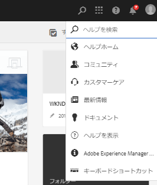

# 以前のサービスパックに含まれていたホットフィックスと機能パック {#hotfixes-and-feature-packs-included-in-previous-service-packs}

## [!DNL Adobe Experience Manager] 6.5.6.0  {#experience-manager-6560}

**2019年4月**&#x200B;の6.5リリースの一般リリース(GA)以降にリリースされた新機能、お客様からリクエストされた主な機能強化、パフォーマンス、安定性、セキュリティの向上を含む重要なアップデートです。 Adobe Experience Manager6.5の上に設置できます。

Adobe Experience Manager6.5.6.0で導入された主な機能および機能強化には、次のものが含まれます。

* [!UICONTROL クイック発行]ウィザードまたは[!UICONTROL パブリケーションの管理]ウィザードを使用して、[!DNL Experience Manager]または[!DNL Dynamic Media]に対するアセットの発行と非公開を選択できます。

* [!DNL Dynamic Media]ユーザーインターフェイスを使用して、コンテンツ配信ネットワーク(CDN)のキャッシュされたコンテンツを無効にします。

* Brand PortalからExperience Managerアセットへのアセット貢献度フォルダーの公開も、プロキシサーバーを介したサポートされるようになりました。

* 自動生成されたプライベートフォルダーのグループは、[!DNL Experience Manager Assets]内のプライベートフォルダーの削除時にクリーンアップされるようになりました。

* ビデオ[!UICONTROL ビューア]プリセットエディターの修飾子の説明が[!DNL Dynamic Media]で更新されました。

* [!DNL Dynamic Media]コネクタの状態を反映する新しい会社設定が提供されます。

* `test`と`aiprocess`のデフォルトのオプションは、以前Dynamic Mediaで行った`Rasterize`から`Thumbnail`に更新され、サムネールのみを作成し、ページの抽出とキーワードの抽出をスキップする必要がありました。

* [クライアントでアダプティブフォームに事前入力します](../../help/forms/using/prepopulate-adaptive-form-fields.md#prefill-at-client)。

* [双方向SSL実装のサーバー上のRESTful APIとフォームデータモデルを統合](../../help/forms/using/configure-data-sources.md)。

* [翻訳済みアダプティブフォームページのキャッシュが強化されました](../../help/forms/using/configure-adaptive-forms-cache.md)。

* automated forms conversionサービス](https://docs.adobe.com/content/help/en/aem-forms-automated-conversion-service/using/convert-existing-forms-to-adaptive-forms.html)の[Adobe Signテキストタグのサポート。

* [[!DNL Automated Forms Conversion service]を使用して、色付きのフォームをアダプティブフォーム](https://docs.adobe.com/content/help/en/aem-forms-automated-conversion-service/using/convert-existing-forms-to-adaptive-forms.html)に変換できます。

* SMB 2およびSMB 3プロトコルのサポート。

* 組み込み型のリポジトリ（Apache Jackrabbit Oak）をバージョン 1.22.4 に更新しました。

Experience Manager6.5.6.0で導入された機能と拡張機能の完全なリストについては、[Adobe Experience Manager6.5 Service Pack 6の新機能](new-features-latest-service-pack.md)を参照してください。

[!DNL Experience Manager] 6.5.6.0リリースでの修正のリストを以下に示します。

### [!DNL Sites] {#sites-6560}

* [!DNL Sites]または[!DNL Screens]で、プロジェクトを選択し、「[!UICONTROL パブリケーションの管理]」をクリックします。 ユーザーインターフェイスのエラーが原因で、ユーザーは[!UICONTROL パブリケーションの管理]ウィザードに進むことができません。 特に、「[!UICONTROL 公開]」オプションは機能しません(NPR-34099)。
* 「[!UICONTROL 継承をキャンセル]」または「[!UICONTROL 継承を無効にする]」オプション(NPR-34097)を選択解除した後、iParsys（継承された段落システム）の位置は、元のデフォルトの位置に戻りません。
* `RolloutConfigManagerFactoryImpl`がロールアウト設定を読み込めない場合は、見つからない設定を読み込もうとしません。 キャッシュされた設定(NPR-34092)を返します。
* Textコアコンポーネントでは、ソースHTML編集オプションを使用した後、`em`タグからのクラスが削除されます(NPR-34081)。
* Experience Manager6.3.3からExperience Manager6.5.3にアップグレードした後、ロールアウト処理に時間がかかり、タイムアウトエラー(NPR-34049)が発生してロールアウトに失敗します。
* `htmlwriter`は、属性値をエンコードしません。 XFマークアップに存在するマークアップは、デコードされた属性値（`&#34`ではなく`"`）で書き出されます。 Visual Experience Composerでターゲット側で、XFが書き出された(NPR-34048)を使用する問題を引き起こします。
* [!DNL Experience Manager Sites]でページを移動する場合は、ログを拡張して、理由を持つバージョン作成の失敗を取り込みます(NPR-34014)。
* [!DNL Rich Text Editor]では、すべてのテキストが削除されると、段落タグも削除されます(NPR-33976)。
* `siteadmin`ページ（クラシックUI）が開かれたり更新されたりすると、`New`メニューのオプションは無効になります(NPR-33949)。

   

* [!DNL Content Fragment]は、`ContentFragmentUsePojo`で失敗するので、`TemplatedResource`として使用できません(NPR-33911)。
* 同期および非同期移動操作は、同時転送によるエラーを引き起こす可能性があります。 ページ移動操作は、同期移動のみに制限されます。 ページの同時移動を防ぎます(NPR-33875)。
* [!UICONTROL 「Manage ] Publication」操作で、作成者のコンテンツを発行インスタンスに複製するには失敗し、JavaScriptエラーが発生します(NPR-33872)。
* 複数のページまたはアセットを選択してバージョンを作成する場合、新しいバージョンは、最後に選択されたページまたはアセットに対してのみ作成されます(NPR-33866)。
* ライブコピーのあるブループリントページを別のフォルダーに移動します。 元のフォルダーに移動すると、移動操作はエラーなしで失敗します(NPR-33864)。
* [!DNL Sites]コンソールでWebページの名前変更に移動アクションを使用すると、ウィザードの最後の手順で、2つの重なったダイアログが表示されます(NPR-33831)。

   

* コピー&amp;ペースト操作(NPR-33794)中に、コピー上の`cq:acLinks`と[!DNL Adobe Campaign]のプロパティが削除されます。`cq:acUUID`
* デタッチされた親ライブコピーの子ページでロールアウトを試みると、[!DNL Experience Manager]はヌルポインタ例外を生成します(NPR-33676)。
* レイアウトコンテナをコピーして再度ページに貼り付けると、レイアウトコンテナの[!DNL RTE]コンポーネントは表示されません。 [!DNL RTE]コンポーネントは編集できませんが、ページ更新時に表示されます(NPR-33662)。
* 異なるブレークポイント（中および大）に対してレイアウトコンポーネントのサイズを変更する場合、レイアウトは期待どおりに動作しません(NPR-33608)。
* [!DNL RTE]のインライン編集モードでは、画像のドラッグがテキストコンポーネント(NPR-33602)で動作しません。
* Blueprintページ内に、ページ名と同じ名前のコンポーネントを作成できます。 ロールアウト中、`_msm_moved`はコンポーネントの名前を変更します。 コンポーネントを[!UICONTROL 段落システム]の末尾に移動します(NPR-33535)。
* 多くのページまたはアセットでoffTimeまたはonTimeが設定されている場合、リソースが大量に消費され、起動と停止中にシステムの動作が遅くなります(NPR-33482)。
* `/content/experience-fragment`のCRUD権限を持つユーザーは、フォルダー(NPR-33436)を削除できません。
* [!DNL Experience Fragments]セクションの親フォルダーで、[!UICONTROL Adobe Target書き出し形式]のオプションとして[!UICONTROL HTML &amp; JSON]を選択できます。 この親フォルダーのサブフォルダーに対するタッチ対応UIにも、同じプロパティが表示されます。 ただし、CRXDEでは、`cq:adobeTargetExportFormat`の場合、`html,json`を表示する代わりにHTMLのみを表示します(NPR-33423)。
* 「ページエイリアスの発行」または「ページエイリアスの非公開」はサポートされていません。 他の場合に要求すると思われるオプションを削除します(NPR-33415)。
* 特定のタグは、[!DNL Experience Manager]内の別の場所に移動できます。 また、移動前と移動後に別のページに適用することもできます。 ページのプロパティを編集する場合、タグが同じであっても、タグは編集用に表示されません(NPR-33353)。
* 複数のレイアウトコンテナを含むテンプレートからレイアウトコンテナが削除された場合、ページテンプレートが正しくレンダリングされません(NPR-33347)。
* テンプレートエディターで、`/content/`以下の100000ページ以上で使用されているテンプレートの削除を試みます。 エラーメッセージが表示されずにエラーが表示されます(NPR-33312)。
* `PageRedirectServlets`がURLフラグメントまたはアンカーの後にクエリ文字列を配置するので、アンカーを含む[!DNL Experience Manager]ページへのリダイレクトは作成者インスタンスでは機能しません(NPR-34288)。
* `/content/campaign`でブランドを作成すると、キャンペーンを作成できない構造になります。 [!UICONTROL 「] Create  [!UICONTROL Brandoption」は、新しく作成されたブランドを残し、] オファーやアクティビティを作成する機能はありません。  Createoption(NPR-34113)はないからです。
* ページの[!DNL Live Copy]を中断すると、エディタモードのように継承が中断されます。 ページプロパティで、継承を表すアイコンが誤って継承が存在し、壊れていないことを示しています(NPR-34017)。
* 参照の多いページは非同期に移動できず、移動操作に失敗する場合があります。(CQ-4297969)
* オーサリング中に、URLに`/`文字が含まれるWebページが応答しなくなります。 オーサリング中にコンポーネントが追加されると、CPU使用量が増加し、ブラウザーが応答しなくなります(CQ-4295749)。
* 参照モードでは、NVDAは[タイプ/サイズ]メニューオプションから選択した値をナレートしません。 選択した要素に視覚的なフォーカスがありません。 スクリーンリーダーに依存するユーザーは、参照モードを使用できません。(CQ-4294993)
* Webページの作成時に、ユーザーは「[!UICONTROL コンテンツページ]」テンプレートを選択できます。 「[!UICONTROL ソーシャルメディア]」タブで、[!UICONTROL 優先XFバリエーション]を選択します。 NVDAブラウズモードでエクスペリエンスフラグメントを選択する場合、キーボードキーを使用できません(CQ-4292669)。
* ハンドルバーライブラリが更新され、より安全なv4.7.3(NPR-34484)になりました。
* [!DNL Experience Manager Sites]コンポーネントの複数のクロスサイトスクリプティングインスタンス(NPR-33925)。
* 新しいフォルダーを作成する場合、フォルダー名フィールドは、格納されたクロスサイトスクリプティング(GRANITE-30094)に対して脆弱です。
* [!UICONTROL ウェルカム]ページの検索結果とパス完了テンプレートは、クロスサイトスクリプティング(NPR-33719、NPR-33718)に対して脆弱です。
* 非構造化ノードでバイナリプロパティを作成すると、バイナリプロパティダイアログ(NPR-33717)でクロスサイトスクリプティングが行われます。
* CRX DEインターフェイスで[!UICONTROL アクセス制御テスト]オプションを使用する場合(NPR-33716)、クロスサイトスクリプティングを行います。
* ユーザ入力は、情報をクライアントに送信する際に、様々なコンポーネントに対して適切にエンコードされません(NPR-33695)。
* Experience Managerの受信トレイのカレンダー表示でのクロスサイトスクリプティング(NPR-33545)。
* `childrenlist.html`で終わるURLは、404応答ではなくHTMLページを表示します。 このようなURLは、クロスサイトスクリプティング(NPR-33441)に対して脆弱です。


### [!DNL Assets] {#assets-6560}

**Experience Managerアセットのアクセシビリティの強化**

* キーボードのキーを使用して、ユーザーは[!UICONTROL アセットの]参照リスト(NPR-34115)のインタラクティブなユーザーインターフェイスオプションにアクセスし、焦点を合わせることができるようになりました。

* スクリーンリーダーが、検索ページ上の述部の意図したアクションを発表するようになりました(NPR-34104)。

* 検索ページと検索結果ページに、スクリーンリーダーユーザーをより深く理解するための情報が得られるタイトルが追加されました(NPR-34093)。

* スクリーンリーダーは、アセット[!UICONTROL プロパティ]ページの[!UICONTROL 「基本]」タブ(NPR-33972)で選択したタグを削除するオプションを読み上げます。

* 現在は、リスト表示の各行の要素が、スクリーンリーダーによって同じ行の要素としてアナウンスされます(NPR-33932)。

* `Tab`キーを使用して移動する際のユーザーのフォーカスが、バージョンプレビューの閉じるオプション(NPR-33863)に移動するようになりました。

* Omnisearchが閉じられた後、ユーザーのフォーカスが検索アイコンに移動するようになりました(NPR-33705)。

* 操作性の高いユーザーインターフェイスオプションで、キーボードキーを使用してナビゲーションした場合のコントラストが強化され、より目立つ視覚的な焦点が得られるようになりました。 キーボードユーザは、焦点が合った領域(NPR-33542)を識別できる。

* スクリーンリーダーのブラウズモードの[!UICONTROL メタデータスキーマエディター]で、キーボードを使用したドラッグ機能が動作するようになりました。(CQ-4296326)

* リンク共有ダイアログで、参照モードで移動するときに、スクリーンリーダーが

   * ダイアログが読み込まれるとすぐに、テーブル情報を読み込みません。

   * リストに表示されているすべての自動提案に移動できます。

   * [!UICONTROL 電子メールアドレス/検索]に対して追加、表示された自動提案の説明(CQ-4294232)

* `Esc`キーを使用してカード表示からクイックアクションアイコンを削除した場合に、最後にフォーカスされたアイテムからキーボードフォーカスが削除されることはなくなりました。(CQ-4293554)

* ユーザーインターフェイス上のインタラクティブオプションに対して、スクリーンリーダーは、アイコンのリテラル名ではなく、その目的を発表するようになりました。(CQ-4272943)

* キーボードフォーカスが[!UICONTROL フライアウト]、[!UICONTROL InlineZoom]、[!UICONTROL Shopable_Banner]、[!UICONTROL Zoom_dark]、[!UICONTROL Zoom_light]、[!UICONTROL ZoomVertical_darkに正常に移動するようになりました。a11/>および[!UICONTROL ZoomVertical_light]オプション（アセットの詳細[!UICONTROL ビューア]、[!DNL Dynamic Media]内）でキーボードのTabキーを使用して移動する場合)。]

* [!UICONTROL アセットのプロパティページの「保存と]   閉じる」オプションが、キーボードキー(NPR-34107)を使用してアクセスできるようになりました。

* ログインページ上の誤ったユーザー名とパスワードの組み合わせによるエラーメッセージが、エラーが発生するたびにスクリーンリーダーによって通知されるようになりました(NPR-33722)。

* [!DNL Experience Manager]ヘッダーセクションで、ブラウズモードでのナビゲーション時に、スクリーンリーダーが

   * [!UICONTROL Omnisearchで]を検索するには、自動編集の提案を入力します。

   * [!UICONTROL ソリューション]、[!UICONTROL ヘルプ]、[!UICONTROL インボックス]、[!UICONTROL ユーザー]の各オプションで、展開または折りたたまれた状態です。

   * [!UICONTROL ヘルプ]オプションの下の[!UICONTROL ヘルプ]フィールドに検索文字列を入力すると表示される[!UICONTROL ヘルプ]の検索ステータスメッセージ。

   

   *図： [!UICONTROL 「] ヘルプ  メニュー」を検索します。*

   * [!UICONTROL 「ユーザー]」オプションの下の「[!UICONTROL 次のように動作]」フィールドに誤った値が入力され、フォーカスが正しくテキストフィールド(NPR-33804)に移動した場合に、エラーメッセージが表示されます。

   

   *図： [!UICONTROL ヘッダーの] Usermenuの  asfieldとして動作します。*

* ユーザーは、次のウィンドウ内のキーボードを使用してフォーカスを変更できるようになりました。

   * [!UICONTROL リンク共有ダイアログの「検索/追加電子メール] アドレス」フィールドを  参照してください。

   * [!UICONTROL フォルダー] プロパティ [!UICONTROL (NPR-34452)の「権限」タブの「] 閉じたユーザー  グループ」の下の追加ユーザーまたは  グループフィールド。

**Experience Managerアセットで修正された問題**

[!DNL Adobe Experience Manager] 6.5.6.0には、次の問題の修正が [!DNL Assets] 含まれています。

* アセットのタイムラインから注釈を選択した場合、注釈はハイライトされません。(CQ-4302422)

* [!DNL Adobe InDesign]テンプレートを使用して作成したマーケティングコラテラルアセット（パンフレット、チラシ、名刺など）をプレビューしても、改行と段落区切りは表示されません(NPR-34268)。

* テキスト抽出のため、アップロードされたPDFファイルの全文検索は機能しません(NPR-34164)。 この問題を修正するには、Service Pack 6のインストール後に[!DNL sAdobe Experience Manager]展開を再起動します。

* 複数ページのアセットのタイムラインには、アセットを閲覧する際に、特定のサブアセットに固有の注釈を表示するのではなく、すべてのサブアセットに適用された注釈がタイムライン表示に表示されます(NPR-34100)。

* フォルダーにJavaScript、CSS、またはJSONファイル形式(NPR-34090)のリソースが含まれている場合、[!UICONTROL 「パブリケーションを管理]」オプションを使用してアセットフォルダーが公開されません。

* Omnisearchで適用したタグやフィルターを選択解除または削除すると、検索クエリが複数回実行されるので、検索時間が長くなります(NPR-34078)。

* ワークフロー（フォルダー内のアセット上）が進行中または保留中の場合、カード表示では、ワークフローが完了または終了するまで、ページがリロードされます。 したがって、作成者は、下にスクロールする必要のあるフォルダー内のアセットを操作することはできません(NPR-33986)。

* ユーザーが公開済みアセットを新しい場所に移動した場合、「[!UICONTROL 再公開]」オプションの選択が解除されていても、アセットは再公開されます。 これにより、多数の親なしアセットが発行インスタンス上に配置されます。 ただし、デフォルトの動作では、パブリッシュ済みアセットの移動操作によって自動的に非公開にされます。アセットを移動する際に、作成者が「[!UICONTROL 再公開]」オプションを選択した場合、このアセットは再公開されます(NPR-33934)。

* コレクション内のアセットの[!UICONTROL アセットを移動]ページは、[!UICONTROL 調整/再公開]オプションなど、すべてのHTMLコンテンツを読み込むわけではありません。 したがって、ユーザは移動操作(NPR-33860)を完了できない。

* アセットを移動し、移動したアセットの名前とタイトルに特殊文字を追加すると、アセットの新しい場所(NPR-33826)に追加のフォルダー（同じ名前）が作成されます。

* [!UICONTROL アセットの] ダウンロードボタンは、ダウンロードダイアログ(NPR-33730)で「  電子メールオプション」が選択されている場合に無効になり  ます。

* アセットに対してバルクメタデータ編集(NPR-33723)などのバルク操作を実行すると、「Request-URI too long」というエラーが発生します。

* JavaScriptエラーが発生し、アップロードされたJSONファイルの値に空き領域または特殊文字(NPR-33712)が含まれている場合、[!UICONTROL ドロップダウン]フィールドで[!UICONTROL 追加によって[!UICONTROL フォルダーメタデータスキーマフォームエディター]内のJSONパスで生成された選択肢を選択または削除できない)。]

* [!DNL desktop app]または[!DNL Adobe Asset Link]の[!UICONTROL 「開く」]オプションを使用してアセットを更新し、[!DNL Adobe Experience Manager]に再同期した場合、アセットの静的レンディションは更新されません(CQ-4296279)。

* 列表示では、アセットのセットに対する移動操作によって、[!UICONTROL フィルター]オプションを使用する前に選択したアセットも移動されます。 「[!UICONTROL フィルター]」オプションを使用すると、以前の選択が選択解除されます(NPR-34018)。

* アセットの検索候補の中で、バックスラッシュは特殊文字の前に追加されます。アセットの名前には特殊文字が含まれます(NPR-33834)。

* [!UICONTROL フォルダーメタデータスキーマフォーム]でドロップダウンのルールを作成すると、[!UICONTROL フィールドの選択肢]列の値を選択できなくなります(CQ-4297530)。

* [!DNL Experience Manager] 6.5 Service Pack 5または以前のバージョンを[!DNL Experience Manager] 6.5(NPR-34532)にインストールすると、カスタムワークフローモデル（`/var/workflow/models/dam`で作成）の実行時のコピーが削除されます。 ランタイムコピーを取得するには、ワークフローモデルのデザイン時コピーをHTTP APIを使用してランタイムコピーと同期します。
   `<designModelPath>/jcr:content.generate.json`

**Dynamic Mediaで修正された問題**

* ビデオプロファイルの作成後に編集時にエンコーディング設定を定義した場合、スマート切り抜き設定がビデオプロファイルから削除されます。(CQ-4299177)

* アセットの詳細ページ(NPR-34235)で、ユーザーがサイドレールオプション（[!UICONTROL 概要]、[!UICONTROL タイムライン]、[!UICONTROL ビューア]など）を切り替えると、ページの読み込み時にアセットがちらつく。

* 再処理ジョブでは、次の問題が見られます。

   * ジョブIDが再処理ジョブによって返されたジョブハンドルにありません。

   * ビデオログのジョブを再処理します。ファイル名のみで、フルパスは処理しません。

   * 再処理ジョブには、アセットタイプを静的に設定するオプションはありません。

   * `ExcludeFromAVS` 」オプションは提供されません(CQ-4298401)。

* 画像プロファイルが複数（例えば11）の縦横比を持つフォルダー(NPR-34082)に追加されると、スマート切り抜き機能がエラーで失敗します。

* DAMアセット更新ワークフローは、Dynamic MediaScene7(CQ-4299727)で構成された[!UICONTROL ツール]内の[!UICONTROL 「ワークフロー]」タブ上の[!UICONTROL ワークフローアーカイブ]ページをスクロールダウンしたときにトリガーされます。[!DNL Adobe Experience Manager]

* [!UICONTROL ビューアプリセットエディター]の「[!UICONTROL 動作]」タブのシンボルがローカライズされません(CQ-4299026)。

* メイン表示で、ビューアがレスポンシブモードの場合、ビューアに収まらない誤ったレイアウトで画像が表示されます。(CQ-4298293)

* [!UICONTROL Adobe Experience Manager]の画像プリセットに対する変更は、Scene7パブリッシングシステム(CQ-4299713)と同期されません。

### [!DNL Commerce] {#commerce-6560}

* アセットが移動されても、製品のアセットへのリンクはリファクタリングされません(NPR-34098)。

### プラットフォーム {#platform-6560}

* アップグレードしたExperience Managerインスタンス(NPR-34336)で、診断ツールを使用してログをダウンロードできません。
* `cq-wcm-api`基盤パッケージの特定のバージョンへの依存関係が原因で、アップグレードが失敗します(CQ-4300520)。
* デフォルトエージェント（公開）設定の&#x200B;**[!UICONTROL 接続タイムアウト]**&#x200B;および&#x200B;**[!UICONTROL ソケットタイムアウト]**&#x200B;のデフォルト値は指定されていません(NPR-33707)。
* `/etc/map.publish`の下のマッピング設定の更新は、サイトページ(NPR-34015)に反映されません。
* [APIリファレンス](https://helpx.adobe.com/experience-manager/6-5/sites/developing/using/reference-materials/javadoc/com/day/cq/tagging/package-summary.html) のドキュメントには、 `com.day.cq.tagging` パッケージのドキュメントは含まれていません(CQ-4295864)。

### ユーザーインターフェイス {#ui-6560}

* ブラウザーのオフロードインターフェイスでは、一部のジョブトピックが表示されません(NPR-34308)。
* [設定ブラウザー](/help/sites-administering/configurations.md)のインターフェイスでは、すべての設定が表示されません(NPR-33644)。
* ユーザーが偽装するユーザーを検索する際に`Esc`キーを押すと、ユーザーリスト(NPR-34084)の代わりに&#x200B;**[!UICONTROL ユーザー]**&#x200B;ダイアログが閉じます。

### 統合 {#integrations-6560}

* 長い名前のアクティビティは[!DNL Adobe Target]と同期されません(NPR-34254)。

* 新しいAdobeの起動の設定を作成する際にプロパティを選択すると、次のエラーメッセージが表示されます(NPR-33947)。

   ```javascript
   GET http://hostname:Port/libs/cq/dtm-reactor/content/configurations/createcloudconfigwizard/jcr:content/body/items/form/items/wizard/items/general/items/fixedcolumns/items/container/items/general/items/property/data.html?query=&start=0&end=25&imsConfigurationId=Adobe%20Launch&companyId=&_charset_=utf-8 400 (Bad Request)
   ```

### 翻訳プロジェクト {#translation-6560}

* ユーザーの`authorizableID`に特殊文字(NPR-33828)が含まれている場合、翻訳プロジェクトは作成されません。

### Sling {#sling-6560}

* ヘルスチェックとパターンディテクターには、重複する機能があります。 その結果、ヒースチェックは製品(NPR-33928)から削除されます。

### WCM {#wcm-6560}

* Foundation Components — 基礎画像コンポーネントをページに追加し、画像を参照すると、`Undo`操作が動作しません(NPR-34516)。

* ページ移動操作(CQ-4303028)を使用できません。

### [!DNL Communities] {#communities-6560}

* ソーシャルメディアで投稿を共有すると、古いオプションGoogle+が表示されています(NPR-33877)。

* コミュニティのメンバは、グループテンプレートまたは他のグループ機能の設定(NPR-33530)を変更できません。

* フォーラム投稿で、画像のハイパーリンクタグが適切に生成されません(NPR-33464)。

* アクセシビリティのエラーは、コミュニティの割り当て機能(NPR-33442)で識別されます。

* 管理コンソールを介して追加されたコミュニティグループの既存のユーザは、コミュニティグループコンソール(NPR-34315)で変更が行われると、ユーザリストから削除される。

* `TagFilterServlet`は機密データを漏らす可能性がある(NPR-33868)。

<!--
* Tag filters are vulnerable to sensitive information disclosure (NPR-33868).
-->

### [!DNL Forms] {#forms-6560}

>[!NOTE]
>
>[!DNL Experience Manager] Service Packにはの修正が含まれていません [!DNL Forms]。これらは、別の[!DNL Forms]アドオンパッケージを使用して配信されます。 さらに、JEE上の[!DNL Experience Manager Forms]の修正を含む累積インストーラーがリリースされました。 詳しくは、「[AEM Formsアドオンのインストール](#install-aem-forms-add-on-package)」および「[JEE上のAEM Formsのインストール](#install-aem-forms-jee-installer)」を参照してください。

[!DNL Experience Manager Forms] 6.5.6.0アドオンパッケージのインストール後：

* [!DNL Experience Manager Forms]インスタンスを停止します。

* `bcpkix-1.51`、`bcmail-1.51`、および`bcprov-1.51` JARファイルを`crx-repository\launchpad\ext`ディレクトリから削除します。

* `sling.properties`ファイルから` sling.bootdelegation.class.org.bouncycastle.jce.provider.BouncyCastleProvider`プロパティを削除します。

* [!DNL Experience Manager Forms]インスタンスを再起動します。

**アダプティブフォーム**

* アダプティブフォームフラグメントが見つからない場合、アダプティブフォームはレンダリングに失敗します(NPR-34302)。

* アダプティブフォームのフィールドのヘルプコンテンツの説明には、段落HTMLタグ(NPR-34116)が表示されます。

* 「**[!UICONTROL サーバー]**&#x200B;で再検証」プロパティを選択すると、アダプティブフォームは送信に失敗します(NPR-33876)。

* **[!UICONTROL RESTエンドポイントへの送信]**&#x200B;送信アクションは、アダプティブフォーム(CQ-4299044)では動作しません。

* アクセシビリティ：必須フィールドの添付ファイルをアップロードせずにアダプティブフォームを送信しようとすると、フォーカスが自動的に添付フィールドに移動することはありません。(CQ-4298065)

* アダプティブフォームの表に行を追加する場合、**[!UICONTROL 追加を上]**&#x200B;に、**[!UICONTROL を下]**&#x200B;に追加追加すると、適切な結果が表示されません(CQ-4297511)。

* [!UICONTROL 値コミット]スクリプトが正しくトリガされず、アダプティブフォームでデータが失われます(CQ-4296874)。

* ローカライズされたアダプティブフォーム(NPR-34333)では、日付選択が正しく機能しません。

* ファイル名にアンダースコアまたはスペースが含まれている場合、そのファイルをアダプティブフォーム(CQ-4301001)に添付できません。

* ネストされた繰り返し可能パネルの回数が親より多い場合、そのようなネストされた繰り返し可能パネルのすべての回数は事前入力に失敗します(NPR-33666)。

* アダプティブフォームには、いくつかのオープンなリソースリゾルバーがあります。 これらは送信エラーを引き起こします。 この問題は断続的に発生します(CQ-4299407)。

* フィールド設定を初めて開くと、プロパティアイコンは表示されません(CQ-4296284)。

* ユーザーは、アダプティブフォームの送信時に、`afPath`、`afSubmissionTime`、`signers`などの送信メタデータを編集できます。 この問題を解決するには、クライアント側のフォーム送信データからメタデータ値を削除します。 ユーザーは`FormSubmitInfo`オブジェクトを使用して、サーバー(NPR-33654)からこれらの値を取得できます。

* ユーザー入力は、クライアントに情報を送信する際に、[!DNL Forms]コンポーネントに対して適切にエンコードされません(NPR-33611)。

**ワークフロー**

* ワークフローの承認者が添付ファイルをアップロードすると、添付ファイルの名前が`undefined`に変更されます(NPR-33699)。

* [!DNL Experience Manager] ワークフローの削除操作が失敗し、次のエラーメッセージが表示されます(NPR-33575)。

   `java.lang.UnsupportedOperationException: The query read more than 500000 nodes in memory`

* [!DNL Experience Manager Forms] フォームの送信後、forアプリが応答を [!DNL Windows] 停止する(NPR-34409)。

* AEM Service Packをインストールすると、**To Do**&#x200B;リストの項目はリンクとして表示されません。 **To Do**&#x200B;項目のテキストには、HTMLタグ(NPR-34317)が含まれます。

**インタラクティブコミュニケーション**

* 繰り返し可能なコンポーネントがネストされたテキストドキュメントフラグメントを含めると、インタラクティブ通信は保存に失敗します(NPR-34095)。

**Correspondence Management**

* データディクショナリの値を含むテキストドキュメントフラグメントを変更すると、エージェントUIが応答を停止します(NPR-33930)。

* [!DNL Microsoft Word]ドキュメントからレター内のテキストドキュメントフラグメントにコンテンツをコピー&amp;ペーストすると、フォーマットの問題が発生します(NPR-33536)。

**ドキュメントサービス**

* OutputサービスとFormsサービスを使用してXDPファイルからPDFファイルを生成すると、テキストの欠落と重なり合いが生じます(NPR-34237、CQ-4299331)。

* HTMLファイルをPDFに変換する場合、`MaxReuseCount`属性は設定できません(NPR-33470)。

* Reader拡張機能がインタラクティブ機能を含むPDFファイルをダウンロードする場合、[!DNL Adobe Reader](NPR-33729)を使用して添付ファイルをPDFファイルに追加することはできません。

**Document Security**

* [!DNL Experience Manager] Service Pack (NPR-34310)をインストールした後、PDFファイルでHSMベースの証明書を使用して署名操作を実行できません。

**デザイナー**

* Designerバージョン6.5.xでXFormsを開けません(CQ-4295322)。

* Designerを開くと、スタートアップスクリーンに正しくない年が表示されます(CQ-4295289)。

* サーバーに[!DNL Acrobat DC]をインストールすると、**[!UICONTROL 「フォームの配布]**」オプションは無効になります(CQ-4296304)。

セキュリティ更新について詳しくは、[Experience Managerのセキュリティ速報ページ](https://helpx.adobe.com/security/products/experience-manager.html)を参照してください。

## [!DNL Adobe Experience Manager] 6.5.5.0  {#experience-manager-6550}

Adobe Experience Manager6.5.5.0は、新機能、お客様から要請された主な機能強化、パフォーマンス、安定性、セキュリティの向上を含む重要なアップデートです。これらの機能は、**2019年4月の6.5リリースの一般リリース(GA)以降にリリースされます。** Adobe Experience Manager6.5の上に設置できます。

[!DNL Adobe Experience Manager] 6.5.5.0で導入された主な機能および機能強化には、次のものがあります。

* CRXDE Liteへの匿名アクセスは許可されていません。 代わりに、ユーザーはログイン画面に誘導されます。 [CRXDE Liteを使用した開発](/help/sites-developing/developing-with-crxde-lite.md)を参照してください。

* [!DNL Adobe Experience Manager]受信トレイに表示する列名をカスタマイズします。

* ページエディター、コアコンポーネント、RTE、管理者ユーザーインターフェイスなど、Experience ManagerWebコンテンツ管理(WCM)の様々な領域でのアクセシビリティが向上しました。

* [!DNL Interactive Communication]をドラフトとして保存します。

* JEE上のExperience ManagerFormsの[!DNL Oracle WebLogic 12]をサポート。

* [!DNL Adobe Experience Manager Assets]ユーザーインターフェイスフローでの例外処理を改善しました。

* Dynamic MediaScene7の公開URLを取得するために、新しいメソッド`getRemoteAssetPublishURL`が`com.day.cq.dam.api.s7dam.scene7.ImageUrlApi`インターフェイスに追加されました。

* [アクセシビリティ](#assets-6550) の強化は、Webコンテンツ [!DNL Adobe Experience Manager Assets] アクセシビリティガイドライン(WCAG)に準拠して行われます。

* パッケージ共有の統合がAdobe Experience Manager内から削除されました。

* 組み込み型のリポジトリ（Apache Jackrabbit Oak）をバージョン 1.22.3 に更新しました。

機能の完全なリスト、主な特徴、Experience Manager6.5 Service Pack 5で導入された主な機能については、[Adobe Experience Manager6.5 Service Pack 5の新機能](new-features-latest-service-pack.md)を参照してください。

[!DNL Experience Manager] 6.5.5.0リリースでの修正のリストを以下に示します。

### [!DNL Sites] {#sites-6550}

* Experience Managerサイトには、エイリアスからページを公開または非公開にするオプションがあります。 このオプションは機能しません(NPR-33415)。
* 複数のテンプレートを含むテンプレートからレイアウトコンテナを削除すると、そのテンプレートは正しくレンダリングされません(NPR-33347)。
* Experience Managerサイトページが、複数のライブコピーが設定された大きなコンテンツの一部である場合、ページバージョン履歴プレビューの読み込みに失敗します(NPR-33311)。
* 「移動」コマンドを使用してExperience Managerサイトページの名前を変更すると、ページタイトルは更新されません(NPR-33264)。
* 列表示内でページを移動すると、列は表示されなくなります(NPR-33216)。
* 言語コピーのローカルコンポーネントの名前がブループリントのコンポーネントの名前と同じで、コンポーネントがブループリントからロールアウトされる場合、ローカルコンポーネントの名前に`_msm_moved`が追加されない。
* Page Redirectサーブレットは、Experience ManagerサイトのURLに.htmlを追加します。このサイトのURLでは、ResourceTypeが`cq:Page`ではありません(NPR-33176)。
* サブツリーを貼り付ける場合、対応するサブページを貼り付けるかどうかを決定するオプションはありません(NPR-33149)。
* コンポーネントのライブ使用の結果の数は、49個に制限されます(NPR-33058)。
* スキーマに基づくコンテンツフラグメントのベースとなり、そのコンテンツに必須のテキスト領域またはパスフィールドが含まれている場合、コンテンツフラグメントは保存されません(NPR-33007)。
* デフォルトのエクスペリエンスフラグメントコンポーネントを使用してカスタムコンポーネントを作成し、Experience Managerサイトページで使用する場合、Experience Managerにはカスタムコンポーネント(NPR-32852)の参照（使用）が表示されません。
* 多数の参照を持つフォルダーの名前を変更すると、そのフォルダーへの多くの参照は更新されません(NPR-32765)。
* ソース編集オプションを有効にすると、インラインのフルスクリーンオプションで使用できるようになりますが、リッチテキストエディターの編集ダイアログおよびフルスクリーンオプションでは使用できなくなります(NPR-32763)。
* 複数のフィールドがあり、そのフィールドに設計図のページプロパティに必須のフィールド（ドロップダウンやパスフィールドなど）が含まれている場合、そのような複数のフィールドを含むページをロールアウトすると、ライブコピーのページプロパティは保存されません(NPR-32751)。
* スクリーンリーダーは、見出し構造を使用してページを移動することはできません。 さらに、「Components（コンポーネント）」タブのラベルが誤っています(NPR-32648)。
* ページ番号の開始では、エクスペリエンスフラグメントピッカーはすべての項目を読み込みません(NPR-32605)。
* ライブコピーを読み取り、変更、作成および削除する作成者権限は失効します。 各発言者は、Blueprint内でページを移動するための読み取り権限と変更権限を明示的に提供する必要がありました(NPR-32550)。
* Adobe Analytics(NPR-32548)と統合されているページでは、コンテンツ作成者は「起動」を作成できません。
* ユーザーが同期による継承を再開すると、親ページのライブコピーは青写真と同期せず、誤ったステータスを表示します(NPR-32500)。
* Experience Managerサイトのエディターページの読み込みに15秒以上かかる(NPR-32413)。
* 一部のフィールドでは、「継承をキャンセル」オプションが表示されません(NPR-32362)。
* エクスペリエンスフラグメントコンポーネントのパスを選択し、「選択ダイアログを開く」チェックボックスを選択した場合、パスブラウザー(NPR-32308)で選択されたパスに移動しません。
* Experience Manager6.2からExperience Manager6.5にアップグレードした場合、静的テンプレートのParsysコンポーネントが正しく表示されません。 Parsysコンポーネントの高さは0に設定され、その中のコンポーネントは表示されません(NPR-33663)。
* ユーザーがレイアウトコンテナをコピーして同じページに貼り付けると、レイアウトコンテナのコンポーネントは表示されません(NPR-33648)。
* ディスパッチャーの正常性チェックで、ログファイルに`Invalid cookie header`警告メッセージが表示されます(NPR-33629)。
* PreferencesServlet(NPR-33438)でXSSが反映されている。
* 匿名ユーザーは、CRXDE Lite機能(GRANITE-27790)にアクセスできます。

### [!DNL Assets] {#assets-6550}

>[!IMPORTANT]
>
>[!DNL Experience Manager desktop app]のWindowsユーザーは、[!DNL Adobe Experience Manager 6.5.5.0]インスタンスのDAMリポジトリにアクセスするために、[デスクトップアプリバージョン2.0.3.2](https://docs.adobe.com/content/help/en/experience-manager-desktop-app/using/release-notes.html#whats-new-added)にアップグレードするようお勧めします。 デスクトップアプリバージョン2.0.2を使用して[!DNL Adobe Experience Manager] 6.5.5.0インスタンスのDAMリポジトリにアクセスする際に問題が発生する場合があります。

**Experience Managerアセットのアクセシビリティの強化**

* アセットの[!UICONTROL タイムライン]パネル(NPR-33424)の[!UICONTROL コメント]リストにキーボードフォーカスを置き、[!UICONTROL バージョンコメントを作成]するクリック可能なオプションを設定できるようになりました。

* アセットの[!UICONTROL 表示設定]オプションにアクセスし、キーボードキーを使用して[!UICONTROL 表示設定]ダイアログの設定を変更できるようになりました(NPR-33420)。

* コンボボックスのリストボックスポップアップ（異なるページの様々なフィールド）に、スクリーンリーダーがアナウンスできるオプションのリストとしてエントリが表示されるようになりました(NPR-33516)。

* 並べ替え可能なヘッダーの並べ替え機能(リスト表示、[!UICONTROL タイムライン]表示、[!UICONTROL パブリケーションの管理]ページ)が、スクリーンリーダーによって通知され、列ヘッダーの並べ替えコントロールがキーボード(NPR-32979)を使用してアクセスできるようになりました。

* コメントカード、バージョン更新、コンボボックス、メニューの山形アイコンなどのクリック可能な要素は、注目し、キーボード(NPR-33514)を使用して操作できるようになりました。

* [!UICONTROL Insights表示]のインサイトアイコン（使用方法、インプレッション数、クリック数）の機能（またはアクションの目的）が、スクリーンリーダー(NPR-33513)によって正しくアナウンスされるようになりました。

* 読み取り専用のフォームフィールド（例えば、アセット[!UICONTROL プロパティ]の[!UICONTROL 「基本」タブ]上の無効なフィールド）が、キーボード(NPR-33493、CQ-4273031)を使用してフォーカスできるようになりました。

* 様々な入力フィールドのラベルが、テキストの入力時に消えたプレースホルダーラベルだけでなく、永続的なラベル（アクセス可能）になりました。(NPR-33475)

* 異なる見出しレベル（ページタイトルやセクションの見出しなど）が、スクリーンリーダーユーザーに対して異なるレベルの見出しとして認識されるようになりました(NPR-33471)。

* リンクやオプション（アセットページのヘッダーやズームオプション、フォルダーナビゲーション）などのインタラクティブなユーザーインターフェイス要素は、キーボード(NPR-33468、CQ-4271412)を使用してアクセスできるようになりました。

* [!UICONTROL パブリケーションの管理]ページの[!UICONTROL ワークフロー]、[!UICONTROL スコープ]、[!UICONTROL スコープ]の進行状況インジケーターが、タブではなく、スクリーンリーダーで正しく読み上げられるようになりました。

* アセット[!UICONTROL プロパティ]またはカード表示の「[!UICONTROL 詳細]」タブの[!UICONTROL 定格]セクションなど、星評価アイコンの色を、視覚に制限があり、色を認識しないユーザーに対して適切に変更する。

* アセットの詳細ページの[!UICONTROL コメント]フィールドの横にある山形の上向き矢印が、キーボードキー(NPR-33397)を使用してアクセスできるようになりました。

* アセット[!UICONTROL プロパティ]および左側のナビゲーション（アセットユーザーインターフェイス上）の[!UICONTROL タグ]ダイアログの展開状態と折りたたみ状態が、スクリーンリーダー(NPR-33396)で正しく通知されるようになりました。

* [!DNL Adobe Experience Manager]アセットの閲覧されたすべてのページのタイトルが一意になりました(NPR-33343)。

* ツリー構造をナビゲートする際に、ツリー表示コントロールの様々な要素がスクリーンリーダー(NPR-33304)によって正しく通知されるようになりました。

* アセットの詳細ページの[!UICONTROL タイムライン]表示内の異なるバージョンのアセットに、キーボードキーを使用してアクセスできるようになりました(NPR-33283)。

* Omnisearchコンボボックスに表示される検索候補の名前が、検索機能を使用する際にスクリーンリーダーによって通知されるようになりました(NPR-33280)。

* クリック可能な要素と[!UICONTROL リンク]へ移動[!UICONTROL 参照レール]が、スクリーンリーダーからクリック可能な要素としてアナウンスされるようになりました(NPR-33278)。

* [!UICONTROL 共有リンク]ダイアログのテーブル構造情報（行1、セル1、テーブルなど）は、ダイアログが開いたときに、スクリーンリーダーによって通知されなくなりました(NPR-33268)。

* 様々なコンボボックス要素（パスフィールドや、アセットのプロパティの「基本」タブで選択ダイアログを開くオプションなど）の目的が、スクリーンリーダー(NPR-33235)によって正しく通知されるようになりました。

* リスト表示テーブルの行が選択可能であるという情報が、キーボードフォーカスがある場合に、スクリーンリーダーユーザーに通信されるようになりました。 ポインタが行に合わさると、スクリーンリーダーは情報を読み上げます(NPR-33234)。

* [!UICONTROL プロパティ]の「基本」タブにある[!UICONTROL タグ]フィールドの下の[!UICONTROL タグ]以下の選択された各タグを削除するオプション（[!UICONTROL x]を含む）が、スクリーンリーダー(NPR-33206)にアクセスできるようになりました。

* カレンダーの日付選択は、スクリーンリーダーユーザーや視覚力のあるキーボードユーザーがキーボードを使用して、フォーカスでき、アクションを実行できるようになりました(NPR-33200)。

* リスト表示とカード表示を切り替える切り替え機能が、(表示の調整)スクリーンリーダー(NPR-33069)に正しく公開されるようになりました。

* 左側のレールのメニューにアクセスできるようになりました。 スクリーンリーダー(NPR-33068)は、メニューの拡張の機能と目的を適切に発表する。

* リストボックスや他の多くのユーザインターフェイス要素が、目の見えないスクリーンリーダーユーザーにアクセスできるようになり、スクリーンリーダー(NPR-33040)がそれらに関する次の情報を発表します。

   * フォームを送信する前に要素に対してユーザー入力が必要かどうか。
   * 要素を編集できないかどうか。
   * ウィジェットが選択されているかどうか。

* フィルターサイドバーを開くオプションに、キーボード(NPR-32842、CQ-4273018)を使用してアクセスできるようになりました。

* リスト表示の列見出しのチェックボックスコントロールがアクセス可能になり、コントロールの使用目的がスクリーンリーダー(NPR-32722、NPR-33005)によって通知されるようになりました。

* カレンダーの日付選択で時間(HH)と分(mm)のフィールドのラベルは、プレースホルダーラベルではなく永久的なラベルになり、これらのフィールドにユーザーがテキストを入力しても表示されなくなりました(NPR-32720)。

* （ベルのアイコンをクリックした後に表示される）通知のリンクテキストが、スクリーンリーダーのユーザーに通知されるようになりました。このユーザーはタブを使用して各リンクにアクセスします(NPR-32645)。

* [!UICONTROL アセットカードのアセットカードに対する]「ダウンロード [!UICONTROL 」、「]プロパティ [!UICONTROL 」]、「その他の    アクション」オプションを選択します(現在は、キーボードのインサイトを使用してアクセスできます(NPR-32609)。

* キーボード(NPR-32606)を使用してアクセスした場合に、視覚的に非表示にされたコンテンツ（検索結果上のヘッダーメニューバーのコンテンツなど）が、スクリーンリーダーによって通知されなくなりました。

* カレンダーの日付選択で、コントロールのラベルを次の月と前の月に移動する目的が、スクリーンリーダーによって通知されるようになりました(NPR-32604)。

* 星レーティングのアイコンが、キーボードキーを使用してフォーカスでき、アクションを実行できるようになりました(NPR-32513)。

* ビデオのボリュームを制御する機能に、（ボリュームスライダーにフォーカスするために）タブと、（ボリュームを調整するために）キーボードの(NPR-32065)矢印キーを通してアクセスできるようになりました。

* ファイルサイズフィルタの下限（[!UICONTROL 差出人]）と上限（[!UICONTROL 宛先]）の入力フィールドの目的を、近視眼的でないスクリーンリーダーユーザ(NPR-32064)に対して通知するようになりました。

* [!UICONTROL 作成と翻訳]フォームの[!UICONTROL 言語]メニューに、ブラウズモードのスクリーンリーダーがアクセスできるようになりました。(CQ-4293906)

* [!UICONTROL リファレンス]パネルにアクセスできるようになり、次の機能強化が行われました(NPR-33261、CQ-4293798)。

   * ブラウズモードで、スクリーンリーダーのフォーカスが、[!UICONTROL サイト参照]、[!UICONTROL アセット参照]、[!UICONTROL コピー]、[!UICONTROL フォーム参照]セクションの下の非表示の複数行編集フィールドに移動することはなくなりました。

   * スクリーンリーダーは、[!UICONTROL サイト参照]要素と[!UICONTROL 言語コピー]要素の役割を読み上げるようになりました。

   * ブラウズモードでのスクリーンリーダーのフォーカスは、意味のある順序で様々な要素に移動します。

* [!UICONTROL メタデータスキーマ] エディターページとその要素にキーボードを使用してアクセスできるようになり、スクリーンリーダーにわかりやすくなりました。(CQ-4290962、CQ-4272953)

* 選択したタグを削除する`X`記号の目的が、選択したタグの数と共にスクリーンリーダーによって通知されるようになりました。(CQ-4273017)

* スクリーンリーダーを使用する近視眼的なユーザーが混乱しないように、装飾用のアイコンと画像がスクリーンリーダーで無視されるようになりました。(CQ-4272944)

**Experience Managerアセットで修正された問題**

[!DNL Adobe Experience Manager] 6.5.5.0 Assetsには、次の問題の修正が含まれています。

* [!UICONTROL コレクション内のアセットに対して] Create   WorkflowdialogのStartoptionが無効になっているため、ワークフローがトリガーされません(NPR-32471)。

* メタデータスキーマでカスケードポップアップを使用する場合、（子のドロップダウンから）アポストロフィを含むドロップダウンオプションを選択して保存すると、アセット[!UICONTROL プロパティ](NPR-32649)を再び開いた後、選択したアポストロフィオプションが消えます。

* [!UICONTROL アセットインサイトの同期] ジョブは停止し、無効なエントリが（Analytics側で）検出された場合に、次のエントリ(NPR-32674)に移動する代わりに失敗します。

* パノラマビューアのモバイルブラウザでは、モーションセンサーがデフォルトで無効になっているので、ジャイロは機能しません。(CQ-4272937)

* [!UICONTROL Connected Assets ] Configurationwizardは、6.5.1(NPR-32730)に6.5.3をインストールした場合、404エラーで動作しません。

* XMPの書き戻し処理中に、すべてのカスタム名前空間のメタデータプロパティで、カスタム名前空間のプレフィックスが、設定された名前空間のプレフィックス(NPR-32748)ではなくns2に変更されます。

* 遅延読み込みはトリガーされず、通知インボックス(NPR-32750)からタスクを確認するように選択した場合は、100アセットのみが表示されます。

* `NullPointerException` は、新しく作成されたユーザープロファイル(SAML/SSO)でノードの環境設定が見つからないために表示されます。このエラーは、新しくログインしたユーザーが[!DNL Adobe Experience Manager Stock]統合(NPR-32777)を使用するのを防ぎます。

* 10,000を超えるアセットを含むスマートコレクションを開くと、ログ内でトラバーサルの警告が観察されます(NPR-32980)。

* Dynamic MediaScene7ランモード(NPR-32995)で動作する[!DNL Adobe Experience Manager]で、アセットを別のフォルダに移動すると、アセット名が小文字に変更されます。

* 検索されたアセットは、検索結果からそのプロパティに移動した後で検索結果に戻って削除した後は削除できません(NPR-32998)。

* [!UICONTROL 「] Assetinterfaceを [!UICONTROL 移動(NPR-33356)」で移動先フォルダーを選択した場合、] Nextオプションは無効のままです。

* [!UICONTROL 親ノード（子フォルダーが1つ表示されるノード）を選択してから子フォルダーを選択すると(NPR-33275)、] Nextオプションが有効になりません。

* 読み取り、作成、または変更などの他の権限が付与されている場合でも、削除権限を持つAdobeのアセットリンク(AAL)では、チェックインおよびチェックアウトの権限が無効になります(NPR-33272)。

* スマート切り抜きレンディションは、アセットのダウンロードダイアログ(NPR-33167)では使用できません。

* スマート切り抜きプロファイルを含むフォルダーの下のPDFのレンディションパネルを開くログ(CQ-4294201)で例外が発生する。

* Dynamic MediaScene7実行モード(CQ-4294200)とのExperience Managerで、[!UICONTROL Dynamic Media同期モード]がデフォルトで無効になっている場合、画像プリセットは公開されません。

* バルクアップロード中のアセット処理が停止し、ワークフローインスタンスにDAM更新アセットのスタックインスタンスが表示される(CQ-4293916)。

* Experience Manager上でのDynamic Media設定の作成は機能しますが、ユーザーインターフェイス上で「保存」を選択しても何も起きません。(CQ-4292442)

* Safari/Macでのプログレッシブ再生でF4Vビデオアセットのプレビューが機能しない(CQ-4289844)。

* 親フォルダー内のアセットの名前にドット`.`が含まれるアセットを、スマート切り抜き時に追加のフォルダーが作成されます(CQ-4289337)。

* サムネールが破損し、ビデオのコピー時にビデオ処理バナーが表示されません。(CQ-4284125)

* Firefoxで、空のカメラ表示を持つ一部のモデルについて、ディメンションビューアに空のサムネールが誤って表示される場合があります。(CQ-4283447)

* 6.5.5.0で修正されたパフォーマンスの問題は次のとおりです(CQ-4279206)。

   * 大きなバイナリをDynamic Mediaイメージ処理サーバにアップロードするには、時間がかかりすぎます。

   * Dynamic MediaScene7建築のため、Experience Managerでのサムネイル生成時間が長くなりました。

* 大量の資産を持つお客様のDynamic MediaScene7への移行に失敗する問題(CQ-4279206)。

* `setVideo`を使用すると、ビデオ360ビューワのレイアウトが壊れ、`video= modifier`を使用するとビデオが下に移動します(CQ-4263201)。

* Experience ManagerSDLパッケージ(NPR-33175)のインストール中にエラーメッセージが表示されます。

* Experience ManagerのSSRF脆弱性(NPR-33435)。

### プラットフォーム {#platform-6550}

* `/etc/maps`の下に`sling:match`マップエントリが作成された場合、[!DNL Sling]フィルターは呼び出されません(NPR-33362)。
* [!DNL Apache Lucene]を使用したセグメント化障害により、Experience Managerがクラッシュする(NPR-32988)。
* [!DNL Jackson] コアパッケージがExperience Manageruberjarファイルに見つかりません(NPR-32848)。
* CRXDE Liteは、ノード(NPR-32611)の`jcr:primaryType`プロパティで読み取り権限を持たないユーザー向けのコンテンツを読み込みません。
* [!DNL Granite] メンテナンスタスクスケジューラーは、Experience Managerデプロイメント中に再初期化する頻度が高すぎます(CQ-4294627)。
* SQLクエリが長時間（例えば7時間）実行されると、Experience Managerは応答を停止します(NPR-33044)。

### ユーザーインターフェイス {#ui-6550}

* ラジオボタンの選択がマルチフィールド(NPR-33309)で保持されない。
* 遅延読み込みの制限は、リスト表示(NPR-33124)では機能しません。
* 一致がない場合、Omnisearchの結果ページにメッセージが表示されません(NPR-32974)。
* Omnisearchフィルタは、`/content`ノード以下のすべての一致を返し、選択された場所を無視します(NPR-32849)。

### 統合 {#integrations-6550}

* Adobe Targetコンポーネントを含むページが公開されると、内部キャッシュはクリアされます(NPR-33162)。
* Adobe Targetとの統合は[!DNL Windows Internet Explorer] 11(NPR-33111)では機能しません。
* Adobe Targetの設定時に、レポートソース(NPR-32502)を選択したときに、[!UICONTROL 会社]と[!UICONTROL レポートスイート]の各フィールドが表示されません。
* Adobe I/Oを使用して[!DNL Experience Fragments]を書き出す場合、「Source Product」などのメタデータはAdobe Targetに書き出されません(NPR-32159)。
* ローカルExperience Managerの管理者グループに属する権限のあるIMSユーザーは、IMS設定を作成または変更できません(NPR-33045)。
* Adobeの起動の設定ページに、すべてのレコードが表示されるわけではありません(NPR-33011)。
* content-authorsグループのユーザーは、JavaScriptエラー(NPR-32996)が原因で、Adobe Targetコンポーネントのプロパティを編集できません。
* JSONのクロスサイトスクリプティング(NPR-32744)。

### 翻訳プロジェクト {#translation-6550}

* 翻訳済みのタグは、サードパーティの翻訳サービス(NPR-33154)からExperience Managerに読み込まれません。
* 翻訳設定ページに、翻訳に使用されたものとは異なる翻訳プロバイダーが表示されます(NPR-32971)。
* 既存の翻訳プロジェクトにエクスペリエンスフラグメントフォルダーを追加すると、新しいプロジェクトが作成されます(NPR-32843)。
* 翻訳ジョブの実行時にログに`NullPointerException`エラーが表示されます(NPR-32628)。

### WCM {#wcm-6550}

* ページエディタ — [!DNL Sites]ページエディタでは、ヘッダーにあるすべてのオプションを使用してタブフォーカスを移動する代わりに、キーボードのみのユーザーがメインコンテンツにスキップすることはできません(CQ-4293883)。
* ページエディター — Wellコンポーネントを使用し、保存されたデータを含むパネルは、[!DNL Chrome]および[!DNL Firefox]バージョンでの更新が原因で表示されません(CQ-4292995)。
* MSM — ページからコンポーネントを削除しても、ページの公開バージョンからはコンポーネントは削除されません(CQ-4292360)。

### [!DNL Brand Portal] {#assets-brand-portal-6550}

* [!DNL Brand Portal]から公開済みのメタデータスキーマを削除すると、エラーが発生します(CQ-4292063)。
* 管理者がAdobe開発者コンソールを介してBrand Portalで[!DNL Experience Manager Assets] 6.5.4を設定した場合、[!DNL Brand Portal]ユーザーは貢献度フォルダーのアセットを[!DNL Brand Portal]から[!DNL Experience Manager](NPR-33046)に公開できません。
* 競合の原因となる親フォルダーの重複レプリケーション(NPR-33001)。

### [!DNL Communities] {#communities-6550}

* クイック編集メニューオプション(NPR-33117)を使用して、モデレートコンソールでカードを削除することはできません。
* [!UICONTROL アクティビティストリーム]ページへのアクセス時にエラーが発生します(NPR-33146)。
* オーサーインスタンスで削除されたグループは、すべての発行インスタンス(NPR-33199)から削除されません。
* 作成者は、新しいグループを作成した後、[!DNL Internet Explorer] 11の[!UICONTROL コミュニティグループ]セクション(NPR-33205)にリダイレクトされません。
* Experience Managerの受信トレイでメッセージにアクセスしても、メッセージのステータスは読み取り(NPR-32764)に変更されません。
* [!DNL Communities]グループを編集してサムネール画像を変更しても、グループサムネール画像は更新されません(NPR-32599)。
* ユーザは、コミュニティ内の別のユーザに電子メールを送信できません(NPR-32598)。
* 送信されたブログは、ユーザがページを更新するまで表示されません(NPR-32391)。
* ユーザー生成コンテンツ(UGC)の通知と購読のバージョンを作成すると、ソースページの誤ったIDが保存されます(CQ-4279355、CQ-4289703)。
* クロスサイトスクリプティングの問題(NPR-33203)。

### ワークフロー {#workflow-6550}

* 左側のレールの[!UICONTROL タイムライン]オプションの読み込みに予想以上の時間がかかります(NPR-32851)。
* Experience Managerインスタンスを再起動した後、コレクションのレビュータスクの電子メールに、正しくないペイロードリンク(NPR-32774)が含まれます。

### [!DNL Forms] {#forms-6550}

>[!NOTE]
>
>Experience Managerサービスパックには[!DNL Forms]の修正が含まれていません。 別の Forms アドオンパッケージを使用して配布されます。さらに、JEE上のAEM Formsの修正を含む累積インストーラーがリリースされました。 詳しくは、「Experience ManagerFormsアドオンのインストール[」および「[Experience ManagerFormsのJEEへのインストール](/help/release-notes/sp-release-notes.md#install-aem-forms-jee-installer)」を参照してください。](/help/release-notes/sp-release-notes.md#install-aem-forms-add-on-package)

* Correspondence Management:レターを送信した後、ターゲット領域内のアセットの順序が変化する(NPR-33359、NPR-33153)。
* アダプティブForms:ユーザーがアダプティブフォームを編集すると、[!UICONTROL ページ開始]メニューで利用できる「情報ワークフロー]」オプションは機能しません(NPR-33004)。[!UICONTROL 
* アダプティブForms:複数の添付ファイルが含まれるアダプティブフォームを保存できません(NPR-32997)。
* アダプティブForms:アダプティブフォームでパネルレイアウトを変更するとエラーが発生します(CQ-4293880)。
* アダプティブForms:アダプティブフォームの辞書の文字列に対する新しい行で、`&#xa;`文字が辞書(NPR-33266)に追加されます。
* アダプティブFormsのアクセシビリティ：ユーザーがアダプティブフォームをHTMLフォームとしてプレビューした場合、[!UICONTROL 手書き署名]フィールドはタブのフォーカスを保持できません(NPR-33159)。
* アダプティブFormsのアクセシビリティ：アダプティブフォームの送信時に表示されるエラーメッセージは、`aria-describedBy`属性(NPR-33071)にリンクされません。
* アダプティブFormsのアクセシビリティ：アダプティブフォームで必須とマークされたフィールドのARIAアクセシビリティスキーマ(NPR-33070)では、必須属性が「True」に設定されていません。
* PDFGサービス：ユーザーがテキストファイルをPDFに変換すると、日本語の文字は正しくレンダリングされません(NPR-33238)。
* PDFGサービス：`CreatePDF`操作がPDFファイルをPDF OCR形式(NPR-32994)に変換できません。
* PDFGサービス：[!DNL OpenOffice]ドキュメントの200番目のインスタンス(NPR-32766)では、PDFの変換は失敗します。
* BackendIntegration:非アクティブな状態が正しくないために更新トークンの期限が切れると、フォームデータモデルの要求は失敗します(NPR-33169)。
* Designer:スクリーンリーダーは、XDPファイルで定義されているカスタムタブ順序の代わりに、デフォルトの地理的順序に基づいてタブ順序を実行します(NPR-32160)。
* Designer:タグ付けオプションを有効にすると、生成されたPDF出力でサブフォームの境界線が非表示になります(NPR-32778)。
* GuideSOMProviderServlet(NPR-32700)に格納されたXSS。

## Adobe Experience Manager 6.5.4.0 {#experience-manager-6540}

Adobe Experience Manager6.5.4.0は重要なアップデートで、新機能、お客様から要求されたパフォーマンス、安定性、セキュリティの向上を含み、**2019年4月の6.5リリースの一般リリース(GA)以降にリリースされました。** Adobe Experience Manager6.5の上に設置できます。

Adobe Experience Manager6.5.4.0で導入された主な機能および機能強化には、次のものがあります。

* Adobe Experience Managerアセットは、Adobe I/Oコンソールを通じてBrand Portalで設定されるようになりました。

* 新しい[印刷可能な出力を生成](../forms/using/aem-forms-workflow-step-reference.md)ステップがAdobe Experience Manager Formsワークフローで使用できるようになりました。

* [アダプティブフォームおよびインタラクティブ通信のレイアウトモードに対する複数列の](../forms/using/resize-using-layout-mode.md) サポート。

* HTML5フォームでの[リッチテキスト](../forms/using/designing-form-template.md)のサポート。

* [Experience Managerアセットのアクセシビリティ](new-features-latest-service-pack.md#accessibility-enhancements) の強化。

* 組み込み型のリポジトリ（Apache Jackrabbit Oak）をバージョン 1.10.8 に更新しました。

* コンテンツのサブツリーを選択して、`content/dam`で利用可能なすべてではなく、*Dynamic Media-Scene7モード*&#x200B;に同期できるようになりました。

* SOAP Webサービスとのフォームデータモデルの統合で、要素の選択グループまたは属性がサポートされるようになりました。

* SOAP入力または出力と複雑なデータ構造で、動的グループの置換がサポートされるようになりました。

最新のサービスパックで導入された機能と主な特徴の完全なリストについては、[Adobe Experience Manager6.5のサービスパックの新機能](new-features-latest-service-pack.md)を参照してください。

### Sites {#sites-fixes}

* Adobe Experience Manager SitesのページのURLにコロン(`:`)またはパーセント記号(`%`)が含まれる場合、ブラウザは応答を停止し、CPU使用のスパイク(NPR-32369、NPR-31918)が発生します。

* Experience Managerサイトページを編集用に開き、コンポーネントをコピーした場合、一部のプレースホルダー(NPR-32317)では貼り付け操作が使用できないままになります。

* パブリケーションの管理ウィザードを開くと、コアコンポーネントにリンクされたエクスペリエンスフラグメントは、公開された参照のリストに表示されません(NPR-32233)。

* タッチ操作対応UIのライブコピーの概要は、クラシックUIよりもレンダリングに時間がかかります(NPR-32149)。

* サーバー時間とマシン時間が異なるタイムゾーンにある場合、スケジュールされた公開時間はタッチUIでサーバー時間を表示しますが、クラシックUIではマシン時間が表示されます(NPR-32077)。

* Experience Managerサイトが、URLにサフィックスの付いたページを開けません(NPR-32072)。

* ユーザがコンテンツフラグメントを編集すると、削除されたコンテンツフラグメントが復元される(NPR-32062)。

* ユーザーは、必須フィールドに情報を入力しないで、コンテンツフラグメントを保存できます(NPR-31988)。

* kernel.jsとui.jsは事前にコンパイルまたはキャッシュされません。 ページのレンダリングにさらに時間がかかります(NPR-31891)。

* PageEventAuditListenerを有効にすると、コミットキューの長さが長くなります。 これは、バルク投稿、ナビゲーション、バルクアセットの移動など、多くの操作のパフォーマンスに影響を与えます(NPR-31890)。

* エクスペリエンスフラグメントをドラッグすると、応答時間が長くなることが観察されます(NPR-31878)。

* レスポンシブグリッドのプレースホルダーにある「コンポーネントをここにドラッグ」オプションを選択すると、GETリクエストが送信され、リクエストの結果HTTP 403エラーが発生します(NPR-31845)。

* 同じフォルダー内のコンテンツを移動すると、ページ移動オプションは無効になります(NPR-31840)。

* 編集可能なテンプレート構造モードでは、レイアウトコンテナの許可されたコンポーネントリストに正しくない結果が表示されます。 レイアウトコンテナ(NPR-31816)には、デザインダイアログを持つコンポーネントのみが表示されます。

* ページにユーザーの読み取り専用権限がある場合、「プロパティを開く」オプションはsites.htmlに表示されますが、editor.htmlには表示されません(NPR-31770)。

* ユーザーが「作成」ボタンをクリックすると、ページオプションは使用できません(NPR-31756)。

* OOTB （初期設定）デザインインポーターコンポーネント(NPR-31728)を含むAdobeキャンペーンのキャンペーンを同期できません。

* 箇条書きのリストを番号付きリストに変更しようとすると、リストの最初の2つの項目だけが変更されます(NPR-31636)。

* ページの作成が解除され、子ノードが選択されている場合、選択ダイアログには初期ノードが表示されます。 ページが作成され、ユーザーが「Browse」をクリックすると、ページは作成されたノードではなくルートノードにリダイレクトされます(NPR-31618)。

* 表示設定ダイアログボックスが、インボックスカスタマイズワークフロー機能（NPR-32503およびNPR-32492）で正しく機能しません。

* インボックス(CQ-4282168)を使用してワークフロー情報を表示しているときに、エラーメッセージが表示されます。

### Assets {#assets-6540-enhancements}

* アセット収集ページでワークフローをトリガーするボタンが無効になっています(NPR-32471)。

* Dynamic MediaScene7設定(NPR-32440)とExperience Managerして、アセットを別のフォルダに移動すると、名前のないフォルダがSPS(Scene7Publishing System)に作成されます。

* すべてのアセットを（「すべて選択」を使用して）公開済みアセットを含むフォルダーに移動する操作は、エラーが発生して失敗します(NPR-32366)。

* ${extension}を含むアセットのレンディションの生成に失敗しました(NPR-32294)。

* バージョン履歴のURLは、アセットのプロパティページの「参照元」フィールドに表示されます(NPR-31889)。

* DAMからダウンロードしたZIPファイルをWinZip(NPR-32293)を使用して開くことができません。

* フォルダーの元の権限は、「フォルダー設定」が開かれてフォルダータイトルまたはサムネール画像が変更され、保存されたときに更新されます(NPR-32292)。

* スケジュールされたアクティベーションのカレンダーアイコンが、アクティベーションが後の日時にスケジュールされているアセットの「ステータス」列（DAMアセット一覧のクラシックUI）に表示されない(NPR-32291)。

* スニペットテンプレートを使用してスニペットを作成すると、スニペットの作成プロセス(NPR-32290)中にコレクションの検索でエラーが発生する。

* 検索フィルターから複数のタグが選択されると、複数の検索クエリが実行されます(NPR-32143)。

* ファイル名が50文字を超えるアセットがアップロードされる場合、Experience ManagerアセットUIでファイル名が切り捨てられて表示されます(NPR-32054)。

* 1番目と2番目のチェックボックスがオフになると、フィルターパネルのすべてのチェックボックスがクリアされ、Adobe Stockのチェックボックスツリーのレベル2のチェックボックスが選択されます(NPR-31919)。

* Omnisearchファセットを使用したファイルとフォルダーの検索で例外が発生する(NPR-31872)。

* 対応するメタデータスキーマフォーム(NPR-31834)で依存関係ルールが設定されている場合、メタデータエディターでの必須フィールド選択に対するフィールドのハイライト表示が、必須フィールドを選択した後も削除されない。

* （タグ階層からの）リーフレベルタグの完全な名前は、アセットのプロパティページ(NPR-31820)に表示されません。

* Safariブラウザーのアセットのプロパティページで「back」コマンドを使用するとエラーが発生する(NPR-31753)。

* タッチUI検索（Omnisearchを通じて行われる）の結果ページは自動的に上にスクロールし、ユーザーのスクロール位置が失われます(NPR-31307)。

* PDFアセットのアセットの詳細ページに、Dynamic MediaScene7の実行モードで実行されているExperience Managerーで、「コレクションへ」および「追加レンディションへ」ボタン以外のアクションボタンが表示されません。(CQ-4286705)

* Scene7のバッチアップロード処理には、アセットの処理に時間がかかりすぎます(CQ-4286445)。

* 「保存」ボタンを押してもリモートセットは読み込まれません。ただし、Dynamic Mediaクライアントのセットエディタで変更を行っていない場合は、このボタンが表示されません。(CQ-4285690)

* 3Dアセットのサムネールは情報ではありません。サポートされている3DモデルがExperience Managerに取り込まれる場合(CQ-4283701)に役立ちます。

* スマート切り抜きビデオビューアプリセットの未処理のステータスが、バナーのプリセット名の横に2回表示されます(CQ-4283517)。

* 3Dビューアでプレビューした、アップロードされた3Dモデルのコンテナの高さが正しくないと、アセットの詳細ページに表示されます(CQ-4283309)。

* Experience ManagerDynamic Mediaハイブリッドモード(CQ-4255590)で、IE 11でカルーセルエディタが開かない。

* ChromeおよびSafariブラウザー(NPR-32067)のダウンロードダイアログの電子メールドロップダウンで、キーボードのフォーカスが動かなくなる。

* DMクラウド設定をExperience Managerに追加しようとすると、「すべてのコンテンツを同期」チェックボックスがデフォルトで有効になりません(CQ-4288533)。

### Foundation UI {#foundation-ui-6540}

* フィルターパネル(NPR-32538)を使用してアセットを検索している間、マウスコントロールを既存のフィルターフィールドに留まらずに、前のフィルターフィールドに移動します。

* プラットフォームのタグ付け：タグフィールドにタグを入力して検索すると、ルート境界の外側にあるタグが表示され、タグフィールドの`rootPath`プロパティが反映されません(NPR-31895)。

* プラットフォームUI:テキストフィールドに無効なパスが追加されると、パスブラウザーが壊れます(NPR-31884)。

* ページ選択時に、通知がスティッキーメニューの背後に隠れる(NPR-31628)。

### プラットフォーム {#platform-sling-6540}

* (HTL)アンダースコアは、URL(NPR-32231)のパスセクションのコロンを置き換えます。

### プロジェクト {#projects-6540}

* サブフォルダーにプロジェクトを作成する権限を持つユーザー(NPR-31832)でも、「作成」ボタンは表示されません。

### プロジェクトの翻訳{#projects-translation-6540}

* `Apache Sling JSP Script Handler`で「スペースをトリム」オプションがアクティブになっている場合、翻訳プロジェクトの作成によってUIが壊れる(NPR-32154)。

* 翻訳対象のタグが翻訳プロジェクトに追加されると、エラーログのUIとNullポイントの例外が発生する(NPR-31896)。

### 統合 {#integrations-6540}

* 起動ライブラリURLの生成は、起動APIの`path`値と`library_name`値のみに基づき、`library_path`値(NPR-31550)に基づくものではありません。

* LiveFyre関連の項目の処理中にエラーメッセージが表示されます(FYR-12420)。

* ReportSuitesServletはSSRF(NPR-32156)に対して脆弱です。

### WCMテンプレートエディタ{#wcm-template-editor-6540}

* 編集可能なテンプレート構造モードで、レイアウトコンテナで許可されているコンポーネントのリストにリンクボタンコンポーネントが表示されません(CQ-4282099)。

### WCMページエディタ{#wcm-page-editor-6540}

* オーバーレイを選択し、レスポンシブグリッドのコンポーネントをここにドラッグすると、エラーが発生します。(CQ-4283342)

### キャンペーンターゲット{#campaign-targeting-6540}

* ターゲットクラウドの設定が失敗し、エラーget mboxリクエストが失敗しました。(CQ-4279880)

### Brand Portal {#assets-brand-portal-6540}

* Brand Portalユーザは、Experience Manager6.5.4(CQDOC-15655)でAdobe I/Oにアップグレードした場合に、貢献度フォルダーのアセットを[!DNL Assets]に発行できません。 Experience Manager6.5.4に対する即時の修正のために、ホットフィックス[をダウンロードして、作成者インスタンスにインストールすることをお勧めします。](https://www.adobeaemcloud.com/content/marketplace/marketplaceProxy.html?packagePath=/content/companies/public/adobe/packages/cq650/hotfix/cq-6.5.0-hotfix-33041)

* メタデータスキーマポップアップ値は、アセットのプロパティに表示されません(CQ-4283287)。

* メタデータのサブスキーマでは、アセットプロパティのMIMETYPEに基づくタブが表示されません(CQ-4283288)。

* 非公開メタデータスキーマが、バックエンドでスキーマが削除されてもエラーメッセージを入力する。

* 公開済みアセットのプレビュー画像が表示されない(CQ-4285886)。

* 名前に一重引用符を含むアセットを発行または非公開できません(CQ-4272686)。

* 複数のアセットのダウンロード中に利用条件が表示されません。(CQ-4281224)

* セキュリティに関する小さな脆弱性を解消。

### Communities {#communities-6540}

* 「Create Member」フォームは空白のページとして表示されます(NPR-31997)。

* ユーザーは、作成者インスタンス(NPR-30913)でAnalyticsレポートに表示できません。

### Oak — インデックス作成とクエリ{#oak-indexing-6540}

* Tikaパーサーで解析した場合にJPEGドキュメントを含むMS WordおよびMS Excel画像が解析に失敗し、クラスが見つからないというエラーが表示される(NPR-31952)。

### フォーム {#forms-6540}

>[!NOTE]
>
>Experience Managerサービスパックには、Experience ManagerFormsの修正は含まれていません。 別の Forms アドオンパッケージを使用して配布されます。さらに、JEE上のAdobe Experience Manager Formsの修正を含む累積インストーラーがリリースされました。 詳しくは、「Experience ManagerFormsアドオンのインストール[」および「[Experience ManagerFormsのJEEへのインストール](/help/release-notes/sp-release-notes.md#install-aem-forms-jee-installer)」を参照してください。](/help/release-notes/sp-release-notes.md#install-aem-forms-add-on-package)

* Correspondence Management:後処理ワークフロー(NPR-32626)に送信した後、レターに追加の文字が表示されます。

* Correspondence Management:レターは、後処理ワークフロー(NPR-32539)に送信した後、テキストコンポーネントとしてドロップダウンプレースホルダーを表示します。

* Correspondence Management:レターテンプレートで定義されているデフォルト値は、プレビューモード(NPR-32511)では表示されません。

* モバイルForms:送信ボタンは、HTMLバージョン(NPR-32514)でXDPフォームをレンダリングする際に、サイズが拡大されて表示されます。

* ドキュメントサービス：Service Pack 2(NPR-32508、NPR-32509)を適用した後のLettersおよびその他のページのURLアクセスの問題。

* ドキュメントサービス：サーバー上のトランザクション数が特定の制限を超える場合、HTMLからPDFへの変換は失敗し、ファイルタイプの設定が[!DNL Forms]サーバー(NPR-32204)から削除されます。

* アダプティブForms:ブラウザーアクセシビリティツールは、WCAG2 Level AAガイドライン(NPR-32312、NPR-32309、CQ-4285439)に従ってアダプティブフォーム内のエラーをレポートします。

* アダプティブForms:Chromeブラウザーアクセシビリティツールが、ベストプラクティスの失敗を報告します(NPR-32310)。

* アダプティブForms:Experience Managerサイトページに埋め込まれたアダプティブフォームの設定中に、翻訳の問題が発生する(NPR-32168)。

* Workbench:PDF Utilitiesサービス(NPR-32150)で「Get PDF Properties」操作を使用していると、エラーメッセージが表示されます。

* ドキュメントセキュリティ：保護されたPDFファイルをオフラインで開く際に、DisableGlobalOfflineSynchronizationDataオプションがTrueに設定されていると、失敗する(NPR-32078)。

* Designer:タグ付けオプションが有効になっている場合、生成されるPDF出力(NPR-32547、NPR-31983、NPR-31950)でサブフォームの境界線が消えます。

* Designer:表内に結合されたセルがある場合、アクセシビリティテストは、出力サービス(CQ-4285372)を使用してXDPフォームから変換された出力PDFファイルに対して失敗します。

* Foundation JEE:Experience ManagerFormsサーバーがクラスターから切断された場合、キャッシュの問題により、サーバーに再接続できません。(NPR-32412)

## Adobe Experience Manager 6.5.3.0 {#experience-manager-6530}

[!DNL Adobe Experience Manager] 6.5.3.0は、パフォーマンス、安定性、セキュリティ、お客様向けの主要な修正に加え、2019 **年4月のGAリリース(GA)以降にリリースされた機能強化を含む重要なリリースで**&#x200B;す。[!DNL Adobe Experience Manager] 6.5の上にインストールできます。

このサービスパックリリースの主なハイライトは次のとおりです。

* 組み込み型のリポジトリ（Apache Jackrabbit Oak）をバージョン 1.10.6 に更新しました。

* [!DNL Experience Manager Assets] は、Deflate64アルゴリズムを使用して作成されたZIPアーカイブをサポートするようになりました。

* 並べ替え可能な作成日の新しい列が、DAMリスト表示およびリスト表示のアセット検索結果に追加されました。

* 名前列に基づくアセットの並べ替えが、リスト表示で有効になりました。

* [!DNL Dynamic Media] で、スマート切り抜きビデオアセットがサポートされるようになりました。スマート切り抜きは、機械学習を中心とした機能で、フレームを移動しながらビデオを再トリミングし、シーンの焦点に合わせます。

* [!DNL Dynamic Media] は、スマートイメージングをサポートしています。

* [[!DNL Experience Manager]ワークフローで不在](../forms/using/configure-out-of-office-settings.md)の環境設定を&lt;a0/>設定できる。

* [受信トレイまたは受信トレイ項目](../forms/using/configure-shared-queues-osgi.md)を[!DNL Experience Manager]ワークフローの他のユーザーと&lt;a0/>共有できます。

* バッチモード](../forms/using/generate-multiple-interactive-communication-using-batch-api.md)で[対話型通信を生成する機能。

* ContextHubにバンドルされているjQueryのバージョンを3.4.1に更新しました。

### アセット{#assets-6530-enhancements}

**製品の機能強化**

* [!DNL Experience Manager Assets] は、Deflate64アルゴリズム(NPR-27573)を使用して作成されたZIPアーカイブをサポートするようになりました。

* 作成日の新しい列（並べ替え可能）がDAMリスト表示に追加され、アセット検索結果のリスト表示(NPR-31312)に追加されます。

* リスト表示では、[!UICONTROL 名前]列(NPR-31299)を使用して、アセットのリストを並べ替えることができます。

* GLB、GLTF、OBJ、およびSTLファイルは、DAMの[!UICONTROL アセットの詳細]ページでプレビューできます(CQ-4282277)。

* `ReplicationOnModifyListener` (CQ-4281279)で、チャンクのアップロード中にチャンクノードのイベントがトリガーさ [!DNL Dynamic Media] れます。

* [!DNL Dynamic Media] で、スマート切り抜きビデオアセットがサポートされるようになりました。スマート切り抜きは、機械学習を中心とした機能で、フレームを移動しながらビデオを再トリミングし、シーンの焦点に合わせます(CQ-4278995)。

* [!DNL Dynamic Media] は、スマートイメージング(CQ-4222249)をサポートしています。

* クエリパラメーターが要求で渡される場合、検索表示ーまたは参照表示ーがFoundationピッカーのデフォルトのとして設定されます(NPR-31601)。

**安定性および**

* 一部のPDFドキュメントのメタデータが更新されず、タイトルが変更されてもPDFに保存されません(NPR-31629)。

* ファイル名にプラス文字(`+`)が含まれるアセット(NPR-31547)では、アセットの共有は機能しません。

* アセットの管理者の検索レールのデフォルトの検索フォームでの編集が期待どおりに機能しません(NPR-31502)。

* アセットの検索にOmnisearch on assets表示ーを使用している場合、サーチクエリが表示されません(NPR-31496)。

* 同じアセットが別のユーザーによる別のコレクションで参照されている場合、参照先のアセットが別の場所に移動しても、コレクション内のアセット参照は更新されません(NPR-31486)。

* 重複のIPTCタグがアセットメタデータ(NPR-31328)に追加されます。

* フィルターレール(NPR-31316)から検索がトリガーされた場合、検索結果カウントは正確に更新されません。

* ファイルの種類フィルターで第2レベルのチェックボックスの選択を解除すると、すべてのチェックボックスがオフになり、検索バーのテキストが選択または選択解除されたプロパティ(NPR-31287)と同期されません。

* すべてのメンバ（ユーザー/グループ）をフォルダーのMembersセクションから削除することはできません。すべてのユーザーを削除しようとすると、ログインしたユーザーがリストに追加されます(NPR-31171)。

* ファイル名にプラス記号(`+`)を含むアセットは削除できません(NPR-31162)。

* 「作成」ドロップダウンメニューは、フォルダーを選択したときにトップメニューに表示され、作成オプションとして「フォルダー」が表示されません(NPR-30877)。

* パスの「Deny `jcr:removeChildNodes`」と「`jcr:removeNode`」のACLがユーザー(NPR-30840)に適用されている場合に、フォルダー選択の作成/FileUploadアクション項目が見つかりません。

* 特定のmp4アセットがアップロードされると、DAMワークフローが古い状態になり、残りのすべてのワークフローが古い状態になります(NPR-30662)。

* メモリ不足エラーは、（数ギガバイトの）大きなPDFファイルがDAMにアップロードされ、そのサブアセットが処理されるときに発生します(NPR-30614)。

* アセットの一括移動が失敗し、警告メッセージが表示される(NPR-30610)。

* [!DNL Dynamic Media]-Scene7モード(NPR-31630)で実行される[!DNL Experience Manager]でアセットを別のフォルダーに移動する場合、アセット名が小文字に変更されます。

* Scene7会社名(NPR-31340)と同じ名前のフォルダーに存在する画像に関して、リモート画像セットの編集中にエラーが発生します。

* [!DNL Dynamic Media] 参照を含むアセットが公開されない(NPR-31180)。

* [!DNL Dynamic Media]7-Scene7モードから[!DNL Dynamic Media Classic]へのアップロードに時間がかかりすぎて完了しません(NPR-31048)。

* 画像アセットに追加されたホットスポットは、アセットの詳細ページのインタラクティブ画像ビューアでは表示されません(NPR-30979)。

* 巨大なスリングジョブが作られ、[!DNL Experience manager Assets]内のアセットに対して行われた操作がScene7に渡されると、「処理」バナーが再び表示される(NPR-30947)。

* アセットとアセットの言語コピーを作成すると、競合が発生し、Scene7にはアップロードされません(NPR-30932)。

* [!DNL Dynamic Media] — ハイブリッドモードで実行する[!DNL Experience Manager]からダウンロードされたダイナミックレンディションは壊れます（テキストタイプで、画像コンテンツタイプではなく「画像が見つかりません」という内容になります）(NPR-30876)。

* [!DNL Dynamic Media] ビデオのエンコードワークフローで、Adobe Experience Managerの [!DNL Dynamic Media Classic] Scene7モードに移行したビデオのサムネール [!DNL Dynamic Media]の生成に失敗しています。(CQ-4282011)

* 異なるScene7会社IDを使用して、1つのインスタンスから別のインスタンスにアセットを移行する際にIpsApiExceptionが発生する問題を修正しました。(CQ-4280548)

* 3Dアセットのサムネールは情報ではありません。サポートされている3Dモデルが[!DNL Experience Manager]に取り込まれる場合(CQ-4283701)。

* 3Dアセットにカメラ表示が少ない場合は、スクロールボタンがビューアに表示されます(CQ-4283322)。

* アセットの詳細ページのDimensionalViewerでプレビューした、アップロードされた3Dモデルのコンテナの高さが正しくありません(CQ-4283309)。

* Internet Explorer 11およびSafariのSmartCropVideoViewerではビデオを再生できません。(CQ-4281422)

* [!DNL Dynamic Media]-Scene7実行モード(CQ-4280384)で実行されている[!DNL Experience Manager]で、1つのフォルダーから別のフォルダーに複数のアセットを移動するための移動ボタンの使用は失敗します。

* MIMEタイプがMP4以外の場合、アセットの詳細に歪んだビデオが表示される(CQ-4279704)。

* ビデオプロファイルを含むフォルダーに新たに取り込まれたビデオは、エンコードの割合が100 %に達した後も処理状態のままとなります。(CQ-4279389)

* フォルダーからアセットを移動すると、理想的に必要なジョブ(CQ-4278664)よりも多くのSlingジョブ(Scene7API呼び出し)が作成されます。

* DAMで画像セット（またはメディアセット）を作成し、適切な命名規則に従って名前を付けると、Scene7では画像セットの名前が小文字に変更されます。(CQ-428112)

* Scene7マイグレータが正しくパブリッシュ状態を設定しない(CQ-4263492)。

* タッチUI検索（Omnisearchで実行）の結果ページは自動的に上にスクロールし、コンテンツフラグメント内でのユーザーのスクロール位置が失われます。(CQ-4282898)

* PDFファイルのインデックスが作成されず、内のコンテンツを検索できません。(CQ-4278916)

* 「グループはユーザー選択によって一覧表示されません：「false to equal true」が予期される問題は、異なる`principalName`と`authorizableId`を持つ閉じたユーザーグループを追加する際に発生します(CQ-4278177)。

* アセットUI列の表示に、特定のテナントのダムルートパスに関係なく、すべてのパスが表示される(CQ-4278175)。

* アセットセレクターの検索が期待どおりに動作しません。(CQ-4275886)

* レンディションのワークフローが失敗する(CQ-4271928)。

* DAMイベントの削除は、最新(`maxSavedActivities`)のイベントデータを削除し、以前に作成されたデータを保持します(NPR-31336)。

* タッチUI検索（Omnisearchを通じて行われる）の結果ページは自動的に上にスクロールし、ユーザーのスクロール位置が失われます(NPR-31307)。

* すべてを選択した場合に、アクションバーとアセット数が更新されず、タッチUI(NPR-31118)で一部の項目（フォルダー/個々のアセット）の選択が解除される。

* [!DNL Experience Manager]で、アセットのジョブの詳細をポーリング中に例外が表示されます(CQ-4283569)。

### Sites

* LiveCopyの継承が壊れている場合、ライブコピーページには、LiveCopyリンクではなく、言語コピーリンクが表示されます(NPR-30980)。
* 新しいBlueprintの場合、レコード数が40を超える場合、最初の40個のレコードのみが表示されます。 Blueprintでは、残りのレコードに空白行が表示されます(NPR-31182)。
* ユーザーがメニューのdescriptionプロパティに日本語または韓国語の文字を追加すると、メニューは、日本語および韓国語のテキストに対して歪んだ文字を表示します(NPR-31331)。
* リッチテキストエディター(RTE)では、埋め込まれたテーブルをリスト項目として挿入できません(NPR-30879)。
* Scaffolding Rich Text Editor(RTE)をすぐに使用できます。 要素にインラインのフォントサイズを適用します（予期せず）(NPR-31284)。
* ユーザーが左側のレールフィールドにフォーカスし、キーボードショートカットを使用してコンテンツを貼り付けると、左側のレールフィールドからコピーされたコンテンツではなく、ページエディターのクリップボードのコンテンツが貼り付けられます(NPR-31172)。
* ユーザがマルチフィールドにファイルアップロードフィールドを追加すると、画像パスはマルチフィールドノード(NPR-30882)ではなくコンポーネントノードに保存されます。
* `ResponsiveGridExporter` APIは`com.day.cq.wcm.foundation.model.impl.export.AllowedComponentsExporter`インターフェイスを返しません。 `com.day.cq.wcm.foundation.model.impl`パッケージはプライベートパッケージとして宣言されます(NPR-31398)。

<!-- Review: NPR-31398 has fixVersion as 6530. However, it is mentioned twice in 6530 and 6520 as fixed. 
Remove one mention of this fix.
-->

* 一部のエクスペリエンスフラグメントを含むページがエディター以外のモードで（`editor.html`プレフィックスと`wcmmode=disabled`のない作成者で、または発行者で）開かれると、要求はHTTPステータスエラーコード`500`(NPR-30743)で終了します。
* ユーザーは、パスワードを変更したり、プロファイルページにアクセスしたりすることはできません(NPR-31161)。

### 検索とユーザーインターフェイス{#ui-interface-and-search}

* 検索結果ページ上でカード表示からリスト表示に切り替えると、ページがスクロールされるまでに遅延が生じます(NPR-31286)。

* [!UICONTROL 「すべてを選択」]チェックボックスは、[!DNL Sites]ユーザーインターフェイス(NPR-31614)のリスト表示で非表示になります。

* 検索結果ページの[!UICONTROL すべて]を選択するカウントが正しくありません(NPR-31120)。

* メタデータエディターには、存在しないタグ(NPR-31119)が表示されます。

### 翻訳 {#translation}

* 翻訳ジョブ(NPR-31270)の「期限」オプションを選択すると、2つのカレンダーポップアップが表示されます。

### プラットフォーム

* Webコンソールの「MIME type」オプションが機能しません(NPR-31108)。

* シングルサインオン(NPR-31165)の設定時に、クライアント証明書が受け入れられません。

* Jetty ベースの HTTP サービスのバッファーサイズ設定でアップデートが保存されない。（NPR-30925）

* QueryBuilderは、xpathクエリーでorderby `fn:name()`をサポートするようになりました(NPR-31322)。

* 重複アクティベーションツリーは、[!DNL Experience Manager] 6.3(NPR-31513)からのアップグレード時に作成されます。

* 転送された要求は、Sling認証(NPR-30013)中に設定された応答ヘッダーを保持しません。

* ピッカーコンポーネント内の検索が動作しません(NPR-31692)。

* Apache POIとApache Tikaバンドル(NPR-31018)の異なるバージョンが原因で、ZIPファイルを[!DNL Experience Manager Communities]投稿に添付するとエラーが表示されます。

* `org.apache.sling.distribution.api`バンドルは設定マネージャーに表示されないので、カスタムバンドル(NPR-31720)では使用できません。

### プロジェクト

* カレンダー表示の切り替えが動作しません(NPR-31271)。

### ブランドポータル{#assets-brand-portal-6530}

**製品の機能強化**

* [!DNL Experience Manager Assets]のアセットソーシング読み込みワークフローが変更され、新しく作成されたアセットのみが[!DNL Brand Portal]から[!DNL Experience Manager]に取得され、レプリケーションを避けるためにNEWフォルダーに既に存在するアセットをスキップします。(CQ-4278527)

**安定性および**

* アセットソーシング機能(CQ-4282825)で新しい貢献度フォルダーを作成すると、正しくないアイコンが表示されます。
* 新しい貢献度フォルダーを作成すると、1つまたは両方のサブフォルダー（NEWとSHARED）が貢献度フォルダー内に表示されません(CQ-4282424)。
* 貢献度フォルダーを[!DNL Brand Portal]終了(CQ-4279740)から貢献度フォルダー内の新しいアセットを受け取った後に、貢献度フォルダーを[!DNL Experience Manager]から[!DNL Brand Portal]に再発行しようとすると、システムで例外がスローされます。
* 貢献度フォルダー（ネストされたフォルダー）内に貢献度フォルダーを作成することは、複雑さを避けるために禁止されています(CQ-4278391)。
* [!DNL Experience Manager]Admin Consoleから読み込んだ[!DNL Brand Portal]ユーザーリスト（.csvファイル）のアップロード時に例外がスローされます。 .csvファイル内の「電子メール」、「FirstName」、「LastName」フィールドのみが必須です(CQ-4278390)。

### コミュニティ{#communities-6530}

**安定性および**

* グループを管理するクイックリンク（[開く]、[編集]、[投稿]、[削除]の各グループ）は、コミュニティ管理者（[グループ管理者]、[サイト管理者]）には表示されません(NPR-31627)。
* 送信されたブログは、ページを手動で更新/再読み込みしない限り表示されません(NPR-31599)。
* 「メンション」機能で使用されるJCRクエリでは大文字と小文字が区別され、結果を返すのに時間がかかりすぎます(NPR-31475)。
* [!DNL Experience Manager] 6.5 UberJarファイルが例外をスローし、6.5 UberJarファイルに `cq-social-translation` バンドルが見つからな [!DNL Experience Manager] い(NPR-31186)。
* Jackson Databindライブラリがバージョン2.9.9.3に更新され、新しい脆弱性(NPR-30967)に対処しました。
* アクティビティと通知タイトルに一貫性がない。（NPR-30941）
* [!DNL Communities]ブログでページネーションが正しく機能しません(NPR-30914)。
* Analyticsレポートが[!DNL Experience Manager]作成者環境に入力されず、空白のページが表示されます(NPR-30913)。

### オーク{#oak}

* Luceneインデックスの更新により、作成者サーバーの速度が低下する原因となっています(NPR-31548)。

### フォーム {#forms-6530}

>[!NOTE]
>
>[!DNL Experience Manager] Service Packにはの修正が含まれていません [!DNL Experience Manager Forms]。別の Forms アドオンパッケージを使用して配布されます。さらに、JEE上の[!DNL Experience Manager Forms]の修正を含む累積インストーラーがリリースされました。 詳しくは、「Experience ManagerFormsアドオンのインストール[」および「[Experience ManagerFormsのJEEへのインストール](/help/release-notes/sp-release-notes.md#install-aem-forms-jee-installer)」を参照してください。](/help/release-notes/sp-release-notes.md#install-aem-forms-add-on-package)

#### Forms アドオンパッケージ {#forms-add-on-package-6530}

**アダプティブフォーム**

* 文字列には、アダプティブフォームのローカライズ中に、辞書キーが含まれます(NPR-31110)。

**インタラクティブコミュニケーション**

* **MissingNode.toString()は、Jacksonライブラリを2.10.0(NPR-31549)にアップグレードした後、不正確な結果を** 返します。

* テキストエディターでは、Microsoft Wordからコピーしたテキスト(NPR-31113)からスペース文字がランダムに削除されます。

**Correspondence Management**

* LiveCycleES4SP1から[!DNL Experience Manager] 6.5(NPR-31615)にレターを移行する際に、キャプションとツールチップが表示されません。

* **レターをドラフトとして保存する際に、テキストフローの書式設定が** サポート対象外となり、エラーメッセージが表示されるようになりました(NPR-30463)。

**ワークフロー**

* 100%のCPU使用率(NPR-31233)が原因でOSGiワークフローが失敗する。

**HTML5 のフォーム**

* XDP フォームの HTML5 プレビューを生成すると、サブフォームのインスタンス追加中にちらつきが表示される。（NPR-30909）

#### JEE上のFormsのインストーラー{#forms-jee-installer-6530}

**Forms - ドキュメントサービス**

* .NETプロジェクトでMTOMを使用するSOAP Webサービスで、AssemblerServiceClientの呼び出しとHtmlToPDF2メソッドに関する例外が表示されます(NPR-4281771)。

* AXIS 1.4 jarで検出されたセキュリティ脆弱性2012-5784および2014-3596。[AXIS1.4.1 jar](https://helpx.adobe.com/jp/aem-forms/quick-fixes/6-5/jee-patch-0014.html)(NPR-31015)で修正。

**Foundation JEE**

* アクションの設定で、「Forms Workflow送信アクションを呼び出す」のプロセス名が読み込まれません(NPR-31478)。

### 含まれている機能パック {#feature-packs-included-6530}

>[!NOTE]
>
>[!DNL Experience Manager Forms]のお客様には、[!DNL Experience Manager] Service Pack、Cumulative Fix Pack、または機能パックをインストールした後に、[!DNL Experience Manager Forms]アドオンパッケージをインストールすることが不可欠です。

#### Forms - Foundation JEE {#forms-foundation-jee-feature}

* [!DNL Experience Manager] Oracle18c(NPR-29155)のFormsのサポート。

## Adobe Experience Manager 6.5.2.0 {#experience-manager-6520}

[!DNL Adobe Experience Manager] 6.5.2.0は、パフォーマンス、安定性、セキュリティ、お客様向けの主要な修正に加え、2019年4月の [!DNL Adobe Experience Manager] GAリリース(GA)以降にリリースされた機能強化を含む重要なリリースで **す**。[!DNL Experience Manager] 6.5の上にインストールできます。

このサービスパックリリースの主なハイライトは次のとおりです。

* 組み込み型のリポジトリ（Apache Jackrabbit Oak）がバージョン 1.10.3 に更新されました。
* [!DNL Adobe Target]のユーザー定義ワークスペースにエクスペリエンスフラグメントを直接書き出せるように設定プロパティを追加しました。
* Assets ユーザーは、視覚的に類似した画像を検索できます。[!DNL Experience Manager] は、ユーザーが選択した画像に類似した、DAM リポジトリのスマートタグ付き画像を表示します。[ビジュアル検索](../assets/search-assets.md#visualsearch)を参照してください。

* Connected Assets 機能が強化されて、リモート DAM デプロイメントからドキュメントを取得できるようになりました。サイト作成者は、サポートされているドキュメントタイプをコンテンツファインダーで検索およびフィルタリングできるようになりました。リモートドキュメントは、Web ページのダウンロードコンポーネントに追加できます。[Connected Assets の使用](../assets/use-assets-across-connected-assets-instances.md)を参照してください。

* 複数の値を持つフィルターをサポートするために、より多くのMIME型を使用してEnhanceDocument typeオプションを設定します。
* 外部の再処理ワークフローが導入されて、複数のリソースがサポートされるようになりました。
* レプリケーション用のデフォルトのアセットフィルターを使用して、[!DNL Dynamic Media]のパフォーマンスを最適化しました。
* DMS7（Dynamic Media Scene7）の切り抜きおよび回転のアセット編集オプションが復活しました。
* VideoPlayer で読み込み時にビデオをミュートするオプションが実装されました。
* アセット UI の列表示にテナント固有のコンテンツのみ表示されるように修正しました。
* スタイルアコーディオンの変更が検索結果に反映されるように修正しました。

### Assets

**製品の機能強化**

* Connected Assets 機能が強化されて、リモート DAM デプロイメントからドキュメントを取得できるようになりました。サイト作成者は、サポートされているドキュメントタイプをコンテンツファインダーで検索およびフィルタリングできるようになりました。リモートドキュメントは、Web ページのダウンロードコンポーネントに追加できます。CQ-4270245 のホットフィックス. [Connected Assets の使用](/help/assets/use-assets-across-connected-assets-instances.md)を参照してください。

* [!DNL Experience Manager Assets] ユーザーは、視覚的に類似した画像を検索できます。[!DNL Experience Manager] は、ユーザーが選択した画像に類似した、DAM リポジトリのスマートタグ付き画像を表示します。[ビジュアル検索](../assets/search-assets.md#visualsearch)を参照してください。

**安定性および**

* ACP API で生成された URL およびフォルダーメタデータのアセットパスが URL エンコードされません。GRANITE-26198：CQ-4271814 のホットフィックス
* 名前にパーセント記号(%)が含まれるフォルダーを使用してアーカイブを解凍すると、[!DNL Experience Manager Assets]インターフェイスを使用して開くことができません。 NPR-29989：CQ-4270467 のホットフィックス
* タッチ操作対応UI:パブリケーションの管理ウィザードでは、投稿要求本文のページの後に参照が追加され、ページの後にすべてのアセットが発行され、ページがレンダリングされると、発行インスタンス内の一部のアセットが欠落します。 NPR-29985：CQ-4270724 のホットフィックス
* 名前に特殊文字（URI エンコードされる文字）を含む関連アセットに対して、アセットの関連付け解除機能が機能しません。NPR-30387：CQ-4274446 のホットフィックス
* コンテンツフラグメントを編集すると、間違ったユーザーでバージョンが作成されます。
* テナントベースのシステムで、コレクションの作成が途中で失敗します。NPR-30114：CQ-4272948 のホットフィックス
* アセット UI の列表示が現在のテナントの DAM ルートパスを無視して、すべてのテナント DAM パスにアクセスします。NPR-30636：CQ-4275481 のホットフィックス
* 挿入された画像を表示できてしまうので、制限されているファイルに対する警告ウィンドウ経由で、クロスサイトスクリプティング（XSS）攻撃を受ける可能性があります。NPR-30617：CQ-4270133 のホットフィックス
* MultiTenant:フォルダープロパティを保存するテナントは、「プロパティを編集できません。権限が不十分です。」 ので、紛らわしくなります。NPR-30545：CQ-4275333 のホットフィックス
* アセットセレクターダイアログでアセットを選択できないので、関連ソース置換機能を使用してソースを更新できません。NPR-30502：CQ-4275029 のホットフィックス
* [!UICONTROL DAM Update ] Assetworkflow — 大きなサイズのmp4ファイルのアップロード時に古い状態になっています。NPR-30480：CQ-4271352 のホットフィックス
* ペイロードが空の場合、「レビュータスクを作成」機能が機能しないので、後続のレビュータスク関連アクションがすべて失敗します。NPR-30468：CQ-4274263 のホットフィックス
* Datapower によって Adobe スマートタグの接続に関する問題が発生します。NPR-30026：CQ-4269457 のホットフィックス
* Assets UI の列表示で、レールに残ったフィルターを開こうとするとエラーが発生します。NPR-30501：CQ-4273862 のホットフィックス
* アセットフォルダーの非公開のユーザーグループ（CUG）プロパティに LDAP から同期されたグループを追加した場合、グループの保存や取得がおこなわれません。NPR-30615：CQ-4274689 のホットフィックス
* フィルターの検索スタイルおよび方向フィールドのオートコンプリート値が検索クエリに適用されません。NPR-30620：CQ-4275724 のホットフィックス
* 名前にスペースや「&amp;」文字が含まれるフォルダーのアセット共有リンクで、一部のアセットに対して空白の灰色カードが表示されます。NPR-30557：CQ-4270187 のホットフィックス
* フォルダーメタデータスキーマフォームでデータ型が自動的に検出されないので、フォーム送信で関連するタイプヒントが作成されません。NPR-30599：CQ-4275227 のホットフィックス
* DMS7 のオーサリング UI で切り抜きと回転のアセット編集オプションが無効になっています。NPR-30118：CQ-4273221 のホットフィックス
* 共有リンク機能が、DMS7設定の[!DNL Experience Manager]インスタンスで動作しません。 NPR-30080、NPR-30492：CQ-4273651 のホットフィックス
* [!DNL Dynamic Media]-Scene7コンポーネントをページに追加してからページを公開しても、dmscene7の設定は毎回トリガされません。 NPR-30641：CQ-4275962 のホットフィックス
* [!DNL Experience Manager]にIPSJobJournalを追加し、1つの処理プロファイルにつき1つのIntrusion Prevention Systems(IPS)ジョブのみを作成できるようにしました。 NPR-30490：CQ-4273614 のホットフィックス
* [!DNL Dynamic Media]:アセットが [!DNL Experience Manager] 発行ノードに複製されるのを除外するデフォルトのフィルターを追加しました。NPR-30538：CQ-4274678 のホットフィックス
* 外部の再処理ワークフローが導入されて、複数のリソースがサポートされ、フォルダーをペイロードとして使用できるようになりました。ワークフローには 2 つのステップがあります。次のステップへのメタデータマップを通じてハンドルなしでアセットを再処理するステップと、単一の IPS ジョブですべてのアセットをアセットハンドルなしで S7 に再アップロードするステップです。詳しくは、「[!DNL Dynamic Media]Cloud Servicesの設定」を参照してください。 NPR-30489：CQ-4272903 のホットフィックス
* 正しい CSV の後に間違った CSV をアップロードすると、正しい CSV が消去されます。CQ-4277694、CQ-4277814 のホットフィックス
* 削除する投稿フォルダーに固有のアイコンが間違っています。CQ-4277580 のホットフィックス
* 「アセット投稿」タブのユーザーピッカーでユーザーを選択しても、ユーザーの名前がテーブルに表示されず、プロパティページのユーザーの削除ダイアログに間違ったテキストが表示されます。CQ-4277875 のホットフィックス
* ユーザーピッカーでユーザーを選択して「追加」をクリックしても、投稿者をアセット投稿フォルダーに追加できません。CQ-4277824、CQ-4278087 のホットフィックス
* ユーザーピッカーで小文字のユーザー名による検索が機能しません。CQ-4277958、CQ-4277930 のホットフィックス
* 管理者以外のユーザーでも、アセット投稿フォルダーの新しいフォルダーにアセットを公開できます。CQ-4278200 のホットフィックス
* 投稿者をアセット投稿フォルダーに追加するオプションが dam-user（管理者以外）にありません。CQ-4278192 のホットフィックス
* アセット投稿フォルダーに「作成」ボタンが表示されます。CQ-4277560 のホットフィックス
* 検索クエリを関連度で並べ替えると、[!DNL InDesign]ドキュメントと[!DNL InDesign]テンプレートが返されます。 CQ-4273864 のホットフィックス
* ユーザーのメール ID が大文字の場合、以前にチェックアウトしたアセットをチェックインできません。CQ-4276575 のホットフィックス
* 削除操作は、選択されているプリセットにのみ適用され、操作後に画面上のリストが自動的に更新されると、既に更新されている他のプリセットが表示されます。CQ-4261461 のホットフィックス
* [!DNL Dynamic Media] — ハイブリッドモードで[!DNL Dynamic Media]Cloud Servicesを設定すると、[!DNL Analytics]に複数の空のレポートスイートが作成され、[!DNL Experience Manager]にレポートスイートIDが保存されなくなり、レポートスイートが複製されます。 CQ-4249780 のホットフィックス
* [!DNL Experience Manager]アセットの名前変更操作を重複した名前に変更すると、Scene7との同期に失敗しました。 CQ-4276763 のホットフィックス
* ユーザー生成コンテンツが検索フィルターパネルに正しく表示されません。CQ-4273875 のホットフィックス
* 類似検索オプションが TIFF 画像に使用できません。CQ-4278238 のホットフィックス
* VideoPlayer で読み込み時にビデオをミュートするオプションが実装されました。CQ-4266465 のホットフィックス
* ビューア — VideoViewer:poster=noneは、外部ビデオが使用されている場合に正しく機能しません。 CQ-4265536 のホットフィックス
* IE11 および MS Edge ブラウザーでビデオ再生中に待機アイコンが表示されます。CQ-4251539 のホットフィックス
* 3.8 SDKおよび5.13ビューアのREADMEファイルは更新されず、以前のリリースの情報が含まれています。 CQ-4273737 のホットフィックス
* コンテンツフラグメントが、変更を保存する前でもバージョン管理されます。NPR-30616：CQ-4273088 のホットフィックス
* サムネール処理で Asset#getMetadata(String) が Asset#getMetadataValueFromJcr(String) に置き換わります。NPR-30491：CQ-4273067 のホットフィックス
* jpg をアップロードすると、「ReplicateOnModifyWorker Replicating UPDATED」というメッセージがアセットごとに複数回表示され、パフォーマンスが低下します。
* 「アーカイブを抽出」機能を使用して zip アーカイブを解凍すると、名前やタイトルにパーセント（％）が含まれるフォルダーで問題が発生します。NPR-29990：CQ-4270467 のホットフィックス

### サイト{#sites-6520}

* LiveCopyの継承が壊れている場合、ライブコピーページには、LiveCopyリンクではなく、言語コピーリンクが表示されます(NPR-30980)。
* 新しいBlueprintの場合、レコード数が40を超える場合、最初の40個のレコードのみが表示されます。 Blueprintでは、残りのレコードに空白行が表示されます(NPR-31182)。
* テキストコンポーネントのRich Text Editor(RTE)プラグインは、日本語と韓国語のテキストに対して、歪んだ文字を表示します(NPR-31331)。
* リッチテキストエディター(RTE)では、埋め込まれたテーブルをリスト項目として挿入できません(NPR-30879)。
* 初期設定のスキャフォールドであるRich Text Editor(RTE)が、要素にインラインフォントサイズを適用します(NPR-31284)。
* ユーザーが左側のパネルのフィールドにフォーカスし、キーボードショートカットを使用してコンテンツを貼り付けると、左側のパネルのフィールドからコピーしたコンテンツではなく、ページエディターのクリップボードのコンテンツを貼り付けます(NPR-31172)。
* ユーザがマルチフィールドにファイルアップロードフィールドを追加すると、画像パスはマルチフィールドノード(NPR-30882)ではなくコンポーネントノードに保存されます。
* `ResponsiveGridExporter` APIは`com.day.cq.wcm.foundation.model.impl.export.AllowedComponentsExporter`インターフェイスを返しません。 `com.day.cq.wcm.foundation.model.impl`パッケージはプライベートパッケージとして宣言されます(NPR-31398)。
* 一部のエクスペリエンスフラグメントを含むページがエディター以外のモードで（`editor.html`プレフィックスと`wcmmode=disabled`のない作成者で、または発行者で）開かれると、要求はHTTPステータスエラーコード500(NPR-30743)で終了します。

### WCM - ページエディター {#wcm-page-editor-6520}

**製品の機能強化**

* 複数の値を持つフィルターをサポートするために、より多くのMIMEタイプを持つEnhanceDocument typeオプションを追加。 CQ-4270694 のホットフィックス

### コンテンツフラグメント管理 {#content-fragment-management-6520}

* コンテンツフラグメントモデル UI で使用されるクエリが非常に遅く、最終的にエラーになります。CQ-4270807 のホットフィックス

### UI - 基礎  {#ui-foundation}

* 特定のユーザーインターフェイス内でユーザーが「m」、「p」、「e」を使用できないようにするショートカットトリガー。NPR-30355：GRANITE-26346 のホットフィックス
* [!DNL Experience Manager Assets]検索UIを閉じても、左側のレールがコンテンツ選択にリセットされず、その後2回目にフィルターレールを開くことができません。 NPR-30509：CQ-4274716 のホットフィックス
* マルチテナント環境:[!DNL Experience Manager Assets] UIのトップナビゲーションが利用できず、JavaScriptエラーが発生します。 NPR-30104：GRANITE-26344 のホットフィックス

### 翻訳  {#translation-6520}

* 翻訳の問題 - 機械翻訳を使用して翻訳されているコンポーネントはごくわずかです。NPR-30079：CQ-4273764 のホットフィックス

### プラットフォーム {#platform-6520}

* [!DNL Experience Manager] のデフォルトメール送信者が TLS v1.2 を介してリモート SMTP サーバーにメールを送信できません。NPR-30476：GRANITE-26605 のホットフィックス

### プロジェクト {#projects-6520}

* フォルダー内のアセットを削除した後でも、dam:folderThumbnailPaths 値が更新されず、古いサムネールが表示されます。NPR-30424：CQ-4273667 のホットフィックス
* 「移動」オプションを完了しても、アセットのタイトルと名前が元のまま変更されません。NPR-30647：CQ-4276265 のホットフィックス

### コミュニティ  {#communities-6520}

* ユーザー同期診断がまったく機能しません。NPR-30004、NPR-29943：CQ-4270287、CQ-4271348 のホットフィックス

### Sling {#sling}

* インスタンスを 6.3.3.2 から 6.5 にアップグレードすると、OSGi 設定が重複します。NPR-30130：CQ-4274016 のホットフィックス

### 統合

* パブリッシュインスタンスを再起動するまで、カスタマイズされたコンテンツがインスタンス上で正しく表示されません。NPR-30377：CQ-4273706 のホットフィックス
* Web サイトで Launch を設定すると、ライブラリアドレスの先頭にスラッシュ（/）が付加され、毎回手動の対応が必要になります。NPR-30694：CQ-4275501 のホットフィックス

### フォーム {#forms-6520}

>[!NOTE]
>
>[!DNL Experience Manager] Service Packにはの修正が含まれていません [!DNL Experience Manager Forms]。これらは、別の[!DNL Forms]アドオンパッケージを使用して配信されます。 さらに、JEE上の[!DNL Experience Manager Forms]の修正を含む累積インストーラーがリリースされました。 詳しくは、「Experience ManagerFormsアドオンのインストール[」および「[Experience ManagerFormsのJEEへのインストール](/help/release-notes/sp-release-notes.md#install-aem-forms-jee-installer)」を参照してください。](/help/release-notes/sp-release-notes.md#install-aem-forms-add-on-package)

[!DNL Experience Manager] 6.5.2.0フォームの主な特徴は次のとおりです。

* [!DNL Experience Manager]FormsOSGiの`PDFFormRenderOptions` APIの`RenderAtClient`に&#39;Auto&#39;設定を追加しました。

#### Forms アドオンパッケージ

**バックエンド統合**

* AWS ホスト型負荷分散 URL を使用してフォームデータモデルを設定できません。NPR-30123：CQ-4273359 のホットフィックス
* Web Service Definition Language(WSDL)を使用してフォームデータモデル(FDM)を作成する際に、次のエラーメッセージ`Caused by: com.adobe.aem.dermis.exception.DermisException: java.lang.Exception: Unable to handle content type`が返されます：NPR-30477:CQ-4272921の修正プログラム

**Correspondence Management**

* 「通信作成用UI(CCR UI)のレンディションが、コンソールで次のエラーと共に断続的に失敗します。
   `- Uncaught Error: variable [object Object]is already known the letter`- NPR-30127

**インタラクティブコミュニケーション**

* フォームデータモデルで必須とマークされたフィールドが、「通信を作成」UI（CCR UI）で必要に応じて表示されます。NPR-30623：CQ-4274902 のホットフィックス

**Forms - ワークフロー**

* 監視フォルダーのマッピングされていない出力変数が原因で、呼び出しが失敗します。CQ-4264451 のホットフィックス

**HTML5 のフォーム**

* カスタムコードまたはプロジェクトを2回目にデプロイすると、ページはレンダリングされず、次のエラーが発生します。

   `org.apache.sling.scripting.sightly.SightlyException.`

   NPR-30539：CQ-4272509 のホットフィックス

* 参照モードで NonVisual Desktop Access を使用して HTML5 フォームを読み取る場合、Chrome ブラウザーがフォームデザインの各スケーラブルベクターグラフィック（SVG）の前に「グラフィック」を読み取ります。NPR-30449：CQ-4274732 のホットフィックス

#### Forms JEE インストーラー

**Forms - Document Security**

* タイムスタンプ付きの署名を適用すると、次のエラーで失敗します：ALC-DSC-003-000 : com.adobe.idp.dsc.DSCInvocationException : 呼び出しエラー。NPR-30820：CQ-4275852 のホットフィックス

**Forms - ドキュメントサービス**

* 「SubmitURL」にアンパサンド（＆）が含まれている場合、renderpdf サーブレットに対して POST 要求がおこなわれると、ログに解析エラーが表示されます。NPR-30865：CQ-4278232 のホットフィックス

**Forms - Foundation JEE**

* HTMLtoPDFサービスは、JMXコンソールにmaxReuseCountを表示しません。 NPR-30134、NPR-30304：CQ-4273763 のホットフィックス
* [!DNL Experience Manager Forms] WorkbenchからWebサービスを呼び出してWeb Service接続を追加または編集すると、次のエラーがスローされます。ClassNotFoundException org.apache.axis.message.SOAPBodyElement. NPR-30105：CQ-4273217 のホットフィックス

### 含まれている機能パック

>[!NOTE]
>
>[!DNL Experience Manager Forms]のお客様には、[!DNL Experience Manager] Service Pack、Cumulative Fix Pack、または機能パックをインストールした後に、[!DNL Experience Manager Forms]アドオンパッケージをインストールすることが不可欠です。

#### サイト{#sites-feature-packs-included}

* [!DNL Adobe Target]のユーザー定義ワークスペースにエクスペリエンスフラグメントを直接書き出せるように設定プロパティを追加しました。 NPR-29189：CQ-4249782 のホットフィックス

#### Forms - ドキュメントサービス {#forms-document-services-1}

* [!DNL Experience Manager Forms] OSGiの`PDFFormRenderOptions` APIの`RenderAtClient`に「自動」設定を追加しました。 NPR-30759：CQ-4278193 のホットフィックス

## Adobe Experience Manager 6.5.1.0 {#experience-manager-6510}

[!DNL Adobe Experience Manager] 6.5.1.0は、パフォーマンス、安定性、セキュリティ、お客様向けの主要な修正に加え、2019年 [!DNL Adobe Experience Manager] 4月のGA以降にリリースされた機能強化を含む重要なリリース *です。* 6.5の上部にインストールでき [!DNL Experience Manager] ます。

このサービスパックリリースの主なハイライトは次のとおりです。

* 追跡イベントに dynamic-UI-state をカスタム属性として含めることが可能になりました。
* [!DNL Dynamic Media]-Scene7モードでの360度のビデオアセットの配信のサポートが含まれました。
* リッチテキストエディターのスタイルプラグインを使用して、*日本語の折り返し*&#x200B;機能を有効にしました。 詳しくは、[日本語の単語の折り返しを設定](/help/sites-administering/configure-rich-text-editor-plug-ins.md#jpwordwrap)を参照してください

### アセット

* DAM DMGateway インターフェイスが更新されて、S3 マルチパートがサポートされるようになりました。NPR-29740：CQ-4226303 のホットフィックス
* レンディションプレビューが[!DNL Experience Manager] 6.5にアップグレードした後、`Only empty tenantId is currently supported`エラーを生成します。NPR-29986:CQ-4272353の修正プログラム
* ジョブの削除を許可する削除ダイアログが表示されません。NPR-29720：CQ-4271074 のホットフィックス
* プロパティページにアセットタイトルを追加した後、ユーザーがページを閉じようとすると、[!DNL Experience Manager]はプロパティページを再び開きます。 NPR-29627：CQ-4264929 のホットフィックス
* VersioningTimelineEventProvider は、nt:version タイプのノードと共にルートバージョンを提供する必要があります。GRANITE-26063 のホットフィックス
* [!DNL Experience Manager] DM-Scene7モードで360本の球形ビデオをアップロードして再生する機能を実装。 CQ-4265131 のホットフィックス
* ソースが編集されている場合、ライブコピーが間違ったステータスを取得します。CQ-4265451 のホットフィックス
* [!DNL Experience Manager Assets]に対するマルチサイトマネージャのサポートを有効にしました。 CQ-4271453、CQ-4268621、CQ-4257491 のホットフィックス
* [!DNL Experience Manager] インターフェイスに、タイムラインヒストリーの現在のバージョンに対する追加のエントリが表示され、の最新のチェックインコメントが表示され [!DNL Adobe Asset Link]ます。CQ-4262864 のホットフィックス
* コンテンツフラグメントタイムラインに、プロパティがない場合はエラーメッセージが表示されます。 CQ-4272560 のホットフィックス
* Scene 7 ビデオプレーヤーで全画面表示に拡大すると問題が発生します。CQ-4266700 のホットフィックス
* ZoomVerticalViewer：使用されている画像アセットが 1 つだけの場合に、パンボタンが表示されることがあります。CQ-4264795 のホットフィックス
* ライブコピーの子ノードを削除すると、liveRelationship の接続が解除される必要があります。CQ-4270395 のホットフィックス
* メタデータスキーマにグローバル設定のアイテムのみが含まれ、アクティブテナントのアイテムが欠落しています。URL の formPath 値が変更されても、デフォルト値に戻ります。NPR-29945：CQ-4262898 のホットフィックス
* 画像プリセットを[!DNL Brand Portal]に公開すると、500エラーコードが表示されて失敗します。 NPR-29510：CQ-4268659 のホットフィックス

### サイト

* ロールアウト時に空のプロパティと複数のプロパティがブループリントから伝播されません。ブループリントを使用したライブコピーのリセットは、コンポーネントでは機能しません。NPR-29253：CQ-4264928、CQ-4264926、CQ-4267722 のホットフィックス
* CoralUIを`Multifield`と共に使用すると、`fileReferenceParameter`がマルチフィールドレベルではなくコンポーネントレベルに格納されます。 NPR-29537：CQ-4266129 のホットフィックス
* [!DNL Experience Manager]テキストコンポーネントとテキストエディタの日本語への拡張。 NPR-29785：CQ-4265090 のホットフィックス
* タイムワープで復元されたページは、バージョン管理時に正しい画像を参照する必要があります。NPR-29431：CQ-4262638 のホットフィックス
* 親から子へのスタイルシステムノードの継承に関する問題です。 NPR-29516：CQ-4270330 のホットフィックス
* ソーシャル投稿を[!DNL Facebook]認証に設定中にエラーメッセージが表示されます。 NPR-29211：CQ-4266630 のホットフィックス
* コンテンツフラグメントにレンダリングされたサムネールに、日時フィールドの内部カレンダー表現が表示されます。NPR-29531：CQ-4269362 のホットフィックス
* Coral2 実装で「権限」タブを開いても、ボタンが表示されません。CQ-4269419 のホットフィックス

### Commerce

* e コマースの遅延コンテンツ移行を実行すると、ConstraintViolationException が発生します。NPR-29247：CQ-4264383 のホットフィックス

### コンテンツフラグメント管理

* ドル`($)`および開き括弧`({)`を含むコンテンツフラグメントを開く際に解析エラーが発生しました。 CQ-4270266 のホットフィックス

### エクスペリエンスフラグメント

* [!DNL Experience Manager]エクスペリエンスフラグメントを[!DNL Adobe Target]に書き出します。 CQ-4265469 のホットフィックス
* エクスペリエンスフラグメントのターゲットへの書き出しが、スマート画像で失敗します。 CQ-4269606 のホットフィックス

* カード表示で Omnisearch を通じてエクスペリエンスフラグメントを移動しようとすると、行き詰まります。CQ-4263848 のホットフィックス

### WCM - ページエディター

* 無効なセレクターを使用すると、クロスサイトスクリプティング（XSS）が反映されます。CQ-4270397 のホットフィックス

### レプリケーション

* `cq/replication/components/agent` コンポーネントの出力でユーザー提供のデータがエスケープされないので、保存されたクロスサイトスクリプティング（XSS）の脆弱性がある。CQ-4266263 のホットフィックス

### ワークフロー

* ダイアログ参加者のカレンダーピッカーフィールドが機能しません。NPR-29727：CQ-4270423 のホットフィックス

### WCM - SPA エディター

* 事前にレンダリングされたコンテンツをリモートエンドポイントから取得できるようになりました。CQ-4270238 のホットフィックス
* サーバー側でレンダリングされた SPA テンプレートページを開くと、ログに警告が記録されます。CQ-4270238 のホットフィックス

### WCM - MSM

* [!DNL Experience Manager] 6.4.3にアップグレードすると、マルチサイトマネージャの展開に時間がかかります。 CQ-4271410 のホットフィックス

### 統合

* BrightEdge 認証情報が失敗し、接続エラーが発生します。NPR-29168：CQ-4265872 のホットフィックス

* [!DNL Experience Manager]起動設定を編集して保存しようとすると、例外メッセージが表示されます。 NPR-29176：CQ-4265782／CQ-4266153 のホットフィックス

### ユーザーインターフェイス

* Foundation の追跡 API で特定のイベントを追跡中に、dynamic-UI-state をカスタム属性として追跡できるようになりました。GRANITE-26283 のホットフィックス
* 送信ボタンに追跡機能を設定できません。GRANITE-26326 のホットフィックス
* ウィザードで、送信ボタンに追跡機能を設定できません。NPR-29995、NPR-30025：CQ-4264289 のホットフィックス

### コミュニティ

* メンバープロフィールページのドロップダウンに新しいバッジを整列配置できません。NPR-29381：CQ-4267987 のホットフィックス
* モデレーター権限のない訪問者とメンバーが、URL を貼り付けて未承認または承認待ちの投稿を表示できます。NPR-29724：CQ-4271124、CQ-4271441 のホットフィックス
* コミュニティにユーザーがログインする際、応答時間が長くなり、最大 40〜50 秒かかる場合があります。NPR-29677：CQ-4269444 のホットフィックス

### レプリケーション

* レプリケーションエージェントコンポーネントは、権限のないユーザーに機密情報が開示される脆弱性の影響を受けやすくなっています。NPR-29611：GRANITE-25070 のホットフィックス

* [!DNL Brand Portal]へのすべてのレプリケーションに対するOAuth中のセッションリーク。 NPR-30001：GRANITE-26196 のホットフィックス

### プロジェクト

* [!DNL Experience Manager]から[!DNL Experience Manager Assets]を[!DNL Brand Portal]に発行/content/dam/macフォルダーに発行しても機能しません。 NPR-29819：CQ-4271118 のホットフィックス

### プラットフォーム

* キャッシュの無効化時に HtmlLibraryManager が crx-quickstart の内容をすべて削除します。NPR-29863：GRANITE-26197 のホットフィックス

### Felix

* Java11\を使用する場合、メモリ使用量の詳細はシステムコンソールに表示されません。 NPR-29669

### フォーム

[!DNL Experience Manager Forms] 6.5.1.0の主な特徴は次のとおりです。

* OSGiのみ：OutputとFormsサービスに新しい属性`PAGECOUNT`が追加されました。

* OSGIのみ：Formsサービスを使用した静的PDFファイルの作成のサポートを有効にしました。
* 管理者およびルートユーザーに対して XMLForm.exe の権限が有効になりました。
* Dynamics オンプレミス統合で ADFS v3.0 がサポートされるようになりました。

#### Forms アドオンパッケージ

**バックエンド統合**

* 保護された Web サービス定義言語（WSDL）の取得に失敗します。NPR-29944：CQ-4270777 のホットフィックス
* [!DNL Experience Manager Forms]がIBM WebSphereにインストールされている場合、SOAPに基づくフォームデータモデルの作成に失敗します。 CQ-4251134 のホットフィックス
* Microsoft Dynamics オンプレミス統合で Active Directory Federation Services（ADFS）v3.0 がサポートされるようになりました。CQ-4270586 のホットフィックス
* データソースのタイトルが変更されても、更新されたタイトルがフォームデータモデルに表示されません。CQ-4265599 のホットフィックス
* 図形または属性の名前にハイフンまたはスペースが含まれる場合、式はそのような図形や属性を評価できません。 CQ-4225129 のホットフィックス

* プリミティブ文字列出力にコロンがある場合、誤った出力が観察されます。 CQ-4260825 のホットフィックス

* REST API 出力からコンテンツが想定されない場合でも、フォームデータモデルの呼び出し操作でエラーが発生します。CQ-4268828 のホットフィックス

**アダプティブフォーム**

* 遅延読み込み中にアダプティブフォームフラグメントに新しいインスタンスを追加できません。NPR-29818：CQ-4269875 のホットフィックス
* 検証コンポーネントが「レコードのドキュメント」テンプレートのエラーを記録または表示しません。CQ-4272999 のホットフィックス
* アダプティブフォームのレイアウトエディターを無効にできるようになりました。CQ-4270810 のホットフィックス
* [!DNL Experience Manager] 6.5で、アダプティブFormsの検証手順を復元しました。CQ-4269583用修正プログラム

* アダプティブフォームのフィールドの検証に失敗すると[!DNL Adobe Sign]が壊れます。 CQ-4269463 のホットフィックス
* [!DNL Experience Manager Forms]インスタンスに20を超えるアダプティブフォームフラグメントと、同じ文字列を持つすべてのフォームフラグメント開始の名前が含まれる場合、検索は、最近作成された20個のフラグメントを返しません。 CQ-4264414、CQ-4264914 のホットフィックス

* アダプティブFormsアプリが大きなデータセットと共に使用される場合に、パフォーマンスの問題が発生する。. CQ-4235310 のホットフィックス

* 匿名アカウントでパブリッシュインスタンスにアクセスすると、GuideRuntime スクリプトを読み込めません。CQ-4268679 のホットフィックス

**Forms - インタラクティブコミュニケーション**

* インタラクティブコミュニケーションテンプレートで、許可されたコンポーネントのリストにヘッダーおよびフッターコンポーネントが表示されません。CQ-4237895 のホットフィックス
* 画像フィールドを含んだインタラクティブコミュニケーション印刷テンプレートを作成すると、グラフのタイトルが空白に設定されます。CQ-4264772 のホットフィックス
* グラフの線の色が削除されると、未定義に設定されます。CQ-4264762 のホットフィックス
* 変更の同期を維持を実行すると、ドキュメントフラグメントに対して行われたレイアウトレイヤーの変更が消えます。 CQ-4266054 のホットフィックス
* テキストフィールドにバインドされたドキュメントフラグメント内部のフォームデータモデル要素で、継承アイコンが表示されずに、バインディングが可能になっています。CQ-4261089 のホットフィックス
* 印刷チャネルレンダリング API に、データを API のパラメーターとして渡すオプションがありません。CQ-4263540 のホットフィックス
* 「エージェントで編集可能」チェックボックスがオフになっている場合、バインディングの種類が「テキストフラグメント」から「なし/文字列フィールド/変数のデータモデルオブジェクト」に変更されると、エージェントの設定は表示されません。 CQ-4261953 のホットフィックス
* エージェントUIの送信時に、結果のWebデータjsonファイルに、継承がキャンセルされた連結されていないフィールドの情報が格納されます。 CQ-4265621 のホットフィックス

**Forms - ワークフロー**

* アダプティブフォームアプリのアウトボックスからフォームを再送信すると、データが失われます。NPR-28345：CQ-4260929 のホットフィックス
* 非可変ケースの場合、保存中にドキュメントが閉じられません。CQ-4269784 のホットフィックス
* アダプティブフォームアプリでは、Microsoft Windows 8.1 のサポートを終了しました。CQ-4265274 のホットフィックス
* 2 MBを超える画像がフィールドレベルの添付ファイルとしてAndroid版の[!DNL Experience Manager Forms]アプリのフォームに添付されると、アプリがクラッシュします。 CQ-4265578 のホットフィックス

* タスクの割り当てでインタラクティブコミュニケーション印刷チャネルの事前入力オプションを有効にしました。CQ-4265577 のホットフィックス
* タスクの割り当て先グループのメンバーになるまで、共有タスクを表示できません。CQ-4248733 のホットフィックス
* Windows では、アダプティブフォームアプリでの JEE アプリケーションの保存または送信がブロックされます。CQ-4268704 のホットフィックス
* フォームデータモデル変数に関連付けられているフォームデータモデルが表示されません。CQ-4266554 のホットフィックス
* 変数サポートを使用したドキュメント署名のステータス変数がサポートされていません。CQ-4266312 のホットフィックス
* ウムラウト文字が含まれていると、ワークスペースからの送信に失敗します。CQ-4263172 のホットフィックス
* アップグレードされたセットアップで、ワークフローを編集用に開くと、監視フォルダーのユーザーインターフェイス（UI）にワークフロー名ではなくエラーが表示されます。CQ-4238579 のホットフィックス

**Forms - 管理**

* xsd または schema.json 以外の拡張子のファイルがアップロードされると、アップロードがおこなわれず、エラーメッセージも生成されません。CQ-4266716 のホットフィックス

**Forms - Correspondence Management**

* [!DNL Experience Manager Forms] 6.5通信作成用UI(CCR UI)は、 [!DNL Experience Manager Forms] 6.3で作成された通信を開けません。CQ-4266392の修正プログラム
* DDE データ型が数値型の場合、XDP の Sum 関数が機能しません。CQ-4227403 のホットフィックス
* アセットの公開時にアセットの最終変更時刻が更新されないので、メモリ内キャッシュの無効化ロジックを更新する必要があります。CQ-4250465 のホットフィックス
* DD およびレターのドキュメントフラグメントを公開できません。CQ-4272893 のホットフィックス

#### Forms JEE インストーラー

**PDF Generator**

* 64 ビット JDK では CAD ファイルから PDF への変換が失敗します。NPR-29924、NPR-29925：CQ-4272113 のホットフィックス
* HTML から PDF への変換の名前が PhantomJS から WebToPDF に変わりました。NPR-29933：CQ-4234545 のホットフィックス
* zip ファイルを PDF に変換中にエラーが発生します。CQ-4268628 のホットフィックス

**Forms - Designer**

* [!DNL Experience Manager Forms Designer]を使用して作成された静的PDFで完全なアクセシビリティのチェックが実行されると、プライマリ属性が欠落しているため、言語のチェックが失敗します。 CQ-4272923、CQ-4271002 のホットフィックス

**Forms-ドキュメントセキュリティ**

* Java 11およびJava 8\上のOSGi Linuxで、Digital Signature with Hardware Security Module(HSM)が機能しません。 NPR-29838：CQ-4270441 のホットフィックス
* ハードウェアセキュリティモジュール（HSM）を使用したデジタル署名が、JEE Linux およびサポートされているすべてのアプリサーバー（JBoss および Websphere）で機能しません。NPR-29839：CQ-4266721 のホットフィックス
* PAdES（PDF Advanced Electronic Signatures）を使用して PDF の署名を検証すると、InvalidOperationException が発生します。NPR-29842：CQ-4244837 のホットフィックス
* Office 2019\のドキュメントセキュリティ拡張機能のサポートを追加しました。 CQ-4254369、CQ-4259764 のホットフィックス

**Forms - ドキュメントサービス**

* PDFは、フォームフィールドを使用したPDF/A-1bへの変換に失敗し、表示方法が示されません。 NPR-29940：CQ-4269618 のホットフィックス

* OSGi:レンダリング中に生成されたページ数を特定できません。 NPR-28922：CQ-4270870 のホットフィックス
* [!DNL Experience Manager Forms OSGi]のFormsサービスを使用した静的PDFファイルのサポートを有効にしました。 NPR-28572：CQ-4270869 のホットフィックス
* XMLForm.exe の権限を変更できません。NPR-29828、NPR-29237：CQ-4267080 のホットフィックス
* [!DNL Experience Manager Forms]サーバーの出力モジュールによって作成された静的PDFは、作成されたドキュメントの言語を使用してlanguage属性/タグを設定しません。 NPR-27332：CQ-4271002 のホットフィックス

**Forms — 財団法人JEE**

* 最終成果物で pdfg_srt を使用できないと、インストーラーが失敗します。NPR-29854：CQ-4270137 のホットフィックス
* LCBackupMode.sh が機能しません。NPR-29840：CQ-4269424 のホットフィックス
* WebSphere のユーザーインターフェイス（UI）から UDP ポート参照を削除する必要があります。CQ-4264782 のホットフィックス

### 含まれている機能パック

#### アセット — 含まれる

* [!DNL Experience Manager Assets]に対するマルチサイトマネージャのサポートを有効にしました。 詳しくは、[Experience ManagerアセットにMSMを使用してアセットを再利用する](https://docs.adobe.com/content/help/en/experience-manager-65/assets/using/reuse-assets-using-msm.html)を参照してください。 NPR-29199：CQ-4259922 のホットフィックス

#### サイト — 含まれる

* [!DNL Experience Manager]エクスペリエンスフラグメントを[!DNL Adobe Target]に書き出します。 詳しくは、[エクスペリエンスフラグメントリンクリライタープロバイダー — HTML](https://helpx.adobe.com/experience-manager/6-5/help/sites-developing/experience-fragments.html#TheExperienceFragmentLinkRewriterProviderHTML)を参照してください。 CQ-4265469 のホットフィックス

#### Forms - ドキュメントサービス  — 含まれる

* OSGiのみ：OutputとFormsサービスに新しい属性PAGECOUNTが追加されました。 NPR-28922：CQ-4270870 のホットフィックス
* OSGiのみ：Formsサービスを使用した静的PDFファイルの作成のサポートを有効にしました。 NPR-28572：CQ-4270869 のホットフィックス
* 管理者およびルートユーザーに対して XMLForm.exe の権限が有効になりました。NPR-29237：CQ-4267080 のホットフィックス

### OSGi バンドルとコンテンツパッケージ

[!DNL Experience Manager] 6.5.1.0に含まれるOSGiバンドルとコンテンツパッケージに関する次のテキストドキュメントリスト

[!DNL Experience Manager] 6.5.1.0に含まれるOSGiバンドルのリスト

[ファイルを入手](assets/6_5-bundle-list.txt)

[!DNL Experience Manager] 6.5.1.0に含まれるコンテンツパッケージのリスト

[ファイルを入手](assets/6_5-content-package-list.txt)
