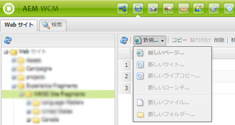
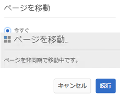
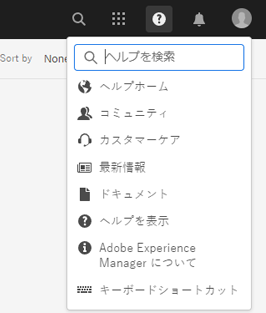
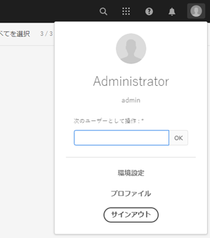

# [!DNL Adobe Experience Manager] 6.5 Service Pack リリースノート {#aem-service-pack-release-notes}

## リリース情報 {#release-information}

| 製品 | Adobe Experience Manager 6.5 |
| -------- | ---------------------------- |
| バージョン | 6.5.6.0 |
| 型 | Service Pack のリリース |
| 日付 | 2020年9月3日 |
| ダウンロード URL | [ソフトウェア配布](https://experience.adobe.com/#/downloads/content/software-distribution/en/aem.html?package=/content/software-distribution/en/details.html/content/dam/aem/public/adobe/packages/cq650/servicepack/aem-service-pkg-6.5.6-1.0.zip) |

## Adobe Experience Manager6.5.6.0に含まれるもの {#what-s-included-in-aem}

Adobe Experience Manager6.5.6.0は、2019 **年4月のGAリリース(GA)以降にリリースされた新機能、お客様からリクエストされた主な機能強化、パフォーマンス、安定性、セキュリティの向上を含む重要なアップデートで**&#x200B;す。 Adobe Experience Manager6.5の上に設置できます。

Adobe Experience Manager6.5.6.0で導入された主な機能および機能強化には、次のものが含まれます。

* Brand PortalからExperience Managerアセットへのアセット貢献度フォルダーの公開も、プロキシサーバーを介したサポートされるようになりました。

* 内のプライベートフォルダーを削除すると、自動生成されたプライベートフォルダーのグループがクリーンアップされるようになり [!DNL Experience Manager Assets]ました。

* では、ビデオ [!UICONTROL ビューア] プリセットエディタの修飾子の説明が更新されました [!DNL Dynamic Media]。

* コネクタのステータスを反映する新しい会社設定が提供され [!DNL Dynamic Media] ます。

* とのデフォルトオプション `test` は、 `aiprocess` 以前のDynamic Media `Thumbnail``Rasterize` のオプションに更新され、サムネールのみを作成し、ページ抽出とキーワード抽出をスキップする必要があることを確認しました。

* [クライアントでアダプティブフォームに事前入力します](../../help/forms/using/prepopulate-adaptive-form-fields.md#prefill-at-client)。

* [双方向SSL実装のサーバー上のRESTful APIとフォームデータモデルを統合](../../help/forms/using/configure-data-sources.md)。

* [翻訳済みアダプティブフォームページのキャッシュが強化されました](../../help/forms/using/configure-adaptive-forms-cache.md)。

* Automated [Formsコンバージョンサービスでの](https://docs.adobe.com/content/help/en/aem-forms-automated-conversion-service/using/convert-existing-forms-to-adaptive-forms.html)Adobe Signテキストタグのサポート。

* を使用して、色付きのフォームをアダプティブフォームに [変換するためのサポート](https://docs.adobe.com/content/help/en/aem-forms-automated-conversion-service/using/convert-existing-forms-to-adaptive-forms.html) 。 [!DNL Automated Forms Conversion service]

* SMB 2およびSMB 3プロトコルのサポート。

* 組み込み型のリポジトリ（Apache Jackrabbit Oak）をバージョン 1.22.4 に更新しました。

Experience Manager6.5.6.0で導入された機能および拡張機能の完全なリストについては、「Adobe Experience Manager6.5 Service Pack 6の新 [機能」を参照してください](new-features-latest-service-pack.md)。

6.5.6.0リリースでの修正のリスト [!DNL Experience Manager] を次に示します。

### [!DNL Sites] {#sites-6560}

* またはで、プロジェクト [!DNL Sites] を選択し、[ [!DNL Screens]管理] [パブリケーション ]をクリックします。 ユーザーインターフェイスのエラーが原因で、 [!UICONTROL パブリケーションの管理] ウィザードに進むことができません。 特に、「 [!UICONTROL 公開] 」オプションは機能しません(NPR-34099)。
* 「継承を [!UICONTROL キャンセル」または「継承を無効にする] 」オプションを選択解除した後、iParsys（継承された段落システム）の位置は、元のデフォルトの位置に戻りません(NPR-34097)。
* ロールアウト設定 `RolloutConfigManagerFactoryImpl` をロードできない場合、ロードは行われない設定をロードしません。 キャッシュされた設定(NPR-34092)を返します。
* Textコアコンポーネントでは、ソースHTML編集オプションを使用した後、 `em` タグからのクラスが削除されます(NPR-34081)。
* Experience Manager6.3.3からExperience Manager6.5.3にアップグレードした後、ロールアウト処理に時間がかかり、タイムアウトエラー(NPR-34049)が発生してロールアウトに失敗します。
* 属性値 `htmlwriter` はエンコードされません。 XFマークアップ内に存在するマークアップは、デコードされた属性値(つまり、デコードされた属性値 `"` ではなく `&#34`)で書き出されます。 Visual Experience Composerでターゲット側で、XFが書き出された(NPR-34048)を使用する問題を引き起こします。
* でページを移動する場合 [!DNL Experience Manager Sites]は、ログを拡張して、理由を使用してバージョン作成の失敗をキャプチャします(NPR-34014)。
* で、すべてのテキストが削除され [!DNL Rich Text Editor] ると、段落タグも削除されます(NPR-33976)。
* （クラシックUIの） `siteadmin` ページを開くか更新すると、 `New` メニューのオプションが無効になります(NPR-33949)。

   

* Aは、 [!DNL Content Fragment] (NPR-33911)で失敗した `TemplatedResource``ContentFragmentUsePojo` ので、Aとして使用することはできません。
* 同期および非同期移動操作は、同時転送によるエラーを引き起こす可能性があります。 ページ移動操作は、同期移動のみに制限されます。 ページの同時移動を防ぎます(NPR-33875)。
* [!UICONTROL 「Manage Publication] 」操作で、作成者から発行インスタンスにコンテンツを複製するには失敗し、JavaScriptエラーが発生します(NPR-33872)。
* 複数のページまたはアセットを選択してバージョンを作成する場合、新しいバージョンは、最後に選択されたページまたはアセットに対してのみ作成されます(NPR-33866)。
* ライブコピーのあるブループリントページを別のフォルダーに移動します。 元のフォルダーに移動すると、移動操作はエラーなしで失敗します(NPR-33864)。
* 移動アクションを使用してコン [!DNL Sites] ソールでWebページの名前を変更すると、ウィザードの最後の手順で、重なり合う2つのダイアログが表示されます(NPR-33831)。

   

* コピー `cq:acLinks` および貼り付け操作中に、コピー `cq:acUUID`[!DNL Adobe Campaign] 上のプロパティとプロパティが削除されます(NPR-33794)。
* アタッチ解除された親ライブコピーの子ページでロールアウトを試みると、ヌルポインタ例外(NPR-33676)が [!DNL Experience Manager] 生成されます。
* レイアウト [!DNL RTE] コンテナをコピーして再度ページに貼り付けると、レイアウトコンテナのコンポーネントは表示されません。 コンポーネントは編集できませんが、ページの更新時に表示されます(NPR-33662)。 [!DNL RTE]
* 異なるブレークポイント（中および大）に対してレイアウトコンポーネントのサイズを変更する場合、レイアウトは期待どおりに動作しません(NPR-33608)。
* のインライン編集モードで [!DNL RTE]は、画像のドラッグがテキストコンポーネント(NPR-33602)で動作しません。
* Blueprintページ内に、ページ名と同じ名前のコンポーネントを作成できます。 ロールアウト時に、 `_msm_moved` はコンポーネントの名前を変更するサフィックスが付きます。 コンポーネントが [!UICONTROL 段落システム] (NPR-33535)の末尾に移動されます。
* 多くのページまたはアセットでoffTimeまたはonTimeが設定されている場合、リソースが大量に消費され、起動と停止中にシステムの動作が遅くなります(NPR-33482)。
* CRUD権限がオンのユーザー `/content/experience-fragment` は、フォルダーを削除できません(NPR-33436)。
* 「 [!UICONTROL HTML &amp; JSON] 」を、 [!UICONTROL セクション内の親フォルダーにある][!DNL Experience Fragments] Adobe Targetの書き出し形式のオプションとして選択できます。 この親フォルダーのサブフォルダーに対するタッチ対応UIにも、同じプロパティが表示されます。 ただし、CRXDEでは、表示 `cq:adobeTargetExportFormat`するのではなくHTMLのみを表示 `html,json` します(NPR-33423)。
* 「ページエイリアスの発行」または「ページエイリアスの非公開」はサポートされていません。 他の場合に要求すると思われるオプションを削除します(NPR-33415)。
* 特定のタグは、の別の場所に移動でき [!DNL Experience Manager]ます。 また、移動前と移動後に別のページに適用することもできます。 ページのプロパティを編集する場合、タグが同じであっても、タグは編集用に表示されません(NPR-33353)。
* 複数のレイアウトコンテナを含むテンプレートからレイアウトコンテナが削除された場合、ページテンプレートが正しくレンダリングされません(NPR-33347)。
* テンプレートエディターで、の下の100000ページ以上で使用されているテンプレートを削除するようにし `/content/`ます。 エラーメッセージが表示されずにエラーが表示されます(NPR-33312)。
* アンカーを含む [!DNL Experience Manager] ページへのリダイレクトは、URLフラグメントまたはアンカーの後にクエリ文字列を `PageRedirectServlets` 配置するオーサーインスタンスでは機能しません(NPR-34288)。
* でブランドを作成すると、キャンペーンの作成が許可されない構造にな `/content/campaign` ります。 [!UICONTROL 「ブランドを作成] 」オプションを選択すると、新しく作成されたブランドは「 [!UICONTROL オファーとアクティビティを作成する」オプションを使用できずに残ります。これは「] 作成  」オプションがないためです(NPR-34113)。
* ページ [!DNL Live Copy] の操作を中止すると、エディターモードで表示されるように、継承が中断されます。 ページプロパティで、継承を表すアイコンが誤って継承が存在し、壊れていないことを示しています(NPR-34017)。
* 参照の多いページは非同期に移動できず、移動操作に失敗する場合があります。(CQ-4297969)
* オーサリング中に、URLに `/` 文字が含まれるWebページが応答しなくなります。 オーサリング中にコンポーネントが追加されると、CPU使用量が増加し、ブラウザーが応答しなくなります(CQ-4295749)。
* 参照モードでは、NVDAは[タイプ/サイズ]メニューオプションから選択した値をナレートしません。 選択した要素に視覚的なフォーカスがありません。 スクリーンリーダーに依存するユーザーは、参照モードを使用できません。(CQ-4294993)
* Webページの作成時に、ユーザーは「 [!UICONTROL コンテンツページ] 」テンプレートを選択できます。 「 [!UICONTROL ソーシャルメディア] 」タブで、ユーザーは [!UICONTROL 優先XFバリエーションを選択します]。 NVDAブラウズモードでエクスペリエンスフラグメントを選択する場合、キーボードキーを使用できません(CQ-4292669)。
* ハンドルバーライブラリが更新され、より安全なv4.7.3(NPR-34484)になりました。

### [!DNL Assets] {#assets-6560}

**Experience Managerアセットのアクセシビリティの強化**

* キーボードのキーを使用して、アセットの [!UICONTROL 参照リスト(NPR-34115)のインタラクティブユーザーインターフェイスオプションにアクセスし、フォーカスできるようになりました] 。

* スクリーンリーダーが、検索ページ上の述部の意図したアクションを発表するようになりました(NPR-34104)。

* 検索ページと検索結果ページに、スクリーンリーダーユーザーをより深く理解するための情報が得られるタイトルが追加されました(NPR-34093)。

* スクリーンリーダーは、アセットの [!UICONTROL プロパティ] ページの「基本  」タブで選択したタグを削除するオプションを読み上げるようになりました(NPR-33972)。

* 現在は、リスト表示の各行の要素が、スクリーンリーダーによって同じ行の要素としてアナウンスされます(NPR-33932)。

* キーを使用して移動する際のユーザーのフォーカスが、バージョンプレビューの閉じるオプション(NPR-33863)に移動するようになりました。 `Tab`

* Omnisearchが閉じられた後、ユーザーのフォーカスが検索アイコンに移動するようになりました(NPR-33705)。

* 操作性の高いユーザーインターフェイスオプションで、キーボードキーを使用してナビゲーションした場合のコントラストが強化され、より目立つ視覚的な焦点が得られるようになりました。 キーボードユーザは、焦点が合った領域(NPR-33542)を識別できる。

* スクリーンリーダーのブラウズモードで、 [!UICONTROL メタデータスキーマエディタ] (CQ-4296326)でキーボードを使用したドラッグ機能が動作するようになりました。

* リンク共有ダイアログで、参照モードで移動するときに、スクリーンリーダーが

   * ダイアログが読み込まれるとすぐに、テーブル情報を読み込みません。

   * リストに表示されているすべての自動提案に移動できます。

   * 電子メールアドレス/ [!UICONTROL 検索] (CQ-4294232)に対して表示される自動提案のナレーションを行います。

* カードの表示からクイックアクションアイコンを削除するために `Esc` キーを使用した場合に、最後にフォーカスされたアイテムからキーボードのフォーカスが削除されることはなくなりました。(CQ-4293554)

* ユーザーインターフェイス上のインタラクティブオプションに対して、スクリーンリーダーは、アイコンのリテラル名ではなく、その目的を発表するようになりました。(CQ-4272943)

* キーボードフォーカスは [!UICONTROL Flyout], InlineInlineInlineShoppable_Shoppable_ [!UICONTROL NarkZoom_lightBannerZoom_lightVerticalZoomVarnerVerticalZoomVarnerVarnerDownLigeKeyキーボード内の詳細を使用してFlyoutFlyFoutFlyout]Flyout [!DNL Dynamic Media] ,InInInInInInInInInIneInInInInInInInInInInInInInInInInInInInInInInInInInInInInInInInInInInInInInInInInInInInInInInInq-4290605)

* [!UICONTROL アセットの] プロパティ  ページの「保存して閉じる」オプションが、キーボードキー(NPR-34107)を使用してアクセスできるようになりました。

* ログインページ上の誤ったユーザー名とパスワードの組み合わせによるエラーメッセージが、エラーが発生するたびにスクリーンリーダーによって通知されるようになりました(NPR-33722)。

* ブラウズモードでのナビゲーション時に、 [!DNL Experience Manager] ヘッダーセクションで、スクリーンリーダーが

   * 「 [!UICONTROL タイプ」のサーチクエリを自動編集して、Omnisearchでサーチクエリを作成] 。

   * [ [!UICONTROL ソリューション]]、[ [!UICONTROL ヘルプ]]、[受信トレイ 、[] ユーザー]の各オプションで、展開または折りたたまれた状態を表します。

   * ヘルプ [!UICONTROL オプションの「ヘルプの検索] 」フィールドに検索文字列が入力されたときに表示される、 [!UICONTROL ヘルプの検索ステータスメッセージ] です。

   

   *図： [!UICONTROL [] ヘルプ メニューで[ヘルプ] ]を検索してください。*

   * 「 [!UICONTROL User] 」オプションの下の「 [!UICONTROL Impersonate as] 」フィールドに誤った値が入力され、フォーカスが正しくテキストフィールド(NPR-33804)に移動した場合に、エラーメッセージが表示されます。

   

   *図： [!UICONTROL ヘッダーの] ユーザー  メニューのフィールドとして動作します。*

* ユーザーは、次のウィンドウ内のキーボードを使用してフォーカスを変更できるようになりました。

   * [!UICONTROL リンクの共有] ダイアログの「検索/追加電子メールアドレス  」フィールド

   * [!UICONTROL フォルダーのプロパティ][!UICONTROL (NPR-34452)の「] 権限 [!UICONTROL 」タブにある「] 閉じたユーザーグループ」の下の「ユーザーまたはグループ」フィールド。

**Experience Managerアセットで修正された問題**

[!DNL Adobe Experience Manager] 6.5.6.0 [!DNL Assets] には、次の問題の修正が含まれています。

* アセットのタイムラインから注釈を選択した場合、注釈はハイライトされません。(CQ-4302422)

* テンプレートを使用して作成したマーケティングコラテラルアセット（パンフレット、チラシ、名刺など）をプレビューしても、改行と段落区切りは表示されません(NPR-34268)。 [!DNL Adobe InDesign]

* テキスト抽出のため、アップロードされたPDFファイルの全文検索は機能しません(NPR-34164)。 この問題を修正するには、Service Pack 6のインストール後に [!DNL sAdobe Experience Manager] 展開を再起動します。

* 複数ページのアセットのタイムラインには、アセットを閲覧する際に、特定のサブアセットに固有の注釈を表示するのではなく、すべてのサブアセットに適用された注釈がタイムライン表示に表示されます(NPR-34100)。

* フォルダーにJavaScript、CSSまたはJSONファイル形式(NPR-34090)のリソースが含まれている場合、「パブリケーションの [!UICONTROL 管理] 」オプションを使用してアセットフォルダーが公開されません。

* Omnisearchで適用したタグやフィルターを選択解除または削除すると、検索クエリが複数回実行されるので、検索時間が長くなります(NPR-34078)。

* ワークフロー（フォルダー内のアセット上）が進行中または保留中の場合、カード表示では、ワークフローが完了または終了するまで、ページがリロードされます。 したがって、作成者は、下にスクロールする必要のあるフォルダー内のアセットを操作することはできません(NPR-33986)。

* ユーザが公開済みアセットを新しい場所に移動した場合、「再公開  」オプションの選択が解除されていても、アセットは再公開されます。 これにより、多数の親なしアセットが発行インスタンス上に配置されます。 ただし、デフォルトの動作では、パブリッシュ済みアセットの移動操作によって自動的に非公開にされます。アセットを移動する際に作成者が「 [!UICONTROL 再公開] 」オプションを選択すると、このアセットが再公開されます(NPR-33934)。

* コレクション内のアセットの [!UICONTROL 移動] ページでは、「 [!UICONTROL 調整/再公開] 」オプションなど、すべてのHTMLコンテンツが読み込まれるわけではありません。 したがって、ユーザは移動操作(NPR-33860)を完了できない。

* アセットを移動し、移動したアセットの名前とタイトルに特殊文字を追加すると、アセットの新しい場所(NPR-33826)に追加のフォルダー（同じ名前）が作成されます。

* [!UICONTROL ダウンロード] ( [!UICONTROL NPR-33730)ダイアログで「電子メール] 」オプションが選択されている場合、アセットのダウンロードボタンが無効になります。

* アセットに対してバルクメタデータ編集(NPR-33723)などのバルク操作を実行すると、「Request-URI too long」というエラーが発生します。

* JavaScriptエラーが発生し、アップロードされたJSONファイルの値にスペースまたは特殊文字(NPR-33712)が含まれている場合、 [!UICONTROL Dropdown] ( [!UICONTROL ドロップダウン] )フィールドに生成された選択肢は、 [!UICONTROL Folder MetadataスキーマフォームエディターのJSONパス](JSON)機能を使用して選択または削除できません。

* またはの「 [!UICONTROL 開く] 」オプションを使用してアセットを更新し、 [!DNL desktop app][!DNL Adobe Asset Link][!DNL Adobe Experience Manager] (CQ-4296279)に同期した場合、アセットの静的レンディションは更新されません。

* 列表示では、アセットのセットに対して移動操作を実行すると、「 [!UICONTROL フィルタ] 」オプションを使用する前に選択したアセットも移動されます。 「 [!UICONTROL Filter] 」オプションを使用すると、前の選択項目の選択が解除されます(NPR-34018)。

* アセットの検索候補の中で、バックスラッシュは特殊文字の前に追加されます。アセットの名前には特殊文字が含まれます(NPR-33834)。

* 「 [!UICONTROL フォルダーメタデータスキーマフォーム]」でドロップダウンのルールを作成する場合、「 [!UICONTROL フィールドの選択肢] 」列(CQ-4297530)の値を選択できません。

* 6.5 Service Pack 5以前のバージョンを6.5(NPR-34532)にインストールすると、カスタムワークフローモデル（で作成）の実行時 `/var/workflow/models/dam`のコピーが削除され [!DNL Experience Manager][!DNL Experience Manager] ます。 ランタイムコピーを取得するには、ワークフローモデルのデザイン時コピーをHTTP APIを使用してランタイムコピーと同期します。
   `<designModelPath>/jcr:content.generate.json`.

**ダイナミックメディアで修正された問題**

* ビデオプロファイルの作成後に編集時にエンコーディング設定を定義した場合、スマート切り抜き設定がビデオプロファイルから削除されます。(CQ-4299177)

* アセットの詳細ページ(NPR-34235)で、ユーザーがサイドレールオプション( [!UICONTROL 概要]、 [!UICONTROL タイムライン]、 [!UICONTROL ビューア]など)を切り替えた場合に、ページ読み込み時にアセットがちらつく。

* 再処理ジョブでは、次の問題が見られます。

   * ジョブIDが再処理ジョブによって返されたジョブハンドルにありません。

   * ビデオログのジョブを再処理します。ファイル名のみで、フルパスは処理しません。

   * 再処理ジョブには、アセットタイプを静的に設定するオプションはありません。

   * `ExcludeFromAVS` 」オプションは提供されません(CQ-4298401)。

* 画像プロファイルが複数（例えば11）の縦横比を持つフォルダー(NPR-34082)に追加されると、スマート切り抜き機能がエラーで失敗します。

* DAMアセット更新ワークフローは、ダイナミックメディアScene7(CQ-4299727)で [!UICONTROL 設定された] ツール [!UICONTROL 内の「ワークフロー」タブにある「ワークフローアーカイブ][!DNL Adobe Experience Manager] 」ページをスクロールダウンしたときにトリガーされます。

* ビューアプリセットエディタの「 [!UICONTROL 動作] 」タブのシンボルがローカライズされません  (CQ-4299026)。

* メイン表示で、ビューアがレスポンシブモードの場合、ビューアに収まらない誤ったレイアウトで画像が表示されます。(CQ-4298293)

* [!UICONTROL Adobe Experience Manager] での画像プリセットの変更がScene7パブリッシングシステム(CQ-4299713)と同期されません。

### [!DNL Commerce] {#commerce-6560}

* アセットが移動されても、製品のアセットへのリンクはリファクタリングされません(NPR-34098)。

### プラットフォーム {#platform-6560}

* アップグレードしたExperience Managerインスタンス(NPR-34336)で、診断ツールを使用してログをダウンロードできません。
* 特定のバージョンの `cq-wcm-api` Foundationパッケージ(CQ-4300520)に依存しているため、アップグレードが失敗します。
* デフォルトエージェント（公開）設定の「 **[!UICONTROL 接続タイムアウト]** 」と「 **[!UICONTROL ソケットタイムアウト]** 」のデフォルト値は指定されていません(NPR-33707)。
* の下のマッピング設定に対する更新 `/etc/map.publish` は、サイトページに反映されません(NPR-34015)。
* [APIリファレンスドキュメント](https://helpx.adobe.com/experience-manager/6-5/sites/developing/using/reference-materials/javadoc/com/day/cq/tagging/package-summary.html) には、パッケージのドキュメントは含まれていません `com.day.cq.tagging` (CQ-4295864)。

### ユーザーインターフェイス {#ui-6560}

* ブラウザーのオフロードインターフェイスでは、一部のジョブトピックが表示されません(NPR-34308)。
* 設定ブラウザーのインターフェイスには、すべての設定(NPR-33644)が表示されるわけではありません。
* ユーザーが偽装するように検索する際に `Esc` キーを押すと、ユーザーリスト(NPR-34084)ではなく、 **[!UICONTROL ユーザー]** ダイアログが閉じます。

### 統合 {#integrations-6560}

* 長い名前のアクティビティは [!DNL Adobe Target] (NPR-34254)と同期されません。

### 翻訳プロジェクト {#translation-6560}

* ユーザーの特殊文字が `authorizableID` 含まれる場合、翻訳プロジェクトは作成されません(NPR-33828)。

### Sling {#sling-6560}

* ヘルスチェックとパターンディテクターには、重複する機能があります。 その結果、ヒースチェックは製品(NPR-33928)から削除されます。

### WCM {#wcm-6560}

* Foundation Components — 基礎画像コンポーネントをページに追加し、画像を参照する場合、 `Undo` 操作は動作しません(NPR-34516)。

* ページ移動操作(CQ-4303028)を使用できません。

### [!DNL Communities] {#communities-6560}

* ソーシャルメディアで投稿を共有すると、古いオプションGoogle+が表示されています(NPR-33877)。

* コミュニティのメンバは、グループテンプレートまたは他のグループ機能の設定(NPR-33530)を変更できません。

* フォーラム投稿で、画像のハイパーリンクタグが適切に生成されません(NPR-33464)。

* アクセシビリティのエラーは、コミュニティの割り当て機能(NPR-33442)で識別されます。

* 管理コンソールを介して追加されたコミュニティグループの既存のユーザは、コミュニティグループコンソール(NPR-34315)で変更が行われると、ユーザリストから削除される。

<!--
* Tag filters are vulnerable to sensitive information disclosure (NPR-33868).
-->

### [!DNL Forms] {#forms-6560}

>[!NOTE]
>
>[!DNL Experience Manager] Service Packにはの修正が含まれていません [!DNL Forms]。 They are delivered using a separate [!DNL Forms] add-on package. In addition, a cumulative installer is released that includes fixes for [!DNL Experience Manager Forms] on JEE. For more information, see [Install AEM Forms add-on](#install-aem-forms-add-on-package) and [Install AEM Forms on JEE](#install-aem-forms-jee-installer).

6.5.6.0アドオンパッケージ [!DNL Experience Manager Forms] のインストール後：

* Stop the [!DNL Experience Manager Forms] instance.

* ディレクトリ `bcpkix-1.51`からJARファイル、 `bcmail-1.51``bcprov-1.51``crx-repository\launchpad\ext` JARファイルを削除します。

* プロパティを` sling.bootdelegation.class.org.bouncycastle.jce.provider.BouncyCastleProvider``sling.properties` ファイルから削除します。

* Restart the [!DNL Experience Manager Forms] instance.

**アダプティブフォーム**

* アダプティブフォームフラグメントが見つからない場合、アダプティブフォームはレンダリングに失敗します(NPR-34302)。

* アダプティブフォームのフィールドのヘルプコンテンツの説明には、段落HTMLタグ(NPR-34116)が表示されます。

* 「サーバーで **** 再検証」プロパティを選択すると、アダプティブフォームは送信に失敗します(NPR-33876)。

* RESTエンドポイント **** への送信アクションは、アダプティブフォーム(CQ-4299044)では動作しません。

* アクセシビリティ：必須フィールドの添付ファイルをアップロードせずにアダプティブフォームを送信しようとすると、フォーカスが自動的に添付フィールドに移動することはありません。(CQ-4298065)

* アダプティブフォームの表に行を追加する場合、 **[!UICONTROL 上から上へ]** 、 **[!UICONTROL 追加から下への]** 各オプションには適切な結果が表示されません。(CQ-4297511)

* 値コミット [!UICONTROL (] Value Commit)スクリプトが正しくトリガされず、アダプティブフォームでデータが失われます。(CQ-4296874)

* ローカライズされたアダプティブフォーム(NPR-34333)では、日付選択が正しく機能しません。

* ファイル名にアンダースコアまたはスペースが含まれている場合、そのファイルをアダプティブフォーム(CQ-4301001)に添付できません。

* ネストされた繰り返し可能パネルの回数が親より多い場合、そのようなネストされた繰り返し可能パネルのすべての回数は事前入力に失敗します(NPR-33666)。

* アダプティブフォームには、いくつかのオープンなリソースリゾルバーがあります。 これらは送信エラーを引き起こします。 この問題は断続的に発生します(CQ-4299407)。

* フィールド設定を初めて開くと、プロパティアイコンは表示されません(CQ-4296284)。

**ワークフロー**

* ワークフローの承認者が添付ファイルをアップロードすると、添付ファイルの名前が `undefined` (NPR-33699)に変更されます。

* [!DNL Experience Manager] ワークフローの削除操作が失敗し、次のエラーメッセージが表示されます(NPR-33575)。

   `java.lang.UnsupportedOperationException: The query read more than 500000 nodes in memory`

* [!DNL Experience Manager Forms] フォームのアプリケーションがフォームの送信後に応答を [!DNL Windows] 停止する(NPR-34409)。

* AEM Service Packをインストールすると、項目の **タスク** リストはリンクとして表示されません。 「 **To Do** 」項目のテキストには、HTMLタグ(NPR-34317)が含まれます。

**インタラクティブコミュニケーション**

* 繰り返し可能なコンポーネントがネストされたテキストドキュメントフラグメントを含めると、インタラクティブ通信は保存に失敗します(NPR-34095)。

**Correspondence Management**

* データディクショナリの値を含むテキストドキュメントフラグメントを変更すると、エージェントUIが応答を停止します(NPR-33930)。

* コンテンツを [!DNL Microsoft Word] ドキュメントからレターのテキストドキュメントフラグメントにコピー&amp;ペーストすると、フォーマットの問題が発生します(NPR-33536)。

**ドキュメントサービス**

* OutputサービスとFormsサービスを使用してXDPファイルからPDFファイルを生成すると、テキストの欠落と重なり合いが生じます(NPR-34237、CQ-4299331)。

* HTMLファイルをPDFに変換する場合、 `MaxReuseCount` 属性は設定できません(NPR-33470)。

* Reader拡張機能がインタラクティブ機能を含むPDFファイルをダウンロードする場合、 [!DNL Adobe Reader] (NPR-33729)を使用して添付ファイルをPDFファイルに追加することはできません。

**Document Security**

* Service Pack(NPR-34310)をインストールした後、PDFファイル内のHSMベースの証明書で署名操作を実行できない。 [!DNL Experience Manager]

**Designer**

* Designerバージョン6.5.xでXFormsを開けません(CQ-4295322)。

* Designerを開くと、スタートアップスクリーンに正しくない年が表示されます(CQ-4295289)。

* をサーバー [!DNL Acrobat DC] にインストールすると、「フォームの **[!UICONTROL 配布]** 」オプションは非アクティブになります(CQ-4296304)。

セキュリティ更新について詳しくは、「 [Experience Managerセキュリティ速報ページ](https://helpx.adobe.com/security/products/experience-manager.html)」を参照してください。

## Install 6.5.6.0 {#install}

**セットアップ要件**

* AEM 6.5.6.0 requires AEM 6.5. See [upgrade documentation](/help/sites-deploying/upgrade.md) for detailed instructions.
* Service Packのダウンロードは、Adobe [ソフトウェア配布](https://experience.adobe.com/#/downloads/content/software-distribution/en/aem.html)(SDM)で入手できます。
* MongoDB と複数のインスタンスを含むデプロイメントでは、パッケージマネージャーを使用してオーサーインスタンスの 1 つに AEM 6.5.6.0 をインストールしてください。
* インストールする前に、AEMインスタンスのスナップショットまたは新規バックアップを作成します。
* インストールする前にインスタンスを再起動してください。これは、インスタンスがまだ更新モードになっている場合（インスタンスが以前のバージョンから更新されたばかりの場合）にのみ必要ですが、インスタンスが長期間実行されていた場合にはお勧めします。

>[!NOTE]
>
>Adobeでは、Adobe Experience Manager6.5.6.0パッケージの削除またはアンインストールをお勧めしません。

### サービスパックのインストール {#install-service-pack}

既存のAdobe Experience Manager6.5インスタンスにService Packをインストールするには、次の手順を実行します。

1. Service Packを [Software Distribution](https://experience.adobe.com/#/downloads/content/software-distribution/en/aem.html?package=/content/software-distribution/en/details.html/content/dam/aem/public/adobe/packages/cq650/servicepack/aem-service-pkg-6.5.6-1.0.zip)（ソフトウェア配布）からダウンロードします。

1. Open Package Manager and click **[!UICONTROL Upload Package]** to upload the package. 使用方法について詳しくは、 [パッケージマネージャーを参照してください](https://docs.adobe.com/content/help/ja-JP/experience-manager-65/administering/contentmanagement/package-manager.html)。

1. Select the package and click **[!UICONTROL Install]**.

>[!NOTE]
>
>既知の問題により、更新されたService Packパッケージが使用可能です。 パッケージのインストールをお勧めします。

>[!NOTE]
>
>Service Packのインストール中に、Package Manager UIのダイアログが閉じることがあります。 Adobeでは、エラーログが安定するのを待ってからデプロイメントにアクセスすることをお勧めします。 アップデーターバンドルのアンインストールに関連する特定のログが表示されるのを待ってから、インストールが成功したことを確認してください。 Typically, this happens on [!DNL Safari] but can intermittently happen on any browser.

**自動インストール**

作業インスタンスにAdobe Experience Manager6.5.6.0を自動的にインストールするには、次の2つの方法があります。

A.サーバーがオンラインで使用可能になったら、パッケージを `../crx-quickstart/install` フォルダーに配置します。 パッケージが自動的にインストールされます。

B. Package Managerの [HTTP APIを使用します](https://docs.adobe.com/content/docs/en/crx/2-3/how_to/package_manager.html)。 ネストされたパッケージ `cmd=install&recursive=true` がインストールされるようにを使用します。

>[!NOTE]
>
>Adobe Experience Manager6.5.6.0は、Bootstrapのインストールをサポートしていません。

**インストールの検証**

1. 製品情報ページ(`/system/console/productinfo`)の「インストール済み製品 `Adobe Experience Manager (6.5.6.0)` 」に、更新済みのバージョン文字列が表示され ます。

1. All OSGi bundles are either **[!UICONTROL ACTIVE]** or **[!UICONTROL FRAGMENT]** in the OSGi Console (Use Web Console: `/system/console/bundles`).

1. OSGiバンドル `org.apache.jackrabbit.oak-core` はバージョン1.22.3以降です(Webコンソールを使用： `/system/console/bundles`)をクリックします。

このリリースで動作が確認されたプラットフォームについて詳しくは、 [技術要件を参照してください](/help/sites-deploying/technical-requirements.md)。

### Adobe Experience Manager Formsアドオンパッケージのインストール {#install-aem-forms-add-on-package}

>[!NOTE]
>
>AEM Forms を使用していない場合はスキップしてください。Adobe Experience Manager Formsの修正は、別のアドオンパッケージを通じて提供されています。

1. Adobe Experience ManagerService Packがインストールされていることを確認します。
1. Download the corresponding Forms add-on package listed at [AEM Forms releases](https://helpx.adobe.com/jp/aem-forms/kb/aem-forms-releases.html) for your operating system.
1. Install the Forms add-on package as described in [Installing AEM Forms add-on packages](../forms/using/installing-configuring-aem-forms-osgi.md#install-aem-forms-add-on-package).

### JEEへのAdobe Experience Manager Formsのインストール {#install-aem-forms-jee-installer}

>[!NOTE]
>
>JEE で AEM Forms を使用していない場合はスキップします。JEE上のAdobe Experience Manager Formsの修正は、別のインストーラーを使用して提供されています。

For information about installing the cumulative installer for Experience Manager Forms on JEE and post-deployment configuration, see the [release notes for patch 0018](jee-patch-installer-65.md).

### UberJar {#uber-jar}

Experience Manager6.5.6.0のUberJarは、 [Maven Centralリポジトリで使用できます](https://repo.maven.apache.org/maven2/com/adobe/aem/uber-jar/6.5.6-1.0/)。

MavenプロジェクトでUberJarを使用するには、UberJarの使用 [方法を参照し](/help/sites-developing/ht-projects-maven.md) 、プロジェクトPOMに次の依存関係を含めます。

```shell
<dependency>
      <groupId>com.adobe.aem</groupId>
      <artifactId>uber-jar</artifactId>
      <version>6.5.6-1.0</version>  
      <scope>provided</scope>
</dependency>
```

>[!NOTE]
>
>このリリース以降、UberJarおよびその他の関連アーティファクトは、AdobeのパブリックMavenリポジトリ(repo.adobe.com)ではなく、Maven Centralリポジトリで使用できます。 メインのUberJarファイルの名前がに変更され `uber-jar-<version>.jar`ます。 その結果、 `classifier`タグに値 `apis``dependency` はありません。

## 非推奨（廃止予定）の機能 {#removed-deprecated-features}

この節では、Experience Manager6.5.6.0で非推奨とマークされた機能と機能に関するリストを示します。将来のリリースで削除される予定の機能は、非推奨となります。他の方法を使用する場合もあります。

お客様は、現在の導入で機能を利用しているかどうかを確認し、別のオプションを使用するように導入を変更する計画を立てることをお勧めします。

| 領域 | 機能 | 代替手段 |
|---|---|---|
| 統合 | AEM **[!UICONTROL クラウドサービスのオプトイン画面は非推奨です]** 。 AEM 6.5で更新されたAEMとターゲットの統合により、AdobeIMSとI/Oを介した認証を使用するTarget Standard APIがサポートされ、AEMページの解析とパーソナライゼーションの実装でAdobe開始の役割が増加しているため、オプトインウィザードは機能的に無関係になりました。 | 各AEMクラウドサービスを介して、システム接続、AdobeIMS認証、AdobeI/O統合を設定します。 |
| コネクタ | AEM 6.5では、JCR Connector for Microsoft SharePoint 2010およびMicrosoft SharePoint 2013のAdobeが非推奨です。 | 該当なし |

## 既知の問題 {#known-issues}

* セキュリティ正常性チェックが機能せず、システムに次のエラーメッセージが表示される場合：
   `message: Could not verify users and could not test system account logins.`問題を解決するには、次の手順を実行してください。
   1. Go to https://&lt;*hostname*>:&lt;*port*>/system/console/configMgr.

   1. `hc.impl` を検索。

   1. 「 [!UICONTROL サービスのマッピング]」でをクリック `+` し、を指定し `com.adobe.granite.repository.hc.impl=[user-reader-service]`ます。

   1. 「[!UICONTROL Save]」をクリックして、 設定を保存します。

* 6.5 Service Pack 5または [!DNL Experience Manager] 以前のService Packを6.5にインストールした場合は、カスタムワークフローモデル（で作成）の実行時のコピーが [!DNL Experience Manager]`/var/workflow/models/dam`削除されます。
ランタイムコピーを取得するには、Adobeから、カスタムワークフローモデルのデザイン時コピーを、HTTP APIを使用して実行時コピーと同期するように提案されます。
   `<designModelPath>/jcr:content.generate.json`.

* [ [!UICONTROL フォルダメタデータ]スキーマ[Formsエディタ] ]および[メタデータ]スキーマ[Formsエディタ で、[ルールの] 定義  ]ダイアログを使用してカスケードルールを編集および作成する際に問題が発生した場合は、Adobeサポートにお問い合わせください。 既に作成および保存されているルールは、期待どおりに動作していることに注意してください。

* If a folder in the hierarchy is renamed in [!DNL Experience Manager Assets] and the nested folder containing an asset is published to [!DNL Brand Portal], the title of the folder is not updated in [!DNL Brand Portal] until the root folder is published again.

* ユーザーがアダプティブフォームで初めてフィールドを設定することを選択した場合、設定を保存するオプションはプロパティブラウザーに表示されません。 同じエディターでアダプティブフォームの他のフィールドの設定を選択すると、問題が解決します。

* インストール後に [!UICONTROL 接続されたアセットの設定] (Connected Assets Configuration `cq-remotedam-client-ui-content` )ウィザードが404エラーメッセージを返す場合は、Package Managerを使用して、パッケージ `cq-remotedam-client-ui-components` とパッケージを手動で再インストールします。

* AEM 6.5.x.xのインストール中に、次のエラーおよび警告メッセージが表示される場合があります。
   * 「Target Standard API（IMS 認証）を使用して AEM に Target 統合を設定する場合、エクスペリエンスフラグメントを Target に書き出すと、間違ったオファータイプが作成されます。Target では、「エクスペリエンスフラグメント」/source「Adobe Experience Manager」タイプではなく、「HTML」/source「Adobe Target Classic」タイプのオファーをいくつか作成します。
   * `com.adobe.granite.maintenance.impl.TaskScheduler` : granite/operations/maintenance にメンテナンスウィンドウが見つかりません。
   * SUM、MAX、MINなどの集計機能が使用されると、アダプティブフォームのサーバー側検証に失敗します。 CQ-4274424
   * `com.adobe.granite.maintenance.impl.TaskScheduler` - granite/operations/maintenance にメンテナンスウィンドウが見つかりません。
   * ダイナミックメディアのインタラクティブ画像のホットスポットは、買い物かご可能なバナービューアでアセットをプレビューすると表示されません。

## OSGi bundles and content packages included {#osgi-bundles-and-content-packages-included}

AEM 6.5.6.0に含まれるOSGiバンドルとコンテンツパッケージに関する次のテキストドキュメントリストです。

* [AEM 6.5.6.0 に含まれている OSGi バンドルの一覧](assets/6560_bundles.txt)

* [AEM 6.5.6.0 に含まれているコンテンツパッケージの一覧](assets/6560_packages.txt)

## Restricted sites {#restricted-sites}

以下のサイトは既存ユーザーのみが参照できます。アクセス権を必要とするお客様は、アドビのアカウントマネージャーにお問い合わせください。

* [licensing.adobe.com からの製品ダウンロード](https://licensing.adobe.com/)
* [カスタマーサポート](https://docs.adobe.com/content/help/en/customer-one/using/home.html)へのお問い合わせサポートポータルへのアクセスについて詳しくは、「サポートポータル [へのアクセス](https://helpx.adobe.com/jp/experience-manager/kb/accessing-aem-support-portal.html)」を参照してください。

>[!MORELIKETHIS]
>
>* [AEM 6.5 リリースノート](/help/release-notes/release-notes.md)
>* [AEM 製品ページ](https://www.adobe.com/marketing/experience-manager.html)
>* [AEM 6.5 ドキュメント](https://helpx.adobe.com/jp/support/experience-manager/6-5.html)
>* [Adobe優先度の製品アップデートの購読](https://www.adobe.com/subscription/priority-product-update.html)

