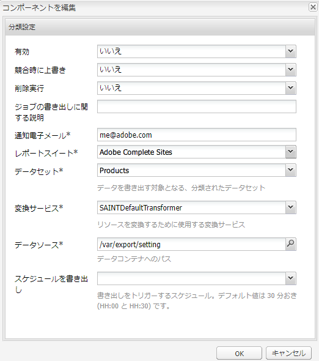

# Adobe 分類{#adobe-classifications}

Adobe Classifications exports classifications data to [Adobe Analytics](/help/sites-administering/adobeanalytics.md) in a scheduled manner. SAINT Exporter は、**com.adobe.cq.scheduled.exporter.Exporter** の実装です。

これを設定するには：

1. **ナビゲーション**&#x200B;を使用して、**ツール**、**クラウドサービス**&#x200B;を選択し、**従来のクラウドサービス**&#x200B;を選択します。
1. 「 **Adobe Analytics** 」までスクロールし、「設定を **表示**」を選択します。
1. Click the **[+]** link next to your Adobe Analytics configuration.

1. **フレームワークを作成**&#x200B;ダイアログで、次の操作を実行します。

   * 「**タイトル**」を指定します。
   * オプションで、リポジトリにフレームワークの詳細を保存するノードの&#x200B;**名前**&#x200B;を指定できます。
   * **Adobe Analytics分類の選択**

   「**作成**」をクリックします。

   

1. 編集用の **分類設定** ダイアログが開きます。

   

   プロパティには、次が含まれています。

   | **フィールド** | **説明** |
   |---|---|
   | 有効 | 「**はい**」を選択すると、Adobe Classifications の設定が有効になります。 |
   | 競合時に上書き | 「**はい**」を選択すると、データの競合が上書きされます。デフォルトでは、これは「**いいえ**」に設定されています。 |
   | 削除処理 | 「**はい**」に設定すると、書き出された後に処理したノードが削除されます。デフォルトは、「**False**」です。 |
   | ジョブの書き出しに関する説明 | Adobe Classifications ジョブの説明を入力します。 |
   | 通知電子メール | Adobe分類通知の電子メールアドレスを入力します。 |
   | レポートスイート | 読み込みジョブを実行するレポートスイートを入力します。 |
   | データセット | 読み込みジョブを実行するデータセット関連 ID を入力します。 |
   | 変換サービス | ドロップダウンメニューから、変換サービスの実装を選択します。 |
   | データソース | データコンテナのパスに移動します。 |
   | スケジュールを書き出し | 書き出すスケジュールを選択します。デフォルトは 30 分ごとです。 |

1. 「**OK**」をクリックして設定を保存します。

## ページサイズの変更 {#modifying-page-size}

レコードは、ページで処理されます。デフォルトでは、「Adobeの分類」はページサイズが1000のページを作成します。

ページのサイズは、Adobe分類の定義ごとに最大25,000個に設定でき、Felixコンソールから変更できます。 エクスポート中、Adobe分類はソースノードをロックし、同時に変更が行われないようにします。 ノードは、書き出し後、エラー時またはセッション終了時にロックを解除されます。

ページサイズを変更するには：

1. Navigate to the OSGI console at **https://&lt;host>:&lt;port>/system/console/configMgr** and select **Adobe AEM Classifications Exporter**.

   

1. 「**書き出しページサイズ**」を必要に応じて更新し、**保存**&#x200B;をクリックします。

## SAINTDefaultTransformer {#saintdefaulttransformer}

>[!NOTE]
>
>Adobe Classifications は、以前は SAINT Exporter と呼ばれていました。

SAINT Exporter は、変換サービスを使用して、書き出しデータを特別な形式に変換できます。For Adobe Classifications, a subinterface `SAINTTransformer<String[]>` implementing the Transformer interface has been provided. This interface is used to restrict the data type to `String[]` which is used by the SAINT API and to have a marker interface to find such services for selection.

デフォルトの実装SAINTDefaultTransformerでは、エクスポーターソースの子リソースは、プロパティ名をキーとし、プロパティ値を値として持つレコードとして扱われます。 **キー**&#x200B;列は、最初の列に自動的に追加され、その値がノード名になります。Namespaced properties (containing `:`) are disregarded.

*ノード構造：*

* id分類 `nt:unstructured`

   * 1 `nt:unstructured`

      * Product = My Product Name (String)
      * Price = 120.90 (String)
      * Size = M (String)
      * Color = black (String)
      * Color^Code = 101 (String)

**SAINT ヘッダーおよびレコード：**

| **キー** | **製品** | **価格** | **サイズ** | **カラー** | **Color^Code** |
|---|---|---|---|---|---|
| 1 | My Product Name | 120.90 | M | 黒 | 101 |

プロパティには、次が含まれています。

<table>
 <tbody>
  <tr>
   <td><strong>プロパティのパス</strong></td>
   <td><strong>説明</strong></td>
  </tr>
  <tr>
   <td>transformer</td>
   <td>SAINTTransformer 実装のクラス名</td>
  </tr>
  <tr>
   <td>email</td>
   <td>通知用の電子メールアドレス。</td>
  </tr>
  <tr>
   <td>reportsuites</td>
   <td>読み込みジョブを実行するレポートスイート ID。 </td>
  </tr>
  <tr>
   <td>dataset</td>
   <td>読み込みジョブを実行するデータセット関連 ID。 </td>
  </tr>
  <tr>
   <td>description</td>
   <td>Job description.   </td>
  </tr>
  <tr>
   <td>overwrite</td>
   <td>データの競合を上書きするためのフラグ。デフォルトは <strong>false</strong> です。</td>
  </tr>
  <tr>
   <td>checkdivisions</td>
   <td>レポートスイートの互換性をチェックするためのフラグ。デフォルトは <strong>true</strong> です。</td>
  </tr>
  <tr>
   <td>deleteprocessed</td>
   <td>処理したノードを書き出し後に削除するためのフラグ。デフォルトは <strong>false</strong> です。</td>
  </tr>
 </tbody>
</table>

## Adobe Classifications による書き出しの自動化 {#automating-adobe-classifications-export}

独自のワークフローを作成することで、新しい読み込みのたびにそのワークフローが開始され、構造の正しい適切なデータが **/var/export/** に作成されて Adobe Classifications に書き出すことができるようになります。
