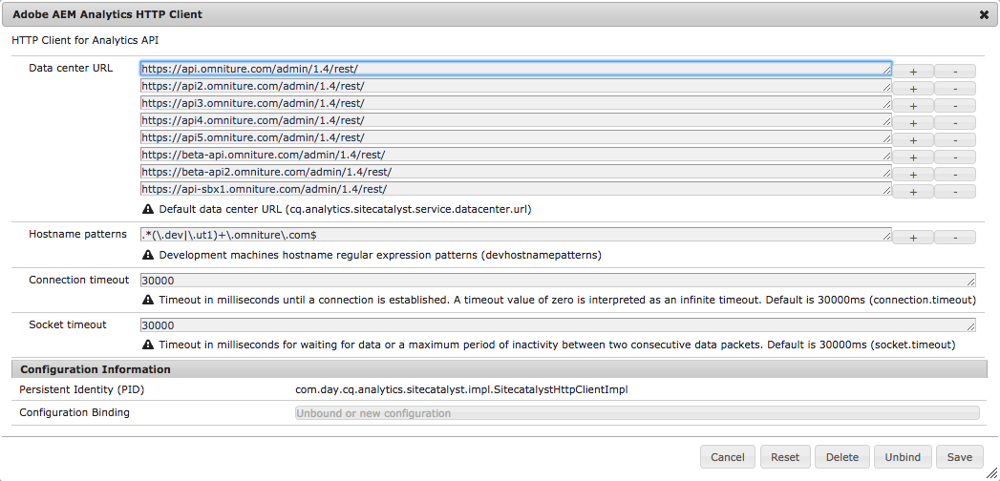
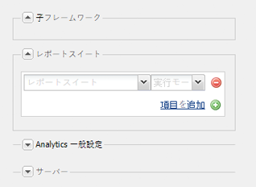
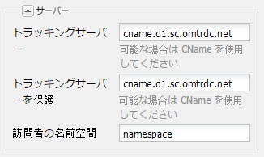

# Adobe Analytics への接続とフレームワークの作成 {#connecting-to-adobe-analytics-and-creating-frameworks}

アドビAnalyticsのAEMページからWebデータを追跡するには、AdobeAnalyticsCloud Service設定とAdobeAnalyticsフレームワークを作成します。

* **AdobeAnalytics設定：** アドビのAnalyticsアカウントに関する情報。 アドビのAnalytics設定により、AEMはアドビのAnalyticsに接続できます。 使用するアカウントごとに Adobe Analytics 設定を作成します。
* **AdobeAnalyticsフレームワーク：** アドビのAnalyticsレポートスイートプロパティとCQ変数間の一連のマッピング。 フレームワークを使用して、Web サイトデータを Adobe Analytics レポートにどのように入力するかを設定します。フレームワークは、アドビのAnalytics設定に関連付けられています。 設定ごとに複数のフレームワークを作成できます。

Webページをフレームワークに関連付けると、フレームワークはそのページとそのページの子孫の追跡を実行します。 ページビューは、Adobe Analytics から取得され、Sites コンソールに表示されます。

## 前提条件 {#prerequisites}

### Adobe Analytics アカウント {#adobe-analytics-account}

アドビのAnalyticsでAEMデータを追跡するには、有効なAdobe Marketing CloudのアドビAnalyticsアカウントが必要です。

アドビのAnalyticsアカウントは、次の要件を満たす必要があります。

* **管理者** 権限がある
* **Web サービスアクセス**&#x200B;ユーザーグループに割り当てられている

>[!CAUTION]
>
>（Adobe Analytics 内の）**管理者**&#x200B;権限を持っているだけでは、AEM から Adobe Analytics に接続するのに十分ではありません。アカウントは、**Web サービスアクセス**&#x200B;権限も持っている必要があります。

先に進む前に、お使いの資格情報で Adobe Analytics にログインできることを確認してください（次のどちらかから）。

* [https://marketing.adobe.com](https://marketing.adobe.com)

* [https://sc.omniture.com/login/](https://sc.omniture.com/login/)

### Adobe Analytics データセンターを使用するように AEM を設定 {#configuring-aem-to-use-your-adobe-analytics-data-centers}

Adobe Analytics [data centers](https://developer.omniture.com/en_US/content_page/concepts-terminology/c-how-is-data-stored) collect, process and store data associated with your Adobe Analytics report suite. アドビのAnalyticsレポートスイートをホストするデータセンターを使用するようにAEMを設定する必要があります。 次の表に、使用可能なデータセンターとその URL を示します。

| データセンター | URL |
|---|---|
| サンノゼ | https://api.omniture.com/admin/1.4/rest/ |
| ダラス | https://api2.omniture.com/admin/1.4/rest/ |
| ロンドン | https://api3.omniture.com/admin/1.4/rest/ |
| シンガポール | https://api4.omniture.com/admin/1.4/rest/ |
| オレゴン | https://api5.omniture.com/admin/1.4/rest/ |

AEM は、デフォルトではサンノゼのデータセンター（https://api.omniture.com/admin/1.4/rest/）を使用します。

[Web コンソールを使用して OSGi バンドルを設定](/help/sites-deploying/configuring-osgi.md#osgi-configuration-with-the-web-console)してください（**Adobe AEM Analytics HTTP Client**）。Add the **Data Center URL** for the data center that hosts a report suite for which your AEM pages collect data.

1. Web コンソールを Web ブラウザーで開きます([https://localhost:4502/system/console/configMgr](https://localhost:4502/system/console/configMgr))
1. コンソールにアクセスするための資格情報を入力します。

   >[!NOTE]
   >
   >このコンソールへのアクセス権があるかどうかを確認するには、サイト管理者にお問い合わせください。

1. **Adobe AEM Analytics HTTP Client** という設定項目を選択します。
1. To add the URL for a data center, press the + button next to the **Data Center URLs** list, and type the URL in the box.

1. リストから URL を削除するには、URL の横の「-」ボタンをクリックします。
1. 「Save」をクリックします。

## Adobe Analytics への接続の設定 {#configuring-the-connection-to-adobe-analytics}

>[!CAUTION]
>
>Adobe Analytics API 内のセキュリティ変更により、AEM に含まれているバージョンの Activity Map は使用できなくなりました。
>
>The [ActivityMap plugin provided by Adobe Analytics](https://docs.adobe.com/content/help/ja-JP/analytics/analyze/activity-map/getting-started/get-started-users/activitymap-install.translate.html) should now be used.

## Activity Map の設定 {#configuring-for-the-activity-map}

>[!CAUTION]
>
>Adobe Analytics API 内のセキュリティ変更により、AEM に含まれているバージョンの Activity Map は使用できなくなりました。
>
>The [ActivityMap plugin provided by Adobe Analytics](https://docs.adobe.com/content/help/ja-JP/analytics/analyze/activity-map/getting-started/get-started-users/activitymap-install.translate.html) should now be used.

## Adobe Analytics フレームワークの作成 {#creating-a-adobe-analytics-framework}

使用するレポートスイート ID（RSID）に関して、レポートスイートにデータを入力するサーバーインスタンス（作成者、発行または両方）を制御できます。

* **すべて**：オーサーインスタンスとパブリッシュインスタンスの両方からの情報がレポートスイートに入力されます。
* **オーサー**：オーサーインスタンスからの情報のみがレポートスイートに入力されます。
* **パブリッシュ**：パブリッシュインスタンスからの情報のみがレポートスイートに入力されます。

>[!NOTE]
>
>サーバーインスタンスのタイプを選択することによって、Adobe Analytics への呼び出しは制限されません。RSID を含める呼び出しを制御するだけです。
>
>例えば、*diiweretail* レポートスイートを使用するようにフレームワークを設定し、サーバーインスタンスとして作成者を選択します。ページをフレームワークと共に公開すると、引き続き Adobe Analytics に対して呼び出しがおこなわれますが、その呼び出しに RSID は含まれません。作成者インスタンスからの呼び出しにのみ RSID が含まれます。

1. **ナビゲーション**&#x200B;を使用して、**ツール**、**クラウドサービス**&#x200B;を選択し、**従来のクラウドサービス**&#x200B;を選択します。
1. 「 **AdobeAnalytics** 」までスクロールし、「設定を **表示**」を選択します。
1. Click the **[+]** link next to your Adobe Analytics configuration.

1. **フレームワークを作成**&#x200B;ダイアログで、次の操作を実行します。

   * 「**タイトル**」を指定します。
   * オプションで、リポジトリにフレームワークの詳細を保存するノードの&#x200B;**名前**&#x200B;を指定できます。
   * Select **Adobe Analytics Framework**
   「**作成**」をクリックします。

   フレームワークが編集用に開きます。

1. サイドポッド（メインパネルの右側）の「**レポートスイート**」セクションで、「**項目を追加**」をクリックします。Then use the drop-down to select the Report Suite ID (for example, `geometrixxauth`) with which the framework will interact.

   >[!NOTE]
   >
   >左側のコンテンツファインダーでは、レポートスイートIDを選択すると、AdobeAnalytics変数（SiteCatalyst変数）が入力されます。

1. 次に、**実行モード**&#x200B;ドロップダウン（レポートスイート ID の横）を使用して、レポートスイートに情報を送信するサーバーインスタンスを選択します。

   

1. To make the framework available on the publish instance of your site, on the **Page** tab of sidekick, click **Activate Framework.**

### Adobe Analytics のサーバー設定の設定 {#configuring-server-settings-for-adobe-analytics}

フレームワークシステムを使用すると、各AdobeAnalyticsフレームワーク内のサーバー設定を変更できます。

>[!CAUTION]
>
>These settings determine where your data is sent and how, so it is imperative that you *do not tamper with these settings* and let your Adobe Analytics representative set it up instead.

まず、パネルを開きます。「**サーバー**」の横の下向き矢印を押します。

* **トラッキングサーバー**

   * には、アドビのAnalytics呼び出しの送信に使用するURLが含まれます

      * cname - defaults to the Adobe Analytics account&#39;s *Company name*
      * d1 - 情報が送信されるデータセンターに対応しています（d1、d2 または d3 ）。
      * sc.omtrdc.net — ドメイン名

* **トラッキングサーバーを保護**

   * トラッキングサーバーと同じセグメントが格納されています。
   * セキュリティ保護されているページ（https://）からのデータ送信に使用されます。

* **訪問者の名前空間**

   * 名前空間は、トラッキング URL の最初の部分を決定します。
   * e.g. changing the namespace to **CNAME** will cause the calls made to Adobe Analytics to look like **CNAME.d1.omtrdc.net** instead of the default.

## Adobe Analytics フレームワークへのページの関連付け {#associating-a-page-with-a-adobe-analytics-framework}

ページがアドビのAnalyticsフレームワークに関連付けられている場合、ページが読み込まれると、そのページはアドビAnalyticsにデータを送信します。 ページに設定される変数は、フレームワークの Adobe Analytics 変数からマッピングされ、取得されます。例えば、ページビューは Adobe Analytics から取得されます。

ページの子は、フレームワークとの関連付けを継承します。例えば、サイトのルートページをフレームワークに関連付けると、サイトのすべてのページがそのフレームワークに関連付けられます。

1. **サイト** コンソールから、追跡を設定するページを選択します。
1. コンソールから直接、またはページエディターから&#x200B;**[ページのプロパティ](/help/sites-authoring/editing-page-properties.md)**を開きます。
1. 「**Cloud Service**」タブを開きます。

1. Use the **Add Configuration** drop down to select **Adobe Analytics** from the available options. 継承が設定されている場合、セレクターが使用可能になる前に無効にする必要があります。

1. **Adobe Analytics** のドロップダウンセレクターに、利用可能なオプションが追加されます。これを使用して、必要なフレームワーク設定を選択します。

1. 「**保存して閉じる**」を選択します。
1. ページを&#x200B;**[公開](/help/sites-authoring/publishing-pages.md)**して、ページおよび接続された設定／ファイルをアクティベートします。
1. 最後に、パブリッシュインスタンス上のページを訪問し、**検索**&#x200B;コンポーネントを使用してキーワード（例：aubergine）を検索します。
1. You can then check the calls made to Adobe Analytics using an appropriate tool; for example, [Adobe Experience Cloud Debugger](https://docs.adobe.com/content/help/en/debugger/using/experience-cloud-debugger.html).
1. 提供されている呼び出しの例では、入力された値（例：aubergine）が eVar7 に格納され、イベントリストが event3 に格納されます。

### ページビュー {#page-views}

ページがアドビのAnalyticsフレームワークに関連付けられている場合、ページ表示数は、サイトコンソールのリスト表示に表示できます。

詳しくは、[ページ分析データの表示](/help/sites-authoring/page-analytics-using.md)を参照してください。

### 読み込み間隔の設定 {#configuring-the-import-interval}

**Adobe AEM ポーリング設定管理**&#x200B;サービスの適切なインスタンスを設定します。

* **ポール間隔**：サービスが Adobe Analytics からページビューデータを取得する間隔（秒）。デフォルトの間隔は 43200000 ms（12 時間）です。

* **有効にする**：サービスを有効または無効にします。デフォルトでは、このサービスは有効です。

To configure this OSGi service, you can either use the [Web Console](/help/sites-deploying/configuring-osgi.md#osgi-configuration-with-the-web-console) or an [osgiConfig node in the repository](/help/sites-deploying/configuring-osgi.md#osgi-configuration-in-the-repository) (the service PID is `com.day.cq.polling.importer.impl.ManagedPollConfigImpl`).

## Adobe Analytics 設定やフレームワークの編集 {#editing-adobe-analytics-configurations-and-or-frameworks}

Adobe Analytics 設定またはフレームワークを作成する場合のように、（従来の）**クラウドサービス**&#x200B;画面に移動します。「**設定を表示**」を選択して、更新する特定の設定へのリンクをクリックします。

When editing an Adobe Analytics configuration, you also need to press the **Edit** button when on the configuration page itself in order to open the **Edit Component** dialog.

## Adobe Analytics フレームワークの削除 {#deleting-adobe-analytics-frameworks}

Adobe Analytics フレームワークを削除するには、まず、[編集するためにフレームワークを開きます](#editing-adobe-analytics-configurations-and-or-frameworks)。

次に、サイドキックの「**ページ**」タブから、「**フレームワークを削除**」を選択します。

