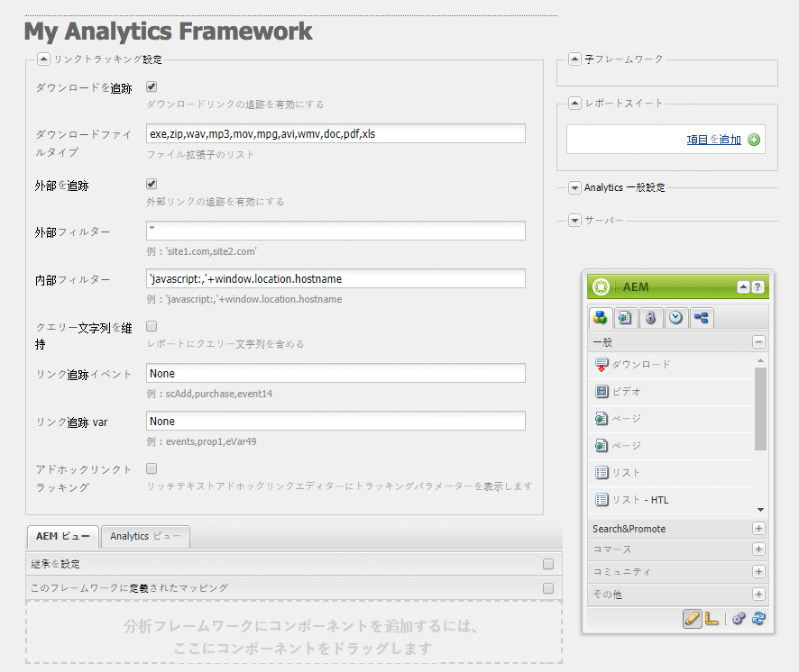
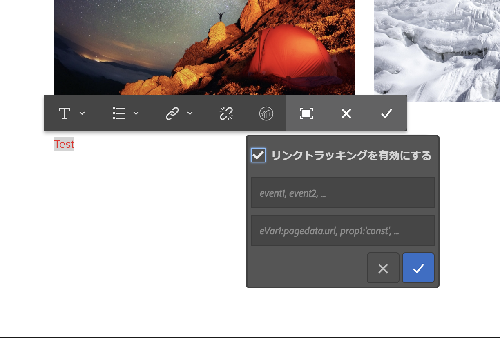

# Adobe Analytics のリンクトラッキングの設定{#configuring-link-tracking-for-adobe-analytics}

ユーザーが Web サイトのページ上のリンクをクリックすると、Adobe Analytics で関連情報を取得できます。例えば、リンクトラッキングを使用してユーザーのサイトでのやり取りを学習したり、ファイルのダウンロード数を追跡したり、離脱リンクを追跡したりします。

## Adobe Analytics フレームワークのリンクトラッキングの設定 {#configuring-link-tracking-for-an-adobe-analytics-framework}

1. **ナビゲーション**&#x200B;を使用して、**導入**／**クラウドサービス**／**Adobe Analytics** セクションに移動します。

1. **設定を表示**&#x200B;を使用して、必要な Adobe Analytics フレームワークを開きます。
1. 「**リンクトラッキング設定**」セクションを展開し、必要に応じて設定します（このページに詳細が記載されています）。

   

## ファイルのダウンロード数の追跡 {#tracking-file-downloads}

関連するページからダウンロードしたファイルがAdobe Analyticsでのダウンロードとして自動的に追跡されるように、Adobe Analyticsフレームワークを設定します。 ダウンロード数の追跡を有効にすると、指定したファイルタイプのみが追跡されます。

デフォルトでは、次のファイルタイプのダウンロードが追跡されます。

* exe
* zip
* wav
* mp3
* mov
* mpg
* avi
* wmv
* doc
* pdf
* xls

例えば、PDF ファイルのダウンロード追跡を有効にした場合、ユーザーが PDF ファイルへのリンクをクリックするたびに、PDF のダウンロードが追跡されます。

フレームワークのダウンロード追跡プロパティは、ページ用に生成された `analytics.sitecatalyst.js` ファイルにコードとして実装されています。次のコード例に、デフォルトのダウンロード追跡設定を示します。

```
s.trackDownloadLinks= true;
s.linkDownloadFileTypes= 'exe,zip,wav,mp3,mov,mpg,avi,wmv,doc,pdf,xls';
```

お使いのAdobe Analyticsフレームワークに対してダウンロードトラッキングを有効にするには：

1. [Adobe Analytics フレームワークを開き、「リンクトラッキング設定」セクションを展開](#configuring-link-tracking-for-an-adobe-analytics-framework)します。
1. 「**ダウンロードを追跡**」を有効にします。
1. 「**ダウンロードファイルタイプ**」ボックスで、追跡するファイルのタイプのファイル名拡張子を入力します。

## 外部リンクの追跡 {#tracking-external-links}

ページの外部リンク（離脱リンク）のクリックを追跡できます。

Adobe Analyticsフレームワークの外部リンクを追跡するには：

1. [Adobe Analytics フレームワークを開き、「**リンクトラッキング設定**」セクションを展開](#configuring-link-tracking-for-an-adobe-analytics-framework)します。
1. 要件に従って、次のプロパティを設定します。

外部リンクがクリックされた際の追跡用プロパティ：

* **外部を追跡** 外部リンクトラッキングを有効にします。

* **外部フィルター** （オプション）リンクターゲットの外部 URL に一致するフィルターを定義します。リンクターゲットがフィルターに一致する場合に、リンクが追跡されます。外部フィルターは、ページの外部リンクの一部のみを追跡するのに便利です。

   追跡する外部リンクを指定するには、リンクターゲットの URL のすべてまたは一部を入力します。複数のフィルターをコンマで区切ります。文字列リテラルを一重引用符で囲みます。No value (the default value of `''`, two single quotes) causes all external links to be tracked.

* **内部フィルター** 内部リンクの URL に一致するフィルターを定義します。リンクターゲットの URL がフィルターに一致する場合、リンクは追跡されません。デフォルト値は、現在のウィンドウアドレスの URL のホスト名を返す JavaScript コマンドです。

   追跡されない内部リンクを指定するには、リンクターゲットの内部 URL のすべてまたは一部を入力します。複数のフィルターをコンマで区切ります。文字列リテラルを一重引用符で囲みます。

   デフォルト値は です。`'javascript:,'+window.location.hostname`

* **クエリ文字列を維持** 内部および外部フィルターとの一致を評価する際に、URL パラメーターを含めます。

   外部および内部フィルターに対するリンクターゲット URL を評価する際に URL パラメーターを含めるには、このオプションを有効にします。

外部リンクトラッキングプロパティは、ページ用に生成された `analytics.sitecatalyst.js` ファイルにコードとして実装されています。次の設定で外部リンクトラッキングを有効にしたフレームワークに関連付けられたページ用に生成されるコード例を示します。

* External filter is `'google.com'`
* Internal filter is the default value of `'javascript:,'+window.location.hostname`
* フィルターに対するリンクターゲットを評価する際に、クエリー文字列は含まれない

```
s.trackExternalLinks= false;
s.linkExternalFilters= 'google.com';
s.linkInternalFilters= 'javascript:,'+window.location.hostname;
s.linkLeaveQueryString= false;
```

## リンククリック数を含む変数データの送信 {#sending-variable-data-with-link-clicks}

ユーザーがリンクをクリックしたときにイベントと変数のデータをAdobe Analyticsに送信するようにAEMを設定できます。 The **Link Tracking Configuration** properties enable you to specify the Adobe Analytics events and variables to track when link clicks occur.

フレームワークマッピングは、イベントおよび変数の値を決定します。Adobe Analytics変数は、リンクがクリックされたときに追跡するデータを保存するコンテンツコンポーネントの変数にマップできます。

リンククリック数を含む変数データを送信するには：

1. [Adobe Analytics フレームワークを開き、「リンクトラッキング設定」セクションを展開](#configuring-link-tracking-for-an-adobe-analytics-framework)します。
1. 要件に従って、次のプロパティを設定します。

リンククリック数を含む変数データを送信するためのプロパティ：

* **リンクトラックイベント**&#x200B;リンククリック数のカウントに使用するAdobe Analyticsイベント変数を入力します。

   複数の変数名をコンマで区切ります。

   The default value of `None` causes no event tracking.

* **リンクトラック変数**：リンクがクリックされたときにAdobe Analyticsに送信するAdobe Analytics変数を入力します。 複数の変数名をコンマで区切ります。

   The default value of `None` causes no variable data to be sent.

送信するイベントおよび変数を指定する場合、設定は、ページ用に生成された `analytics.sitecatalyst.js` ファイルにコードとして実装されています。次に、フレームワークが `event10` イベントおよび `prop4` プロパティを追跡する場合にページ用に生成されるコード例を示します。

```
s.linkTrackEvents= 'event10';
s.linkTrackVars= 'prop4';
```

## リンクトラッキング設定の例 {#example-link-tracking-configuration}

以下の手順を実行して、Adobe Analytics統合のリンクトラッキングの動作を調べます。 この手順は、[Adobe Marketing Cloud デバッガー](https://docs.adobe.com/content/help/en/debugger/using/experience-cloud-debugger.html)からの結果を表示します。

### 一般設定 {#general-configuration}

この例は、トラッキングとデバッガーのコンテキストにおいて、マッピングがどのように機能するかを示しています。

1. Web ページに関連付けられているフレームワークを開きます。
1. **ページ**&#x200B;コンポーネントをフレームワークのマッピング領域にドラッグします。**ページコンポーネントは、サイドキック内の** 一般コンポーネントグループに属します **** 。

   >[!NOTE]
   >
   >実際のシナリオで使用するコンポーネントは、継承元のコンポーネントによって異なります（あった場合）。
   >
   >そうでない場合は、独自のコンポーネントをそこで公開する必要があります（ページコンポーネントに analytics サブノードを定義）。

   左側パネルから Analytics（SiteCatalyst）変数をドラッグして、次の表に従ってマッピングを設定します。

<table>
 <tbody>
  <tr>
   <th>CQ 変数<br /> </th>
   <th>変数ブラウザーのエントリ<br /> </th>
   <th>Adobe Analytics変数</th>
  </tr>
  <tr>
   <td>pagedata.title</td>
   <td>カスタム eVar 1（eVar1）</td>
   <td>eVar1</td>
  </tr>
  <tr>
   <td>eventdata.events.pageView</td>
   <td>カスタム 1（event1）</td>
   <td>event1</td>
  </tr>
 </tbody>
</table>

1. 検索コンポーネントをフレームワークのマッピング領域にドラッグします。検索コンポーネントは、サイドキックの一般コンポーネントグループに属しています。左側パネルから Analytics（SiteCatalyst）変数をドラッグして、次の表に従ってマッピングを設定します。

<table>
 <tbody>
  <tr>
   <th>CQ 変数<br /> </th>
   <th>変数ブラウザーのエントリ</th>
   <th>Adobe Analytics変数</th>
  </tr>
  <tr>
   <td>eventdata.keyword</td>
   <td>カスタム eVar 2（eVar2）</td>
   <td>eVar2</td>
  </tr>
  <tr>
   <td>eventdata.results</td>
   <td>カスタム eVar 3（eVar3）</td>
   <td>eVar3</td>
  </tr>
  <tr>
   <td>eventdata.events.search</td>
   <td>カスタム 2（event2）</td>
   <td>event2</td>
  </tr>
 </tbody>
</table>

### 外部リンクトラッキングを設定します。 {#configure-external-link-tracking}

1. フレームワークで、「**リンクトラッキング設定**」領域を展開します。
1. 「**ダウンロードを追跡**」の設定を解除します。

1. 「**外部を追跡**」を選択します。
1. 「**クエリ文字列を維持**」の選択を解除します。
1. **外部フィルター**&#x200B;リストに次の値を使用して、外部 URL として特定します。

   `‘yahoo.com’`

1. Add the following value to the **Link Track Events** field:

   ```
       event1,event2
   ```

1. Add the following value to the **Link track vars** field:

   ```
       eVar1,eVar2
   ```

1. フレームワークに関連付けられたページに、**テキスト**&#x200B;コンポーネントを追加します。Inside the **Text** component, add a hyperlink pointing to the following address:

   `https://search.yahoo.com/?p=this`

1. **プレビューモード**&#x200B;に切り替えて、リンクをクリックします。

Adobe Marketing Cloud デバッガーで表示すると、呼び出しの実行は次のようになります。


>[!NOTE]
>
>The URL does not contain the Query string: `?p=this`

### URL パラメーターを含める {#include-the-url-parameter}

1. フレームワークで、「**リンクトラッキング設定**」領域を展開します。
1. 「**クエリ文字列を維持**」を有効にします。
1. ページプレビューをリロードし、リンクをクリックします。

Adobe Marketing Cloudデバッガに表示される呼び出しの詳細は、次の例のようになります。


>[!NOTE]
>
>This time the URL does contain the Query string: `?p=this`

## アドホックリンクトラッキング {#ad-hoc-link-tracking}

アドホックリンクトラッキングを使用すると、コンテンツ作成者は、コンポーネントのリンクトラッキングを設定できます。コンポーネントの設定がフレームワークの&#x200B;**リンクトラッキング設定**&#x200B;を上書きするので、フレームワークに関連付けられたページ上で、**テキスト**&#x200B;コンポーネントを URL のリンクトラッキング用に設定できます。

アドホックリンクトラッキングを使用すると、ダウンロードリンク、外部リンクを、イベントおよび変数データと共に追跡できます。

必要なアドホックリンクトラッキングを有効にするには：

* [**テキスト**&#x200B;コンポーネントを含むページをフレームワークに関連付けます](/help/sites-administering/adobeanalytics-connect.md#associating-a-page-with-a-adobe-analytics-framework)。
* [Adobe Analytics フレームワークを設定して、アドホックリンクトラッキングを有効にします](#enabling-ad-hoc-link-tracking)。
* [テキストコンポーネント用にリンクトラッキングを設定します](#configuring-link-tracking-for-a-text-component)。

### アドホックリンクトラッキングの有効化 {#enabling-ad-hoc-link-tracking}

アドホックリンクトラッキングを有効にするようにAdobe Analyticsフレームワークを設定します。

1. Adobe Analytics フレームワークを開き、「**リンクトラッキング設定**」セクションを展開します。

1. 「**アドホックリンクトラッキング**」を有効にします。

   >[!NOTE]
   >
   >すべてのユーザータイプがこのチェックボックスにアクセスできるわけではありません。アクセスが必要な場合は、サイト管理者に問い合わせてください。

>[!NOTE]
>
>The XSS Antisamy configuration is now in SLING under path **/libs/sling/xss.config.xml** and the following rules need to be added to for ad-hoc linking to work:

#### タグルール拡張機能のアンカー {#anchor-tag-rule-extension}

```xml
<attribute name="onclick">
    <literal-list>
        <literal value="CQ_Analytics.Sitecatalyst.customTrack(this)"/>
    </literal-list>
</attribute>
<attribute name="adhocenable">
    <literal-list>
        <literal value="true"/>
        <literal value="false"/>
    </literal-list>
</attribute>
<attribute name="adhocevents">
    <regexp-list>
        <regexp name="anything"/>
    </regexp-list>
</attribute>
<attribute name="adhocevars">
    <regexp-list>
        <regexp name="anything"/>
    </regexp-list>
</attribute>
```

### テキストコンポーネント用のリンクトラッキングの設定 {#configuring-link-tracking-for-a-text-component}

**テキスト**&#x200B;コンポーネント自体のアドホックリンクトラッキングを設定する前に、次の設定が既に実装されている必要があります。

* [Adobe Analytics フレームワークが、アドホックリンクトラッキングを有効にするように設定されている](#enabling-ad-hoc-link-tracking)。
* [**テキスト**&#x200B;コンポーネントを含むページがフレームワークに関連付けられている](/help/sites-administering/adobeanalytics-connect.md#associating-a-page-with-a-adobe-analytics-framework)。

次の手順を実行して、**テキスト**&#x200B;コンポーネントのリンクトラッキングを設定します。

1. ページを編集モードで開き、**テキスト**&#x200B;コンポーネントを編集します。

1. ハイパーテキストとして使用したいテキストを選択して、ハイパーリンクボタンをクリックします。

   

1. 「リンク先」ボックスにターゲット URL を追加して、リンクトラッキング領域を展開します。

   >[!NOTE]
   >
   >カスタムリンクトラッキングは、リンク／リンク解除アクション（Analytics アイコン）の横に別のアクションとして表示されます。
   >
   >RTE で有効なリンクを選択した場合にのみ有効になります。

   

1. Enable **Custom Link Tracking** to override the link tracking configuration of the Adobe Analytics framework and to enable link tracking for the current link.

1. (Optional) To track events with the link click, add Adobe Analytics event names in the **Include Adobe Analytics Variables** field. 複数のイベント名はコンマで区切ります（例：）。

   `event1, event22`.

1. (Optional) To track variable data with the link click, add Adobe Analytics variables in the **Include Adobe Analytics Variables** field. 次のいずれかの形式を使用します。

   * *`<Variable-name>`*: *`<Dynamic Value>`*
   * *`<Variable-name>`*: *`‘CONSTANT'`*

   次に、各形式の例を示します。

   * `eVar10:pagedata.title`
   * `prop1: ‘Aubergine'`

   複数の値をコンマで区切ります。

1. 「**OK**」を選択します。

