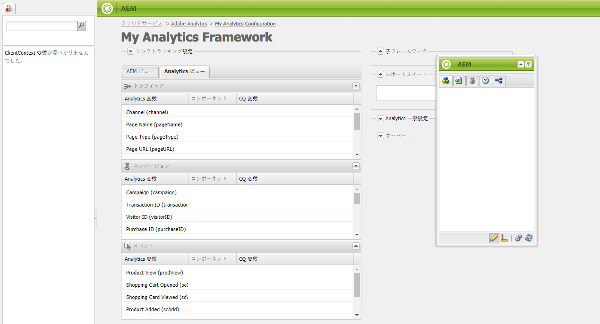
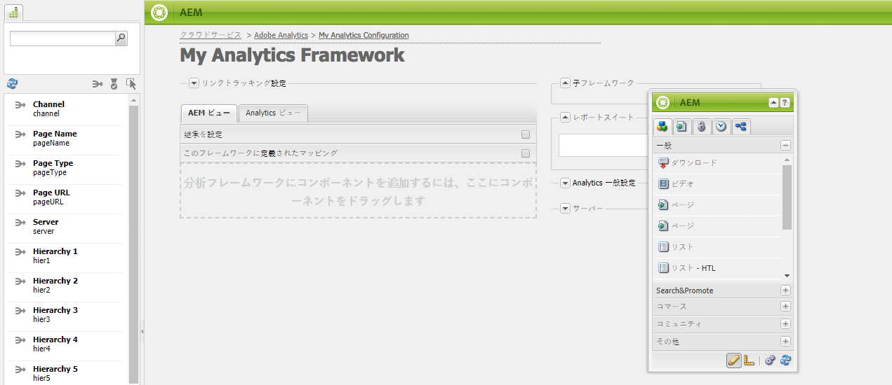
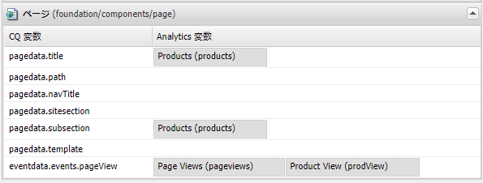
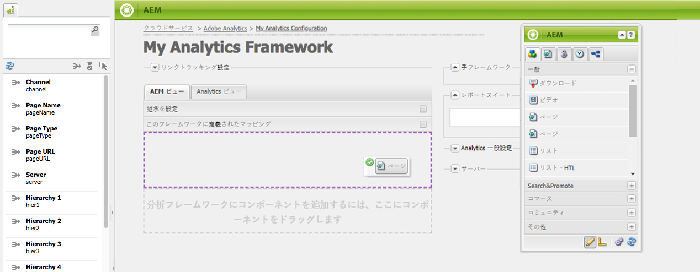
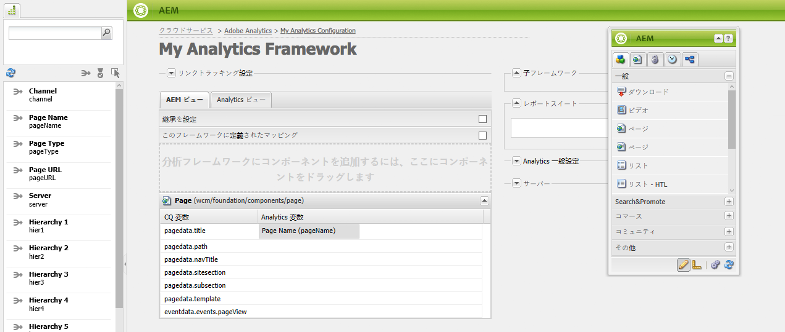
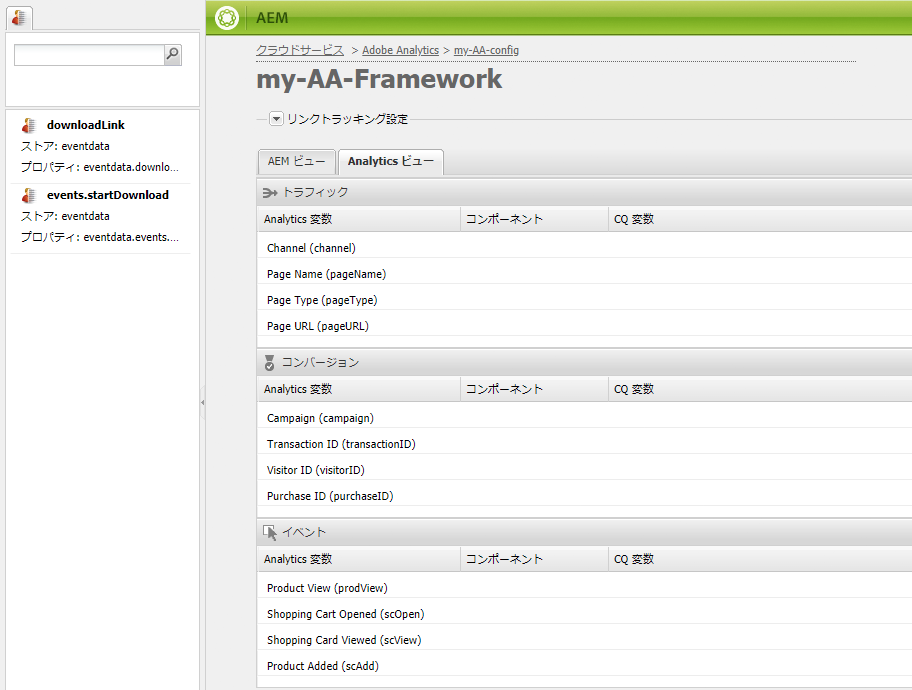
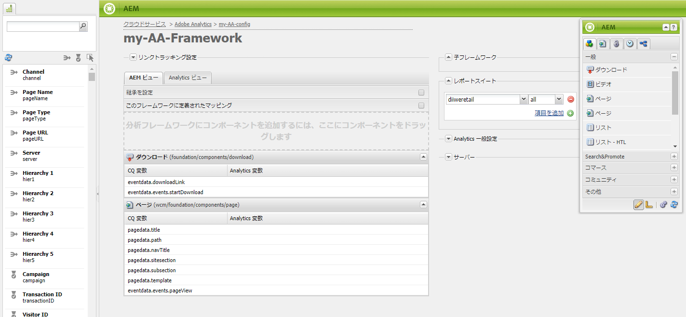
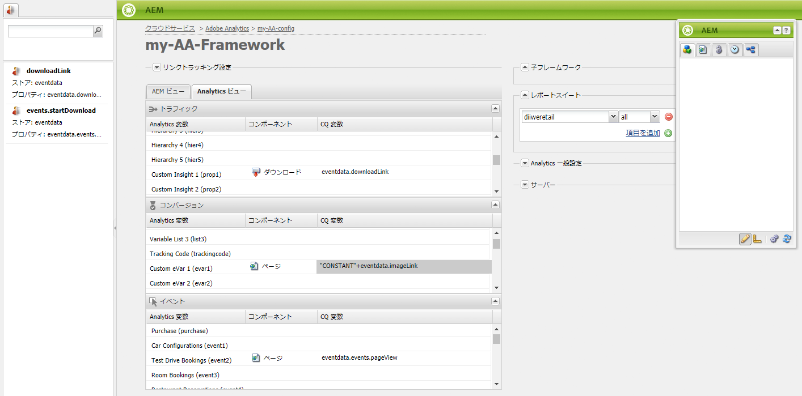

# コンポーネントデータと Adobe Analytics プロパティとのマッピング{#mapping-component-data-with-adobe-analytics-properties}

Adobe Analytics に送信するデータを収集するフレームワークにコンポーネントを追加します。分析データを収集するために設計されたコンポーネントは、適切な **CQ 変数**&#x200B;にデータを保存します。このようなコンポーネントをフレームワークに追加すると、フレームワークにCQ変数のリストが表示されるので、各変数を適切な&#x200B;**Analytics変数**&#x200B;に対応させることができます。

**AEM表示**&#x200B;が開くと、Analytics変数がコンテンツファインダーに表示されます。

同じ&#x200B;**CQ変数**&#x200B;を使用して、複数のAnalytics変数をマッピングできます。

ページが読み込まれ、次の条件が満たされると、マップされたデータがAdobe Analyticsに送信されます。

* ページがフレームワークに関連付けられている。
* ページが、フレームワークに追加されたコンポーネントを使用する。

CQコンポーネント変数をAdobe Analyticsレポートプロパティにマッピングするには、次の手順を実行します。

1. **AEM表示**&#x200B;で、サイドキックからフレームワークにトラッキングコンポーネントをドラッグします。 例えば、**ページ**&#x200B;コンポーネントを&#x200B;**一般**&#x200B;カテゴリからドラッグします。

   

   デフォルトのコンポーネントグループには、「**一般**」、「**コマース**」、「**コミュニティ**」、「**Search&amp;Promote**」および「**その他**」があります。AEM インスタンスは、異なるグループおよびコンポーネントを表示するように設定されていることがあります。

1. コンポーネントで定義された変数を使用してAdobe Analytics変数をマッピングするには、**Analytics変数**&#x200B;をコンテンツファインダーからトラッキングコンポーネントのフィールドにドラッグします。 例えば、`Page Name (pageName)`を`pagedata.title`にドラッグします。

   

   >[!NOTE]
   >
   >フレームワーク用に選択されたレポートスイートID(RSID)によって、コンテンツファインダーに表示されるAdobe Analytics変数が決まります。

1. 他のコンポーネントおよび変数について、前述の 2 つの手順を繰り返します。

   >[!NOTE]
   >
   >複数のAnalytics変数(同じCQ変数(例：`pagedata.title`)`eVars``events``props`

   >[!CAUTION]
   >
   >次の状態が強く推奨されます。
   >    
   >    * `eVars` の値 `props` は、CQ変数にマッピングされ `pagedata.X` ます。  `eventdata.X`
      >    
      >    
   * それに対して、イベントは`eventdata.events.X` で始まる変数にマッピングされる必要があること

1. サイトの発行インスタンスでフレームワークを使用できるようにするには、サイドキックの「**ページ**」タブを開き、「**フレームワークをアクティブ化**」をクリックします。

## 製品関連変数のマッピング {#mapping-product-related-variables}

AEMでは、製品関連の変数およびAdobe Analytics製品関連のプロパティにマップするイベントに命名規則を使用します。

| CQ 変数 | Analytics 変数 | 説明 |
|---|---|---|
| `product.category` | `product.category` （コンバージョン変数） | 製品カテゴリです。 |
| `product.sku` | `product.sku` （コンバージョン変数） | 製品 SKU です。 |
| `product.quantity` | `product.quantity` （コンバージョン変数） | 購入される製品の数です。 |
| `product.price` | `product.price` （コンバージョン変数） | 製品価格です。 |
| `product.events.<eventName>` | レポートで製品に関連付けるための成功イベントです。 | `product.events` は、*eventName* という名前のイベントのプレフィックスです。 |
| `product.evars.<eVarName>` | 製品に関連付けるためのコンバージョン変数（`eVar`）です。 | `product.evars` は、*eVarName* という名前の eVar 変数のプレフィックスです。 |

いくつかの AEM Commerce コンポーネントは、これらの変数名を使用します。

>[!NOTE]
>
>Adobe Analytics製品プロパティをCQ変数にマップしないでください。 この表で説明している製品関連マッピングの設定は、Products 変数へのマッピングと実質的に同じです。

### Adobe Analytics のレポートのチェック {#checking-reports-on-adobe-analytics}

1. AEMに提供されたのと同じ資格情報を使用して、Adobe AnalyticsのWebサイトにログインします。
1. 選択した RSID が、前の手順で使用したものであることを確認します。
1. （ページの左側の）**レポート**&#x200B;で、**カスタムコンバージョン**／**カスタムコンバージョン 1～10** を選択して、`eVar7` に対応する変数を選択します。

1. 使用しているAdobe Analyticsのバージョンに応じて、レポートが使用した検索語句で更新されるまで、平均45分待つ必要があります。例：茄子

## Adobe Analytics フレームワークでの Content Finder（cf#）の使用 {#using-the-content-finder-cf-with-adobe-analytics-frameworks}

最初は、Adobe Analyticsのフレームワークを開くと、コンテンツファインダーに事前定義されたAnalytics変数が含まれます。これは次の場所です。

* トラフィック
* コンバージョン
* イベント

RSID が選択されている場合、その RSID に属するすべての変数がリストに追加されます。\
Analytics変数を様々なトラッキングコンポーネントに存在するCQ変数にマップするには、`cf#`が必要です。 基本トラッキングのためのフレームワークのセットアップを参照してください。

フレームワーク用に選択した表示に応じて、コンテンツファインダーは、Analytics変数(AEM表示内)またはCQ変数(Analytics表示内)によって入力されます。

リストは、次の方法で操作できます。

1. **AEM ビュー**&#x200B;では、リストは、3 つのフィルターボタンを使用してどの変数の型が選択されているかに応じて、フィルターできます。

   * どのボタンも選択されて&#x200B;*いない*&#x200B;場合、完全なリストが表示されます。
   * 「**トラフィック**」ボタンが選択されている場合、リストには「トラフィック」セクションに属する変数のみが表示されます。
   * 「**コンバージョン**」ボタンが選択されている場合、リストには「コンバージョン」セクションに属する変数のみが表示されます。
   * 「**イベント**」ボタンが選択されている場合、リストには、「イベント」セクションに属する変数のみが表示されます。

   >[!NOTE]
   >
   >一度に 1 つのフィルターのみアクティブにできます。

   >[!NOTE]
   >
   >Search&amp;Promote変数は、「コンバージョン」セクションにも属します。

   1. また、リストには検索機能があり、検索フィールドに入力されたテキストに従って要素をフィルタリングします。
   1. リストの要素の検索中にフィルターオプションを有効にした場合、表示される結果も、アクティブなボタンに従ってフィルタリングされます。
   1. リストは、渦巻き矢印ボタンを使用して、いつでもリロードできます。
   1. 複数の RSID がフレームワークで選択されている場合、リストのすべての変数は、選択した RSID 内で使用されたすべてのラベルを使用して表示されます。

1. Adobe Analytics表示では、コンテンツファインダーにCQ表示内にドラッグされたトラッキングコンポーネントに属するすべてのCQ変数が表示されます。

   * 例えば、**ダウンロードコンポーネント**&#x200B;がCQ表示内でドラッグされた1つ&#x200B;*のみ*&#x200B;である場合(マッピング可能な変数&#x200B;*eventdata.downloadLink*&#x200B;と&#x200B;*eventdata.イベント.startDownload*&#x200B;の2つ)、コンテンツファインダーは次のようになりますAdobe Analytics表示に切り替え：

   

   * 変数は、3つの変数セクション(**トラフィック**、**コンバージョン**、**イベント**)のいずれかに属する任意のAdobe Analytics変数にドラッグ&amp;ドロップできます。

   * 新しいトラッキングコンポーネントをCQ表示のフレームワークにドラッグすると、そのコンポーネントに属するCQ変数が自動的にAdobe Analytics表示のコンテンツファインダー(cf#)に追加されます。
   >[!NOTE]
   >
   >一度に1つのCQ変数のみをAdobe Analytics変数にマップできます

## AEM ビューと Analytics ビューの使用 {#using-aem-view-and-analytics-view}

いつでも、フレームワークページ上でのAdobe Analyticsのマッピングを表示する2つの方法を切り替えることができます。 2 つのビューは、2 つの異なる見方からのフレームワーク内のマッピングの概要をわかりやすく提供します。

### AEM ビュー {#aem-view}

上記の図を例に挙げると、**AEM ビュー**&#x200B;には次のプロパティがあります。

1. これはフレームワークが開いたときのデフォルトの表示です。
1. 左側：コンテンツファインダー(cf#)は、選択されたRSIDに基づいて、Adobe Analytics変数によって入力されます。
1. タブヘッダー（**AEM ビュー**&#x200B;と **Analytics ビュー**）：2 つのビューを切り替えるのに使用します。

1. **AEM ビュー**:

   1. フレームワークにその親から継承されるコンポーネントがある場合、コンポーネントにマッピングされた変数と共に、ここにリストが表示されます。

      1. 継承されたコンポーネントはロックされています。
      1. 継承されたコンポーネントのロックを解除するには、コンポーネントの名前の横にある鍵アイコンをダブルクリックします。
      1. 継承を元に戻すには、ロックされていないコンポーネントを削除する必要があります。その後、コンポーネントはロックされた状態に戻されます。
   1. **分析フレームワークにコンポーネントを追加するには、ここにコンポーネントをドラッグします**：コンポーネントはサイドキックからドラッグアンドドロップすることができます。
   1. 現在分析フレームワークに含まれるすべてのコンポーネントを検索できます。

      1. コンポーネントを追加するには、サイドキックの「コンポーネント」タブからドラッグします。
      1. コンポーネントとそのすべてのマッピングを削除するには、コンポーネントのコンテキストメニューから「削除」を選択し、確認ダイアログで削除を受け入れます。
      1. コンポーネントは、作成したフレームワークからのみ削除でき、従来のように子フレームワークからは削除できません（上書きのみ可能です）。

### Analytics ビュー {#analytics-view}

1. この表示にアクセスするには、フレームワークの&#x200B;**Analytics表示**&#x200B;タブに切り替えます。
1. 左側：コンテンツファインダー（cf#）は、CQ ビューのフレームワークにドラッグしたコンポーネントに基づく CQ 変数によって入力されます。
1. タブヘッダー（**AEM ビュー**&#x200B;と **Analytics ビュー**）：2 つのビューを切り替えるのに使用します。

1. 3つのテーブル(トラフィック、コンバージョン、イベント)リストは、すべてのAdobe Analytics変数で使用できます。 一覧表示されています。ここに示されるマッピングは、AEM ビューのものと同じです。

   * **トラフィック**：

      * CQ変数(`prop1`)にマッピングされるトラフィック変数(`eventdata.downloadLink`)

      * コンポーネントの隣に鍵アイコンがある場合、これは、親フレームワークからの継承であり、そのため編集できないことを意味します。
   * **コンバージョン**:

      * コンバージョン変数(`eVar1`)がCQ変数(`pagedata.title`)にマッピングされる

      * CQ 変数フィールドをダブルクリックしてコードを手動で入力することにより、JavaScript 式にマッピングされたコンバージョン変数（`eVar3`）をインラインで追加しました。
   * **イベント**:

      * イベント変数(`event1`)がCQイベント(`eventdata.events.pageView`)にマップされている

>[!NOTE]
>
>すべての表の CQ 変数列は、フィールドをダブルクリックしてテキストを追加することで、インラインで入力することもできます。これらのフィールドは、JavaScript を入力として受け取ります。
>
>* 例えば、&lt;a0/の隣にある`prop3`
>* `'`* `Adobe:'+pagedata.title+':'+pagedata.sitesection`\
   >  *:*（コロン）を使用し、*Adobe*&#x200B;を`prop3`としてプレフィックス付きで、*サイトセクション*&#x200B;と連結されたページの&#x200B;*タイトル*&#x200B;を送信するには

>

>[!CAUTION]
>
>Adobe Analytics変数にマップできるCQ変数は、いつでも1つだけです。

