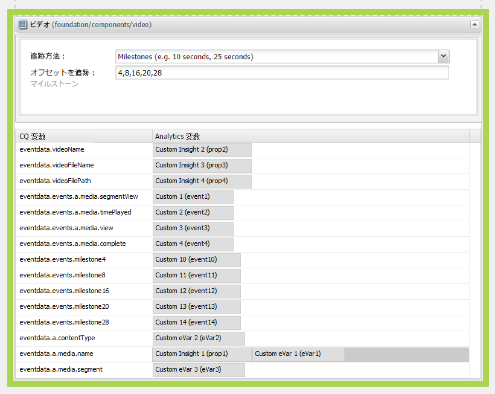
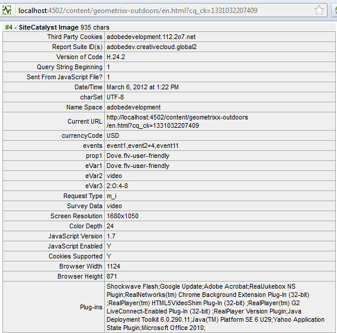
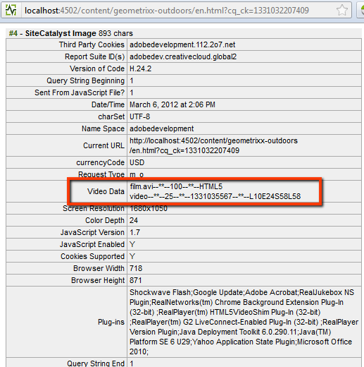

# Adobe Analytics のビデオトラッキングの設定{#configuring-video-tracking-for-adobe-analytics}

ビデオイベントの追跡には、いくつかの方式を使用できます。そのうち 2 つは古いバージョンの Adobe Analytics 用のレガシーオプションで、レガシーマイルストーンとレガシー秒と呼ばれます。

>[!NOTE]
>
>次に進む前に、AEM に&#x200B;**再生可能なビデオ**&#x200B;がアップロードされていることを確認してください。
>
>ページ上でビデオを再生できるようにするには、AEM でビデオファイルをトランスコードする方法について、**[こちらのチュートリアル](/help/sites-authoring/default-components-foundation.md#video)**&#x200B;を参照してください。

各方式を使用してビデオトラッキングのフレームワークを設定するには、以下の手順を実行します。

>[!NOTE]
>
>新規実装の場合は、ビデオトラッキングにレガシーオプションを&#x200B;**使用しない**&#x200B;ことを推奨します。代わりに&#x200B;**マイルストーン**&#x200B;方式を使用してください。

## 共通の手順 {#common-steps}

1. サイドキックから&#x200B;**ビデオコンポーネント**&#x200B;をドラッグし、再生可能なビデオをそのコンポーネントの&#x200B;**アセットとして**&#x200B;追加することによって、Web ページを設定します。

1. [Adobe Analytics 設定およびフレームワークを作成](/help/sites-administering/adobeanalytics.md)します。

   * 以降の節の例では、設定には **my-sc-configuration**、フレームワークには **videofw** という名前を使用します。

1. フレームワークページで RSID を選択し、「使用状況」を「すべて」に設定します。（[https://localhost:4502/cf#/etc/cloudservices/sitecatalyst/videoconf/videofw.html](https://localhost:4502/cf#/etc/cloudservices/sitecatalyst/videoconf/videofw.html)）
1. サイドキックの「一般」コンポーネントカテゴリから、ビデオコンポーネントをフレームワークにドラッグします。
1. トラッキング方式を選択します。

   * [マイルストーン](/help/sites-administering/adobeanalytics.md)
   * [非レガシーマイルストーン](/help/sites-administering/adobeanalytics.md)
   * [レガシーマイルストーン](/help/sites-administering/adobeanalytics.md)
   * [レガシー秒](/help/sites-administering/adobeanalytics.md)

1. トラッキング方式を選択すると、それに従って CQ 変数のリストが変更されます。コンポーネントの詳細設定方法および CQ 変数と Adobe Analytics プロパティのマッピング方法については、以降の節を参照してください。

## マイルストーン {#milestones}

マイルストーン方式では、ビデオに関する大部分の情報を追跡します。高度なカスタマイズが可能で、設定が容易です。

マイルストーン方式を使用するには、時間ベースの追跡オフセットを指定して、マイルストーンを定義します。ビデオの再生がマイルストーンを通過すると、そのイベントを追跡するためにページが Adobe Analytics を呼び出します。定義したマイルストーンごとに、Adobe Analytics プロパティにマッピングできる CQ 変数が作成されます。これらの CQ 変数の名前には、次の形式を使用します。

```shell
eventdata.events.milestoneXX
```

XX というサフィックスは、マイルストーンを定義する追跡オフセットです。例えば、4、8、16、20 および 28 秒の追跡オフセットを指定すると、以下の CQ 変数が生成されます。

* `eventdata.events.milestone4`
* `eventdata.events.milestone8`
* `eventdata.events.milestone16`
* `eventdata.events.milestone20`
* `eventdata.events.milestone28`

次の表に、マイルストーン方式用に提供されているデフォルトの CQ 変数を示します。

<table>
 <tbody>
  <tr>
   <th>CQ 変数</th>
   <th>Adobe Analytics プロパティ</th>
  </tr>
  <tr>
   <td>eventdata.videoName </td>
   <td>DAM で設定されている場合、このプロパティにマッピングされる変数にはビデオの<strong>わかりやすい</strong>名前（<strong>タイトル</strong>）が格納されます。設定されていない場合は、代わりにビデオの<strong>ファイル名</strong>が送信されます。ビデオの再生開始時に一度だけ送信されます。</td>
  </tr>
  <tr>
   <td>eventdata.videoFileName </td>
   <td>このプロパティにマッピングされる変数には、ファイルの名前が格納されます。eventdata.events.a.media.view と一緒にのみ送信されます。 </td>
  </tr>
  <tr>
   <td>eventdata.videoFilePath </td>
   <td>このプロパティにマッピングされる変数には、ファイルのサーバー上のパスが格納されます。eventdata.events.a.media.view と一緒にのみ送信されます。 </td>
  </tr>
  <tr>
   <td>eventdata.events.a.media.segmentView </td>
   <td>セグメントマイルストーンを通過するたびに送信されます。 </td>
  </tr>
  <tr>
   <td>eventdata.events.a.media.timePlayed</td>
   <td>マイルストーンがトリガーされるたびに送信されます。ユーザーが特定のセグメントの視聴に費やした秒数も、このイベントと一緒に送信されます（例：eventX=21）。<br /> </td>
  </tr>
  <tr>
   <td>eventdata.events.a.media.view </td>
   <td>ビデオビューの初期化時に送信されます。</td>
  </tr>
  <tr>
   <td>eventdata.events.a.media.complete </td>
   <td>ビデオの再生終了時に送信されます。<br /> </td>
  </tr>
  <tr>
   <td>eventdata.events.milestoneX </td>
   <td>指定のマイルストーンを通過したときに送信されます。X はマイルストーンが <br /> でトリガーされる秒を表します。 </td>
  </tr>
  <tr>
   <td>eventdata.a.contentType </td>
   <td>マイルストーンごとに送信されます。Adobe Analytics 呼び出しでは pev3 として表示され、通常は「video」として送信されます。<br /> </td>
  </tr>
  <tr>
   <td>eventdata.a.media.name </td>
   <td>eventdata.videoName とまったく同じです。 </td>
  </tr>
  <tr>
   <td>eventdata.a.media.segment </td>
   <td>表示されているセグメントに関する情報（例：2:O:4-8）を格納します。 </td>
  </tr>
 </tbody>
</table>

>[!NOTE]
>
>編集するビデオを DAM で開き、「**タイトル**」メタデータフィールドを目的の名前に設定することにより、ビデオの&#x200B;**わかりやすい**&#x200B;名前を設定できます。

1. 「オフセットを追跡」ボックスで、トラッキング方式としてマイルストーンを選択してから、秒単位の追跡オフセットのコンマ区切りリストを入力します。例えば、次の値はビデオの開始から 4、8、16、20 および 28 秒後にマイルストーンを定義します。

   ```xml
   4,8,16,20,24
   ```

   オフセット値は、0 より大きい整数でなければなりません。デフォルト値は `10,25,50,75` です。

1. CQ 変数を Adobe Analytics プロパティにマッピングするには、CQ 変数の横のコンテンツファインダーから Adobe Analytics プロパティをコンポーネント上にドラッグします。

   マッピングの最適化については、[Adobe Analytics でのビデオの測定](https://docs.adobe.com/content/help/ja/media-analytics/using/media-overview.html)ガイドを参照してください。

1. ページに [フレームワークを追加](/help/sites-administering/adobeanalytics.md)します。
1. 設定を&#x200B;**プレビューモード**&#x200B;でテストするには、ビデオを再生して Adobe Analytics 呼び出しをトリガーします。

Adobe Analytics のデータ追跡例では、4、8、16、20 および 24 の追跡オフセットを使用したマイルストーントラッキングと、CQ 変数に対する以下のマッピングが適用されます。

<table>
 <tbody>
  <tr>
   <th>CQ 変数</th>
   <th>Adobe Analytics プロパティ</th>
  </tr>
  <tr>
   <td>eventdata.videoName </td>
   <td>prop2</td>
  </tr>
  <tr>
   <td>eventdata.videoFileName </td>
   <td>prop3 </td>
  </tr>
  <tr>
   <td>eventdata.videoFilePath </td>
   <td>prop4</td>
  </tr>
  <tr>
   <td>eventdata.events.a.media.segmentView </td>
   <td>event1</td>
  </tr>
  <tr>
   <td>eventdata.events.a.media.timePlayed</td>
   <td>event2<br /> </td>
  </tr>
  <tr>
   <td>eventdata.events.a.media.view </td>
   <td>event3</td>
  </tr>
  <tr>
   <td>eventdata.events.a.media.complete </td>
   <td>event4<br /> </td>
  </tr>
  <tr>
   <td>eventdata.events.milestone4</td>
   <td>event10</td>
  </tr>
  <tr>
   <td>eventdata.events.milestone8</td>
   <td>event11</td>
  </tr>
  <tr>
   <td>eventdata.events.milestone16</td>
   <td>event12</td>
  </tr>
  <tr>
   <td>eventdata.events.milestone20</td>
   <td>event13</td>
  </tr>
  <tr>
   <td>eventdata.events.milestone24</td>
   <td>event14</td>
  </tr>
  <tr>
   <td>eventdata.a.contentType </td>
   <td>eVar3</td>
  </tr>
  <tr>
   <td>eventdata.a.media.name </td>
   <td>eVar1, prop1 </td>
  </tr>
  <tr>
   <td>eventdata.a.media.segment </td>
   <td>eVar2</td>
  </tr>
 </tbody>
</table>

この例では、ビデオコンポーネントはフレームワークページに次のように表示されます。



>[!NOTE]
>
>Adobe Analytics への呼び出しを確認するには、DigitalPulse Debugger や Fiddler など適切なツールを使用します。

この例を使用した Adobe Analytics への呼び出しは、DigitalPulse Debugger では次のように表示されます。


*これは Adobe Analytics への&#x200B;**最初の呼び出し**であり、次の値が含まれています。*

* *eventdata.a.media.name に対する prop1 と eVar1*
* *prop2～4、および contentType（video）と segment（1:O:1-4）を格納している eVar2 と eVar3*
* *eventdata.events.a.media.view にマッピングされた event3*



*これは Adobe Analytics への&#x200B;**3 回目の呼び出**しです。*

* *prop1 と eVar1 には a.media.name が格納されている*
* *セグメントが表示されたことによって event1 が送信された*
* *再生時間 = 4 で event2 が送信された*
* *eventdata.events.milestone8 に到達したことによって event11 送信された*
* *（eventdata.events.a.media.view がトリガーされなかったので）prop2～4 は送信されない*

## 非レガシーマイルストーン {#non-legacy-milestones}

非レガシーマイルストーン方式は、マイルストーン方式によく似ていますが、マイルストーンを計測の長さの割合に基づいて定義する点が異なります。次の点は共通です。

* ビデオの再生がマイルストーンを通過すると、そのイベントを追跡するためにページが Adobe Analytics を呼び出します。
* Adobe Analytics プロパティとのマッピング用に定義される [CQ 変数の静的セット](#cqvars)。
* 定義したマイルストーンごとに、コンポーネントが Adobe Analytics プロパティにマッピングできる CQ 変数を作成します。

これらの CQ 変数の名前には、次の形式を使用します。

XX というサフィックスは、マイルストーンを定義する計測の長さの割合です。例えば、10、25、50 および 75 という割合を指定すると、以下の CQ 変数が生成されます。

* `eventdata.events.milestone10`
* `eventdata.events.milestone25`
* `eventdata.events.milestone50`
* `eventdata.events.milestone75`

```shell
eventdata.events.milestoneXX
```

1. 「オフセットを追跡」ボックスで、トラッキング方式として非レガシーマイルストーンを選択してから、計測の長さの割合のコンマ区切りリストを入力します。例えば、次のデフォルト値は計測の長さの 10、25、50 および 75% でマイルストーンを定義します。

   ```xml
   10,25,50,75
   ```

   オフセット値は、0 より大きい整数でなければなりません。

1. CQ 変数を Adobe Analytics プロパティにマッピングするには、CQ 変数の横のコンテンツファインダーから Adobe Analytics プロパティをコンポーネント上にドラッグします。

   マッピングの最適化については、[Adobe Analytics でのビデオの測定](https://docs.adobe.com/content/help/en/media-analytics/using/media-overview.html)ガイドを参照してください。

1. ページに [フレームワークを追加](/help/sites-administering/adobeanalytics.md)します。
1. 設定を&#x200B;**プレビューモード**&#x200B;でテストするには、ビデオを再生して Adobe Analytics 呼び出しをトリガーします。

## レガシーマイルストーン {#legacy-milestones}

この方式は、マイルストーン方式によく似ていますが、「追跡オフセット」フィールドに指定するマイルストーンが、ビデオ内の設定ポイントではなく割合であるという点が異なります&#x200B;*。*

>[!NOTE]
>
>「追跡オフセット」フィールドには、1～100 の整数を含むコンマ区切りリストのみを指定できます。

1. 追跡オフセットを設定します。

   * 例：10,50,75,100

   また、Adobe Analytics に送信される情報は、大きくはカスタマイズできません。マッピングに使用できる変数は次の 3 つだけです。

<table>
 <tbody>
  <tr>
   <td>eventdata.videoName <br /> </td>
   <td>DAM で設定されている場合、このプロパティにマッピングされる変数にはビデオの<strong>わかりやすい </strong>名前（<strong>タイトル</strong>）が格納されます。設定されていない場合は、代わりにビデオの<strong>ファイル名</strong>が送信されます。ビデオの再生開始時に一度だけ送信されます。<br /> </td>
  </tr>
  <tr>
   <td>eventdata.videoFileName </td>
   <td>このプロパティにマッピングされる変数には、ファイルの名前が格納されます。ビデオの再生開始時に一度だけ送信されます。</td>
  </tr>
  <tr>
   <td>eventdata.videoFilePath </td>
   <td>このプロパティにマッピングされる変数には、ファイルのサーバー上のパスが格納されます。ビデオの再生開始時に一度だけ送信されます。</td>
  </tr>
 </tbody>
</table>

>[!NOTE]
>
>編集するビデオを DAM で開き、「**タイトル**」メタデータフィールドを目的の名前に設定することにより、ビデオに&#x200B;**わかりやすい**&#x200B;名前を設定できます。また、終了したら、変更内容を保存する必要があります。

1. これらの変数を prop1～3 にマッピングします。

   呼び出しの中の&#x200B;**その他の関連情報**&#x200B;は、**pev3**&#x200B;という&#x200B;**ひとつ**&#x200B;の変数に連結されて送信されます。

   この例を使用した Adobe Analytics への&#x200B;**呼び出しサンプル**&#x200B;は、DigitalPulse Debugger では次のように表示されます。

   

   *この呼び出しで送信される&#x200B;**pev3**変数には、以下の情報が格納されます。*

   * *Name* - ビデオファイルの名前（例：*film.avi*）

   * *Length* - 秒単位でのビデオファイルの長さ（例：*100*）

   * *Player Name* - ビデオファイルの再生に使用されるビデオプレーヤー（例：*HTML5 video*）

   * *Total Seconds Played* - ビデオが再生された合計秒数（例：*25*）

   * *Start Timestamp* - ビデオの再生がいつ開始されたかを識別するタイムスタンプ（例：*1331035567*）

   * *Play Session* - 再生セッションの詳細。このフィールドは、ユーザーによるビデオの操作を示します。ビデオの再生を開始した場所、ビデオを進めるためにビデオスライダーを使用したかどうか、ビデオの再生を停止した場所などのデータを含めることができます（例：*L10E24S58L58 - ビデオはセクション L10 の 25 秒で停止され、48 秒までスキップされました*）。

## レガシー秒 {#legacy-seconds}

「レガシー秒」方式を使用すると、N 秒ごとに Adobe Analytics 呼び出しがトリガーされます。N は「追跡オフセット」フィールドで指定します。

1. 追跡オフセットを任意の秒数に設定します。

   * 例：6
   >[!NOTE]
   >
   >「追跡オフセット」フィールドに指定できるのは、0 より大きい整数だけです。

   Adobe Analytics に送信される情報のカスタマイズには、制限があります。マッピングに使用できる変数は次の 3 つだけです。

<table>
 <tbody>
  <tr>
   <td>eventdata.videoName <br /> </td>
   <td>DAM で設定されている場合、このプロパティにマッピングされる変数にはビデオの<strong>わかりやすい </strong>名前（<strong>タイトル</strong>）が格納されます。設定されていない場合は、代わりにビデオの<strong>ファイル名</strong>が送信されます。ビデオの再生開始時に一度だけ送信されます。<br /> </td>
  </tr>
  <tr>
   <td>eventdata.videoFileName </td>
   <td>このプロパティにマッピングされる変数には、ファイルの名前が格納されます。ビデオの再生開始時に一度だけ送信されます。</td>
  </tr>
  <tr>
   <td>eventdata.videoFilePath </td>
   <td>このプロパティにマッピングされる変数には、ファイルのサーバー上のパスが格納されます。ビデオの再生開始時に一度だけ送信されます。</td>
  </tr>
 </tbody>
</table>

>[!NOTE]
>
>編集するビデオを DAM で開き、「**タイトル**」メタデータフィールドを目的の名前に設定することにより、ビデオに&#x200B;**わかりやすい**&#x200B;名前を設定できます。また、終了したら、変更内容を保存する必要があります。

1. これらの変数を prop1、prop2 および prop3 にマッピングします。

   呼び出しの中の&#x200B;**その他の関連情報**&#x200B;は、**pev3** という&#x200B;**ひとつ**&#x200B;の変数に連結されて送信されます。

   この例を使用した Adobe Analytics への呼び出しは、DigitalPulse Debugger では次のように表示されます。

   

   *この呼び出しは、前述のレガシーマイルストーン呼び出しと同じです。**[こちら](/help/sites-administering/adobeanalytics.md)**の pev3 に関する情報を参照してください。*

**このチュートリアルで使用しているリファレンス：**

[0] [https://docs.adobe.com/content/help/en/media-analytics/using/media-overview.html](https://docs.adobe.com/content/help/en/media-analytics/using/media-overview.html)
