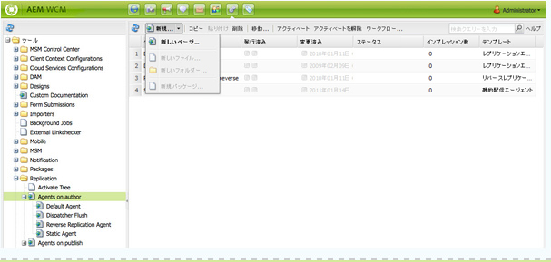
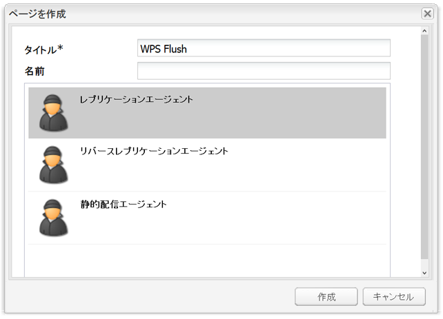
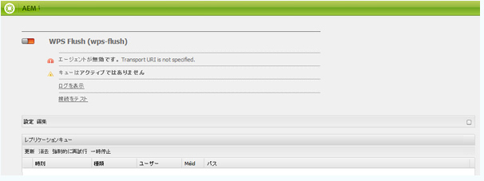
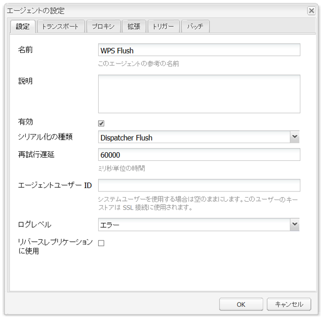
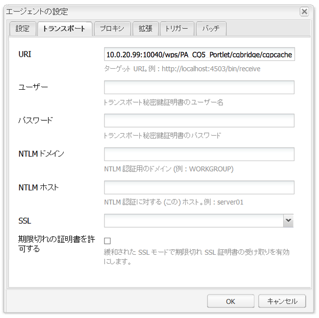
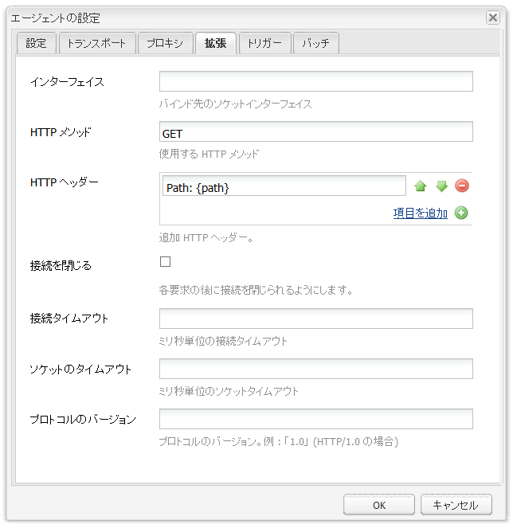
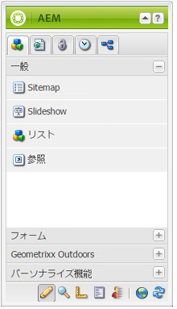

# AEM ポータルとポートレット{#aem-portals-and-portlets}

このドキュメントは次の内容について説明します。

* AEM ポータルのアーキテクチャ
* AEM のポータルとしての管理と設定
* AEM のポータルとしての使用
* ポートレット（Web サーバーなど）内の AEM コンテンツのインストール、設定、表示

## AEM ポータルのアーキテクチャ {#aem-portal-architecture}

AEM ポータルのアーキテクチャには、ポータルおよびポートレットの定義が含まれます。

### What is a portal? {#what-is-a-portal}

ポータルとは、パーソナライゼーション、シングルサインオン、様々なソースからのコンテンツ統合の機能を備え、情報システムのプレゼンテーションレイヤーをホストする Web アプリケーションです。

JSR 286準拠のポートレットはAEMで実行できます。 ポートレットコンポーネントによって、ページにポートレットを埋め込むことができます。[AEM コンテンツポートレットの管理](#administeringthecqcontentportlet)を参照してください。

### What is a portlet? {#what-is-a-portlet}

ポートレットとは、動的コンテンツを生成するコンテナ内部にデプロイされる Web コンポーネントです。ポートレットインターフェイスは .war ファイルとしてパッケージ化され、ポートレットコンテナ内にデプロイされます。AEM をポータルとして実行している場合、ポートレットを実行するには、そのポートレットの .war ファイルが必要になります。

ポータルに表示するように AEM コンテンツを設定するには、[ポートレットでの AEM のインストール、設定および使用](#installingconfiguringandusingcqinaportlet)を参照してください。

### AEM Portal Director {#aem-portal-director}

>[!CAUTION]
>
>AEM Portal Director は、AEM 6.4 以降では使用されなくなりました。[廃止される機能および削除された機能](https://helpx.adobe.com/jp/experience-manager/6-4/release-notes/deprecated-removed-features.html)を参照してください。

## AEM コンテンツポートレットの管理 {#administering-the-aem-content-portlet}

AEM コンテンツポートレットでは、ポータル内に AEM コンテンツを表示できます。The portlet is available at `/crx-quickstart/opt/portal`, and can be customized in various ways. 例えば、必要な AEM の認証情報を生成する独自の認証サービスをデプロイしてデフォルトの動作を上書きすることで、SSO／認証処理をカスタマイズできます。プラグインで定義済みの API を使用し、この API に対してプラグインを作成して、独自の機能を追加できます。プラグインは実行中のポートレットにデプロイできます。適切に機能させるには、AEM オーサーインスタンスとパブリッシュインスタンスの設定と、起動時に表示するコンテンツパスが必要になります。

一部の設定はポートレット環境設定によって変更できますが、その他の設定の変更は OSGi サービス設定によっておこないます。設定の変更には、**config** ファイルまたは OSGi Web コンソールを使用します。

### ポートレット環境設定 {#portlet-preferences}

ポートレット環境設定は、ポータルサーバー内へのデプロイ時に設定するか、ポートレット Web アプリケーションのデプロイ前に **WEB-INF/portlet.xml** ファイルを編集して設定することができます。デフォルトでは portlet.xml ファイルは次のようになります。

```xml
<?xml version="1.0" encoding="UTF-8"?>
<portlet-app xmlns="https://java.sun.com/xml/ns/portlet/portlet-app_1_0.xsd"
             xmlns:xsi="https://www.w3.org/2001/XMLSchema-instance"
             xsi:schemaLocation="https://java.sun.com/xml/ns/portlet/portlet-app_1_0.xsd /opt/SUNWps/dtd/portlet.xsd"
             version="1.0">
   <portlet>
      <portlet-name>RSSWeatherPortlet</portlet-name>
      <portlet-class>org.jboss.portlet.weather.WeatherPortlet</portlet-class>
      <init-param>
         <name>default_zipcode</name>
         <value>05673</value>
      </init-param>
      <init-param>
         <name>RSS_XSL</name>
         <value>/WEB-INF/Rss.xsl</value>
      </init-param>
      <init-param>
         <name>base_url</name>
         <value>https://xml.weather.yahoo.com/forecastrss?p=</value>
      </init-param>
      <expiration-cache>180</expiration-cache>
      <supports>
         <mime-type>text/html</mime-type>
         <portlet-mode>VIEW</portlet-mode>
         <portlet-mode>EDIT</portlet-mode>
      </supports>
      <portlet-info>
         <title>Weather Portlet</title>
      </portlet-info>
      <portlet-preferences>
         <preference>
            <name>expires</name>
            <value>180</value>
         </preference>
         <preference>
            <name>RssXml</name>
            <value>https://xml.weather.yahoo.com/forecastrss?p=33145</value>
            <read-only>false</read-only>
         </preference>
      </portlet-preferences>
   </portlet>
</portlet-app>
```

ポートレットは次の環境設定を使用して設定できます。

<table>
 <tbody>
  <tr>
   <td>startPath</td>
   <td><p>ポートレットの開始パス。最初に表示されるコンテンツを定義します。</p> <p><strong>重要</strong>:/<strong> /</strong>とは異なるコンテキストパスで実行されているAEMオーサーに接続し、発行インスタンスに接続するようにポートレットが設定されている場合は、これらのAEMインスタンスのHtml Library Manager設定で <strong></strong> CQUrlInfoを強制的に有効にする必要があります。</p> </td>
  </tr>
  <tr>
   <td>htmlSelector</td>
   <td>各 URL に追加されるセレクター。By default this is <strong>portlet</strong>, so all requests to html pages use urls ending in <strong>.portlet.html.</strong>このセレクター設定により、ポートレットのレンダリングのために、AEM 内でカスタムスクリプトを使用できるようになります。</td>
  </tr>
  <tr>
   <td>addCssToPortalHeader</td>
   <td><p>デフォルトでは、AEM からの HTML ページにインクルードされる CSS ファイルが、ポートレットにインクルードされます。このオプションを無効にすると、このデフォルトの CSS ファイルがインクルードされません。</p> <p>このオプションを有効にすると、ポータルの状態に応じて、CSS ファイルが HTML ページの head 部に追加されるか、HTML ページ内に埋め込まれます。</p> </td>
  </tr>
  <tr>
   <td>includeToolbar</td>
   <td>デフォルトで、管理用のツールバーがコンテンツポートレット内部にレンダリングされます。このオプションを無効にすると、ツールバーがレンダリングされなくなります。</td>
  </tr>
  <tr>
   <td>urlParameterNames</td>
   <td><p>ポートレット用に表示する新しいコンテンツ URL を含む代替 URL パラメーター名のリスト。このリストは上から順に処理され、値が格納された最初のパラメーターが使用されます。URL が見つからない場合は、デフォルトの URL パラメーターが使用されます。指定した URL は、それ以上変更されずに指定したとおりに使用されます。</p> <p>この設定はデプロイされたポートレットごとの設定ですが、OSGi 設定で「Day Portal Director Portlet Bridge」に対して一部の URL パラメーターをグローバルに設定することもできます。</p> </td>
  </tr>
  <tr>
   <td>preferenceDialog</td>
   <td>AEM 内の環境設定ダイアログへのパス。空白の場合、組み込みの環境設定ダイアログが使用されます。ダイアログのデフォルトは、/libs/portal/content/prefs.html です。</td>
  </tr>
  <tr>
   <td>initialRedirect</td>
   <td>デフォルトでは、ポートレットは最初の呼び出し時にポータルページ全体の JavaScript リダイレクトを実行します。これは、最新型ポータルサーバーのドラッグ＆ドロップシナリオに対応するための設定です。実稼動環境ではこのリダイレクトはほとんど必要ないので、この環境設定を <em>false</em> に設定してオフにすることができます。</td>
  </tr>
 </tbody>
</table>

#### OSGi Web コンソール {#osgi-web-console}

ポータルサーバーがホスト localhost、ポート で実行され、AEM  ポートレット Web アプリケーションが Web アプリケーションコンテキスト *cqportlet* にマウントされていると想定すると、Web コンソールの URL は `https://localhost:8080/cqportlet/cqbridge/system/console`:8080/  になります。デフォルトのユーザー名とパスワードは **admin** です。

「**Configurations**」タブを開き、「**Portal Directory CQ Server Configuration**」を選択します。ここでオーサーインスタンスおよびパブリッシュインスタンスのベース URL を指定します。この手順については、[ポートレットの設定](#configuring-the-portlet)で説明します。

>[!NOTE]
>
>OSGi Web コンソールの使用は、開発中（またはテスト中）の設定を変更する場合のみを想定しています。実稼動システムでは、このコンソールへのリクエストをブロックするようにしてください。

### 設定の指定 {#providing-configurations}

自動的なデプロイおよび設定のプロビジョニングをサポートするために、AEM コンテンツポートレットには、ポートレットアプリケーションに指定されたクラスパスから設定を読み取る設定補助機能が組み込まれています。

起動時に、システムプロパティの **com.day.cq.portet.config** が読み取られ、現在の環境が検出されます。通常、このプロパティの値は **dev**、**prod**、**test** などになります。環境を設定していない場合、設定は読み取られません。

If an environment is set, a config file is searched in the classpath at* ***com/day/cq/portlet/{env}.config** where **env** is replaced with the actual value for the environment. このファイルに、その環境のすべての設定ファイルを一覧で指定しておく必要があります。これらのファイルは、config ファイルからの相対位置として検索されます。例えば、ファイルに行が含まれている場合、このファイルは `my.service.xml,` 「 `com/day/cq/portlet/my.service.config.` The name of the file」（ファイルの名前）にあるクラスパスから読み取られ、その後にサービスの永続性IDが続いて **.configが続きます**。 先ほどの例では、永続性 ID は **my.service** です。設定ファイルの形式は、Apache Sling OSGi インストーラーによって使用されている形式と同じです。

つまり、環境ごとに、対応する config ファイルを追加する必要があります。すべての環境に適用される設定については、これらすべてのファイルに入力する必要があります。1 つの環境にのみ適用される設定については、そのファイルだけに入力します。このメカニズムによって、どの環境でどの設定を読み取るのかを完全に管理できます。

環境を検出するために、異なるシステムプロパティを使用することも可能です。そのためには、システムプロパティ **com.day.cq.portet.configproperty** を指定し、このプロパティに、**com.day.cq.portet.config** の代わりに使用するシステムプロパティ名を設定します。

#### キャッシュおよびキャッシュの無効化 {#caching-and-caching-invalidation}

ポートレットは、デフォルト設定の場合、AEM WCM から受け取ったレスポンスをユーザー固有のキャッシュ内にキャッシュします。パブリッシュインスタンスのコンテンツ内で変更がおこなわれた場合、このキャッシュを無効にする必要があります。この目的で、AEM WCM ではオーサーインスタンス上でレプリケーションエージェントを設定する必要があります。キャッシュは手動でフラッシュすることもできます。ここでは、これらの手順について説明します。

ポートレットには独自のキャッシュを設定でき、それによって AEM にアクセスしなくてもポートレット内のコンテンツを表示できます。ポータルは /libs/portal/director 内にコンテンツとして配置されます。コンテンツにアクセスするには、AEM インスタンスを起動して、CRXDE Lite または WebDav を使用してその場所からファイルをダウンロードします。

このバンドルは実行時にデプロイするか、デプロイ前にポートレット Web アプリケーションの `WEB-INF/lib/resources/bundles` に追加します。

キャッシュがデプロイされた後は、ポートレットによってパブリッシュインスタンスからコンテンツがキャッシュされます。ポートレットのキャッシュは、AEM から Dispatcher をフラッシュすることで無効にすることができます。独自のキャッシュを使用するようにポートレットを設定するには：

1. ポータルサーバーをターゲットとするオーサーインスタンス内で、レプリケーションエージェントを設定します。
1. Assuming that the portal server runs on host **localhost**, **port 8080 **and the AEM portlet web application is mounted in the context **cqportlet**, the url to flush the cache is `https://localhost:8080/cqportlet/cqbridge/cqpcache?Path=$(path)`. GET メソッドを使用してください。
   **注意：**&#x200B;要求パラメーターを使用する代わりに、**Path** という名前の http ヘッダーを送信できます。

#### Flushing the Cache via Replication Agent {#flushing-the-cache-via-replication-agent}

通常の Dispatcher の無効化と同様に、レプリケーションエージェントもポータルの AEM ポートレットキャッシュをターゲットとするように設定できます。レプリケーションエージェントの設定後、通常のページのアクティベートがおこなわれるたびにポータルのキャッシュがフラッシュされます。

AEM ポートレットを実行する複数のポータルノードを運用している場合、この手順で示すとおりノードごとにエージェントを作成する必要があります。

ポータルのレプリケーションエージェントを設定するには：

1. オーサーインスタンスにログインします。
1. In the Websites tab, click the *Tools* tab.
1. Click **New Page...** in the replication agents **New...** menu.

   

1. In *Template*, select *Replication Agent*, and enter a name for the agent. 「*作成*」をクリックします。

   

1. 作成したレプリケーションエージェントをダブルクリックします。このエージェントはまだ設定されていないので、無効として表示されます。

   

1. 「**編集**」をクリックします。
1. In the **Settings** tab, select the **Enabled** check box, select **Dispatcher Flush** as the serialization type, and enter a retry timeout (for example, 60000).

   

1. Click the **Transport** tab.
1. In the **URI** field, enter the flush URI (URL) of the portlet. URL は次の形式です。

   ```xml
   https://<wps-host>:<port>/<wps-context>/<cq5-portlet-context>/cqbridge/cqpcache
   ```

   

1. Click the **Extended** tab.

   

1. In the **HTTP Method** field, type **GET**.
1. In the **HTTP Headers** field, click **+** to add a new entry and type **Path: {path}**.
1. If necessary, click the **Proxy** tab and enter proxy information to the agent.
1. Click **OK** to save changes.
1. To test the connection, click the **Test Connection** link. レプリケーションのテストが成功したかを示すログメッセージが表示されます。次に例を示します。

   

#### ポートレットのキャッシュの手動フラッシュ {#manually-flushing-the-portlet-cache}

レプリケーションエージェントに対して設定したものと同じ URL にアクセスして、ポートレットのキャッシュを手動でフラッシュすることができます。URL の形式については、[キャッシュのフラッシュ](#flushing-the-cache-via-replication-agent)を参照してください。また、フラッシュ対象を示すには、URL パラメーターの Path=&lt;path> を使用してこの URL を拡張する必要があります。

次に例を示します。

`https://10.0.20.99:10040/wps/PA_CQ5_Portlet/cqbridge/cqpcache?Path=*` 完全なキャッシュをフラッシュします。 `https://10.0.20.99:10040/wps/PA_CQ5_Portlet/cqbridge/cqpcache?Path=/content/mypage/xyz` キャッシュ `/content/mypage/xyz` からフラッシュします。

### ポータルのセキュリティ {#portal-security}

ポータルが認証メカニズムを主導します。AEM には、テクニカルユーザー、ポータルユーザー、グループなどを使用してログインできます。ポートレットにはポータル内のユーザーのパスワードにアクセスする権限がないので、ポートレットがユーザーを正常にログインさせるためのすべての資格情報を知らない場合は、SSO ソリューションを使用する必要があります。この場合、AEM ポートレットは必要なすべての情報を AEM に転送し、さらに AEM がこの情報を基盤の AEM リポジトリに転送します。この動作はプラガブルで、カスタマイズ可能です。

### 公開時の認証 {#authentication-on-publish}

ここでは、ポートレットが基盤の AEM WCM インスタンスとの通信時で使用できる認証モードについて説明します。

デフォルトでは、AEM のパブリッシュインスタンスにはユーザー情報が送信されません。コンテンツは常に匿名ユーザーとして表示されます。ユーザー固有の情報が AEM から配信される場合、または公開用のユーザー認証が必要な場合は、その設定をオンにする必要があります。

#### ポートレットの認証設定へのアクセス {#accessing-the-portlet-s-authentication-configuration}

ポートレットが AEM WCM インスタンス内で使用する認証設定オプションは、Web コンソール（OSGi 設定）で設定できます。

>[!NOTE]
>
>AEM で作業をする際に、OSGi サービスの設定を管理する方法がいくつかあります（コンソールまたはリポジトリノード）。
>
>詳しくは、[OSGi の設定](/help/sites-deploying/configuring-osgi.md)を参照してください。

ポートレットの認証設定にアクセスするには：

1. 次の URL にある Web コンソールにアクセスします。

   `https://localhost:8080/cqportlet/cqbridge/system/console`

   デフォルト設定での例：

   `https://wps-host:10040/wps/PA_CQ5_Portlet/cqbridge/system/console`

1. Web コンソールにログインします。The default credentials are `admin/admin`.
1. コンソールで、「**Configuration**」を選択します。
1. In the **Configuration** menu, select a particular service to configure. サービスは、OSGi フレームワーク内のポートレットによって提供されます。

   | サービス名 | 説明 |
   |---|---|
   | Day Portal Director Authenticator | AEM WCM インスタンスに対して使用する認証モードを設定します。選択したモードに応じて、テクニカルユーザーまたは SSO cookie の名前を指定できます。また、AEM WCM パブリッシュインスタンスに対する認証を有効にすることができます。 |
   | Day Portal Director File Cache | ポートレットが AEM WCM インスタンスから受け取ったレスポンスをどのようにキャッシュするかに関するパラメーターを設定します。 |
   | Day Portal Director HTTP Client Service | ポートレットが基盤の AEM WCM インスタンスに HTTP 接続する方法を設定します。例えば、プロキシサーバーを指定できます。 |
   | Day Portal Director Locale Handler | ポートレットがサポートするロケールを設定します。Requests to AEM WCM instances are based on the user locale; for example, user language *German *would request `/content/geometrixx/de/`.... |
   | Day Portal Director Privilege Manager | ポートレットで、現在ログインしているユーザーに基づいて「Web サイト」タブの検証をおこなうかどうかを設定します。 |
   | Day Portal Director Toolbar Renderer | ポートレットのツールバーのレンダリング方法をカスタマイズします。 |

1. さらに、Web コンソールとロギングサービスを設定できます。例えば、「Apache Felix OSGi Management Console」リンクをクリックして、Web コンソールの管理者の資格情報を変更できます。

#### テクニカルユーザーモード {#technical-user-mode}

デフォルトのモードでは、現在のポータルユーザーに関係なく、AEM WCM オーサーインスタンスに対してポートレットから発行されたすべてのリクエストが、同じテクニカルユーザーを使用して認証されます。テクニカルユーザーモードはデフォルトで有効です。OSGi 管理コンソールの該当する設定画面で、このモードを有効または無効にすることができます。

The technical user specified must exist on the AEM WCM author instance and on the publish instance if **Authenticate on Publish** is enabled. オーサリング用の十分なアクセス権限をそのユーザーに付与するようにしてください。

#### SSO {#sso}

ポートレットでは、AEM によって SSO が標準でサポートされます。オーセンティケーターサービスが SSO を使用し、現在のポータルユーザーを **という cookie として** Basic`cqpsso` 形式で AEM に送信するように設定することができます。AEM は、パス / に対して SSO 認証ハンドラーを使用するように設定する必要があります。cookie 名をもここで設定する必要があります。

The `crx-quickstart/repository/repository.xml` for AEM repository needs to be configured accordingly:

```xml
<LoginModule class="com.day.crx.security.authentication.CRXLoginModule">
  ...
  <param name="trust_credentials_attribute" value="TrustedInfo"/>
  <param name="anonymous_principal" value="anonymous"/>
</LoginModule>
```

#### SSO 認証モード {#sso-authentication-mode}

ポートレットでは、シングルサインオン（SSO）スキームを使用して AEM WCM の認証をおこなうことができます。このモードでは、ポータルに現在ログインしているユーザーが SSO cookie の形式で AEM WCM に転送されます。SSO モードを使用している場合、AEM ポートレットへのアクセス権を持つすべてのポータルユーザーの情報が基盤の AEM WCM インスタンスに存在する必要があります。通常は、AEM WCM が LDAP に接続する形式をとるか、事前にユーザーを手動で作成しておきます。Also, before enabling SSO in the portlet, the underlying AEM WCM author instance (and the publish instance, if **Authenticate on Publish** is enabled) needs to be configured to accept SSO-based requests.

ポートレットが SSO 認証モードを使用するように設定するには、次の手順を実行します（各手順については、以降の節で詳しく説明します）。

* AEM WCM のリポジトリが信頼された資格情報を受け入れるように設定します。
* AEM WCM で SSO 認証を有効にします。
* AEM ポートレットで SSO 認証を有効にします。

#### AEM WCM のリポジトリが信頼された資格情報を受け入れる設定 {#enabling-aem-wcm-s-repository-to-accept-trusted-credentials}

AEM WCM で SSO を有効にする前に、基盤のリポジトリが AEM WCM によって提供される信頼された資格情報を受け入れるように設定する必要があります。そのためには、AEM の repository.xml を設定します。

1. AEM WCM がインストールされているファイルシステムで、次のファイルを開きます。

   `//crx-quickstart/repository/repository.xml`

1. この XML ファイル内で **LoginModule** のエントリを探し、その設定に対して trust_credentials_attribute を追加します。

   ```xml
   <LoginModule class="com.day.crx.security.authentication.CRXLoginModule">
     ...
     <param name="trust_credentials_attribute" value="TrustedInfo"/>
     <param name="anonymous_principal" value="anonymous"/>
   </LoginModule>
   ```

1. 変更を適用するために AEM WCM を再起動します。

#### AEM WCM での SSO 認証の有効化 {#enabling-sso-authentication-in-the-aem-wcm}

AEM WCM で SSO を有効にするには、AEM WCM の Apache Felix Web 管理コンソール（OSGi）で関連する設定エントリにアクセスします。

1. https://&lt;AEM-host>:&lt;port>/system/consoleのURIを通じてコンソールにアクセスします。
1. Configuration メニューで、「SSO Authentication Handler」を選択します。この例では、SSO ハンドラーは AEM ポートレットによって提供された cookie に基づいて、すべてのパスの SSO リクエストを受け入れます。実際の設定はこれとは異なる可能性があります。

   | パス | ／ | すべてのリクエストに対して SSO ハンドラーを有効にします。 |
   |---|---|---|
   | Cookie Names | cqpsso | ポートレットの OSGi コンソール内で設定されている、ポートレットによって提供される cookie の名前。 |

1. 「**Save**」をクリックして SSO を有効にします。これで、SSO が主要認証スキームになりました。

AEM WCM が受け取るすべてのリクエストに対して、最初に SSO ベースの認証が試行されます。認証に失敗した場合、通常の基本認証スキームへのフォールバックが実行されます。このように、SSO を使用しない通常の AEM WCM への接続も引き続き可能です。

#### AEM ポートレットでの SSO 認証の有効化 {#enabling-sso-authentication-in-a-aem-portlet}

In order for the underlying AEM WCM instance to accept SSO requests, the portlet’s authentication mode has to be switched from **Technical** to **SSO**.

AEM ポートレットで SSO 認証を有効にするには：

1. https://&lt;aem-host>:&lt;port>/system/consoleのURIからコンソールにアクセスします。
1. Configuration メニューで、使用可能な設定のリストから「Day Portal Director Authenticator」を選択します。
1. 「Mode」で、「SSO」を選択します。それ以外のパラメーターについてはデフォルト値のままにします。

   

1. 「Save」をクリックして、ポートレットの SSO を有効にします。

   検証のために、ポータルの管理者ユーザーでポートレットにアクセスします（AEM WCM で管理者権限を持つ同じユーザーを作成後）。

この手順の実行後、リクエストが SSO を使用して認証されるようになります。典型的な HTTP 通信のスニペットを見ると、次のような SSO およびポートレット固有のヘッダーが含まれています。

```xml
C-12-#001898 -> [GET /mynet/en/_jcr_content/par/textimage/image.img.png HTTP/1.1 ]
C-12-#001963 -> [cq5:locale: en ]
C-12-#001979 -> [cq5:used-locale: en ]
C-12-#002000 -> [cq5:locales: en,en_US ]
C-12-#002023 -> [cqp:user: wpadmin ]
C-12-#002042 -> [cqp:portal: IBM WebSphere Portal/6.1 ]
C-12-#002080 -> [cqp:windowid: 7_CGAH47L000CE302V2KFNOG0084 ]
C-12-#002124 -> [cqp:windowstate: normal ]
C-12-#002149 -> [cqp:portletmode: view ]
C-12-#002172 -> [User-Agent: Jakarta Commons-HttpClient/3.1 ]
C-12-#002216 -> [Host: 10.0.0.68:4502 ]
C-12-#002238 -> [Cookie: $Version=0; cqpsso=Basic+d3BhZG1pbg%3D%3D ]
C-12-#002289 -> [ ]
```

### PIN 認証の有効化 {#enabling-pin-authentication}

AEM コンテンツポートレットのデフォルトのインライン編集機能を使用せずに、ポータル外部の AEM オーサーインスタンス内で直接、ポートレットのオーサリングや管理をおこなう必要がある場合、PIN 認証を有効にする必要があります。また、管理関係のボタンの設定を変更する必要があります。

Web サイトの管理ページを開くか、ポートレットからページを編集する際に、AEM コンテンツポートレットでこの新しい PIN 認証が使用されます。PIN 認証はデフォルトで無効です。そのため、次の設定変更を AEM 内でおこなう必要があります。

1. repository.xml ファイル内に信頼された情報を追加して、AEM で信頼された認証を有効にします。

   ```xml
   <LoginModule class="com.day.crx.security.authentication.CRXLoginModule">
     ...
     <param name="trust_credentials_attribute" value="TrustedInfo"/>
   </LoginModule>
   ```

1. In the OSGi configuration console, by default located at https://localhost:4502/system/console/configMgr, select **CQ PIN Authentication Handler** from the drop-down menu.
1. 「**URL Root Path**」パラメーターを編集し、「**/**」という 1 文字だけを入力します。

### 権限 {#privileges}

ポートレットの一部の機能は権限によって保護されます。現在のユーザーがその機能にアクセスするには、そのための権限を持っている必要があります。次の権限が事前に定義されています。

* toolbar：これは、ポートレットでツールバーを表示または使用するための一般的な権限です。
* prefs：この権限を持つユーザーは、ポートレットの環境設定を表示または変更できます。
* cq-author:edit：この権限を持つユーザーは、コンテンツの編集ビューを起動できます。
* cq-author:preview：この権限を持つユーザーは、プレビュー表示をおこなうことができます。
* cq-author:siteadmin：この権限を持つユーザーは、AEM 内で siteadmin を開くことができます。

権限の管理方法として最適なのは、ポータルの役割を使用して、役割をそれらの権限に割り当てることです。これは OSGi 設定によって実行できます。「Day Portal Director Privilege Manager」に、権限ごとの一連の役割を設定できます。ユーザーがその役割のいずれかを持っている場合、対応する権限を持っていることになります。

さらに、この役割ベースのアクセス権をポートレットのインスタンスごとに定義することも可能です。ポートレットの環境設定ダイアログに、上記の権限のそれぞれに関する入力フィールドが表示されます。権限ごとに、ポートレットの役割をコンマ区切りで指定したリストを設定できます。値を設定したら、その値が「Day Portal Director Privilege Manager」サービスのグローバル設定よりも優先されます。また、役割がマージされないので、場合によっては、このグローバル設定と同じ役割を追加する必要があります。値を指定しない場合は、グローバル設定が使用されます。

### AEM ポートレットアプリケーションのカスタマイズ {#customizing-the-aem-portlet-application}

指定した AEM ポートレットアプリケーションによって、AEM と同様に、Web アプリケーション内部で OSGi コンテナが開始されます。このアーキテクチャによって、次のような OSGi の利点をすべて活かすことができます。

* 更新、拡張しやすい
* ポータルサーバーと通信せずに、ポートレットのホットアップデートを実行できる
* ポートレットをカスタマイズしやすい

### ツールバーのボタン {#toolbar-buttons}

ツールバーとその内部のボタンは設定可能で、カスタマイズ可能です。ツールバーに独自のボタンを追加したり、各モードで表示するボタンを定義したりすることができます。各ボタンは 1 つの OSGi サービスであり、OSGi 設定によって設定可能です。

OSGi Web コンソールの「**Configuration**」タブに、すべてのボタンの設定が一覧表示されます。ボタンごとに、そのボタンを表示するモードを定義できます。例えばすべてのモードを削除して、ボタンを無効にすることができます。

デフォルトで、AEM コンテンツポートレットではインライン編集機能を使用しますが、AEM オーサーインスタンスに切り替えて編集したい場合は、「**SiteAdmin Button**」と「**ContentFinder Button**」を有効にして、「**Edit Button**」を無効にします。この場合、AEM で PIN 認証を適切に設定してください。

ポートレットの Felix Web コンソールからバンドルをインストールして、ポートレットのツールバーレイアウトをカスタマイズできます。このバンドル内の定義済みの場所に、カスタムの CSS/HTML があります。

#### バンドル構造 {#bundle-structure}

バンドル構造の例を次に示します。

```xml
$ jar tvf target/toolbarlayout-0.0.1-SNAPSHOT.jar | awk '{print $8}'
META-INF/
META-INF/MANIFEST.MF
/com/day/cq/portlet/toolbar/layout/
/com/day/cq/portlet/toolbar/layout/author.gif
/com/day/cq/portlet/toolbar/layout/back.gif
/com/day/cq/portlet/toolbar/layout/button.html
/com/day/cq/portlet/toolbar/layout/edit.gif
/com/day/cq/portlet/toolbar/layout/manage.html
/com/day/cq/portlet/toolbar/layout/publish.html
/com/day/cq/portlet/toolbar/layout/refresh.gif
/com/day/cq/portlet/toolbar/layout/siteadmin.gif
/com/day/cq/portlet/toolbar/layout/toolbar.css
```

META-INF フォルダーには、バンドルとして識別するために OSGi によって要求される MANIFEST.MF ファイルが含まれています。このファイルの内容は次のとおりです。

```xml
Manifest-Version: 1.0
Built-By: djaeggi
Created-By: Apache Maven Bundle Plugin
Import-Package: com.day.cq.portlet.toolbar.layout
Bnd-LastModified: 1234178347159
Export-Package: com.day.cq.portlet.toolbar.layout
Bundle-Version: 0.0.1.SNAPSHOT
Bundle-Name: Company CQ5 Portal Director Portlet Toolbar Layout
Bundle-Description: This bundle provides a custom layout for the CQ5 P
 ortal Director Portlet Toolbar.
Build-Jdk: 1.5.0_16
Bundle-ManifestVersion: 2
Bundle-SymbolicName: com.day.cq.portlet.company.toolbarlayout
Tool: Bnd-0.0.255
```

HTML、CSS または画像が /com/day/cq/portlet/toolbar/layout フォルダー内にあるということはポートレットの必須条件とされており、変更することはできません。同じように、MANIFEST.MF の Import-Package ヘッダーと Export-Package ヘッダーでも /com/day/cq/portlet/toolbar/layout を指定する必要があります。Bundle-SymbolicName は、一意の完全修飾パッケージ名である必要があります。

Maven などのツールを使用してこのバンドルをビルドするか、ここで説明する関連ヘッダーを含む JAR ファイルを手動で作成することができます。

#### ポートレットのツールバーのビュー {#portlet-toolbar-views}

ポートレットのツールバーには、基本的に 2 つのビューの状態があります。それぞれのビューと関連するボタンは、対応する各 HTML ファイルでカスタマイズできます。

#### 公開ビュー {#publish-view}

公開ビューには、ツールバーを管理ビューに切り替えるボタン 1 つだけがあります。公開ビューは、[以前のバンドル](/help/sites-deploying/configuring-osgi.md#bundles)内の publish.html ファイルによって表されます。この HTML では、次のプレースホルダーを使用できます。このプレースホルダーはレンダリング時にポートレットによって、対応するコンテンツに置き換えられます。

#### 公開ビューのプレースホルダー {#publish-view-placeholders}

| プレースホルダー文字列 | 説明 |
|---|---|
| {buttonManage} | プレースホルダーが「**管理**」ボタンに置き換えられます。管理ボタンは、ポートレットの状態を管理状態に切り替えます。 |

#### 管理ビュー {#manage-view}

管理表示には、「編集」、「Web サイト」タブ、「更新」および「戻る」の 4 つのボタンがあります。管理ビューは、[以前のバンドル](/help/sites-deploying/configuring-osgi.md#bundles)内の manage.html ファイルによって表されます。この HTML では、次のプレースホルダーを使用できます。このプレースホルダーはレンダリング時にポートレットによって、対応するコンテンツに置き換えられます。

#### 管理ビューのプレースホルダー {#manage-view-placeholders}

| プレースホルダー文字列 | 説明 |
|---|---|
| {buttonEdit} | プレースホルダーが「**編集**」ボタンに置き換えられます。編集ボタンは、現在のページを含む新しいウィンドウを AEM の編集モードで開きます。 |
| {buttonWebsites tab} | AEM WCM の「Web サイト」タブを開くボタンに置き換えられるプレースホルダーです。 |
| {buttonRefresh} | 現在のビューを更新します。 |
| {buttonBack} | ポートレットを公開ビューに戻します。 |

#### ボタン {#buttons}

表示されるビューを問わず、ボタンには button.html に定義された同じ共通の HTML が使用されます。

この HTML では、次のプレースホルダーを使用できます。このプレースホルダーはレンダリング時にポートレットによって、対応するコンテンツに置き換えられます。

#### 管理ビューおよび公開ビューのボタン {#manage-and-publish-view-buttons}

| プレースホルダー文字列 | 説明 |
|---|---|
| {name} | ボタンの名前（例：** author、back、refresh**）。 |
| {id} | ボタンの CSS ID。 |
| {url} | ボタンのターゲット URL。 |
| {text} | ボタンのラベル。 |
| {onclick} | JavaScript の **onclick** 関数（{url} が含まれる）。 |

button.html ファイルの例：

```xml
<div class="cqp_button">

 <a href="#" onclick="{onclick}">

 

 </a>
</div>
```

#### カスタムレイアウトのインストール {#installing-a-custom-layout}

カスタムレイアウトをインストールするには、ポートレットのOSGI Webコンソール**Bundles **セクションにアクセスし、バンドルをアップロードします。

#### パッケージ {#packages}

インストール用のパッケージを更新または作成する必要がある場合は、詳しい説明について AEM ドキュメントのパッケージマネージャーを参照してください。

### リンクの処理 {#link-handling}

すべてのリンクは、ポータルのコンテキスト内で動作するように書き換えられます。デフォルトで、レンダリングパラメーターを含むリンクが使用されます。代わりにアクションリンクを使用するように Portal Director HTML Rewriter を設定することもできます。

また、コンテンツパスを表示するために問い合わせられる追加のリクエストパラメーターを定義することもできます。これは、例えば外部から特定のコンテンツへのリンクがある場合に便利です。

さらに、Portal Director HTML Rewriter に、リンクの書き換え除外を定義するための正規表現のリストを設定することができます。例えば、外部システムへの相対リンクがある場合、それらのリンクをこの除外リストに追加する必要があります。

### ローカリゼーション {#localization}

AEM コンテンツポートレットにはローカリゼーション機能が組み込まれています。この機能によって、AEM のコンテンツが適切な言語で表示されるようになります。

ローカリゼーションは次の 2 つの手順で実行されます。

1. Portal Directory Locale Detector がポータルのロケール設定を取得して、ポータルユーザーのロケールを検出します。このサービスには、AEM で使用可能な言語のリストを設定しておく必要があります。
1. Portal Director Locale Handler が現在のリクエストのローカリゼーションを処理します。It takes the path of the requested content, for example `/content/geometrixx/en/company.html`and according to the configuration, it rewrites the **en** with the actual locale of the user.

The Portal Director Locale Handler can be configured with the paths to check for locale information - usually this includes everything under `/content` and with the position of the locale information in the path. Portal Director Locale Handler はデフォルトで、AEM 内の多言語サイトの推奨構造に従います。

パス内のロケール情報を処理するための厳格なルールがないサイトの場合は、ロケールハンドラーを独自の実装に置き換えることが可能です。

### オプションの OSGi サービス {#optional-osgi-services}

オプションの OSGi サービスを実装して、ポートレットの様々な部分をカスタマイズできます。各サービスが 1 つの Java インターフェイスに対応します。このインターフェイスを実装して、バンドルによってポートレットにデプロイすることができます。

<table>
 <tbody>
  <tr>
   <td>RequestTracker</td>
   <td>リクエストトラッカーは、ポートレットによってコンテンツが表示されるときに常に通知を受けます。リクエストトラッカーを使用して、ポートレットの呼び出しを追跡できます。</td>
  </tr>
  <tr>
   <td>InvocationContextListener</td>
   <td>ポートレットへの各リクエストの最初と最後に呼び出されるリスナー。このリスナーを使用して、現在のリクエストの情報を変更したり追加したりすることができます。<br /> </td>
  </tr>
  <tr>
   <td>ErrorHandler</td>
   <td>レンダリングフェーズでのエラーを処理するカスタムエラーハンドラー。</td>
  </tr>
  <tr>
   <td>HttpProcessor</td>
   <td>このサービスを使用して、AEM への各 HTTP 呼び出しに情報を追加できます。</td>
  </tr>
  <tr>
   <td>PortletAction</td>
   <td>ポートレットに独自のアクションを追加します。このアクションは、ポートレットのアクションリンクから呼び出すことができます。</td>
  </tr>
  <tr>
   <td>PortletDecoratorService</td>
   <td>このサービスを使用して、ポートレットのコンテンツを修飾することができます。</td>
  </tr>
  <tr>
   <td>ResourceProvider</td>
   <td>独自のリソースプロバイダーを追加して、ポートレットのリソースリンク経由で何らかのリソースをクライアントに送信します。</td>
  </tr>
  <tr>
   <td>TextMapper</td>
   <td>HTML、CSS および JavaScript ファイルの後処理ができます。</td>
  </tr>
  <tr>
   <td>ToolbarButton</td>
   <td>ツールバーに独自のボタンを追加します。</td>
  </tr>
  <tr>
   <td>UrlMapper</td>
   <td>カスタム URL マッピングまたは書き換えを適用するためのサービスを追加します。</td>
  </tr>
  <tr>
   <td>UserInfoProvider</td>
   <td>ユーザーに関する独自の情報を追加します。このサービスを使用して、ポータルからポートレットに渡す情報を取得できます。</td>
  </tr>
 </tbody>
</table>

#### デフォルトサービスの置き換え {#replacing-default-services}

次のサービスには、コンテンツポートレット内にデフォルト実装（と対応する Java インターフェイス）があります。カスタマイズするには、新しいサービス実装を含むバンドルをポートレットアプリケーションにデプロイする必要があります。

そのサービスを実装する際に、サービスの **service.ranking** プロパティに正の値を必ず設定するようにしてください。デフォルトの実装ではランキング** 0**が使用され、ポートレットでは最上位のサービスが使用されます。

| **名前** | **説明** | **デフォルトの動作** |
|---|---|---|
| Authenticator | AEM に認証情報を提供します。 | 作成者と公開の両方に対して、設定可能なテクニカルユーザーを使用します。または、SSO を使用できます。 |
| HTMLRewriter | リンク、画像などを書き換えます。 | AEM リンクをポータルリンクへ書き換える操作は、UrlMapper と TextMapper によって拡張できます。 |
| HttpClientService | すべての HTTP 接続を処理します。 | 標準実装です。 |
| LocaleHandler | ロケール情報を処理します。 | リンクをロケールに合ったコンテンツに書き換えます。 |
| LocaleDetector | ユーザーのロケールを検出します。 | ポータルによって指定されたロケールを使用します。 |
| PrivilegeManager | ユーザーの権限をチェックします。 | ユーザーがコンテンツの編集を許可されている場合、オーサーインスタンスへのアクセス権をチェックします。 |
| ToolbarRenderer | ツールバーをレンダリングします。 | ツールバーの機能を追加します。 |

### ポートレットイベント {#portlet-events}

ポートレット API（JSR 286）ではポートレットイベントについて規定されています。AEM コンテンツポートには統合ブリッジがあり、このブリッジによって AEM ポートレットに関するポートレットイベントを OSGi イベントによって配信します。この仕組みによって、ポートレットイベントの処理がプラガブルになっています。

特定のイベントを処理する場合、デプロイメントディスクリプター内でそれらのイベントを受信イベントとして宣言します（またはポータルサーバー経由で設定します）。さらに、EventHandler インターフェイスを宣言する OSGi サービスを実装します（OSGi EventAdmin 仕様を参照してください）。

ポートレットイベントが発生するたびに、固有の OSGi イベントが送信され、カスタムのハンドラーが呼び出されます。そのハンドラーはすべてのコンテキスト情報を取得し、適宜ポートレットの状態を更新したり、新しいイベントを送信したりすることができます。基本的に、handle メソッド内ではポートレットイベントフェーズのすべての機能を使用できます。

## AEM のポータルとしての使用 {#using-aem-as-a-portal}

ポートレットコンポーネントを使用して、ポートレットウィンドウを AEM ページに追加します。アプリケーションサーバーにインストールした共有ライブラリによって、ポートレットコンポーネントがデプロイ済みのポートレットアプリケーションを検出できるようになります。

AEM をポータルとして使用するには、次のタスクを実行します。

1. ポートレットコンポーネントと共有ライブラリをインストールします。
1. ポートレットコンポーネントをサイドキックに追加します。
1. ポータルコンポーネントに表示するポートレットを含む Web アプリケーションを設定し、デプロイします。
1. このポートレットコンポーネントをページに追加し、表示するポートレットを選択します。

>[!NOTE]
>
>ポートレットコンポーネントは、AEM が Web アプリケーションとしてデプロイされている場合に限り使用できます（[アプリケーションサーバーによる AEM のインストール](/help/sites-deploying/application-server-install.md)を参照してください）。

### ポートレットコンポーネントのインストール {#installing-the-portlet-component}

AEM Quickstart JAR ファイルには、ポートレットコンポーネントファイルが含まれています。ファイル（cq-portlet-components.zip）を取得するには、Quickstart を実行するか、その内容を抽出します。

1. Quickstart JARファイルの内容を実行または抽出し、それに応じてcq-portlet-components.zipファイルを探します。

   * Quickstart を実行する場合：crx-quickstart/opt/portal
   * Quickstart の内容を抽出する場合：static/opt/portal

1. アプリケーションサーバーにデプロイされている CQ5 オーサーインスタンスのパッケージマネージャーを開きます(https://*appserverhost*:*port*/cq5author/crx/packmgr)

1. Use Package Manager to [Upload and install](/help/sites-administering/package-manager.md#uploading-packages-from-your-file-system) the cq-portlets-components.zip package.

   パッケージは、リポジトリの/libs/portal/directorフォルダーにcq-portlet-director-sharedlibs-x.x.jarをインストールします。

1. cq-portlet-director-sharedlibs-x.x.x.jar をハードドライブにコピーします。FileVault や WebDAV クライアントなどを使用して、このファイルを取得します。
1. cq-portlet-director-sharedlibs.x.x.x.jar ファイルをアプリケーションサーバーの共有ライブラリフォルダーに移動して、ライブラリのクラスをデプロイ済みのポートレットアプリケーションから使用できるようにします。

### サイドキックへのポートレットコンポーネントの追加 {#adding-the-portlet-component-to-sidekick}

ポートレットコンポーネントを段落システムに追加して、作成者が使用できるようにします。

1. サイドキックで、定規アイコンをクリックしてデザインモードに切り替えます。
1. Beside the `Design of par` heading above the first paragraph, click **Edit**.

1. 「**一般**」コンポーネントカテゴリで、ポートレットコンポーネントの横にあるチェックボックスをオンにして「OK」をクリックします。



### ポートレットアプリケーションの設定とデプロイ {#configuring-and-deploying-your-portlet-applications}

アプリケーションサーバーの Web コンテナにポートレットをデプロイして、ポータルコンポーネントから使用できるようにします。ポートレットアプリケーションをデプロイする前に、このアプリケーションが AEM ポータルコンテナサーブレットを読み込むように設定する必要があります。この設定によって、ポートレットコンポーネントがポートレットにアクセスできるようになります。

1. ポートレット・アプリケーションのWARファイルの内容を抽出します。

   **ヒント：** jar xf *nameofapp*.warコマンドは、ファイルを抽出します。

1. web.xml ファイルをテキストエディターで開きます。
1. web追加アプリ要素内の次のサーブレット設定：

   ```xml
   <servlet>
           <servlet-name>slingportal</servlet-name>
           <servlet-class>org.apache.sling.portal.container.api.ContainerServlet</servlet-class>
           <load-on-startup>1</load-on-startup>
   </servlet>
   <servlet-mapping>
           <servlet-name>slingportal</servlet-name>
           <url-pattern>/SlingPortletInvoker</url-pattern>
   </servlet-mapping>
   ```

1. web.xml ファイルを保存し、WAR ファイルを再度パッケージ化します。

   **ヒント：** このコ `jar cvf nameofapp.war *` マンドは、現在のディレクトリの内容をnameofapp.warファイルに追加します。

1. ポートレットアプリケーションをアプリケーションサーバーにデプロイします。詳しくは、アプリケーションサーバーのドキュメントを参照してください。

### AEM ページへのポートレットの追加 {#adding-portlets-to-your-aem-page}

ポータルコンポーネントを使用して、ポートレットウィンドウを Web ページに追加します。コンポーネントのプロパティを使用して、表示するポートレットを指定します。

1. Web ページで、サイドキックの「一般」グループの&#x200B;**ポートレット**&#x200B;コンポーネントをページにドラッグします。

   >[!NOTE]
   >
   >コンポーネントをページにドラッグした後、ページを再度読み込んで、適切に動作することを確認します。

1. コンポーネントをダブルクリックして、ポートレットのプロパティを開きます。
1. 「**ポートレットエンティティ**」ドロップダウンメニューで、リストからポートレットを選択します。
1. ポートレットのタイトルバーを表示するかどうかに応じて、「**タイトルバーを非表示**」チェックボックスをオンまたはオフにします。
1. 「**ポートレットウィンドウ**」フィールドに、必要に応じて一意のポートレットウィンドウ ID を入力します。

   >[!NOTE]
   >
   >同じページで同じポートレットを複数使用する場合は、それぞれのポートレットに異なるウィンドウ ID を設定してください。

1. 「**OK**」をクリックします。ポートレットが AEM ページに表示されます。

   

## ポートレットでの AEM のインストール、設定、使用 {#installing-configuring-and-using-aem-in-a-portlet}

AEM WCM によって提供されるコンテンツにアクセスするには、ポータルサーバーに AEM Portal Director Portlet を取り付ける必要があります。そのためには、ここで説明する手順を使用して、ポートレットをインストールおよび設定し、ポータルページに追加します。

デフォルトで、ポートレットは localhost:4503 でパブリッシュインスタンスに接続し、localhost:4502 でオーサーインスタンスに接続します。これらの値は、ポートレットのデプロイ時に変更できます。ポータルディレクターは、リポジトリ内の /libs/portal/directory 以下にコンテンツとして存在します。ポータルディレクターを使用する前に、アプリケーション WAR ファイルをダウンロードする必要があります。

### WAR ファイルのダウンロード {#downloading-the-war-file}

1. WebDAV または CRXDE Lite を使用して、/libs/portal/director に移動します。

1. *cq-portlet-webapp.war* をダウンロードします。

>[!NOTE]
>
>ここで紹介する手順では、WebSphere ポータルを例として使用します。できる限り汎用的な手順を説明しますが、他の Web ポータルでは異なる手順になる点に注意してください。すべての Web ポータルで手順はほぼ同一ですが、お使いの Web ポータルに合わせて手順を変更する必要があります。

#### ポートレットのインストール {#installing-the-portlet}

ポートレットをインストールするには：

1. 管理者権限でポータルにログインします。
1. Web ポータルのポートレット管理画面に移動します。
1. 「Install」をクリックして、ダウンロードした AEM ポートレットアプリケーション（cq-portlet-webapp.war）を参照し、ポートレットに関するその他の重要な情報を入力します。

   他のポートレット基本情報については、デフォルト値を使用するか、値を変更します。デフォルト値を受け入れると、ポートレットはhttps://&lt;wps-host>:&lt;port>/wps/PA_CQ5_Portletで利用できます。 ポートレットが提供するOSGi管理コンソールは、https://&lt;wps-host>:&lt;port>/wps/ PA_CQ5_Portlet/cqbridge/system/console（デフォルトのユーザー名/パスワードはadmin/admin）で入手できます。

1. 自動起動オプションまたはチェックボックスを選択して変更を保存し、ポートレットアプリケーションが自動的に起動するようにします。インストールが成功したことを示すメッセージが表示されます。

#### ポートレットの設定 {#configuring-the-portlet}

ポートレットのインストール後、基盤の AEM インスタンス（オーサーおよびパブリッシュ）の URL をポートレットに設定する必要があります。また、その他のオプションも設定できます。

ポートレットを設定するには：

1. アプリケーションサーバーのポータル管理ウィンドウで、ポートレット管理に移動します。この画面にすべてのポートレットが一覧表示されます。「AEM Portal Director」ポートレットを選択します。
1. 必要に応じて、ポートレットを設定します。例えば、オーサーインスタンスとパブリッシュインスタンスの URL や開始パスの URL を変更する必要があります。デフォルトの設定については、[ポートレット環境設定](/help/sites-administering/aem-as-portal.md#portlet-preferences)を参照してください。

   >[!NOTE]
   >
   >If the portlet is configured to connect to AEM author and publish instances that are running on a context path different than** /**, you need to enable the force **CQUrlInfo** in the Html Library Manager configuration of these AEM instances (e.g. via Felix Webconsole) or editing will not work and the preferences dialog will not appear.

1. アプリケーションサーバーで設定の変更を保存します

1. ポートレットの OSGI 管理コンソールに移動します。The default location is `https://<wps-host>:<port>/wps/PA_CQ5_Portlet/cqbridge/system/console/configMgr`. デフォルトのユーザー名とパスワードは **admin/admin** です。

1. 「**Day Portal Director CQ Server Configuration**」設定を選択し、次の値を編集します。

   * **Author Base URL**：AEM オーサーインスタンスのベース URL です。
   * **Publish Base URL**：AEM パブリッシュインスタンスのベース URL です。
   * **Author Is Used As Publish**：オーサーインスタンスが（開発用に）パブリッシュインスタンスとして使用されているかどうかを指定します。
   

1. 「**保存**」をクリックします。これで、ポートレットをポータルページに追加してポータルを使用できるようになりました。

### コンテンツの URL {#content-urls}

コンテンツが AEM からリクエストされたとき、ポートレットにより、現在の表示モード（パブリッシュまたはオーサー）と現在のパスから完全な URL が作成されます。With the default values, the first url is `https://localhost:4503/content/geometrixx/en.portlet.html`. `htmlSelector` の値が URL の拡張子の前に自動的に追加されます。

If the portlet switches to the help mode and the `appendHelpViewModeAsSelector` is selected, then the `help` selector is appended as well, for example, `https://localhost:4503/content/geometrixx/en.portlet.html.help`. If the portlet window is maximized and the `appendMaxWindowStateAsSelector` is selected, then the selector is appended as well, for example, `https://localhost:4503/content/geometrixx/en.portlet.max.help`.

セレクターは AEM によって評価され、セレクターごとに様々なテンプレートを使用できます。

### AEM でのコンテンツ URL マップの使用 {#using-a-content-url-map-in-aem}

通常、開始パスは直接 AEM 内のコンテンツを示しますが、However if you want to maintain start paths in AEM rather than in the portlet preferences, you can point the start path to a content map in AEM, like `/var/portlets`. この場合、AEM で実行されるスクリプトでは、ポートレットから送信された情報を使用して、どの URL が開始 URL であるかを判断することができます。このスクリプトは、正しい URL へのリダイレクトを発行する必要があります。

#### ポータルページへのポートレットの追加 {#adding-the-portlet-to-the-portal-page}

ポートレットをポータルページに追加するには：

1. アプリケーションサーバーの管理者ウィンドウで、ページ管理画面に移動します（例：WebSphere 6.1 では、「**Manage Pages**」をクリックします）。
1. ポートレットの名前を選択し、既存のページを選択するか新しいページを作成します。
1. ページレイアウトを編集します。
1. ポートレットを選択し、コンテナに追加します。
1. 変更を保存します。

#### ポートレットの使用 {#using-the-portlet}

ポートレットに追加したページにアクセスするには：

1. ポートレットのパーソナライゼーションメニューで、ポータル内で設定したとおりにポートレットを設定します。
1. その設定を開き（ポートレットに、ポートレットの設定で指定した公開用の開始 URL が表示されます）、必要に応じて編集をおこない、保存します。

