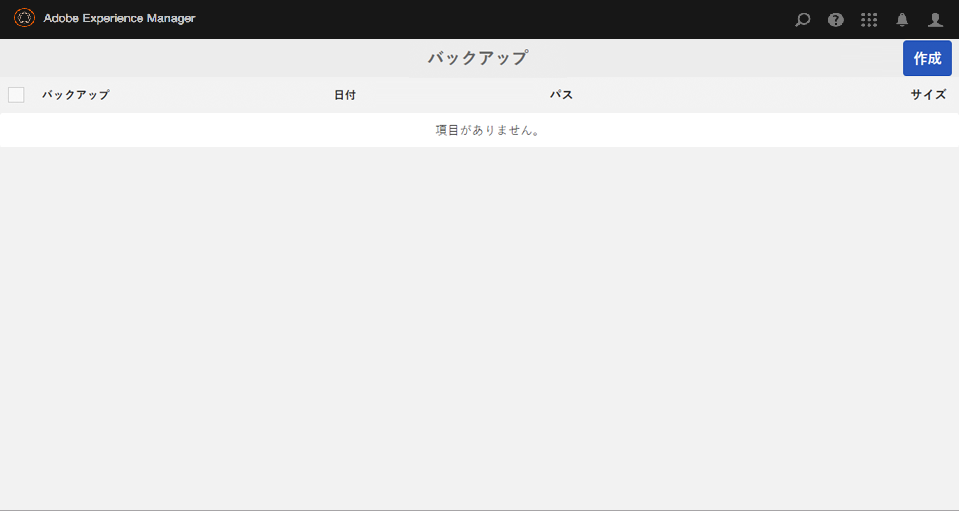
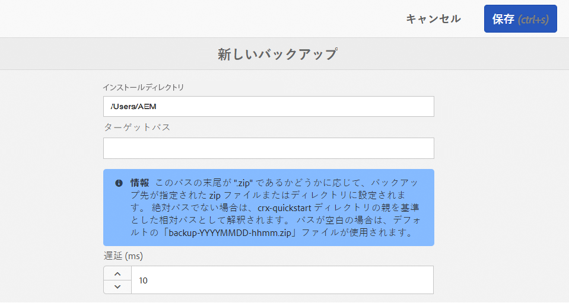
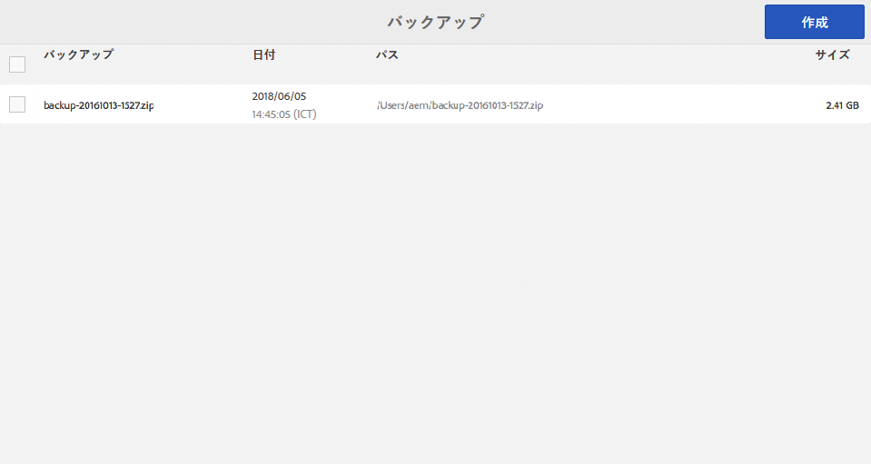

# バックアップと復元{#backup-and-restore}

AEM でリポジトリコンテンツをバックアップおよび復元するには、次の 2 つの方法があります。

* リポジトリの外部バックアップを作成して、安全な場所にそのバックアップを保存することができます。リポジトリが壊れた場合、以前の状態に復元できます。
* リポジトリコンテンツの内部バージョンを作成できます。内部バージョンはコンテンツと共にリポジトリ内に保存されるので、変更または削除したノードやツリーを迅速に復元できます。

## 一般 {#general}

ここで説明する手法は、システムバックアップおよび復元に適用されます。

消失したコンテンツのごく一部のバックアップや復元をおこなう必要がある場合、システムの復元は必ずしも必要ではありません。

* 別のシステムからパッケージ経由でデータを取得できます。
* または、バックアップを一時システムに復元し、コンテンツパッケージを作成して、それをシステムのそのコンテンツが消失した場所にデプロイすることができます。

詳しくは、後述の[パッケージバックアップ](/help/sites-administering/backup-and-restore.md#package-backup)を参照してください。

## タイミング {#timing}

バックアップは、データストアのガベージコレクションと同時に実行しないでください。同時に実行すると、この両方のプロセスの結果に悪影響を及ぼす可能性があります。

## オフラインバックアップ {#offline-backup}

オフラインバックアップはいつでも実行できます。このバックアップをおこなうには AEM を停止する必要がありますが、オンラインバックアップと比較して、所要時間については非常に効率的です。

ほとんどの場合、ファイルシステムのスナップショットを使用して、その時点でのストレージの読み取り専用コピーを作成することになります。オフラインバックアップを作成するには、次の手順を実行します。

* アプリケーションを停止します。
* スナップショットのバックアップを作成します。
* アプリケーションを起動します。

通常、スナップショットのバックアップは数秒しかかからないので、全体的な停止時間は数分未満になります。

## オンラインバックアップ {#online-backup}

このバックアップ方式では、AEM など、リポジトリ下にデプロイされているアプリケーションも含めて、リポジトリ全体のバックアップを作成します。バックアップには、コンテンツ、バージョン履歴、設定、ソフトウェア、ホットフィックス、カスタムアプリケーション、ログファイル、検索用インデックスなどが含まれます。クラスター化を使用していて、（物理的に、またはソフトリンクを使用して）`crx-quickstart` のサブディレクトリが共有フォルダーとして指定されている場合は、共有ディレクトリもバックアップされます。

後でリポジトリ全体（とアプリケーション）を復元できます。

この方法は、「ホット」または「オンライン」バックアップとして動作するので、リポジトリの実行中に実行できます。したがって、バックアップの実行中はリポジトリを使用できます。このメソッドは、デフォルトのTarストレージベースのリポジトリインスタンスに対して機能します。

バックアップの作成には次のオプションがあります。

* AEM の統合バックアップツールを使用して、ディレクトリにバックアップします。
* ファイルシステムのスナップショットを使用して、ディレクトリにバックアップします。

どちらの場合も、バックアップによってリポジトリのイメージ（スナップショット）が作成されます。その後、システムのバックアップエージェントによって、そのイメージが実際に専用のバックアップシステム（テープドライブ）に送信されます。

>[!NOTE]
>
>If AEM Online Backup feature is used on an AEM instance which has a custom blobstore configuration, it is recommended to configure the path of datastore to be outside the &quot; `crx-quickstart`&quot; directory and backup the datastore separately.

>[!CAUTION]
>
>オンラインバックアップのバックアップ対象はファイルシステムのみです。リポジトリコンテンツやリポジトリファイルをデータベースに保存している場合は、そのデータベースを個別にバックアップする必要があります。AEM を MongoDB で使用している場合、[MongoDB のネイティブバックアップツール](https://docs.mongodb.org/manual/tutorial/backup-with-mongodump/)の使用方法のドキュメントを参照してください。

### AEM オンラインバックアップ {#aem-online-backup}

リポジトリのオンラインバックアップでは、バックアップファイルを作成、ダウンロードおよび削除できます。これは「ホット」（つまり「オンライン」）バックアップ機能なので、リポジトリが通常どおり読み取り／書き込みモードで使用されているときに実行できます。

>[!CAUTION]
>
>Do not run AEM Online Backup concurrently with [Datastore Garbage Collection](/help/sites-administering/data-store-garbage-collection.md) or [Revision Cleanup](/help/sites-deploying/revision-cleanup.md#how-to-run-offline-revision-cleanup). これらを同時に実行すると、システムのパフォーマンスが低下します。

バックアップの開始時に、「**ターゲットパス**」か「**遅延**」（またはその両方）を指定できます。

**ターゲットパス** ：バックアップファイルは、通常、quickstart jarファイル(.jar)を含むフォルダーの親フォルダーに保存されます。 例えば、AEM jarファイルが/InstallationKits/AEMの下にある場合、バックアップは/InstallationKitsの下に生成されます。 ターゲットの場所を自由に指定することもできます。

**ターゲットパス**&#x200B;がディレクトリの場合、リポジトリのイメージはこのディレクトリに作成されます。同じディレクトリが複数回（または常に）バックアップの保存用に使用される場合は、次のようになります。

* リポジトリ内で修正されたファイルは、ターゲットパス内でも同様に修正されます。
* リポジトリ内で削除されたファイルは、ターゲットパス内でも削除されます。
* リポジトリ内で作成されたファイルは、ターゲットパス内でも作成されます。

>[!NOTE]
>
>**TargetPath** が拡張子 **.zip** のファイル名に設定されている場合、リポジトリは一時ディレクトリにバックアップされ、その後この一時ディレクトリのコンテンツが圧縮されて ZIP ファイルに格納されます。
>
>この方式は次の理由で推奨されません。
>
>* バックアップ処理中に追加のディスク領域が必要になります（一時ディレクトリと zip ファイル分）。
>* 圧縮処理はリポジトリによっておこなわれるので、パフォーマンスに影響する場合があります。
>* バックアッププロセスの遅延につながります。
>* Java 1.6 までは、4 GB までのサイズの ZIP ファイルしか作成できません。

>
>
バックアップ形式としてZIPを作成する必要がある場合は、ディレクトリにバックアップし、圧縮プログラムを使用してzipファイルを作成する必要があります。

**遅延** ：リポジトリのパフォーマンスに影響を与えないように遅延時間（ミリ秒）を示します。 デフォルトでは、リポジトリのバックアップはフルスピードで実行されます。他のタスクの速度を低下させないように、オンラインバックアップの作成速度を下げることができます。

遅延時間を非常に大きく取る場合は、オンラインバックアップに 24 時間以上かけないでください。24 時間を超えた場合はバックアップを破棄してください。バックアップに一部のバイナリしか含まれない可能性があります。一般的には、1 ミリ秒遅延させると CPU 使用率は 10％になり、10 ミリ秒遅延させると 3％未満になります。遅延時間の合計（秒）は、「リポジトリサイズ（MB） x 遅延（ミリ秒）÷ 2」（zip オプションを使用する場合）、または「リポジトリサイズ（MB） x 遅延（ミリ秒）÷ 4」（ディレクトリにバックアップする場合）という式を使って予測できます。つまり、1 ミリ秒の遅延を指定して 200 MB のリポジトリをディレクトリにバックアップする場合、バックアップ時間は約 50 秒増加します。

>[!NOTE]
>
>処理の内部詳細については、[AEM オンラインバックアップの仕組み](#how-aem-online-backup-works)を参照してください。

バックアップを作成するには：

1. 管理者として AEM にログインします。

1. Go to **Tools - Operations - Backup.**
1. 「**作成**」をクリックします。バックアップコンソールが開きます。

   

1. バックアップコンソールで、「**[ターゲットパス](#aem-online-backup)**」と「**[遅延](#aem-online-backup)**」を指定します。

   

   >[!NOTE]
   >
   >バックアップコンソールは、次のアドレスからもアクセスできます。
   >
   >
   >` https://<*hostname*>:<*port-number*>/libs/granite/backup/content/admin.html`

1. 「**保存**」をクリックします。進行状況バーに、バックアップの進行状況が示されます。

   >[!NOTE]
   >
   >いつでも実行中のバックアップを&#x200B;**キャンセル**&#x200B;できます。

1. バックアップが完了すると、バックアップウィンドウに zip ファイルが表示されます。

   

   >[!NOTE]
   >
   >不要になったバックアップファイルは、このコンソールを使用して削除できます。左側のウィンドウでバックアップファイルを選択し、「**削除**」をクリックします。

   >[!NOTE]
   >
   >ディレクトリにバックアップした場合：バックアッププロセスの完了後、AEM によってターゲットディレクトリに書き込まれることはありません。

### AEM オンラインバックアップの自動化 {#automating-aem-online-backup}

オンラインバックアップは可能な限り、システムの負荷がほとんどない時間帯（早朝など）に実行すべきです。

Backups can be automated using the `wget` or `curl` HTTP clients. 以下に、curl を使用したバックアップの自動化の例を示します。

#### デフォルトのターゲットディレクトリへのバックアップ {#backing-up-to-the-default-target-directory}

>[!CAUTION]
>
>以下の例では、`curl` コマンドの様々なパラメーターをお使いのインスタンスに合わせて設定する必要があります。例えば、ホスト名（`localhost`）、ポート（`4502`）、管理者パスワード（`xyz`）およびファイル名（`backup.zip`）が該当します。

```shell
curl -u admin:admin -X POST http://localhost:4502/system/console/jmx/com.adobe.granite:type=Repository/op/startBackup/java.lang.String?target=backup.zip
```

バックアップファイルまたはディレクトリは、`crx-quickstart` フォルダーを含むフォルダーの親フォルダー内に作成されます（ブラウザーを使用してバックアップを作成する場合と同様です）。For example, if you have installed AEM in the directory `/InstallationKits/crx-quickstart/`, then the backup is created in the `/InstallationKits` directory.

curl コマンドはすぐに終了するので、このディレクトリを監視して、zip ファイルが作成されているかを必ず確認してください。バックアップの作成中、一時ディレクトリ（ディレクトリ名は、最終の zip ファイルの名前に基づいて付けられる）が出現し、最終的にこのディレクトリが zip で圧縮されます。次に例を示します。

* 作成される zip ファイルの名前：`backup.zip`
* name of temporary directory: `backup.f4d5.temp`

#### デフォルトのターゲットディレクトリ以外へのバックアップ {#backing-up-to-a-non-default-target-directory}

通常、バックアップファイルまたはディレクトリは、`crx-quickstart` フォルダーを含むフォルダーの親フォルダー内に作成されます。

If you want to save your backup (of either sort) to a different location you can set an absolute path ``to the `target` parameter in the `curl` command.

For example, to generate `backupJune.zip` in the directory `/Backups/2012`:

```shell
curl -u admin:admin -X POST http://localhost:4502/system/console/jmx/com.adobe.granite:type=Repository/op/startBackup/java.lang.String?target=/Backups/2012/backupJune.zip"
```

>[!CAUTION]
>
>異なるアプリケーションサーバー（JBoss など）を使用している場合、ターゲットディレクトリに書き込みできないという理由でオンラインバックアップが期待どおりに動作しないことがあります。その場合は、サポートまでお問い合わせください。

>[!NOTE]
>
>バックアップは、[AEM に付属する MBean を使用](/help/sites-administering/jmx-console.md)して開始することもできます。

### ファイルシステムのスナップショットのバックアップ {#filesystem-snapshot-backup}

ここで説明する手順は、サイズの大きいリポジトリに特に適しています。

>[!NOTE]
>
>このバックアップ方式を使用する場合は、システムでファイルシステムのスナップショット機能がサポートされる必要があります。例えば、Linux の場合、ファイルシステムを論理ボリュームに配置する必要があります。

1. AEM がデプロイされているファイルシステムのスナップショットを取得します。

1. ファイルシステムのスナップショットをマウントします。
1. バックアップを実行してスナップショットのマウントを解除します。

### How AEM Online Backup Works {#how-aem-online-backup-works}

AEM オンラインバックアップは、バックアップ対象のデータと作成されるバックアップファイルの整合性を確保するための一連の内部アクションにより構成されます。以下に、関心のある開発者向けに、これらの内部アクションについて示します。

オンラインバックアップでは次のアルゴリズムを使用します。

1. zip ファイル作成時の最初の手順は、ターゲットディレクトリを作成または指定することです。

   * zip ファイルにバックアップする場合、一時ディレクトリが作成されます。The directory name starts with `backup.` and ends with `.temp`; for example `backup.f4d3.temp`.
   * ディレクトリにバックアップする場合は、ターゲットーパスで指定された名前が使用されます。既存のディレクトリを使用できます。使用しない場合は、新しいディレクトリが作成されます。

      バックアップの開始時に、ターゲットディレクトリ内に `backupInProgress.txt` という空のファイルが作成されます。このファイルは、バックアップの完了時に削除されます。

1. すべてのファイルが、ソースディレクトリからターゲットディレクトリ（zip ファイルを作成する場合は一時ディレクトリ）にコピーされます。リポジトリの破損を防ぐため、セグメントストアはデータストアの前にコピーされます。 バックアップの作成時、インデックスとキャッシュデータは省略されます。As a result, data from `crx-quickstart/repository/cache` and `crx-quickstart/repository/index` is not included in the backup. プロセスの進行状況バーのインジケーターは、zipファイルを作成する場合は0 ～ 70%になり、zipファイルを作成しない場合は0 ～ 100%になります。

1. バックアップが既存のディレクトリに作成される場合は、ターゲットディレクトリ内にある「古い」ファイルが削除されます。古いファイルとは、ソースディレクトリ内に存在しないファイルのことです。

ファイルは、4 つのステージでターゲットディレクトリにコピーされます。

1. コピーの第 1 段階（進行状況インジケーターは zip ファイルの作成時は 0～63％、zip ファイルが作成されない場合は 0～90％）では、リポジトリの通常実行中にすべてのファイルがコピーされます。このプロセスには、次の2つのフェーズがあります。

   * フェーズ A - データストアを除くすべてのものがコピーされます（遅延付き）。
   * フェーズ B - データストアのみがコピーされます（遅延付き）。

1. 第 2 コピーステージ（進行状況インジケーターの値は zip ファイルの作成時は 63～65.8％、zip ファイルを作成しない場合は 90～94％）では、第 1 コピーステージの開始以降にソースディレクトリで作成または変更されたファイルのみがコピーされます。リポジトリでのアクティビティに応じて、ファイルがまったくコピーされないことも、（第 1 コピーステージは通常時間がかかるので）多数のファイルがコピーされることもあります。コピー処理は、最初のステージ（遅延があるフェーズAとフェーズB）に似ています。
1. 第 3 コピーステージ（進行状況インジケーターの値は zip ファイルの作成時は 65.8～68.6％、zip ファイルを作成しない場合は 94～98％）では、第 2 コピーステージの開始以降にソースディレクトリで作成または変更されたファイルのみがコピーされます。リポジトリでのアクティビティに応じて、ファイルがまったくコピーされないことも、（第 2 コピーステージは通常高速なので）わずかなファイルがコピーされることもあります。コピー処理は、フェーズAとフェーズBの2番目のステージに似ていますが、遅延はありません。
1. ファイルコピーステージ 1～3 は、リポジトリの実行中すべて同時に実行されます。第 3 コピーステージの開始以降にソースディレクトリで作成または変更されたファイルのみがコピーされます。リポジトリのアクティビティに応じて、コピーするファイルがないことも、（第 2 コピーステージは通常非常に高速なので）ごくわずかなファイルがコピーされることもあります。進行状況インジケーターは、zip ファイルの作成時は 68.6～70％、zip ファイルを作成しない場合は 98～100％を示します。このコピープロセスは第 3 ステージと似ています。
1. ターゲットに応じて、次の処理が実行されます。

   * zip ファイルが指定されている場合、この時点でこのファイルが一時ディレクトリから作成されます。進行状況インジケーターは 70～100％を示します。その後、一時ディレクトリが削除されます。
   * ターゲットがディレクトリの場合は、バックアップが完了したことを示すために、`backupInProgress.txt` という空のファイルが削除されます。

## バックアップの復元 {#restoring-the-backup}

バックアップは次のように復元できます。

* ファイルシステムのスナップショットのバックアップを実行した場合は、そのシステムのイメージを復元できます。
* バックアップを zip ファイルとして作成した場合は、新しいフォルダーにコンテンツを解凍し、その解凍先から AEM を起動します。

## パッケージバックアップ {#package-backup}

コンテンツをバックアップおよび復元するには、いずれかのパッケージマネージャーを使用できます。コンテンツパッケージ形式を使用してコンテンツのバックアップおよび復元がおこなわれます。パッケージマネージャーでは、パッケージをより柔軟に定義および管理できます。

これらの個別のコンテンツパッケージ形式の機能およびトレードオフについて詳しくは、[パッケージの使用方法](/help/sites-administering/package-manager.md)を参照してください。

### バックアップの範囲 {#scope-of-backup}

パッケージマネージャーまたはコンテンツジッパーを使用してノードをバックアップすると、CRX では以下の情報が保存されます。

* 選択したツリーの下にあるリポジトリコンテンツ。
* バックアップするコンテンツに使用されているノードタイプの定義
* バックアップするコンテンツに使用されている名前空間の定義

バックアップの際に、AEM では次の情報が失われます。

* バージョン履歴

