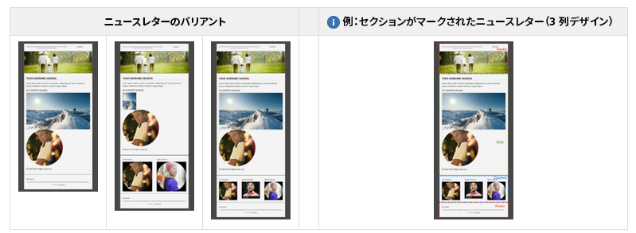

# 電子メールテンプレートのベストプラクティス {#best-practices-for-email-templates}

>[!CAUTION]
>
>AEM電子メールコンポーネントは非推奨となりました。 コンテンツとスタイルを結合する電子メールの特性により、AEMで標準搭載された電子メールコンポーネントは、プロジェクトに必要なコンポーネントにカスタムスタイルを実装する必要があるので、顧客に対して限定的な再利用が可能になります。
>
>電子メールコンポーネントはプロジェクトレベルで実装でき、非推奨のAEM電子メールコンポーネントはその実現方法を示します。 ただし、これらの非推奨コンポーネントはプロジェクトでは使用しないでください。

このドキュメントでは、適切な電子メールキャンペーンテンプレートを作成するための、電子メールデザインに関するいくつかのベストプラクティスについて説明します。

AEM で利用可能なデモキャンペーンは、これらすべてのベストプラクティスに従っています。デモキャンペーンでのベストプラクティスの実装方法は、各ベストプラクティスで説明しています。

独自のニュースレターを作成する際に、これらのベストプラクティスを利用してください。

>[!NOTE]
>
>すべてのキャンペーンコンテンツは、タイプの `master` ページの下に作成する必要があり `cq/personalization/components/ambitpage`ます。
>
>例えば、計画中のキャンペーン構造が
>
>`/content/campaigns/teasers/en/campaign-promotion-global`
>
>ページの下にあることを確認する必要があり `master` ます
>
>`/content/campaigns/teasers/master/en/campaign-promotion-global`

>[!NOTE]
>
>When creating a mail template for Adobe Campaign, you must include the property **acMapping** with the value **mapRecipient** in the **jcr:content** node of the template, or you will not be able to select the Adobe Campaign template in **Page Properties** of AEM (field is disabled).

## テンプレート／ページコンポーネント {#template-page-component}

***/libs/mcm/campaign/components/campaign_newsletterpage***

<table>
 <tbody>
  <tr>
   <td><strong>ベストプラクティス</strong></td>
   <td><strong>実装</strong></td>
  </tr>
  <tr>
   <td>
ドキュメントタイプを指定して、一貫したレンダリングを確実におこなうようにします。
 
先頭に DOCTYPE を追加します（HTML または XHTML）。
 </td>
   <td>
Is configurable by design changing the <i>cq:doctype</i> property in<i>"/etc/designs/default/jcr:content/campaign_newsletterpage"</i>
 
デフォルトは、"XHTML" です。
 
&lt;!DOCTYPE html PUBLIC "-//W3C//DTD XHTML 1.0 Transitional//EN" "https://www.w3.org/TR/xhtml1/DTD/xhtml1-transitional.dtd"&gt;
 
"HTML_5" に変更できます。
 
&lt;!DOCTYPE HTML&gt;
 </td>
  </tr>
  <tr>
   <td>
文字定義を指定して、特殊文字の正しいレンダリングを確実におこなうようにします。
 
追加CHARSET宣言（iso-8859-15、UTF-8など）を&lt;head&gt;に
 </td>
   <td>
UTF-8 に設定します。
 
&lt;meta http-equiv="content-type" content="text/html; charset=UTF-8"&gt;
 </td>
  </tr>
  <tr>
   <td>
&lt;table&gt;要素を使用して、すべての構造をコード化します。 より複雑なレイアウトの場合、テーブルをネストして複雑な構造を構築します。
 
電子メールは、css がなくても見やすくする必要があります。
 </td>
   <td>
テーブルは、コンテンツ構築でテンプレート全体にわたって使用されます。現在のところ、最大で 4 つのネストされたテーブルを使用しています（1 つの基本テーブル + 最大 3 つのネストレベル）。
 
&lt;div&gt;タグは、コンポーネントの編集を適切に行うために、作成者モードでのみ使用します。
 </td>
  </tr>
  <tr>
   <td>要素の属性（cellpadding、valign、width など）を使用してテーブルの寸法を設定します。これは、ボックスモデル構造を強制します。</td>
   <td>
All tables contain necessary attributes like <i>border</i>, <i>cellpadding</i>, <i>cellspacing</i> and <i>width</i>.
 
To harmonize element positioning inside tables, all table cells have the attribute <i>valign="top"</i> being set.
 </td>
  </tr>
  <tr>
   <td>
可能であれば、モバイルでの使いやすさを考慮します。メディアクエリーを使用して、小さい画面でのテキストサイズを大きくして、リンク用に親指サイズのヒット領域を提供します。
 
設計で可能であれば、電子メールをレスポンシブにします。
 </td>
   <td>CSS スタイルがデモデザインの説明で使用されている限り、メディアクエリーを使用してモバイルフレンドリーなバージョンを提供します。</td>
  </tr>
  <tr>
   <td>すべての CSS を最初に配置するよりも、インライン CSS が優れています。</td>
   <td>
基盤となる HTML 構造をより効果的に実演し、ニュースレターの構造を容易にカスタマイズできるようにするには、一部の CSS 定義のみをインラインにします。
 
基本スタイルとテンプレートのバリエーションが、ページの&lt;head&gt;内のスタイルブロックに抽出されました。 ニュースレターの最終版では、これらの CSS 定義は、HTML にインラインになっている必要があります。自動インライン化メカニズムが計画されていますが、現在は利用できません。
 </td>
  </tr>
  <tr>
   <td>CSS をシンプルに保ちます。複合スタイル宣言、短縮形コード、CSS レイアウトプロパティ、複雑なセレクターおよび疑似要素を避けます。</td>
   <td>CSS スタイルがデモデザインの説明で使用されている限り、推奨される CSS は次のようになります。</td>
  </tr>
  <tr>
   <td>電子メールの幅は、最大 600 ～ 800 pixel にする必要があります。これは、多くのクライアントで提供されるプレビューパネルのサイズ内での動作を優れたものにします。</td>
   <td>The <i>width</i> of content table is limited to 600px in demo design.</td>
  </tr>
 </tbody>
</table>

### 画像 {#images}

/libs/mcm/campaign/components/image

| **ベストプラクティス** | **実装** |
|---|---|
| Add *alt* attributes to images | The *alt* attribute has been defined as mandatory for the image component. |
| Use *jpg* instead of *png* format for images | 画像は、画像コンポーネントでは、常に、 JPG として提供されます。 |
| Use `` element instead of background images in a table. | テンプレートでは、背景画像データは使用されていません。 |
| 写真に style=&quot;display block&quot; 属性を追加します。Gmail での表示を向上できます。 | All images contain per default the *style=&quot;display block&quot;* attribute. |

### テキストとリンク {#text-and-links}

/libs/mcm/campaign/components/heading, /libs/mcm/campaign/components/textimage

<table>
 <tbody>
  <tr>
   <td><strong>ベストプラクティス</strong></td>
   <td><strong>実装</strong></td>
  </tr>
  <tr>
   <td>CSSではスタイルの代わりにhtml &lt;font&gt;を使用(font-family)</td>
   <td>RichTextEditor（例：textimage コンポーネントに含まれるもの）は、選択したテキストへのフォントファミリーおよびフォントサイズの選択および適用をサポートするようになりました。これらは&lt;font&gt;タグとしてレンダリングされます。</td>
  </tr>
  <tr>
   <td>Use basic, cross-platform fonts such as <i>Arial, Verdana, Georgia</i> and <i>Times New Roman</i>.</td>
   <td>
ニュースレターのデザインによって異なります。
 
デモデザインでは、Helvetica フォントが使用されますが、存在しない場合は一般的なサンセリフフォントに戻ります。
 </td>
  </tr>
 </tbody>
</table>

### 汎用 {#generic}

| **ベストプラクティス** | **実装** |
|---|---|
| W3C バリデーターを使用して、HTML コードを修正します。すべての開始タグが適切に閉じられるようにします。 | コードは検証されました。For XHTML transitional Doctype only the missing xmlns attribute for the `<html>` element is missing. |
| JavaScriptやFlashを使用して問題を回避。これらのテクノロジーは、電子メールクライアントではほとんどサポートされていません。 | JavaScript も Flash も、ニュースレターテンプレートでは使用していません。 |
| マルチパート送信では、プレーンテキストバージョンを追加します。 | 新しいウィジェットは、ページプロパティに組み込まれ、ページコンテンツからプレーンテキストを簡単に抽出できます。これは、最終的なプレーンテキストバージョンの開始点として使用できます。 |

## キャンペーンニュースレターのテンプレートと例 {#campaign-newsletter-templates-and-examples}

AEM には、キャンペーンニュースレターを作成するためのいくつかのテンプレートおよびコンポーネントが標準で付属しています。これらのテンプレートおよびコンポーネントを使用して、カスタムのニュースレターを作成できます。

### テンプレート {#templates}

基盤を提供し、様々なコンテンツの流れを可能にするために、3 つの少しずつ違ったテンプレートのタイプが標準で用意されています。これらを簡単に使用してカスタムニュースレターを作成できます。

All have a **header**, a **footer** and a **body** section. Below the body section, each template differs in **column design** (1, 2 or 3 columns).

### コンポーネント {#components}

現在、[キャンペーンテンプレート内で使用可能なコンポーネントが 7 つ](/help/sites-authoring/adobe-campaign-components.md)あります。これらのコンポーネントは、すべてアドビのマークアップ言語である **HTL** に基づいています。

| **コンポーネント名** | **コンポーネントパス** |
|---|---|
| 見出し | /libs/mcm/campaign/components/heading |
| 画像 | /libs/mcm/campaign/components/image |
| テキストおよびパーソナライゼーション | /libs/mcm/campaign/components/personalization |
| Textimage | /libs/mcm/campaign/components/textimage |
| リンク | /libs/mcm/campaign/components/reference |
| Scene7 画像テンプレート | /libs/mcm/campaign/s7image |
| ターゲット参照 | /libs/mcm/campaign/components/reference |

>[!NOTE]
>
>これらのコンポーネントは、メールコンテンツに最適化されています。つまり、このドキュメントで説明したベストプラクティスを厳密に順守します。その他の標準提供コンポーネントを使用すると、通常、これらのルールに違反します。

これらのコンポーネントについて詳しくは、[Adobe Campaign コンポーネント](/help/sites-authoring/adobe-campaign-components.md)を参照してください。