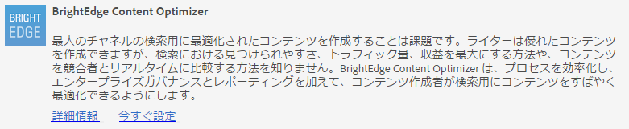
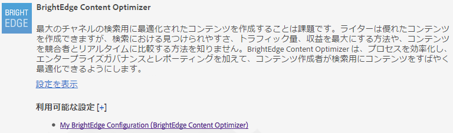
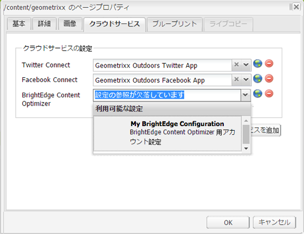
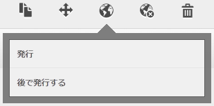
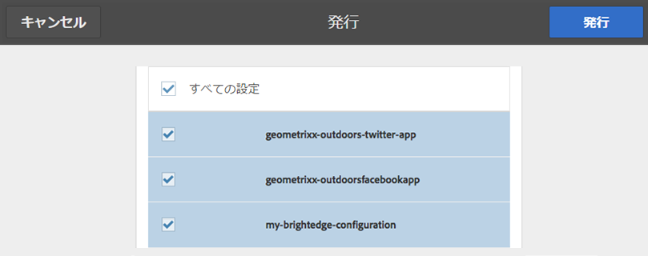

# BrightEdge Content Optimizer との結合{#integrating-with-brightedge-content-optimizer}

BrightEdge クラウド設定を作成して、AEM で BrightEdge アカウントの資格情報を使用して接続できるようにします。複数のアカウントを使用している場合、複数の設定を作成できます。

設定を作成する際には、タイトルを指定します。ユーザーが設定を BrightEdge アカウントと関連付けられるように、タイトルは、わかりやすいものである必要があります。ページ作成者または管理者が Web ページを BrightEdge アカウントと関連付ける際に、このタイトルがドロップダウンリストに表示されます。

1. レールで、ツール／操作／クラウド／クラウドサービスをクリックします。
1. 「BrightEdge Content Optimizer」セクションに表示されるリンクをクリックします。BrightEdge 設定が作成されているかどうかによって、リンクテキストが決まります。

   * 今すぐ設定：このリンクは、設定が作成されていない場合に表示されます。
   * 設定を表示：このリンクは、1 つ以上の設定が作成されている場合に表示されます。

   

1. 「設定を表示」をクリックした場合、「利用可能な設定」の隣にある + リンクをクリックします。
1. 設定のタイトルを入力します。オプションで、リポジトリに設定を保存するのに使用されるノードの名前を入力します。「作成」をクリックします。
1. BrightEdge Content Optimizer 設定ダイアログで、BrightEdge アカウントのユーザー名とパスワードを入力して、「OK」をクリックします。

## BrightEdge 設定の編集 {#editing-a-brightedge-configuration}

必要に応じて、BrightEdge 設定のユーザー名とパスワードを変更します。変更は、設定を使用するすべてのページに影響します。

1. レールで、ツール／操作／クラウド／クラウドサービスをクリックします。
1. 「BrightEdge Content Optimizer」セクションで、「設定を表示」をクリックします。

   

1. 編集したい設定の名前をクリックします。
1. 「編集」をクリックし、プロパティ値を変更して、「OK」をクリックします。

## ページの BrightEdge 設定との関連付け {#associating-pages-with-a-brightedge-configuration}

ページを BrightEdge 設定に関連付けて、分析のためにページデータを BrightEdge サービスに送信します。ページを設定に関連付ける場合は、子ページが関連付けを継承します。通常、サイトのホームページを関連付けて、すべてのページからのデータが BrightEdge に送信されるようにします。

1. クラシック Web サイトコンソールを開きます。（[http://localhost:4502/siteadmin#/content](http://localhost:4502/siteadmin#/content)）
1. Web サイトツリーで、BrightEdge 設定を関連付けたいページを含むフォルダーまたはページを選択します。
1. ページのリストで、設定するページを右クリックして、「プロパティ」をクリックします。
1. 「クラウドサービス」タブで、「サービスを追加」ボタンをクリックし、クラウドサービスダイアログで BrightEdge Content Optimizer を選択して、「OK」をクリックします。
1. BrightEdge Content Optimizer リストで、ページに関連付ける BrightEdge 設定を選択して、「OK」をクリックします。

   

## BrightEdge 設定のアクティベート {#activating-a-brightedge-configuration}

パブリッシュインスタンスにレプリケートして、公開されたページが BrightEdge サービスとやり取りできるように、BrightEdge 設定をアクティベートします。

1. レールで、「サイト」をクリックし、BrightEdge 設定に関連付けられたページを参照して選択します。
1. 公開アイコンをクリックまたはタップして、「公開」をクリックまたはタップします。

   

1. 表示される設定のリストで、BrightEdge 設定が選択されていることを確認して、「公開」をクリックします。

   

