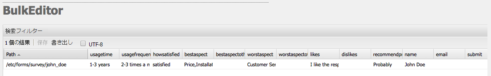
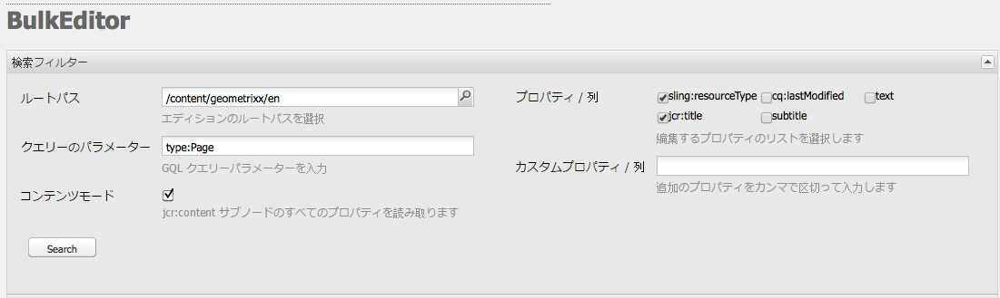
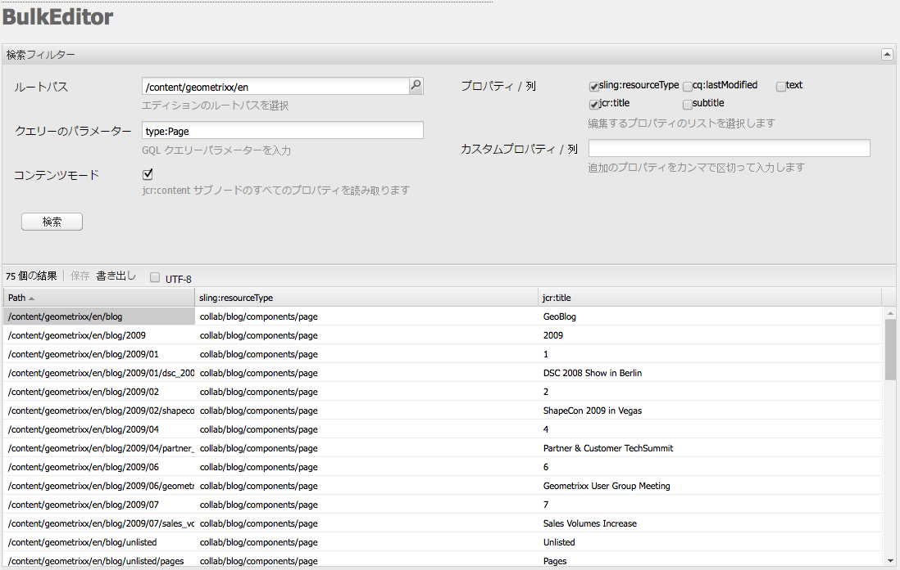

# Bulk Editor{#the-bulk-editor}

Bulk Editor を使用すると、以下のことができるので、視覚的なページコンテンツが不要な場合に非常に効率的な編集が可能になります。

* 複数のページからコンテンツを検索（および表示）。これは GQL（Google Query Language）を使用しておこないます。
* このコンテンツを Bulk Editor で直接編集。
* 変更を（元のページに）保存。
* このコンテンツをタブ区切り（.tsv）スプレッドシートファイルに書き出し。

>[!NOTE]
>
>コンテンツをリポジトリに読み込むこともできますが、デフォルトでは、**ツール**&#x200B;コンソールで使用できる Bulk Editor では無効になっています。

ここでは、**ツール**&#x200B;コンソールで Bulk Editor を操作する方法について説明します。通常、管理者は、Bulk Editor を使用して複数の項目を検索および編集します。これをおこなうには、GQL クエリを使用してテーブルに値を入力してから、作業対象のコンテンツ項目を選択します。作成者は通常、[製品リスト](/help/sites-authoring/default-components.md#productlist)コンポーネントを使用してアクセス可能なカスタマイズされた Bulk Editor アプリケーションの一部として Bulk Editor を使用します。

>[!CAUTION]
>
>AEM 6.4 の[クラシック UI の廃止](/help/release-notes/deprecated-removed-features.md) により、Bulk Editor も廃止もされました。したがって、今後、Bulk Editor が強化される予定はありません。

## Bulk Editor の使用例 {#example-use-case-for-the-bulk-editor}

例えば、特定のサーベイに回答したユーザーの名前と電子メールアドレスがすべて必要な場合は、Bulk Editor で提供可能な情報をスプレッドシートに書き出すことができます。

このような使用例の説明が、Geometrixx Web サイトに含まれています。

1. **サポート**&#x200B;ページに移動して、**Customer Service Satisfaction** サーベイに移動します。
1. 「**フォームの最初**」の段落を&#x200B;**編集**&#x200B;します。ダイアログで「**詳細**」タブをクリックし、「**アクションの設定**」を展開して、「**データを表示**」をクリックします。

   

1. Bulk Editor は完全にカスタマイズ可能ですが、この例では、ユーザーはコンテンツの編集はできず、情報をスプレッドシートに書き出すことができるだけです。

   

## Bulk Editor を使用する方法 {#how-to-use-the-bulk-editor}

Bulk Editor では次のことが可能です。

* [クエリパラメーターに基づいてコンテンツを検索し、指定した結果のプロパティを列に表示し、このコンテンツを編集して変更を保存します。](#searching-and-editing-content)
* [このコンテンツをタブ区切りスプレッドシートに書き出します。](#exporting-content)

* [コンテンツをタブ区切りスプレッドシートから読み込みます。](#importing-content)

### コンテンツの検索と編集 {#searching-and-editing-content}

Bulk Editor を使用して複数の項目を同時に編集するには：

1. **ツール**&#x200B;コンソールで、**Importers** フォルダーをクリックして展開します。
1. 「**Bulk Editor**」をダブルクリックして開きます。
1. 選択要件を入力します。

<table>
 <tbody>
  <tr>
   <td>フィールド</td>
   <td>Property</td>
  </tr>
  <tr>
   <td>ルートパス</td>
   <td>Indicates the root path the bulk editor searches.  For example, <code>/content/geometrixx/en</code>. The bulk editor searches over all child nodes.</td>
  </tr>
  <tr>
   <td>クエリーのパラメーター</td>
   <td>Using GQL parameters, enter the search string you want the bulk editor to look for in the repository; for example, <code>type:Page</code> looks for all pages in the root path, <code>text:professional</code> looks for all pages that have the word "professional" in them, and <code>"jcr:title":English</code> looks for all pages that have "English" as the title. 文字列のみを検索できます。</td>
  </tr>
  <tr>
   <td>「コンテンツモード」チェックボックス</td>
   <td>検索結果の <code>jcr:content</code> サブノード内にプロパティが存在する場合は、このチェックボックスを選択します。 ページにのみ使用します。プロパティ名の前に <code>"jcr:content/"</code></td>
  </tr>
  <tr>
   <td>プロパティ／列</td>
   <td>Bulk Editor で返すプロパティのチェックボックスをチェックします。選択したプロパティは、結果ウィンドウの列見出しとなります。デフォルトでは、結果にはノードパスが表示されます。</td>
  </tr>
  <tr>
   <td>カスタムプロパティ／列</td>
   <td>「 <strong>プロパティ/列</strong> 」フィールドにリストされていない他のプロパティを入力します。これらのカスタムプロパティは、結果ペインに表示されます。複数のプロパティを追加する場合は、コンマでプロパティを区切ります。 <i>注意：</i> まだ存在しないカスタムプロパティを追加すると、AEM WCMは空のセルを表示します。 空白のセルを変更して保存すると、そのプロパティがノードに追加されます。新しく作成されたプロパティは、ノードタイプの制約とプロパティの名前空間に従う必要があります。</td>
  </tr>
 </tbody>
</table>

次に例を示します。

1. 「**検索**」をクリックします。Bulk Editor に結果が表示されます。
上記の例の場合は、指定した検索条件を満たすすべてのページが返され、要求した列を含めて表示されます。

   

1. 任意のセル内でダブルクリックして、必要な変更をおこないます。

   

1. 「**保存**」をクリックして変更を保存します（「**保存**」ボタンは、セルを編集後に有効になります）。

   >[!CAUTION]
   >
   >ここでおこなった変更は、リポジトリコンテンツ（「**パス**」で参照されているページなど）に書き込まれます。

#### その他の GQL クエリパラメーター {#additional-gql-query-parameters}

* **パス：** このパスの下にある検索ノードのみ。パスのプレフィックスを含む複数の用語を指定した場合は、最後の用語のみが考慮されます。
* **type:** 渡されたノード型のノードのみを返します。これには、プライマリとミックスインのタイプが含まれます。複数のノードタイプは、コンマで区切って指定できます。GQLは、指定された任意の型のノードを返します。
* **順序：** 指定したプロパティで結果を並べ替えます。コンマで区切った複数のプロパティ名を指定できます。結果を降順に並べるには、プロパティ名の先頭にマイナスを付けるだけです。例：order:-name。プラス記号を使用すると、結果が昇順で返されます。これもデフォルトです。
* **limit:** 間隔を使用して結果の数を制限します。例：limit:10..20間隔はゼロベースで、開始は両端を含み、両端は排他的であることに注意してください。また、開く間隔を指定することもできます。 limit:10...またはlimit:..20。ドットを省略し、1つの値のみを指定した場合、GQLは最大この数の結果を返します。例：limit:10（結果の最初の10件を返す）

### Exporting Content {#exporting-content}

コンテンツを書き出して、Excel のスプレッドシートで変更を加えることが必要になる場合があります。例えば、メーリングリストを書き出して、リストされているすべての電話番号の市外局番を Excel で直接変更したり、行を追加したりする場合などです。

コンテンツを書き出すには：

1. [コンテンツの検索と編集](#searching-and-editing-content)の説明に従ってコンテンツを検索します。
1. 「**書き出し**」をクリックして、変更をタブ区切りの Excel スプレッドシートに書き出します。AEM WCM でファイルのダウンロード場所が確認されます。

   >[!NOTE]
   >
   >デフォルトでは、変更は [Windows-1252](https://en.wikipedia.org/wiki/Windows-1252)（CP-1252 とも呼ばれる）でエンコードされます。「UTF-8」をチェックすると、変更を UTF-8 で書き出すことができます。

   

1. 場所を選択して、ファイルのダウンロードを確認します。
1. ファイルをダウンロードしたら、Microsoft Excel などのスプレッドシートプログラムから開くことができます。スプレッドシートプログラムにファイルが読み込まれ、スプレッドシート形式に変換されます。

   

### コンテンツの読み込み {#importing-content}

デフォルトでは、バルクエディタを開くと読み込み機能は非表示になります。 URLにパラメータ `hib=false` を追加するだけで、「 **インポート** 」ボタンが「バルクエディタ」ページに表示されます。 コンテンツは、タブ区切り( `.tsv`)ファイルから読み込むことができます。 読み込みが正しく機能するためには、列見出し（セルの最初の行）が、読み込み先のテーブルの列見出しと一致している必要があります。

>[!NOTE]
>
>コンテンツを再読み込みする場合は、該当するノードの以前のコンテンツをすべて削除します。重要な情報を上書きしないように注意してください。

コンテンツを読み込むには：

1. Bulk Editor を開きます。
1. URL `?hib=false` へ追加のリンク(例：
   `https://localhost:4502/etc/importers/bulkeditor.html?hib=false`
1. 「**読み込み**」をクリックします。
1. Select the `.tsv` file. データがリポジトリにインポートされます。