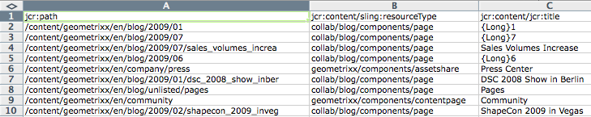

# バルクエディター{#the-bulk-editor}

バルクエディターを使用すると、以下のことができるので、視覚的なページコンテンツが不要な場合に効率的な編集が可能になります。

* 複数のページからコンテンツを検索（および表示）。これは GQL（Google Query Language）を使用して行います。
* そのコンテンツをバルクエディターで直接編集。
* 変更を（元のページに）保存。
* このコンテンツをタブ区切り（.tsv）スプレッドシートファイルに書き出し。

>[!NOTE]
>
>コンテンツをリポジトリに読み込むこともできますが、デフォルトでは、**ツール**&#x200B;コンソールで使用できる Bulk Editor では無効になっています。

この節では、**ツール**&#x200B;コンソールでバルクエディターを使用する方法について説明します。通常、管理者はバルクエディターを使用して複数の項目を検索および編集します。これを行うには、GQL クエリを使用してテーブルに値を入力してから、作業対象のコンテンツ項目を選択します。作成者は通常、[製品リスト](/help/sites-authoring/default-components.md#productlist)コンポーネントからアクセスできる、カスタマイズされたバルクエディターアプリケーションの一部としてバルクエディターを使用します。

>[!CAUTION]
>
>AEM 6.4 での[クラシック UI の廃止](/help/release-notes/deprecated-removed-features.md)により、バルクエディターも廃止されたので、アドビでバルクエディターをさらに強化する予定はありません。

## バルクエディターの使用例 {#example-use-case-for-the-bulk-editor}

例えば、特定のサーベイに回答したユーザーの名前とメールアドレスのすべてが必要な場合は、バルクエディターでその情報を提供して、スプレッドシートに書き出すことができます。

このようなユースケースを紹介する例が Geometrixx web サイトにあります。

1. **サポート**&#x200B;ページに移動し、**カスタマーサービス満足度**&#x200B;サーベイに移動します。
1. **フォームの開始**&#x200B;段落を&#x200B;**編集**&#x200B;します。ダイアログボックスで「**詳細**」タブをクリックし、「**アクションの設定**」を展開して、「**データを表示...**」をクリックします。

   

1. バルクエディターは完全にカスタマイズ可能ですが、この例では、ユーザーはコンテンツの編集はできず、情報をスプレッドシートに書き出すことのみが可能です。

   

## バルクエディターの使用方法 {#how-to-use-the-bulk-editor}

バルクエディターでは、次の操作を実行できます。

* [クエリパラメーターに基づいてコンテンツを検索し、指定した結果のプロパティを列に表示し、このコンテンツを編集して変更を保存します。](#searching-and-editing-content)
* [このコンテンツをタブ区切りスプレッドシートに書き出します。](#exporting-content)

* [コンテンツをタブ区切りスプレッドシートから読み込みます。](#importing-content)

### コンテンツの検索と編集 {#searching-and-editing-content}

バルクエディターを使用して複数の項目を同時に編集するには：

1. **ツール**&#x200B;コンソールで、**インポーター**&#x200B;フォルダーをクリックして展開します。
1. 「**バルクエディター**」をダブルクリックします。
1. 選択要件を入力します。

<table>
 <tbody>
  <tr>
   <td>フィールド</td>
   <td>プロパティ</td>
  </tr>
  <tr>
   <td>ルートパス</td>
   <td>バルクエディターで検索するルートパスを示します。 例えば、<code>/content/geometrixx/en</code> などです。バルクエディターはすべての子ノードを検索します。</td>
  </tr>
  <tr>
   <td>クエリパラメーター</td>
   <td>GQL パラメーターを使用して、リポジトリ内でバルクエディターが検索する検索文字列を入力します。例えば、「<code>type:Page</code>」と入力すると、ルートパス内のすべてのページを検索し、「<code>text:professional</code>」と入力すると、「professional」という単語が含まれているすべてのページを検索し、「<code>"jcr:title":English</code>」と入力すると、タイトルが「English」となっているすべてのページを検索します。文字列のみを検索できます。</td>
  </tr>
  <tr>
   <td>「コンテンツモード」チェックボックス</td>
   <td>このチェックボックスをオンにすると、検索結果に <code>jcr:content</code> サブノードが存在する場合に、その中のプロパティを読み取ることができます。ページにのみ使用します。プロパティ名の前には <code>"jcr:content/"</code></td>
  </tr>
  <tr>
   <td>プロパティ／列</td>
   <td>バルクエディターで返すプロパティのチェックボックスをオンにします。選択したプロパティは、結果ウィンドウの列見出しになります。デフォルトでは、ノードパスが結果に表示されます。</td>
  </tr>
  <tr>
   <td>カスタムプロパティ／列</td>
   <td>「<strong>プロパティ/列</strong>」フィールドのリストにない他のプロパティを入力します。これらのカスタムプロパティは、結果ウィンドウに表示されます。複数のプロパティを追加する場合は、コンマでプロパティを区切ります。<i>メモ：</i>まだ存在していないカスタムプロパティを追加すると、AEM WCM には空白のセルが表示されます。空のセルを変更して保存すると、プロパティがノードに追加されます。新しく作成されたプロパティは、ノードタイプの制約とプロパティの名前空間に従う必要があります。</td>
  </tr>
 </tbody>
</table>

例：

1. 「**検索**」をクリックします。バルクエディターに結果が表示されます。
前述の例では、指定した検索条件を満たすすべてのページが返され、リクエストした列で表示されます。

   

1. セルをダブルクリックすると、変更を加えることができます。

   

1. 「**保存**」をクリックして変更を保存します（「**保存**」ボタンは、セルの編集後に有効になります）。

   >[!CAUTION]
   >
   >ここで行った変更は、リポジトリコンテンツ（「**パス**」で参照されているページなど）に書き込まれます。

#### その他の GQL クエリパラメーター {#additional-gql-query-parameters}

* **path：**&#x200B;このパスの下のノードのみを検索します。path プレフィックスで複数の用語を指定した場合は、最後の用語のみが考慮されます。
* **type：**&#x200B;指定したノードタイプのノードのみを返します。これには、primary や mixin などのタイプが含まれます。複数のノードタイプをコンマで区切って指定できます。GQL は、指定したいずれかのタイプに該当するノードを返します。
* **order：**&#x200B;指定したプロパティを基準として結果を並べます。複数のプロパティ名をコンマで区切って指定できます。結果を降順で並べるには、プロパティ名にマイナス記号のプレフィックスを付けます（例：order:-name）。プラス記号を使用すると、結果は昇順に戻ります。これはデフォルトでもあります。
* **limit：**&#x200B;間隔を使用して結果の数を制限します（例：limit:10..20）。範囲はゼロベースであり、開始の値は含み、終了の値は除外されます。オープンを指定することもできます `interval:limit:10..` または `limit:..20`
ドットを省略して値を 1 つだけ指定した場合、GQL は最大でこの数の結果を返します。 例： `limit:10` （最初の 10 件の結果を返します）。

### コンテンツの書き出し {#exporting-content}

必要に応じて、コンテンツを Excel スプレッドシートに書き出して変更を加えます。例えば、メーリングリストを書き出して、リストされているすべての電話番号の市外局番を Excel で直接変更したり、行を追加したりすることができます。

コンテンツを書き出すには：

1. [コンテンツの検索と編集](#searching-and-editing-content)の説明に従ってコンテンツを検索します。
1. 「**書き出し**」をクリックして、変更をタブ区切りの Excel スプレッドシートに書き出します。AEM WCM でファイルのダウンロード場所が確認されます。

   >[!NOTE]
   >
   >デフォルトでは、変更は [Windows-1252](https://en.wikipedia.org/wiki/Windows-1252)（CP-1252 とも呼ばれる）でエンコードされます。「UTF-8」をチェックすると、変更を UTF-8 で書き出すことができます。

   

1. 場所を選択して、ファイルのダウンロードを確認します。
1. ファイルをダウンロードしたら、Microsoft® Excel などのスプレッドシートプログラムから開くことができます。スプレッドシートプログラムにファイルが読み込まれ、スプレッドシート形式に変換されます。

   

### コンテンツの読み込み {#importing-content}

デフォルトでは、バルクエディターを開くと、読み込み機能は非表示になります。パラメーター `hib=false` を URL に追加すれば、バルクエディターページに「**読み込み**」ボタンが表示されます。コンテンツは、任意のタブ区切り（`.tsv`）ファイルから読み込むことがでめます。読み込みが正常に機能するには、列見出し（セルの最初の行）が、読み込み先のテーブルの列見出しと一致している必要があります。

>[!NOTE]
>
>コンテンツをもう一度読み込む場合は、該当するノードの以前のコンテンツをすべて削除します。重要な情報を上書きしないように注意してください。

コンテンツを読み込むには：

1. バルクエディターを開きます。
1. 例えば、次のような手順を実行して、`?hib=false` を URL に追加します。
   `https://localhost:4502/etc/importers/bulkeditor.html?hib=false`
1. 「**読み込み**」をクリックします。
1. `.tsv` ファイルを選択します。データがリポジトリーに読み込まれます。
