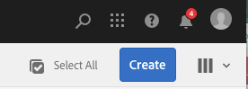
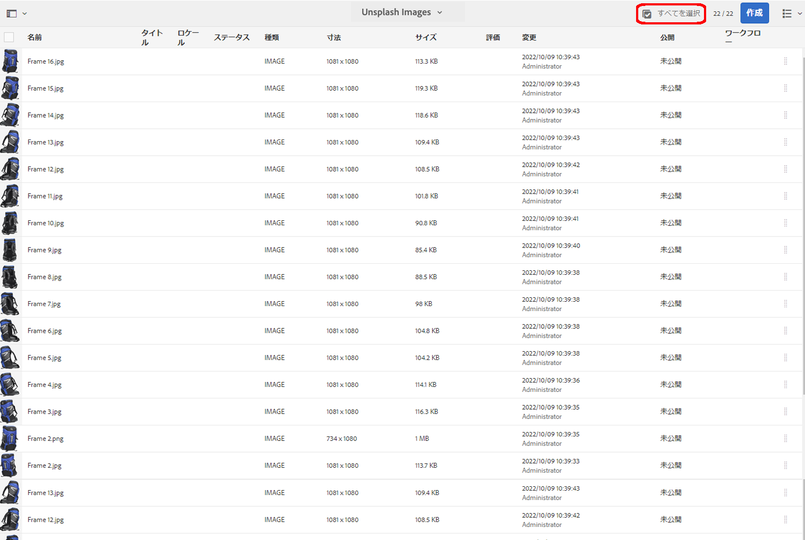
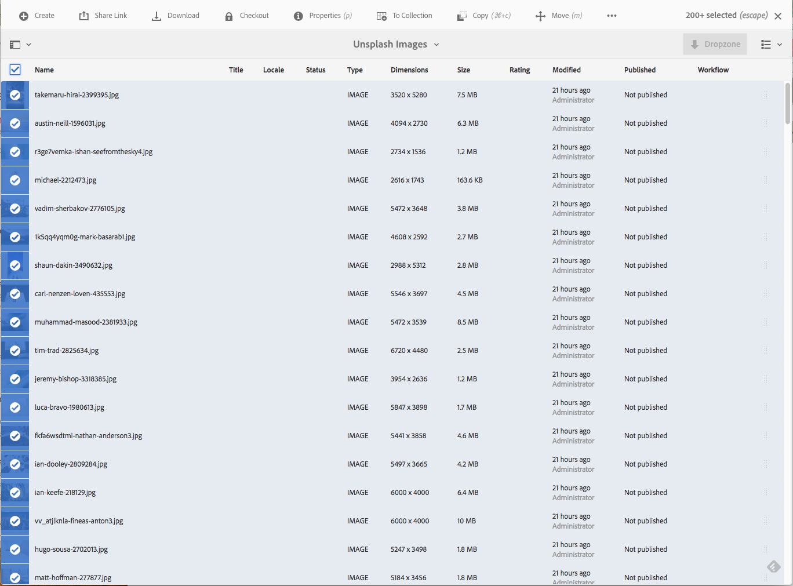

# バルク処理操作 {#bulk-processing-operations}

## 概要 {#introduction}

最新バージョンのAEMでは、「すべて選択」ボタンがすべての表示に拡張されています。リスト、列、カードの表示を参照してください。 「すべて選択」ボタンを使用すると、クライアントブラウザーに読み込まれて表示されるアセットやページだけでなく、特定のフォルダーまたはコレクション内のすべてのコンテンツが選択されるようになりました。

一括操作の主なアクションが有効になりました。 **移動**、 **削除** 、 **コピー**。 新しいダイアログで、バルク処理が使用できないアクションを顧客に通知します。

## How To Use {#how-to-use}

「す **べて選択** 」という新しいボタンが、「カード」、「リスト」、または「列」の表示に追加されました。 このボタンは、任意の表示で使用して、データセット内のすべての要素を選択できます。

以前のバージョンのAEMでは、クライアントブラウザーで読み込まれる内容が制限されていました。 この新しい変更は、バルク操作が実行される要素の数に関する混乱を避けるために導入されました。

現時点では、3つの操作がバルク処理に追加されています。

* 移動
* コピー
* 削除

今後、さらに多くの操作のサポートが追加される予定です。
この機能を使用するには、ページまたはアセットで一括操作を実行するフォルダーまたはコレクションに移動する必要があります。

次に、次に示すいずれかの表示を選択します。

### カード表示 {#card-view}

### カード表示での一括選択 {#bulk-selection-in-card-view}

アセットまたはページは、右上の「すべてを **選択** 」ボタンを使用して一括して選択できます。

 

### リスト表示 {#list-view}

リスト表示についても同様です。

### Bulk Selection in List View {#bulk-selection-in-list-view}

リスト表示で、「す **べて選択** 」ボタンを使用するか、左側のチェックボックスを使用して一括選択を行います。

 

### 列表示 {#column-view}

### 列表示での一括選択 {#bulk-selection-in-column-view}

## 一括有効化操作 {#bulk-enabled-operations}

選択後、次の3つのバルク有効化アクションのいずれかを実行できます。 **移動**、 **コピー** 、 **削除**。

ここで、 **** 移動操作は、上で選択したアセットに対して実行されます。 どの表示でも、これにより、画面に読み込まれたアセットだけでなく、すべてのアセットが選択した場所に移動されます。

バルクが有効になっていない他の操作( **ダウンロードなど)では** 、ブラウザーに読み込まれた要素のみが操作に含まれることを示す警告が表示されます。

